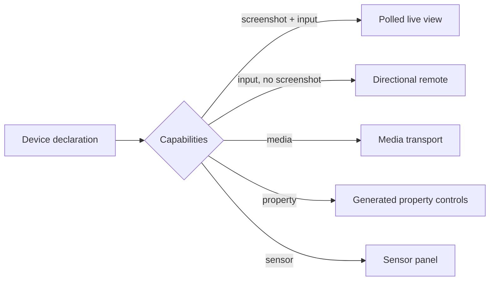

# UI Architecture

## Purpose Of This Document

Describe two things: the **operator surface** this scenario builds — its
information architecture, design principles, and shared primitives — and the
canonical layout of the `ui/` source tree inherited from the `react-vite`
template, including the **slot taxonomy** that lets external tools (notably
`react-component-library`'s adoption resolver) place components without asking
the user for a path.

## The Operator Surface

### The design problem

Most consoles are built to show what worked. This one's primary content is
what **cannot be proven** — `unavailable`, `unsupported`, `not-run` — plus one
safety fact that must never be missed: something is driving a device right now.
Every decision below follows from that inversion.

### Design principles

1. **The disposition chip is the atom.** Six values —`available`,
   `unavailable`, `unsupported`, `failed`, `degraded`, `not-run` — rendered
   verbatim from the backend. Never a checkmark, never a boolean, never a
   synonym. It is the most repeated element in the product, so it is designed
   first and everything composes from it.
2. **Absence is a layout element, not an error state.** An unavailable
   capability carries the same visual weight as an available one, plus its
   missing prerequisite and next action inline. Greying it out reads as
   "broken"; the truth is "not yet, and here is how" (`D-002`).
3. **A live session changes the chrome of the whole app.** The lease bar is
   global, not a per-page badge, because `D-006`'s safety property cannot
   depend on which route the operator happens to be on.
4. **The frame is evidence, not the interface.** Every session control is
   operable and every state perceivable with the video pane hidden. This is
   simultaneously the accessibility floor and what keeps a frameless transport
   such as `ios-mirror` usable.
5. **Declared and verified are always two columns.** `D-002`'s honesty property
   must be *visible*, not merely modelled. Never-probed is visually distinct
   from probed-and-absent.
6. **Provenance travels with the artifact.** A recording renders as
   `native · 60fps` or `synthesized · 2fps`, never as "video". A resolved target
   carries its rung and confidence. `D-009` made these structural fields
   precisely so the UI could not drop them.

### Information architecture

| Surface | Route | Answers | Kind |
|---|---|---|---|
| Fleet | `/` | What do I control, and what can each prove right now? | destination |
| Flows | `/flows` | What should be done, and can this device do it? | destination |
| Runs | `/runs` | What happened, and what is the evidence? | destination |
| Strategies | `/strategies` | What can each control mechanism actually prove? | destination |
| Settings | `/settings` | Redaction, retention, grants, reach connection. | destination |
| Device | `/devices/:deviceId` | This device's capability matrix and strategy selection. | context |
| Live session | `/devices/:deviceId/session` | Drive it now, under an explicit lease. | context, takeover |
| Agent mode | `/devices/:deviceId/agent` | Work a goal out under bounds, then promote it. | context |
| Run review | `/runs/:runId` | Chapter-by-chapter evidence with dispositions. | context |
| **Lease bar** | — | Is something driving a device right now? | **persistent** |

Two placements are deliberate and should not drift:

- **Agent mode is device-scoped, not a destination.** Its bounds are
  lease-scoped, so a top-level `/agent` route would imply it exists
  independently of a device — the opposite of what the safety model needs.
- **The live session is a takeover with no left nav.** Navigating away while
  holding a lease is the interaction that most deserves friction.

### Shared primitives

Four components carry most of the product. They belong in the
`ui-primitive` slot and should be built before any page.

| Primitive | Renders | Rule |
|---|---|---|
| Disposition chip | One of six values | Verbatim from the backend; reason and next action on expand. |
| Capability strip | Ten cells, fixed order, one per optional capability | Neutral = never probed, amber = probed and absent. The two must never look alike. |
| Provenance chip | Capture method + effective rate, or rung + confidence | Structural. A capture with no method chip is a bug. |
| Lease bar | Holder, elapsed, expiry countdown, renew, kill | Global, identical position on every route, present whenever *any* lease is held. |

The kill control lives in the lease bar rather than on the session page so the
distance between noticing an unexpected session and stopping it is zero. It
must be reachable without scrolling and operable from the keyboard.

## Source Layout

```
ui/src/
├── api/            # api-client slot — Connect-RPC wrappers
├── app/            # app-bootstrap — Providers composition and route table
├── components/     # shared-component slot — cross-cutting components
│   └── ui/         # ui-primitive slot — headless primitives (kebab-case files)
├── consts/         # consts slot — strings + selectors registries
├── features/       # feature slot — per-feature folders (one subfolder per feature)
│   └── <feature>/  # feature-component slot — components inside a feature
├── hooks/          # hook slot — reusable React hooks
├── i18n/           # i18n bootstrap
│   └── locales/    # i18n-strings slot — one JSON per locale
├── layout/         # layout-shell + layout-nav slots — AppShell, Sidebar, TopBar, BottomNav
├── lib/            # lib-util slot — framework-agnostic utilities
├── pages/          # page slot — routed pages mounted under <Outlet />
├── test-utils/     # test-util slot — render helpers, factories, a11y
└── theme/          # theme-token slot — ThemeProvider + tokens.css
```

## Slots Are A Contract

Every directory above maps to a named slot in `ui/manifest.json`. The manifest
declares the directory **and** a default path pattern (e.g.
`{dir}/{ComponentName}.tsx`), so external tools can compute the canonical
filesystem path for a new file given just the component's name and slot.

A component library that publishes `"slot": "layout-nav"` and ships
`SidebarShell` knows — without any per-scenario configuration — that the file
should land at `ui/src/layout/SidebarShell.tsx`. Override the slot's `dir` in
a scenario-level overlay if you've reorganized; the resolver merges that
overlay before computing the new path.

## Component Canon

Generated scenarios start with a small adopted-provenance canon under
`ui/src/components/ui/`: button, card, data table, empty state, input, select,
status badge, sidebar shell, and bottom navigation. Each file carries a
`@vrooliComponent*` JSDoc block so ui-health and react-component-library can
classify the surface as governed rather than unknown local code.

When adding a shared component, search and adopt from the registry first:

```bash
react-component-library components list --json
react-component-library adoptions resolve-path <component-id> device-control
react-component-library adoptions apply <component-id> device-control <adopted-path>
```

Use scenario-local custom components for genuinely scenario-specific surfaces,
not for generic tables, buttons, navigation shells, form controls, or status
badges that the canon already provides.

## Adoption Resolver Flow

1. Library declares the component's slot (e.g. `"slot": "layout-nav"`).
2. Resolver looks up the slot in this scenario's UI manifest (this file's JSON
   sibling).
3. Resolver substitutes path-pattern tokens (`{dir}`, `{ComponentName}`,
   `{kebab-name}`, `{camelName}`, `{feature}`, `{locale}`) and returns the path.
4. Scenarios with no manifest fall through to a heuristic (scan for the slot's
   expected dir name) and then a final fallback
   (`ui/src/components/<ComponentName>.tsx`). Both flag warnings on the
   resulting adoption record.

## Experience Contract

The generated `experience/` folder is the UX-intent contract for the route
table in `ui/src/app/routes.tsx`. Keep those two surfaces aligned:

- add an L0 page spec when a new user-facing route is added;
- remove or deprecate a page spec when a route is removed;
- promote a page from L0 by adding priorities, elements, claims, bindings, and
  states before calling the route production-ready;
- keep `data-testid` selectors in code aligned with
  `experience/pages/*.json::bindings` once bindings exist.

Run `experience-manager spec validate device-control --json` after route or
selector changes. The generated notes page spec is example-domain content and
is removed by `template-manager detemplate device-control`.

**Current depth.** All eight product pages are specced through L2 — identity,
priorities, states, elements, claims, and bindings — plus two journeys. The
`bindings` blocks are the selector SSOT: build each page against the
`data-testid` values already declared there rather than inventing new ones, and
the machine claims start reconciling the moment the markup exists.

### Deterministic state capture

A machine claim scoped to a non-default state needs that state to be reachable
deterministically, or it is reported `claim_unverifiable` and checks nothing.
Most of this scenario's states are data-dependent — a fleet is `empty`,
`stale`, or `session-active` because of backend state, not because of a URL.

The contract is therefore a reserved `fixture` query parameter naming the
state id:

```
/                      → the live system
/?fixture=empty        → the fleet-empty fixture
/?fixture=stale        → snapshots past the probe interval
/devices/:id/session?fixture=frame-unavailable
```

Two rules make this safe to ship:

- **Test-mode gated.** The parameter is honoured only under an active routed
  test lease, the same boundary `X-Vrooli-Test-Mode` establishes elsewhere in
  the fleet. In normal operation it is ignored, so it is not a way to make the
  console lie about a real device.
- **Fixtures are named, not synthesised.** Each fixture corresponds to a
  declared state id in the page spec. A fixture with no state, or a state whose
  machine claims have no fixture, is drift.

Every non-default state in `experience/pages/*.json` already declares its
`setup`. Implementing this parameter is what turns those declarations from
intent into checks.

## Extending The Manifest

- **Add a slot.** Add an entry to `ui/manifest.json`. Keep its `dir` inside
  `ui/src/` and pick a pattern that matches your file-naming convention. The
  schema (`scenario-ui-manifest/v2`) does not enum-restrict slot names — open
  set on purpose.
- **Override a slot in a single scenario.** Drop a partial manifest at
  `.vrooli/ui-manifest.json` in the scenario root; the resolver merges it over
  the template manifest. The overlay may override existing slots, but it may
  not invent new slot names.
- **Add a `postApply` action** (auto barrel-export, route-register,
  i18n-merge). Reserve this for a future schema revision.
  Document the intent in the consuming scenario's PRD until then.

## Cross-References

- Schema: `.vrooli/schemas/scenario-ui-manifest.schema.json` (`$id:
  scenario-ui-manifest/v1`)
- Manifest: `ui/manifest.json`
- Slot reference: [`ui-manifest.md`](../reference/ui-manifest.md)
- Adoption resolver: `scenarios/react-component-library/api/internal/adoptions/pathresolver.go`
# Capability-composed device panels

The `/devices/:deviceId` page is selected by route, while its controls are
selected by the declared capability set. Available, unavailable, and
unsupported are separate dispositions; an unavailable capability shows its
prerequisite and next action.

| Declared capabilities | Panel |
|---|---|
| `screenshot` + `input` | polled live view |
| `input` without `screenshot` | directional remote |
| `media` | media transport and now-playing |
| `property` | descriptor-generated controls |
| `sensor` | sensor readings |
| `device-logs` | device log panel |

No component branches on a device type name, model, strategy id, or transport
name to choose a panel. The live view repeats observation at a labeled refresh
rate; it is not a video stream. A state event updates the existing panel
without requiring a manual refresh.


