# ✅ Validation Gates System

## Critical Understanding

Validation gates ensure that every change to Vrooli maintains quality, stability, and compatibility. These are non-negotiable checkpoints that prevent broken code, incompatible changes, and degraded performance from entering the system.

## The Five Universal Gates

Every change MUST pass through these gates in order:

### Gate 1: Functional Validation ⚙️
**Purpose**: Verify the component works at a basic level

```bash
# Check: Does it start?
./manage.sh setup && ./manage.sh develop

# Check: Does it respond?
curl -sf http://localhost:${PORT}/health || exit 1

# Check: Can it be stopped cleanly?
./manage.sh stop && echo "Clean shutdown successful"
```

**Pass Criteria**:
- Service starts without errors
- Health endpoint responds with 200
- Clean shutdown within 10 seconds

### Gate 2: Integration Validation 🔗
**Purpose**: Verify it works with declared dependencies

```bash
# Check: Can it connect to required resources?
for resource in postgres redis n8n; do
    check_resource_connection "$resource" || exit 1
done

# Check: Do shared workflows load?
validate_shared_workflows || exit 1

# Check: Are API contracts maintained?
test_api_compatibility || exit 1
```

**Pass Criteria**:
- All resource connections successful
- Shared workflows accessible
- No breaking API changes

### Gate 3: Documentation Validation 📚
**Purpose**: Ensure knowledge is captured

```bash
# Check: Is README complete?
[ -f README.md ] || exit 1
grep -q "## Overview" README.md || exit 1
grep -q "## Usage" README.md || exit 1
grep -q "## Troubleshooting" README.md || exit 1

# Check: Is PRD updated?
[ -f PRD.md ] || exit 1
grep -q "\[x\]" PRD.md || echo "No requirements completed?"

# Check: Are inline docs present?
grep -q "#.*Description:" *.sh || echo "Missing inline documentation"
```

**Pass Criteria**:
- README has all required sections
- PRD shows completed requirements
- Code has inline documentation

### Gate 4: Testing Validation 🧪
**Purpose**: Verify functionality through tests

```bash
# Check: Do unit tests pass?
if [ -f test/*.bats ]; then
    bats test/*.bats || exit 1
fi

# Check: Do integration tests pass?
if [ -f test.sh ]; then
    ./test.sh || exit 1
fi

# Check: Does it handle errors gracefully?
test_error_handling || exit 1
```

**Pass Criteria**:
- All existing tests pass
- New functionality has tests
- Error cases handled properly

### Gate 5: Memory Validation 🧠
**Purpose**: Ensure knowledge is preserved

```bash
# Check: Are docs indexed?
vrooli resource qdrant embeddings refresh || exit 1

# Check: Can memory find this work?
vrooli resource-qdrant search "$(basename $PWD)" all | grep -q "result" || exit 1

# Check: Are patterns documented?
grep -q "Lessons Learned\|Best Practices\|Patterns" README.md || exit 1
```

**Pass Criteria**:
- Embeddings refreshed successfully
- Content searchable in Qdrant
- Patterns documented for reuse

## Gate Execution Order

```mermaid
graph TD
    A[Start] --> B[Gate 1: Functional]
    B -->|Pass| C[Gate 2: Integration]
    B -->|Fail| X[Stop & Fix]
    C -->|Pass| D[Gate 3: Documentation]
    C -->|Fail| X
    D -->|Pass| E[Gate 4: Testing]
    D -->|Fail| X
    E -->|Pass| F[Gate 5: Memory]
    E -->|Fail| X
    F -->|Pass| G[✅ Complete]
    F -->|Fail| X
    X --> A
```



## Validation by Component Type

### Scenario Validation
Additional gates for scenarios:
```bash
# Check: Cross-scenario impact
check_scenario_dependencies || exit 1

# Check: Business value metrics
validate_revenue_potential || exit 1

# Check: UI/UX completeness
test_user_workflows || exit 1
```

### Resource Validation
Additional gates for resources:
```bash
# Check: v2.0 contract compliance
validate_v2_contract || exit 1

# Check: Health monitoring robustness
test_health_check_reliability || exit 1

# Check: CLI command coverage
validate_cli_commands || exit 1
```

### Prompt Validation
Additional gates for prompts:
```bash
# Check: Includes memory system
grep -q "Qdrant" prompt.md || exit 1

# Check: Includes PRD methodology
grep -q "PRD" prompt.md || exit 1

# Check: Includes validation gates
grep -q "validation" prompt.md || exit 1
```

## Failure Handling

### First Failure
When a gate fails for the first time:
```bash
# Log the failure
echo "Gate $GATE_NAME failed at $(date)" >> validation.log

# Document the issue
echo "## Failure: $GATE_NAME" >> FAILURES.md
echo "- Reason: $FAILURE_REASON" >> FAILURES.md
echo "- Time: $(date)" >> FAILURES.md

# Attempt automatic fix if possible
if [ -f "fixes/${GATE_NAME}.sh" ]; then
    ./fixes/${GATE_NAME}.sh
fi

# Retry the gate
retry_gate "$GATE_NAME"
```

### Second Failure
After two failures of the same gate:
```bash
# Stop and alert
echo "❌ Gate $GATE_NAME failed twice - stopping"

# Document as blocker
echo "BLOCKED: $GATE_NAME" > .blocked

# Create detailed report
generate_failure_report > failure_report.md

# Update queue item
mark_as_blocked "$QUEUE_ITEM_ID"

# Alert human intervention needed
send_alert "Gate $GATE_NAME blocked - needs human review"
```

## Validation Scripts

### Complete Validation Run
```bash
#!/bin/bash
# validate-all.sh

validate_all_gates() {
    local component="$1"
    local gates_passed=0
    local total_gates=5
    
    echo "🚦 Starting validation for $component"
    
    # Gate 1: Functional
    if validate_functional; then
        ((gates_passed++))
        echo "✅ Gate 1: Functional - PASSED"
    else
        echo "❌ Gate 1: Functional - FAILED"
        return 1
    fi
    
    # Gate 2: Integration
    if validate_integration; then
        ((gates_passed++))
        echo "✅ Gate 2: Integration - PASSED"
    else
        echo "❌ Gate 2: Integration - FAILED"
        return 1
    fi
    
    # Gate 3: Documentation
    if validate_documentation; then
        ((gates_passed++))
        echo "✅ Gate 3: Documentation - PASSED"
    else
        echo "❌ Gate 3: Documentation - FAILED"
        return 1
    fi
    
    # Gate 4: Testing
    if validate_testing; then
        ((gates_passed++))
        echo "✅ Gate 4: Testing - PASSED"
    else
        echo "❌ Gate 4: Testing - FAILED"
        return 1
    fi
    
    # Gate 5: Memory
    if validate_memory; then
        ((gates_passed++))
        echo "✅ Gate 5: Memory - PASSED"
    else
        echo "❌ Gate 5: Memory - FAILED"
        return 1
    fi
    
    echo "🎉 All gates passed! ($gates_passed/$total_gates)"
    return 0
}
```

### Quick Validation Check
```bash
# quick-check.sh
quick_validation() {
    echo "🔍 Quick validation check..."
    
    # Essential checks only
    check_health || return 1
    check_critical_files || return 1
    check_no_breaking_changes || return 1
    
    echo "✅ Quick check passed"
}
```

## Gate Metrics

Track validation performance:

```yaml
# validation-metrics.yaml
metrics:
  total_validations: 1847
  gates_passed:
    functional: 1823 (98.7%)
    integration: 1798 (97.4%)
    documentation: 1756 (95.1%)
    testing: 1689 (91.5%)
    memory: 1834 (99.3%)
  
  failure_patterns:
    functional:
      - missing_health_endpoint: 12
      - startup_timeout: 8
      - port_conflict: 4
    integration:
      - resource_unavailable: 31
      - api_mismatch: 18
    documentation:
      - missing_readme_sections: 67
      - outdated_prd: 24
    testing:
      - no_tests: 89
      - test_failures: 69
    memory:
      - embedding_refresh_failed: 10
      - patterns_not_documented: 3
      
  recovery_success_rate: 76.4%
  average_gates_to_pass: 1.3
  time_to_validation: 4.7 minutes
```

## Common Validation Issues

### Issue: Health Check Timeout
```bash
# Fix: Increase startup grace period
export STARTUP_GRACE_PERIOD=30000

# Fix: Check resource dependencies first
wait_for_resources || exit 1
```

### Issue: Integration Failures
```bash
# Fix: Verify resource status
vrooli resource status all

# Fix: Check port availability
check_ports_available || exit 1
```

### Issue: Documentation Gaps
```bash
# Fix: Generate template sections
generate_readme_template >> README.md

# Fix: Update from PRD
update_readme_from_prd
```

### Issue: Test Failures
```bash
# Fix: Update test expectations
update_test_fixtures

# Fix: Skip flaky tests temporarily
SKIP_FLAKY=true ./test.sh
```

### Issue: Memory Not Updated
```bash
# Fix: Force refresh
vrooli resource qdrant embeddings refresh --force

# Fix: Check Qdrant health
vrooli resource-qdrant health
```

## Validation Best Practices

### Do's ✅
- Run validation before every commit
- Fix failures immediately
- Document why validations failed
- Share validation patterns
- Automate validation where possible

### Don'ts ❌
- Skip gates to save time
- Ignore repeated failures
- Disable failing tests
- Bypass validation in production
- Forget to update validation criteria

## Integration with CI/CD

```yaml
# .github/workflows/validate.yml
name: Validation Gates
on: [push, pull_request]

jobs:
  validate:
    runs-on: ubuntu-latest
    steps:
      - uses: actions/checkout@v2
      
      - name: Run Validation Gates
        run: |
          ./scripts/validate-all.sh
        
      - name: Upload Results
        if: always()
        uses: actions/upload-artifact@v2
        with:
          name: validation-report
          path: validation-report.md
```

## Remember

- **Gates Protect Quality**: Never skip them
- **Failures Are Learning**: Document and share
- **Early Validation Saves Time**: Run gates frequently
- **Automation Prevents Errors**: Script everything
- **Memory Makes It Permanent**: Always update Qdrant

Every gate passed is a guarantee of quality. Every gate failed is an opportunity to improve. This is how Vrooli maintains excellence at scale.