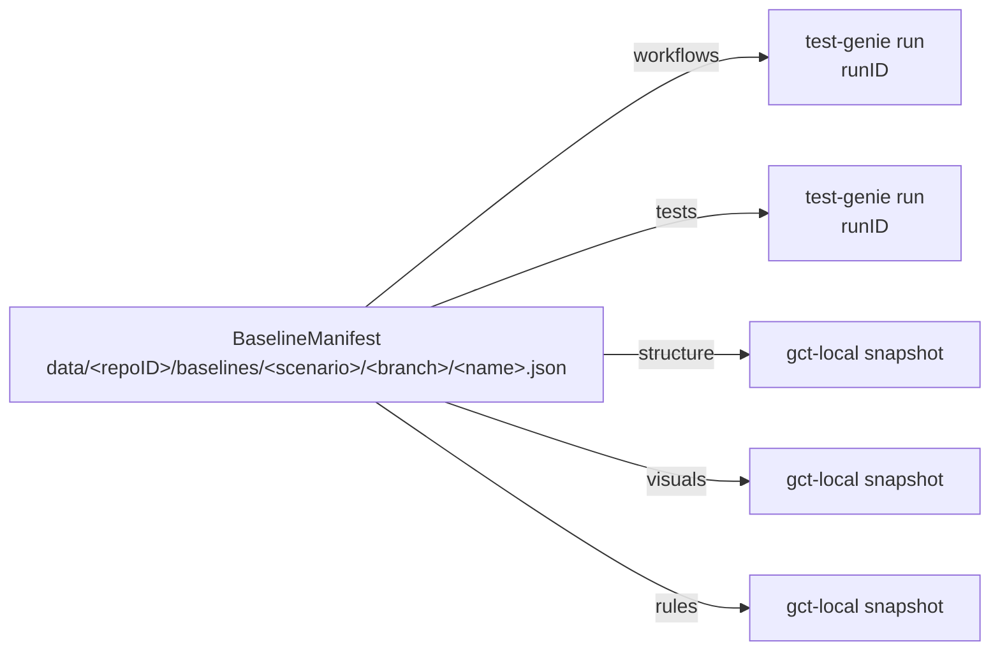
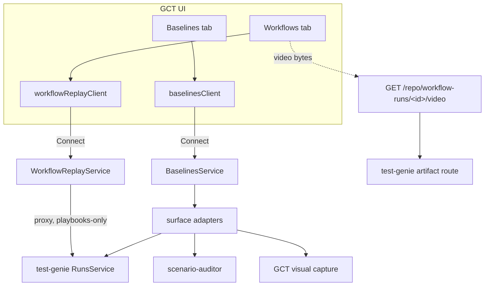

# Baseline Model

Git Control Tower's **baseline** subsystem is the regression-diagnosis primitive
that replaces `git stash` for the question every agent and reviewer asks
mid-change: *"did my change cause this failure, or was it already failing?"*

A baseline captures a scenario's review surfaces at a point in time. After you
change code, you diff the baseline against the working tree and each surface is
classified — so a pre-existing failure never gets mistaken for a regression you
introduced.

## Manifest of pointers (Decision 1)

A baseline **owns no artifacts**. It is a manifest of *pointers* into the
surfaces that already store their own results:



- **workflows** and **tests** point at **test-genie runs** (`kind=test-genie-run`,
  `ref=<runID>`). test-genie owns run history; GCT *pins* the run
  (`gct:baseline:<name>`) so retention GC can't reclaim it while the baseline
  references it, and unpins on delete.
- **structure**, **visuals**, **rules** point at **GCT-local snapshots**
  (`kind=gct-local-snapshot`) — issue-set / screenshot snapshots GCT stores
  itself.

Because the manifest only holds pointers, capturing a baseline is cheap and the
same run can back several baselines.

## Branch scoping (Decision 2)

Baselines are stored per branch:

```
data/<repoID>/baselines/<scenario>/<branch>/<name>.json
```

The branch is the scoping axis because regressions are evaluated relative to the
branch you're working on. A detached HEAD scopes to `detached-<sha8>`. Listing
defaults to the current branch; `--all-branches` (CLI) or the UI list shows
every branch.

## Per-surface adapters

Each surface is captured/diffed by an adapter behind a narrow interface
(`scenarios/git-control-tower/api/internal/baseline/adapter_*.go`). To **add a
new surface**:

1. Implement the adapter interface (capture → pointer, diff → `SurfaceDiff`).
2. Register it in the service's surface map.
3. Add it to `BASELINE_SURFACES` in the UI (`ui/src/features/baselines/model.ts`)
   so the modal, chips, and diff routing pick it up.

The diff verdict vocabulary is shared verbatim with test-genie's classifier:
`clean` · `regression` · `new-failure` · `preexisting` · `not-comparable`.
`diff` exit codes: `0` safe (clean/new-failure/preexisting), `1` regression,
`2` not-comparable.

## Staleness

Staleness is computed from the baseline's recorded git sha vs. current HEAD —
commits since, plus files changed (including uncommitted edits and untracked
files). A baseline captured against a dirty tree records `git.dirty` so the UI
and CLI can warn that its surfaces may reflect uncommitted changes rather than
the committed state.

## Concurrent-agent safety

Baseline writes are branch-scoped and guarded by a per-branch file lock
(`flock`), so two agents capturing baselines on different scenarios (or
branches) never collide. Pins on test-genie runs are additive per consumer, so
concurrent baselines referencing the same run are safe. This is why baselines
replace `git stash`, which is process-global and unsafe when multiple agents
share a working tree.

## Surfaces over the wire



- `BaselinesService` (Connect) — create/snapshot/get/list/diff/delete/edit.
- `WorkflowReplayService` (Connect) — the Workflows tab's read-only proxy over
  test-genie playbooks runs (Decision 3: the UI never calls test-genie
  directly). Binary video bytes stream over a GCT REST route, not proto.

## Surfaces

| Surface | Pointer kind | Backed by |
|---|---|---|
| workflows | test-genie-run | test-genie playbooks run |
| tests | test-genie-run | test-genie unit/integration/smoke run |
| structure | gct-local-snapshot | scenario-auditor structure scan |
| visuals | gct-local-snapshot | GCT visual capture (screenshots) |
| rules | gct-local-snapshot | scenario-auditor rules scan |

## Surfaces, CLI, and UI

- **CLI** (agent surface): `git-control-tower baseline {snapshot,diff,list,show,delete,create,edit}`.
  Always explicit — every command requires `--name`.
- **UI** (human surface): the **Baselines tab** is the cross-surface management
  view. Every baseline-includable surface tab (Screenshots, Workflows, Tests,
  Rules) behaves identically through one shared primitive set in
  `ui/src/features/baselines/`:
  - **`SurfaceCaptureEmptyState`** — when nothing is captured, two intents
    (Plan C Decision 2): *capture loose* (run the tool, show the result, create
    no manifest — for mid-change progress checks) and *capture baseline* (open
    `SetBaselineModal` scoped to that surface via `preselectedSurfaces`).
  - **`SurfaceBaselineBar` + `BaselineSelector`** — shown once data exists:
    states what you're viewing, switches the default baseline inline, and runs
    or exits an on-demand compare.
  - **`SurfaceComparePanel` + `useCompareOnDemand`** — the single compare path
    (Decision 3); tests/rules/workflows re-run the surface server-side, while
    Screenshots compares instantaneously by reading the selected baseline's
    `visuals` pointer (the "before" pane) against the current loose capture (the
    "after").
  A per-device "default baseline" (localStorage) drives which baseline the bar
  compares against; the CLI/API ignore this convenience and always require an
  explicit name (Decision 4).

### One meaning of "baseline" (Plan C Decision 1)

The UI uses "baseline" to mean a `BaselineManifest` and nothing else. There is
no UI action that creates a `role=baseline` visual *snapshot* directly — the
visual-capture path only ever produces loose captures. Baseline-pinned visual
snapshots are produced solely by the baseline snapshot flow:

- The visuals adapter captures with **baseline mode** (`role=baseline`), which
  is **additive** — routine loose captures (capture mode, replacing the single
  `role=capture` snapshot) never touch pinned snapshots, so many baselines'
  screenshots coexist.
- When a baseline is deleted, its exclusively-owned visual snapshot is released
  via the adapter's optional `SurfaceReleaser` (test-genie surfaces unpin shared
  runs instead).
