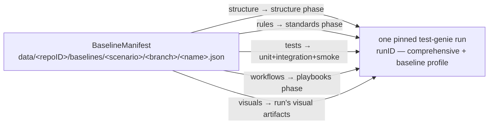
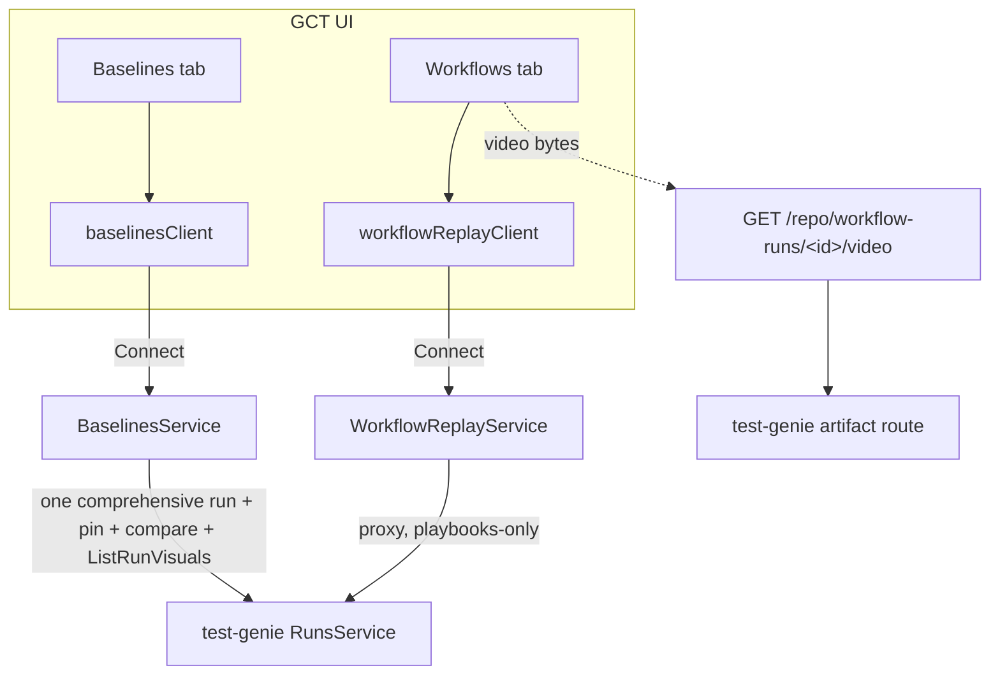

# Baseline Model

Git Control Tower's **baseline** subsystem is the regression-diagnosis primitive
that replaces `git stash` for the question every agent and reviewer asks
mid-change: *"did my change cause this failure, or was it already failing?"*

A baseline captures a scenario's review surfaces at a point in time. After you
change code, you diff the baseline against the working tree and each surface is
classified — so a pre-existing failure never gets mistaken for a regression you
introduced.

## One comprehensive run, surfaces as views (Decision 1)

A baseline **owns no artifacts**. It is a manifest of *pointers* into **one**
comprehensive, durable test-genie run. Capturing a baseline triggers a
**single** `comprehensive` test-genie execution with the `baseline` capture
profile (full diagnostics + all-pages visuals + video), pins that run **once**,
and points every surface at it. Surfaces are **phase-set views** over the shared
run, not separate runs:



- Every surface is `kind=test-genie-run`, `ref=<runID>` — the **same** runID.
  test-genie owns run history; GCT *pins* the run once (`gct:baseline:<name>`)
  so retention GC can't reclaim it while the baseline references it, and unpins
  it once on delete.
- The **visuals** surface points at the same run's baseline visual artifacts
  (screenshots captured under the `baseline` profile), enumerated via
  test-genie's `ListRunVisuals`. There is no GCT-local visual storage for
  baselines.

The `{surface → phase-set}` grouping in `internal/baseline/views.go` is a
presentation map, not the capture or verdict authority. Test Genie owns the
full phase catalog and comparison semantics. Because the manifest only holds
pointers into one run, capturing a baseline is one execution and the same run
can back several baselines.

## Branch scoping (Decision 2)

Baselines are stored per branch:

```
data/<repoID>/baselines/<scenario>/<branch>/<name>.json
```

The branch is the scoping axis because regressions are evaluated relative to the
branch you're working on. A detached HEAD scopes to `detached-<sha8>`. Listing
defaults to the current branch; `--all-branches` (CLI) or the UI list shows
every branch.

## Surfaces as views (capture + diff)

There is no per-surface adapter layer. One executor triggers the comprehensive
run; one comparer diffs two runs. The mapping from surface to its test-genie
phases lives in `internal/baseline/views.go` (`surfacePhases`) only to render
named views. To **add a new phase-set surface**:

1. Add its `{surface → phase-set}` entry to `surfacePhases` in `views.go`.
2. Add its `Surface*` constant + a slot in `AllSurfaces` (`model.go`).
3. Add it to `BASELINE_SURFACES` in the UI (`ui/src/features/baselines/model.ts`)
   so the modal, chips, and diff routing pick it up.

Adding a new Test Genie phase does **not** require adding a surface. New phases
automatically participate in unfiltered baseline comparison when Test Genie
marks them comparable; the surface map only decides whether they appear inside
a named legacy grouping.

**Diff is option-c plus full-phase authority.** A diff resolves one current
comprehensive run and issues **one** empty-phase
`CompareRuns(baselineRun, currentRun)`. Test Genie returns a flat `PhaseDiff[]`
for the comparable phase union. GCT exposes that phase list directly and
computes the overall verdict from it, including phases that do not belong to a
legacy named surface. GCT also buckets mapped phases back into surfaces
**locally** via the `surfacePhases` inverse index for presentation. A
multi-phase surface like `tests` aggregates its phases' deltas (worst verdict
wins). The `visuals` surface is diffed at the metadata level over the two runs'
visual comparison results and remains advisory.

**Diff is durable and return-fast (mirrors snapshot).** `StartDiff` resolves the
current run and returns **immediately** with its run id + ETA + a re-attach
command — it never silently blocks. Snapshot start banners name
`git-control-tower baseline snapshot status --wait --json` as the authoritative
parent-workflow wait path; raw `test-genie runs wait` is diagnostic only. Diff
start banners include a bounded run wait and the GCT diff status resolve
command. The verdict is computed and **cached server-side** when the run
completes (keyed `(repoID, scenario, branch, name, runID)`), surviving client
disconnect; `GetDiffResult` returns it instantly. `StartDiff` also records a
small durable intent before returning, so an interrupted wait can recover the
most recent run id for a baseline without guessing from test-genie history.
The CLI:

```
git-control-tower baseline snapshot --scenario S --name N        # start, returns a run id
git-control-tower baseline snapshot status --scenario S --name N --run R  # resolve the pin
git-control-tower baseline diff   --scenario S --name N        # start, returns a run id
git-control-tower baseline diff status --scenario S --name N --run R   # resolve the verdict
git-control-tower baseline diff status --scenario S --name N --latest  # recover latest diff run
git-control-tower baseline diff   --scenario S --name N --wait  # print run id once, then block server-side
```

`snapshot status` exit codes: `0` ready, `2` missing/failed, `3` pending. A
missing `show`/`diff` now reports snapshot diagnostics and similar baseline names
instead of only saying the manifest was absent.

`diff status` exit codes: `0` clean/safe, `1` regression, `2` not-comparable,
`3` not-ready (run still in flight — distinct from a verdict).

**The current run is resolved, not always re-run.** Resolution order:

1. **Reuse** — clean working tree + a completed `comprehensive`+`baseline` run
   at exactly the current sha within `GCT_DIFF_RUN_REUSE_TTL` (default 15m) →
   that run is reused (`reused_run`), no suite re-run. So `snapshot` then `diff`
   (or repeated diffs) at the same clean sha do **not** re-run the suite.
2. **Coalesce** — otherwise `StartRun` rides an already-in-flight comprehensive
   run of the scenario (`coalesced`), e.g. when a snapshot or another diff of
   the same scenario is running. Many diffs of one scenario (different `--name`)
   share one run and each caches its own comparison.
3. **Fresh** — otherwise a new comprehensive run starts.

A dirty working tree never reuses a run (uncommitted edits aren't captured by
sha). An empty (create-only) baseline has no run to compare against, so a diff
fails fast rather than wasting a suite. Reuse/coalesce are enforced by
test-genie's one-run-per-scenario admission guard (see `INVARIANTS.md`); GCT
never starts a parallel suite for the same scenario.

## Staleness

Staleness is computed from the baseline's recorded git sha vs. current HEAD —
commits since, plus files changed (including uncommitted edits and untracked
files). A baseline captured against a dirty tree records `git.dirty` so the UI
and CLI can warn that its surfaces may reflect uncommitted changes rather than
the committed state.

## Concurrent-agent safety

Baseline writes are branch-scoped and guarded by a per-branch file lock
(`flock`), so two agents capturing baselines on different scenarios (or
branches) never collide. Pins on test-genie runs are additive per consumer, so
concurrent baselines referencing the same run are safe. This is why baselines
replace `git stash`, which is process-global and unsafe when multiple agents
share a working tree.

## Surfaces over the wire



- `BaselinesService` (Connect) — create/snapshot/get/list/diff/delete/edit.
- `WorkflowReplayService` (Connect) — the Workflows tab's read-only proxy over
  test-genie playbooks runs (Decision 3: the UI never calls test-genie
  directly). Binary video bytes stream over a GCT REST route, not proto.

## Surfaces

All surfaces reference the **same** pinned comprehensive run
(`kind=test-genie-run`); the "backed by" column is the phase/artifact view each
surface presents over that one run.

| Surface | View over the shared run |
|---|---|
| structure | `structure` phase |
| rules | `standards` phase |
| tests | `unit` + `integration` + `smoke` phases |
| workflows | `playbooks` phase |
| visuals | the run's UI-smoke visual artifacts (`ListRunVisuals`) |

## Surfaces, CLI, and UI

- **CLI** (agent surface): `git-control-tower baseline {snapshot,diff,list,show,delete,create,edit}`.
  Always explicit — every command requires `--name`.

  **`snapshot` durability & UX.** A snapshot triggers ONE comprehensive,
  server-durable test-genie run. The CLI is built so this never reads as a
  silent hang:
  - Before the long wait it prints an up-front banner: the run is durable
    server-side, the bounded client deadline, and the `test-genie runs
    list/wait <scenario>` re-attach commands.
  - The wait has a bounded deadline (not bare `context.Background()`); a wedged
    backend can't hang the shell forever.
  - **Ctrl-C detaches, it does not abort** (cancel ≠ abort): the CLI prints the
    re-attach guidance and exits 0 while the run continues in test-genie.
  - If test-genie is unreachable, the snapshot **fast-skips** (every surface
    recorded as skipped with the probe reason) in ~5s instead of blocking to the
    long deadline.
  Server-side, `SnapshotForBaseline` runs the cheap pin + manifest-write tail
  under `context.WithoutCancel`, so a client that disconnects after the durable
  run completes still gets a fully-pinned, persisted baseline. GCT reuses
  test-genie's durable `runmanager` and keeps no parallel job system.
- **UI** (human surface): the **Baselines tab** is the cross-surface management
  view. Every baseline-includable surface tab (Screenshots, Workflows, Tests,
  Rules) behaves identically through one shared primitive set in
  `ui/src/features/baselines/`:
  - **`SurfaceCaptureEmptyState`** — when nothing is captured, two intents
    (Plan C Decision 2): *capture loose* (run the tool, show the result, create
    no manifest — for mid-change progress checks) and *capture baseline* (open
    `SetBaselineModal` scoped to that surface via `preselectedSurfaces`).
  - **`SurfaceBaselineBar` + `BaselineSelector`** — shown once data exists:
    states what you're viewing, switches the default baseline inline, and runs
    or exits an on-demand compare.
  - **`SurfaceComparePanel` + `useCompareOnDemand`** — the single compare path
    (Decision 3). A baseline diff re-runs the comprehensive suite server-side
    once and buckets the per-phase deltas; the Screenshots view compares the two
    runs' visual artifacts at the metadata level.
  A per-device "default baseline" (localStorage) drives which baseline the bar
  compares against; the CLI/API ignore this convenience and always require an
  explicit name (Decision 4).

### One meaning of "baseline" (Plan C Decision 1)

The UI uses "baseline" to mean a `BaselineManifest` and nothing else. A
baseline's visuals are **run artifacts produced by test-genie** under the
`baseline` capture profile — GCT no longer captures or stores baseline
screenshots itself. Because all surfaces (including visuals) reference the one
shared run, deleting a baseline unpins exactly that run once; there is nothing
GCT-owned to separately release.

> The standalone GCT visual-capture REST feature (the Screenshots tab's loose
> captures + periodic capture under `/api/v1/repo/visual-captures`) is a
> separate, independent capability and is **not** part of the baseline
> subsystem. It retains its own `VisualCaptureStorage`.
