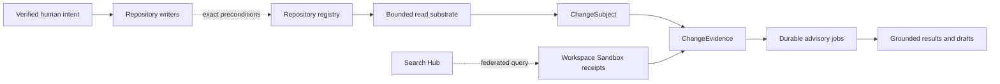

# Git Control Tower domain map

This map is the ownership boundary for advisory maturity work. It keeps
advisory reads separate from human-only writers and leaves provider
authentication to Integration Hub.

| Domain | Owns | Read boundary | Write boundary |
|---|---|---|---|
| Repository registry | Stable repository IDs and explicit repository resolution | `RepoRead` plus typed `GitRunner` reads | Human intent through `RepoWrite` |
| Change evidence | `ChangeSubject`, snapshot/selection digests, coverage, omissions, evidence refs | Immutable subject/evidence contracts | None |
| Advisory jobs | Durable lifecycle, idempotency, exact check execution IDs, result identity | `ReviewJobStore` and owner receipts | Job state only; no repository writes |
| Baselines | Test Genie run pins, collection closure, comparison evidence | Baseline domain interfaces | Collection state through its owner contract |
| Provenance | Pending/applied/reviewed/committed/unknown standing and per-file evidence | Workspace Sandbox owner client and GCT presentation | No inferred attribution; producer owners write receipts |
| Trailers | Lossless parsing, supported-key resolution, uncertainty states | Owner-backed resolver interface | Draft suggestions only |
| Human controls | Verified principal, resource-bound intent, exact preconditions | Policy-gate decisions | Repository writers and external publication |
| Collaboration | Host-neutral subject and publication handoff contracts | Explicit host capability seams | Provider adapters remain outside GCT |

The active UI repository is a selection convenience, not an authority grant
and not an operation identity. New advisory requests must carry a stable
repository identity and an immutable subject digest. Search and presentation
must preserve unavailable, partial, and mixed evidence instead of converting
them to empty or passing results.
