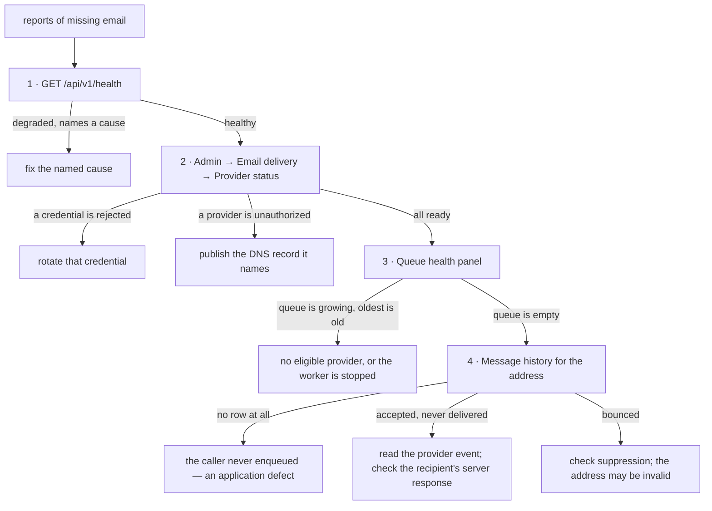

# Email Operations Runbook

Procedures for running email delivery on a deployment of this scenario. The
design behind these procedures is in `docs/reference/EMAIL_DELIVERY.md`; read it
before changing anything structural.

Audience: whoever operates a deployment. Most procedures need the admin portal
and a provider dashboard. The DNS procedures need a local machine with
`tunnel-manager` running.

---

## Before you touch anything

Three facts that make the difference between a fix and an outage.

1. **`vrooli.com` publishes `p=reject`.** Mail sent through a provider the
   domain does not authorize is **refused outright**, not delivered to spam, and
   the refusal is invisible unless you look. Never enable a provider before its
   DNS records are published and verified.
2. **A domain may publish exactly one SPF record.** Adding a second `v=spf1`
   record breaks SPF for the whole domain. Adding a provider means *merging* a
   mechanism into the existing record, never appending a new record.
3. **Deploys replace the release directory.** Anything written to disk inside it
   is erased. Settings belong in the database; secrets belong in the credential
   authority.

---

## Diagnose: "nobody is receiving email"

Work down this list. Stop at the first thing that is wrong.



Useful commands and endpoints:

| What you want | Where |
| --- | --- |
| Overall dependency health | `GET /api/v1/health` (the **API's**, not the UI's `/health`) |
| Per-provider credential verdicts | `GET /api/v1/admin/provider-credentials` |
| Mail DNS verdicts | `GET /api/v1/admin/auth/email-readiness` |
| Delivery counters, last 24 hours | `GET /api/v1/admin/auth/delivery` |
| Send a real test message | `POST /api/v1/admin/auth/delivery-probe` |
| What DNS actually publishes | `dig +short TXT vrooli.com` and friends (see below) |

Read the live records directly when a verdict surprises you:

```bash
dig +short TXT vrooli.com                      # SPF — expect exactly one v=spf1 record
dig +short TXT _dmarc.vrooli.com               # DMARC policy
dig +short TXT k1._domainkey.vrooli.com        # Mailgun DKIM (published as TXT)
dig +short MX  vrooli.com                      # inbound mail routing
dig +short NS  vrooli.com                      # which nameservers are authoritative
```

A non-empty answer is not a passing check. Compare the type, the owner name and
the value against what the provider requires.

---

## Add a provider to the ladder

This is configuration plus DNS. It is not a code change unless the provider
speaks a protocol the code does not already support.

### 1. Create the account and confirm the real terms

Sign up, verify the sending domain, and find the page that states your account's
actual limits. Record the confirmed daily and monthly ceilings and where you read
them. Published marketing figures are a starting point, not the terms.

Confirm three things that routinely differ from the headline:

- Whether inbound mail consumes the same allowance.
- Whether a batch send counts as one message or one per recipient.
- When the monthly window resets — calendar month, signup anniversary, or
  billing period.

### 2. Add the registry entry

Add an entry with `enabled: false`, filling `dns_requirements`, `limits`,
`cost_rank`, and `limits_checked_at`. Leaving it disabled means the router
ignores it while you finish setup.

### 3. Publish its DNS records

From a local machine with `tunnel-manager` running. **Always dry-run first and
read the diff.**

The SPF step is the dangerous one. Confirm the result is a single `v=spf1`
record containing both the existing mechanisms and the new one, and that the
lookup cost is still at or below ten. The tooling refuses a write that would
exceed the budget; do not work around that refusal.

Because `vrooli.com` sets `aspf=s`, a provider using its own return-path
subdomain will not align on SPF. **It must have a working DKIM signature**, or
its mail fails DMARC and is rejected. Do not skip the DKIM record.

### 4. Provision the credential

Provision through the credential authority, never an environment variable:

```bash
vrooli credentials provision --identity vrooli/landing-page-business-suite --field <provider>-api-key
```

The value is read from stdin. Use a send-only, domain-scoped key when the
provider offers one.

### 5. Verify before enabling

Confirm all four before setting `enabled: true`:

- The credential verdict is verified.
- The mail DNS verdict is authorized.
- A delivery probe to an allowlisted external address arrives, with `SPF=pass`,
  `DKIM=pass` and `DMARC=pass` in the received headers.
- The provider's delivery-event webhook is registered and its signing secret is
  stored.

### 6. Enable and place it

Set `enabled: true` and set `cost_rank`. Mark `recommended` only if it should be
the default choice when no preference is expressed.

---

## Rotate a provider credential

1. Create the new credential at the provider. Do not revoke the old one yet.
2. Provision the new value through the credential authority.
3. Wait for the credential verdict to turn verified, or force a probe.
4. Send a delivery probe and confirm it arrives.
5. Revoke the old credential at the provider.

Never reactivate a revoked credential to keep a route alive. If the new one does
not work, fix it or disable that rung.

---

## Restore sign-in when the relay password is rejected

Symptom: `535 Authentication failed` in the provider status panel.

1. In the Mailgun dashboard, open the sending domain, then SMTP credentials.
2. Reset the password, or create a dedicated credential so sign-in can be
   rotated independently of everything else. The value is shown once.
3. Confirm the domain reads as active and is **not** a sandbox domain — a
   sandbox domain delivers only to pre-approved addresses.
4. Provision the value through the credential authority.
5. Confirm the credential verdict turns verified.
6. Send a delivery probe to an external inbox and confirm arrival.

---

## Change the spend policy

Paid overflow ships switched off with a ceiling of zero. Enabling it is a
deliberate change to three things at once: the profile, the ceiling, and the
individual provider's `paid_overflow_allowed`. A per-provider allowance never
overrides a zero global ceiling.

The ceiling bounds what this application will submit. It is not a
provider-enforced cap on all charges on that account — set a billing alert at
the provider as well.

---

## Respond to each alert

| Alert | What it means | First action |
| --- | --- | --- |
| No eligible provider for urgent mail | Every rung is unconfigured, unverified, unauthorized, or exhausted | Open provider status; the reason column names which |
| Provider credential rejected | A key or password stopped working | Rotate it (above) |
| Accepted but no delivery confirmations | Messages are leaving but nothing is confirming | Check the provider's webhook registration and signing secret before assuming a delivery problem |
| Sign-in message older than its token | Delivery is slower than the token's life | Check queue health and provider latency; the message is expired, not delivered late |
| Provider passed 80% of a window | Approaching a quota boundary | Confirm the next rung is ready, or enable overflow |
| Domain stopped authorizing a provider | A DNS record changed or was removed | Compare published records against the provider's requirements and republish |

With sparse traffic, webhook silence alone is normal. Judge it against recent
actual submissions, or send a probe.

---

## Testing without sending real customer mail

- Automated tests use fake providers. No test may send to a real address.
- Real sends happen only through the delivery probe, only to an allowlisted
  address.
- Use each provider's documented simulator for bounce and complaint handling.
  Never test bounce handling by sending to invented addresses — that damages the
  domain's reputation.
- A probe consumes quota and may cost money. It is excluded from business
  metrics and included in quota accounting.

---

## Things that look like fixes and are not

| Tempting action | Why it makes things worse |
| --- | --- |
| Provision a SendGrid key to restore sign-in | `vrooli.com` does not authorize SendGrid. Under `p=reject` that mail is refused outright — worse than today, and equally invisible. |
| Add a second SPF record for the new provider | Breaks SPF evaluation for the whole domain. Merge into the single record instead. |
| Delete the SPF record and recreate it with the new mechanism | Leaves the domain with no SPF record for the length of the gap. That is a total mail outage. |
| Resend through another provider because delivery is unconfirmed | If the first provider accepted it, the customer gets two codes and only one matches the stored token. |
| Try a different provider for a bounced address | A bounce is a property of the recipient, not the transport. Provider-hopping around a suppression damages the domain's reputation. |
| Preserve `config/branding.json` across deploys | The preservation mechanism binds directories only; that would freeze seeded presentation content shipped with each release. |
