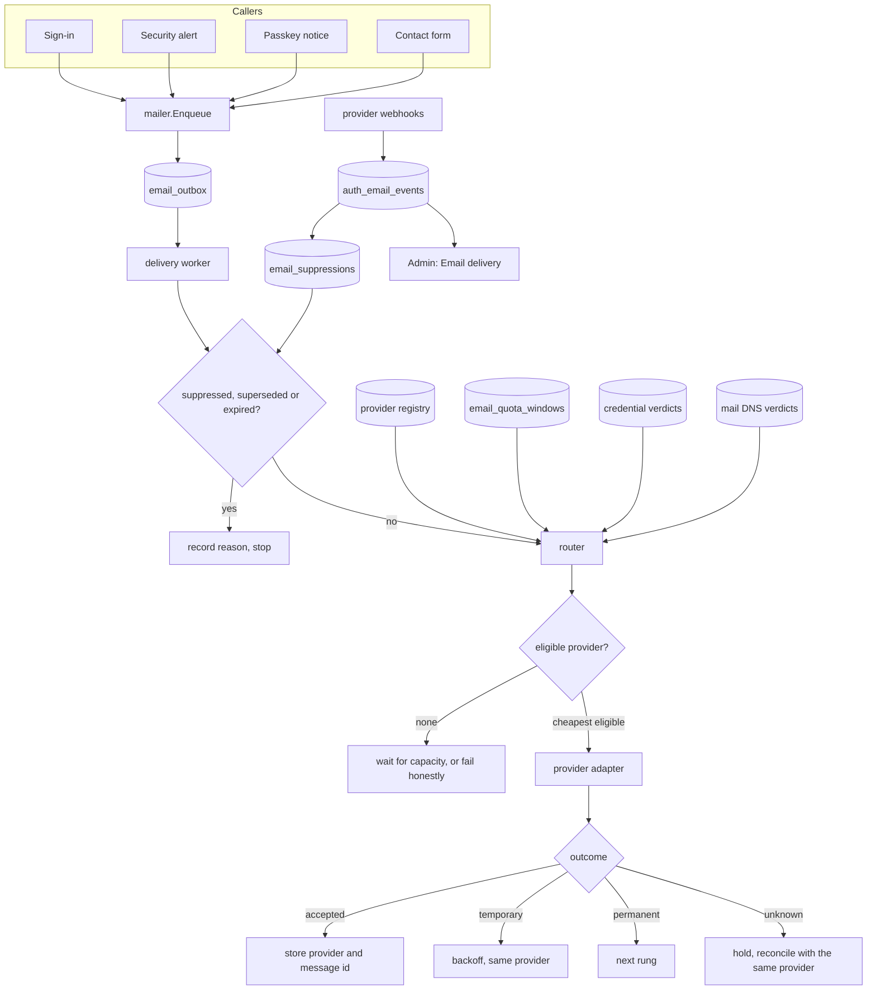
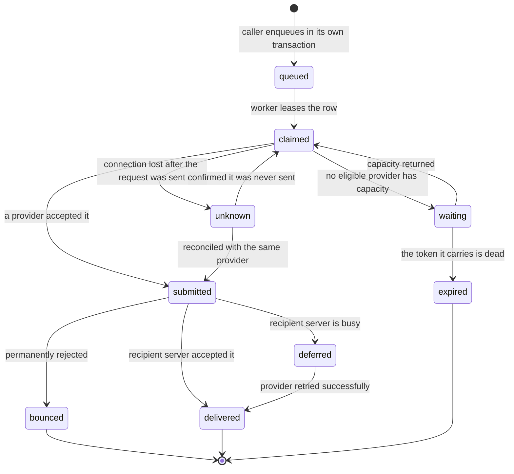
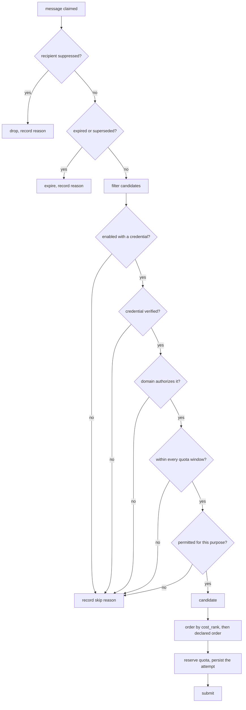
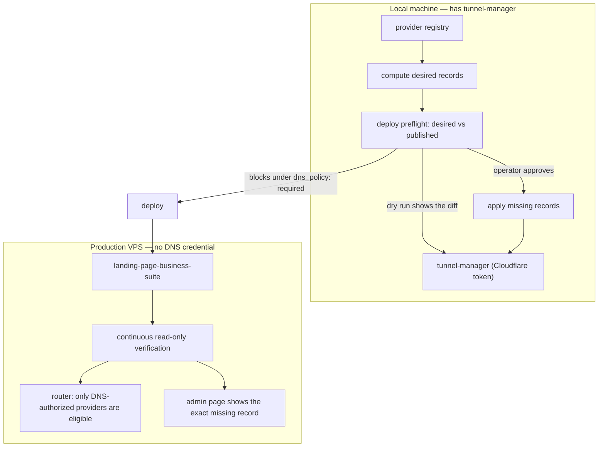
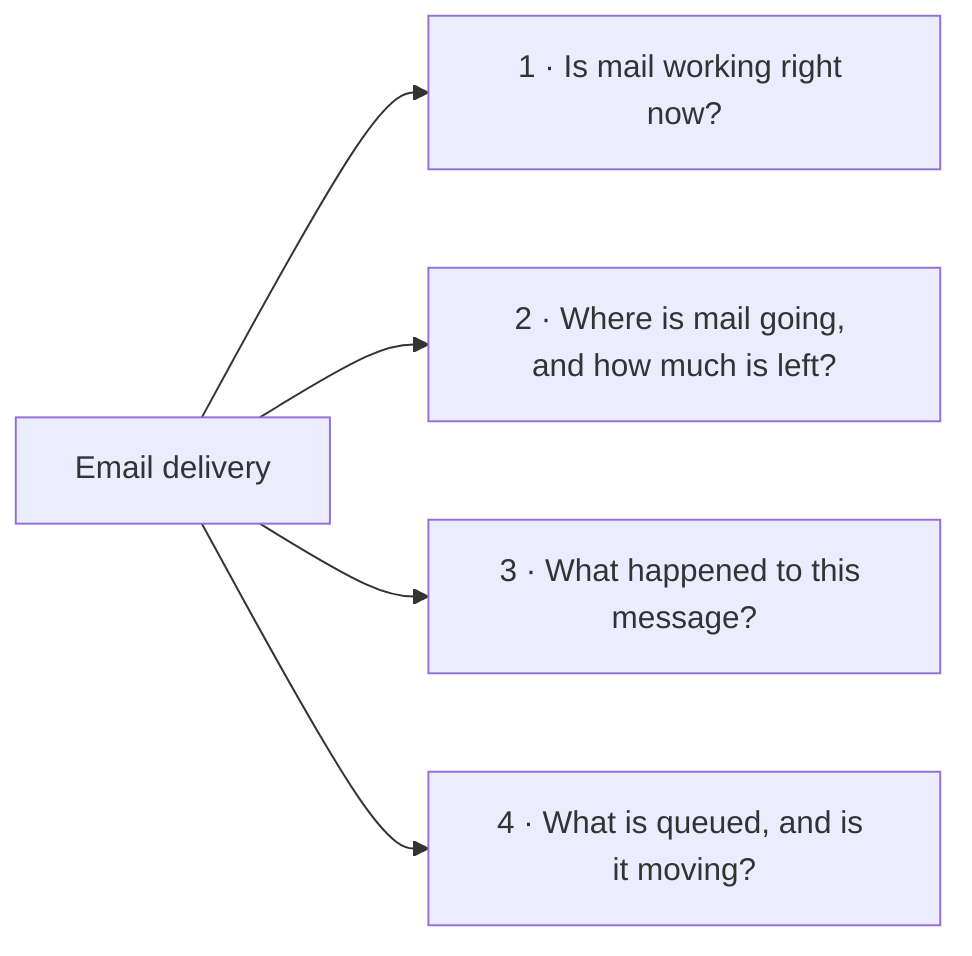

# Email Delivery

Authoritative design for how this scenario sends email. It covers the delivery
subsystem, the provider registry and routing rules, DNS authorization, the
durable data model, the operator surface, and the invariants every change must
preserve.

Companion documents:

- `docs/guides/EMAIL_OPERATIONS.md` — the operator runbook (add a provider,
  rotate a credential, diagnose a failed send).
- `scenarios/scenario-to-cloud/docs/guides/dns-setup.md` — DNS for deployments,
  including the mail records this scenario requires.
- `docs/guides/CONFIGURATION_GUIDE.md` — configuration surface and values.

> **Status.** The durable outbox, provider registry, shared DNS verifier,
> runtime worker, reviewed deploy-time mail-DNS checks, and first admin page are
> shipped locally. Remaining operator proof and the explicitly listed gaps are
> still tracked by `mature-email-delivery-durable-configuration-provider-ladder`.

---

## 1. Why this subsystem exists and what it must never do

Email is the only entry point to this product. A customer signs in with a code
delivered by email; there is no password. If email does not leave the building,
the product cannot acquire or serve a single customer.

On 2026-09-16 the production deployment at `vrooli.com` stopped delivering
sign-in email and reported healthy for hours. The cause was a rejected SMTP
password. The reason it was invisible was that several code paths returned
success for messages they had never sent. That outage is the reason this
subsystem exists in its current form, and it produces the three rules that
outrank every other consideration here.

**Invariant 1 — Never report a success you did not achieve.**
No function returns a nil error for an email it did not hand to a provider.
An unconfigured provider is an error, not a silent no-op. A development
environment that needs mail uses a development provider that durably records
the message, never a branch that pretends.

**Invariant 2 — Handover is not delivery.**
"A provider accepted this message" and "the recipient's mail server accepted
this message" are different facts with different evidence. They are stored
separately, displayed separately, and never collapsed into one boolean.

**Invariant 3 — Never send the same message twice.**
Once any provider has accepted a message, delivery is that provider's
responsibility. The system must not submit the same message to a second
provider because the first has not yet confirmed. A customer who receives two
sign-in codes is locked out, because only one matches the stored token.

---

## 2. Delivery architecture

Every feature that needs email asks for one **by purpose**. It does not choose a
provider, read a credential, or format a payload.



### Responsibilities

| Component | Owns |
| --- | --- |
| `mailer.Enqueue` | The only way to request an email. Validates purpose and template, computes the dedupe key, writes the outbox row. |
| Outbox | One row per message we intend to send. Written in the caller's transaction. |
| Worker | Claims a row, drives the attempt, settles the outcome, schedules retries. |
| Router | Decides which provider, and records why. Consults the registry, quotas, credential verdicts and DNS verdicts. |
| Provider adapter | One wire protocol. Builds the payload, classifies the response, maps provider events. Never decides whether it should be used. |
| Event ingestion | Verifies provider webhook signatures, de-duplicates, stores events, updates derived state. |
| Suppression | Cross-provider recipient safety. Consulted immediately before dispatch. |

The enqueue boundary, durable outbox, lifecycle-owned worker, and five-purpose
callers are implemented in `api/internal/emaildelivery` and
`api/email_delivery_runtime.go`. Production callers enqueue; development keeps
the explicit recorder path for local operation.

---

## 3. Message lifecycle



### The `unknown` state

If the submission request was transmitted but no answer arrived — a timeout, a
connection reset, an ambiguous 5xx — we do not know whether the provider
accepted the message.

- Guessing "not accepted" and retrying elsewhere **duplicates** the message.
- Guessing "accepted" **loses** it.

The correct handling is to hold the message in `unknown`, keep its quota
reservation, and reconcile with the **same** provider using the same
idempotency key or a status lookup. Absence from a delayed provider log is not
proof of rejection.

### Submission outcomes

An adapter reports acceptance certainty separately from the error category.

| Outcome | Meaning | Router response |
| --- | --- | --- |
| `accepted` | Provider took the message and returned an id | Stop. Record provider and message id. |
| `not_accepted: quota` | Rejected before acceptance for volume | Mark the window exhausted, try the next rung |
| `not_accepted: rate_limit` | Too fast; documented non-acceptance | Honour the retry time on the same provider |
| `not_accepted: credentials` | Key or password rejected | Mark the provider unusable, alert, try the next rung |
| `not_accepted: sender_configuration` | Sender identity not permitted | Mark unusable, alert; do not try another provider with the same identity problem |
| `not_accepted: recipient_invalid` | The address is not deliverable | Suppress the address. Stop. No rung change. |
| `not_accepted: suppressed` | Provider refuses this recipient | Record centrally. Stop. |
| `not_accepted: content_policy` / `account_suspended` | Policy condition | Hold. Alert. **Never** try another provider. |
| `unknown` | Ambiguous | Hold and reconcile with the same provider |

Classification lives inside the adapter, against that provider's documented
codes. A global rule such as "every 429 means quota" or "every 500 is safe to
retry elsewhere" is wrong and causes duplicates.

---

## 4. Provider registry

Providers are **data**. Adding, removing, reordering, or recommending a provider
is a configuration change plus DNS records. It is not a code change and not a
release. An adapter is needed only for a wire protocol the code does not already
speak; most providers are either plain SMTP or a small HTTPS JSON API.

### The three states

These are distinct and the admin surface shows all three. Conflating them is
what makes a long provider list dangerous.

| State | Means | Cost of one more | Practical ceiling |
| --- | --- | --- | --- |
| **Supported** | A registry entry exists and the code can speak its protocol | A small adapter, or none for plain SMTP | No meaningful limit |
| **Enabled** | This deployment has an account and a verified credential | An account and one stored secret | A handful; each is a thing to keep working |
| **Authorized** | The sending domain's DNS publishes this provider's required records | DNS records, and a share of the SPF lookup budget | The genuinely constrained one — see §5 |

A provider that is enabled but **not** authorized is worse than one that is
absent. `vrooli.com` publishes `p=reject`, so its mail is refused outright
rather than delivered to spam, and the refusal is invisible without the DNS
verifier. Authorization is therefore an **eligibility precondition in the
router**, not a warning on a dashboard.

### Registry entry fields

| Field | Meaning |
| --- | --- |
| `id` | Stable identifier, e.g. `resend-main`. Also the provider identity used by health checks, the credential prober, and event mapping. No component types a provider name as a literal. |
| `provider` | Which service, e.g. `resend`, `mailgun`, `amazon_ses`. |
| `transport` | `https_api` or `smtp`. Selects the adapter. |
| `credential` | Reference to the credential-authority field that authenticates it. Never a value. |
| `webhook_credential` | Reference to the signing secret for its delivery-event webhook, when it has one. |
| `sender_identity` | Which configured From address and Reply-To this provider sends as. |
| `dns_requirements` | The SPF mechanism, DKIM selector(s) and record type, and any return-path host this provider needs. Makes authorization a checkable fact. |
| `limits[]` | Quota windows: meter, period, ceiling, safety headroom, and whether inbound mail consumes the same allowance. |
| `rate_limit` | Requests per second and burst, as an application-side cap. |
| `cost_rank` | Ordering key. Lower is cheaper. |
| `recommended` | Default-ordering flag when the operator has expressed no preference. Carries no technical meaning. |
| `purposes[]` | Which message purposes this provider may carry. Omitted means all. |
| `enabled` | Operator intent. Distinct from the derived `ready`. |
| `paid_overflow_allowed` | Whether this provider may be used once free capacity is exhausted. |
| `limits_checked_at` / `limits_source` | When the published limits were last confirmed, and from where. Unverified is not zero and not unlimited. |

### Example entry

```json
{
  "id": "resend-main",
  "provider": "resend",
  "transport": "https_api",
  "credential": "vrooli/landing-page-business-suite#resend-api-key",
  "webhook_credential": "vrooli/landing-page-business-suite#resend-webhook-secret",
  "sender_identity": "transactional",
  "recommended": true,
  "enabled": true,
  "cost_rank": 10,
  "dns_requirements": {
    "spf_mechanism": "include:_spf.resend.com",
    "spf_host": "send.vrooli.com",
    "dkim": [{ "selector": "resend", "record_type": "TXT", "host": "send.vrooli.com" }]
  },
  "limits": [
    { "meter": "recipient", "period": "day", "ceiling": 100, "headroom": 5, "includes_inbound": true },
    { "meter": "recipient", "period": "month", "ceiling": 3000, "headroom": 25, "includes_inbound": true }
  ],
  "rate_limit": { "per_second": 2, "burst": 2 },
  "paid_overflow_allowed": false,
  "limits_checked_at": "2026-09-18",
  "limits_source": "https://resend.com/docs/knowledge-base/account-quotas-and-limits"
}
```

### Provider survey

Published free-tier figures gathered 2026-09-18. **These are marketing-page
claims, not confirmed account terms.** What an approved account is actually
allowed to do routinely differs. Confirm during onboarding and record the
confirmed value in `limits` with its `limits_checked_at`.

| Service | Free allowance | Daily cap | First paid step | Note |
| --- | --- | --- | --- | --- |
| Resend | 3,000 / month | 100 | $20 / 50,000 | Recommended primary. API-first, good delivery feedback. Inbound shares the quota. |
| Brevo | ~9,000 / month (300/day) | 300 | from $9 | Largest daily headroom. Adds its own branding. Queues overflow provider-side, which complicates acceptance semantics. |
| Mailjet | 6,000 / month | 200 | $9 / 8,000 | Strong free capacity. Check branding on the transactional path. |
| Mailtrap | 4,000 / month | 150 | $15 / 10,000 | Use the sending product, not the testing sandbox of the same name. |
| SMTP2GO | 1,000 / month | 200 | ~$10 / 10,000 | Good second rung: small monthly ceiling, healthy daily one. |
| Mailgun | — | 100 | $15 / 10,000 | **Already authorized on `vrooli.com` and already wired.** Keep as the proven fallback. |
| MailerSend | 500 / month | — | $7 / 5,000 | Requires approval and a card. |
| Postmark | 100 / month | — | $15 / 10,000 | Chosen for quality, not free capacity. |
| Amazon SES | none (promotional credits only) | — | $0.10 / 1,000 | Cheapest overflow available. Needs a production-access request. |
| SendGrid | trial only, 60 days | 100 | ~$20 / month | No longer has a free tier, and `vrooli.com` does **not** authorize it. |

**Current ladder:** Mailgun is the only enabled and recommended provider. It is
already authorized on `vrooli.com` and is the only production route currently
used by this deployment. Resend and Amazon SES remain recommended catalog
options for a future, explicitly configured route; they are not enabled by this
release.

The shipped database seed catalogs all ten surveyed providers: Mailgun,
SendGrid, Resend, Brevo, Mailjet, Mailtrap, SMTP2GO, MailerSend, Postmark and
Amazon SES. Mailgun is enabled and recommended because its DNS and credential
are currently usable. The other catalog rows are disabled until an operator
supplies the provider-specific credential, transport settings and
account-specific DKIM selectors. A catalog row is not evidence that an account
exists or that the provider is ready to send.

---

## 5. Routing

### Selecting a provider



Order of operations matters: **reserve quota and persist the attempt before the
network call.** A worker that dies mid-request must leave evidence that an
attempt was in flight, or the replacement worker cannot tell `unknown` from
`never sent`.

Selection is deterministic. Predictive or health-weighted routing is explicitly
rejected: it is untestable, unauditable, and meaningless at this volume.

### Capacity

For each applicable window:

```
available = ceiling
          - confirmed_usage
          - active_reservations
          - unresolved_potential_usage
          - safety_headroom
```

These buckets are disjoint; moving a reservation into confirmed or unresolved
usage is atomic. The effective limit is the lowest applicable confirmed vendor
limit and application cap. A window boundary follows the **provider's** rules,
not local midnight — providers variously use UTC days, rolling 24-hour windows,
and billing-anchored months.

### Purposes, priority and expiry

| Purpose | Priority | Target | Expiry behaviour |
| --- | --- | --- | --- |
| `signin` | critical | seconds | Never submit once the token it carries has expired, or is about to. Expire the message instead. |
| `security_alert` | high | seconds | Retry for up to 24 hours; a missed alert is a security event. |
| `passkey_notice` | normal | minutes | Retry for up to 24 hours. |
| `contact_form` | normal | minutes | Retry for up to 24 hours, then surface as failed to an administrator. |

A sign-in message that would arrive after its token dies is worthless. Expire it
and tell the customer, rather than delivering a code that cannot work.

### Retry

Backoff with jitter: roughly 5s, 30s, 2m, 10m, 30m, always bounded by the
message's expiry, and always honouring a provider's own retry-after guidance.

Three different retries must not be confused:

1. **Submission retry** — we are trying to get a provider to accept. This is the
   only one this subsystem performs.
2. **Provider delivery retry** — an accepted provider is retrying the recipient's
   server. We observe it; we never duplicate it.
3. **Webhook retry** — a provider is retrying delivery of an event to us.

A delivery-delay event from an accepted provider must never trigger another
provider to send the same message.

### Spend policy

Three operating profiles, set in configuration:

| Profile | When free capacity runs out | Cost of the choice |
| --- | --- | --- |
| `free_only` | Queue until allowance returns; expire what goes stale | A traffic spike becomes customers who cannot sign in |
| `free_then_budgeted` | Fall through to a paid provider within a configured monthly ceiling | Pennies — about $0.10 per 1,000 through SES |
| `single_provider` | Wait and retry on one provider | Simplest, but one rejected credential is a total outage |

**Default: `free_then_budgeted` with paid overflow switched off and the ceiling
at zero**, so enabling spend is a deliberate, recorded operator decision. The
ceiling bounds what this application will submit; it is not a provider-enforced
cap on all account charges.

---

## 6. DNS authorization

### What must be true

A provider is authorized when a message it sends passes DMARC for the sending
domain. That needs an aligned pass on SPF or DKIM.

`vrooli.com` currently publishes:

| Record | Value | Consequence |
| --- | --- | --- |
| SPF (`vrooli.com` TXT) | `v=spf1 include:mailgun.org ~all` | Authorizes Mailgun. The current verifier measures **5 of 10** permitted lookups; the nested include chain is authoritative and must be rechecked before a write. |
| DKIM (`k1._domainkey.vrooli.com`) | RSA public key, published as **TXT** | Valid. Note the record type — a CNAME-only checker reports a false failure. |
| DMARC (`_dmarc.vrooli.com`) | `v=DMARC1; p=reject; aspf=s;` | Unauthorized mail is **rejected**, not spam-foldered. `aspf=s` requires exact-domain SPF alignment. |
| MX | `mxa.mailgun.org`, `mxb.mailgun.org` | Inbound mail goes to Mailgun. Do not disturb. |
| Nameservers | `nicolas.ns.cloudflare.com`, `perla.ns.cloudflare.com` | Zone hosted on Cloudflare. |

Because `aspf=s` is set, a provider using its own return-path subdomain will
**not** align on SPF. It must align on DKIM, which is relaxed by default.
**Every provider added to the ladder therefore needs a working, aligned DKIM
signature** — an SPF entry alone is not sufficient.

### The SPF lookup budget

A domain may publish **exactly one** SPF record. A second `v=spf1` record breaks
SPF evaluation entirely. The ten-lookup limit applies **per record**, so
providers that use their own return-path subdomain carry their own record with a
separate budget. The current live verifier measures Mailgun at 5 lookups; provider-specific costs must be measured against the live chain before enabling a new route.

The root record has 5 lookups remaining. The number of supported providers is
not meaningfully capped by SPF; only providers sending with the bare
`vrooli.com` envelope domain consume the root budget.

### Verify everywhere, write in one place



**Writes stay local.** A Cloudflare token that can edit DNS can take the whole
domain offline. The production deployment ships four secrets and that token is
not among them; it must stay that way. No DNS write happens automatically during
a deploy — every mutation is operator-initiated and shows its diff first.

**Reads happen in production too**, continuously, and this is not duplication.
Deploy-time asks "is it right?"; production asks "is it *still* right?" Records
drift, providers rotate keys, and the production verdict is an **input to the
router**, not a report.

### SPF writes merge; they never replace and never duplicate

Adding a provider to an existing SPF record reads the current record, adds the
mechanism, and writes the combined record back. Two prohibitions:

- **Never publish a second `v=spf1` record.** SPF stops evaluating; under
  `p=reject` all mail is refused.
- **Never delete-then-create.** That leaves the domain with no SPF record for
  the length of the gap, which is a total mail outage. A genuine update
  operation is required.

A merge that would push the record past ten lookups is refused, with the
computed cost reported.

`tunnel-manager` now accepts TXT and MX records, supports explicit in-place
updates, and exposes SPF merge logic that refuses a result above the shared
ten-lookup budget. The reviewed `config dns-update` and `config dns-spf`
commands expose those operations: dry-run previews are read-only, while live
writes require explicit operator confirmation. Deployment activation still does
not invoke them automatically.

Two further facts make the deploy-time path dormant rather than merely
incomplete:

- The deploy compiler emits its DNS-ensure operation **only when
  `edge.managed_dns_profile` is set**, and no manifest in the repository sets it.
  The typed client from `scenario-to-cloud` into `tunnel-manager` exists and
  compiles, but no deployment currently calls it.
- **It is unverified whether the `tunnel-manager` Cloudflare token covers the
  `vrooli.com` zone.** Its DNS ownership ledger holds 16 records and every one is
  under a different domain. Confirm zone access before relying on any write path.

---

## 7. Data model

Six tables, deliberately not the fifteen a platform-scale design would carry.
This deployment sends a few dozen messages per day; the machinery is sized for
that, with seams where a larger design would attach.

| Table | Holds | Why durable |
| --- | --- | --- |
| `site_settings` | Branding and mail configuration | Survives the deploy that replaces the release directory |
| `email_outbox` | One row per message we intend to send | Written in the caller's transaction, so a crash cannot lose the intent |
| `email_attempts` | Each submission to a provider and its outcome | Lets an interrupted attempt be reconciled instead of blindly repeated |
| `email_quota_windows` | Usage per provider per window | A restart must not reset our belief about remaining allowance |
| `email_suppressions` | Addresses that hard-bounced or complained | Shared across providers; a provider switch must never bypass a bounce |

Two existing components are reused unchanged:

- `auth_email_events` already stores signature-verified, de-duplicated provider
  delivery events and back-propagates status. Do not rebuild it.
- The hourly credential prober already produces the "is this credential usable"
  verdict the router needs, without sending anything.

### Integrity rules

- One logical delivery per `(dedupe_key)`. The key includes the business event,
  the recipient, the purpose, and an explicit resend generation.
- Provider event ids are unique **per provider account**, never assumed globally
  unique.
- One active claim per outbox row, taken with `SELECT ... FOR UPDATE SKIP
  LOCKED`. Do not hold a database transaction open across a network call:
  persist the attempt and reservation, commit, then perform I/O, then settle.
- An accepted attempt prevents any new transport submission for the same row.
- Quota usage is recorded independently of delivery success: a submission can
  consume allowance and still bounce.
- Timestamps are stored in UTC; each quota window is computed with that
  provider's own period semantics.

---

## 8. Configuration durability

Mail configuration and branding live in the **database**.

Deployments lay down a new immutable release directory per content digest and
activate it by pointer. Nothing carries forward. Anything written inside the
release tree is erased by the next deploy. The persistent-data mechanism binds
**directories only** and refuses a file binding, so preserving one settings file
would mean freezing all of `config/`, including seeded presentation content that
is supposed to ship with each release.

Therefore: settings that an administrator can change at runtime belong in
Postgres; secrets belong in the credential authority; only content that ships
with the release belongs on disk.

Branding and mail settings are now imported once from the seed artifact and
read and written from durable `site_settings`; the release-directory file is no
longer authoritative.

---

## 9. Operator surface

The admin portal gains a **Settings → Email delivery** page. The underlying data
already exists behind four endpoints; until this page exists, nobody can see it.



### Panel 1 — Provider status

One row per provider. Not a green tick: the specific reason, because "not
working" has five causes needing five different fixes.

| Column | Shows |
| --- | --- |
| Provider | Name, and whether it is primary, fallback, or off |
| Credential | Verified, rejected with the provider's own words, or never provisioned |
| Domain authorized | Whether SPF and DKIM actually name this provider, **with the exact record to publish if not** |
| Last success | When this provider last accepted a real message |
| State | ready · out of allowance · temporarily failing · needs setup · off |
| Action | Send a test to an address you type |

A row that says "unhealthy" and stops is a row that gets ignored. Every unready
row states the remedy.

### Panel 2 — Allowance and routing

Per provider, usage today and this month against the declared ceiling. Below it,
the ladder in the order the router would use right now, with each skipped rung
showing why. If paid overflow is enabled, spend this month against the ceiling.

### Panel 3 — Message history

Search by address or customer. Per message: purpose, when requested, which
provider took it, how long that took, and what the recipient's server said.
This answers "I never got my code" in about ten seconds.

### Panel 4 — Queue health

Depth by priority, age of the oldest waiting message, and median time from
request to acceptance. A sign-in code waiting four minutes has already failed,
even though nothing errored.

### Alerts

The page is for investigating. These fire unattended through the existing
operator webhook:

| Alert | Status |
| --- | --- |
| No eligible provider for an urgent message | implemented |
| A provider credential was rejected | already implemented |
| Messages accepted but no delivery confirmations returning | already implemented |
| A sign-in message is older than the token it carries | implemented |
| A provider passed 80% of a quota window | implemented |
| The domain stopped authorizing a provider we are using | implemented |

### Security

No endpoint returns a credential value and no surface renders one. Failure
details carry provider diagnostic codes, never secrets. Message history is
visible only to an authenticated administrator. Reset links and tokens never
appear in logs.

---

## 10. Sending safely from public surfaces

- Public forms call bounded backend actions. There is no endpoint that sends an
  arbitrary subject and body to an arbitrary recipient.
- Contact-form mail is sent **from** an authenticated application address with
  the visitor's validated address as `Reply-To`. Header fields are sanitised;
  CRLF injection is rejected.
- Account-recovery and contact endpoints are rate-limited per recipient, per
  user, and per IP. One public endpoint must not be able to drain a provider's
  entire free allowance.
- Password-reset and sign-in responses never reveal whether an account exists.
- Links are built from the configured origin, never from a request `Host`
  header.

The sign-in endpoint is protected by both the durable per-email/per-IP throttle
and the narrow request-boundary limiter. The delivery subsystem's quota windows
are separate: they bound provider submissions, while the request throttles bound
customer abuse.

---

## 11. Known gaps in the shipped code

The following items remain open or require operator-owned evidence.

| # | Gap | Location |
| --- | --- | --- |
| 1 | Production proof still needs operator-owned deployment, restored credential, and two external inboxes | Phase 4 handoff |
| 2 | Production deployment does not automatically invoke managed-DNS writes; an operator must review and run the tunnel-manager DNS command | `tunnel-manager config dns-update`, `tunnel-manager config dns-spf` |

---

## 12. What this subsystem deliberately does not build

Right-sized for a few dozen messages a day, with seams for later:

- Lease fencing tokens and disjoint reservation accounting ledgers.
- Per-tenant fair-share limiting.
- Keyed recipient digests for the address index.
- A provider-usage drift reconciliation protocol.
- Marketing email, subscription preferences, and unsubscribe handling. The
  registry carries `purposes` so this can be added without redesign.
- Inbound email processing and a self-hosted mail transfer agent.

Revisit when sustained volume exceeds one provider's daily free allowance, or
when more than four providers are enabled at once.
