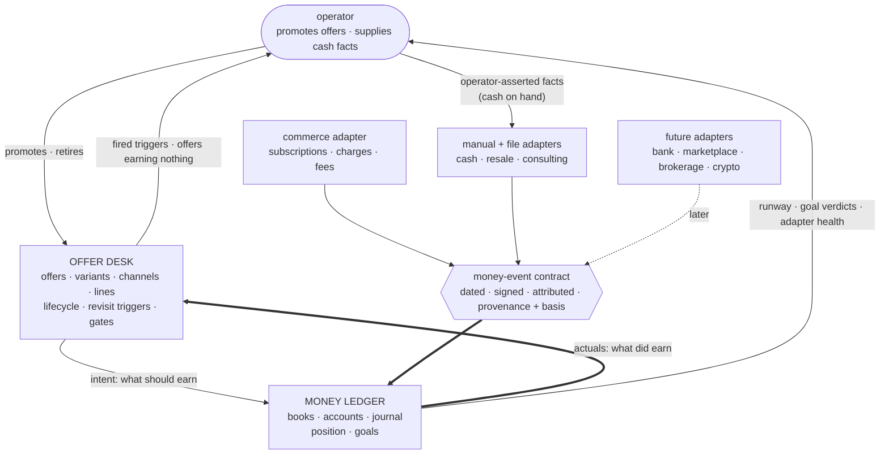
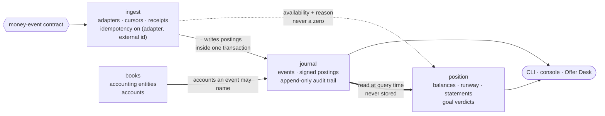
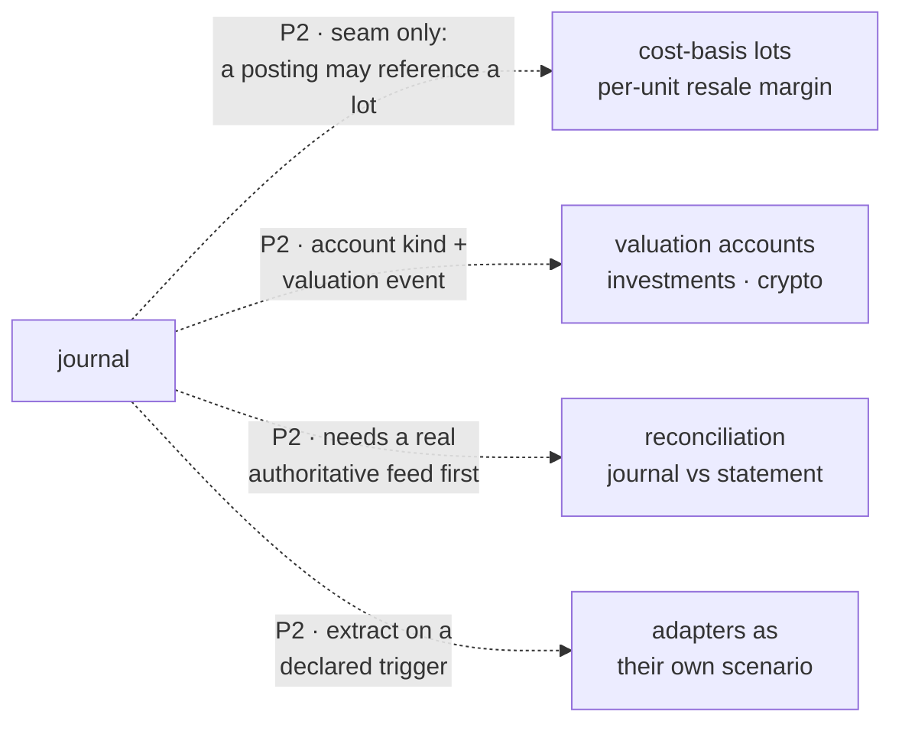

# Flows — Money Ledger

This document is the canonical workflow and state-transition map for
the scenario. Use it when behavior depends on ordered states, retries,
cancellation, stale completion, background jobs, polling, or mutually
exclusive UI modes.

## Purpose Of This Document

Use this document to answer:

- Which user/system workflows matter?
- Which workflows have explicit states and events?
- Which transitions are illegal?
- Which tests prove workflow correctness?
- Which flows are known but not modeled yet?

Plain CRUD with no meaningful ordering constraints does not need a
workflow model.

## Flow Inventory

`health` is a stateless reporting domain and ships no workflows. List
each real stateful flow your domains add below, with its owner, trigger,
outcome, statefulness, and validation level.

| Flow | Domain | Trigger | Outcome | Statefulness | Validation |
|---|---|---|---|---|---|
| Ingest a money event | ingest | An adapter run, a file upload, or an operator entry. | One or more postings in the journal, or a rejection. | Idempotent on (adapter, external id); a partial sync resumes from its cursor. | L2 |
| Correct an entry | journal | An operator determines a posted event was wrong. | A reversing entry referencing the original; both remain readable. | Terminal. A reversal cannot itself be edited. | L2 |
| Sync an adapter | ingest | Schedule or manual trigger. | Events ingested, cursor advanced, or an availability record with a reason. | Retries with backoff; an unavailable adapter never writes a zero-valued event. | L2 |
| Evaluate a goal | position | Position read, or a scheduled evaluation. | A goal verdict with the sustain window's progress. | Stateless over the journal; a verdict is never stored as fact. | L1 |

## Flow Details

Document each real flow here with its owner domain, trigger, inputs,
ordered steps, outputs, failure modes, retry/cancel behavior, tests, and
generated subpackages. The worked example below shows the expected shape.

### Flow — ingest a money event

**Owner:** `ingest`. **Trigger:** adapter run, file upload, or operator entry.

1. The adapter produces candidate `MoneyEvent`s, each carrying amount, direction, currency, date, target account, provenance (adapter, external id, fetch time) and a **basis**.
2. Ingestion rejects any event missing a provenance field or naming an unknown account.
3. Ingestion checks `(adapter, external_id)` against receipts. A match is a no-op — this is what makes re-running an adapter over an overlapping window safe.
4. Accepted events are written as signed postings inside one transaction, together with their audit entry.
5. The adapter's cursor advances only after the transaction commits, so a crash re-reads rather than skips.

**Failure modes:** an unreachable upstream produces an availability record with a reason and the age of the last success — never a zero-valued event, because a silent zero is indistinguishable from a real one. A malformed payload rejects the individual event and continues the batch.

### Flow — correct an entry

**Owner:** `journal`. **Trigger:** an operator determines a posted event was wrong.

The journal offers no edit and no delete. A correction posts a reversing entry that references the original and carries a reason; both remain readable, and the audit trail shows the sequence. This is deliberate: it costs a little convenience and buys the property that no past state can be quietly rewritten — which is what version control was providing before this data moved into a database.

### Flow — evaluate a goal

**Owner:** `position`. **Trigger:** a position read or a scheduled evaluation.

A goal is a declared threshold: a measure, a comparison, a value, an optional sustain window, and an optional buffer multiple. Evaluation computes the measure from the journal, compares it, and reports the sustain window's progress. A goal is never *stored* as met; it is evaluated, so it cannot go stale.

The "default-alive" rule that motivated this scenario is one instance of that shape — recurring revenue at or above burn, sustained for three periods, with a buffer target — and it requires no code the generic evaluator does not already have.

<!-- EXAMPLE-DOMAIN:notes START -->
### Example domain — `notes` (removed by `template-manager detemplate`)

The template ships an `Attachment upload` flow on the `notes` domain as a
worked Level 5 temporal-workflow vertical slice. Copy its shape for your
own stateful flows, then remove it.

Add this row to the Flow Inventory above:

| Flow | Domain | Trigger | Outcome | Statefulness | Validation |
|---|---|---|---|---|---|
| Attachment upload | notes | User/CLI uploads a file for a note. | Blob is stored and metadata is persisted. | Stateful upload request with validation and failure paths. | Level 5 workflow tests: matrix, traces, declarative spec, checked Quint model, generated artifacts, and production replay. |

#### Attachment upload

- Owner domain: notes.
- Trigger: multipart upload request from UI or CLI.
- Inputs: note id, file key/name, file bytes, content type, file size.
- Steps:
  1. Parse multipart request.
  2. Validate note id and file metadata.
  3. Store opaque bytes through BlobStore.
  4. Persist attachment metadata through notes repository seam.
  5. Return proto-typed metadata response.
- Outputs: uploaded attachment metadata or typed error response.
- Failure modes: missing note id, missing file, invalid metadata, blob
  write failure, metadata persistence failure.
- Retry/cancel behavior: caller may retry after transport/storage
  failure; duplicate handling belongs to the owning real domain when
  product requirements demand it.
- Tests: `api/handlers/notes/attachments_handler_test.go`,
  `api/internal/notes/attachments_service_test.go`,
  `api/internal/notes/flow/flow_test.go`,
  `ui/src/features/notes/AttachmentUpload.test.tsx`, and
  `ui/src/features/notes/flow/flow.test.ts`.
- Generated subpackages: `api/internal/notes/flow/generated/`
  (`model.qnt`, `artifact.json`, `runtime.go`, `replay.go`) and
  `ui/src/features/notes/flow/generated/` (`model.qnt`, `artifact.json`,
  `runtime.ts`, `replay.helper.ts`).
- Requirements: template starter only.

These example state machines belong in the State Machines table below:

| Domain/Flow | States | Illegal Transitions | Enforcement |
|---|---|---|---|
| notes / attachment upload API | received, bytes_stored, metadata_recorded, failed | metadata before bytes, terminal-state escape, duplicate terminal events | `*.flow.json` contract, generated Quint model, generated formal artifact replay, side-effect cleanup tests |
| notes / attachment upload UI | idle, selected, uploading, succeeded, failed | start before select, stale completion after reset/reselect, retry without file context | `*.flow.json` contract, generated Quint model, generated formal artifact replay, attempt-id stale completion tests |
<!-- EXAMPLE-DOMAIN:notes END -->

## State Machines

List each modeled flow's states, illegal transitions, and how they are
enforced. Plain CRUD with no ordering constraints does not appear here.

| Domain/Flow | States | Illegal Transitions | Enforcement |
|---|---|---|---|
| ingest / event | `received → accepted → posted`, or `received → rejected`, or `received → duplicate` | `posted → rejected`; `duplicate → posted`; any transition out of a terminal state. | Service-level state check plus the `(adapter, external_id)` uniqueness constraint. |
| journal / posting | `posted → reversed` | `posted → deleted`; `reversed → posted`; any edit of a posted row. | No delete or update path exists on the repository; a reversal is an insert. |
| ingest / adapter run | `idle → running → { succeeded, failed, partial }` | `running → idle` without a terminal record; cursor advance on `failed`. | Cursor advances only inside the committing transaction. |

## Maturity Ladder

Temporal workflows mature in layers. Do not skip the executable layers
to add a standalone formal document.

| Level | Name | What exists |
|---|---|---|
| 0 | Unmodeled risk | Lifecycle behavior exists only inside handlers, components, callbacks, or jobs. |
| 1 | Inventory | The flow is listed here with owner, source links, risk, and next step. |
| 2 | Workflow model | State/status values, event values, `Transition`, and `CheckInvariants` live beside the owning domain or feature. |
| 3 | Matrix + traces | Tests cover every state/event pair and replay representative traces against production transition logic. |
| 4 | Declarative contract | A domain-local `*.flow.json` declares states, events, transitions, invariants, and named traces. |
| 5 | Checked formal model | Quint/TLA+ or an equivalent tool is generated from the contract, checked, and replayed by production tests. |

## Production Shape

Three (Go) or four (UI) files per flow at the top of the feature folder,
plus one `generated/` sibling. Everything in `generated/` is codegen output.

Every flow lives in a `flow/` subdirectory next to its consumer with
conventional file names. API domains that own durable lifecycle state use:

```text
api/internal/<domain>/
  flow/
    flow.json                   # hand: source of truth (schema v6)
    transition.go               # hand: wrapper (package flow)
    flow_test.go                # hand: thin replay delegation (package flow)
    generated/
      model.qnt
      artifact.json
      runtime.go                # package generated
      replay.go
```

UI features that own client-side modes use:

```text
ui/src/features/<domain>/
  flow/
    flow.json                   # hand: source of truth (schema v6)
    transition.ts               # hand: wrapper
    fixtures.ts                 # hand: replay fixtures
    flow.test.ts                # hand: thin replay delegation
    generated/
      model.qnt
      artifact.json
      runtime.ts
      replay.helper.ts
```

Every flow uses the same file names. The `flow/` directory IS the unit;
the contract no longer declares any output paths or module names.

The workflow owns state/status values, events, `Transition`, and
`CheckInvariants`. It should be pure or nearly pure. Effects live
outside the workflow behind seams: repositories, BlobStore, clocks,
timers, HTTP clients, or UI API modules.

The `*.flow.json` contract is the source of truth. Level 5 generated
Quint models, formal artifacts, and Go/TypeScript declarations are
checked-in source artifacts for reviewability, but they are refreshed
and checked by the `flow-verifier` scenario CLI; the
scenario lifecycle runs `make temporal-models` (which calls
`flow-verifier verify check`) before the normal test
suite. A Quint file by itself is not accepted: the model must typecheck,
test, verify named invariants, emit deterministic artifacts, and those
artifacts must replay against the production Go/TypeScript transition
functions.

The generated declarations keep state/event topology and formal
freshness metadata out of hand-maintained test lists. They also provide
pure status-transition helpers generated from the `*.flow.json`
transition matrix. For TypeScript flows, the same declarations can own
the discriminated state/event union shape and replay fixture contract.
Production workflow wrappers call those helpers for abstract validity
and next-status outcomes, while keeping payload validation, side-effect
orchestration, and rich state construction in hand-authored code. API
replay tests get expected paths, hashes, invariants, and generated checks
from `generated/<folder>/runtime.go`; UI replay tests import the same metadata
from `generated/<folder>/runtime.ts`. The generated `replay.{go,helper.ts}`
files own the assertion calls; the hand-authored top-level test simply binds
the wrapper's transition function and the fixtures and invokes
`RunReplay`/`runFormalReplay` once.

Formal artifacts use schema v6 coverage metadata. Matrix completeness,
terminal transition checks, named trace coverage, and generated MBT trace
coverage are separate fields. Do not treat generated trace
`allPairsCovered` as required proof of correctness; replay tests require
the complete transition matrix and named traces, while generated trace
coverage reports how much the model explorer happened to visit.

Schema v6 `flow.json` files carry no path or module information. The
`replay` block declares only `transition.function` (plus
`transition.statusAccessor` for TS or `transition.stateType` /
`transition.statusField` for Go). Everything else is derived from the
flow directory.

Go flows emit `flow/generated/replay.go` and require a hand-authored
`flow/flow_test.go` (package `flow`) that calls `generated.RunReplay`.
TypeScript flows emit `flow/generated/replay.helper.ts` and require a
hand-authored `flow/flow.test.ts` that calls
`runFormalReplay({ transition, fixtures })` at module top level.
`flow-verifier verify check` byte-compares every generated file and runs an
AST-level lint over the hand-authored test, so a silent bypass — missing
import, stubbed transition, or call buried inside a guarded block —
fails the check.

To scaffold a new flow:

```bash
flow-verifier flows new ui/src/features/<feature> --flow-id <flow-id> --lang ts --root .
flow-verifier flows new api/internal/<domain>     --flow-id <flow-id> --lang go --root .
```

The scaffold writes the hand-authored files and immediately runs
`generate`, so `check` is green from the moment it returns.

To add or rename a state/event:

1. Edit the owning `*.flow.json`.
2. Regenerate that flow with `flow-verifier verify run --flow <flow-id>`.
3. Update only payload-specific wrapper branches that need new runtime
   data; the abstract transition table is generated.
4. Update the UI replay fixture module. The generated formal replay fixture
   interface should make missing state/event fixtures a type error.
5. Run `make temporal-models` and the scenario tests.

## How The Pieces Fit Together

Three documents describe this scenario's place in a larger shape, and this section is the one picture that shows it. Money Ledger is one of two scenarios that replaced a hand-maintained plan of record; the other, **Offer Desk**, holds what *should* be sold. Neither can answer "this offer is active and has earned nothing" alone.



**The load-bearing decision is the contract, not the adapters.** A landing page, a payment processor, a marketplace, a brokerage and a person typing a number all produce the same thing: a dated, signed, attributed money event with provenance. Standardising *that* is what lets any upstream attach without requiring the upstream to conform to anything. No P0 target names a specific upstream, and that is deliberate.

### Inside the ledger



Two properties this drawing is meant to make obvious. **Nothing writes a balance** — `position` reads the journal at query time, so a figure cannot disagree with the postings that produced it. And **`ingest` has exactly one outbound edge into state**: adapters, the most breakable part of the system, can only add events.

### What is deliberately not here yet



Dotted edges are **seams held open, not work planned**. Each is cheap to accommodate now and expensive to retrofit, and each has a stated condition for becoming real:

| Seam | Becomes real when |
|---|---|
| Cost-basis lots | A capability actually runs a resale loop. None exists; the revenue line that would need it is still a candidate with an unfired trigger. |
| Valuation accounts | The operator holds something whose value moves without a transaction and wants it in net position. |
| Reconciliation | A feed exists that is authoritative enough to reconcile *against*. Reconciling against nothing is not a feature. |
| Adapter extraction | A third live adapter lands, **or** adapters need retry schedules independent of the journal's clock, **or** stored credentials need rotation — at which point the security boundary alone justifies the split. |

## Cross-References

- [`DOMAINS.md`](DOMAINS.md) — owning domain map
- [`DATA.md`](DATA.md) — persisted state and retention
- [`../internal/SEAMS.md`](../internal/SEAMS.md) — side-effect boundaries
- [`../internal/TESTING.md`](../internal/TESTING.md#temporal-workflow-tests) — matrix and trace testing
