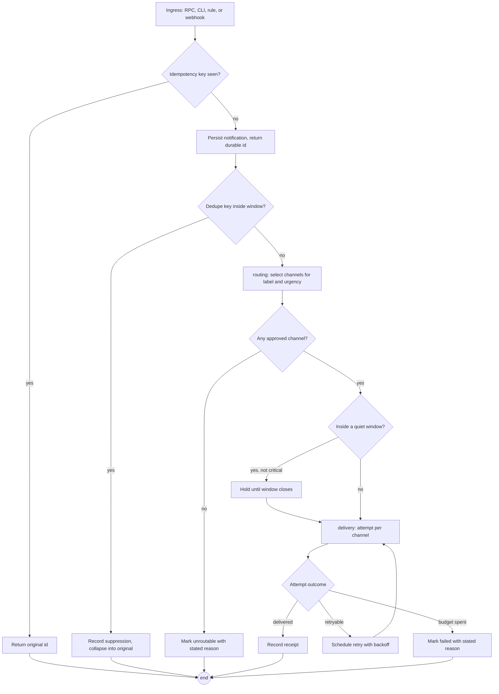
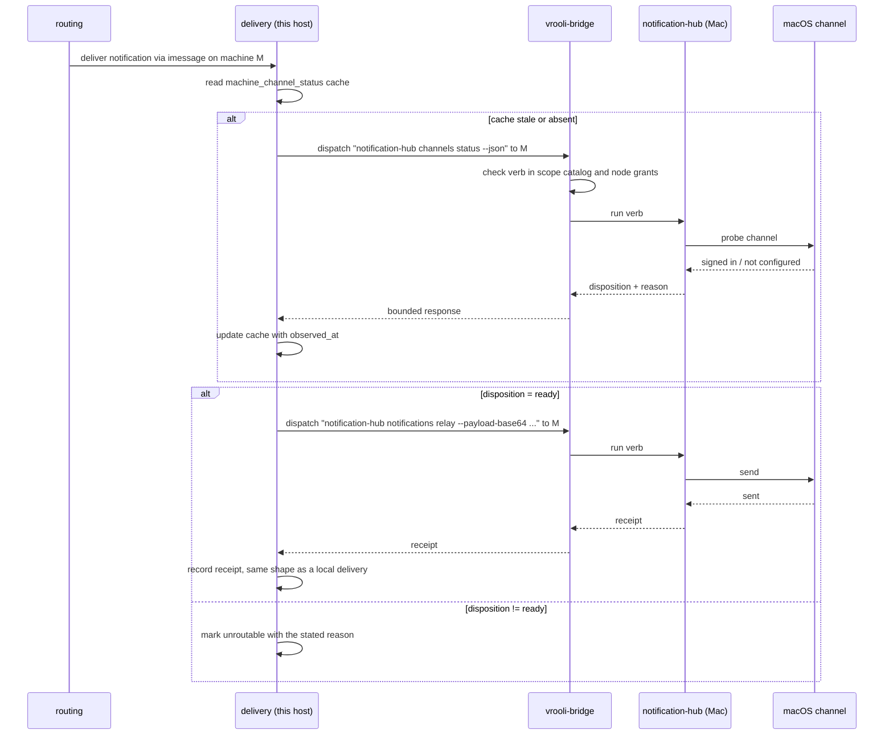
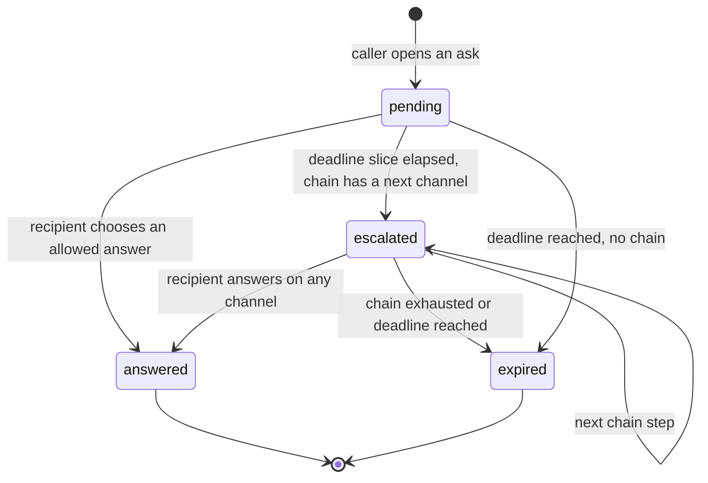

# Flows — Notification Hub

Ordered, stateful behavior in this scenario: what moves through the
system, in what order, and which states are illegal.

## Purpose Of This Document

A notification is not a CRUD record. It is accepted, judged, held,
attempted, retried, and finally resolved — and at several points it can
end in a state that looks like success from outside while nothing reached
a human. This document names those flows so the failure modes are
designed for rather than discovered.

## Flow Inventory

| Flow | Owner | Risk if unmodeled | Level |
|---|---|---|---|
| Notification lifecycle | `notifications` | A notification sits in `pending` forever and is indistinguishable from one never requested. | Target 4 |
| Delivery attempt and retry | `delivery` | Retry runs without a budget and a dead channel is retried indefinitely. | Target 4 |
| Quiet-hour hold and release | `routing` | A held notification is never released, or is released twice. | Target 3 |
| Ask, answer, escalate | `conversations` | A blocked caller waits forever after a restart. | Target 4 |
| Push subscription lifecycle | `recipients` | An expired subscription looks healthy and every send silently succeeds into nothing. | Target 3 |

## Flow Details

### Notification lifecycle

Every ingress path constructs the same record, so there is one lifecycle
regardless of whether the request came from an agent, the CLI, a rule, or
a webhook.



The two branches that matter most are the ones that end quietly.
`unroutable` and `failed` are terminal states with a stated reason, and
both are surfaced in the API, the CLI, and the UI. No path leaves a
notification in `pending` (OT-P0-011).

### Cross-node delivery

When the selected channel is host-bound, `delivery` asks this scenario's
own instance on the machine that owns the channel. The channel vocabulary
never enters `vrooli-bridge`.



`vrooli-bridge` answers only three questions here: does the machine exist,
is it online, and may this caller send it anything. It carries the call
and learns nothing about notifications.

### Ask, answer, escalate

An ask is an ordinary notification carrying a question, plus a durable
pending record that outlives an API restart.



The blocking call returns on `answered` or `expired`. It never returns on
`escalated`, which is an intermediate state. A caller that disconnects
does not cancel the ask; the answer is still recorded.

## State Machines

| Domain/Flow | States | Illegal Transitions | Enforcement |
|---|---|---|---|
| notifications | `pending`, `held`, `routed`, `delivered`, `failed`, `unroutable`, `suppressed` | `pending` to `delivered` without a routing decision; any terminal state to any other state; remaining in `pending` past the sweeper interval | `flow.json` contract, generated model, replay tests, plus a sweeper test that proves no record stays `pending` |
| delivery attempt | `scheduled`, `in_flight`, `delivered`, `retry_scheduled`, `failed` | `retry_scheduled` after the retry budget is spent; `in_flight` without a parent routing decision | `flow.json` contract and replay tests |
| ask | `pending`, `escalated`, `answered`, `expired` | `answered` after `expired`; escalation past the end of the chain | `flow.json` contract, deadline sweeper tests |
| push subscription | `active`, `stale`, `gone` | `gone` back to `active` without a new subscribe; sending to `gone` | Repository constraint plus a delivery-path guard |
| hold | `held`, `released` | Releasing twice; releasing before the window closes | Unique release record per hold |

## Maturity Ladder

Temporal workflows mature in layers. Do not skip the executable layers
to add a standalone formal document.

| Level | Name | What exists |
|---|---|---|
| 0 | Unmodeled risk | Lifecycle behavior exists only inside handlers, components, callbacks, or jobs. |
| 1 | Inventory | The flow is listed here with owner, source links, risk, and next step. |
| 2 | Workflow model | State/status values, event values, `Transition`, and `CheckInvariants` live beside the owning domain or feature. |
| 3 | Matrix + traces | Tests cover every state/event pair and replay representative traces against production transition logic. |
| 4 | Declarative contract | A domain-local `*.flow.json` declares states, events, transitions, invariants, and named traces. |
| 5 | Checked formal model | Quint/TLA+ or an equivalent tool is generated from the contract, checked, and replayed by production tests. |

## Production Shape

Three (Go) or four (UI) files per flow at the top of the feature folder,
plus one `generated/` sibling. Everything in `generated/` is codegen output.

Every flow lives in a `flow/` subdirectory next to its consumer with
conventional file names. API domains that own durable lifecycle state use:

```text
api/internal/<domain>/
  flow/
    flow.json                   # hand: source of truth (schema v6)
    transition.go               # hand: wrapper (package flow)
    flow_test.go                # hand: thin replay delegation (package flow)
    generated/
      model.qnt
      artifact.json
      runtime.go                # package generated
      replay.go
```

UI features that own client-side modes use:

```text
ui/src/features/<domain>/
  flow/
    flow.json                   # hand: source of truth (schema v6)
    transition.ts               # hand: wrapper
    fixtures.ts                 # hand: replay fixtures
    flow.test.ts                # hand: thin replay delegation
    generated/
      model.qnt
      artifact.json
      runtime.ts
      replay.helper.ts
```

Every flow uses the same file names. The `flow/` directory IS the unit;
the contract no longer declares any output paths or module names.

The workflow owns state/status values, events, `Transition`, and
`CheckInvariants`. It should be pure or nearly pure. Effects live
outside the workflow behind seams: repositories, BlobStore, clocks,
timers, HTTP clients, or UI API modules.

The `*.flow.json` contract is the source of truth. Level 5 generated
Quint models, formal artifacts, and Go/TypeScript declarations are
checked-in source artifacts for reviewability, but they are refreshed
and checked by the `flow-verifier` scenario CLI; the
scenario lifecycle runs `make temporal-models` (which calls
`flow-verifier verify check`) before the normal test
suite. A Quint file by itself is not accepted: the model must typecheck,
test, verify named invariants, emit deterministic artifacts, and those
artifacts must replay against the production Go/TypeScript transition
functions.

The generated declarations keep state/event topology and formal
freshness metadata out of hand-maintained test lists. They also provide
pure status-transition helpers generated from the `*.flow.json`
transition matrix. For TypeScript flows, the same declarations can own
the discriminated state/event union shape and replay fixture contract.
Production workflow wrappers call those helpers for abstract validity
and next-status outcomes, while keeping payload validation, side-effect
orchestration, and rich state construction in hand-authored code. API
replay tests get expected paths, hashes, invariants, and generated checks
from `generated/<folder>/runtime.go`; UI replay tests import the same metadata
from `generated/<folder>/runtime.ts`. The generated `replay.{go,helper.ts}`
files own the assertion calls; the hand-authored top-level test simply binds
the wrapper's transition function and the fixtures and invokes
`RunReplay`/`runFormalReplay` once.

Formal artifacts use schema v6 coverage metadata. Matrix completeness,
terminal transition checks, named trace coverage, and generated MBT trace
coverage are separate fields. Do not treat generated trace
`allPairsCovered` as required proof of correctness; replay tests require
the complete transition matrix and named traces, while generated trace
coverage reports how much the model explorer happened to visit.

Schema v6 `flow.json` files carry no path or module information. The
`replay` block declares only `transition.function` (plus
`transition.statusAccessor` for TS or `transition.stateType` /
`transition.statusField` for Go). Everything else is derived from the
flow directory.

Go flows emit `flow/generated/replay.go` and require a hand-authored
`flow/flow_test.go` (package `flow`) that calls `generated.RunReplay`.
TypeScript flows emit `flow/generated/replay.helper.ts` and require a
hand-authored `flow/flow.test.ts` that calls
`runFormalReplay({ transition, fixtures })` at module top level.
`flow-verifier verify check` byte-compares every generated file and runs an
AST-level lint over the hand-authored test, so a silent bypass — missing
import, stubbed transition, or call buried inside a guarded block —
fails the check.

To scaffold a new flow:

```bash
flow-verifier flows new ui/src/features/<feature> --flow-id <flow-id> --lang ts --root .
flow-verifier flows new api/internal/<domain>     --flow-id <flow-id> --lang go --root .
```

The scaffold writes the hand-authored files and immediately runs
`generate`, so `check` is green from the moment it returns.

To add or rename a state/event:

1. Edit the owning `*.flow.json`.
2. Regenerate that flow with `flow-verifier verify run --flow <flow-id>`.
3. Update only payload-specific wrapper branches that need new runtime
   data; the abstract transition table is generated.
4. Update the UI replay fixture module. The generated formal replay fixture
   interface should make missing state/event fixtures a type error.
5. Run `make temporal-models` and the scenario tests.

## Deferred / Unmodeled Flows

| Flow | Why deferred | Revisit trigger |
|---|---|---|
| Digest collapsing (OT-P1-005) | A digest is a `routing` behavior until it needs its own content assembly. Modelling it now would fix a shape before there is a real example. | When a digest needs composition rules rather than a list of collapsed titles. |
| Scheduled delivery (OT-P1-006) | The hold mechanism quiet hours already needs covers the simple future-send case. | When callers need recurrence or calendar-aware windows. |
| Event subscription matching (OT-P1-003) | The matching engine lives in `vrooli-events`, not here. This scenario only receives the resulting webhook. | When the upstream fan-out engine exists. |

## Cross-References

- [`DOMAINS.md`](DOMAINS.md) — which domain owns each flow.
- [`DATA.md`](DATA.md) — the tables these transitions write.
- [`INTEGRATIONS.md`](INTEGRATIONS.md) — the scenarios involved in cross-node delivery.
- [`../internal/SEAMS.md`](../internal/SEAMS.md) — substitutable boundaries.
