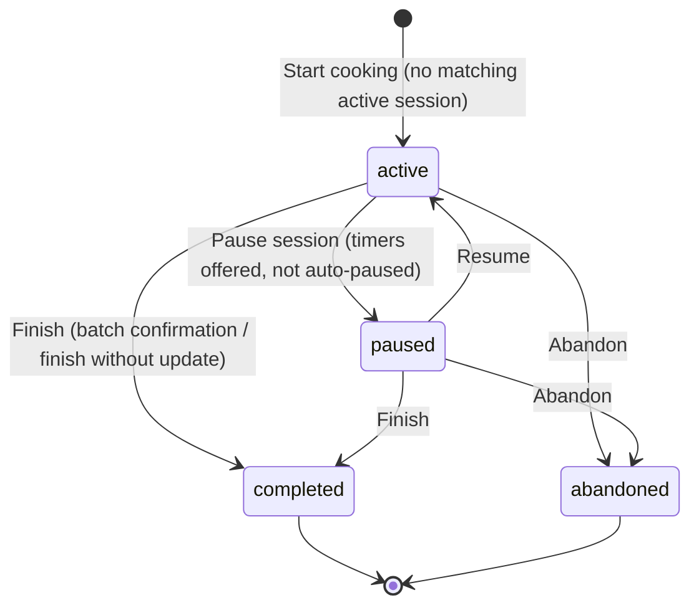
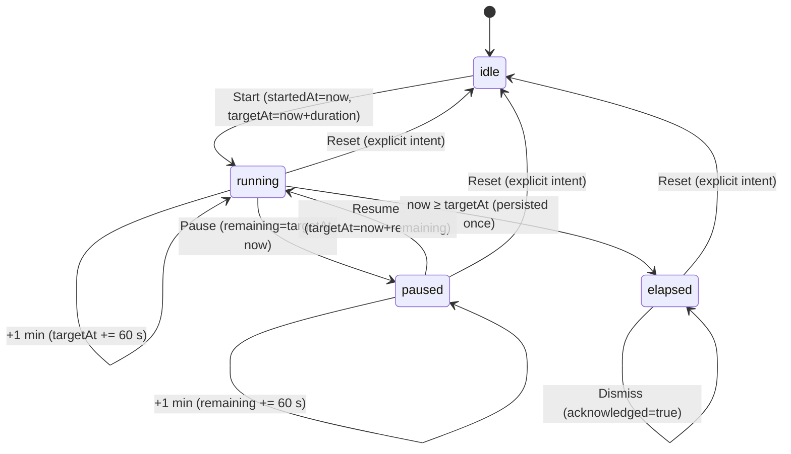
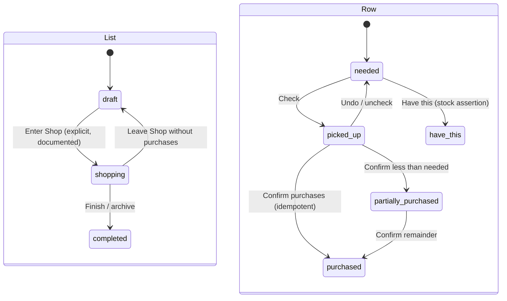
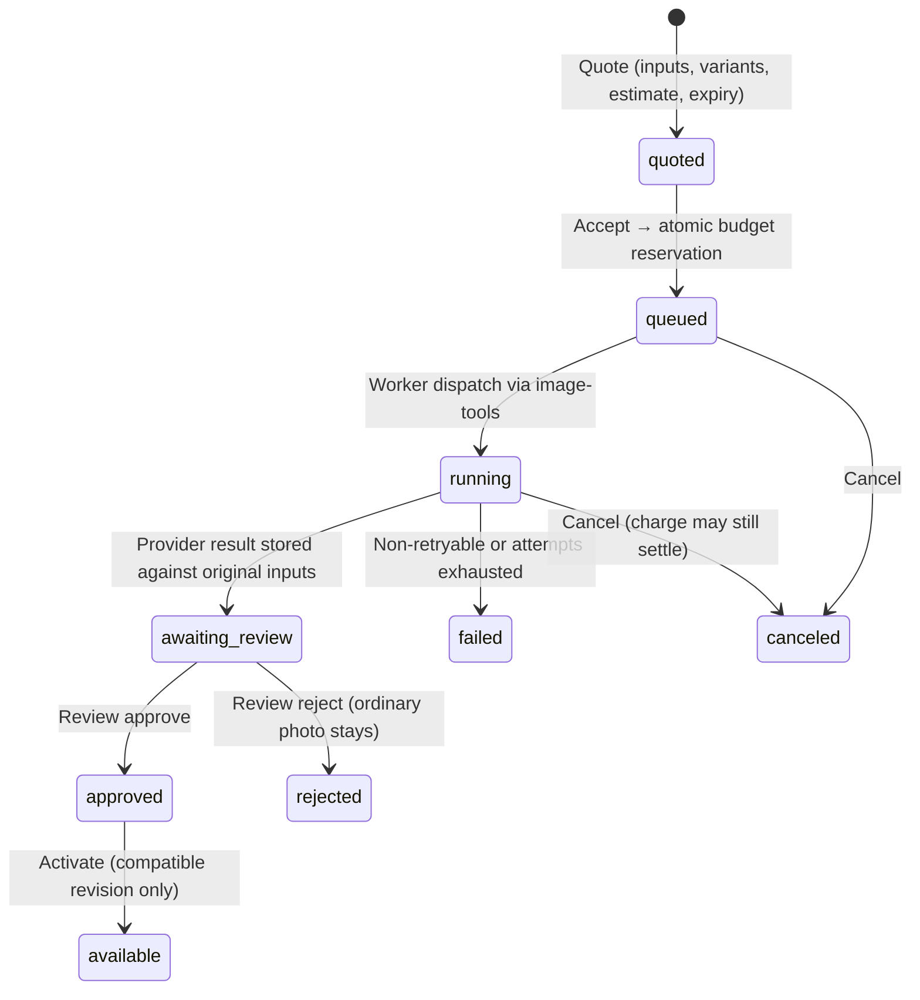
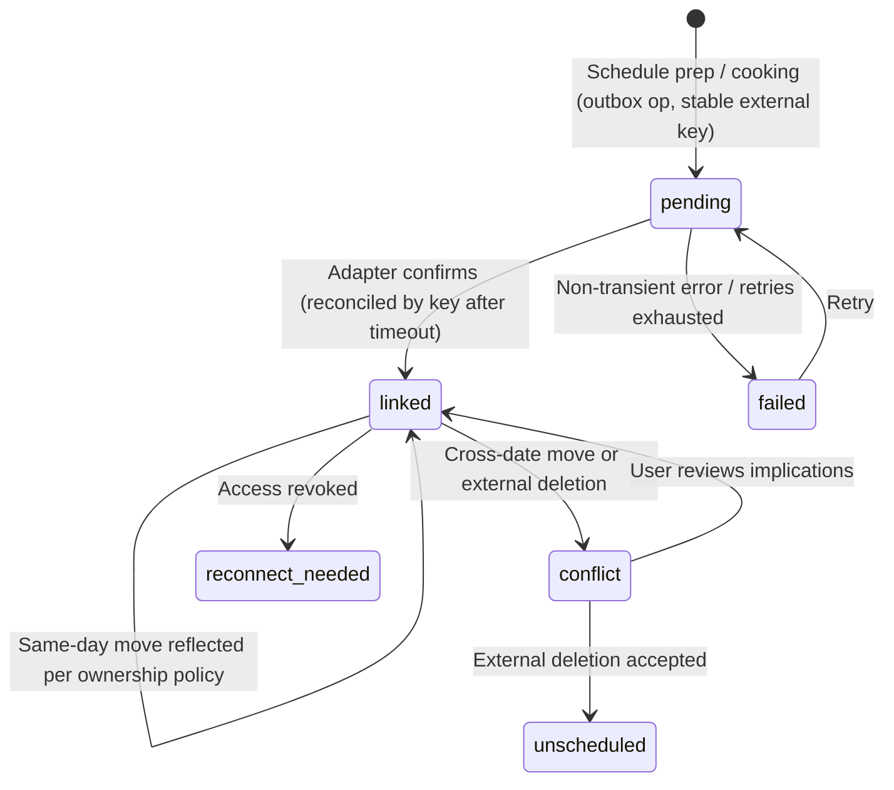
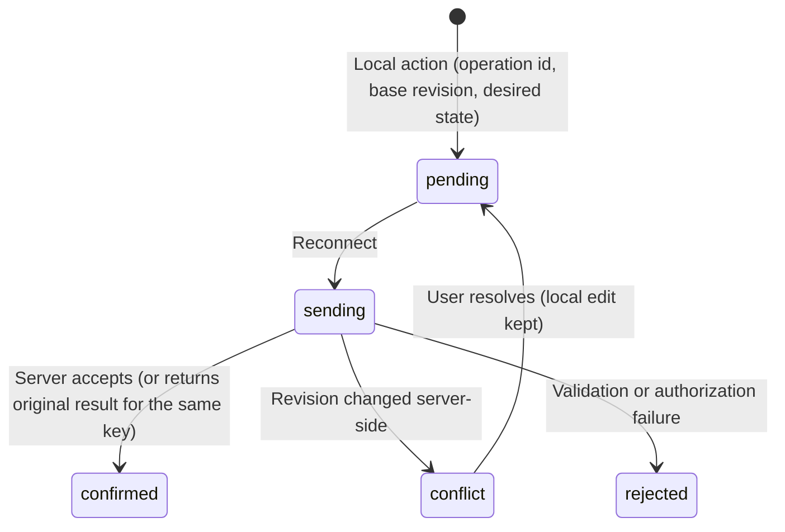
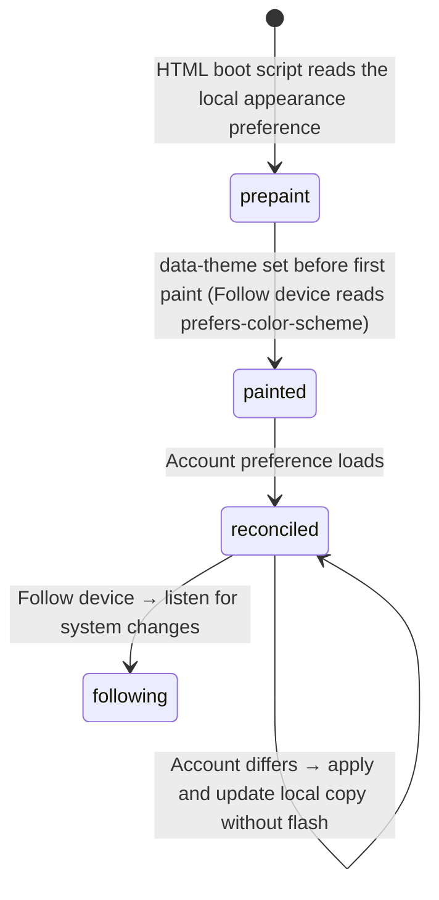

# Flows — Nutrition Planner

This document is the canonical workflow and state-transition map for the scenario. Use it
when behavior depends on ordered states, retries, cancellation, stale completion,
background jobs, offline replay, or mutually exclusive UI modes.

**Current status.** No journey below runs end to end today: every workspace RPC returns
`401 unauthenticated` in the local runtime (B1 in
[`../internal/REDESIGN_PLAN.md` §3.2](../internal/REDESIGN_PLAN.md#32-blocking-defects-fix-first-in-d0)).
The journeys and state machines are **documented intent** at maturity level 1: no
`*.flow.json` contract, generated model, or replay test exists yet.

## Purpose Of This Document

Use this document to answer:

- Which user and system workflows matter, and on which redesigned surfaces they run?
- Which workflows have explicit states and events?
- Which transitions are illegal?
- Which tests prove workflow correctness?
- Which flows are known but not modeled yet?

Plain CRUD with no meaningful ordering constraints does not need a workflow model.

## Flow Inventory

Journeys A–G are specification §4 re-expressed on the redesigned surfaces (R08–R16); H is
the Explore journey R11 adds. The remaining rows are the stateful system flows behind them.

| Flow | Domain | Trigger | Outcome | Statefulness | Validation |
|---|---|---|---|---|---|
| A. A first useful plan | profile-and-preferences, equipment, planning-engine | A new user opens Nooch. | Active rules and a draft week, or an honest unconfigured Explore. | Resumable setup draft; atomic apply; stale-input checks. | L1 |
| B. Capture an existing routine | recipe-library, routines-and-supplements | Add meal or Preferences › Planning routine. | Drafts and reviewed recurring anchors. | Review before write; unresolved quantities kept. | L1 |
| C. A tired evening | planning-engine, intake-and-feedback | Today › Swap meal. | A scoped one-occurrence override. | Quote/apply; conditional undo; locks preserved. | L1 |
| D. Shopping and changes | shopping-list, inventory-and-batches | Groceries › Review, then Shop. | Picked-up rows, confirmed purchases, reviewed plan diffs. | Row states; outbox replay; idempotent purchase. | L1 |
| E. Cooking and logging | cooking-sessions, inventory-and-batches, intake-and-feedback | Start cooking on Today or a recipe. | A finished session, optional batch, optional intake. | Session and timer machines; exactly-once stock effects. | L1 |
| F. A new week | planning-engine, calendar-link | Week › Plan my week. | An applied week with locks kept; optional scheduled prep. | Generate/apply separation; calendar link outbox. | L1 |
| G. Moving data | transfer-and-documents | Settings › Data & exports, or Print. | An envelope, a restore, or a document. | Staged → applied; recoverable checkpoint. | L1 |
| H. Plan a meal from Explore | explore, planning-engine | Week empty slot › Add, or Meals › Explore. | A saved recipe snapshot plus one occurrence, or an explicit Replace preview. | Context revalidation; idempotent save. | L1 |
| Integrated review journey (R27.6) | all | Clean account. | Every step's persisted effect verified end to end. | Composite of A–H. | L0 |
| Generate / apply plan | planning-engine, application-services | Plan my week, replan, swap. | Draft, then an accepted plan revision or a stale/conflict error. | Seeded search; expected revisions; all-or-nothing. | L1 |
| Cooking session and timers | cooking-sessions | Start cooking. | Session terminal state; timers reconciled across tabs. | See State Machines. | L0 |
| Shopping list and rows | shopping-list | Groceries. | Row states and purchases. | See State Machines. | L0 |
| Generation job | generation | Create scene image (opt-in). | Approved asset or an honest failure; usage settled once. | See State Machines. | L0 |
| Calendar link | calendar-link | Schedule prep / Schedule cooking. | Linked event or honest pending/failed/conflict. | See State Machines. | L0 |
| Offline outbox replay | ui, shopping-list, cooking-sessions | Reconnect. | Confirmed, conflicted, or rejected operations; no double apply. | See State Machines. | L0 |
| Appearance boot | ui, profile-and-preferences | Page load. | The chosen appearance at first paint. | See State Machines. | L0 |
| Record / correct intake | intake-and-feedback | I ate a serving, or correction. | Idempotent event; refreshed actual totals. | Key/payload conflict rule. | L1 |
| Confirm preparation | cooking-sessions, inventory-and-batches | Finish cooking › confirm batch. | Batch created; raw ingredients consumed once. | All-or-nothing. | L1 |
| Stage / apply import | transfer-and-documents | File or pasted JSON. | Validation report, then atomic apply. | Parse/preview never mutates. | L1 |
| Run background job | provider-and-job-adapters | Schedule or adapter call. | Terminal job; unapplied proposal if extraction succeeded. | Bounded retries; cancellation. | L1 (no worker exists today) |

## Flow Details

### Journey A — A first useful plan

1. A new user opens Nooch. With no configuration, Today invites **Choose a meal** or **Plan
   my week** — never the demo bowl (R08.4). Explore is usable immediately with an explicit
   "not set up yet" state that makes no claim about allergies it has not been told (R16).
2. Setup runs four steps as a resumable draft: **Your food** (diet preset, exclusions),
   **Your kitchen** (the same EquipmentScene and EquipmentTile components as Kitchen ›
   Equipment; zero is valid), **Your rhythm** (budget, effort, variety, slots, batch
   willingness), **Ready** (summary with fits / needs review / excluded counts from the
   planner's eligibility service).
3. Apply is atomic and previews conflicts with any existing plan; the app opens a plan draft
   or Today.
4. Progressive setup (recurring meals, supplements, targets, stores, units) is offered later
   from Kitchen › Preferences; no targets are prefilled from fixtures.

Failure modes: no eligible meals names the blocking rules and offers Add a meal or Adjust
setup, never relaxation; a stale profile revision invalidates a generated draft.

### Journey B — Capture an existing routine

1. **Meals › Add meal** accepts a name or rough text; a name-only record saves as Draft
   (FIX-01). Paste and file import stage results for review (R10.3).
2. Routine capture (Kitchen › Preferences › Planning routine) builds recurring slots with
   anchors; multiple items per slot are allowed.
3. Only material questions are asked; source text is preserved; nothing — recipe, brand,
   serving weight, dose, target — is invented.

Failure modes: ambiguous extraction stays unresolved with its text; a late async extraction
never overwrites a newer edit.

### Journey C — A tired evening

1. Today's hero shows the selected occurrence; the user presses **Swap meal**.
2. Suitable alternatives appear immediately; optional reason chips (Something different,
   Less effort, Lower cost, Missing ingredients) rerank them. Blocked alternatives are
   inspectable but not selectable.
3. A compatible simple swap applies quickly with conditional Undo; material conflicts
   (locks, leftover dependencies, required targets, large grocery changes) show an impact
   preview (R08.2).
4. Only the chosen occurrence changes; groceries and assessments update coherently (AT-007).

Failure modes: undo restores only if revisions still match; consumed occurrences are never
offered for replacement; a missing-ingredient exclusion belongs to this swap only.

### Journey D — Shopping and changes

1. **Groceries › Review** shows scope, aisle groups, need, stock considered, missing,
   package plan, price coverage, contributing meals, and pantry checks with **Have this**.
2. Entering **Shop** starts shopping through an explicit, documented transition; checking a
   row moves it to **Picked up** with immediate Undo and no focus loss.
3. **Confirm purchases** previews actual amounts and optional prices, then creates purchase
   and inventory events atomically and idempotently; partial fulfillment keeps the remaining
   need visible.
4. A plan change while shopping produces a reviewable diff (Added, Changed, No longer
   needed); picked-up rows, manual items, and overrides are preserved (R14.3).
5. Offline, checks and manual items queue in the outbox and replay on reconnect (R22).

Failure modes: an increased requirement flags the extra amount rather than pretending it was
picked up (AT-034); a stale diff is revalidated; two devices checking the same row apply the
desired state once (AT-035).

### Journey E — Cooking and logging

1. **Start cooking** creates or resumes a session pinned to the recipe revision, method,
   scale, and occurrence; a matching active session offers Resume or Start another.
2. The focused shell hides the destinations; **Exit cooking** and **View full recipe** stay
   available. **Mark step done** records completion; **Previous / Next** navigate only.
3. Timers run from absolute timestamps and survive reload, route changes, and multiple tabs.
4. Finishing offers batch confirmation (actual yield, ingredient adjustments), **Finish
   without inventory update**, and separately **I ate a serving**; optional feedback records
   actual active time and "keep in rotation / less often".

Failure modes: a recipe edit during cooking leaves the session pinned (AT-018); timer expiry
completes nothing; undo cooking is allowed only when no downstream portion makes it
irreversible, otherwise a correction flow explains the affected records.

### Journey F — A new week

1. **Week › Plan my week** previews unlocked future slots; anchors, locks, open and social
   slots, and recorded history are kept.
2. Apply is revision-checked; a stale proposal is revalidated.
3. **Prep for the week** groups supported tasks; **Schedule prep** proposes a time block
   through the calendar link, which never marks the task done.

Failure modes: a producer moved after its leftover consumer is rejected or repaired; a
calendar failure leaves the untimed task intact.

### Journey G — Moving data

1. **Settings › Data & exports** offers complete backup, recipe collection, grocery CSV, and
   restore; recipe, week, and grocery **Print** actions live on their surfaces.
2. Import detects format and version, enforces limits, and shows counts, duplicates,
   conflicts, missing references, and omissions before any write.
3. Apply is one transaction against an expected revision; full restore creates a checkpoint.

Failure modes: invalid entries reject the whole import by default; a failed restore leaves
the previous workspace intact.

### Journey H — Plan a meal from Explore

1. From an empty Wednesday dinner cell, **Add** opens Explore with context `{date, slotId,
   plannedServings, returnRoute, basePlanRevision}` and the banner **Planning Wednesday
   dinner** (R03.2).
2. Sections show only meaningful results with structured reasons; hard constraints filter
   first through the planner's eligibility path.
3. **Add to Wednesday** saves an accessible recipe snapshot and creates the occurrence in one
   operation; replacing an existing meal reads **Replace Wednesday dinner** and previews
   effects (R11.3). Dismissing the banner returns to general discovery without deleting
   anything.

Failure modes: a concurrent plan change produces a refreshed choice, not an overwrite; saving
twice is idempotent (AT-021).

## State Machines

Specified, not yet encoded. `Enforcement` names the intended mechanism.

| Domain/Flow | States | Illegal Transitions | Enforcement |
|---|---|---|---|
| recipe-library / authoring | `draft → ready → archived` | Recommending a draft; resolving an archived recipe into new plans. | Status on identity, separate from immutable revisions. |
| dietary-rules / eligibility | `eligible ⇄ { ineligible, needs_information }` as rules or evidence change | Treating `needs_information` as eligible; overriding `ineligible` with a weight. | Recomputed per profile revision and evaluator version. |
| planning-engine / occurrence | `planned → locked → cooked → consumed`, `planned → skipped`, `locked → planned`, past non-terminal → `unrecorded` | Editing consumed or skipped occurrences; replanning a lock away; deriving `consumed` from the plan. | Persisted occurrence rows with revisions (D-033); consumption requires an event. |
| inventory / prepared batch | `created → depleting → { consumed, wasted }` | Consuming more than remains; batch without confirmation; reverting after downstream portions. | Idempotent events and batch arithmetic. |
| inventory / purchase | `proposed → recorded → corrected` | Double-applying; treating a check as a purchase. | Source-transaction dedup key plus operation key. |
| intake / consumption | `unrecorded → recorded → corrected` | Editing or deleting in place; recording twice under one key. | Key/payload conflict detection; linked corrections. |
| transfer / import | `staged → { applied, canceled }` | Writing while staged; applying stale or canceled. | Stage id/hash plus expected revision in the apply transaction. |
| jobs / background job | `queued → running → { waiting_for_review, succeeded, failed, canceled }` | Applying from failed/canceled; retrying non-retryable failures forever. | Job record with attempts, dedup key, budget, application status. |

### Cooking session



Step view, step completion, timers, batch confirmation, and intake are **separate** records.
Illegal: completing a step because it was viewed or because a timer expired; leaving
`completed`/`abandoned`; silently cancelling timers or recording intake on Exit cooking;
re-pointing a session at a newer recipe revision without an explicit choice (R13.1–R13.2).

### Cooking timer



Every transition increments the timer revision and carries an operation id. Display is
derived from absolute timestamps and the current time, never from an in-memory countdown
alone. Across tabs, expiry is persisted and announced once (AT-028). While active, monotonic
elapsed time guards against clock jumps; on resume, a documented wall-clock/server
reconciliation applies (R13.3). Illegal: expiry marking a step or meal complete; an elapsed
timer silently becoming a new run.

### Shopping list and rows



`have_this` records inventory evidence and does **not** check the row; a qualitative "Have
some" leaves a pantry check rather than subtracting invented grams. `purchased` is the only
row state backed by purchase and inventory events.

**Plan-change diff (while shopping).** A plan change computes `{added, changed, no longer
needed}` against the list's requirement revision → the user reviews → apply with expected
list and plan revisions. Rows keep stable identities through canonical requirement grouping;
unchanged requirements keep their state; increases mark the extra amount for review;
picked-up rows whose meal disappeared stay visible as history; manual items and overrides are
never dropped (R14.3, AT-033–AT-034).

### Generation job



Reservation is taken before dispatch against settled use plus outstanding reservations and
the maximum attempt cost; on known final usage it is settled or released **exactly once**;
unknown usage stays pending until reconciled, never free (R18.3). The dedup key covers
workspace scope, recipe visual revision, photo hash, scene version, appearance, composition,
model configuration, prompt version, and output parameters; "Generate another version" uses a
new variation id. Illegal: activating a result against a newer recipe revision without
compatibility review; any generation triggered by view, theme, search, hover, or resize
(R18.1–R18.2, AT-040–AT-043).

### Calendar link



After a timeout the adapter reconciles by the stable key or stored operation before creating
another event (AT-045). Deleting a calendar block unschedules time only; completing a calendar
task never records eating; a cross-date move previews meal and leftover implications and never
silently moves a dinner (R24.3, AT-046).

### Offline outbox replay



Operations carry **desired state**, not toggles, so two clients setting the same checkbox to
true never flip it twice. The outbox is bounded, partitioned by account and workspace, and
cleared on sign-out per policy. Only the R22 offline minimum queues: shopping checks and manual
items, and timer controls for a loaded session. Planning, imports, generation, and first-time
loads require connectivity and say so.

### Appearance boot



Theme changes never generate images and never modify recipe, servings, history, or planning
settings; native control colour scheme matches (R05.2, AT-002, AT-003).

## Maturity Ladder

| Level | Name | What exists |
|---|---|---|
| 0 | Unmodeled risk | Lifecycle behavior exists only inside handlers, components, callbacks, or jobs. |
| 1 | Inventory | The flow is listed here with owner, source links, risk, and next step. |
| 2 | Workflow model | State/status values, events, `Transition`, and `CheckInvariants` live beside the owning domain or feature. |
| 3 | Matrix + traces | Tests cover every state/event pair and replay representative traces against production transition logic. |
| 4 | Declarative contract | A domain-local `*.flow.json` declares states, events, transitions, invariants, and named traces. |
| 5 | Checked formal model | A generated Quint/TLA+ model is checked and replayed by production tests. |

All flows are at level 0–1. Promote first, in this order, because they carry the riskiest
idempotency and stale-completion behavior: **cooking timer**, **shopping row plus outbox**,
**generation reservation**, **planned occurrence**, **calendar link**. A redesign surface is not
done while its flow is level 0.

## Production Shape

Three (Go) or four (UI) files per flow, plus one `generated/` sibling. Everything in
`generated/` is codegen output.

```text
api/internal/<domain>/
  flow/
    flow.json                   # hand: source of truth (schema v6)
    transition.go               # hand: wrapper (package flow)
    flow_test.go                # hand: thin replay delegation (package flow)
    generated/
      model.qnt
      artifact.json
      runtime.go                # package generated
      replay.go
```

```text
ui/src/features/<surface>/
  flow/
    flow.json                   # hand: source of truth (schema v6)
    transition.ts               # hand: wrapper
    fixtures.ts                 # hand: replay fixtures
    flow.test.ts                # hand: thin replay delegation
    generated/
      model.qnt
      artifact.json
      runtime.ts
      replay.helper.ts
```

The workflow owns states, events, `Transition`, and `CheckInvariants`, and stays pure; effects
live behind seams (repositories, blob storage, clock, timers, HTTP clients, UI API modules).
The `*.flow.json` contract is the source of truth; `make temporal-models` (which calls
`flow-verifier verify check`) runs before the normal test suite.

```bash
flow-verifier flows new "ui/src/features/<surface>" --flow-id "<flow-id>" --lang ts --root .
flow-verifier flows new "api/internal/<domain>"     --flow-id "<flow-id>" --lang go --root .
```

To add or rename a state or event: edit the owning `*.flow.json`, regenerate with
`flow-verifier verify run --flow <flow-id>`, update wrapper branches and replay fixtures, then
run `make temporal-models` and the scenario tests.

## Deferred / Unmodeled Flows

| Flow | Risk | Next Step |
|---|---|---|
| Scheduled draft generation | One draft per intended local period; never replaces an accepted plan. | Model the recurrence dedup key at L2 with OT-P1-005. |
| Provider research job | A late response must not apply over newer edits. | Model job/proposal split at L2 with the first adapter. |
| Receipt ingestion | Duplicate or old receipts must not double-apply or imply stock. | Model source-identity dedup before any receipt adapter. |
| Preference learning | Learned values must stay weaker than explicit dislikes and resettable. | Model at L2 with OT-P1-006 inference. |
| Scene studio | User templates need budgets, region marking, and review. | Deferred to OT-P2-006. |
| Household collaboration | Per-person targets and shared shopping. | Deferred to OT-P2-003. |

## Cross-References

- [`DOMAINS.md`](DOMAINS.md) — owning domain map
- [`DATA.md`](DATA.md) — persisted state and retention
- [`ARCHITECTURE.md`](ARCHITECTURE.md) — state ownership and invalidation
- [`EXPERIENCE.md`](EXPERIENCE.md) — the surfaces these flows run on
- [`INTEGRATIONS.md`](INTEGRATIONS.md) — image-tools and personal-planner adapters
- [`../internal/SEAMS.md`](../internal/SEAMS.md) — side-effect boundaries
- [`../internal/REDESIGN_PLAN.md`](../internal/REDESIGN_PLAN.md) — build order and blocking defects
- [`../reference/product-specification.md`](../reference/product-specification.md) — R03, R08–R16, R18, R22, R24, R27, Appendix A §4, §14–§18
- [Shared harness recipes](/scenarios/template-manager/docs/internal/TESTING-RECIPES.md#temporal-workflow-tests) — matrix and trace testing
