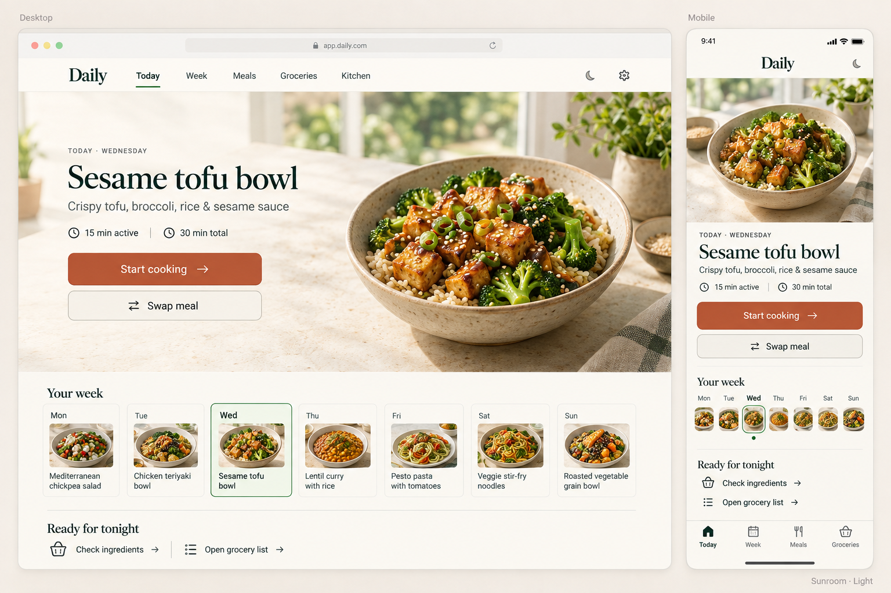
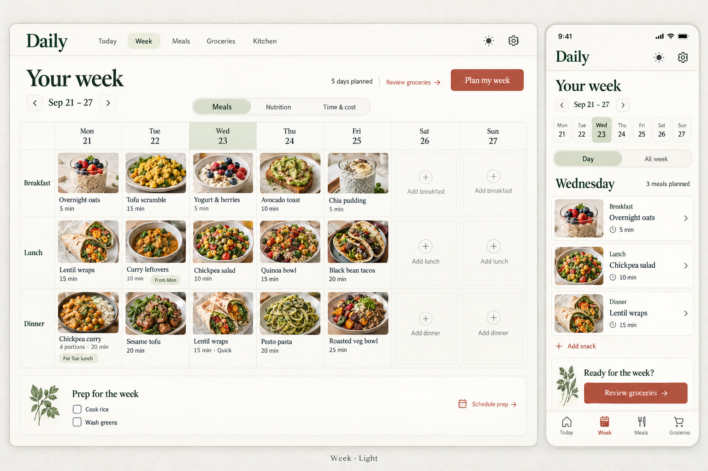
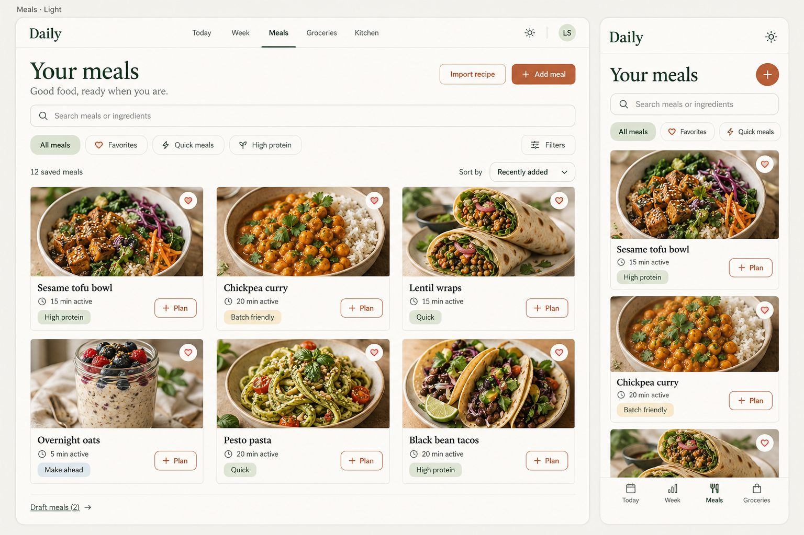
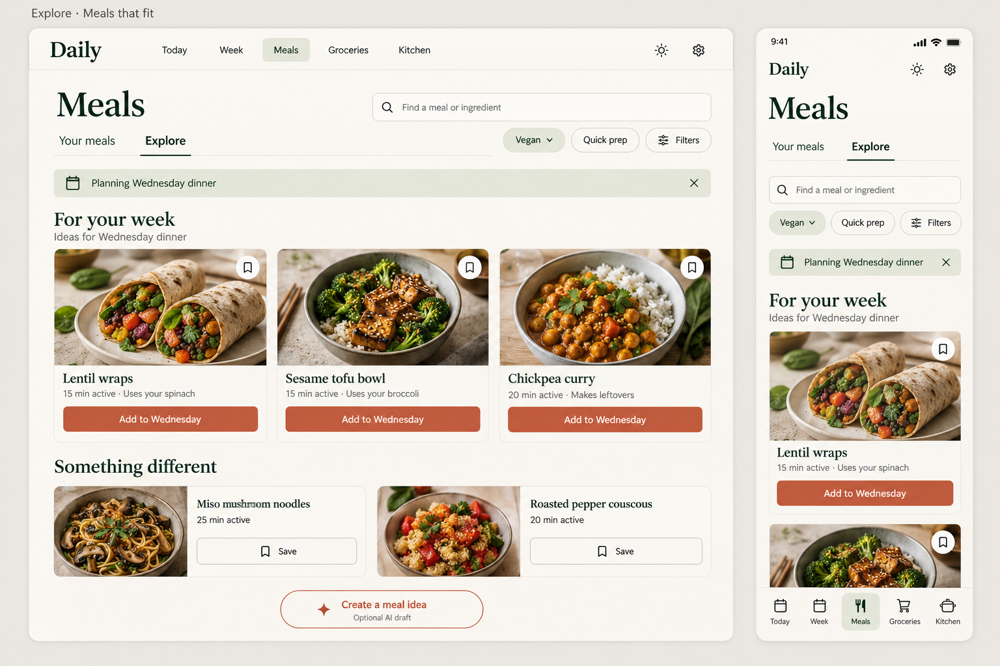
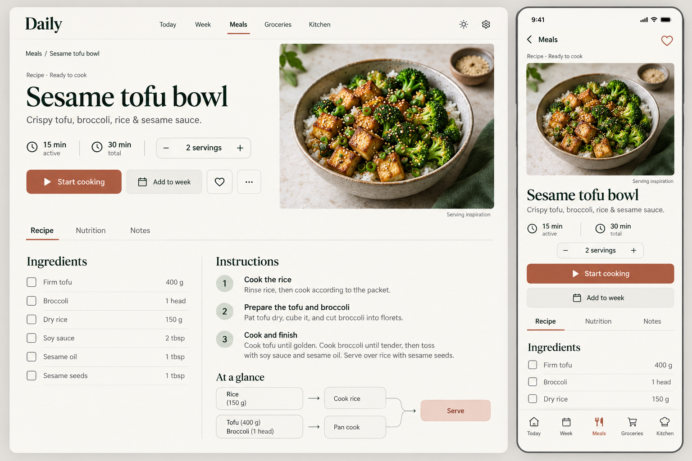
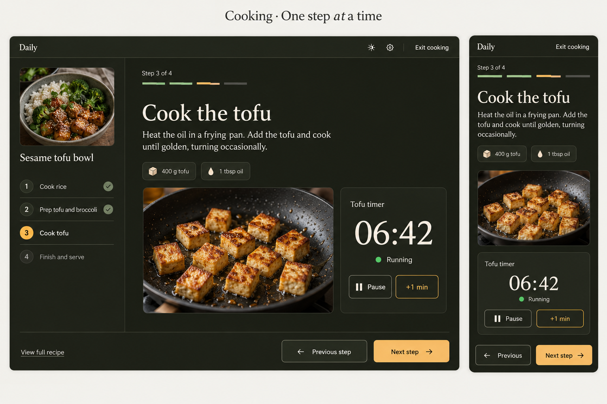
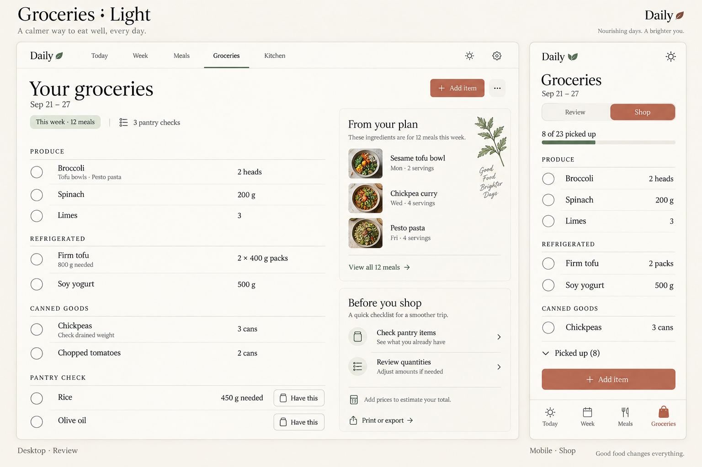
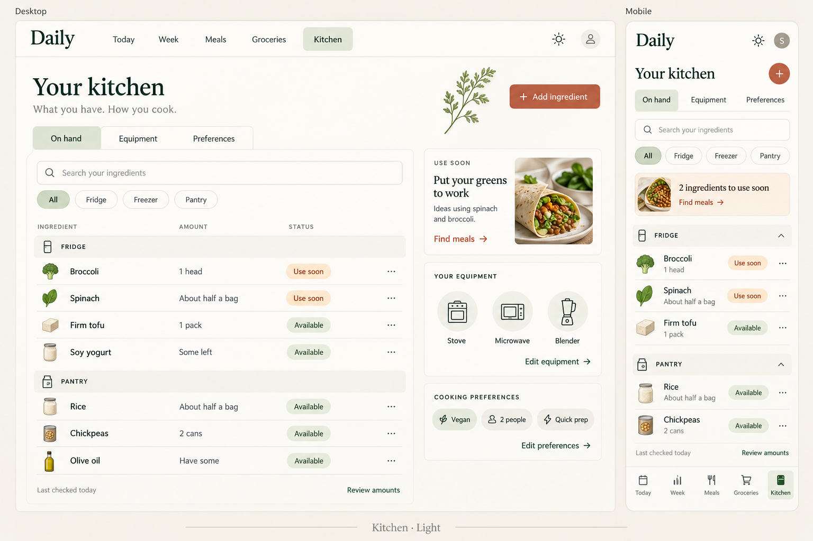
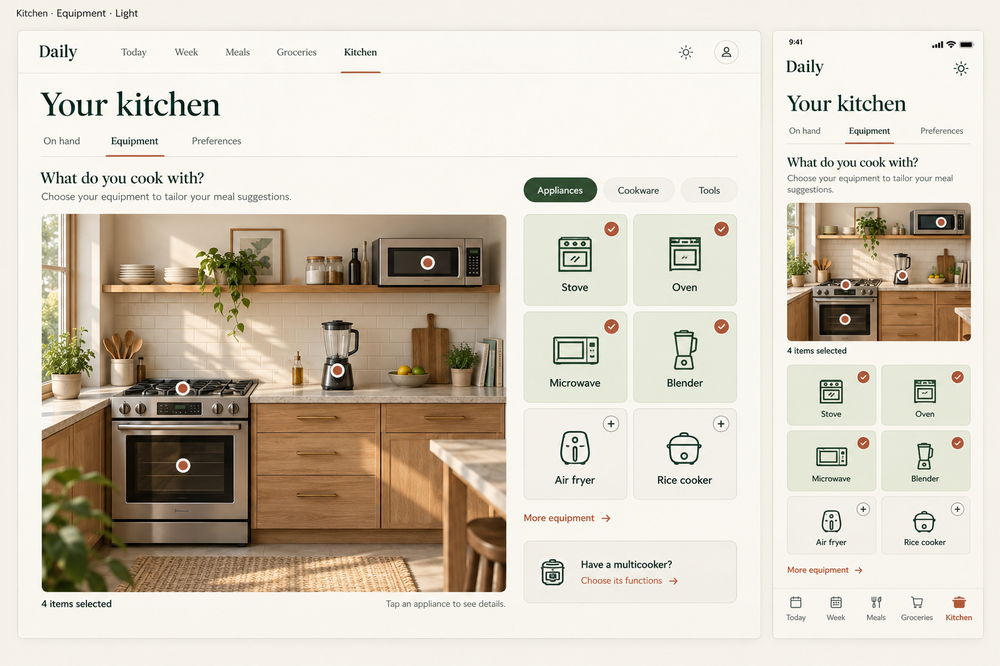

# Nooch redesign — implementation plan and goal notes

**Scenario:** `nutrition-planner` (display name **Nooch**) · **Written:** 2026-09-22 ·
**Drives:** the convergence goal in [`REDESIGN_GOAL.md`](REDESIGN_GOAL.md) ·
**Tracks progress in:** [`REDESIGN_LEDGER.md`](REDESIGN_LEDGER.md) and
[`OPERATOR_FEEDBACK.md`](OPERATOR_FEEDBACK.md)

This document turns the v2.0 specification and the fifteen approved concept
mockups into an executable build order for this repository. It is the notes file
the goal points at. It does **not** restate the specification: every behavioural
rule lives in [`../reference/product-specification.md`](../reference/product-specification.md)
(cited here as R-sections, Appendix A sections, fixtures FIX-nn, and acceptance
cases AT-nnn / ACT-nnn). This file adds what the specification could not know:
the real state of this repository, the order in which to repair and build it, the
engineering bar, the surface-by-surface composition against the mockups, the
production-artwork plan, and how "done" is proven.

> **No Plan Manager.** The operator directed on 2026-09-22 that this effort does
> not use Plan Manager: no plans, no plan executions, no plan-manager logs. The
> earlier plan `implement-daily-nutrition-planner-to-production-ready-r0-r1` is
> archived (decision D-026). Work is tracked only in the files named above.

## Contents

1. [Outcome and definition of done](#1-outcome-and-definition-of-done)
2. [Sources and authority](#2-sources-and-authority)
3. [Current state inventory](#3-current-state-inventory)
4. [Engineering bar](#4-engineering-bar)
5. [Build spine](#5-build-spine)
6. [Surface specifications](#6-surface-specifications)
7. [Production artwork](#7-production-artwork)
8. [Verification and evidence](#8-verification-and-evidence)
9. [Convergence protocol](#9-convergence-protocol)
10. [Guardrails and non-goals](#10-guardrails-and-non-goals)
11. [Defaults for open choices](#11-defaults-for-open-choices)

---

## 1. Outcome and definition of done

**The finished state.** A person opens Nooch on a phone or a desktop, in daylight
or in the evening, and it looks like the approved mockups: a calm cookbook in a
warm kitchen. Every page works end to end against real persisted data in the
local runtime: they configure their food rules and kitchen, capture meals with as
little or as much detail as they have, get a reviewable week, shop from it, cook
from a focused step-by-step mode with timers that survive reloads, and optionally
record what they ate. Nothing is faked, nothing is zero that is actually unknown,
and no required dietary rule is ever traded away.

The effort is done only when **all** of the following hold, each with evidence in
the ledger:

1. **Every surface matches its mockup.** Today (scene, editorial, and minimal
   treatments), Week, Meals, Explore, Recipe detail with Reading and Recipe map,
   Cooking, Groceries (Review and Shop), Kitchen (On hand, Equipment, Preferences),
   Onboarding, and Settings are implemented and, captured at the R27.5 viewports
   in Light and Evening, match the corresponding mockups' hierarchy, composition,
   spacing, typography, imagery, and atmosphere after the documented corrections
   in [`../reference/mockups/README.md`](../reference/mockups/README.md). Surfaces
   without a mockup (Onboarding, Settings, editors, empty and error states), and
   surface/appearance pairs the mockups do not show, are judged by the derivation
   rule in that guide's "How to compare" section; intermediate widths (768, 1024,
   320 px, 200 % zoom) are judged against the nearer composition and R06.
2. **Every visible action works end to end** through the API and SQLite in the
   running scenario, or is omitted, or shows an honest capability explanation
   (R28, R16). No dead buttons, no client-side-only saves, no hard-coded totals.
3. **The retained domain holds** (R01.2 final paragraph, R23): minimal drafts,
   immutable revisions, required-rule enforcement, unknown-is-not-zero, full-day
   targets, supplement schedules, batches and leftovers, price book, deterministic
   planning, consumption feedback, JSON/CSV/PDF transfer, workspace isolation, and
   recoverable persistence — each proven by the fixtures and acceptance cases that
   cover it.
4. **The code is mature and maintainable** (section 4): small typed components
   built on shared primitives and tokens, pure domain calculations in the API, no
   dead or test-only production code, no template remnants, migrations and
   transactions where the specification requires them, and tests that assert
   behaviour rather than restate implementation.
5. **Validation is honest** (section 8): every requirement's validations point at
   real `[REQ:ID]`-tagged tests or attested evidence, each module's auto-sync is
   re-enabled only once all of its validations carry such refs (D-037), and
   statuses are earned by that sync; every R27.4 acceptance case and every R0/R1
   row of Appendix A §21.2 passes, or is recorded as provider-blocked exactly as
   R27.4's last paragraph allows; the experience contract's pages are `active`
   with their bindings present and machine claims passing; the R27.6 integrated
   journey runs through the real UI; and a final **comprehensive** Test Genie run
   (`vrooli scenario test nutrition-planner`, no phase filter) passes every phase —
   pre-existing debt is fixed, not waived.
6. **Artwork is real** (section 7): the curated scene, editorial, equipment, and
   ingredient assets exist as optimized, manifest-tracked, reviewed files with
   provenance, and every nonideal media state (no photo, failed load, wrong
   appearance, incompatible revision) looks intentional.
7. **Convergence** (section 9): two consecutive fresh, hostile review passes find
   nothing material, and every item in
   [`OPERATOR_FEEDBACK.md`](OPERATOR_FEEDBACK.md) is resolved with a receipt.

"The suite is green" is a precondition of a review pass, never the finish line.

**Scope at done** (D-041): every P0 target; OT-P1-006 (the R1 feedback rules);
OT-P1-007 and OT-P1-008 as provider-conditional capabilities — built, with honest
capability states and fallbacks, and verified against the real service when it is
configured. OT-P1-001…005 (R2 assistance) are not required, but code that exists
for them today must be either wired behind an honest capability check or removed;
no test-only production code survives. Settings › Notifications is omitted or shown
as honestly unavailable unless a notification integration is built.

**Blocked items do not hold the loop open forever.** An item that needs a decision,
credential, or approval the agent does not have is recorded in the ledger with the
exact ask; it does not block completion of everything else. The final report lists
it. Everything that is not genuinely blocked must converge.

## 2. Sources and authority

Read in this order. When sources disagree, R01.1 decides: operator instructions →
specification R01–R30 → Appendix A → mockups → incidental generated detail.

| Source | What it owns |
| --- | --- |
| [`../reference/product-specification.md`](../reference/product-specification.md) | All intended behaviour: R01–R30 (redesign), Appendix A (domain, arithmetic, fixtures, baseline acceptance), Appendix C (where repository records live). |
| [`../reference/mockups/README.md`](../reference/mockups/README.md) and the fifteen images beside it | Visual intent per surface, cross-mockup resolutions, corrections, artwork direction. |
| [`../../DESIGN.md`](../../DESIGN.md) | Binding design language: tokens, type, spacing, radii, appearance model, component grammar. |
| [`../concepts/EXPERIENCE.md`](../concepts/EXPERIENCE.md) and [`../../experience/`](../../experience/index.json) | Information architecture, per-surface composition, states, claims, and test-id bindings. |
| [`../../PRD.md`](../../PRD.md) and [`../../requirements/`](../../requirements/README.md) | Operational targets and the requirement registry that proves them. |
| [`../concepts/ARCHITECTURE.md`](../concepts/ARCHITECTURE.md), [`DOMAINS.md`](../concepts/DOMAINS.md), [`DATA.md`](../concepts/DATA.md), [`FLOWS.md`](../concepts/FLOWS.md), [`INTEGRATIONS.md`](../concepts/INTEGRATIONS.md) | Module boundaries, entities, state machines, adapters. |
| [`DECISIONS.md`](DECISIONS.md) | Every resolved fork, including the redesign decisions D-025 onward. |
| Repository `docs/TESTING.md` | Validation scope rules for Test Genie. This plan selects scope; it does not redefine it. |
| Repository `docs/concepts/IDENTITY-AND-AUTHENTICATION.md` | How a scenario declares its authentication profile (needed for blocker B1). |

**Mapping for the `experiential-ui-design` skill.** Its ladder looks for mockups
in `docs/mockups/`, an image brief at `docs/mockups/image-generation-brief.md`,
and findings in a durable design doc. In this scenario the mockups live in
[`../reference/mockups/`](../reference/mockups/README.md) (documentation-manifest
convention), the image brief is section 7 of this plan, and findings live in
[`REDESIGN_LEDGER.md`](REDESIGN_LEDGER.md) with the design summary in
[`../concepts/EXPERIENCE.md`](../concepts/EXPERIENCE.md). Apply the ladder's gates
to these locations.

## 3. Current state inventory

Seeded 2026-09-22 from a read-only audit of the source, the live database, and
the running instance. It answers R02.3 for this repository. **Re-verify it at the
start of the work (milestone D0) and keep it current**; a row that is fixed moves
to the ledger with its evidence.

### 3.1 Headline facts

- **Nothing user-facing has ever worked in the local runtime.** Every
  workspace-scoped RPC requires an authenticated principal
  (`identity.PrincipalFromContext`), which `api/main.go` only installs when
  `VROOLI_AUTH_PROVIDERS` is set. `.vrooli/service.json` declares no
  `authentication` block, so the lifecycle never sets it. `ListWorkspaces`
  returns `401 unauthenticated` directly, through the UI proxy, and from the CLI.
  Every page's first call is `ensureWorkspace()`, so every page renders its error
  state.
- **The live database has never held a row.** `data/nutrition-planner.db` has 29
  tables with zero rows, including the template's stale `notes` and `attachments`
  tables.
- **The backend is wide and shallow.** 13 Connect services and 58 RPCs (~10.2k
  production Go lines). About 1.1k lines of domain logic are reachable only from
  tests (cost calculation, catalog→nutrient contribution, scaling, units and
  nutrient registries, USDA/URL providers, AI proposal, recurring jobs, billing,
  legacy import). The planner hard-codes `Cost: 0` and `Effort = len(methods)`;
  every shopping quantity and price is the string `"unknown"`.
- **The UI is a thin prototype.** Nine routes, ~85 KB of TSX packed into ~570
  physical lines (single JSX lines up to 8,630 characters), 261 hard-coded
  Tailwind palette classes against 7 token classes, hard-coded English, UTC dates,
  no images, no breakpoint hook. Navigation is Home/Today/Week/Groceries/
  Nutrition/Settings; there is no Meals route, Kitchen, Explore, recipe route, or
  cooking mode; onboarding (`/setup`) is unreachable.
- **Validation proves almost nothing.** At audit time 83 of 84 requirements were
  `planned` and none referenced a real test, and 0 of the then 143
  experience-contract test ids existed in the UI. (The 2026-09-22 documentation
  update grew the registry to 161 requirements, all `planned`, and the contract to
  229 bound elements; none exist in the UI yet.) BAS cases only assert that a page container is visible (they pass on the 401
  screen); Connect handlers have 0 % coverage; Go coverage is 48.8 % against a 75 %
  policy.
- **Docs overstated progress.** `PROGRESS.md` logged nine "implemented" entries on
  2026-09-18. Treat those entries and the archived plan's "done" phases as
  unverified claims.

### 3.2 Blocking defects (fix first, in D0)

| ID | Defect | Where | Fix direction |
| --- | --- | --- | --- |
| B1 | No principal in the local runtime → every RPC 401 | `api/main.go:121-128`, `.vrooli/service.json` | Declare the platform authentication profile with `personal_local` as the default mode per repository `docs/concepts/IDENTITY-AND-AUTHENTICATION.md`, using `scenarios/git-control-tower/.vrooli/service.json` as the worked example. Include only what `personal_local` needs; remote modes (Cloudflare Access, tunnels, `remote_vrooli`) are out of scope unless separately authorized (R01.3). Prove it with a real UI request and a real CLI command in the transcript. Never bypass auth in handlers. Decision D-032. |
| B2 | `profile.Get` returns raw `sql.ErrNoRows`; `ErrNotFound` is never constructed → GetProfile, GeneratePlan, PreviewSwap, ApplyPlan return Internal on a fresh workspace | `api/internal/profile/sqlite.go:29-32` | Map no-rows to the domain not-found error; fresh workspaces get an explicit unconfigured state (R16, R26 "New account"). |
| B3 | `PreviewSwap`/`RecordFeedback` unmarshal an empty `plan_json` before any plan is saved | `api/handlers/planning/connect_handler.go` | Falls away with B5's persisted occurrence model; until then return a typed empty-plan state. |
| B4 | Plans are one JSON row per workspace; Today (1 day) and Week (7 dinners) overwrite each other | `api/internal/planning/sqlite.go`, `schema.sql` | Re-model plans as dated occurrences with stable identities and revisions (D-033); ApplyPlan validates occurrences server-side instead of storing client JSON. |
| B5 | No read RPC for the saved plan; Today and Week regenerate a draft on every mount | proto `planning`, `ui/src/features/today`, `week` | Add a plan/occurrence read model; generation only on Plan my week, Swap, or explicit replan. |
| B6 | Settings data-health fetches `/diagnostics` (the SPA) instead of `/api/v1/diagnostics` | `ui/src/api/diagnostics.ts` | Use the REST base; test against the real route. |
| B7 | Planning ignores `profile.ExcludedGroups` (passes only `ActiveRules`) | `api/handlers/planning/connect_handler.go:68,219` | One eligibility input builder shared by planning, Explore, and swap (R11.2 "no separate recommendation path"). |
| B8 | UI-created recipes carry no allergen evidence or diet groups → all needs-information under any allergy, and "Steak" is eligible for a vegan | recipe editor absent | Build the editor (D2) and keep missing evidence as needs-information; never treat empty tags as evidence (ACT-004). |
| B9 | Profile `scan()` keys a map by raw JSON strings; identical lists collapse and one decodes nil | `api/internal/profile/sqlite.go:90` | Scan columns into distinct variables. |
| B10 | Dates computed with `toISOString().slice(0,10)` → UTC day shifts | 8 sites in `ui/src` | One local-date helper with the workspace IANA timezone (AT-012). |
| B11 | `ensureWorkspace()` mints a random idempotency key per call → duplicate workspaces under concurrent loads | `ui/src/api/workspace.ts` | Resolve the workspace once per session through a query cache with a stable key. |
| B12 | Recipe create/update is multi-statement without a transaction; the UPDATE ignores `RowsAffected` | `api/internal/recipe/sqlite.go:59-75,141-147` | Transactions for every multi-statement write the specification names (R22, SYS-02). |
| B13 | No migrations: every schema is `CREATE TABLE IF NOT EXISTS`; `PRAGMA user_version` never set | `api/internal/*/schema.sql` | Versioned per-domain migrations before any column is added (D-034; R25.1, SYS-05). |
| B14 | PDF export hard-fails without the host DejaVu font | `api/internal/portability/pdf.go:16,121` | Embed the licensed print fonts in the binary or scenario assets (R25.2). |

### 3.3 Capability gap map

| Capability (spec) | State | Evidence and gap |
| --- | --- | --- |
| Five-destination shell + Settings (R03, RD-002) | Partial | RCL `AppShell/2` configured with six items (Home, Today, Week, Groceries, Nutrition, Settings), sidebar density. Needs the five destinations, header nav, five-tab mobile bar, Settings entry, focused-mode shell. |
| Light / Evening / Follow device (R05.2, RD-003) | Partial | `theme/ThemeProvider.tsx` does light/dark/system with the generic vrooli-default blue/cyan tokens and Inter. Needs the Nooch tokens, editorial serif, evening palette, account persistence, no-flash first paint. |
| Meal hero media treatments (R17, RD-004) | Absent | No media fields in any proto or table; no images in the UI. |
| Today hero + full-day overview (R08, RD-005) | Partial | Four slot cards from a freshly generated draft; metrics always "Unknown"; actions only touch `occurrences[0]`. |
| Week board, agenda, views (R09, RD-006/007/008) | Partial | Seven-row dinner-only list with lock/skip/swap/PDF. No board, slots, views, leftovers linking, prep. |
| Meals collection (R10, RD-009) | Absent | A vertical list embedded in Home; no favourites, filters, sort, drafts view, or recipe editing (UpdateRecipe is never called). |
| Explore (R11, RD-009) | Absent | No route, RPC, catalog, or reasons beyond planner strings. |
| Recipe detail and map (R12, RD-011) | Partial | Inline `RecipeViewer` with Map/Read/Cook tabs and display-only decimal scaling; no route, Nutrition or Notes tab, method switching, or print from the viewer. |
| Cooking sessions and timers (R13, RD-012) | Partial (minimal) | Prev/Next plus one fixed 1-minute timer in `localStorage`. No session, completion, server timers, or finish flow. |
| Groceries Review/Shop (R14, RD-013) | Partial (weak) | Checklist with string keys in `shopping_checks`; quantities "unknown"; purchases via a free-text form; no modes, Have this, confirm, diff, or offline. |
| Kitchen On hand (R15.1, RD-014) | Absent in UI | `inventory_events` holds decimal amounts only; no storage, qualitative amounts, use-soon, or last-checked evidence. |
| Equipment (R15.2, R20, RD-015) | Absent | Eight fixed appliance strings in `profiles.appliances_json`; no devices, capabilities, tiles, or scene. |
| Preferences (R15.3, RD-016) | Partial | Profile preset → rules, allergies, appliances, weights; editable only through unreachable `/setup`. |
| Onboarding (R16) | Partial | Four-step wizard with draft/apply and eligibility counts; unreachable; old step content. |
| Settings (R16) | Partial | Theme and language only; broken data health; link to `/transfer`. |
| Media, scenes, generation jobs, budgets (R17–R18, RD-017/018) | Partial (plumbing) | Generic `jobs` state machine and `entitlement_reservations`; no worker, media type, manifest, or UI. |
| personal-planner link (R24, RD-019) | Absent | No reference anywhere. |
| Offline outbox (R22, RD-021) | Absent | `ui/public/sw.js` caches the app shell only. |
| JSON/CSV/PDF transfer (R25, RD-022) | Present, limited | Nine portability RPCs and `/transfer`; the workspace backup omits eleven record kinds; PDFs use the old cobalt direction and a host font. |
| Demo seed isolation (R27.1) | Absent | No seed or demo path; `bas/seeds/` is empty. |

### 3.4 Worth keeping

Build on these rather than replacing them; each still needs wiring, tests at the
handler boundary, or completion.

- Exact decimal, money, unit, and nutrient registries (`api/internal/decimalx`,
  `money`, `units`, `nutrients`).
- The recipe method-graph validator and FIX-05 tests (`api/internal/recipe/graph.go`).
- The stateless eligibility evaluator with unknown-evidence handling
  (`api/internal/eligibility`).
- Immutable revision tables for recipes, catalog, routines, supplements, targets.
- Idempotency tables and receipt de-duplication; the transactional restore with
  checkpoints (`api/internal/portability/restore.go`); native `daily.recipes`
  export/import with conflict policy.
- Proto-first Connect structure, the RCL `AppShell/2`, and the i18n scaffolding
  (en/ja/ar with a typed key registry).
- `lucide-react` is already a dependency and can be the single line-icon family.

### 3.5 Remove

Template and dead remnants a hostile reviewer would flag (delete explicitly named
files; never with globs): `ui/src/pages/DashboardPage.tsx` (template Home),
`ui/src/features/health/HealthCard.tsx` and its tests, the unused
`components/experience/ExperienceSurface.tsx`, `lib/errorMessage.ts`, and
`api/client.ts#uploadFile` if still unused after the redesign; the capabilities
registry entry advertising `audio-tools`; stale `notes` comments in Go; the
template proto README; `.vrooli/testing.json` "Sample" metadata; the placeholder
`logo.svg`; the stale `notes`/`attachments` tables (through a migration); the
unfinalized `.vrooli/orientation.json` once its gates pass; stale coverage files.
Run `template-manager detemplate nutrition-planner` when the first real domain is
green if the example domain still has any footprint.

## 4. Engineering bar

"Mature, maintainable code" means the following. A hostile pass treats any
violation as a finding.

**Architecture**
- **Proto first.** New capabilities (media, favourites, equipment devices,
  cooking sessions and timers, shopping lists, inventory assertions, Explore,
  calendar links, generation jobs) are authored as proto contracts under
  `packages/proto/schemas/nutrition-planner/v1/`, regenerated, and implemented in
  Go. Replace opaque `draft_json`/`plan_json`/`preview_json` strings with typed
  messages as each area is rebuilt.
- **One domain core.** Nutrition, cost, eligibility, scaling, and planning are
  pure Go packages called by handlers, jobs, and the CLI. The UI never computes a
  total, eligibility, or cost; it renders what the API returns (R23, ARCH-02).
  Wire the existing test-only libraries into production paths or delete them.
- **Persistence discipline.** Versioned per-domain migrations; transactions for
  every operation R22 and SYS-02 name; expected-revision checks and idempotency
  keys on every mutation; foreign keys to `workspaces`; read models instead of
  whole-aggregate JSON blobs.
- **Server state in the client** goes through `@tanstack/react-query` (already a
  dependency) with keys that include the relevant revisions (R22). No page-level
  `useEffect` fetch chains.

**UI**
- `ui/src/features/<surface>/` per surface; shared components in one place and
  built once (R05.3: AppShell, PrimaryNavigation, PageHeader, SegmentedControl,
  FilterChip, MealCard, MealHero, WeekSelector, MealSlotCard, ServingControl,
  EvidenceValue, IngredientRow, ShoppingRow, InventoryRow, EquipmentTile,
  EquipmentScene, RecipeMap, CookingStep, PersistentTimer, EmptyState,
  SaveStatus, ImpactPreview, EntityEditor, SourceDetails, GenerationJobStatus).
  Prefer `@vrooli/react-component-library` primitives when they fit; contribute a
  missing reusable primitive through its draft workflow
  (`react-component-library components draft-begin <asset>`), keep
  nutrition-specific components here, and record gaps in
  [`../reference/component-library-gaps.md`](../reference/component-library-gaps.md).
- **Tokens only.** Colour, type, spacing, radius, and elevation come from the
  Nooch tokens in `DESIGN.md` through `design-tokens.css` and the Tailwind theme.
  Zero raw palette classes (`bg-white`, `text-slate-900`, `bg-blue-700`) in
  feature code; the count is checked in every pass.
- **Composition by medium.** A breakpoint hook (reuse one from the component
  library if it exists; otherwise a small SSR-safe `useBreakpoint` on
  `matchMedia`) selects different component trees where the interaction model
  changes (Today hero, Week board versus agenda, Cooking, Equipment, Groceries
  sidebar versus sheets); CSS reflow is used where only arrangement changes
  (collection grids, forms). Bands follow R06.1; decisions use container width.
- **Readable code.** Components small enough to read in one screen; formatted
  source (no single-line pages); typed props; no `any`; no duplicated view logic
  between light and evening or desktop and phone beyond the composition switch.
- **Every string through i18n**, every icon action with an accessible name, every
  async region with the lifecycle states in `DESIGN.md`, every experience-contract
  element carrying its bound `data-testid`.
- **Performance budgets** per R25.4: image sizes, lazy loading below the fold,
  only the current appearance's assets, reserved image dimensions (no layout
  shift).

**Tests**
- Test behaviour at the lowest useful layer (R27.1, TEST-01): exact fixture
  arithmetic in Go; handler tests for authorization, revisions, idempotency, and
  transactions; UI tests for interaction semantics (Next never completes a step;
  checking a row never purchases); BAS journeys that assert **outcomes** (a saved
  meal reappears after reload), never merely that a container is visible.
- Tag tests with `[REQ:<ID>]` and point the requirement's validation `ref` at that test. Re-enable a module's auto-sync only when **every** validation in that module carries a `ref` (or an attested manual record) — Test Genie promotes any ref-less validation from its phase's overall pass (D-037, F-015). A validation without a `ref` must never count as evidence.
- No test that restates a CSS value or a constant. No mocked API in a test that
  claims an end-to-end journey.

## 5. Build spine

Work in complete vertical slices (R28). This is a dependency order, not a phased
plan; revisit any earlier slice when a later one exposes a defect. Each slice ends
with its proof recorded in the ledger.

### D0 — Foundation repair and inventory

Make the running scenario usable and honest before any new surface.

- Fix B1–B14 (section 3.2). B1 first: without a principal nothing else can be
  exercised.
- Introduce versioned migrations; migrate away the stale `notes`/`attachments`
  tables; add foreign keys where tables reference `workspaces`.
- Re-model plans as persisted dated occurrences with a read RPC (B4/B5). Today and
  Week read the persisted plan.
- An explicit **demo seed path** (R27.1): a repeat-safe command that loads the
  vegan fixture catalog into a separate demo workspace. A real workspace never
  sees demo data; the regular app never loads it implicitly.
- Remove the section 3.5 remnants. Re-verify section 3 and update it.

**Exit proof:** in the running scenario, a fresh local workspace can be created,
onboarding applied, a name-only meal saved and reopened after reload (FIX-01), a
plan generated, applied, and read back — through the CLI and the UI, with zero
401 or Internal errors. Show the commands and responses.

### D1 — Visual foundation

- Nooch tokens for Light and Evening (DESIGN.md) wired through
  `design-tokens.css` and the Tailwind theme; self-hosted editorial serif and the
  UI sans with a documented licence and subsets; no-flash appearance boot script;
  appearance persisted locally and in the account (AT-002).
- The shell: header with serif wordmark, five text destinations, appearance
  control, Settings; five-tab bottom bar with safe-area padding; focused-mode
  shell for Cooking; routes per R03.1 with Back/restore semantics.
- The breakpoint hook and the R05.3 shared components, each with a preview state
  for long names, missing photos, partial numbers, blocked actions, and both
  appearances.

**Exit proof:** captures of the shell at every R27.5 viewport in both appearances;
keyboard traversal; zero raw palette classes in `ui/src`.

**First fidelity proof (R28).** Immediately after D1, build **Today** with one
approved scene meal, one editorial-photo meal, and one no-photo meal, verified
light/evening × phone/desktop against the three Today mockups. Only then roll the
validated components to the other surfaces.

### D2 — Collection and recipe

Meals (Your meals) grid and feed with search, chips, Filters, sort, favourites,
drafts, archived; Add meal (name-only draft) and the full editor (R10.2, UX-MEA-03)
including ingredients, method graph, evidence, source; paste/file import with
review (R10.3); recipe detail route with Recipe/Nutrition/Notes tabs, Reading and
Recipe map, serving scaling, method switching, print; editorial and minimal media.

**Exit proof:** FIX-01, FIX-05, AT-016, AT-017, AT-023, AT-024, AT-025, ACT-008–
ACT-017, ACT-044 pass; captures match `meals-*.png` and `recipe-detail-light.png`.

### D3 — Today and Week

Today hero with all three media treatments, week strip, Ready for tonight, Today
overview with Planned/Recorded/Expected scope, swap with reasons and impact
preview, occurrence menu. Week board and phone agenda, Meals/Nutrition/Time & cost
views, occurrence panel, move/copy/lock, leftovers For/From links, Prep for the
week, Plan my week preview and apply.

**Exit proof:** AT-004–AT-015, ACT-018–ACT-022, ACT-039–ACT-041, ACT-045–ACT-047,
ACT-055; FIX-02, FIX-04, FIX-06, FIX-10 in the UI and API; captures match the three
Today mockups and both Week mockups.

### D4 — Groceries, Kitchen, onboarding

Groceries Review/Shop with stable derived rows, Picked up with Undo, Have this,
confirm purchases, plan-change diff, manual items, price coverage, offline outbox
for shopping; Kitchen On hand with qualitative amounts, storage groups, use soon,
last-checked evidence; Equipment devices and capabilities with tiles and the
scene; Preferences groups; onboarding reusing the same components.

**Exit proof:** AT-031–AT-039, AT-050, ACT-001–ACT-007, ACT-023–ACT-025,
ACT-048–ACT-052; captures match both Groceries mockups and all three Kitchen
mockups.

### D5 — Explore and cooking depth

Curated catalog and user-approved recipes through the planner's eligibility and
ranking with structured reasons; context banner; Save/Add/Replace semantics;
cooking sessions with explicit completion, timers (server-reconciled, multi-tab),
batch confirmation versus intake, leftovers consumption.

**Exit proof:** AT-018–AT-030, ACT-053, FIX-03, FIX-07; captures match
`explore-light.png` and `cooking-evening.png`.

### D6 — Production artwork

The asset kit in section 7: scene templates, composed Today scenes, editorial
photos for the curated catalog, the equipment layer kit, ingredient icons,
manifests, optimization, and review.

**Exit proof:** manifest validation, measured transfer sizes, captures of every
media state (AT-003–AT-005, R27.3 artwork fixtures), and AT-044 (private media is
denied across workspaces).

### D7 — Adapters

In-app bounded generation (R18) integrated through image-tools; the personal-planner
calendar adapter after discovering its real API (R24); optional assisted import
through the platform's AI routing. Each unconfigured adapter degrades to a working
fallback with an honest capability state.

**Exit proof:** AT-040–AT-043 and AT-045–AT-046 with real configured services, or
labelled deterministic adapter tests plus a recorded blocked state (R27.4 final
paragraph).

### D8 — Migration, portability, release review

Workspace export covering every record kind with explicit omissions; import and
restore; recipe, week, and grocery PDFs in the light print theme with embedded
fonts on A4 and Letter; CSV with formula-injection handling; legacy importer;
populated-database migration test; accessibility; performance; the full visual
review; the R30 report in the ledger.

**Exit proof:** AT-047–AT-052, ACT-026–ACT-038, ACT-054, the R27.6 journey, the
R27.5 capture matrix reviewed against every mockup, and the final comprehensive
Test Genie run with every phase passing.

## 6. Surface specifications

Each surface lists its mockups, archetype (from the `experiential-ui-design`
archetype table), the device-independent content model, the composition per
medium, the rules that matter most, and the acceptance that proves it. Visual
detail is in [`../reference/mockups/README.md`](../reference/mockups/README.md);
behaviour is in the cited R-sections. Experience-contract page ids are in
brackets.

### 6.1 Shell, appearance, and navigation [all pages]

- **Archetype:** chrome.
- **Content model:** wordmark; five destinations (Today, Week, Meals, Groceries,
  Kitchen) in that order everywhere; appearance (Light, Evening, Follow device);
  Settings; toasts; save/offline status.
- **Desktop:** single header row, hairline below, content max width ~1440 px
  (Week up to ~1600 px), 24–40 px side padding.
- **Phone:** compact header (wordmark, appearance, Settings), five labelled bottom
  tabs whose height is reserved in document flow; toasts above the tab bar and
  safe area.
- **Focused mode:** Cooking hides the destinations and shows Exit cooking.
- **Rules:** R03, R05.2, R06.1, R07; cross-mockup decisions (D-027).
- **Proof:** AT-001, AT-002, AT-011, AT-052; no bright flash on evening reload.

### 6.2 Today [today]

- **Mockups:** `today-sunroom-light.png`, `today-evening-kitchen-dark.png`,
  `today-editorial-light.png`.
- **Archetype:** dashboard → bespoke phone tree.
- **Content model:** selected occurrence (date, slot, recipe revision, servings,
  status), media descriptor, active and total time, primary action (Start cooking,
  or View/Log for ready-to-eat, or Edit for incomplete drafts), Swap, occurrence
  menu, seven-day strip, Ready for tonight links, Today overview (all slots,
  recurring items, supplements) with Planned/Recorded/Expected scope.
- **Desktop:** `MealHero` with the scene, editorial, or minimal treatment chosen by
  the deterministic chooser (R17.1); text in the safe region; **Start cooking** and
  **Swap meal** side by side (D-040); week strip and Ready for tonight below;
  overview collapsible beneath.
- **Phone:** scene or photo at 22–30 % of the viewport (160–260 px clamp), then
  title, meta, stacked full-width actions within the first screen on
  representative phones; compact week strip; overview below.
- **Rules:** R08, R17, R06.3; an empty account shows Choose a meal / Plan my week,
  never the demo bowl; other dates say "Tuesday's dinner", not "Tonight".
- **Proof:** AT-003–AT-008; FIX-04 scope; captures versus all three Today mockups
  including the editorial and minimal states.

### 6.3 Week [week]

- **Mockups:** `week-light.png`, `week-evening.png`.
- **Archetype:** data table → agenda on phone (never a shrunken seven-column grid).
- **Content model:** local date range and week start, configured slots (not a
  fixed three), occurrences with thumbnails, time, status and badges (Leftovers,
  Prep ahead, Eating out, Locked), empty/open/social states, leftover links, prep
  tasks, summary values with scope, view (Meals, Nutrition, Time & cost).
- **Desktop:** header with the title and week navigation on one line (D-040), the
  summary and Review groceries link below, Meals / Nutrition / Time & cost and
  **Plan my week** at right; the board when each day column gets at least ~136 px
  plus the label column; otherwise the agenda (R06.1). Selecting a card opens the
  occurrence panel.
- **Phone:** day selector, Day/All week, selected day's slot cards, Add snack,
  Ready for the week? card; actions in sheets; Plan my week and Review groceries
  never both as persistent bottom bars.
- **Rules:** R09; a day is fully planned only when its required slots are
  assigned or intentionally open; unknown times read `Time not set`.
- **Proof:** AT-006–AT-013; ACT-019, ACT-041; captures versus both Week mockups.

### 6.4 Meals — Your meals [meals]

- **Mockups:** `meals-light.png`, `meals-evening.png`.
- **Archetype:** list/feed → CSS reflow (3 / 2 / 1 columns); do not over-build.
- **Content model:** saved meals with image, title, active time, one or two
  evidence-backed tags, favourite, + Plan; search over titles, aliases, tags;
  chips and Filters (Fits my setup, Needs review, Drafts, Archived, equipment,
  slot, source, preparation range); sort with an explicit unknown group; counts;
  Import recipe; Add meal.
- **Rules:** R10; valid markup for whole-card links with nested buttons; Quick and
  High protein come from versioned, testable policies (R23).
- **Proof:** AT-016, AT-017, ACT-008–ACT-012; captures versus both Meals mockups.

### 6.5 Explore [explore]

- **Mockup:** `explore-light.png`.
- **Archetype:** list/feed with editorial sections.
- **Content model:** query context (target slot, servings, return route, base plan
  revision), filters, sections from R11.2 with structured reasons, Save, Add to
  <day>, Replace <slot> with preview, Adapt, Create a meal idea (optional AI draft,
  capability-gated).
- **Rules:** R11; hard constraints filter before ranking through the same
  eligibility path as planning (B7); empty sections collapse into guidance.
- **Proof:** AT-019–AT-023; captures versus the Explore mockup.

### 6.6 Recipe detail and map [recipe]

- **Mockup:** `recipe-detail-light.png`.
- **Archetype:** reading surface; the map is a data table with its own scroll
  region.
- **Content model:** pinned or current revision; header actions (Start cooking,
  Add to week, favourite, overflow Edit/Duplicate/Archive/Print/Source); serving
  scale (view-only until Apply to planned meal); tabs Recipe (Reading | Recipe
  map, At a glance), Nutrition (per serving/yield, provenance, unknowns,
  contributors), Notes (personal notes, source, revisions, feedback).
- **Rules:** R12; one graph drives reading, map, print, and cooking; the map is
  real HTML/SVG with semantic relationships and a readable alternative.
- **Proof:** AT-024, AT-025, ACT-013–ACT-017, ACT-031; captures versus the Recipe
  mockup at 1 and 2 servings.

### 6.7 Cooking [cooking]

- **Mockup:** `cooking-evening.png`.
- **Archetype:** immersive single task — phone may exceed desktop.
- **Content model:** session (revision, method, scale, occurrence, state), steps
  with completion events, current step view, ingredient allocations, equipment and
  settings, dependency hints, timers (label, duration, state, timestamps,
  revision), finish flow (batch confirmation, I ate a serving, Finish without
  inventory update).
- **Desktop:** step rail, active step, timer card, footer actions.
- **Phone:** single step, step-list sheet, timer card or tray, footer actions in
  the thumb zone; Exit cooking always visible.
- **Rules:** R13; Mark step done is explicit; Next navigates only; timers use
  absolute timestamps; expiry never completes a step; announcements on state change
  only.
- **Proof:** AT-018, AT-026–AT-030; reload, pause, +1 min, and two-tab expiry
  shown in the transcript; captures versus the Cooking mockup.

### 6.8 Groceries [groceries]

- **Mockups:** `groceries-light.png`, `groceries-evening.png`.
- **Archetype:** list with a planning sidebar on desktop; sheets on phone.
- **Content model:** list identity and scope (plan, date range, meals), mode
  (Review | Shop, remembered), aisle groups, rows (need, stock considered, missing,
  package plan, price coverage, contributing meals, checked/picked-up state,
  overrides), pantry checks with Have this, manual items, Picked up group with
  Undo, plan-change diff (Added, Changed, No longer needed), Confirm purchases,
  export/print.
- **Rules:** R14, R22 offline minimum; checking never purchases; Have this never
  checks; no invented totals.
- **Proof:** AT-031–AT-036, ACT-023–ACT-025; offline check → reconnect replay shown;
  captures versus both Groceries mockups in both modes.

### 6.9 Kitchen — On hand [kitchen]

- **Mockups:** `kitchen-on-hand-light.png`, `kitchen-on-hand-evening.png`.
- **Archetype:** data table → card rows on phone.
- **Content model:** inventory items and lots with amount mode (exact, estimated,
  qualitative, out, unknown), original expression, storage (Fridge, Freezer,
  Pantry), use-soon flag with source, last-checked evidence; Add ingredient;
  search; storage filters; Use soon panel (Find meals → Explore with context);
  equipment and preferences summaries; Skip inventory / Track only staples.
- **Rules:** R15.1, R15.4; Available never implies a measured quantity; no numeric
  confidence percentages.
- **Proof:** AT-036, ACT-051; captures versus both On hand mockups.

### 6.10 Kitchen — Equipment [kitchen]

- **Mockup:** `kitchen-equipment-light.png` (derive evening).
- **Archetype:** immersive picker with a complete tile fallback.
- **Content model:** equipment catalog (R15.2 initial list) with stable ids and
  categories; physical devices exposing capabilities (a range provides cooktop and
  oven; a multicooker provides selected functions); selection state; details
  (count, functions, capacity, notes); scene manifest (slots, layers, markers).
- **Desktop:** scene left, tiles right; **phone:** short scene vignette above
  category selector and two-column tiles.
- **Rules:** R15.2, R20; tiles are the authoritative interface; markers open
  details; removing an appliance previews affected future methods.
- **Proof:** AT-037–AT-039; R27.3 equipment fixtures (zero, stove only, oven only,
  combined range, microwave+blender, four, all, custom, multicooker pressure only,
  missing layer) captured in both appearances.

### 6.11 Kitchen — Preferences [kitchen]

- **No mockup.** Build from the same components (section headers, rows,
  SegmentedControl, FilterChip, EntityEditor).
- **Archetype:** form/settings → summary rows that drill into sub-screens on phone.
- **Content model:** Food rules; Household & servings; Time & effort; Variety &
  favourites; Planning routine; Nutrition targets & supplements; Shopping
  preferences (R15.3). Required-rule changes preview conflicts (UX-ONB-05).
- **Proof:** ACT-003, ACT-006, ACT-007, ACT-042, ACT-043.

### 6.12 Onboarding [onboarding]

- **No mockup.** Four steps Your food, Your kitchen, Your rhythm, Ready (R16),
  reusing EquipmentScene/EquipmentTile and the Preferences components; Explore
  first is allowed with an explicit unconfigured state; the setup draft is
  separate from active settings until applied.
- **Proof:** ACT-001–ACT-007; AT-001 on a fresh account.

### 6.13 Settings [settings]

- **No mockup.** Appearance; Meal artwork (presentation: Immersive, Editorial,
  Minimal); Generation & usage (Off / Ask each time / Automatic within budget, with
  usage, reservations, queued jobs); Integrations (personal-planner); Notifications;
  Units, currency, timezone, week start; Data & exports (the former `/transfer`);
  Account. Unsupported features are omitted or explained (R16).
- **Archetype:** form/settings → drill-in rows on phone.
- **Proof:** AT-002, AT-003, AT-043; data health reads the real diagnostics route.

### 6.14 Editors and import

Full-page editor on phone, roomy sheet or page on desktop, groups per R10.2 and
UX-MEA-03, durable drafts, conflict recovery, single scroll region, sticky actions
above the keyboard (R06.4). Import stages, shows review, and applies in one
transaction (R10.3, UX-DAT-02).

### 6.15 Curated catalog and demo content

Two distinct content sets (D-039):

- **Curated catalog** — app-provided recipes every account can see in Explore and
  save (R11.1): the vegan meals the mockups name plus the Appendix A FIX-11 starter
  examples (including the non-vegan ones, which exist to prove diet filtering and
  must be excluded under vegan rules). The agent authors these recipes as
  original content (ingredients, quantities, four-step-style methods, equipment,
  yield, times) with provenance `curated`, reviewed against R11.1. Nutrient values
  come only from a cited source record (for example USDA FoodData Central entries
  captured with provenance and a fixture copy for tests) or stay unknown; allergen
  and diet evidence derives from the ingredient identities with an explicit review
  state; nothing is invented. The Sesame tofu bowl follows R27.2 exactly.
- **Demo workspace** — the explicit, repeat-safe demo seed (R27.1): a vegan
  profile, equipment, a planned week, stock, a shopping list, and history built
  from the curated catalog, loaded only into a separate demo workspace by an
  explicit command. A real workspace never sees it.

### 6.16 Printouts and exports

Recipe, week, and grocery PDFs are real documents in the light print theme with
embedded fonts on A4 and Letter (R25.2, UX-REC-07, UX-DAT-04); CSV neutralizes
formulas; JSON preserves original text; the workspace backup covers every record
kind or declares omissions.

## 7. Production artwork

The operator authorized generating the production artwork with the project's
image capability and integrating generation properly into the app (decision
D-029). **image-tools** is the owner: `image-tools ai generate` (text to image),
`ai edit` (identity-preserving edit — use it to place a recipe's photo into a
scene template and to relight day → evening), `ai inpaint` / `ai object-removal`
(empty counters, cabinet infill), `ai bg-removal` (cutouts, ingredient icons),
`ai upscale`, and `ops resize|crop|convert|compress` (renditions, WebP/AVIF). It
routes model execution through **ai-gateway** roles; never call a provider
directly and never embed provider credentials. Discover the exact flags with
`image-tools ai <op> --help` and the durable job commands with `image-tools jobs
help`.

### 7.1 Inventory

| Group | Set | Notes |
| --- | --- | --- |
| Scene templates | Kitchen table and Overhead tabletop × Light and Evening × wide and compact = **8** empty references (R17.2) | No food, no text; define food region and safe-text rectangles in each manifest entry. |
| Composed Today scenes | Sesame tofu bowl in Kitchen table (4 variants) and one plate/wrap recipe in Overhead tabletop (4 variants) | Same recipe revision across appearances; compact variants are separate compositions, not crops. |
| Editorial recipe photos | Every curated catalog recipe (at least the ~16 vegan meals the mockups name: sesame tofu bowl, chickpea curry, lentil wraps, overnight oats, pesto pasta, black bean tacos, tofu scramble, yogurt and berries, avocado toast, chickpea salad, quinoa bowl, roasted vegetables, chia pudding, miso mushroom noodles, roasted pepper couscous, curry leftovers) | Consistent light, angle, and crop; focal point metadata. |
| Equipment scene kit | Base kitchen Light and Evening, wide and compact; layers for range, cooktop-only, oven-only, cabinet infill, microwave, blender, air fryer, rice cooker, kettle, multicooker, slow cooker, food processor | One fixed camera; see 7.3. |
| Equipment icons | Complete initial catalog (R15.2) | Code-native SVG in the lucide stroke style; distinct cooktop and oven. |
| Ingredient icons | The small realistic set the Kitchen and Groceries mockups show (broccoli, spinach, tofu, soy yogurt, rice, chickpeas, olive oil, …) plus a generic category fallback | Transparent WebP via bg-removal; decorative, text carries meaning. |
| Cooking step images | One or two optional examples (the tofu-in-pan step) | Never required per step. |
| Decorative sprig | One botanical line illustration | Code-native SVG, `aria-hidden`. |

Rows marked code-native SVG are drawn in code; every raster row is produced
through image-tools (OF-003).

### 7.2 Workflow

1. **Style reference.** Crop only the photograph regions of the relevant mockups
   into scratch references (never the full board — a model given a board paints
   the UI). References guide look and light; they are not shipped.
2. **Generate** with the R18.4 prompt contract (versioned in code or config):
   explicit subject, vessel, camera, appearance, composition, food region,
   text-safe region, and "no writing, UI, logos, watermarks, or extra dishes".
   State unwanted subjects negatively.
3. **Compose** meal-in-scene with `ai edit` using the empty template plus the
   recipe photo; relight evening from the approved day image of the same scene so
   geometry and dish stay identical.
4. **Review** each candidate at actual UI sizes against R19.3 (food identity,
   stray text, malformed bowls, impossible shadows, unwanted ingredients, alpha
   edges on light and dark, crop usability with a long title). Reject and
   regenerate; record the attempt.
5. **Process** into renditions (wide and compact sizes, WebP or AVIF plus a
   compatible fallback), hero ~250–600 KB, thumbnails ~30–100 KB (R25.4).
6. **Register** each asset in a versioned manifest (R17.4, R19.2): stable id, type,
   content hash, dimensions, format, source and rights, generation provenance
   (prompt version, reference ids and hashes, model role, cost where reported),
   approval state, recipe revision compatibility, scene version, appearance,
   composition, focal point, safe-text rectangles, crop bounds, reviewer.
   Filenames follow `assets/scenes/<family>/v1/<appearance>-<composition>.webp`
   under the UI's public assets root; manifest ids are independent of filenames.
7. **Bound the spend.** Generation inside this inventory is approved (D-029) up
   to a **hard cap of US$15 in total**, including real in-app generation tests
   (D-043). Do not stop to ask below the cap; stop generating and ask the
   operator before any call that would cross it. Record every attempt's reported
   cost (or the model-policy price when none is reported) in the manifest and the
   running total in the ledger. At most four attempts per delivered asset without
   a recorded reason; never generate on page view, theme toggle, search, hover, or
   resize. Generation beyond this inventory needs a recorded operator decision.
8. **Spend economically.** At policy prices, Seedream 4.5 (`image.generate.default`
   and `image.edit.default`) costs about $0.04 per image, while identity-preserving
   edits on Gemini 3 Pro (`image.edit.identity`, `image.generate.quality`) cost
   roughly $0.13–0.25. Prefer Seedream for generation; reserve identity edits for
   meal-in-scene composition and day-to-evening relights, and try a Seedream edit
   first; use the free local image-tools models for object removal and inpainting
   (Big-LaMa, MI-GAN), matting (BiRefNet), upscaling (Real-ESRGAN), and every
   resize, crop, convert, and compress step. Finalize prompts on cheap drafts
   before running an expensive call.

### 7.3 Equipment scene technique

Generating each appliance separately produces mismatched perspective (R20.2).
Instead: generate **one** full kitchen scene per appearance with every catalog
appliance in its slot; derive the empty base by inpainting/object-removal on that
same image (cabinet infill where integrated appliances were); derive each
appliance layer as the masked region of the full scene over the empty base, so all
layers share one coordinate system and perspective exactly. Relight the evening
base and full scene from the day images with identity-preserving edit, then apply
the same masks. Store slot anchors, boxes, z-order, masks, and marker positions
in normalized coordinates in the scene manifest (R20.1). If quality gates fail,
the tiles with a static overview and a "pending" label are an acceptable
**interim** state (R20.2) — never a combinatorial image per selection set — but
not a finished one: the definition of done requires the layered scene to pass the
R19.3 gates, or an operator-recorded decision to accept the fallback.

### 7.4 In-app generation (R18)

The app's own generation feature (Create scene image, Create a meal idea imagery)
calls image-tools' API through a nutrition-planner adapter with quote, atomic
budget reservation, dedup key, job states, review, and activation exactly as
R18.1–R18.3 specify. Default policy is **Off**. Capability endpoints report what is
configured so unconfigured generation shows an honest disabled state, not a dead
button.

## 8. Verification and evidence

Choose scope with repository `docs/TESTING.md`; targeted checks by default, heavy
runs when a milestone or certification needs them.

| Check | Command | Passes when |
| --- | --- | --- |
| Go domain and handler tests | `cd scenarios/nutrition-planner/api && go test ./...` | All pass; fixture arithmetic exact; handler tests cover auth, revisions, idempotency, transactions. |
| UI types and tests | `pnpm -C scenarios/nutrition-planner/ui type-check` and `pnpm -C scenarios/nutrition-planner/ui test` | Zero type errors; interaction semantics tested. |
| Scoped Test Genie phases | `vrooli scenario test nutrition-planner --phases <phases>` then block once on `test-genie runs wait --json nutrition-planner <run-id>` | Named phases pass for the right reasons (structure, unit, lint, business, experience, ui-health, performance, docs, storage, contracts, security as relevant). |
| Requirements | `vrooli scenario requirements validate nutrition-planner --json` (structure only; it also stamps `last_validated_at`) and the requirements sync that follows a Test Genie run | Statuses earned by `[REQ:ID]` sync; no hand-set status. Auto-sync is off; set a module's `auto_sync_enabled` back to `true` only when every validation in it carries a `ref` or attestation (D-037), and show the resulting status changes. |
| Contract | `business-health validate scenario nutrition-planner` | Clean. |
| Experience contract | `experience-manager spec validate nutrition-planner --json` | Clean; bound test ids exist; machine claims pass in the experience phase. |
| Documentation | `knowledge-observatory docs audit nutrition-planner --json` | No new findings in authored docs. |
| Runtime | `vrooli scenario status nutrition-planner` and real CLI/API calls | Healthy, and a real workspace flow succeeds. |
| Visual | R27.5 captures per surface, both appearances, compared side by side with the mockups | Verdict and residual gaps recorded in the ledger per surface. |
| Integrated journey | R27.6 as a BAS flow asserting outcomes | Every step's persisted effect is verified, not just rendering. |
| Certification | `vrooli scenario test nutrition-planner` (comprehensive), then one blocking `test-genie runs wait --json` | Every phase passes. Required before done and after the last change. |

**Captures.** Produce the R27.5 captures with the repository's browser tooling —
Test Genie's experience/ui-health capture matrix and BAS flows, or headless Chrome
driven through the repository's Playwright when a measurement needs script access.
Store each pass's reviewed comparison set as small WebP files under
`docs/internal/evidence/captures/<pass-id>/` (one per surface × appearance ×
composition, named after the mockup it is compared with) and cite them from the
ledger. Keep the set curated; do not commit raw capture dumps.

**Experience states** (D-038). A state's `fixture=<state>` setup in `experience/`
is a contract with the capture harness, not a production code path: data conditions
are produced by seeding the routed Test Genie test database (the test-pool routing
the API already registers), and client conditions (loading, offline, saving) by
network control in the harness. Ordinary application code never branches on a
`fixture` query parameter.

Never poll a run; never rerun unchanged validation to get a greener result; never
edit a band, baseline, test, or claim to make a check pass.

## 9. Convergence protocol

This is the loop the goal runs. It follows `harness-goal-authoring` §6.

1. At the start of every pass, re-read
   [`OPERATOR_FEEDBACK.md`](OPERATOR_FEEDBACK.md), the open findings in
   [`REDESIGN_LEDGER.md`](REDESIGN_LEDGER.md), and this plan's section 1.
2. Build or repair the highest-priority open item along the section 5 spine.
3. When everything looks finished, run a **fresh hostile review pass** as a
   skeptic who wants to reject the work. Judge:
   - **Fidelity:** each surface's captures against its mockups, desktop and phone,
     Light and Evening, plus the nonideal media states.
   - **Behaviour:** every visible action end to end on real persisted data;
     fixtures and acceptance cases; edge cases in R26.
   - **Honesty:** unknown versus zero, scope labels, no fake success, no demo
     leakage.
   - **Code maturity:** section 4 — duplication, dead code, shims, raw palette
     classes, oversized components, test-only production code, missing
     transactions or migrations, tests that assert nothing.
   - **Accessibility and performance:** keyboard, focus, names, contrast, reduced
     motion, 200 % zoom, touch targets, image budgets, layout shift.
   - **Docs:** code and docs agree; this plan's section 3 reflects reality.
4. Record every finding in the ledger with an id, fix it, and record the
   resolution with evidence. Over-engineering, ornament the design did not ask
   for, and new technical debt are findings too.
5. Done = **two consecutive fresh passes with zero material findings** and zero
   open operator-feedback items.

- **Fresh** means the pass re-captures every surface in the R27.5 matrix and
  re-runs the targeted phases and journeys against the current code after the last
  change; reading earlier evidence is not a pass. A second pass run immediately
  after an empty one must still be fresh.
- **Material** means anything a demanding reviewer would reject: incorrect or
  unproven behaviour, a specification or decision violation, a mockup mismatch
  visible at normal viewing size, an accessibility failure, a section 4 maturity
  violation, a failing or wrongly-green check, or docs that disagree with the code.
  Minor nits outside what the design specifies are still logged and fixed, but do
  not reset the count.

## 10. Guardrails and non-goals

- No Plan Manager (D-026). No `git` in this repository (operator rule). No bulk
  formatters across modules. No raw package managers — dependencies go through
  `scenario-dependency-analyzer deps install …`.
- Scenario lifecycle through `make start|test|logs|stop` or `vrooli scenario …`;
  never run binaries directly.
- Deletions name explicit paths; never globbed or recursive bundles.
- No fabricated data, prices, targets, allergies, supplement doses, integrations,
  or evidence. Demo content lives only behind the explicit demo path.
- No automatic purchases, outside messages, public publication, billing, or paid
  spend beyond the artwork authorization in D-029 and its US$15 cap (D-043, R01.3).
- Defects in other scenarios (image-tools, ai-gateway, personal-planner, the
  component library): repair at the owner when the fix is understood and blocks
  this work; otherwise file with the `report-bug` skill and continue.
- P1 scope at done is stated in section 1 (D-041).
- Non-goals for this effort: user scene studio, retailer or receipt integrations,
  learned adherence, community publishing, household optimization, autonomous
  ordering, room decoration, 3D kitchens, billing activation (R02.2 "Later
  extensions").

## 11. Defaults for open choices

Use these without asking; record a deviation in `DECISIONS.md`.

| Choice | Default |
| --- | --- |
| Display name, slug | Nooch (configurable, D-042); `nutrition-planner` (R29.1). |
| Appearance at first run | Follow device unless a preference exists. |
| Presentation | Immersive when an approved matching asset exists; else editorial; else minimal. |
| Generation policy | Off for new accounts; opt in to Ask each time. |
| Scene families | Kitchen table and Overhead tabletop. |
| Fonts | An OFL-licensed editorial serif chosen by side-by-side comparison with the mockup wordmark and titles (candidates: Newsreader, Source Serif 4, Fraunces); Inter for UI. Self-hosted subsets; licence recorded. |
| Icons | `lucide-react` for UI; custom SVG equipment icons in the same stroke style. |
| Week start, units, currency | Locale-based and editable; demo uses Monday, metric, USD. |
| Nutrition and Data routes | Retired as primary destinations: nutrition analysis lives in Week › Nutrition, the Today overview, and the Recipe Nutrition tab; transfer lives in Settings › Data & exports (D-031). |
| Server state | `@tanstack/react-query` with revision-aware keys. |
| Calendar integration | Discover the personal-planner API; untimed internal prep tasks when unconfigured. |
