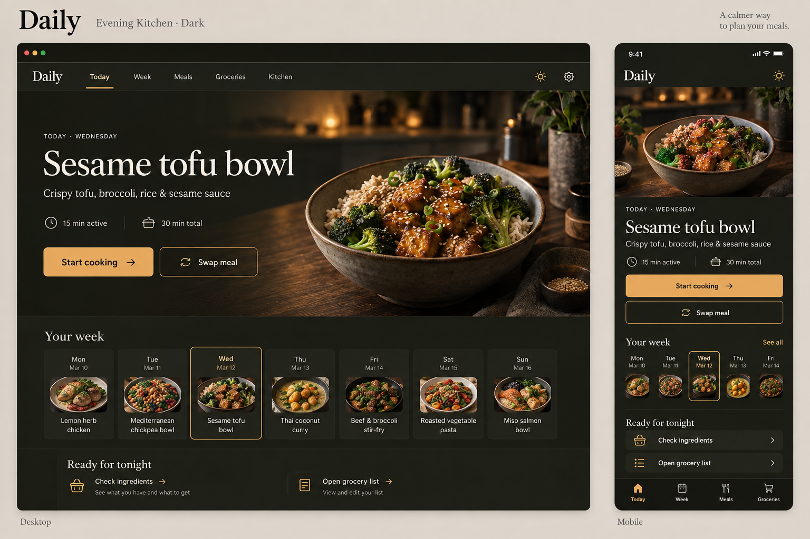
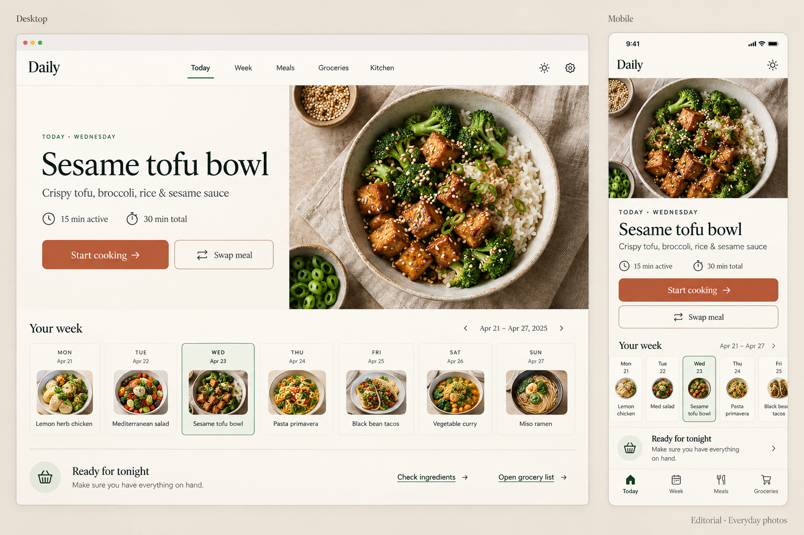
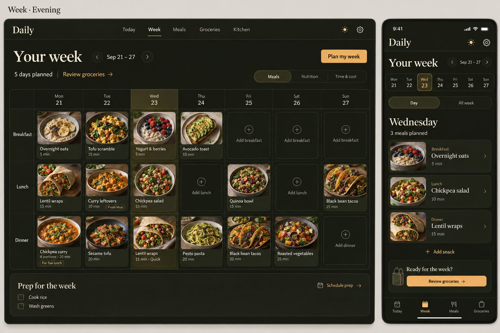
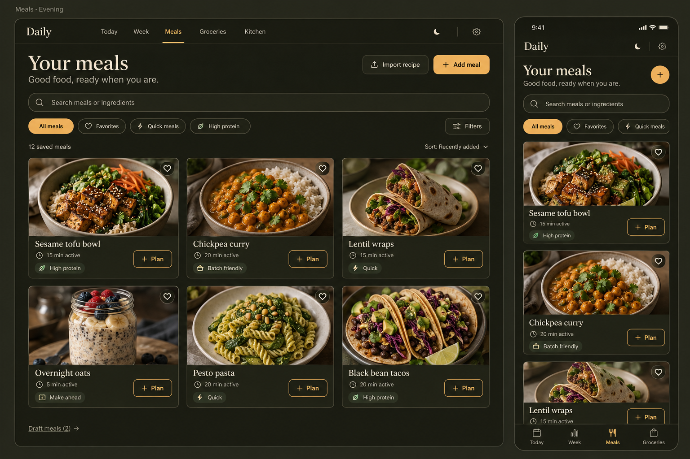
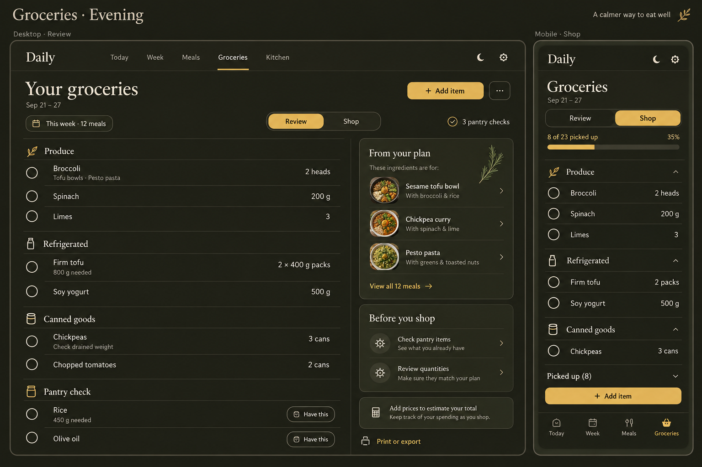
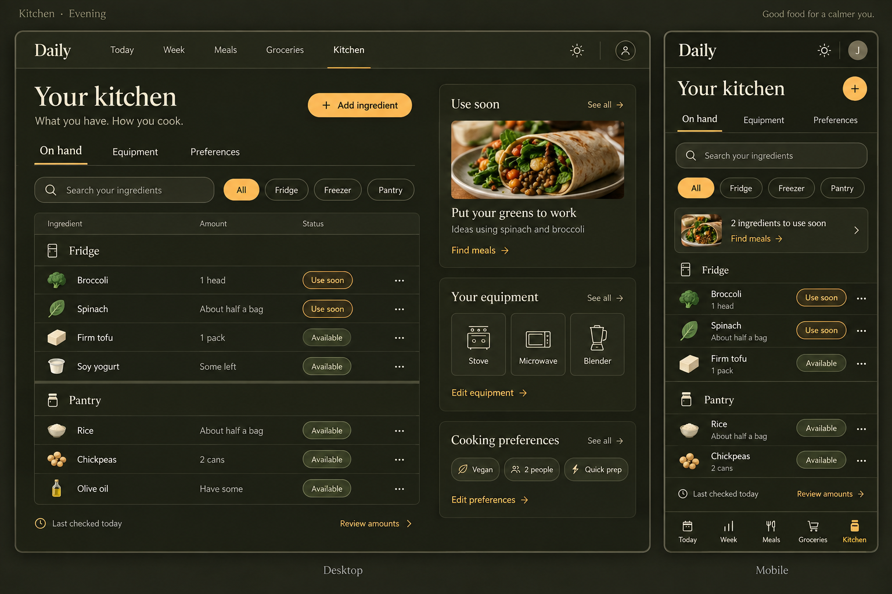

# Nooch concept mockups — reading guide

These fifteen images are the approved visual direction for the Nooch redesign
(product specification v2.0, R29.2). They are **concept references, not
production assets and not executable contracts** (R01.1, R19.1). This guide
states, for each image, what it is authoritative for, what to ignore, and which
corrections apply. The implementation target is: **as close to these images as
the written specification allows**, on desktop and phone, in both appearances.

Authority order when an image and text disagree (R01.1): operator instructions →
the specification's R-sections → the retained domain requirements (Appendix A)
→ these mockups → incidental generated detail. Where the mockups disagree with
each other, the **Cross-mockup decisions** table below resolves it. Any new
resolution is recorded in [`../../internal/DECISIONS.md`](../../internal/DECISIONS.md).

## How to compare an implementation against a mockup

- Each image is a 1536 × 1024 presentation board holding a **desktop frame**
  (about 1,100 image px wide, representing a ~1,440 CSS px viewport, ≈1.3×) and a
  **phone frame** (about 330–350 image px wide, representing a ~390 CSS px
  viewport, ≈1.15×). Compare **proportions, hierarchy, alignment, spacing
  rhythm, type contrast, image-to-text ratio, and atmosphere** — not raw pixels.
- Capture the running app at the R27.5 viewports (360×800, 390×844, 768×1024,
  1024×768, 1440×1000, plus 320 px and 200 % zoom), both appearances, with real
  fonts and real assets. Put each capture beside its mockup and judge: same
  regions in the same order? same visual weight? same density? same image
  treatment? same control language? Record the verdict and every residual gap in
  [`../../internal/REDESIGN_LEDGER.md`](../../internal/REDESIGN_LEDGER.md).
- **Pairs the mockups do not show** (Today editorial or minimal in Evening,
  Explore Evening, Recipe Evening, Cooking Light, Equipment Evening, Onboarding,
  Settings, editors, nonideal states): take the structure from the same surface's
  mockup and the palette, surfaces, and control treatment from a mockup of the
  other appearance (for example Explore Evening = `explore-light.png` structure in
  the `meals-evening.png` treatment). Themes change colour, never structure.
- **Intermediate widths** (768, 1024, 320 px, 200 % zoom) have no mockup: judge
  them against the nearer composition (phone or desktop) for hierarchy, order, and
  density, and against R06 for layout rules.
- Do not require pixel identity with inconsistent AI-generated borders or text
  (R27.5). Do not reproduce presentation-board captions, device chrome (status
  bar, browser chrome, home indicator), incidental dates, misspellings,
  contradictory sample meals, or slogans.
- The wordmark and titles in the images read "Daily", the earlier working name.
  Render the configured display name, now **Nooch** (D-042), in the same serif
  treatment.
- Food, rooms, and appliances in these images are the **target look** for the
  production artwork (see "Artwork direction"). The pixels themselves must never
  be cropped into the app.

## Inventory

| File | Reference set (R29.2) | Appearance | Desktop frame shows | Phone frame shows |
| --- | --- | --- | --- | --- |
| `today-sunroom-light.png` | Today — Sunroom | Light | Immersive **scene** hero | Scene hero, compact |
| `today-evening-kitchen-dark.png` | Today — Evening Kitchen | Evening | Immersive **scene** hero | Scene hero, compact |
| `today-editorial-light.png` | Today — Editorial everyday photos | Light | **Editorial** photo hero | Editorial hero, compact |
| `week-light.png` | Week | Light | Seven-day slot board, Meals view | Day agenda |
| `week-evening.png` | Week | Evening | Seven-day slot board, Meals view | Day agenda |
| `meals-light.png` | Meals — Your meals | Light | Three-column collection grid | One-column feed |
| `meals-evening.png` | Meals — Your meals | Evening | Three-column collection grid | One-column feed |
| `explore-light.png` | Explore — Meals that fit | Light | Context banner + For your week + Something different | Same, one column |
| `recipe-detail-light.png` | Recipe — Ready to cook | Light | Header, photo, tabs, Ingredients + Instructions + At a glance | Compact header and ingredients |
| `cooking-evening.png` | Cooking — One step at a time | Evening | Step list, active step, timer, footer actions | Single step, timer, footer |
| `groceries-light.png` | Groceries | Light | **Review** mode list + planning sidebar | **Shop** mode with progress |
| `groceries-evening.png` | Groceries | Evening | **Review** mode list + planning sidebar | **Shop** mode with progress |
| `kitchen-on-hand-light.png` | Kitchen — On hand | Light | Inventory table + Use soon / equipment / preferences panels | Inventory list + use-soon strip |
| `kitchen-on-hand-evening.png` | Kitchen — On hand | Evening | Same as light | Same as light |
| `kitchen-equipment-light.png` | Kitchen — Equipment | Light | Interactive scene beside equipment tiles | Short scene above two-column tiles |

No evening Equipment concept exists. Derive it from `kitchen-on-hand-evening.png`
(palette, surfaces, tile treatment) and the evening equipment scene variant
(R19.2, R20.2).

## Shared language across every mockup

These are what make the set feel like one product. Treat them as binding intent
(the exact tokens live in [`../../../DESIGN.md`](../../../DESIGN.md)).

- **A cookbook in a warm kitchen** (R05.1). Warm ivory canvas and near-white
  surfaces by day; olive-charcoal canvas with ivory type and amber actions in the
  evening. Photorealistic food carries the colour; the chrome stays quiet.
- **Editorial serif + quiet sans.** The wordmark, page titles, section titles,
  meal names, and big numerals (the cooking timer) are a high-contrast editorial
  serif. Navigation, metadata, form controls, chips, and instructions are a
  readable sans. Two families only.
- **Header.** Serif wordmark (the configured display name, `Nooch`) at left; the five destinations Today, Week,
  Meals, Groceries, Kitchen as plain text links; appearance control and Settings
  gear at right; a hairline divider below. No sidebar.
- **Phone.** Serif wordmark top-left with the appearance control (and Settings)
  top-right; page title in large serif; content in one column; five labelled
  bottom tabs with safe-area padding.
- **Terracotta (day) / amber (evening) means "do this".** One filled primary
  action per region (Start cooking, Plan my week, Add meal, Add item, Add
  ingredient, Next step). Secondary actions are outlined in the same hue or
  neutral. Text links that lead onward ("Review groceries →", "Find meals →",
  "More equipment →") use the action hue with a trailing arrow.
- **Sage selection.** Selected chips and segments use a pale sage fill with
  forest text by day and an amber-tinted fill with dark text in the evening; the
  current day column is tinted sage by day and olive at night (D-040). Status
  pills: "Use soon" warm peach, "Available" sage (olive in the evening).
- **Hairlines before boxes.** Lists and tables separate rows with hairlines;
  cards are reserved for repeatable objects (meal cards, day cells, sidebar
  panels). Generous whitespace, 10–18 px radii, almost no shadow.
- **Photographs aid recognition.** Meal thumbnails are rounded rectangles or
  circles; ingredient rows use small realistic ingredient icons; equipment uses
  consistent line icons.
- **Restrained botanical line art** (a herb sprig) appears as a decorative
  accent in some light panels. It is optional, decorative (`aria-hidden`), at
  most one per view, and never carries meaning.

## Cross-mockup decisions

The concepts disagree with each other in places. These resolutions are recorded
as decisions D-027, D-028, and D-040 in [`../../internal/DECISIONS.md`](../../internal/DECISIONS.md).

| Inconsistency in the images | Resolution |
| --- | --- |
| Active primary-nav item is sometimes an underline (Today, Groceries, Meals, Recipe, Equipment, Week evening) and sometimes a filled pill (Week light, Explore, Kitchen on-hand light) | **Underline**: semibold label plus a 2 px underline in forest green (day) or amber (evening). One `PrimaryNavigation` component; the pill variant is not built. |
| In-page tabs (Recipe/Nutrition/Notes, On hand/Equipment/Preferences, Your meals/Explore) are sometimes underlined, sometimes a segmented pill (Kitchen on-hand light) | **Underlined tabs** everywhere, same component. Segmented pills are reserved for *mode* switches (Meals/Nutrition/Time & cost, Day/All week, Review/Shop, Appliances/Cookware/Tools). |
| Selected chip/segment is sage by day but amber, olive, or terracotta at night and in Groceries Shop; the Equipment category segment is forest-filled | One `SegmentedControl` and one `FilterChip` selection token per appearance (D-040). Day: sage fill + forest text, including the Equipment categories. Evening: amber-tinted fill + dark text, as in the Meals, Kitchen, and Groceries evening chips. The Week selected-day column is not a control: it uses the separate `Column highlight` token (sage by day, olive at night). |
| Today desktop actions are stacked in Sunroom but side by side in Evening and Editorial | Side by side on desktop; stacked full-width on phones (D-040). |
| The Week title and date range share a line in Evening but not in Light | Title and week navigation on one line, as both phone frames show (D-040). |
| Grocery and inventory group headers are small caps in light but serif with an icon in evening | Themes change colour, not structure (R29.3). Use **line icon + small-caps letterspaced label** in both appearances for storage/aisle groups; serif stays for page and section titles. |
| Header right side shows sometimes a sun, sometimes a moon, sometimes a gear, sometimes an avatar | Right side always has the **appearance control** (icon reflects the current setting and opens Light / Evening / Follow device) and the **Settings gear** (R03.3). An account avatar may be added beside them only when a signed-in identity exists; it never replaces Settings. |
| Bottom navigation has four tabs in most phone frames and five in Explore, Recipe, Kitchen | **Five labelled tabs** on every normal phone screen: Today, Week, Meals, Groceries, Kitchen (R01.2). |
| Today's tab icon is a home, a sun, or a calendar; Week's is sometimes a bar chart | **One icon family, one icon per destination**, everywhere (R29.3): Today = home, Week = weekly calendar, Meals = fork and knife, Groceries = shopping bag, Kitchen = cooking pot. Do not reuse the Groceries icon for "Ready for tonight"; use a basket or checklist glyph there. |
| Stove and Oven tiles share one icon; only some scene markers exist | Distinct cooktop and oven icons and separate accessible controls; a combined range may expose both (R01.2). |
| Heart vs bookmark | Heart = personal favourite on saved meals. Bookmark = save an unsaved Explore suggestion. Both carry accessible names that say which (R29.3). |
| Meal-card tag chips use several colours (sage, butter, blue) | One neutral tag chip style with a leading icon; meaning comes from the label and icon, not colour. Badges appear only when the evidence policy supports them (R10.1). |

## Per-image reading notes

Each section lists what to reproduce, then what to correct or ignore. Numbers in
brackets are specification sections.

### Today — Sunroom (light)

Reproduce:
- **Immersive scene hero** spanning the content width directly under the header:
  one composed photograph of a bright sunroom counter with the meal bowl as the
  right-hand focal point and calm negative space at left. Live text sits in that
  negative space: eyebrow `TODAY · WEDNESDAY` (small caps, letterspaced), meal
  title in large serif (the largest type on the page), one-line description,
  meta row `15 min active | 30 min total` with clock icons, then **Start cooking →**
  (filled terracotta, the dominant action) above **Swap meal** (outlined, swap
  icon), both about the width of the text column.
- Below the hero on the canvas: **Your week** serif title and a strip of seven
  day cards (weekday label, round/rounded food thumbnail, two-line meal name);
  the selected day has a sage border and fill.
- **Ready for tonight** row with icon links **Check ingredients →** and **Open
  grocery list →**, separated by a vertical hairline.
- Phone: short scene crop on top (roughly a quarter of the viewport, R06.3),
  then eyebrow, title, description, meta, full-width Start cooking, full-width
  Swap meal, a compact week strip of circular thumbnails with the selected day
  ringed, and Ready for tonight as a two-row link list.

Correct or ignore: browser chrome and `app.daily.com`; four-tab bottom bar (use
five); the phone week strip shows only thumbnails, so each day still needs an
accessible name with the meal; chicken/teriyaki sample meals (demo fixtures are
vegan, R01.2). Add what the concept omits: the quiet occurrence menu (View
recipe, Move, Lock, Change servings, Skip, Remove, Record intake — R08.2) and the
collapsible **Today overview** of the rest of the day below Ready for tonight
(R08.3).

### Today — Evening Kitchen (dark)

Reproduce: the same structure as Sunroom in the evening palette — full-width
moody kitchen scene with the bowl on a wooden table and warm practical light;
ivory serif title; **amber filled Start cooking** with dark text beside an
outlined ivory Swap meal (side by side on desktop); seven day cards on dark
surfaces with the selected day outlined in amber; Ready for tonight with two
columns, each a link plus a one-line explanation ("See what you have and what to
get", "View and edit your list"). Phone: scene top, amber Start cooking,
outlined Swap meal, **See all** link beside Your week, day tiles with amber
selection, Ready for tonight as rows with chevrons.

Correct or ignore: the desktop places Start cooking and Swap meal side by side
while Sunroom stacks them — pick one arrangement per breakpoint band and keep it
across appearances (theme changes colour, not layout). Non-vegan sample meals
(lemon herb chicken, beef and broccoli, miso salmon) are not fixtures. The
evening image must depict the **same recipe revision** as the light image
(R01.2).

### Today — Editorial everyday photos (light)

This is the **editorial treatment**: what Today looks like when a meal only has
an ordinary photo (R17.1). Reproduce the split hero — text column on the canvas
at left (same eyebrow, title, description, meta; **Start cooking →** and **Swap
meal** side by side) and a deliberately framed photograph at right with rounded
corners. Below: **Your week** with the date range and previous/next arrows at
right, seven day cards with small-caps weekday, date, circular photo, and name;
then a **Ready for tonight** bar with a basket glyph in a sage circle, one line
of explanation, and the two links. Phone: photo top, stacked actions, week strip
that scrolls horizontally with a visible continuation, Ready for tonight row with
chevron.

The minimal (no-photo) treatment has no mockup. Build it from this layout with
the photo region replaced by restrained typography and ingredient summary on a
tinted panel (R17.1) — it must look intentional, not broken.

Correct or ignore: the 2025 date range and April dates; chicken sample.

### Week (light and evening)

Reproduce on desktop:
- Header block: **Your week** serif title, week navigation `‹ Sep 21 – 27 ›`,
  summary `5 days planned | Review groceries →`, and **Plan my week** as the
  filled primary action at right. Evening places the date range beside the
  title; light places it below — keep one arrangement per breakpoint band.
- **Meals | Nutrition | Time & cost** segmented control.
- The **board**: a row-label column (Breakfast, Lunch, Dinner, plus configured
  snack/custom/routine rows) and seven day columns with weekday and date
  headers; the current or selected day column is tinted (sage by day, olive at
  night). Each filled cell is a small card: rounded photo, meal name, active
  time, optional status badge. Empty cells show a plus in a circle and `Add
  breakfast` / `Add lunch` / `Add dinner` (dashed outline in the evening).
- Leftover linking shown on cards: `4 portions · 20 min` with a **For Tue lunch**
  badge on the producing dinner, and **From Mon** on the consuming lunch.
- **Prep for the week** panel: checkbox tasks (Cook rice, Wash greens) and
  **Schedule prep →** with a calendar glyph at right; light adds a herb sprig.

Reproduce on phone: title with compact range navigation; a seven-day selector
strip (weekday over date; selected day outlined/filled); **Day | All week**
segmented control; the selected day as a serif heading with `3 meals planned`;
stacked slot cards (photo left, slot label, serif meal name, time, chevron);
`+ Add snack`; a **Ready for the week?** card with **Review groceries →**.

Correct or ignore: four bottom tabs (use five); the desktop Wednesday breakfast
(`Yogurt & berries`) contradicts the phone's (`Overnight oats`) — one plan, one
set of occurrences; the light board shows Saturday/Sunday as empty while evening
fills Sunday — either is fine as fixture data, but both appearances render the
same fixture. Add what the concepts omit: Nutrition and Time & cost views
(R09.4–R09.5), the occurrence panel (R09.2), Move/Copy alternatives to drag, lock
indicators, open/social slot states, and `Time not set` for unknown durations.

### Meals — Your meals (light and evening)

Reproduce: **Your meals** serif title with a one-line subtitle; **Import recipe**
(outlined) and **+ Add meal** (filled) at right; a full-width search field; filter
chips **All meals** (selected), **Favorites** (heart), **Quick meals** (bolt),
**High protein** (sprout/leaf) and a **Filters** button at right; a results row
`12 saved meals` with **Sort by Recently added ▾**; a **three-column grid** of
meal cards (photo with a heart button in a white circle at top right, serif
title, clock + active time, one tag chip, and **+ Plan** outlined at bottom
right); **Draft meals (2) →** below the grid. Phone: title with a round filled
**+** button, search, horizontally scrolling chips, one-column cards with the
same anatomy.

Correct or ignore: Meals needs the **Your meals | Explore** tabs shown in the
Explore concept (R10.1); the subtitle "Good food, ready when you are." is
ornamental — keep the subtitle slot with functional copy (for example the
collection count or "Your saved meals and ideas") (R29.3); multicoloured tag
chips (see Cross-mockup decisions); Week tab bar-chart icon; four bottom tabs.
Badges such as High protein appear only when the versioned badge policy has
evidence (R10.1, R23).

### Explore — Meals that fit (light)

Reproduce: **Meals** serif title with **Your meals | Explore** tabs (Explore
selected); search `Find a meal or ingredient`; chips **Vegan ▾** (selected
dropdown chip), **Quick prep**, **Filters**; a sage **context banner** with a
calendar glyph, `Planning Wednesday dinner`, and a close ×. **For your week**
serif section with the sub-line `Ideas for Wednesday dinner` and three
highlighted cards (photo with bookmark button, serif title, `15 min active · Uses
your spinach` reason line, full-width filled **Add to Wednesday**). **Something
different** section with two horizontal cards (photo left, title, active time,
outlined **Save** with bookmark). A centred outlined **✦ Create a meal idea /
Optional AI draft** button at the end. Phone: the same sections in one column;
five bottom tabs.

Correct or ignore: the misspelling in "Miso mushroom noodles"; the pill-style
active nav. Reason lines are **structured facts** from the planner (R11.2): "Uses
your spinach" may never imply enough spinach; hide any section with no
meaningful results; Add becomes **Replace Wednesday dinner** with an impact
preview when a meal already occupies the slot (R11.3).

### Recipe — Ready to cook (light)

Reproduce on desktop: breadcrumb `Meals / Sesame tofu bowl`; eyebrow `Recipe ·
Ready to cook`; serif title; description; meta row with **15 min active** and
**30 min total** and an outlined **− 2 servings +** stepper; action row **▶ Start
cooking** (filled), **Add to week** (neutral filled with calendar glyph), a square
**heart** button, a square **⋯** button; a moderate photo at right with the
caption `Serving inspiration` beneath it (only for generated imagery, R12.1).
**Recipe | Nutrition | Notes** tabs. Recipe tab: **Ingredients** column
(checkbox rows, name left, quantity right, hairlines) beside **Instructions**
(numbered circles, bold step title, one-line detail), then **At a glance** — a
compact flow of ingredient boxes → action boxes → a tinted **Serve** box, which
is the entry point to the full Recipe map. Phone: back link `‹ Meals` and heart
in the top bar, eyebrow, photo, caption, title, description, meta, stepper,
full-width Start cooking and Add to week, tabs, ingredient list; five bottom tabs.

Correct or ignore: the phone photo is too tall — target about 160–220 px
(R06.3); three steps here versus four in Cooking — both views use the four-step
fixture in R27.2 (Cook rice; Prep tofu and broccoli; Cook tofu; Finish and
serve) and the fixture's ingredients (cooking oil, not sesame oil); the "tlhe"
typo. Add the **Reading | Recipe map** view control inside the Recipe tab and the
full ingredient-action map (R12.1–R12.2).

### Cooking — One step at a time (evening)

Reproduce on desktop: a **focused mode shell** — no primary navigation; the
wordmark at left; appearance, Settings, and **Exit cooking** at right. Left rail:
recipe photo, serif recipe name, numbered step list with completed steps showing
a sage check, the current step with an amber filled number and bold label, and
upcoming steps dimmed. Main column: `Step 3 of 4` with a four-segment progress
bar (done, current, remaining); the step title in very large serif; the full
instruction in large readable type; ingredient/quantity chips with small icons
(`400 g tofu`, `1 tbsp oil`); an optional step photo; and a **timer card**
(timer label, huge tabular numerals `06:42`, a green `Running` status with dot,
**Pause** outlined and **+1 min** outlined in amber). Footer: **View full
recipe** link at left; **← Previous step** outlined and **Next step →** filled at
right. Phone: Exit cooking top right, progress, title, instruction, chips, photo,
timer card, and a footer with **Previous** and **Next step**.

Correct or ignore: the concept omits an explicit **Mark step done** control —
add it; Next only navigates (R13.2). Add the phone step-list sheet, a timer tray
for concurrent timers, reduced-motion behaviour, and the finish flow (batch
confirmation versus I ate a serving, R13.4). Step photos are optional and may
disappear at short heights (R06.3). Timer text must fit at large font sizes
(R27.5).

### Groceries (light and evening)

Reproduce on desktop (**Review** mode): **Your groceries** serif title with the
date range; a scope chip `This week · 12 meals` and `3 pantry checks`; the
**Review | Shop** segmented control (present in evening, missing in light — add
it); **+ Add item** filled and a **⋯** menu. The list is grouped by aisle
(Produce, Refrigerated, Canned goods, Pantry check) with large round checkboxes,
serif item names, a secondary line for contributing meals or notes (`Tofu bowls ·
Pesto pasta`, `800 g needed`, `Check drained weight`), and right-aligned amounts
(`2 heads`, `2 × 400 g packs`). Pantry-check rows carry an outlined **Have this**
button. The right sidebar holds **From your plan** (meal thumbnails with day and
servings, `View all 12 meals →`), **Before you shop** (Check pantry items, Review
quantities), `Add prices to estimate your total.`, and **Print or export**.

Reproduce on phone (**Shop** mode): title and range; Review | Shop with Shop
selected; `8 of 23 picked up` with a progress bar (and percentage in evening);
collapsible aisle groups; rows with a checkbox, name, and amount; a collapsed
**Picked up (8)** group; full-width **+ Add item** above the bottom tabs.

Correct or ignore: slogans and script lettering ("Good Food Brighter Days", "A
calmer way to eat well", "Nourishing days. A brighter you.", "Good food changes
everything."); the leaf beside the wordmark; four bottom tabs. Both modes exist
on both device classes — desktop Review / phone Shop is only a pairing (R14.1).
Never invent a total: show `Add prices to estimate your total` until price
coverage exists (R14.4).

### Kitchen — On hand (light and evening)

Reproduce on desktop: **Your kitchen** serif title with the subtitle `What you
have. How you cook.`; **+ Add ingredient** filled at right; **On hand |
Equipment | Preferences** tabs. Main panel: search, storage chips **All /
Fridge / Freezer / Pantry**, a table with headers Ingredient / Amount / Status,
rows grouped by storage (group header row with icon), each row with a realistic
ingredient icon, name, qualitative or exact amount (`About half a bag`, `Some
left`, `1 pack`, `2 cans`, `Have some`), a status pill (**Use soon** peach,
**Available** sage), and a **⋯** menu; footer `Last checked today` and **Review
amounts**. Right column of three panels: **Use soon** (serif headline "Put your
greens to work", the ingredients involved, **Find meals →**, a meal photo),
**Your equipment** (three device icons, **Edit equipment →**), **Cooking
preferences** (chips Vegan, 2 people, Quick prep; **Edit preferences →**);
evening adds `See all →` links to each panel header. Phone: title with round
**+**, tabs, search, chips, a use-soon strip card (`2 ingredients to use soon`,
**Find meals →**), collapsible storage groups with rows (name above amount,
status pill, menu), footer, five bottom tabs.

Correct or ignore: on-hand tabs are a segmented pill in light but underlined in
evening — use underlined tabs; small-caps versus serif group headers (see
Cross-mockup decisions); `Last checked today` must reflect recorded evidence, not
page views (R15.1); "Available" never implies a measured quantity (R01.2); the
"Good food for a calmer you." caption.

### Kitchen — Equipment (light)

Reproduce on desktop: Kitchen header and tabs with **Equipment** selected; `What
do you cook with?` serif section title with the helper line `Choose your
equipment to tailor your meal suggestions.`; the **Appliances | Cookware |
Tools** segmented control at right (selected segment filled). Left: a large warm
photoreal **kitchen scene** (wood cabinets, white tile, window light, a range
with cooktop and oven, a microwave on the shelf, a blender on the counter) with
small terracotta **markers** on each selected appliance; under it `4 items
selected` and `Tap an appliance to see details.`. Right: a two-column grid of
**equipment tiles** — line icon, label, selected tiles with a sage fill and a
terracotta check badge, unselected tiles lighter with a plus badge; **More
equipment →**; and a card **Have a multicooker? Choose its functions →**. Phone:
tabs, section title and helper, a short wide scene vignette with markers, `4
items selected`, the two-column tiles, More equipment.

Correct or ignore: the phone omits the category selector — it must show
Appliances / Cookware / Tools (R29.3); Stove and Oven share an icon — use distinct
cooktop and oven icons; markers need 44 px hit areas and are never the only way
to select (tiles are the complete interface, R20.3). The scene reflects the
selected state from data; deselecting both cooktop and oven shows cabinet infill,
not a floating hole (R20.1).

## Artwork direction for production assets

The food photography, rooms, and appliances in these images define the target
look for the production asset kit (R17, R19, R20). The asset plan and the
generation workflow are in
[`../../internal/REDESIGN_PLAN.md`](../../internal/REDESIGN_PLAN.md) §"Production
artwork". Rules that come from the images themselves:

- **Light scenes:** bright, soft daylight from a window at left or behind; warm
  stone or linen surfaces; green plants; the bowl as the right-third focal point
  with calm negative space at left for live text; natural, appetizing colour.
- **Evening scenes:** a warm, low-key kitchen at night; wooden table; practical
  lamp or candle light; deep olive-brown shadows; the same bowl and recipe as the
  day image, never a different dish.
- **Editorial photos:** ordinary, well-lit overhead or three-quarter food
  photography on neutral linen or stone; no text, no hands, no props that
  contradict the recipe.
- **Equipment scene:** warm oak cabinets, white subway tile, a window with
  daylight, a stainless range; one fixed camera and perspective across every
  layer and both appearances.
- **Never** bake text, UI, logos, watermarks, or extra dishes into any asset.
  When an image model is given a mockup as a style reference, crop the reference
  to the photograph region only — a full board teaches the model to paint the UI.
