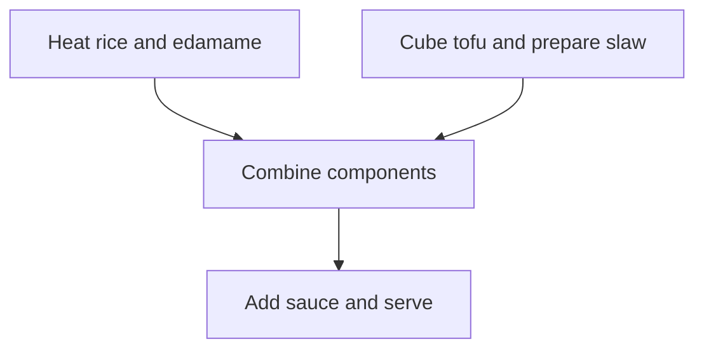

# Daily — complete redesign and implementation handoff

**Version:** 2.0  
**Prepared:** 2026-09-22  
**Audience:** The local Vrooli implementation agent and product owner.  
**Inputs required:** This document, the supplied concept mockups, and the destination repository. No prior conversation, hosted prototype, or separate historical specification is required.  
**Working display name:** Daily, configurable and not a confirmed final brand.  
**Application slug:** Discover and retain the existing nutrition application slug. Do not rename it to personal-planner; that is a separate application.  
**Status:** Implementation specification. The destination repository has not been inspected by this document's author. Nothing here claims that backend features, integrations, assets, or acceptance tests already exist.

> **Repository copy.** This file is the canonical copy of the Daily v2.0 specification for the `nutrition-planner` scenario, received 2026-09-22 and stored verbatim except for this notice, two wording fixes inside Appendix A that the documentation auditor would otherwise misread (the legacy `sample` flag sentence, read as a typed reference, and "local, private, and link-local destinations" in AI-03, read as a filesystem path), and the repository-specific **Appendix C**. The concept mockups it refers to are stored in [`mockups/`](mockups/README.md). Where this repository keeps the implementation inventory, the maintained decision log, and the redesign plan is recorded in [Appendix C](#appendix-c--repository-copy-locations-inventory-and-decision-log).

> Build a beautiful, low-effort personal food planning application that helps people decide what to eat, plan a realistic week, shop, use their kitchen, and cook—while balancing their own nutrition goals, dietary rules, available effort, variety, and cost. Beauty must survive ordinary photos, incomplete information, small screens, and unavailable AI providers.

## Document map

The **Redesign specification**, sections R01–R30, defines the current design, interactions, new capabilities, engineering defaults, asset pipeline, delivery order, and acceptance criteria. **Appendix A** embeds the complete earlier product/domain specification so the handoff preserves full-day nutrition, supplements, calculations, revisions, portability, and original fixtures. **Appendix B** contains the copyable implementation-agent instruction.

Read R01 first. Where the historical appendix and redesign disagree, the conflict rules and explicit overrides in R01 apply. The appendix is deliberately included inside this single file; do not ask the user to locate another document.

| Sections | Subject |
| --- | --- |
| R01–R04 | Authority, scope, product architecture, routes, and requirements |
| R05–R07 | Visual system, responsive behavior, accessibility, shared components |
| R08–R16 | Today, Week, Meals, Explore, recipes, cooking, Groceries, Kitchen, onboarding |
| R17–R20 | Artwork, scenes, generation workflow, interactive equipment assets |
| R21–R25 | Contracts, state, calculations, integration, portability, operations |
| R26–R30 | Edge cases, verification, milestones, decisions, completion report |
| Appendix A | Full original product/domain foundation and calculation fixtures |
| Appendix B | Agent starting prompt |

### Jump to a redesign section

- [R01 — Authority, preservation, and explicit overrides](#r01--authority-preservation-and-explicit-overrides)
- [R02 — Target outcome and release boundaries](#r02--target-outcome-and-release-boundaries)
- [R03 — Navigation, routes, and state ownership](#r03--navigation-routes-and-state-ownership)
- [R04 — Redesign requirement register](#r04--redesign-requirement-register)
- [R05 — Visual system and component grammar](#r05--visual-system-and-component-grammar)
- [R06 — Responsive layout specification](#r06--responsive-layout-specification)
- [R07 — Accessibility, motion, loading, and resilience](#r07--accessibility-motion-loading-and-resilience)
- [R08 — Today: immediate action with broader context](#r08--today-immediate-action-with-broader-context)
- [R09 — Week: calendar-shaped meal planning](#r09--week-calendar-shaped-meal-planning)
- [R10 — Meals: personal collection and flexible authoring](#r10--meals-personal-collection-and-flexible-authoring)
- [R11 — Explore: suggestions that fit the user's context](#r11--explore-suggestions-that-fit-the-users-context)
- [R12 — Recipe detail and ingredient-action map](#r12--recipe-detail-and-ingredient-action-map)
- [R13 — Focused cooking mode and persistent timers](#r13--focused-cooking-mode-and-persistent-timers)
- [R14 — Groceries: review requirements and shop](#r14--groceries-review-requirements-and-shop)
- [R15 — Kitchen: inventory, equipment, and preferences](#r15--kitchen-inventory-equipment-and-preferences)
- [R16 — Onboarding, editors, settings, and unmocked states](#r16--onboarding-editors-settings-and-unmocked-states)
- [R17 — Meal artwork system: scenes, photos, and fallbacks](#r17--meal-artwork-system-scenes-photos-and-fallbacks)
- [R18 — Generation workflow, budgets, and scene creation](#r18--generation-workflow-budgets-and-scene-creation)
- [R19 — Asset production and delivery to the codebase](#r19--asset-production-and-delivery-to-the-codebase)
- [R20 — Interactive equipment scene implementation](#r20--interactive-equipment-scene-implementation)
- [R21 — Domain extensions and service contracts](#r21--domain-extensions-and-service-contracts)
- [R22 — Persistence, offline behavior, and concurrency](#r22--persistence-offline-behavior-and-concurrency)
- [R23 — Nutrition, cost, inventory, and recommendation invariants](#r23--nutrition-cost-inventory-and-recommendation-invariants)
- [R24 — Vrooli and personal-planner integration](#r24--vrooli-and-personal-planner-integration)
- [R25 — Import, export, migration, security, and operations](#r25--import-export-migration-security-and-operations)
- [R26 — Cross-cutting edge cases and recovery behavior](#r26--cross-cutting-edge-cases-and-recovery-behavior)
- [R27 — Acceptance suite and worked redesign fixtures](#r27--acceptance-suite-and-worked-redesign-fixtures)
- [R28 — Implementation sequence and exit gates](#r28--implementation-sequence-and-exit-gates)
- [R29 — Remaining decisions, defaults, and mockup interpretation](#r29--remaining-decisions-defaults-and-mockup-interpretation)
- [R30 — Definition of done and required agent report](#r30--definition-of-done-and-required-agent-report)

## R01 — Authority, preservation, and explicit overrides

### R01.1 Priority of evidence

1. Current explicit instructions from the product owner and applicable repository requirements.
2. The normative behavior and reconciliation decisions in this redesign specification.
3. The retained domain and capability requirements in Appendix A.
4. Supplied concept mockups for visual intent, composition, atmosphere, and hierarchy.
5. Historical prototype styling and incidental generated text.

Mockups are concept references, not executable contracts. Do not reproduce incidental dates, recipe arithmetic, inconsistent icons, contradictory sample meals, decorative slogans, or missing controls simply because they appear in an image. The intended UX is approved; exact API names, tokens, schemas, limits, and breakpoints below are concrete engineering defaults rather than individually approved personal choices.

Use MUST for acceptance requirements, SHOULD for preferred defaults with documented exceptions, and MAY for optional enhancements. A listed future enhancement does not block the current release. A unavailable provider does not justify a fake successful feature.

### R01.2 Supersession table

| Historical or mockup ambiguity | Current authoritative decision |
| --- | --- |
| Cobalt/white/lime visual identity in Appendix A | Replaced by warm ivory/forest-green/terracotta light mode and olive-charcoal/ivory/amber evening mode. |
| Four primary destinations or four mobile tabs | Exactly five primary destinations: Today, Week, Meals, Groceries, Kitchen. Same order on desktop and mobile. |
| Original Today split dashboard | Replaced by the meal-first hero described in R08, with full-day/routine detail still available below. |
| Dinner-only application | Dinner-first presentation is allowed, but the completion target includes configured full-day food and supplements. |
| Week matrix optional in earlier specification | Seven-day meal-slot board is the default wide-screen Week view; compact screens use a day agenda and All week alternative. |
| Original recipe tabs versus new Recipe/Nutrition/Notes tabs | Top detail tabs: Recipe, Nutrition, Notes. Inside Recipe, Reading/Recipe map controls preserve the full ingredient-action map. Start cooking opens focused mode. |
| Recipe mockup has three steps but focused mockup has four | Both views derive from one selected method revision and its step IDs. Use the consistent four-step fixture in R27. |
| Next step sometimes appears to complete a step | Next navigates only. Explicit Mark step done/Done checkbox records completion. Include this control even where the concept omitted it. |
| Step artwork looks like a required feature | Optional. Instructions, amounts, timers, and controls remain excellent without any step images. |
| Daytime/evening meal pictures differ | Themes change presentation, not recipe, portion, date, or meal selection. Approved assets must represent the same recipe revision. |
| Mobile kitchen category selectors missing in some concepts | Equipment always exposes Appliances/Cookware/Tools, with scrolling or wrapping as needed. |
| Stove and oven use identical icons or only one marker | Distinct capabilities. A combined range may provide both; use a cooktop icon and an oven icon, with separate accessible controls. |
| Mockups imply exact pantry knowledge | Inventory is optional, dated, and can be qualitative. Available does not imply a measured quantity or food-safety certification. |
| Generated layouts show non-vegan sample food | Demo fixtures for this handoff are vegan; the product supports other diets through configuration. |
| Mockups contain ornamental slogans | Remove incidental slogans. Use concise functional copy from this document. |
| Old R2 defers all discovery | Curated Explore and deterministic recommendations are part of the redesign release; paid AI generation remains optional. |
| Old imagery guidance only mentions generic photos | Implement scene/editorial/minimal presentation with explicit media metadata and fallbacks. No paid provider is needed for prebuilt assets. |
| Old PDF styling uses cobalt | Use the new light print theme, retaining legibility and all PDF data requirements. |
| Calendar service inferred from prior discussion | Integrate with personal-planner through a verified adapter; do not assume its API or duplicate its calendar database. |

All original non-conflicting requirements remain: minimal meal drafts, immutable revisions, multiple diets, required-rule enforcement, unknown-data honesty, full-day targets, supplement schedules, components, meal families, batches, leftovers, price book, deterministic planning, consumption feedback, JSON/CSV/PDF transfer, tenant isolation, and recoverable persistence.

### R01.3 What this task does not authorize

This handoff authorizes development and normal verification of the described application. It does not by itself authorize paid generation charges, new subscriptions, automatic purchases, outside messages, public publication, or unrelated infrastructure changes. Follow existing session/repository authorization for those actions. Build configured adapters and useful fallbacks while access is unavailable.

## R02 — Target outcome and release boundaries

### R02.1 Product loop

The user configures food rules and equipment, captures existing foods/meals with little effort, obtains a reviewable plan, shops from that plan, prepares food, and optionally records what actually happened. Suggestions improve through explicit preferences and modest, explainable feedback. The application reduces recurring decisions rather than requiring perfect tracking.

The visual redesign must not turn the product into only a recipe gallery, calorie logger, or dinner calendar. Each screen supports the same loop:

| Destination | Primary question | Main outcome |
| --- | --- | --- |
| Today | What am I eating next, and what do I do? | Start, swap, or inspect the next meal. |
| Week | Does this week's plan fit my life? | Arrange meals, leftovers, prep, time, and goals. |
| Meals | What can I make or discover? | Save, find, adapt, and plan meals. |
| Groceries | What do I need, and what have I picked up? | Review needs and shop without losing context. |
| Kitchen | What do I have, and how do I cook? | Maintain useful stock, capabilities, and preferences. |

### R02.2 Delivery classifications

**Core redesign:** All five pages; Explore over curated/user-approved content; recipe reading/map/cooking; full-day R1 baseline behavior; unified themes; responsive navigation; editorial/no-image rendering; curated scene rendering; equipment selection with an initial curated scene; persistent interactions; accessibility; native exports; migration and acceptance evidence.

**Provider-conditional capabilities:** Scene/recipe generation, assisted import, external nutrition lookup, and personal-planner synchronization. Build the capability checks, settings, interfaces, job states, and fallbacks. Verify the real integration when configured. Report any unconfigured integration as unverified, not implemented-and-tested.

**Later extensions:** User-created scene studio, broad retailer/receipt integrations, learned adherence probabilities, community recipe publishing, mixed-profile household optimization, autonomous ordering, unrestricted room decoration, custom 3D kitchen modeling, and billing activation. These are not prerequisites for a useful release.

No feature may secretly depend on paid generation. Existing licensed/prebuilt scenes and photos are usable with generation disabled. No billing tier is selected by this specification.

### R02.3 First-session repository reconnaissance

Inspect the actual nutrition scenario, its instructions, package/runtime configuration, routes, UI library, data migrations, authentication, jobs, image/media storage, and test commands. Identify what is already working and what must be preserved. Inspect available Vrooli component, event, model-routing, scheduling, and notification services before selecting integrations. Use repository-required wrappers and CLIs where present.

Record a short implementation inventory in the repository copy of this document: requirement ID, existing behavior, gap, relevant files, migration need, verification command. Do not replace a working backend merely to match an assumed stack. TypeScript examples here express contracts, not a demand to replace a Go/Python service.

## R03 — Navigation, routes, and state ownership

### R03.1 Proposed route map

Follow the repository's routing conventions, preserving these semantics:

| Route concept | State and behavior |
| --- | --- |
| /today | Defaults to user's local date and next relevant meal. Optional date and occurrence selection. |
| /week | Date range plus Meals/Nutrition/Time & cost view. Mobile Day/All week is a separate display preference. |
| /meals | Your meals tab, filters, sort, search, draft/archived views. |
| /meals/explore | Explore, optional return context and target occurrence/slot. |
| /meals/:id | Pinned or current revision; Recipe/Nutrition/Notes; Reading/Map subview. |
| /cook/:sessionId | Focused cooking session; selected step, completion and timers persist separately. |
| /groceries | Shopping list identity/scope, Review/Shop mode, grouping, search. |
| /kitchen | On hand, Equipment, Preferences tabs. |
| /settings | Appearance, artwork/generation controls, notifications, integrations, data export/account. |

URLs may contain harmless UI context such as week and selected tab. Do not encode allergy lists, provider credentials, private signed media URLs, or entire recipe payloads in URLs. Validate all IDs server-side. An invalid context is recoverable; never redirect silently to a different user's record.

Use browser Back correctly through details, editors, and overlays. After saving a meal or returning from cooking, restore originating filters, scroll position, selected date, and slot where possible. Direct links remain usable without previous navigation history.

### R03.2 Context is explicit

Opening Explore from an empty Wednesday dinner slot creates context {date, slotId, occurrenceId if replacing, plannedServings, returnRoute, basePlanRevision}. The visible banner says Planning Wednesday dinner. Dismissing it returns to general discovery; it does not delete an occurrence. A stale context must be revalidated before application.

Selecting the Today hero is UI state, not a recipe mutation. Changing the viewed serving scale does not change a plan until Apply to planned meal. Shopping mode does not create a purchase. Viewing a step does not complete it. Generated artwork does not change recipe composition.

### R03.3 Global action placement

Primary page actions are: Today Start cooking; Week Plan my week; Meals Add meal; Groceries Add item; Kitchen Add ingredient or the active tab's equivalent. Avoid a floating global plus that means different things without a label. Settings remains accessible on every normal page; focused cooking has an explicit Exit cooking action and a minimal session menu.

Notifications/toasts must not obscure mobile primary actions or bottom navigation. Position them above safe-area offsets. Success means the relevant durable operation succeeded, not merely that the component updated.

## R04 — Redesign requirement register

| ID | Requirement | Verification focus |
| --- | --- | --- |
| RD-001 | Preserve baseline R1 domain capabilities | Baseline acceptance matrix and migration fixtures. |
| RD-002 | Five-destination consistent shell | Desktop/mobile routes, direct links, navigation state. |
| RD-003 | Light/evening/system themes | Tokens, contrast, persistence, first paint. |
| RD-004 | Scene/editorial/minimal meal presentation | Asset eligibility, theme fallback, no-photo states. |
| RD-005 | Today supports next meal plus full-day context | No dinner-only or planned/actual conflation. |
| RD-006 | Desktop Week board and mobile agenda | Moves, locks, custom slots, date/timezone correctness. |
| RD-007 | Leftovers and shared preparation | No duplicate shopping or batch consumption. |
| RD-008 | Nutrition and Time & cost views | Explicit scope, bounds, unknown contributions. |
| RD-009 | Your meals and Explore | Filters, relevance reasons, context-aware planning. |
| RD-010 | Flexible authoring and imports | Name-only draft; safe review; immutable revisions. |
| RD-011 | Shared recipe reading/map/cooking data | Step/quantity consistency and dependency integrity. |
| RD-012 | Durable cooking timers and completion | Reload, pause, background, multiple tabs, no auto-intake. |
| RD-013 | Grocery Review/Shop semantics | Preserve checked/manual/override state across changes. |
| RD-014 | Optional qualitative kitchen inventory | Unknown and approximate stock remain honest. |
| RD-015 | Interactive equipment scene plus tiles | Stable selection, zero equipment, capabilities, responsive. |
| RD-016 | Household food preferences and routine | All diets, allergies, explicit targets/supplements. |
| RD-017 | Versioned media/scene pipeline | Ownership, compatibility, provenance, approval. |
| RD-018 | Optional bounded generation | No implicit spend; deduplication; atomic reservations. |
| RD-019 | Personal-planner integration boundary | Event ownership, timezone, conflicts, fallback. |
| RD-020 | Responsive/accessibility/low-motion behavior | Keyboard, screen reader, zoom, touch, image failure. |
| RD-021 | Real persistence and selected offline support | Outbox, conflicts, partial failure, account isolation. |
| RD-022 | Portability and print redesign | Actual files, semantic round trip, source preservation. |
| RD-023 | Visual consistency and performance | Representative screenshots and asset budgets. |
| RD-024 | Complete implementation handoff/report | Evidence, limitations, run instructions, no false completion. |

## R05 — Visual system and component grammar

### R05.1 Art direction

The app should feel like a beautifully designed cookbook in a warm kitchen. Use photorealistic food where appropriate, quiet typography, restrained line icons, and predictable controls. Today provides immersive atmosphere; Week and Meals use photographs to aid recognition; Groceries and Kitchen inventory emphasize readable information. Avoid glass panels over busy photography, pervasive gradients, oversized metric dashboards, or decorative slogans.

Use one semantic theme system. Do not hardcode separate colors in each screen. These values are starting tokens; adjust after measured contrast checks while preserving the direction:

| Semantic token | Light | Evening |
| --- | --- | --- |
| Canvas | #F7F4EE | #191D16 |
| Surface | #FFFDFA | #24291F |
| Raised surface | #FFFFFF | #2D3327 |
| Primary text | #19372A | #F4F0E5 |
| Secondary text | #596358 | #BDC4B4 |
| Primary action | #A9472D | #E9B564 |
| On primary | #FFFFFF | #211C13 |
| Selection surface | #E3E9DA | #39402D |
| Selection text | #203F2D | #F2DCAD |
| Divider | #DCDDD3 | #454C3D |
| Focus | #2E6A4C | #F5CA80 |
| Error emphasis | #A33332 | #FFB4AA |

Dividers are not necessarily sufficient for required control boundaries; test actual control contrast separately. Meaningful states need text/icon/shape, not color alone. Avoid reducing entire disabled components to barely visible opacity when their explanation matters.

Recommended typography: a self-hosted, licensed editorial serif for page and recipe titles (for example an approved available variable serif), and the repository's accessible sans-serif for forms, navigation, metadata, and instructions. Choose two families maximum. Use system fallbacks with similar metrics. Do not block content on font downloads. Actual font choice is an implementation decision; document license and included subsets.

Recommended scales: desktop page title 36–44 px; Today meal title 42–58 px as space permits; mobile page title 28–32 px; mobile meal title 28–34 px; section title 22–28 px; card title 18–22 px; body 16 px; metadata 13–14 px; minimum nonessential metadata 12 px. Use normal readable line heights and wrap long meal names rather than shrinking text until it fits.

Spacing uses a 4 px base with 8/12/16/24/32/48 groupings. Controls typically 44–48 px tall. Card radii 10–14 px, panels 14–18 px, hero 16–20 px if inset. Shadows are subtle and limited to elevation. Use hairline separators and spacing before adding more card containers. Mobile body padding 16–20 px; desktop 24–40 px. Standard content max width about 1440 px; Week may use about 1600 px if cells remain readable.

### R05.2 Theme behavior

Appearance choices: Light, Evening, Follow device. Follow device is the initial default unless the repository has an established user preference. Do not infer meal type from theme. A dark breakfast remains breakfast. Optional local-time switching is later functionality, not necessary for this release.

Persist explicit appearance preference locally for early paint and in the account for subsequent sessions. Avoid a bright flash on evening-mode reload. Match native control color scheme. Theme changes never generate images automatically and never modify recipe, servings, history, or planning settings.

### R05.3 Shared components

Create or adapt reusable components rather than screen-specific copies: AppShell, PrimaryNavigation, PageHeader, SegmentedControl, FilterChip, MealCard, MealHero, WeekSelector, MealSlotCard, ServingControl, EvidenceValue, IngredientRow, ShoppingRow, InventoryRow, EquipmentTile, EquipmentScene, RecipeMap, CookingStep, PersistentTimer, EmptyState, SaveStatus, ImpactPreview, EntityEditor, SourceDetails, and GenerationJobStatus.

Use the Vrooli component library if actually available and suitable. Contribute reusable primitives through its established workflow; keep nutrition-specific business logic in this app. Component stories/previews must include long names, missing photos, partial numbers, blocked actions, and both themes. No fake buttons in production layouts.

## R06 — Responsive layout specification

### R06.1 Layout bands

Use container width as the deciding factor. Suggested viewport bands are implementation starting points, not device detection:

| Width | Expected behavior |
| --- | --- |
| Below 640 px | Compact layout, bottom navigation, full-screen editors, selected-day agenda, one-column meals. |
| 640–1023 px | Intermediate layout, one/two-column content where readable; agenda by default if Week cells would be too narrow. |
| 1024–1279 px | Desktop shell where nav fits; two/three-column collection; Week board only if minimum cell width is met. |
| 1280 px and above | Full desktop board, wider hero, supporting panels, three/four collection columns within content max width. |

For Week, require at least about 136 px per day plus row labels before showing seven columns. Otherwise use agenda or an explicit horizontally scrollable board option with sticky labels; never force the whole page to overflow. At 200% zoom the layout may switch to compact mode.

### R06.2 Screen-specific reflow

| Screen | Wide | Compact |
| --- | --- | --- |
| Today | Text left and scene focal point right; week strip below | Short scene above solid content, actions immediately after title/time; compact week strip. |
| Week | Seven columns and configured slot rows | Day selector, Day/All week toggle, stacked occurrence cards. |
| Meals / Explore | Photo grid and editorial sections | One-column cards; compact filter row; no minuscule two-column food cards by default. |
| Recipe | Ingredient column and wider method; moderate header photo | Compact photo, summary/actions, ingredient/method sections stacked. |
| Cooking | Step list, active instructions, timer region | Single step, quantities, timer, reachable footer actions. |
| Groceries | List plus planning sidebar | Full-width list; supplementary detail opens sheets. |
| Kitchen inventory | Rows plus use-soon/equipment/preferences summaries | Rows and a small use-soon strip; settings in tabs. |
| Equipment | Scene beside equipment grid | Compact scene above two-column tiles and category selector. |

Bottom navigation uses five labeled destinations with safe-area padding. Reserve its actual height in document flow. It must not cover last rows, editor actions, or the keyboard. Focused cooking intentionally hides ordinary navigation, but Exit cooking remains obvious and preserves session state.

### R06.3 Image layout rules

Food and table within a composed hero scale as a single image. Use focal-point metadata and approved crop bounds. Do not independently apply cover to food and tabletop layers, which can detach the bowl from its surface. Dedicated compact crops/compositions are preferred when a wide crop would be awkward.

On compact Today, target roughly 22–30% of the initial usable viewport for artwork, with a practical clamp around 160–260 px. At short heights or large text settings, reduce or omit decorative artwork before hiding Start cooking. No universal promise that all content fits above the fold; prioritize title and action visibility on representative phones.

On compact recipe detail, avoid the excessively tall hero shown in one mockup; target about 160–220 px unless expanded by the user. Cooking step art is optional and may disappear at short heights. Essential directions and timers remain available.

### R06.4 Interaction reflow

Wide detail panels become sheets or full pages; preserve their semantic state and history. Prefer full-screen editors for long recipe/import forms. Dialogs have a single clear scroll region and sticky actions that remain usable above the on-screen keyboard. Filter chips may scroll locally with visible continuation; all filter options remain reachable by keyboard. Avoid carousels as the only path to critical actions.

## R07 — Accessibility, motion, loading, and resilience

Set a WCAG 2.2 AA implementation target, without claiming certification. Test the actual rendered application. Every icon action needs an accessible name; tabs use correct roles and keyboard behavior; focus is visible in both themes; dialogs restore focus. Use semantic tables or properly labeled lists for ingredient inventories, not arbitrary div collections without relationships.

Common touch controls should be at least 44 × 44 CSS px where practical. Scene markers may have a small visible dot but a larger hit area without overlap. Equipment tile controls are the complete accessible alternative to scene hotspots. Dragging always has Move to/Copy to alternatives.

Reduced motion disables spatial slide/bounce/parallax and uses instant or brief opacity changes. Normal motion should be limited to approximately 120–220 ms state transitions; no animated kitchen activity or simulated steam by default. Timer announcements occur on state changes and expiry, not every second.

Show stable skeletons only while real data is loading. Load failure is not an empty account. Retain drafts and pending changes on errors. Missing image requests use the appropriate fallback without breaking layout. Reserve image dimensions to avoid layout jumps. Offline indicators must distinguish cached data, local pending actions, and server-confirmed saves.

All pages require empty, loading, no-results, error, partial-data, and offline-capability states. Reuse calm short copy and specific recovery: Add a meal, Reset filters, Review amount, Retry save, or Open original photo. Avoid blanket warning banners for every unknown field.

## R08 — Today: immediate action with broader context

### R08.1 Default composition

Header uses the normal shell. Hero shows a local date/slot eyebrow, meal title, short description, active preparation and total elapsed time, Start cooking, Swap meal, and quiet details/menu actions. A seven-day strip below provides quick access to selected meals. Supporting content includes Ready for tonight (or the actual selected slot), Check ingredients, Open grocery list, and a compact rest-of-day/routine summary.

The three supported visual presentations are immersive approved scene, editorial ordinary photo, and minimal no-photo. These are variants of the same component and action structure. Do not load a different page implementation for each. When a meal changes, preserve overall layout and avoid jumping controls while an image loads.

Hero selection is the next relevant noncompleted occurrence according to configured slots, local date, and user selection. Do not assume every user eats dinner next. Allow picking any planned date/meal while labeling it explicitly. If no timing information exists, use configured slot order and ask for selection rather than pretending to know the user's current meal.

### R08.2 Actions and statuses

Start cooking opens a session for the selected recipe revision, preparation method, and intended yield. For a ready-to-eat item, the primary action can be View meal or Log meal; do not manufacture cooking steps. A draft missing instructions opens a clearly incomplete detail view with Edit, not an empty timer screen.

Swap offers suitable alternatives immediately; optional reason chips rerank them. Preserve the baseline reason semantics: missing ingredients is not a permanent dislike. Evaluate plan impact, leftover dependencies, required rules, and locks before application. Compatible simple swaps should be quick, with conditional Undo. Material conflicts require an impact preview. Never replan unrelated days silently.

Other actions in the occurrence menu: View recipe, Move, Lock/unlock, Change servings, Skip, Remove from plan, and Record intake. Their availability depends on status and permissions. Removing a planned future occurrence is different from deleting a recipe or erasing intake history.

### R08.3 Full-day features retained

Below the hero, include a Today overview section that can list breakfast, lunch, dinner, snacks, recurring food/product items, and supplement occurrences. Keep it compact and collapsible when the user prefers a meal-first view. Show Planned / Recorded / Expected scope explicitly for nutrition summaries. A dinner's protein must never appear as the full day's protein.

Offer nutrition details, goal editing, routine configuration, and fixed supplement schedule access without crowding the hero. Missing target values do not produce default personalized numbers. Supplements are user-defined and never increased by the optimizer. Intake remains optional and distinct from preparation completion.

### R08.4 Acceptance examples

An empty user sees Choose a meal or Plan my week, not the demo tofu bowl. A missing image still yields a polished text-first hero. A low-effort request preserves active dietary restrictions. A completed dinner does not disappear from history when the recipe is edited. Switching Light to Evening changes artwork/palette only, never creating a billable job.

## R09 — Week: calendar-shaped meal planning

### R09.1 Header and board

Header: Your week, localized date range, previous/next/today controls, Plan my week. Secondary summary shows meaningful values such as planned days/slots, active cooking time, priced checkout subtotal, and missing-data counts. A day is fully planned only if its configured required planning slots have explicit assignments or intentional open states; do not count one dinner as a complete day without saying dinner scope.

Top view selector: Meals, Nutrition, Time & cost. The selected date range and occurrence IDs remain unchanged between views. Week start comes from user locale/preference, not hardcoded Monday. A seven-day range is represented by local dates; UTC conversion does not shift meals to adjacent days.

Wide Meals view uses seven day columns and configurable slot rows. Default visible slots can be Breakfast, Lunch, Dinner; snacks, custom slots, and routine/supplement rows must remain available. Do not hardcode exactly three rows in the data model. Multiple items in one slot can appear as a compact stack or expanded slot panel. A smoothie plus toast need not be authored as one recipe.

Meal cards show thumbnail if available, title, servings when useful, active time, and status labels such as Leftovers, Prep ahead, Eating out, or Locked. Empty slots offer Add breakfast/lunch/etc. Intentional open/social slots are explicit and not confused with missing assignments. Unknown times show Time not set, not 0 min.

### R09.2 Occurrence operations

Selecting a card opens an occurrence panel with recipe summary, relevant nutrition, ingredients, notes, and actions. Add opens Your meals/Explore with target slot context. Move uses a date/slot picker; dragging is an additional shortcut. Drop on an occupied slot asks whether to swap, add alongside, or replace as supported; never destroy a meal by accidental drop. Copy creates new occurrence identities and does not copy actual consumption.

Locks protect future choices during replan. Copy week offers future dates and shows unresolved rules/revisions. Plan my week creates a preview for unlocked future slots; user anchors and recorded history remain. Stale proposals are revalidated before Apply. Temporary preference modes expire explicitly and never relax exclusions or required targets.

### R09.3 Leftovers and preparation

A cook occurrence can propose extra portions and reserve them for later occurrences. The UI displays For Tue lunch and From Mon, with links showing both sides. Underneath, references point to one planned batch identity or actual prepared batch, not two independently costed recipes.

Before moving or removing the producer, preview affected consumers. If a producer moves after a leftover meal, reject or offer a repair. Canceling a planned leftover releases its reservation; it does not throw food away. Actual prepared stock survives plan edits.

Prep for the week groups actionable tasks such as Cook rice or Wash greens only when supported by meal methods and user choices. Do not automatically merge every repeated ingredient into a batch; preparation states, quantities, storage, and compatibility matter. Grouped tasks link to their contributing meals and estimated active/elapsed time where known. Schedule prep creates a time-block proposal through the calendar adapter; it does not mark the task done.

### R09.4 Nutrition view

Retain the same day columns on wide screens with selected target summaries per day and a detailed panel on selection. Compact mode shows one day's targets as readable rows. Every row includes nutrient/unit, amount or known subtotal, target bounds, applicable period, and completeness/status. Users choose a small set of summary metrics; all configured targets remain available in details.

Use Planned / Recorded / Expected selectors. Expected includes recorded past intake plus explicitly remaining planned quantities; never double-count full plans and intake. Open slots, unresolved ingredient quantities, and absent nutrient mappings remain visible. A weekly average cannot override a daily upper bound. There is no universal nutrition-completeness score.

### R09.5 Time & cost view

Show active preparation separately from total elapsed time and cleanup burden. Shared preparation is counted once, leftover reheating separately. A timeline is only shown when actual timing/dependency information exists; otherwise show estimates per meal/day without implying a solved schedule.

Cost mode identifies portion cost versus incremental checkout. Show coverage and currency. Unknown price is not free; an old observation is labeled by age. Product/package alternatives open a reviewed comparison, retaining restrictions and required method feasibility. A suggestion such as Swap a 50-minute dinner for a 15-minute meal requires known comparable time bases.

### R09.6 Compact layout

Date selector across top, Day/All week controls below, selected day heading, slot cards stacked. Day switching preserves each day's meaningful state. All week is seven compact day sections with meal titles and optional thumbnails, not a shrunk seven-column matrix. Mobile actions open sheets. Expose Plan my week and Review groceries without placing both as competing persistent bottom bars.

## R10 — Meals: personal collection and flexible authoring

### R10.1 Your meals tab

Under Meals, tabs are Your meals and Explore. Use a three-column photo grid at typical desktop widths, two at intermediate widths, one readable feed on compact phones. Cards contain image, title, active time, one or two trustworthy tags, favorite control, and + Plan. Whole-card navigation and nested buttons must use valid accessible markup; avoid a button inside another button.

Search local records by title, ingredient aliases, and approved tags. Debounce searches as needed without model calls per keystroke. Filter chips: All meals, Favorites, Quick meals, High protein; advanced Filters includes Fits my setup, Needs review, Drafts, Archived, equipment, meal slot, source, and preparation range. Preserve filters in navigation. Define Quick meals via an editable active-time threshold and label it; define High protein through an explicit product policy with known data, never just an image or name tag. If evidence is missing, do not claim the badge.

Sort options include Recently added, Recently cooked where recorded, Name, and Active time where known. Unknown numeric values sort into an explicit group rather than appearing as cheapest/fastest. Collection counts distinguish total saved records from filtered results. Drafts remain easy to find.

### R10.2 Add and edit flows

Add meal starts with name or rough text. A name-only record saves as Draft. Add ingredient amounts, source, steps, image, notes, and nutrition later. Keep original pasted/imported material. Editing opens a full page or roomy sheet, with Identity, Yield & time, Ingredients, Method, Nutrition, Source & notes groups; do not require all fields.

Ingredient rows preserve unresolved text and quantities such as to taste. Inputs distinguish empty from zero. Changing ingredient identity/amount invalidates affected nutrition and rule assessments; description-only changes do not trigger unnecessary allergen re-review. Saving creates an immutable recipe revision and retains stable recipe identity.

Plan action opens date/slot/servings. In an Explore/Week context, default to that target. Drafts may be manually placed as unresolved notes with clear status, but must not become automatically recommended compliant recipes. Users may save meals that do not fit current rules; storage and recommendation eligibility are different.

### R10.3 Import and source handling

Provide paste text and structured file imports without an AI provider. URL/photo extraction is optional when configured. Stage results and present unknown quantities, duplicates, method/equipment assumptions, and required-rule evidence for review. Imported page text is untrusted data, not executable instructions. Never overwrite a newer field when an async extraction finishes.

Adapt recipe creates a draft fork with provenance linking to its source; original remains unchanged. A substitution must be quantified and evaluated before showing updated nutrition or eligibility. Recipe archive preserves pinned historical uses. Existing export/import/PDF requirements remain in Appendix A and R25.

## R11 — Explore: suggestions that fit the user's context

### R11.1 Content sources

Core Explore draws from a curated app catalog and user-approved saved recipes/components. Curated recipes need review, rights/provenance, and sufficient method/ingredient evidence; a visually appealing card is not validation. Private recipes must not enter a shared catalog without a separate explicit publishing flow. No social feed or public submission system is required.

Generated new ideas are a distinct optional action, Create a meal idea. Label output AI draft until reviewed. Generated recipe and generated image are separate operations with separate costs and approvals. A beautiful generated photo cannot make a draft ready or resolve ingredient amounts.

### R11.2 Sections and explanations

| Section | Inputs | Required explanation |
| --- | --- | --- |
| For your week | Open/selected slot, active profile, serving/time preferences | Why this candidate fits that slot. |
| Use what you have | Dated ingredient assertions and compatible method | Which ingredients it uses; qualify uncertain stock. |
| Quick meals | Known active-time data and current equipment | Display active time; distinguish elapsed time. |
| Something different | Recent plans/intake plus explicit variety preference | Different flavor/family where supported, not fabricated personal insight. |
| Cook once, eat twice | Yield, batch and leftover feasibility | Proposed portions and future use. |
| Affordable additions | Compatible price/package observations and existing needs | Reused ingredients and modeled cost scope/coverage. |

Only show sections with meaningful results. Empty sections should collapse into useful guidance rather than a wall of empty carousels. Use deterministic candidate filtering/ranking from the planning engine; avoid a separate recommendation path with weaker restrictions. Hard constraints filter first, preferences rank second.

Reasons are structured facts rendered as short sentences. A recipe may use your broccoli without claiming that you have enough broccoli. Missing data cannot be translated into confident affordability or nutrition statements. Dismissals may influence ranking conservatively; users can inspect/reset learned preferences.

### R11.3 Actions

Open card for full preview and provenance. Save meal creates or links a stable private saved record with a pinned revision. Saving twice is idempotent. Add to week preserves an accessible recipe snapshot in the user's collection and creates the occurrence in one coherent operation. Adapt forks a draft. Favorite is personal metadata, separate from saving or catalog quality.

From an empty slot, primary card action says Add to Wednesday (with slot context in the banner or accessible label). From an existing meal swap, say Replace Wednesday dinner and preview material effects. Do not show Add when it would silently replace something. A concurrent plan change produces a refreshed choice, not an overwrite.

### R11.4 Layout

Wide layout has a header/search/filter area, optional contextual banner, three highlighted suggestions, and short secondary sections. Compact layout uses one-column cards with prominent relevance labels and optionally horizontal secondary collections with See all. Avoid endless-scrolling inspiration as the only route to a decision. Maintain return context when opening a preview.

## R12 — Recipe detail and ingredient-action map

### R12.1 Header and tabs

Header contains breadcrumb/back, title, short description, modest food image, active and elapsed time, serving selector, Start cooking, Add to week, favorite, and overflow actions Edit/Duplicate/Archive/Print/Source. Image caption distinguishes generated serving inspiration when applicable. Regular user photos need no AI label.

Top tabs: Recipe, Nutrition, Notes. Recipe includes Reading and Recipe map views. The compact At a glance overview in the concept is a quick entry into the map, not a replacement for the richer ingredient/action representation. Persist view preference without rewriting recipe data.

### R12.2 Reading and map content

Reading shows ingredient checklist and numbered method side-by-side when wide, stacked when compact. Ingredient checkmarks are local/session preparation aids; they do not consume inventory, mark shopping complete, or change ingredient inclusion. Method actions expose specified equipment, quantities, dependencies, outputs, and actual optional durations.

Recipe map rows represent ingredient allocations/components; columns represent actions/stages. Support split uses, independent branches, joins, and named intermediate outputs. A map cell links to the corresponding step. Use semantic table relationships plus a readable alternative. Wide maps scroll within their own region; stage grouping avoids unreadable font sizes. Missing allocations are labeled and do not remove the ingredient from shopping or nutrition.

One domain graph drives the reading view, map, print, and cooking mode. Never hand-author separate instructions for each presentation. Graph validity, quantity allocations, and nested component cycle checks follow Appendix A. Rendering is real HTML/SVG/code, not a generated bitmap with clickable overlays.

### R12.3 Serving changes

Viewer scaling changes displayed ingredient quantities and totals only. Show Reset and Apply to planned meal when opened from an occurrence. Fractional quantities respect recipe/product constraints; countable units need explicit handling. Cooking time, temperature, and appliance capacity do not scale linearly just because portions do. A method-capacity conflict is surfaced before starting a batch.

Changing methods uses reviewed alternatives. Switching stove to microwave must switch actual instructions and timing/equipment requirements; it is not a cosmetic label change. A saved cooking session pins its method and scale so later recipe edits cannot alter active directions unexpectedly.

### R12.4 Nutrition and notes

Nutrition tab provides per serving / selected yield controls, nutrients with provenance and unknowns, relevant target comparisons with explicit scope, and ingredient contributors. Notes include personal notes, original source/attribution, revision details, and optional recorded feedback. Nutrition data is derived from the authoritative path specified by the recipe; never add asserted totals to ingredient totals.

Missing method permits a saved draft and manual editing. Ready-to-eat products intentionally have no cooking steps. Error and partial states must distinguish these cases. PDF export uses this selected revision and scale.

## R13 — Focused cooking mode and persistent timers

### R13.1 Session lifecycle

Start cooking creates or resumes a session identified by recipe revision, method, scale, optional plan occurrence, and user/workspace. If a matching active session exists, offer Resume or Start another. Ordinary navigation is hidden, with Exit cooking and View full recipe remaining available. Exiting does not silently cancel timers or record intake.

Session states: active, paused, completed, abandoned. Step view, completion, timers, and batch confirmation are separate records/states. Session pause need not pause every cooking timer automatically; explicitly ask/offer timer controls because real food continues cooking when the user leaves the screen.

### R13.2 Step interface

Show Step n of m, title, full instruction, relevant ingredient quantities/components, specified equipment/settings, optional image, and relevant timers. Desktop adds a step list; mobile exposes a step-list sheet. Mark step done is explicit. Previous/Next navigate only. Completed checkmarks are driven by persisted completion events, never by viewing the page.

Dependencies can indicate You can do this while the rice cooks. Users can preview any step. Warn before marking a dependent action complete when prerequisites are unconfirmed, but do not trap the reader on one screen. A user may have completed real-world work outside the app. An Override with confirmation can be a user assertion, not fabricated automatic completion.

### R13.3 Timer model

Each timer has stable ID, session/step linkage, label, original duration, state, start/target timestamps, paused remaining duration, and revision. Use absolute timestamps for running timers and calculate display from current time, rather than decrementing an in-memory counter as the only truth. Multiple timers may run concurrently; hidden timers remain available in a compact tray.

Actions: Start, Pause, Resume, Add minute, Reset with explicit intent, Dismiss expiry. +1 min adds to deadline if running and remaining duration if paused. A displayed value rounds consistently; elapsed expiry never silently becomes a new session. A timer reaching zero marks the timer elapsed, not the step or meal complete. Honor user sound/notification preferences; do not promise background alerts unless the actual platform supports and has permission for them.

Reload or tab restore reconstructs remaining time. Multiple tabs share server/local coordination so an expiry is not announced repeatedly by every tab. Offline timer controls persist locally with revisioned operations for reconciliation. Address system-clock changes by using monotonic elapsed time while active and a documented wall-clock/server reconciliation on resume; test rather than claiming perfect timing across arbitrary clock changes.

### R13.4 Completion and actual records

Finished cooking offers a batch confirmation with actual yield and optional ingredient adjustments, or Finish without inventory update. This is distinct from I ate a serving. Batch confirmation consumes raw ingredients once and creates prepared stock. Eating leftovers consumes prepared portions once. If the user only wants guidance, finishing/closing must not force detailed bookkeeping.

Optional feedback: actual active time, easier/harder than expected, keep in rotation, less often. Time spent with the screen open is not automatically active cooking time. Corrections and Undo must preserve original events and reverse dependent effects correctly.

## R14 — Groceries: review requirements and shop

### R14.1 List scope and rows

Groceries header identifies plan/date range, selected meals, Add item, overflow for export/print/share if implemented, and Review/Shop toggle. List identity is stable across recalculation. Grouping options include store section and custom aisle order; actual stores need not be integrated. Search is available for long lists.

Each derived row can show total needed, usable stock considered, amount missing, package count, and price coverage. Compact view shows the most actionable quantity with details expandable. Preserve product/preparation distinctions: canned tomatoes are not fresh tomatoes, dry rice is not cooked rice, and drained weight is not net package weight without a mapping.

Review mode emphasizes pantry checks, overrides, substitutions, contributing meals, and uncertain quantities. Shop mode emphasizes large checkboxes and quantities; checked rows move into Picked up with immediate Undo and no focus loss. Both modes exist on both device classes; desktop Review/mobile Shop is only a mockup pairing, not a forced default. Remember the user's mode.

### R14.2 Checked, owned, purchased, and consumed

Checking a row means picked up in the shopping list. It does not itself record payment, pantry acquisition, or intake. Have this creates/updates a stock assertion with quantity or qualitative evidence; it does not check the item as purchased. Confirm purchases previews actual amounts and optionally prices, then creates purchase and inventory events atomically and idempotently.

Support partial fulfillment. If a row needs two packs and only one was bought, remaining need stays visible. A zero missing quantity based on credible stock may be grouped Already have. A qualitative Have some cannot subtract an invented number of grams; leave a pantry check unless the user explicitly resolves or overrides the purchase quantity.

### R14.3 Recalculation and plan changes

Preserve stable row identities through canonical requirement grouping and maintain source contribution records. Manual items and quantity overrides are never silently dropped. An unchanged requirement retains checked state. An increased requirement marks the additional amount for review rather than pretending the larger quantity was picked up already.

Shopping status: draft, shopping, completed/archived. Entering Shop can begin shopping after an explicit or clearly documented state transition. While shopping, plan changes generate a reviewable diff: Added, Changed, No longer needed. Keep checked purchases even when their originating meal disappears; present no-longer-needed as contextual information rather than erasing history.

Example: removing Tuesday curry does not delete manually added soap, undo a tofu purchase, or reset every checkbox. Adding 150 g more rice retains the previous fulfilled amount and explains the new shortage. Applying a stale diff uses revision checks.

### R14.4 Costs and substitutions

Sidebar includes contributing meals, pantry checks, and known package subtotal/coverage if available. Display Add prices to estimate your total when no observations exist. Do not invent a full estimate for visual balance. Keep price book accessible from row details and page menu.

Substitution chooses a reviewed compatible ingredient/product/method, previews affected recipes and quantities, and re-evaluates rules, nutrition, and costs. A cheap alternative cannot bypass exclusions. Replacing a shopping product alone must not silently rewrite immutable recipes; explain the scope and create appropriate future-use revisions/overrides.

Offline shopping requirements and exports are in R22/R25. No automated checkout is included.

## R15 — Kitchen: inventory, equipment, and preferences

### R15.1 On hand

Kitchen tabs: On hand, Equipment, Preferences. Inventory header includes Add ingredient, search, and storage filters All/Fridge/Freezer/Pantry. Group rows by storage with ingredient/product, amount, evidence/status, and menu. Support multiple lots when relevant without requiring lot tracking for casual users.

Amount modes: exact, estimated, qualitative, out, unknown. Display wording such as About half a bag, Some left, or Amount not set. Store original expression and any reviewed quantity mapping separately. Last checked reflects actual user/recorded evidence; it is not refreshed just because a page is opened. Never infer numeric confidence percentages.

Use soon is user-set or derived from recorded dates under a disclosed policy. It is a planning prompt, not a guarantee that food is safe. Support clear source/evidence in details and editable flags. Find meals opens Explore with relevant ingredients and active dietary rules; uncertain quantities remain uncertain.

Manual stock correction is quick and reversible. Purchase/batch/consumption updates use ledger semantics from Appendix A. Raw ingredients are consumed once at preparation, prepared portions at intake. Merely placing a meal on the calendar reserves stock instead of subtracting it from actual on-hand.

### R15.2 Equipment UX

Use a curated interactive kitchen scene plus explicit equipment tiles. Scene is delightful context; tiles are the authoritative complete selection interface. Desktop has scene left and tiles right; compact has a short scene above a two-column grid. Categories Appliances, Cookware, Tools remain visible/reachable on all sizes. Search/More equipment handles less common items.

Initial catalog: Stove/cooktop, Oven, Microwave, Air fryer, Rice cooker, Pressure cooker/multicooker, Slow cooker, Blender, Kettle, Food processor, Immersion blender; cookware/tools include Frying pan, Saucepan, Baking sheet, Casserole dish, Steamer basket, Kitchen scale. Refrigeration/freezer and basic-utensil access remain configurable because preparation/storage assumptions matter. No item is silently selected in a real new account.

Selecting a tile immediately updates local visual state and persists the capability selection. Show pending/error reconciliation without losing the choice. Scene marker opens details instead of silently removing equipment. Details can include capacity, reviewed functions, wattage where relevant, and preferred use; none is required for basic selection.

Represent physical devices separately from capabilities. A range may provide cooktop and oven; a multicooker may provide pressure and slow-cooking functions. Distinct physical capacities/resource identities matter for simultaneous use. A blender does not imply every processor capability. Recipe eligibility requires one complete viable preparation method, not all equipment across alternative methods.

Zero appliances is valid and produces assembly/ready-to-eat suggestions. Removing an appliance previews affected future meal methods and offers alternatives. Already-recorded history remains intact. Equipment selection is free, immediate, and works with prebuilt assets; no image generation on each click.

### R15.3 Preferences

Organize into Food rules, Household & servings, Time & effort, Variety & favorites, Planning routine, Nutrition targets & supplements, and Shopping preferences. Advanced sections can collapse. User-defined targets/schedules remain explicit; two household servings do not multiply one individual's nutrition target or imply two identical profiles.

Separate allergy/exclusion rules from dislikes and soft priorities. Changes to required rules preview conflicts in future plans and invalidate affected assessments. Appearance, image budgets, account, and external integrations live in global Settings rather than cluttering the food-preferences form.

### R15.4 Inventory is optional

Offer Skip inventory or Track only staples. Planning remains useful with unknown stock and full grocery requirements. Do not require a pantry census to start. Ask short targeted checks only when uncertainty materially affects a recommendation, and allow dismissal. Repeated dismissed prompts should be suppressed or adjustable.

## R16 — Onboarding, editors, settings, and unmocked states

Retain four setup steps: Your food, Your kitchen, Your rhythm, Ready. Replace the old cobalt rail with the new themes and reuse EquipmentScene/EquipmentTile. Allow Explore first with an explicit unconfigured state; do not claim suggestions fit allergies that have not been entered. Setup drafts persist separately from active settings until applied.

Your food configures diet and explicit restrictions. Your kitchen selects capabilities with optional inventory later. Your rhythm captures budget/effort/variety preferences, slots, and optional batch willingness. Ready summarizes and shows actual candidate availability, then applies and opens a plan draft or Today. Do not prefill personal targets from conversation memory or demonstration fixtures.

Progressive setup adds recurring meals, foods, supplements, targets, and preferred stores/units. Editing an existing custom preference vector preserves it unless the user deliberately changes a choice. Use the original documented priority semantics and required/preferred distinction.

Global Settings includes Appearance, Meal artwork, Generation & usage, Integrations, Notifications, Units/currency/timezone, Data & exports, Account. Meal artwork and generation permission are separate controls. Any unsupported feature has an honest disabled explanation or is omitted; do not create settings that never affect behavior.

Unmocked forms follow shared components: labeled inputs, inline validation, meaningful cancel/save, durable drafts, source preview, and conflict recovery. No extra mockup is needed to implement routine forms. Product forks that change cost/access/irreversible behavior must be recorded or escalated; ordinary reversible implementation choices use these defaults.

## R17 — Meal artwork system: scenes, photos, and fallbacks

### R17.1 One layout with multiple media treatments

MealHero consumes recipe/occurrence data and an explicit presentation descriptor. Presentation choices are Immersive scenes, Editorial photos, Minimal. Appearance is separately Light/Evening/Follow device. Generation permission is separately Off/Ask each time/Automatic within budget. These three settings must not collapse into a single premium-theme switch.

Supported treatments:

| Treatment | Required media | Rendering |
| --- | --- | --- |
| Scene | Approved finished meal-in-scene composition compatible with theme/viewport | One coherent image with live text/actions in safe areas. |
| Cutout | Approved transparent subject plus matching scene/lighting/geometry profile | Shared coordinate container, contact shadow only where approved. |
| Editorial | Ordinary licensed/user photo with crop metadata | Deliberate photograph frame in themed shell; no automatic room compositing. |
| Minimal | No reliable image required | Typography, ingredient summary, restrained decorative treatment. |

Default chooser: honor Minimal first; honor Editorial using an eligible photo or Minimal; for Immersive use an approved matching scene, then an explicitly approved compatible cutout, then ordinary photo, then Minimal. Do not select an incompatible scene merely because it exists. Switching themes may change presentation from scene to editorial until an appropriate asset exists; this is acceptable and must remain polished.

Selection is deterministic and does not enqueue generation. Image failure uses the next available treatment and records a safe diagnostic, not a broken-image icon. Avoid loading every variant before choosing. Media changes should not shift titles or interactive controls.

### R17.2 Initial scene catalog

| Family | Geometry and compatibility | Required initial variants |
| --- | --- | --- |
| Kitchen table | Angled view; compact bowls/plates; modest height; individual servings | Light wide, light compact, evening wide, evening compact. |
| Overhead tabletop | Top-down; flatter plates, wraps, salads, pizza, multiple small dishes | Light wide, light compact, evening wide, evening compact. |
| Breakfast counter | Tall cups/glasses and breakfast arrangements | Later; support schema without requiring launch assets. |
| Shared table | Platters and multi-person spreads | Later; avoid forcing into a single-bowl template. |

Use food geometry, serving vessel, camera angle, height/footprint, serving count, and existing photo compatibility to choose a scene. Cuisine may influence food content but must not cause an unrelated room for every cuisine. User override is supported. Theme does not decide whether a meal is breakfast or dinner.

Start with two families × two appearances × two viewport compositions = eight empty template reference images. Finished meal artwork is additional. A template alone does not magically render arbitrary food into it. To keep asset cost bounded, launch with approved composed scenes for a small curated subset and use editorial photography elsewhere.

### R17.3 Finished composition as the preferred immersive path

Provide the empty scene and optional original food image to a configured model/editor. Preserve food identity and recipe content as far as possible; allow serving vessel, placement, and lighting to adapt. Generate the food, table contact, shadows, and reflections together. Review before use. Keep original photo and source metadata separate from derivatives.

The app displays the completed scene image behind real interface content. No screenshot text, navigation, buttons, stats, or diagrams belong inside the asset. On wide layouts, a safe negative-space area accommodates live content; compact images prioritize food and use solid UI surfaces below.

Do not claim an image verifies ingredients, nutrient values, exact portions, dietary suitability, or cooking results. Generated imagery is Serving inspiration. If a generated picture appears to add a conflicting ingredient, reject/regenerate or use another treatment; do not change the recipe to match the picture.

### R17.4 Crop and asset metadata

Each asset needs type, owner/scope, immutable content hash, dimensions, encoded format, source/rights, generation provenance where applicable, approval state, recipe revision compatibility, scene version, theme, viewport composition, focal point, safe text rectangles, and crop bounds. Store normalized 0–1 coordinates in a defined source coordinate system. User photos may omit advanced metadata and default to editorial treatment with an editable focal point.

For a wide scene with left text and right food, define the actual safe text area in metadata and constrain live content accordingly. Long headings may require a quiet panel or editorial variant. A CSS gradient can support contrast but cannot guarantee it over arbitrary art. Validate every approved composition against long-content cases.

Generate responsive renditions once during asset processing. Use modern supported image formats and a compatible fallback. Width/height attributes and aspect ratio reserve space. Keep originals for future recrops/export; don't send giant source files to phone thumbnails. User private media remains access-controlled even if shared decorative scene templates are public assets.

## R18 — Generation workflow, budgets, and scene creation

### R18.1 User-facing controls

Default new accounts to generation Off or Ask each time according to a clearly shown deployment default; recommended safest first launch is Off with an explanation of optional generation. Users can still use bundled approved scenes. Ask each time shows the requested variants and configured price/credit estimate before starting. Automatic within budget requires an explicit nonzero cap, event triggers, variant limits, and scope.

Triggers may include user-requested Create scene image or an opted-in job for selected newly saved recipes. Never trigger per page view, theme toggle, search result, hover, window resize, or every meal in a catalog. Generating a wide image does not silently authorize a second paid compact/night generation if it was not included in the quoted scope.

Settings expose current period usage/reservations, currency or credit units, reset date, queued jobs, cancellation, and provider capability availability. Do not invent prices from model names. If no reliable upper-bound estimate is available, disallow unattended automatic spending and require an explicit bounded policy for manual requests.

### R18.2 Job lifecycle

Creation: validate recipe/media ownership and source rights; validate selected template compatibility; capture immutable input revisions; calculate job key; check existing results; quote/reserve budget; enqueue. Worker uses the configured image.generate role or repository equivalent and validated provider capability, never a hardcoded provider in UI code.

States: queued → running → awaiting_review → approved/available, or failed/canceled/rejected. Separate provider job completion, review approval, and asset activation. If automatically accepted output is ever enabled, require a disclosed review policy and robust validation; default curated/admin review or explicit user approval for new generated compositions.

On recipe/source/template edits during generation, store the result against original inputs; do not activate it for the new revision without compatibility review. Canceling does not guarantee an external charge was avoided; settle actual known usage and preserve that distinction. Retry only transient failures under the authorized attempt/total budget. Each potential paid attempt must be covered by the budget policy.

### R18.3 Cost accounting and deduplication

Use an atomic reservation before enqueue/dispatch to prevent simultaneous jobs from each spending the same remaining cap. Budget check includes settled use plus outstanding reservations and configured maximum attempt cost. On known final usage, settle/release the reservation exactly once. If usage is unknown, retain a conservative pending amount until reconciliation; do not silently mark it free.

Deduplication key includes workspace/privacy scope, recipe visual revision or content hash, original photo hash, scene/version, appearance, composition, model/provider configuration version, prompt version, and relevant output parameters. Do not share a private result across workspaces based only on a matching recipe name. Idempotency covers repeated clicks and worker retries; an explicit Generate another version uses a new variation identifier while still respecting budget.

### R18.4 Prompt contract and validation

Version prompts as code/config. Example semantic template, not a provider-specific API call:

~~~text
Create a food photograph for a meal-planning application.
Reference A is the approved EMPTY scene template; preserve its camera angle,
surface geometry, lighting direction, and designated UI negative space.
Reference B, if present, is the original food photograph; preserve the food's
identity and visible ingredients. Serving vessel and placement may change.
Recipe visual description: {reviewed_visual_summary}
Serving form: {vessel_and_geometry}
Appearance: {light_or_evening}
Composition: {wide_or_compact}
Food placement region: {normalized_region}
Text-safe region: {normalized_region_or_none}
Create physically plausible contact shadows and consistent lighting.
No writing, UI, logos, watermarks, extra dishes, or decorative ingredients
that contradict the recipe. Preserve the original separately.
~~~

Validate decodability, MIME/content agreement, size limits, dimensions, theme/composition, and review disposition. Visual review checks food identity, accidental text, malformed bowls, impossible shadows, unwanted ingredients, and crop usability. Automated checks can assist but do not guarantee semantic accuracy. Rejection keeps the ordinary photo available.

### R18.5 Adding scenes

First release: curated scene catalog with versioned manifests and developer/admin import. Import validates required metadata and preview crops. Templates have draft/approved/retired states; retire prevents new generation but does not break previously approved images.

Later user scene studio: choose starter/reference, describe environment, generate empty wide/compact/light/evening variants under an explicit budget, mark food/safe-text regions, preview representative bowl/plate/tall-vessel cases, then approve a private template. Arbitrary background upload is not automatically a reliable composition template. Do not build a room editor or general 3D engine to support this feature.

## R19 — Asset production and delivery to the codebase

### R19.1 Concept images are not production assets

The user supplies full UX mockups. Use them for visual comparison; do not paste a screenshot into the application and overlay invisible controls. Reconstruct layout, typography, labels, icons, and data with real components. Never use crop-extracted fake controls or rasterized recipe maps as the UI.

Approved background/food art must be generated or sourced separately. If an image tool/provider is available and authorized, create missing assets through it using documented prompts. Otherwise integrate the supplied reusable assets where suitable, implement editorial/minimal fallbacks, and report exactly which production artwork is pending. Do not call the intended scene fidelity complete while shipping unrelated stock imagery.

### R19.2 Initial asset inventory

| Asset group | Minimum useful set | Notes |
| --- | --- | --- |
| Scene templates | Eight references from R17 | No UI or text; paired families/appearances/compositions. |
| Composed Today examples | Bowl in table scene, plate/wrap in overhead scene; matching approved variants where produced | Need not generate every recipe at launch; fallback is first class. |
| Editorial recipe images | At least six licensed/owned vegan demo images | Consistent crops; meaningful no-image fixtures too. |
| Equipment scene kit | Base kitchen plus selected initial appliances, day/evening | Fixed coordinate system and validated composition combinations. |
| Equipment icons | Complete initial catalog | Consistent code-native SVG/established icon set where possible. |
| Ingredient/category icons | Small restrained set | Decorative; text always carries meaning. |
| Cooking step imagery | Optional curated examples | Never require an image per step or generate automatically. |

Naming convention example: assets/scenes/kitchen-table/v1/light-wide-reference.webp; assets/equipment/kitchen-v1/evening/base.webp. Exact storage folders follow repository conventions. Use stable manifest IDs separate from filenames. No development absolute path or conversation image filename becomes a production URL.

### R19.3 Acceptance of artwork

Review wide/compact at actual UI sizes, not only full-resolution standalone beauty. Confirm negative space accommodates a long title, foreground food remains visible, and button contrast survives. Check alpha edges on light and dark surfaces. Reject green fringe, fake checkerboard baked into pixels, opaque white borders, mismatched contact shadows, and inconsistent appliance perspective.

Keep source prompt, reference IDs/hashes, rights, reviewer, and version metadata in an asset manifest. Private source photos need not be committed to a public repository. Deliver approved optimized assets plus source provenance through the repository's established media workflow. Measure transfer sizes before declaring performance complete.

## R20 — Interactive equipment scene implementation

### R20.1 Geometry and layers

Use a fixed artboard with normalized coordinates. Suggested structure: base cabinets/wall/counter; selected appliance layers; controlled contact-shadow layers where necessary; foreground occluders; DOM hotspots. Every layer uses the same viewBox/coordinate transform. Keep cabinet/table perspective identical between variants.

Each slot defines anchor, bounding box, scale limits, z-order, optional mask/occluder, accepted appliance types, and compact visibility. Appliances are placed into predefined slots; free dragging is not required. The selected equipment state comes from the data model; artwork merely reflects it. A capability need not have a unique physical device rendering—for example one range can expose cooktop and oven markers.

Use a clean kitchen base with neutral cabinet infill where an unselected integrated appliance would be. A stove/oven should not remain obviously present after the user deselects both. For a combined range, valid render states may use reviewed modules for range, cooktop-only, oven-only, and cabinet infill; do not produce impossible cabinetry by cutting out arbitrary rectangles.

For countertop capacity, define a finite set of visible slots and deterministic priority/order. Additional selected appliances remain visible as selected tiles and may appear on a shelf or behind a More selected label. Never cram all devices onto one counter or silently deselect one because art space ran out. Visual slot limits are not kitchen capability limits.

### R20.2 Style and image processing

The concepts lean photorealistic. Aim for matching materials and lighting, but a coherent refined illustration kit is an acceptable documented art-production approach if it preserves the approved atmosphere. Do not independently generate each appliance without matching camera/perspective/lighting references.

Prefer native alpha where the chosen provider actually supports it, otherwise use segmentation/matting on a suitable plain background. Do not assume a particular model/version supports transparency. A model-painted checkerboard is not alpha. Colored key backgrounds can contaminate reflective metal, glass, and translucent objects; inspect the result. CSS shadows can ground already-compatible layers but cannot repair the lighting or geometry.

If photorealistic layer combinations cannot meet quality gates, ship the fully working selection tiles with a curated static overview and label the dynamic scene as pending, or use a consistent illustrated kit after documenting the choice. Do not generate a combinatorial full kitchen image for every selection set.

### R20.3 UI semantics

EquipmentTile is a semantic toggle/checkbox with an explicit label and selected indicator. Marker opens details with accessible equipment name and selected state. Focus/hover may highlight the corresponding object and tile, with reduced-motion support. Selecting a tile may fade a layer in/out; it must not move other controls or reset scroll.

Detail panel can set physical count, capability functions, capacity and optional notes. A multicooker capability picker must not assert functions the device does not have. Changes that affect plan eligibility use the same profile-change preview as Preferences. No generation/provider dependency is involved in ordinary toggles.

### R20.4 Compact rendering

Show a wide, short vignette above the tile grid. Preserve object proportions by cropping only designated nonessential margins or using a compact composition with mapped slots. Hotspots may hide if they would overlap; all information remains available in tiles. Do not separately cover each appliance layer. Test no equipment, one appliance, four, and all selected in both themes and narrow widths.

## R21 — Domain extensions and service contracts

### R21.1 Extension entities

Use the baseline ownership, immutable revisions, decimal quantities, evidence, and operation contracts. The following are conceptual additions; adapt table names to the existing backend:

| Entity | Key fields | Invariants |
| --- | --- | --- |
| AppearancePreference | owner, appearance, presentation, revision | Theme has no food/domain side effects. |
| MediaAsset | owner/scope, content hash, storage ref, media type, dimensions, source, rights, state | Access control and immutable original; no unvalidated remote URLs. |
| SceneTemplateVersion | family, version, geometry, variant refs, food region, safe regions, compatibility, status | Version immutable once referenced by a job/result. |
| MealPresentation | recipe/ref, asset, scene version, theme, viewport class, crop, approval | Rendering eligibility differs from recipe eligibility. |
| GenerationPolicy | owner, mode, cap/unit/period, allowed triggers/variants | Automatic mode requires explicit bounded authorization. |
| GenerationJob | inputs, dedupe key, state, provider/role version, attempt limit, usage, result | Stale completion cannot overwrite newer user choices. |
| BudgetReservation | policy/period, job/attempt, reserved/settled amounts, status | Atomic cap enforcement and exactly-once settlement. |
| EquipmentType | stable ID, categories, capability definitions, icon | Display strings are not capability IDs. |
| KitchenDevice | owner, type, selected functions, capacity/count, revision | Physical resources distinct from capabilities. |
| EquipmentSceneManifest | version, theme variants, slots, layers, markers | Bounded deterministic placement; no effect on eligibility. |
| CookingSession | recipe/method refs, scale, occurrence, state, selected step, revision | View, completion, timers, batches, intake are separate. |
| CookingStepCompletion | session/step, assertion time, actor, correction | Never inferred from visiting a step. |
| CookingTimer | session/step, duration, timestamps, paused remainder, state, revision | Timer expiry does not complete a step. |
| ShoppingListSnapshot | plan scope, requirement revision, mode/state, rows | Plan diffs preserve manual and fulfilled quantities. |
| RecommendationContext | target slot, inputs, policy version, reason codes | Revalidate at apply; no stale rule bypass. |
| CalendarLink | source task, external event ID/revision, sync state | Unique stable external identity; no duplicate events on retry. |

### R21.2 Representative contracts

These are illustrative TypeScript interfaces. Runtime validation and database constraints are required; adapt names to existing domain types rather than maintaining incompatible duplicates.

~~~ts
type Appearance = 'light' | 'evening';
type ViewportComposition = 'wide' | 'compact';
type NormalizedRect = { x: number; y: number; width: number; height: number };
type EntityRef = { id: string; revision: number };

interface MediaPresentation {
  id: string;
  recipe: EntityRef;
  assetId: string;
  treatment: 'scene' | 'cutout' | 'editorial';
  appearance: Appearance | 'neutral';
  composition: ViewportComposition;
  scene?: EntityRef;
  focalPoint: { x: number; y: number };
  safeTextRegions: NormalizedRect[];
  approval: 'draft' | 'awaiting_review' | 'approved' | 'rejected';
  provenance: 'user_photo' | 'licensed_photo' | 'generated' | 'edited';
}

interface MealSelectionContext {
  localDate: string; // ISO local date; never parse as an implicit UTC instant.
  slotId: string;
  occurrence?: EntityRef; // Present for replacement; absent for an empty slot.
  plannedServings: string; // Validated positive decimal, not a binary-float price.
  basePlanRevision: number;
  returnRoute: string; // Validate internal route allowlist before navigation.
}

type TimerState =
  | { kind: 'idle'; durationMs: number }
  | { kind: 'running'; targetAt: string; startedAt: string }
  | { kind: 'paused'; remainingMs: number }
  | { kind: 'elapsed'; elapsedAt: string; acknowledged: boolean };

interface CommandEnvelope<T> {
  operationId: string; // Stable across retries of the same logical operation.
  expectedRevision?: number;
  payload: T;
  // Actor/workspace authority is derived and checked by the server.
}
~~~

Validate normalized coordinates, dimensions, safe regions, allowed MIME types, positive scales, bounded durations, and internal references. Money and nutrient amounts use baseline decimal/unit contracts, not generic JavaScript float coercion. Never copy demo IDs into real records.

### R21.3 New operation catalog

| Operation | Input | Result |
| --- | --- | --- |
| Query Explore | context, filters, policy/profile revision | Eligible cards and structured reasons; no mutation. |
| Save catalog meal | catalog revision, idempotency key | Private saved reference/snapshot with provenance. |
| Plan suggested meal | candidate ref, target context, servings, expected revisions | Preserved recipe plus occurrence, or reviewed impact/conflict. |
| Query hero presentation | recipe ref, theme, viewport, preference | Descriptor/fallback, never a generation request. |
| Quote generation | input refs and requested variants | Estimate/bound, capability state, quote expiry. |
| Start generation | accepted quote/policy, expected revisions, idempotency key | Budget reservation and job identity. |
| Review generated asset | job/result, approve/reject, expected revision | Approved presentation or rejection; source retained. |
| Update equipment | desired device/functions, profile revision | Capability revision and affected-plan preview/application. |
| Start/resume cooking | recipe/method/scale/occurrence | Session and timer/completion snapshot. |
| Update timer | timer/ref, explicit action, operation identity | New timer revision and state. |
| Confirm cooking | session, actual yield/usage, update-stock choice | Session/batch effects atomically. |
| Review shopping changes | list ref and latest requirements | Diff with fulfilled/manual/override preservation. |
| Apply shopping changes | reviewed diff, expected list/plan refs | New list revision or conflict. |
| Schedule preparation | source task, local time/zone, duration, calendar choice | Durable link/pending sync or reviewable error. |

Do not expose provider keys or model-internal prompts in ordinary UI responses. Return stable error codes and field paths. Capability endpoints describe actually configured functionality so unavailable adapters do not create dead buttons.

## R22 — Persistence, offline behavior, and concurrency

Server/domain records are authoritative. Editor drafts, viewed tabs, local timer display, and pending outbox operations are separate. Mutations carry expected entity revisions and idempotency keys. Do not send whole-workspace snapshots for checkbox changes. Cache keys include the relevant profile/recipe/plan revisions and policy version.

Offline minimum: previously loaded shopping list can be viewed, rows checked/unchecked, and manual items added locally; an already loaded recipe/session can be read and timers controlled locally. Pending actions are explicit. Planning, external imports, generation, and first-time access to uncached content require connectivity and show a useful state. Do not promise every route works offline.

Persist a bounded outbox with operation IDs, base revision, action, and status. Reconnect replays idempotently. Two clients setting the same checkbox to true must not toggle it twice; store desired state, not an unqualified toggle command. If the requirement quantity changed, reconcile the fulfilled amount and surface the new need. Keep local edits on conflicts and present actionable resolution.

Service workers/cache storage must respect authenticated ownership. Purge or partition private data by account/workspace and clear it on sign-out according to policy. An offline account switch must not show the previous person's meals. Avoid caching private signed URLs indefinitely or treating them as public image identities.

Timers persist across route changes and reload. Server reconcile is needed for multi-device state; local display should stay responsive. Notifications depend on actual platform permission/capability. If the browser cannot deliver a reliable background alarm, show that limitation in timer settings and offer normal in-app behavior, never fake push success.

Implement transactions for plan application, catalog-save-plus-plan, import, purchase/stock, preparation/batch, intake/correction, and budget reservation. Use a durable outbox for external calendar/provider side effects rather than holding database transactions open. Concurrent unrelated changes should not cause a global conflict unnecessarily.

## R23 — Nutrition, cost, inventory, and recommendation invariants

The complete baseline arithmetic and fixtures are in Appendix A. The redesign must expose them honestly rather than duplicating formulas in UI components.

1. Unknown is distinct from zero for quantities, nutrients, prices, and durations.
2. Required exclusions and equipment/method constraints precede preference scoring.
3. Nutrient forms, units, raw/cooked state, product basis, and revision provenance must match before arithmetic.
4. A recipe chooses ingredient-derived or asserted nutrition authority; never both added together.
5. A daily target is not replaced by a favorable weekly average. Lower and upper bounds assess unknowns differently as specified in Appendix A.
6. Household recipe yield does not multiply one user's target or automatically record everyone eating.
7. Portion cost, checkout packages, actual spend, and replenishment cost are separate concepts.
8. Exact known stock may reduce requirements; qualitative stock creates a check, not an invented subtraction.
9. Planned reservations do not decrement actual inventory. A replan excludes its own replaced reservations when assessing availability.
10. Batch preparation consumes raw ingredients once; leftover consumption reduces prepared stock, not the raw ingredients again.
11. Recipe revisions are pinned by plans, sessions, batches, and intake. Later edits do not rewrite historical totals.
12. A generated image or model explanation cannot establish nutrition, ingredient quantities, allergy evidence, price, or actual consumption.
13. Supplement dose schedules are user-defined and fixed during optimization; no automatic dosing recommendations.
14. No feasible result found within a bounded search is not proof of mathematical infeasibility.
15. Recommendation explanations must be traceable to evaluated inputs, not fabricated personalization.

Use shared pure calculation modules callable from UI services, API, jobs, and CLI. Recompute on relevant changes through explicit dependency rules. Keep badge policies (Quick/High protein/Affordable) versioned and testable. An unknown-data candidate must not appear superior because its missing values are treated as zero cost/time.

## R24 — Vrooli and personal-planner integration

### R24.1 Repository fit

Discover the actual nutrition scenario and retain its slug. Daily is a configurable display name. personal-planner is the separate time-management application identified by the product owner. Reuse existing auth, media storage, events, jobs, model roles, observability, component library, and schedule infrastructure only after confirming their contracts. Do not assume the monorepo uses one database or language for every scenario.

### R24.2 Ownership boundary

Nutrition app owns meal choices, recipes, servings, ingredient requirements, cooking/prep tasks, and actual food records. Shared scheduling infrastructure/personal-planner owns calendar event timing and calendar semantics according to the verified API. Meal slot dates alone do not require timed events.

Schedule prep or Schedule cooking opens a proposed block with title, start/end or duration, local timezone, source task identity, and Open full calendar link. User can confirm/edit it. Group prep tasks only when supported by the task model. Existing personal-planner tasks/events should be linked rather than duplicated.

### R24.3 Adapter and reconciliation

Define capabilities such as create/read/update/cancel event, subscribe/poll changes, deep-link, and optional actual-time feedback. Exact endpoints are discovered locally. Link records store source task ID/revision, external event ID/revision, sync state, and operation identity.

Use a stable idempotent external key per source task/event purpose. After timeout, reconcile by key or stored operation before creating another event. Distinguish pending, linked, failed, and conflict. Retry bounded transient failures. Calendar access revoked leaves nutrition tasks intact and indicates reconnection needed.

If an external event is moved within the same day, update the linked time view under the chosen ownership policy. A move across local dates must preview implications for the meal plan and leftovers; do not silently move a dinner, invalidate batch order, or rewrite shopping. Deleting a calendar block unschedules time only, not the recipe or actual food history. Completing a calendar task never records eating.

Support IANA timezone, daylight-saving ambiguity handling, and all-day versus timed semantics. Provide timezone-aware local date selection. If no integration exists, retain internal untimed prep tasks and optionally export calendar data if implemented; do not build an entire competing calendar as a fallback.

### R24.4 Optional notifications and learning

Reminders are opt-in and use available platform channels. No user messages are sent during development without authorization. Actual cooking duration can optionally inform the planner through explicit events, but elapsed browser time is not automatically active effort. Preserve event source, units, confidence/evidence class, and correction links. Do not create notification loops between apps.

## R25 — Import, export, migration, security, and operations

### R25.1 Preserve existing records

Inspect existing schema and actual data before migrating. Back up under repository policy. Add new theme/media/equipment/session fields with conservative defaults. Retain recipe IDs, revisions, plans, intake, grocery state, preferences, and source provenance. An existing appliance selection maps to stable capability IDs; ambiguous values remain visible for review. Do not reset everyone to the vegan demo or seed stock during migration.

If prototype data exists only in an old snapshot format, implement the baseline legacy importer into staged records and preview duplicates. Preserve known values without inventing missing times/nutrients. Existing plans should continue to open even if new scene metadata is absent; editorial/minimal fallback handles them.

### R25.2 Portable formats

Native exports include supported domain records and immutable references plus new scene/media metadata, equipment capabilities, preferences, sessions where chosen, and calendar links as non-authoritative external references. Exclude secrets, access tokens, billing instruments, and signed URL credentials. A JSON export omitting binary originals must explicitly report omissions. Full media backup can use a bounded archive with manifest/checksums, subject to actual scope.

Import stages first, validates ownership remapping, schema version, references, cycles, limits, and duplicate choices. No live mutations during preview. Full restore requires a checkpoint and explicit restore flow. Export schemas and database migrations are separately versioned. Generated assets are not regenerated on restore unless explicitly requested and budget-authorized.

PDFs are real readable documents: recipe with scaled ingredients/method/map; week menu; groceries grouped by category. Use light print tokens even when the app is in Evening mode. Support Letter/A4, multipage headers, long names, Unicode and fractions. Avoid raster screenshots as the only output. CSV is a spreadsheet-friendly view with proper escaping and formula-injection handling; JSON preserves exact original text.

### R25.3 Application security boundaries

Every entity/media/job lookup checks workspace authorization, including nested references. Validate upload MIME by content, decoded dimensions, byte limits, decompression limits, and allowed formats. Sanitize or safely render imported rich text/SVG. Protect URL ingestion from SSRF and redirects into disallowed internal resources using repository conventions. Imported text and image-model outputs are data, not instructions to agents or tools.

Keep provider secrets server-side and use configured role routing. Only send task-relevant data to external providers; a food-image generation request normally does not need the user's target history or supplement schedule. Private food photos remain private by default. Shared scene artwork does not imply shared recipes.

### R25.4 Performance budgets and observability

Use initial engineering targets, measured on documented representative hardware/network: ordinary UI actions should acknowledge locally within about 100 ms; cached navigation should feel immediate; common server writes target sub-second response absent external services. Planning is bounded and moves to a job when necessary. Do not present these targets as already achieved guarantees.

Initial media targets: optimized hero around 250–600 KB where quality permits; collection thumbnails around 30–100 KB; equipment composite/layers budget approximately 1 MB initially visible on compact screens. These are review triggers, not reasons to destroy quality. Load only current theme/composition, lazy-load below-fold images, and avoid sending full-resolution references or both entire theme packs on first paint. Record exceptions with measured justification.

Observe job duration/failures, budget reservations/settlements, media fallback reasons, planner timing, sync conflicts, and operation retries using safe IDs and counts. Never log raw private food histories, full prompts containing user details, signed media URLs, or tokens by default. Health/diagnostic endpoints should expose actual configured capabilities without leaking credentials.

## R26 — Cross-cutting edge cases and recovery behavior

| Condition | Required behavior |
| --- | --- |
| New account, no setup | Explain configuration and allow exploration; no personal claims or seeded history. |
| No eligible recipe for a slot | Show the blocking conditions and useful next actions; never weaken exclusions silently. |
| Long recipe title or translated copy | Wrap and expand layout; preserve actions, no tiny unreadable title. |
| Missing food photo | Editorial placeholder/minimal layout with real meal information. |
| Scene for wrong appearance or recipe revision | Use an eligible alternative treatment; do not auto-generate or display stale incompatible food. |
| Image fails after load | Replace media region without resetting meal state or jumping buttons. |
| User uploads ordinary overhead photo | Editorial by default; scene preparation is an explicit optional workflow. |
| Recipe is archived after planning | Pinned revision remains readable/cookable; future recommendations exclude it. |
| Active allergy changes | Re-evaluate future plan and locked conflicts; historical records remain. |
| No appliances selected | Offer viable assembly/ready-to-eat methods; no implied microwave. |
| All appliances selected | Tiles remain accurate; scene shows a bounded subset or shelf layout. |
| Stale pantry amount | Label age/uncertainty; don't certify enough stock. |
| Same stock reserved by current plan | Replanning excludes its own superseded reservations. |
| Shopping underway during meal swap | Queue/show a list diff; keep picked-up/manual items. |
| Same grocery item checked on two devices | Desired state applies idempotently; no double toggle or purchase. |
| Ingredient increased after picked up | Retain fulfilled amount and show extra requirement. |
| Cooking timer expires off-screen | Persist elapsed state, notify only as supported/authorized; no automatic step completion. |
| Recipe edited during cooking | Session remains pinned; new revision available after explicit choice. |
| Browser reload or clock adjustment | Recover timers and state with documented clock reconciliation. |
| Generated image job canceled after provider dispatch | No auto-activation; retain actual/pending usage honestly. |
| Two simultaneous generation jobs at budget limit | Atomic reservation allows only covered work. |
| Generation unavailable | Bundled assets, ordinary photos, manual editing, and planning still work. |
| External calendar event deleted | Mark task unscheduled; no meal/intake deletion. |
| Import ID collision | Show Keep/Copy/Replace revision options; remap dependent IDs coherently. |
| Save succeeds but response is lost | Retry with same operation identity retrieves original result. |
| Unknown nutrients/prices | Partial assessments and scoped known subtotals, never fake zeros. |
| Offline sign-out/account switch | Private cache is isolated/cleared; no cross-account reveal. |
| No touch/drag capability | Every operation accessible through buttons/menus/keyboard. |
| Reduced motion or large text | Disable spatial motion, reflow, preserve all actions. |

## R27 — Acceptance suite and worked redesign fixtures

### R27.1 Verification principles

The implementation agent must test domain semantics and actual user journeys, not only snapshot appearance. Reuse baseline fixtures and existing repository test conventions. Add tests where there is material behavior/risk; do not write trivial tests that merely duplicate CSS values. Visual review is required for the redesign; passing unit tests cannot establish that it matches the supplied references.

The following fixture values are synthetic development examples, not the user's actual foods, prices, allergies, targets, equipment, or current plan. Demo data lives behind an explicit seed/demo path and never appears as a real user's saved history.

### R27.2 Consistent recipe fixture

Use one four-step method across reading, map, and cooking to resolve the concept inconsistency:

- Identity: Sesame tofu bowl; canonical yield 2 servings.
- Ingredients: firm tofu 400 g; broccoli 1 head with unresolved mass unless explicitly mapped; dry rice 150 g; soy sauce 2 tbsp; cooking oil 1 tbsp; sesame seeds 1 tbsp. Optional demo conversion factors must be marked synthetic and have provenance.
- Active time: 15 minutes; elapsed: 30 minutes, both fixture assertions, not computed safety claims.
- Step 1: Cook rice. Uses rice and any water explicitly represented; follow the chosen reviewed method. Output cooked rice.
- Step 2: Prep tofu and broccoli. Uses tofu and broccoli; output prepared tofu and florets. Can occur independently of step 1.
- Step 3: Cook tofu. Depends on step 2; uses prepared tofu and cooking oil. Optional fixture timer; output cooked tofu.
- Step 4: Finish and serve. Depends on steps 1 and 3; cook prepared broccoli according to reviewed instructions, combine with sauce, cooked tofu, and rice, finish with sesame seeds.

Do not turn this brief fixture into a nutritionally complete source record without actual mapped data. Use baseline synthetic nutrition fixtures for arithmetic tests. If the curated recipe authoring supplies a more detailed valid method, keep all presentations consistent with that method rather than preserving the exact four steps.

### R27.3 Artwork fixtures

Create cases for: approved table-scene bowl; approved overhead plate/wrap; ordinary portrait phone photo with cluttered background; ordinary overhead photo; no image; incompatible scene revision; rejected generated image; image load failure; and no evening asset. Include long titles and very short/long descriptions. At least one normal-photo and no-photo fixture must appear in visual review, not only ideal generated images.

Equipment fixtures: zero selected; stove only; oven only; combined range with both capabilities; microwave+blender; four selected; all selected; unknown custom device; multicooker with only pressure enabled; missing layer image. Tile state must remain correct independent of art availability.

### R27.4 Functional acceptance cases

| Test ID | Given / action | Required result |
| --- | --- | --- |
| AT-001 | Fresh user opens each destination | Real empty states, five consistent routes, no demo data leakage. |
| AT-002 | Save appearance and reload on second session | Account preference persists; no bright flash where avoidable. |
| AT-003 | Change theme with generation disabled | Existing asset/fallback renders; zero generation jobs or charges. |
| AT-004 | Open Today with only an ordinary photo | Editorial layout has same actions and readable hierarchy. |
| AT-005 | Open Today with no photo | Minimal layout fully usable; no broken image or fake food. |
| AT-006 | Change selected date and slot | Correct explicit context; no misleading Tonight label for other dates. |
| AT-007 | Swap one future meal | Only chosen occurrence changes; groceries/assessments update coherently. |
| AT-008 | Swap conflicts with locked leftover dependency | Impact preview/repair; no silent deletion. |
| AT-009 | Move meal onto occupied slot | Explicit choice; preserve data until applied. |
| AT-010 | Replan with locks and open/social slots | Locks preserved; open slots remain honestly unknown. |
| AT-011 | Week at 390 px and large text | Day agenda readable; no whole-page horizontal overflow. |
| AT-012 | Same week across local midnight/DST | Correct local dates/slots; no UTC day shift. |
| AT-013 | Planned + recorded partial intake | Expected view does not double-count original planned quantity. |
| AT-014 | Missing upper-bound nutrient contributions | Unknown assessment rather than unjustified pass. |
| AT-015 | Required budget with unpriced products | Cannot claim validated budget compliance. |
| AT-016 | Save name-only meal | Durable draft with unknown values, editable after reload. |
| AT-017 | Archive scheduled recipe | Historical/pinned detail remains available. |
| AT-018 | Edit recipe during an active session | Session pinned to original method/revision. |
| AT-019 | Explore with soy excluded | Soy-containing/inadequately evidenced candidates not recommended as compliant. |
| AT-020 | Explore opened from Wednesday dinner | Context visible; Add/Replace behavior targets that slot only. |
| AT-021 | Save catalog meal twice | No duplicate saved recipe from retry. |
| AT-022 | Add Explore meal to week | Accessible recipe snapshot and occurrence both preserved. |
| AT-023 | Adapt recipe with ingredient substitution | New draft revision/fork, reassessed nutrition/rules; original intact. |
| AT-024 | Reading/map/cooking at 1 and 2 servings | Same step IDs and scaled quantities in every view. |
| AT-025 | Split ingredient allocations | No duplicate grocery/nutrient quantity. |
| AT-026 | Next step without Mark done | View advances, completion unchanged. |
| AT-027 | Running timer reload/pause/resume/+1 min | Correct reconstructed timing and independent step state. |
| AT-028 | Timer expiry in two tabs | No duplicate persisted expiry effects; avoid repeated alerts. |
| AT-029 | Finish cooking without eating | Batch/preparation can record; intake not fabricated. |
| AT-030 | Cook then eat leftovers | Raw stock used once, prepared stock decremented once. |
| AT-031 | Check grocery row | Checklist only; no automatic payment/stock/intake event. |
| AT-032 | Confirm partial purchases twice via retry | Actual quantity applied exactly once; remainder visible. |
| AT-033 | Add manual item then replan | Manual item and user overrides remain. |
| AT-034 | Increase already checked requirement | Fulfilled amount preserved, extra need flagged. |
| AT-035 | Shop offline then reconnect after server change | Pending state reconciles, conflict visible, no lost edit. |
| AT-036 | Mark Have some rice | No invented exact grams subtracted. |
| AT-037 | Select zero/all equipment | Valid state; scene adapts without changing capabilities incorrectly. |
| AT-038 | Remove only oven capability from combined range | Cooktop remains; affected oven-only future methods flagged. |
| AT-039 | Use scene hotspot via keyboard equivalent | Tile/detail flow exposes same information/actions. |
| AT-040 | Queue two jobs exceeding remaining combined budget | Reservation prevents cap overspend. |
| AT-041 | Retry same generation request | Reuse job/result under same idempotency key. |
| AT-042 | Recipe changes while image generates | Result not activated blindly against new revision. |
| AT-043 | Provider fails or no credentials exist | Existing app workflows function; clear generation capability state. |
| AT-044 | Private media accessed from another workspace | Access denied without leaking sensitive metadata. |
| AT-045 | Calendar create times out after remote commit | Reconcile stable identity; no duplicate event. |
| AT-046 | Linked calendar event crosses day/deletes | Review implications or unschedule only; no silent meal/intake rewrite. |
| AT-047 | Export/import complete supported data | Semantic round trip, source/revision references resolve, omissions explicit. |
| AT-048 | Print long recipe/week/groceries in both paper sizes | Readable real PDF, correct quantities, no clipped map or UI chrome. |
| AT-049 | Imported malicious text/URL/media | Validation and safe rendering/fetch policy, no instruction execution. |
| AT-050 | Sign out then another user enters offline | No previous user's private cache displayed. |
| AT-051 | Existing populated database migrates | IDs/history/plans preserved, no reset to seed data. |
| AT-052 | Reduced motion, keyboard, zoom, image failure | All primary journeys usable and visually coherent. |

AT-040–043 and AT-045–046 require real configured integrations for end-to-end evidence; deterministic adapter/worker tests alone must be labeled as such. If access is absent, retain these as explicitly blocked integration tests with manual fallback evidence. Do not mark them passed using hardcoded provider responses while implying production connectivity.

### R27.5 Visual acceptance matrix

Capture representative screenshots at 360×800, 390×844, 768×1024, 1024×768, and 1440×1000 CSS pixels; add 320 px width and 200% zoom for reflow stress. Exact device dimensions are test examples, not layout breakpoints. Include both themes and use real fonts/assets at normal browser scale.

Review all primary screens plus Explore, recipe detail, recipe map, focused cooking, inventory, equipment, Preferences, and one long editor. Compare hierarchy, whitespace, image proportions, alignment, contrast, component consistency, and interaction reachability against the supplied references. Do not require pixel identity with inconsistent AI-generated borders/text. Fix layout defects before taking new evidence screenshots.

Specific visual checks: mobile hero doesn't bury actions; bottom nav doesn't obscure content; Week has no tiny seven-column phone layout; recipe card buttons align despite wrapped titles; grocery amounts remain aligned; equipment hotspots align with objects; timer text fits at large font size; overlays work with software keyboard; ordinary photo/no-photo versions look intentional.

### R27.6 Suggested integrated review journey

Start a clean account, choose vegan plus an illustrative exclusion, select microwave/stove/blender, save a name-only meal, enrich another recipe, inspect map/reading consistency, generate a week draft, lock a favorite, add an Explore meal, allocate leftovers, review groceries, mark partial shopping offline, reconnect, confirm purchases, cook a session with a timer, record a batch and one consumed serving, inspect full-day nutrition with unknowns, change a recipe revision, and export/restore into a test workspace. Verify history, counts, quantities, and UI state throughout.

Keep personal data separate from this fixture journey. The purpose is to exercise the whole product loop, not demonstrate invented health outcomes.

## R28 — Implementation sequence and exit gates

The agent should work in complete vertical slices. Existing implemented features may satisfy a milestone after verification; do not rebuild them solely because they appear later in this list.

| Milestone | Work | Exit gate |
| --- | --- | --- |
| D0 — Inspect and map | Read repo instructions, inventory current behavior/data, map requirements, identify adapters/assets | Actual stack, migrations, test commands, and gaps documented. |
| D1 — Visual foundation | Tokens, fonts, five-destination shell, responsive primitives, core component previews | Both themes, keyboard/navigation, representative widths work. |
| D2 — Collection and recipe | Durable meals/drafts, editor, import review, reading/map/cooking basics | Create/save/reopen/edit and revision integrity; no-photo state polished. |
| D3 — Today and Week | Hero treatments, slots, move/swap/locks, plan preview, full-day analysis surfaces | Persistent end-to-end planning with known/unknown semantics. |
| D4 — Shopping and Kitchen | Review/Shop, stable derived lists, offline outbox, inventory, preferences, equipment capabilities | Manual/picked-up/purchase/intake boundaries verified. |
| D5 — Explore and cooking depth | Curated recommendations/reasons, contextual planning, persistent timers, batches/leftovers | Discovery-to-cooking-to-intake flow correct. |
| D6 — Production artwork | Curated scenes, ordinary-photo fallback, equipment layer kit, manifests and optimization | Reference quality on desktop/mobile; no paid generation dependency. |
| D7 — Optional adapters | Bounded image generation, assisted import, personal-planner linkage where configured | Real integration evidence or explicit blocked state with working fallback. |
| D8 — Migration, portability, release review | Populated-data migration, actual exports/PDFs, accessibility, performance, screenshot review | Required acceptance matrix passed or specifically approved scope deviations recorded. |

Baseline R0/R1 release gates still apply. If the existing app lacks full-day nutrition, targets, supplement routines, prices, or batch accounting, include those gaps in D2–D5 work; do not declare redesign complete while silently removing their controls or replacing calculations with placeholders.

Recommended first fidelity proof: implement Today with one approved scene, one ordinary photo, and one no-photo meal; verify light/evening and phone/desktop; then apply the validated shell/components to remaining screens. In parallel within the agent's normal workflow, validate durable data semantics before expanding complex planning. No explicit multi-agent orchestration is required by this specification.

Do not stop after producing a generic scaffold or screenshots. Every visible production action must either work end-to-end or have an honest capability explanation. Build with demo fixtures only in an explicit environment. Keep regular application loading separate from showcase/demo mode.

## R29 — Remaining decisions, defaults, and mockup interpretation

### R29.1 Decisions that do not block work

| Decision | Default for implementation |
| --- | --- |
| Final public name | Daily as replaceable label; retain existing internal slug. |
| Theme startup | Follow device unless existing preference present. |
| Presentation default | Immersive when approved asset exists, otherwise editorial/minimal. |
| Generation spending | Off initially; opt-in Ask each time; bounded automatic later/configured. |
| Initial scene families | Kitchen table and Overhead tabletop. |
| Custom scene creation | Schema/admin import now; end-user scene studio later. |
| Equipment interaction | Scene + tiles; deterministic slots; no free room decoration. |
| Equipment art style | Match approved warm materials; prefer coherent layered kit over malformed photo composites. |
| Week start and units | Locale-based editable preferences; demo uses explicit date/metric examples. |
| Mobile navigation | Five labeled tabs on every normal screen. |
| Cooking completion | Explicit Mark step done; Next only navigates. |
| Optional AI recipe ideas | Separate labeled draft workflow, never required for Explore. |
| Real personal profile | Collected in app; no guessed targets, stock, allergies, supplement doses. |
| Shared calendar protocol | Discover actual personal-planner API; adapter + internal untimed fallback. |
| Commercial pricing/tiers | Not selected. Do not invent paywalls or activate billing. |

### R29.2 Design-reference inventory

Use the supplied images by visible subject/caption rather than requiring these exact files to exist in the repo:

| Reference set | Intended authority |
| --- | --- |
| Today Sunroom / Evening Kitchen / Editorial | Hero atmosphere and responsive composition. |
| Week Light / Evening | Meal board, selected-day agenda, restrained food thumbnails. |
| Meals Light / Evening | Collection grid/feed and recipe-card hierarchy. |
| Groceries Light / Evening | Market-list styling, Review/Shop emphasis, desktop sidebar. |
| Kitchen Light / Evening | Inventory grouping and contextual panels. |
| Kitchen Equipment Light / Evening | Scene-plus-tiles interaction and warm materials. |
| Explore — Meals that fit | Contextual discovery, relevance labels, plan action. |
| Recipe — Ready to cook | Detail hierarchy and ingredient/method layout. |
| Cooking — One step at a time | Focused step, timer prominence, reduced navigation. |

Do not use the earliest rejected conventional cobalt prototype as the new visual target. Do not recreate presentation-board captions around the live app. Concept examples are not actual calendar dates, inventory records, active sessions, or dietary facts.

### R29.3 Specific visual corrections to make

Use one icon set throughout; Today should not alternate arbitrarily between a calendar, sun, and home icon. Week uses a calendar/weekly icon rather than a chart unless the repository design system provides an appropriate coherent alternative. Keep Kitchen consistently identifiable. Store favorites and bookmarks intentionally; use heart for personal favorite and save/bookmark for unsaved Explore entries, with accessible distinction.

Use functional copy rather than incidental Good food, brighter days slogans. Keep buttons the same component across themes. Ensure mobile Equipment has category selectors even where a mockup omitted them. Standardize recipe and active session step counts. Show a Mark step done control absent from the cooking concept. Make the phone recipe photo shorter than the oversized concept if needed to expose the action sooner. Do not fabricate nutrition/cost badges for incomplete demo recipes.

## R30 — Definition of done and required agent report

The redesign is complete only when core page behavior, baseline retained capabilities, durable persistence, migration, responsive UI, asset fallbacks, and required verification are complete. Provider-conditional features must be genuinely verified when configured or clearly reported unavailable with working fallbacks. A screenshot does not prove persistence, arithmetic, eligibility, spending controls, or integrations.

The final agent report should include:

1. What changed and why, organized by user journey rather than a raw file list.
2. Existing capabilities preserved and any explicit migration performed.
3. Requirement/acceptance status with evidence and actual commands/results.
4. Desktop/mobile screenshots for both themes and nonideal media states.
5. Assets created/sourced, their provenance and optimization, and any remaining art gaps.
6. Which adapters were tested against real services versus simulated fixtures.
7. How to run, seed an isolated demo, configure optional providers, and verify the app.
8. Known limitations and exact unresolved blockers, without claiming complete coverage where tests were not run.

Maintain a short decision log in the repository's canonical copy of this file. Record date, requirement, decision, reason, affected behavior, and verification. The user should not need another conversation to know whether an unimplemented feature was deliberately deferred or accidentally omitted.

### Redesign implementation status at handoff

| Item | Status |
| --- | --- |
| Main visual direction and concept references | Discussed and positively reviewed by product owner. |
| Page behavior and recommended engineering defaults | Specified here for implementation. |
| Actual destination repository inspection | To be performed by implementation agent. |
| Production scene/equipment assets | To be inventoried and prepared; UX screenshots are not an asset kit. |
| Backend/adapter/test completeness | Unknown until repository inspection and verification. |
| Acceptance suite execution | Not executed by the specification author. |

## Appendix A — Retained product and domain foundation

The full text below is the earlier Daily implementation specification, retrieved for this handoff. It is included to preserve detailed domain contracts, nutrition/cost/stock semantics, original fixtures, portability behavior, and baseline acceptance requirements. Its earlier styling, navigation, recipe-tab arrangement, and release deferrals are overridden wherever R01–R30 explicitly say so. Its statement that it is the single handoff now refers to this combined document as a whole. Its original reference list is historical sourcing, not a claim that provider APIs or prices were rechecked for this redesign.

**Reading rule:** Apply the supersession table in R01 before implementing an old UI paragraph. Continue to enforce non-conflicting domain requirements. R28 is the current delivery sequence. Appendix B is the current agent starting instruction.

---
# Daily — complete product and implementation specification

**Version:** 1.0 · **Prepared:** 2026-09-18  
**Audience:** A local coding agent and the developer reviewing its work.  
**Format:** One self-contained implementation handoff. No prototype, conversation, screenshot, second document, or external integration is required to understand the intended product.  
**Working product name:** Daily. The name is provisional; keep branding configurable.  
**Status:** Ready to begin implementation using the recommended defaults below. The user commissioned this specification after reviewing and approving the direction of an interactive UX prototype. Detailed engineering choices in this document are recommendations, not claims that the user separately approved every choice.

> Build an application that makes it easy to eat in a way that fits the user's nutritional goals, dietary restrictions, budget, available effort, and appetite for variety. The ordinary interaction should be choosing whether tonight's suggestion sounds good—not repeatedly researching food, maintaining spreadsheets, or filling in long forms.

## Contents

1. [Read this first: implementation mandate](#1-read-this-first-implementation-mandate)
2. [Product purpose and confirmed needs](#2-product-purpose-and-confirmed-needs)
3. [Release scope, product boundaries, and defaults](#3-release-scope-product-boundaries-and-defaults)
4. [User journeys and information architecture](#4-user-journeys-and-information-architecture)
5. [Visual design and interaction system](#5-visual-design-and-interaction-system)
6. [Onboarding, kitchen configuration, and targets](#6-onboarding-kitchen-configuration-and-targets)
7. [Today, weekly plans, priorities, and feedback](#7-today-weekly-plans-priorities-and-feedback)
8. [Meal collection, flexible capture, and editing](#8-meal-collection-flexible-capture-and-editing)
9. [Recipe map, reading view, cooking mode, and recipe printing](#9-recipe-map-reading-view-cooking-mode-and-recipe-printing)
10. [Grocery list, price book, and pantry UX](#10-grocery-list-price-book-and-pantry-ux)
11. [Import, export, backups, and printing](#11-import-export-backups-and-printing)
12. [Domain model, contracts, and invariants](#12-domain-model-contracts-and-invariants)
13. [Nutrition, supplements, and data quality](#13-nutrition-supplements-and-data-quality)
14. [Planning engine and explainable optimization](#14-planning-engine-and-explainable-optimization)
15. [Cost, inventory, leftovers, and shopping calculations](#15-cost-inventory-leftovers-and-shopping-calculations)
16. [AI assistance, data acquisition, and recurring jobs](#16-ai-assistance-data-acquisition-and-recurring-jobs)
17. [Architecture and application contracts](#17-architecture-and-application-contracts)
18. [Persistence, concurrency, privacy, and failure recovery](#18-persistence-concurrency-privacy-and-failure-recovery)
19. [Performance, operations, and commercial readiness](#19-performance-operations-and-commercial-readiness)
20. [Worked examples and embedded implementation fixtures](#20-worked-examples-and-embedded-implementation-fixtures)
21. [Acceptance criteria and verification strategy](#21-acceptance-criteria-and-verification-strategy)
22. [Delivery sequence and definition of done](#22-delivery-sequence-and-definition-of-done)
23. [Open decisions, assumptions, and deferred possibilities](#23-open-decisions-assumptions-and-deferred-possibilities)
24. [Grounding and external references](#24-grounding-and-external-references)
25. [Maintaining this as the single handoff document](#25-maintaining-this-as-the-single-handoff-document)

## 1. Read this first: implementation mandate

### 1.1 What you are being asked to deliver

Implement a real, persistent application with a polished interface and a deterministic planning core. Reconstruct the UX described here, then complete the domain behavior needed to support actual daily use. The previous prototype established the interaction direction; it did not implement a complete nutrition optimizer.

The foundational loop is:

1. Learn the user's food rules, kitchen, routine, and preferences with little effort from them.
2. Capture foods, recipes, supplements, prices, and available stock, allowing incomplete information.
3. Produce a practical plan and explain the meaningful tradeoffs.
4. Make the immediate action obvious: prepare, assemble, swap, or choose a fallback.
5. Record lightweight corrections and actual consumption when the user chooses to provide them.
6. Improve subsequent suggestions without turning the user's life into a bookkeeping task.

A dinner planner with sample numbers is an intermediate milestone. The first personally useful release must also represent the rest of the day's food and supplements, configurable nutrition targets, and honest data completeness. The original goal must survive the implementation of the attractive interface.

### 1.2 Instructions to the implementing agent

- Read this document fully once, then use the section links and requirement IDs while implementing individual slices.
- Inspect the actual repository, its instructions, application conventions, authentication, persistence, tests, and available integrations before choosing framework details.
- Preserve the product's low-effort experience. Put advanced information behind an intentional disclosure, without withholding information necessary to make a decision.
- Implement complete vertical slices: UI action, domain operation, persistence, recalculation, error behavior, and meaningful verification.
- Use the release boundaries in Section 22. Do not declare the product complete after reproducing demo screens.
- Keep source-backed data, user assertions, calculated values, and AI suggestions distinguishable.
- Treat external data, uploaded files, and model output as input to validate. They do not authorize changes to the user's rules or account.
- Never invent personal nutrition targets, allergies, spending baselines, prices, or external account access.
- Use explicit development fixtures for demos. A fresh real workspace must not silently inherit sample pantry stock or the fictional user's targets.
- If a dependency is unavailable, implement and expose its supported fallback. Do not leave a button claiming a capability that does nothing.
- Record implementation decisions and completion evidence in the maintenance area of this same specification when it becomes the repository's canonical copy.
- Ask about a genuine product fork only when it materially changes the deliverable and no recommended default below resolves it. Continue independent work while awaiting that decision.

### 1.3 Authority and requirement language

| Label | Meaning | How to act |
| --- | --- | --- |
| Confirmed need | Explicitly requested by the user | Preserve throughout implementation. |
| UX direction | Demonstrated in the prototype and positively received | Reproduce the described interaction and visual intent; reasonable accessibility and usability improvements are allowed. |
| Recommended default | Concrete design selected here to make implementation possible | Implement unless repository evidence or a material contradiction requires a documented adjustment. |
| Open decision | A choice that remains unconfirmed | Use the stated interim behavior; do not silently invent personal facts or business commitments. |
| Deferred | Retained product idea outside the specified early releases | Preserve extension points only where inexpensive; do not build speculative infrastructure. |

Within the selected release, **must** describes an acceptance requirement. **Should** is the preferred implementation with a documented reason needed for deviation. **May** is optional. A statement about a later release does not move that feature into the current milestone.

If requirements conflict, prioritize explicit user needs, domain correctness, trustworthy data handling, and then the default UX. Identify the conflict in the decision log. Do not weaken an exclusion or rewrite historical records to make a test pass.

### 1.4 Scope of this handoff

This document replaces the need to send the agent the living brief, prior brainstorming, the hosted prototype, or source code from that prototype. Relevant decisions, ideas, examples, and remaining questions are consolidated here. External references explain selected standards or data providers; this specification states the intended behavior independently of those references.

The destination repository is not inspected by this document's author. References to Vrooli are integration guidance to verify locally, not an assertion that a particular service, endpoint, database, or dependency already exists there.

## 2. Product purpose and confirmed needs

### 2.1 The user's situation

The originating user follows a vegan diet and tries to cover macro- and micronutrients while obtaining substantial protein. They favor meals with little preparation or cooking. A carefully planned but repetitive routine becomes boring, leading to more expensive alternatives or eating whatever is immediately available. Their original plan did not explicitly optimize cost.

Relevant purchases include protein powder, nutritional yeast, omega-3 products, and other supplements. The system must be able to represent these alongside ordinary food. Their exact products, doses, current routines, nutrition targets, and prices have not been supplied or confirmed for this project.

The user will not stick with a solution that requires continuous research or repeatedly figuring out how to make meals. This is a primary design constraint, not a secondary convenience feature.

Although the originating user would select vegan, they explicitly want a product that supports other diets and could eventually be monetized. There is no confirmed subscription price, billing provider, commercial launch date, or household-sharing requirement.

### 2.2 Confirmed requirement register

| ID | Requirement | Product consequence |
| --- | --- | --- |
| C01 | Balance nutrition, protein, effort, variety, and cost | Planning must expose configurable priorities and enforce required constraints. |
| C02 | Minimize recurring research, preparation, and decision work | Capture once, reuse information, offer immediately usable suggestions, and make feedback optional. |
| C03 | Personally vegan; support other diets | Diet is workspace configuration rather than a global code assumption. |
| C04 | Handle restrictions and allergies | Exclusions are explicit, independently editable rules with visible evidence limits. |
| C05 | Playful appliance selection | A visual multi-select kitchen setup influences which preparation methods fit. |
| C06 | Questions establish initial priorities | Onboarding translates ordinary-language answers into editable planning settings. |
| C07 | Add/edit a meal with as little or much information as available | A name-only draft is valid; enrichment can happen later. |
| C08 | Import/export and attractive printable PDFs | Portable data and print output are first-class features. |
| C09 | More intuitive recipes, including recipe infographics | The same recipe supports an ingredient/action map, reading view, and focused cooking mode. |
| C10 | Preserve the whole idea across handoff | This file contains product intent, implementation behavior, rationale, and deferred ideas. |
| C11 | Allow a local agent to implement without the hosted app | Layout, interactions, contracts, examples, and tests must be reconstructable from text. |

### 2.3 Outcomes and measurements

The product hypothesis is that affordable variety and practical fallbacks improve follow-through, which may reduce actual food spending and improve coverage of configured nutritional goals. Do not present that hypothesis as a proven savings result.

Measure, when the user permits and data exists:

- Time and interaction count needed to get a first usable plan.
- Repeated information requests and manual edits required per week.
- Suggestion acceptance and voluntary swap reasons, with an explicit unknown category for missing feedback.
- Planned versus recorded food spending, including optional purchases outside the plan.
- Active preparation, elapsed time, cleanup burden, and batch sessions separately.
- Repetition and variety by meal, flavor, texture, and meal family.
- Coverage and missing-data status for each configured nutrient target.
- Ingredient waste or corrections when voluntarily recorded.
- AI/provider cost and maintenance burden relative to the value of the automation.

Recommended usability goals: a returning user can see the next meal immediately; begin guided preparation in one action; see swap alternatives without writing a reason; and save a name-only meal without entering nutrition. These are acceptance goals, not claims about measured performance of the prototype.

## 3. Release scope, product boundaries, and defaults

### 3.1 Release definitions

| Release | Purpose | Required capabilities |
| --- | --- | --- |
| R0 — durable UX foundation | Reconstruct and improve the demonstrated experience with real persistence | Setup; all primary screens; manual meal capture/editing; recipe views; dinner planning; prices and stock entered manually; saving; JSON/CSV/PDF portability; core invariants; local demo fixtures. |
| R1 — personally useful planning | Support the originating user's actual full routine | Baseline routine capture; configurable meal slots; foods and supplements; nutrient identities/bases; full-day evaluation; real price observations; component/batch/leftover modeling; household serving count for a single profile; temporary preference modes; explainable deterministic planning. |
| R2 — low-maintenance assistance | Reduce the work of obtaining and maintaining information | AI-assisted text/link/label ingestion; provider-backed food lookup; bounded price refresh; preference inference; optional scheduled drafts and notifications. |
| R3 — commercial expansion | Make deployment and commercial operations suitable for other customers | Entitlements and usage budgets; billing if approved; commercial onboarding polish; tested subscription lifecycle; optional sharing/households if separately selected. |

R0 is a reviewable foundation. R1 is the default target for calling the first usable product complete. R2 makes the original low-maintenance ambition substantially stronger and should follow in deliberate slices. Account isolation and data ownership must exist from R0; monetization does not justify postponing them.

### 3.2 Non-goals for the initial releases

Automated checkout, autonomous supplement dosing, diagnosis or treatment, real-time global grocery-price coverage, social feeds, an unrestricted recipe marketplace, calibrated adherence prediction without training data, and a generic optimization platform are outside R0/R1. Do not implement payment-taking or place orders merely because an export or shopping list exists.

Meal recommendations are planning assistance. They must not claim allergy safety, clinical adequacy, or verified nutritional completeness beyond the data and configured policy actually evaluated.

### 3.3 Recommended default decisions

| Decision | Default | Rationale / change rule |
| --- | --- | --- |
| Initial experience | Dinner-first dashboard with an expandable full-day view | Retains the easy entry point while supporting the whole diet. |
| Planning horizon | Seven consecutive local calendar days, editable | Removes the prototype's fixed dates without demanding a calendar setup. |
| Actual diet defaults | Unselected on first visit; vegan selected in the explicit personal demo | A commercial product must not assign the founder's diet to everyone. |
| Target values | Blank until entered or explicitly accepted from a vetted reference policy | Personal goals are not known. |
| Currency/units | Editable locale settings; USD and metric for supplied demo fixtures | Store currency explicitly and preserve entered units. |
| Account model | One private workspace per authenticated user initially | Supports later commercialization without building sharing prematurely. |
| Person count | One profile with adjustable recipe and planned serving counts | Mixed-diet multi-person optimization is a separate feature. |
| Review of changes | Preview substantial replans, imports, and source replacements | Users retain control without approving every minor edit. |
| Diet/allergy rules | Required eligibility conditions | Preference weights never override them. |
| Protein/calorie targets | Configurable as required or preferred; no silent enforcement before configured | Preserve user choice and incomplete-data honesty. |
| Supplement schedules | User-defined fixed schedules; no automatic dose adjustment | Prevent the optimizer treating pills as freely adjustable nutrient variables. |
| AI | Optional adapter; deterministic paths remain useful | Avoid making every interaction depend on a model call. |
| Purchasing | Shopping plan and exports only | Financial actions require a separately designed flow. |
| Name/visual brand | Daily, cobalt/white/lime | Preserve the demonstrated direction, keep replaceable. |

### 3.4 Prototype shortcuts to replace explicitly

| Prototype behavior | Production behavior |
| --- | --- |
| A fixed September 14–20 sample week | Calendar dates in the user's timezone with week navigation. |
| Twelve illustrative meals and example nutrient totals | Clearly labeled demo fixtures plus user records and source-linked data. |
| Sample pantry automatically subtracted | Only actual workspace inventory or explicitly enabled demo inventory. |
| Dinner-only totals | Explicit dinner scope in R0; full-day planned/recorded views in R1. |
| Simple cost/effort/repetition ranking | Versioned scoring and constraint evaluation with known-data checks and plan-level effects. |
| Broad reviewed/unreviewed flag | Separate authoring, evidence, and rule-evaluation states. |
| Text parsing based mainly on headings | Conservative manual organizer first, validated assisted extraction in R2. |
| Recipe changes update a single live record | Immutable revisions and historical snapshots. |
| One saved workspace snapshot | Domain records and transactional changes, with export bundles as snapshots. |
| A generic generated bowl photo | Licensed/original assets with honest labels, or attractive ingredient typography. |
| Fixed dietary enums | Data-driven presets compiled into explicit rules, with composable custom restrictions. |

## 4. User journeys and information architecture

### 4.1 UX-IA-01 — Application shell

Top-level destinations are **Today**, **Your week**, **Groceries**, and **Meals**. **Your kitchen** opens setup/preferences. **Import / export** is globally accessible and also available contextually in Meals, Your week, Groceries, and recipes.

For R1, nutrition analysis, inventory/price details, and supplements are secondary destinations reached from relevant summaries or Your kitchen. Keep the four primary destinations stable; do not add a top-level tab for every domain entity.

Desktop: brand at left, navigation near center, kitchen and transfer actions at right. Mobile: compact header and a persistent four-item navigation area; use a bottom bar when the repository's established app pattern supports it. Give the active destination a clear label and visual state. Route state must be bookmarkable where useful; dialogs may use route/query state if consistent with the app shell.

Suggested route meanings (adapt path prefixes to the host app): `/today`, `/week?start=YYYY-MM-DD`, `/groceries?plan=id`, `/meals`, `/meals/:id`, `/kitchen`, `/nutrition`, `/data`. A refresh must preserve the meaningful destination, selected week, and recipe, not reopen an arbitrary default day.

### 4.2 Journey A — A first useful plan

1. New user enters a brief four-step setup or chooses Explore first.
2. They choose a diet approach, exclusions, and appliances.
3. Three questions establish initial cost, effort, and variety settings.
4. The final step summarizes the rules and tells them how many available recipes can currently be evaluated as fitting them.
5. With sufficient recipes, a draft week is generated. Without them, the user can add a favorite or explore clearly labeled sample content.
6. The user sees one recommended meal and simple reasons. They can start, swap, edit setup, or inspect the week.
7. R1 offers a short follow-up to capture the rest of the day and targets; it does not demand personal measurements just to explore recipes.

A first plan with incomplete data is useful if it clearly describes what has and has not been evaluated. It must not display a reassuring nutrition-coverage badge merely because seven slots are filled.

### 4.3 Journey B — Capture an existing routine

The user pastes a rough routine or adds a sequence of meal names. The application creates a review queue with detected meals, recurring slots, foods, and supplements. It asks only material questions: quantity/basis, exact product where fortification matters, and whether a repeated item is a separate consumption or the same item described twice.

An example input might mention a daily smoothie, a tofu meal, crunchy snacks, and recurring supplements. The system preserves the source text. It must not invent a smoothie recipe, product brand, serving weight, dose, or daily target. Reusable recurring slots become baseline templates after review. Later weeks can vary the flexible slots while keeping accepted anchors.

### 4.4 Journey C — A tired evening

Open Today → see the next meal → choose “Not a cooking kind of night?” → see eligible alternatives ranked for minimal active effort → compare time/cost and material target effects → select one → grocery requirements and future dependent batch uses are recalculated → begin or mark consumed. Giving a reason is optional. This can be a one-meal override without changing permanent priorities.

### 4.5 Journey D — Shopping and changes

Review a week → inspect derived groceries → see quantity needed, stock available, estimated package count, price source/date, and unknowns → check off items as shopping progresses → explicitly confirm purchases if inventory should be updated. A shopping checkmark alone is not a purchase receipt, a stock adjustment, or consumption.

If a meal changes, preserve checked states for materially unchanged line requirements. Mark increased or changed requirements for review. Show a compact summary such as “Rice increased by 150 g; chickpeas removed.” Do not clear the entire checklist on every swap.

### 4.6 Journey E — Cooking and logging

Open a recipe → choose map, read, or focused mode → adjust servings if needed → follow steps or use a timer → finish cooking. “Cooked this batch” and “I ate this” are distinct actions in R1. Confirm a default consumed portion with one action, optionally adjust it, or leave consumption unrecorded. Undo creates a correction and reverses linked inventory effects transactionally.

### 4.7 Journey F — A new week

Carry forward accepted routine anchors, current preferences, credible stock, and actual feedback. Generate a draft for the next date range, preserve locked commitments, explain meaningful changes, and allow apply/undo. A scheduled job in R2 prepares a draft without silently replacing a plan the user already arranged.

### 4.8 Journey G — Moving data

Export a complete backup or recipe collection. On import, inspect schema version, counts, unsupported fields, unresolved references, and duplicate decisions before any live write. Add meals without replacing setup, or explicitly restore a full workspace with a recoverable checkpoint. Print useful recipe and grocery PDFs independently of backup functionality.

## 5. Visual design and interaction system

### 5.1 UX-VIS-01 — Visual direction

Daily should feel calm, capable, and slightly playful. The interface gives a clear recommendation, with supporting detail available when wanted. Preserve generous whitespace, a strong cobalt primary action, warm lime highlights, white surfaces, dark blue text, and restrained metadata. Avoid turning the landing view into a wall of nutrient gauges.

Recommended design tokens, derived from the prototype:

| Token | Value / behavior |
| --- | --- |
| Canvas | `#F7F8FA` |
| Surface | `#FFFFFF` |
| Primary cobalt | `#234BD8`; hover approximately `#173FC2` |
| Primary text | `#172444` or `#1C2539` |
| Supporting text | Start near `#657086`; verify contrast for actual sizes/backgrounds |
| Border | `#E3E7ED` |
| Pale blue panel | `#EDF2FF` |
| Lime accent | `#DDF78B` with dark green text, never white text |
| Error | Dark red text plus icon and explanation; color is not the only signal |
| Radius | 8–10 px controls; 12–16 px cards; 16–20 px large dialogs |
| Spacing | 4 px base; most grouping uses 8, 12, 16, 24, 32 px |
| Main content width | Approximately 1,216 px inside a 1,312 px outer region |
| Desktop header | Approximately 88–96 px tall |
| Main page title | 40–44 px desktop, 28–32 px mobile; compact letter spacing |
| Card title | 24–30 px hero; 18–22 px collection card |
| Body | 14–16 px; line-height 1.5–1.7 |
| Secondary metadata | Normally 12–13 px; essential information must remain comfortably readable |
| Font | Repository's existing accessible sans-serif; system sans-serif is an acceptable fallback |

These values establish direction. Adjust individual values to meet contrast and accessibility requirements. Do not copy low-contrast incidental text from a screenshot as a requirement.

### 5.2 UX-VIS-02 — Layout and responsive behavior

Desktop Today uses a roughly 1.8:1 split: primary meal card on the left and compact context cards on the right. The hero contains an optional food image or an ingredient composition panel, meal identity, four key metrics, a short reason, and prominent actions. Supporting cards summarize the selected scope, kitchen rules, and the wider week.

At narrower widths, stack the main card and supporting content. Keep the main action visible without traversing a large analytics panel. Meal collections use three cards per row on wide screens, two at medium widths, and one on small screens. Week rows become compact cards with day, meal, and key metrics; do not squeeze all desktop columns into 360 px.

Dialogs have a maximum height around 90–94 dynamic viewport units and a single clear scroll area. Primary actions remain reachable with an on-screen keyboard. On mobile, a full-screen editor or sheet is preferable to a tiny centered dialog. Never scroll the whole page sideways because a recipe map is wide; confine map scrolling to its region and provide the reading alternative.

### 5.3 UX-VIS-03 — Controls and accessibility

Use the target repository's established component system. Preserve semantic buttons, labels, radio groups, checkboxes, tabs, dialogs, tables, and keyboard behavior. Accessible names must identify icon-only actions. Close dialogs with Escape, restore focus to their trigger, and trap focus only while the dialog is active.

Set a product target of WCAG 2.2 AA. Test keyboard paths, zoom/reflow, visible focus, meaningful labels, non-color status cues, and reduced motion. This is an implementation target, not a certification claim. [WCAG 2.2](https://www.w3.org/TR/WCAG22/)

Use at least a comfortable 44 px target for frequent touch actions as a product default. Motion should be short and purposeful: appliance hover/lift, selection transitions, and page appearance. Honor reduced-motion preferences. Announce save errors and import outcomes through appropriate live regions without reading every slider movement aloud.

### 5.4 UX-VIS-04 — Copy and progressive disclosure

Use reassuring, concrete copy: “Dinner, decided.”, “Save something good.”, “Your kitchen”, “What sounds better?”, “Amount not set”, and “Based on the values available.” Prefer “Fits your current rules” over “Safe for your allergy.” Avoid shame, streak pressure, or implying that eating something different is failure.

Show only material caveats near an action. Put provenance, individual nutrient lines, planner diagnostics, and source comparisons in details panels. Do not expose database, provider routing, optimization weights, or job internals in ordinary eating flows unless they help the user's decision.

When an advanced feature is not implemented in the selected release, omit it or clearly describe its available fallback. Do not display a fake progress animation, fake live price, or successful import toast without a corresponding result.

## 6. Onboarding, kitchen configuration, and targets

### 6.1 UX-ONB-01 — Four-step setup shell

Desktop: a cobalt rail approximately 240 px wide occupies the left of a 950–1,000 px dialog. It contains the Daily wordmark, “Good food. Your rules.”, a four-step progress list, and “Everything can be changed later.” The main white pane contains the active form, description, and Back/Continue actions. Mobile omits the rail and shows a compact step indicator.

Steps are **Your food**, **Your kitchen**, **Your rhythm**, and **Ready**. Setup edits are a draft until the final apply. Navigating back preserves all entered values. On first visit, Explore first allows browsing; on later edits the secondary action is Cancel. Closing with meaningful unsaved changes offers Keep editing / Discard, while an unchanged close is immediate.

Persist a resumable setup draft separately from active rules if the user leaves. Do not treat an unfinished draft allergy change as active until applied; the UI must clearly label the difference. On completion, save profile and plan revision atomically or stage the plan separately with an explicit apply state.

### 6.2 UX-ONB-02 — Food approach

Use radio cards for Vegan, Vegetarian, Pescatarian, Everything, Plant-forward, and My own way. A short description explains each. Show the actual excluded groups in an editable details area; a diet name alone is not an exhaustive policy.

Recommended presets:

| Preset | Initial rules |
| --- | --- |
| Vegan | Exclude meat/poultry, fish/seafood, dairy, eggs, honey, and identified animal-derived ingredients; display review-needed for ambiguous derivatives. |
| Vegetarian | Exclude meat/poultry, fish/seafood, and identified slaughter-derived ingredients; dairy/eggs allowed unless separately excluded. |
| Pescatarian | Exclude meat/poultry; seafood allowed unless separately excluded. |
| Everything | No diet-derived exclusions; individual restrictions still apply. |
| Plant-forward | A preference for plant-based meals; define an optional user-configured animal-meal frequency cap. No hidden prohibition. |
| My own way | Named combination of explicit exclusions and preferences. |

The list is an initial UX, not the complete set of possible diets. Gluten exclusion, low-sodium goals, cuisine preferences, ethical preferences, and macro ranges are composable settings. Do not claim certification of religious or clinical diets solely from coarse ingredient tags. Store preset versions and the expanded active rules so a future preset update cannot silently change the user's contract.

Allergies and ingredient exclusions appear below the diet cards as selectable chips plus an “Anything else off the menu?” input. Initial chip options can include peanuts, tree nuts, soy, wheat, gluten, milk, eggs, fish, shellfish, and sesame. These are product options, not a claim that all are one legally equivalent category. Distinguish wheat exclusion from gluten exclusion, and milk allergy from lactose preference/intolerance.

Represent user-defined exclusions through canonical ingredient concepts where possible, with preserved original text. Resolve ambiguous exclusions during review. “Nuts” should prompt a concise clarification rather than silently equating it with one taxonomy node. Free text must not be the only matching mechanism for imported branded ingredients.

Allergen evidence has states such as declared present, declared absent within a specified evidence scope, precautionary statement, unknown, and conflicting. A missing tag is unknown rather than proof of absence. Restricted allergens with unresolved evidence make a recipe ineligible for automatic recommendation under that profile until reviewed. User review records an assertion; it does not create a verified cross-contact guarantee.

### 6.3 UX-ONB-03 — Kitchen crew

Eight initial appliance tiles: Microwave, Stove, Oven, Air fryer, Blender, Kettle, Rice cooker, Pressure cooker. Each tile includes a recognizable line icon, label, playful subtitle, and visible selected checkbox. Selected tiles use a pale green background and dark green icon. The entire tile is clickable and keyboard operable.

Example subtitles: Microwave “The two-minute hero”; Stove “One-pan possibilities”; Oven “Let the oven do it”; Blender “Blend, sip, repeat.” Store appliances as stable capabilities, not the display text.

Allow zero appliances. Then show “We’ll start with meals you can assemble.” Do not assume access to a microwave because a recipe was previously selected. R1 adds optional refrigeration/freezer access, storage constraints, and basic-tool assumptions behind “More about my kitchen.” Ordinary hand assembly may assume utensils only if disclosed; oven and stove are not interchangeable unless a recipe has a reviewed alternative method.

Choosing an appliance should animate subtly. A playful interface must still show a clear state, accessible name, and adequate target size. Countertop-device models, wattage, and pressure settings are optional advanced information, not required onboarding fields.

### 6.4 UX-ONB-04 — Initial priorities

Ask three ordinary-language questions. Defaults below are policy values, not nutritional percentages or probability estimates:

| Question | Answer | Initial weight |
| --- | --- | --- |
| How should we think about your budget? | A little flexibility / Keep it sensible / Every dollar counts | Cost 30 / 55 / 100 |
| It's a weekday. How much cooking sounds good? | As little as possible / A few easy steps / I enjoy cooking | Effort 100 / 70 / 25 |
| How do you feel about repeat meals? | Favorites on repeat / Some familiar, some new / Keep surprising me | Variety 20 / 35 / 100 |

A first setup defaults to the middle answers if the user has not selected anything; visibly mark them. When reopening a profile with slider values between these choices, show “Custom balance” rather than pretending one answer exactly represents it. Choosing an answer explicitly changes that dimension; simply navigating through the step preserves custom values.

Ask R1 follow-up questions only as relevant: weekday active-time cap, willingness to batch cook, cleanup aversion, and an optional spending target. A high effort preference is a ranking preference; an explicit maximum active time is a constraint. Explain that distinction in normal language.

### 6.5 UX-ONB-05 — Review and apply

Show diet, exclusions, selected appliances, and priority bars. The matching-meal count must be calculated from the same eligibility service used by the planner, with counts for “fits”, “needs review”, and “excluded” available in details. If no eligible meals exist, say so and offer Add a meal or Adjust setup. Never relax a restriction to produce a nonzero count.

Applying modified rules should show a change preview when an existing plan is affected. Uneaten incompatible meals need replacement or an explicit unresolved slot; locked future meals require conflict handling. Already-recorded consumption remains historical and can be flagged in context but is never erased or retroactively prevented.

### 6.6 UX-ONB-06 — R1 nutrition and routine setup

After the simple setup, offer “Bring in my usual meals” and “Set nutrition goals.” Both are revisitable. Support daily meal slots, recurring baseline meals, optional supplements, planning days, serving counts, and target entry. The originating user's exact quantities and goals are unknown; no historic memory values should be silently populated as current facts.

Each nutrition target has a nutrient identity, unit, lower/upper bound as applicable, evaluation period, enforcement level, source, and effective date. Show user-entered values separately from reference suggestions. Explain incomplete evaluations without forcing every micronutrient to be configured before meals can be saved.

No automatic calorie prescription, medical questionnaire, or supplement recommendation is required to begin. A reference-target feature is optional until its population selection, sources, units, limits, and review policy are explicitly implemented. The NIH describes several distinct reference-intake categories; they must not be treated as interchangeable targets. [NIH nutrient recommendations](https://ods.od.nih.gov/HealthInformation/nutrientrecommendations.aspx)

### 6.7 UX-ONB-07 — Routine and target editors

The R1 routine editor shows rows for breakfast, lunch, dinner, snacks, and optional user-named slots. Each row can be flexible, an accepted recurring meal/product combination, or intentionally open. Select weekdays and an optional usual local time. Allow multiple items in a slot, such as a smoothie plus toast, without requiring the user to invent one giant recipe. Copy a day's structure across selected days, then edit exceptions.

A recurring template is separate from dated occurrences. Generate occurrences for the requested horizon with pinned recipe/product revisions and quantities. Editing a template affects future generation; offer a preview to update existing future occurrences. It never creates historical consumption or changes an already recorded event. Avoid materializing an infinite recurrence into the database.

Nutrition goals open as a compact editable table with nutrient, unit, lower bound, upper bound, period, and required/preferred/informational setting. Advanced details contain source, effective dates, contribution scope, and reference-policy provenance. Require at least one bound for an active target and reject a lower bound above its upper bound. Setting a daily target does not create a weekly target automatically. Deactivating a target retains its history and removes it from future enforcement after its effective end date.

The supplement editor selects a product and its dose unit, displays the entered label basis, and asks for the user's schedule and quantity. If the dose-to-nutrient mapping is unresolved, save the schedule as incomplete and keep contributions unknown. Offer Pause and Resume without deleting the product or earlier intake. Settings explain that the planner retains the user's specified quantity.

## 7. Today, weekly plans, priorities, and feedback

### 7.1 UX-TOD-01 — Today dashboard

**Purpose:** Answer “What should I eat next, and what do I do?” with minimal navigation.

**Initial hierarchy:** local date/meal context; large page title; compact priority controls; the next meal; contextual daily/meal information; a weekly summary. The selected meal is usually the next uncompleted scheduled meal. R0 may default to today's dinner; R1 must use actual configured slots. An earlier selected day should clearly read “Tuesday's dinner,” not “Tonight.”

The hero card includes:

- Meal name, one-line description, and an optional image or ingredient composition.
- Estimated active preparation time; distinguish elapsed cooking time in details.
- Energy, protein, portion cost, and effort/time, each with its own unknown state.
- A concise, calculation-backed reason: for example, “Uses your opened rice; 6 minutes of active prep.”
- A primary **Let's make it** action, a secondary **Swap meal**, and a quieter **See the recipe map** action.
- A menu or explicit link for edit, move, lock, skip, or remove as appropriate to the current release.

A missing quantity/price does not become `$0.00`. A known zero is valid for a zero-cost ingredient assertion or zero active minutes, but must be distinguishable from a missing value. A total with unknown components reads “$3.10 known + unpriced items” or equivalent.

Below the hero, use an easy-night card with a lightning icon and “Not a cooking kind of night?” This opens an effort-focused swap scoped to the selected meal. If the selected meal has already been consumed, offer the next slot rather than suggesting a replacement for history.

R0 sidebar: selected dinner's protein/energy, kitchen summary, and weekly portion-cost/variety summary. R1 sidebar: selected scope control (**Meal / Day**), planned and recorded totals clearly separated, the rest of today's slots, and material gaps. Detail opens nutrition analysis. Avoid a universal “all nutrients covered” indicator.

### 7.2 UX-TOD-02 — Empty, incomplete, and unavailable states

| State | What the user sees | Available recovery |
| --- | --- | --- |
| Loading persisted workspace | Stable shell and bounded skeletons | Do not render sample food as if it were saved user data. |
| No configured plan | A short invitation to generate or choose a meal | Generate draft / Choose meal / Add favorite. |
| No eligible meals | Rule conflict summary with counts | Add a matching meal / Review restrictions; no automatic relaxation. |
| Plan exists but data incomplete | Meal remains usable with unknown metrics | Fill relevant detail / Continue without a completeness claim. |
| Meal was archived after scheduling | Pinned revision remains available | Replace future occurrence if desired; preserve history. |
| Account load failed | Clear load error and retry | Do not allow edits against a fake empty account that could overwrite real data. |
| Save failed after local edit | Edited state remains visible with pending marker | Retry / Export pending changes / Resolve conflict. |
| Provider unavailable | Existing local records still work | Manual entry, cached results labeled by age, or retry. |
| No eligible low-effort alternative | Honest no-match result | Broaden the effort preference only with user action; retain required rules. |

### 7.3 UX-SWP-01 — Swap interaction

Open a dialog titled **What sounds better?** Show up to four useful alternatives immediately. Reason chips are **Something different**, **Less effort**, **Lower cost**, and **Missing ingredients**. Choosing a reason reranks or filters alternatives; no reason is mandatory.

Each alternative shows name, active time, protein if known, portion cost if known, and a short reason. Highlight “Best match” only relative to the current candidate pool and scoring policy. Do not imply global optimality.

Missing ingredients exposes ingredients from the current occurrence. Selecting one excludes alternatives that require the missing canonical ingredient/product unless a reviewed available substitute is part of that alternative. Match by identity and equivalence rules, not only exact display strings. The temporary exclusion belongs to this swap; it does not become a permanent dislike or allergy.

Every candidate must pass active hard constraints and equipment requirements. A low cost or variety score cannot compensate for a failed exclusion. Show blocked alternatives only in a separate inspectable area with reasons; they must not be selectable as compliant recommendations.

**Selection scope:** default to the selected future occurrence and its planned servings. If the recipe is repeated elsewhere, leave other occurrences unchanged. Offer “Replace matching future occurrences” separately with a count and preview. Never change consumed occurrences.

**Consequences:** calculate the updated day/week nutrients, portion and checkout costs, required groceries, batch dependencies, and unresolved targets. R0 may apply a valid single-slot swap immediately with Undo when there are no material dependencies. R1 should show a compact confirmation if it creates a required-target conflict, abandons a planned batch, changes a locked dependent occurrence, or substantially changes checkout requirements. A normal compatible swap remains quick.

**Undo:** restore the prior occurrence and derived plan state only if the affected revisions still match. If newer edits conflict, offer a new preview instead of overwriting them. Persist the operation, not just a toast timer.

### 7.4 UX-WEK-01 — Weekly plan

Show the actual date range, dinner/full-day scope, and previous/next week navigation. Provide a compact summary of known portion cost, estimated checkout when available, active prep, and variety. Label the denominator and missing-data status of averages.

R0 uses one dinner row per day. R1 supports configured breakfast/lunch/dinner/snack slots, routine anchors, supplements, and open/social slots. Prefer a readable day-grouped list on mobile. A desktop matrix is optional if it remains understandable; a week should not require drag-and-drop to operate.

Each occurrence shows date/slot, meal, servings, relevant metrics, status, and lock indicator. Selecting it opens its detail or makes it the Today focus with an explicit date. Actions include inspect recipe, swap, move, lock/unlock, duplicate to selected future days, skip, and mark consumed. All drag actions require a keyboard/menu equivalent.

A user can keep favorite anchors, leave one slot open, and request regeneration of only unlocked future slots. Past uneaten slots do not automatically become consumed; mark them unrecorded, with optional skip/log actions. An open slot contributes unknown future intake, not zero or assumed compliance.

### 7.5 UX-WEK-02 — Replan preview

Changing priorities from the week view generates a preview with changed/unchanged/locked rows and a before/after summary. The default apply scope is the selected week's unlocked future occurrences. The summary identifies any unknown cost, nutrient, or time contributions and all infeasible required constraints.

Applying the preview uses the input revision captured at generation. If profile, prices, recipes, stock, or the current plan changed materially, invalidate/revalidate and show an updated preview. Preserve the user's locks. Record the solver/scoring version and input references used.

Provide **Apply to my week**, **Keep current plan**, and, where appropriate, **Try another draft**. Regenerate may vary a deterministic seed or diversify candidate selection, but it must preserve constraints and explain which inputs changed. Do not charge repeated AI calls for a purely deterministic rerank.

### 7.6 UX-PRI-01 — Presets and custom priorities

Use four visible presets: **Balanced**, **Save more**, **Easy mode**, **More variety**. The prototype used approximate weights shown below; these are recommended initial configuration, not a mathematical claim of calibrated utility:

| Preset | Cost | Effort | Variety |
| --- | ---: | ---: | ---: |
| Balanced | 55 | 70 | 35 |
| Save more | 100 | 40 | 20 |
| Easy mode | 25 | 100 | 40 |
| More variety | 35 | 45 | 100 |

A custom priorities sheet has three labeled sliders, plain-language endpoints, an impact preview, and a link to fixed dietary/kitchen rules. Show values as relative importance (for example `55 / 100`), not “55% of the diet” or a probability. The values need not sum to 100; normalize only within the scoring service.

Display a preset as selected only when its configured vector exactly matches. A persisted custom vector remains Custom after reload. Prevent an all-zero vector from producing undefined normalization: use an explicitly documented equal-weight fallback and show that state, or require at least one nonzero weight before apply. Recommended default: retain the prior nonzero vector and explain the invalid edit.

R1 adds an optional scope control: this meal, through a selected date, or default for future plans. A temporary mode overlays preferences and expires in local time without mutating the baseline. It never changes allergies, ethical exclusions, or configured required nutrition rules.

### 7.7 UX-FDB-01 — Consumption and lightweight feedback

Support **I ate this**, optional portion adjustment, optional actual time, and Undo/correct. Logging does not require rating, weighing food, or explaining a deviation. A scheduled meal is not evidence that it was eaten.

Offer one-tap reasons after a voluntary swap or deviation: Bored, Too much work, Missing ingredients, Craving something else, Ate out socially, Still hungry, and Other. Also support “Keep this in rotation”, “Less often”, and “Don't suggest this meal”. A meal-level exclusion differs from excluding every ingredient in it.

Use feedback conservatively. A rejection due to missing ingredients is not evidence of disliking the meal. A single social meal is not a failure. Explicit dislikes outrank weak inferred preferences. Missing feedback remains unknown. Provide a way to inspect and reset learned preferences.

R1 can implement simple transparent rules such as a configurable cooldown after “Less often”. R2 can add learned ranking when supported by enough data, but must not display invented adherence percentages. Product success cannot be inferred only from click acceptance.

## 8. Meal collection, flexible capture, and editing

### 8.1 UX-MEA-01 — Meal collection

The Meals page has the title **Your kind of good.**, an Add meal action, search, filters, and Import/export. Show the total collection count and count fitting the current setup. Filters include Fits my setup, Needs review, Drafts, Favorites, and Archived; advanced filters may include meal type, appliance, active time, flavor, and source.

Cards show a readable name, optional description, available metrics, readiness/fit status, Edit, Recipe, and Use in selected slot. A collection can contain a meal outside the active diet; storage is permitted even when recommendation is blocked. The status should explain the difference rather than hide the record.

Add a quiet end-card: “Make room for a favorite. Start with a name. The rest can wait.” Search spans meal names, aliases, ingredient names, and approved tags. Show a clear no-results state with a reset action. Search should not make an external AI call per keystroke.

Support duplicate, archive, and recover. Archiving removes a recipe from future candidate discovery while preserving pinned revisions in plans/history. Permanent deletion, if implemented, must specify how referenced historical data is retained or removed; it is not the ordinary remove action.

### 8.2 UX-MEA-02 — Minimal entry and quick capture

A new-meal editor opens on **Quick capture**, with **Meal details** as the adjacent tab. Editing an existing meal opens its details. The quick capture field accepts a name, rough notes, or pasted recipe text. A URL can be stored as a source without requiring a successful fetch. In R2, link/photo/file modes can share the capture surface when their adapters are configured.

A nonempty trimmed name is sufficient to save a draft. Optional quantities, nutrients, price, preparation, and method remain null/absent. No field is silently set to zero because an HTML input is empty. Do not require an image, ingredient list, nutritional completeness, or a star rating to save an idea.

Conservative R0 text organization:

- Preserve the full original text and its source type.
- Recognize headings such as Ingredients, Steps, Method, Instructions, or Directions.
- Extract explicit amounts and units only when unambiguous; handle decimals and common fractions or retain the text unchanged if unsupported.
- Keep “to taste”, “one can”, “a scoop”, and “a handful” as unresolved quantities unless a selected product has a reviewed mapping.
- Preserve numbering without turning `1.5 cups` into `5 cups`.
- Never infer nutrition, diet suitability, a brand, ingredient/action links, or appliance availability merely from the meal's name.
- Present the result as a draft to review. Reorganizing text while editing must keep the existing recipe identity and create a proposed revision, not an accidental duplicate.

If processing fails, keep the text and offer Save draft or Edit manually. If the user switches between tabs, do not discard typed content. If an automated extraction finishes after the user edited a field, show a comparison; do not overwrite the newer edit.

### 8.3 UX-MEA-03 — Detailed editor

Recommended groups, in this order:

| Group | Fields and behavior |
| --- | --- |
| Identity | Name, short description, optional image, meal type, flavor/texture/cuisine tags, favorites. |
| Yield and effort | Recipe yield, serving definition, active minutes, elapsed minutes, cleanup burden, batch suitability, portion bounds. |
| Ingredients | Ingredient/product reference or unresolved text, amount, unit, preparation state, optionality, substitutions, source. |
| Nutrition | Derived profile where ingredients are mapped; optional whole-recipe or per-serving assertion with explicit basis; provenance and missing fields. |
| Cost | Derived ingredient cost or explicit estimate with currency/date/basis; never add both. |
| Method | Ordered steps, ingredient allocations, intermediate components, dependencies, equipment/method alternatives, optional duration. |
| Rules/evidence | Diet groups, allergens, precautionary statements, equipment, reviewed assertions and unresolved conflicts. |
| Source and notes | Original source URL/text, user notes, attribution/license metadata where applicable. |

A details editor may be long; keep the first screen focused on name and the fields the user already has. Use collapsible sections for advanced data and an always-understandable Save action. Save should be allowed for a valid draft with incomplete information.

Rows can be added, reordered, and removed with keyboard-accessible controls. Show units alongside quantities. Ingredient amounts refer to the whole recipe yield unless a conspicuous basis selector says otherwise. Removing an ingredient must identify associated step allocations, remove or resolve those links, and invalidate affected assessments. Removing a step with downstream dependents requires a repair preview; do not silently create a broken recipe graph.

Validation messages belong next to the actual fields. Reject negative amounts, NaN/infinity, invalid yield, duplicate local IDs, broken references, and impossible dependency cycles. Do not claim every unsupported format is a negative-number error. Preserve all valid edits when one field fails.

### 8.4 UX-MEA-04 — Readiness and evidence workflow

Store authoring status separately from current-profile eligibility:

- **Draft:** usable as a saved idea; not automatically recommended.
- **Ready:** authoring review sufficient for the explicitly supported operations.
- **Archived:** no longer offered to new plans; historical references remain usable.

“Ready” does not mean nutritionally complete or verified safe for every diet. For the active profile, the evaluator independently reports Fits current rules, Excluded, or Needs information. An unknown calorie total may permit a general meal suggestion while preventing a claim that a hard calorie ceiling is satisfied.

Review only the missing or conflicting information material to matching. Avoid making the user reconfirm every allergen after changing a description. Ingredient/product/method changes invalidate relevant review results; spelling, notes, and visual tags usually do not. Evidence freshness is tied to semantic revisions, not a universal checkbox forever.

R0 may implement a simpler explicit review action as long as missing evidence is still visible and required constraints are not bypassed. R1 must have the separate states described here.

### 8.5 UX-MEA-05 — Versioning and scheduled uses

Save an edit as a new immutable recipe revision, with the recipe retaining its stable logical ID. Offer to update eligible future uses with an impact preview. The default is to use the new revision for new planning; existing occurrences remain pinned until an explicit update operation selects them.

Consumption records always refer to the revision and quantity actually recorded. Later edits to a product's nutrients, recipe ingredients, or serving yield cannot silently change past totals. A user can intentionally correct a historical entry, which records a correction with its own time and reason.

Concurrent edits return a conflict with the saved revision and the local draft. Offer compare/reapply or save as a separate copy. Never resolve a conflict by losing the local form silently.

### 8.6 UX-MEA-06 — R1 components and meal families

Support reusable components such as cooked grains, a sauce, roasted vegetables, a smoothie base, or a protein filling. A component can have its own recipe, yield, nutrients, effort, storage notes, and preparation graph. Component relationships must be acyclic.

A meal family is a reviewed template such as protein + grain + vegetables + sauce + crunch. It has typed slots, compatible options, portion ranges, preparation constraints, and flavor/texture tags. Instantiating a family creates a concrete, inspectable meal revision with actual quantities and choices. It must not remain an opaque prompt whose nutrient totals cannot be reproduced.

Start with a few supported families and user meals. Do not require a general recipe-composition language before R1 can be useful. The extension point is the domain model and pure calculation service, not a separate generic optimization platform.

## 9. Recipe map, reading view, cooking mode, and recipe printing

### 9.1 UX-REC-01 — Shared recipe viewer

The recipe detail shows title, description, source/readiness context, serving selector, time estimate, Edit, and Recipe PDF. Below it are three tabs: **Recipe map**, **Read recipe**, and **Cook step by step**. The same versioned recipe data drives all views.

The prototype's map was inspired by Michael Chu's tabular recipe notation, which brings ingredient quantities and preparation actions into one compact representation. The interview also identifies difficulty representing discarded and reintroduced ingredients. Daily's explicit quantity allocations and intermediate outputs below are a proposed extension, not a claim of exact compatibility with that notation. [Cooking for Engineers interview](https://coolinfographics.com/blog/2010/4/26/cooking-for-engineersrecipe-infographics-and-interview.html)

### 9.2 UX-REC-02 — Ingredient/action map

Rows represent ingredient uses or prepared components. Columns represent ordered actions or stages. The left column shows ingredient name, quantity for selected yield, and relevant preparation qualifier. Headers show step number, action title, and dependency cue: Start anytime, After step 1, or After steps 1 + 2. A marked cell means this action uses the stated ingredient allocation; a blank cell means no direct allocation is recorded.

Clicking a header or marked cell opens that action in focused mode. Tooltips or expandable details identify quantities, outputs, and instructions. Inactive cells must not look like unfilled required form inputs. Unmapped ingredients appear in a clearly labeled “Not linked to a step” state; absence of links does not erase them from nutrition or groceries.

For wide graphs, group actions into stages, allow horizontal scrolling inside the map, and keep the ingredient column readable. A table whose columns imply order is not an elapsed-time Gantt chart. Do not position steps on a time axis unless durations and resource constraints support that claim.

R0 may show a table with ingredient links and dependency labels. R1 must model intermediate outputs, split uses, and joins so the map communicates how prepared components become the meal. A separate graph view is optional; the stored graph is required for consistent semantics.

### 9.3 UX-REC-03 — Branches, joins, and ingredient allocation

Every step has stable ID, title, instruction, direct ingredient allocations, input component references, output component definitions, dependency IDs, optional duration, and selected preparation method. Dependencies form a DAG. A step can start when its prerequisites are met; an ingredient's appearance in a later step does not imply it is purchased twice.

For an ingredient used in two steps, store allocations against one recipe ingredient use. Example: 30 g sauce is mixed in and 10 g reserved for finishing from a total of 40 g. Do not duplicate two 40 g ingredient rows. Discarded water, drained liquid, or unused marinade needs an explicit disposition and an appropriate nutrition treatment; do not subtract arbitrary retention percentages.

Prepared outputs are named: warm grain base, chopped vegetables, dressing, cooked batch. Joining outputs does not re-add their input nutrients. An optional step must define whether omitting it changes ingredient inclusion, output yield, or subsequent dependencies.

A simple parallel flow:



This diagram describes dependencies only. The application should let the user perform independent tasks in parallel without implying that every appliance can run multiple jobs simultaneously.

### 9.4 UX-REC-04 — Conventional reading view

Desktop uses an ingredient column and a wider method column; mobile stacks them. Ingredients show scaled quantities and unit/basis qualifiers. Method steps show titles, clear instructions, optional time, and dependency hints when needed. Include notes and source links in a secondary expandable area. Text must remain selectable and accessible.

A name-only meal displays “No ingredients added yet” and “No method added yet,” with an Edit action. A ready-to-eat item may deliberately have no method; that is different from a missing method for a complex dish. Do not force unnecessary steps onto an assembly-free food.

### 9.5 UX-REC-05 — Focused cooking mode

Display one action prominently: step number/title, full instruction, needed ingredients/components, quantity, appliance setting if actually specified, and next/back controls. Provide direct access to the step list without losing progress. Independent actions can be shown as “You can do this while the base heats.”

The user may preview any step even if its dependencies are unfinished. Reading a step is not completion. Explicit completed states and timer state must be distinct from the currently viewed step. A Next button advances the view; if it also marks completion, label and document that behavior consistently. Recommended default: mark complete with a separate checkbox, Next only navigates.

Optional timers use absolute timestamps, persist across reload, and do not imply that food is cooked safely when the timer ends. Use only supplied recipe time/temperature instructions; do not invent safety-critical settings. If a timing integration is unavailable, show the textual duration.

At the end: R0 supports “I ate this” with quantity and Undo. R1 offers “Finished cooking” to create a prepared batch and a separate “I ate a serving.” A user can cook without consuming, consume leftovers without cooking again, or close the viewer without logging anything.

### 9.6 UX-REC-06 — Scaling and preparation methods

Scaling the viewer changes ingredient quantities and calculated totals for the displayed yield. It does not change the recipe's stored canonical yield or the planned occurrence until explicitly applied. Display per-serving and selected-yield totals with unambiguous labels.

Use a numeric serving field plus stepper or a small selector. Support fractional servings where the recipe allows them. Do not round eggs, capsules, packages, or indivisible components to fractions silently; represent discrete constraints and show an explicit adjustment suggestion. Serving scale does not automatically scale time, temperature, appliance capacity, or batch feasibility linearly.

A microwave and stovetop variant are distinct reviewed preparation methods sharing ingredients where appropriate. Eligibility requires at least one complete viable method. Do not require every appliance mentioned in all alternate methods at once. Switching methods updates steps and effort; it also triggers nutrition re-evaluation if quantities or preparation state change.

### 9.7 UX-REC-07 — Recipe PDF

Produce a real text/vector PDF with embedded fonts, not a screenshot of a scroll container. Include recipe name, selected yield, clearly scoped nutrition/cost, ingredients with quantities, a compact map, numbered method, source/notes, material allergen declarations, and page numbers.

Defaults: support both A4 and US Letter; choose locale preference, offer the other. Use 16–18 mm margins, readable 9–11 pt body text, 18–24 pt title, restrained cobalt headers, pale alternating rows, and dark text that remains legible in grayscale. Avoid printing navigation, interactive buttons, or large decorative food imagery by default.

Wide maps should be split into labeled stage groups or use an optional landscape page. Repeat ingredient names and headers as needed. Never shrink a 20-step map until text becomes unreadable. Keep section titles with following content; wrap long ingredient names and URLs; repeat table headings across pages. Use consistent footer and page counts. Include generated date and recipe revision in small print.

The export must reflect the current selected serving scale and revision. Generate and inspect PDFs with long names, Unicode, fractions, missing values, many ingredients, and multi-page methods. A success toast must follow successful generation/download initiation; provide a visible retry/download link when browsers block automatic saving, and test the actual file path in the target environment.

## 10. Grocery list, price book, and pantry UX

### 10.1 UX-GRO-01 — Derived shopping list

Groceries is derived from an explicitly selected plan/range and the current inventory policy. Its header states the scope: for example, “For your meals, September 21–27.” Show checked/remaining counts without implying that checked rows were bought.

Group lines by practical category or store, with user-selectable sorting. Each line shows ingredient/product, total planned need, stock considered, amount missing, selected package plan if known, and estimated checkout. Unknown amount, unit conversion, package size, or price is visible separately. A row can have a known needed mass but an unknown package count.

Actions: check/uncheck, adjust intended purchase quantity, choose product/package, mark Already have, add a manual item, inspect contributing meals, export, and confirm purchased quantities. An “Already have” action creates a stock assertion with its own basis; it is stronger than a shopping checkmark and needs an editable quantity or explicit qualitative status.

Manual grocery items remain distinct from plan-derived requirements. Replanning cannot delete them. If a user overrides a derived purchase quantity, retain the override with a mismatch badge when plan need later changes.

### 10.2 UX-GRO-02 — Checkout summary

Show known package subtotal, count of unpriced items, and excluded costs such as tax, delivery, or membership conditions when they are not modeled. Do not title an incomplete subtotal “Total cost.” Portion cost and checkout cost should both be available, clearly labeled.

Example: “$18.00 in priced packages + 2 unpriced items.” A stocked ingredient contributes zero additional checkout for this trip, but it still has a consumed portion cost when a cost basis is available.

Do not label a speculative best price as the user's actual accessible price. Price observations have currency, retailer, product/package, observed time, availability, and conditions such as membership or minimum quantity. An extra store may add travel/effort and delivery fees; include those as separate tradeoffs when known.

### 10.3 UX-GRO-03 — Pantry confidence and corrections

Start with low-maintenance states: Confirmed amount, Estimated amount, Have some, Out, and Unknown. Attach last-updated time and origin. Avoid fabricated confidence percentages. The user can correct an estimate with a quick Yes/No or amount response when it matters.

The planner reserves ingredients for future cooking without subtracting them from on-hand stock as if already consumed. Cooking a batch consumes raw ingredients once and creates prepared stock. Eating a batch portion reduces prepared stock, not the raw ingredients a second time.

In R0, conservative exact quantities and manual adjustments are sufficient. R1 supports batches and leftovers. R2 may infer likely stock from events, clearly distinguish inference from confirmed stock, and ask a short question when uncertainty changes a shopping recommendation materially.

### 10.4 UX-GRO-04 — Purchase and inventory updates

Checking a grocery box only updates checklist state. An explicit **Add purchases to pantry** action previews quantities and prices, supports partial fulfillment, and creates idempotent purchase/stock events. The user can dismiss this and keep approximate stock.

If a receipt importer is introduced, it stages purchases for review, matches packages and units, and detects possible duplicates against manually recorded purchases. Receipt parsing must not silently create consumption events. Confirmed actual spend is separate from planned spend and price observations.

### 10.5 UX-GRO-05 — Price book and product comparisons

The R1 price book is reachable from Groceries and an ingredient's details. Show product, package amount/unit, retailer, observed price/currency, date, conditions, and a usable-data status. Search/filter by product or ingredient, and add a price in a compact form. Editing an observation creates a correction/new observation; it does not rewrite a past purchase.

A product comparison groups genuinely substitutable options under a reviewed ingredient role. Show package price, comparable usable-unit price, expected packages for the current plan, additional checkout, and leftovers. Optionally show cost per configured protein amount when protein data and product basis are known and positive. This is an economic comparison of modeled quantities, not a claim that all protein sources or diets are nutritionally equivalent.

For example, a fictional $4 package containing 48 g modeled protein has a cost of $4 × 25/48, or about $2.08 per 25 g protein. Retain unrounded values during comparison. Unknown protein yields an unavailable comparison, not division by zero. Mixed currencies or incompatible prepared-weight bases cannot be ranked as though directly comparable.

Selecting an alternate product previews the affected recipe quantities, nutrition, allergen/diet evidence, package cost, and shopping lines. A cheaper formulation cannot bypass current restrictions. Give the user an easy way to keep their current brand even if another option scores better. Membership, coupons, extra trips, and delivery conditions stay visible.

## 11. Import, export, backups, and printing

### 11.1 UX-DAT-01 — Transfer center

A dialog/page titled **Your food, portable.** contains **Export & print** and **Import** tabs. Export cards have distinct names and explanations:

1. Week & grocery PDF: a printable menu and shopping checklist.
2. Complete backup: all supported workspace records, excluding secrets.
3. Meal collection: selected recipes and required dependent food/component data.
4. Grocery spreadsheet: human-readable CSV for the selected shopping plan.

A recipe has its own Recipe PDF action. Exports must not require a paid AI provider, additional nutrient completeness, or a subscription upgrade merely to retrieve the user's own data. Commercial policies can limit optional compute, not confiscate data.

### 11.2 UX-DAT-02 — Import review and transaction

Accept a file or pasted JSON for structured imports. For plain text, direct users to Quick capture. Detect the format/version before parsing into the live model. Enforce configurable byte and entity limits before expensive work. R0 defaults: 2 MB pasted/file JSON, 200 recipes, 80 ingredient uses per recipe, 30 steps per recipe, 10,000 characters of notes. These are configurable abuse/UX limits, not permanent domain limitations; later releases should support bounded larger backups through jobs.

Review shows record counts, source format/version, duplicates, ID conflicts, missing dependent records, unsupported fields, validation errors with paths, and the proposed action. The default is **Add meals only**. Full backup imports also offer **Restore everything** with a precise impact summary and a recoverable pre-restore checkpoint.

Do not mutate live data during parse or preview. Apply all selected valid changes in a transaction. For a multi-record import with invalid entries, default to rejecting the full import and exposing errors; an optional explicit “Import valid records only” must show exactly what is omitted and preserve rejected content for correction.

Recipes that are identical after canonical normalization may be skipped. A stable-ID collision with different content must offer Keep existing, Copy incoming, or Replace with a new revision where supported. Default to Copy incoming, remapping all internal references consistently. Never identify duplicate recipes solely by name.

### 11.3 UX-DAT-03 — Full restore behavior

A restore replaces the active workspace content covered by the manifest, not identity, authentication, subscription, provider credentials, or system policy. Export/restore may carry profile preferences but cannot import someone else's tenant authority or ownership grants.

Before applying: validate all references; show counts for removals/replacements; create a recoverable checkpoint; compare expected workspace revision; and require explicit Restore confirmation. A stale preview must be rebuilt. On failure, leave the previous workspace intact. Restoration jobs must be resumable/idempotent with a terminal outcome visible to the user.

Imported plans are evaluated under their imported active rules. Conflicting future occurrences become visibly unresolved or flagged; do not silently replace imported meal choices during restore. Offer **Repair this plan** as a subsequent preview. Historical consumption stays preserved as imported facts/assertions with provenance.

### 11.4 UX-DAT-04 — Weekly PDF and CSV

Weekly PDF: local date range, selected meal scope, daily menu, serving counts, preparation notes, batch tasks, clearly labeled known costs, unresolved slots, and a shopping checklist grouped meaningfully. Include supplemental schedules only when selected; do not insert private profile details or all allergy history on every page by default.

Support monochrome printing and sensible page breaks. A short seven-dinner plan should normally fit one menu page plus one grocery page, but content correctness and readable text take precedence over an arbitrary page count. Long lists continue with headers. Keep a group heading with its first item.

CSV columns: item, planned need, unit, stock considered, amount to buy, selected package size/count, estimated price, currency, price date, checked state, and notes. Keep numeric columns numeric when values are known, with explicit completeness/status columns where useful. CSV is a spreadsheet view, not the canonical lossless backup.

Escape fields correctly and neutralize formula interpretation for user-controlled text. Test target spreadsheet applications; do not promise universal protection from one prefix, especially after a user re-saves the file. JSON preserves the unmodified original strings for lossless transfer. [OWASP CSV injection guidance](https://community.owasp.org/attacks/CSV_Injection)

### 11.5 UX-DAT-05 — Portable format policy

Use a namespaced format identifier and an independent schema version. Keep application build version, export-format version, entity revision, and source-provider version distinct. Section 20 contains a concrete envelope example and legacy compatibility fixture.

A complete export includes profile/rules, foods/products and nutrient assertions, recipes/revisions and components, plans/occurrences, targets, supplement schedules, prices, inventory/batches/events, consumption/corrections, preference feedback, and referenced source metadata according to the release's implemented features. Secrets, auth tokens, raw model credentials, private infrastructure URLs, and billing instruments are excluded.

Source attachments may be embedded in a bounded archive in a later format, or explicitly omitted with a manifest report. A JSON-only export that omits original photos must say so. Never advertise “complete backup” if required operational data is silently missing.

Round-trip acceptance compares semantic content after normalization, not JSON property order. Derived totals and solver caches may be exported for explanation but must be marked derived and recomputed/validated on import.

## 12. Domain model, contracts, and invariants

### 12.1 DOM-01 — Domain boundaries and vocabulary

Separate the following concepts even if the initial database co-locates them:

| Concept | Meaning | Must not be confused with |
| --- | --- | --- |
| Food concept | Generic edible item/state, such as cooked lentils | A particular package or store offer. |
| Product | Specific branded/packaged formulation | Every product with a similar display name. |
| Food/product revision | Snapshot of composition, serving definitions, and evidence | Mutable current catalog metadata. |
| Ingredient use | Quantity of a food/product/component in one recipe | An additional food purchase each time a step references it. |
| Recipe | Stable meal/component identity | One immutable version of its quantities and method. |
| Recipe revision | Immutable composition, yield, method, and assertions | Current recipe pointer. |
| Meal component | A reusable prepared or ready-to-use part | A free substitute with identical nutrition. |
| Meal family | Reviewed template of compatible slots/options | A fully quantified meal. |
| Planned occurrence | Date/slot, pinned recipe, selected servings, status | Evidence of consumption. |
| Prepared batch | Actual output quantity from a cooking event | A scheduled future cooking task. |
| Consumption event | What the user recorded eating/taking | Automatic plan acceptance. |
| Price observation | Dated package offer or user assertion | A universally current market price. |
| Purchase event | Recorded acquisition/spend | A checkbox on a shopping list. |
| Inventory assertion/event | Evidence about stock or a stock change | A precise measurement when only inferred. |
| Target | A configured bound/preference with scope | A universally appropriate dietary recommendation. |
| Source artifact | Original text/label/provider record | Approved structured truth. |
| Assessment | Evaluation against a versioned policy and input revisions | A permanent property of a meal for all users. |

### 12.2 DOM-02 — Identity, ownership, and revisions

Every user-owned aggregate belongs to a server-authorized workspace. User-provided tenant IDs never establish access. Stable logical IDs and immutable content revisions are separate. References from plans and history identify the exact revision they use.

Use opaque IDs generated by the chosen stack. A sample prefix such as `recipe_` is illustrative, not a requirement to implement a custom ID scheme. Record creation/update timestamps in UTC. Store local dates and IANA timezone separately for calendar semantics. A revision number is an integer used for concurrency; it is not a timestamp.

Deletions should normally archive or tombstone referenced records. A source record update creates a new revision; it does not mutate a record's historical snapshot. Keep revision lineage to explain how an imported/extracted value became an accepted one.

### 12.3 DOM-03 — Decimal quantities, units, and money

Use decimal or rational arithmetic for domain calculations. Serialize decimals as strings in canonical APIs/exports to avoid unintended floating-point drift. UI formatting may use ordinary numeric display helpers, but persistence and aggregation should preserve precision and units.

Quantities require unit, dimension, preparation state where relevant, and basis. `100 g dry rice` and `100 g cooked rice` are different nutrient bases. `1 scoop` is not a mass until mapped for a specific product/version. Do not apply a universal grams-per-cup conversion. A density, edible-yield factor, or piece weight must be explicit, source-linked, and applicable to the exact item/state.

Use a unit registry with aliases and validated conversions. R0 needs mass, volume, count, servings, and packages. R1 adds product-specific piece/capsule/scoop conversions. Support `g`, `kg`, `mg`, `ug`, `mL`, `L`, count, serving, and package as canonical units where applicable. Preserve entered `oz`, `lb`, cups, tbsp, tsp, and fractions as display metadata after resolving the correct locale/basis. Distinguish fluid ounces from mass ounces.

Use ISO currency codes. Store transaction/package money as integer minor units with a currency-specific exponent, and maintain higher precision internally for allocated portion cost. Do not assume every currency has two decimal places or that prices in different currencies can be summed. Currency conversion is deferred unless a dated exchange-rate source and policy are implemented.

Round quantities only for display or explicitly discrete actions. Round package counts upward where appropriate. Round money at documented transaction/report boundaries, not every ingredient multiplication. Unknown and explicit zero are distinct in all serializers and forms.

### 12.4 DOM-04 — Representative type contracts

These TypeScript contracts specify semantics. Adapt naming and transport details to repository conventions while preserving the distinctions. They are not a complete generated ORM schema.

```ts
/** Canonical decimal text, finite and validated; arithmetic uses a decimal library. */
type Decimal = string;
type Id = string;
type LocalDate = string; // Strict YYYY-MM-DD; validated as an actual date.
type Instant = string;   // UTC ISO-8601 instant.
type CurrencyCode = string;

type RevisionRef = { id: Id; revision: number };
type UnitId = string;
type NutrientId = string;

type Quantity = {
  amount: Decimal;
  unitId: UnitId;
  originalText?: string;
};

type EvidenceRef = {
  sourceId: Id;
  locator?: string; // Label panel, provider field path, page, or source-text span.
};

type Provenance = {
  origin: 'user' | 'label' | 'provider' | 'calculated' | 'model_proposal';
  evidence: EvidenceRef[];
  review: 'unreviewed' | 'user_confirmed' | 'source_checked' | 'conflicting';
  observedAt?: Instant;
  reviewedAt?: Instant;
  reviewerId?: Id;
  calculationVersion?: string;
};

/** Unknown is represented explicitly. Zero is a known decimal value. */
type NutrientValue =
  | { state: 'unknown'; reason: string }
  | {
      state: 'known';
      amount: Decimal;
      unitId: UnitId;
      qualifier: 'declared' | 'estimated' | 'calculated';
      provenance: Provenance;
    };

type NutritionProfile = {
  basisQuantity: Quantity;
  preparationState: string; // Examples: dry, cooked, drained, as_packaged.
  nutrients: Record<NutrientId, NutrientValue>;
};

type IngredientSource =
  | { kind: 'food'; ref: RevisionRef }
  | { kind: 'product'; ref: RevisionRef }
  | { kind: 'component'; ref: RevisionRef }
  | { kind: 'unresolved'; text: string };

type IngredientUse = {
  id: Id; // Local to this recipe revision, unique within it.
  source: IngredientSource;
  quantity: Quantity | null;
  quantityText?: string;
  preparationNote?: string;
  optional: boolean;
  includedByDefault: boolean;
};

type StepAllocation = {
  ingredientUseId: Id;
  quantity: Quantity | null; // Null means linked but allocation not quantified.
  disposition: 'incorporated' | 'processing_aid' | 'reserved' | 'discarded';
};

type RecipeStep = {
  id: Id;
  title: string;
  instruction: string;
  after: Id[];
  allocations: StepAllocation[];
  inputOutputIds: Id[]; // References named outputs of earlier dependency steps.
  outputs: { id: Id; name: string; quantity: Quantity | null }[];
  activeMinutes: Decimal | null;
  elapsedMinutes: Decimal | null;
  equipmentCapabilities: string[];
  optional: boolean;
};

type PreparationMethod = {
  id: Id;
  label: string;
  steps: RecipeStep[];
  requiredCapabilities: string[];
  activeMinutes: Decimal | null;
  elapsedMinutes: Decimal | null;
  maxBatchYield?: Quantity;
};

type RecipeRevision = {
  recipeId: Id;
  revision: number;
  name: string;
  description: string;
  yield: Quantity | null; // Null for incomplete drafts; positive when used for portion calculations.
  servingDefinition?: string;
  ingredients: IngredientUse[];
  methods: PreparationMethod[];
  assertedNutrition?: NutritionProfile;
  nutritionAuthority: 'ingredients' | 'assertion';
  assertedCost?: { amount: Decimal; currency: CurrencyCode; basis: 'recipe' | 'serving'; provenance: Provenance };
  tags: string[];
  sourceIds: Id[];
  createdAt: Instant;
};
```

Runtime schemas must validate these contracts. TypeScript alone does not validate a file, API body, database migration, or model result. Unknown nutrient keys require registry resolution rather than silent dropping or an assumption that their units match.

### 12.5 DOM-05 — Target and assessment contracts

```ts
type Target = {
  id: Id;
  nutrientId: NutrientId;
  unitId: UnitId;
  lower: Decimal | null;
  upper: Decimal | null;
  enforcement: 'required' | 'preferred' | 'informational';
  period:
    | { kind: 'local_day' }
    | { kind: 'rolling_days'; days: number }
    | { kind: 'calendar_week'; weekStartsOn: number };
  contributionScope: 'all_intake' | 'food_only' | 'supplement_only' | 'qualified_sources';
  qualifiedSourceRuleId?: Id;
  provenance: Provenance;
  effectiveFrom: LocalDate;
  effectiveThrough?: LocalDate;
};

type Evaluation = {
  targetId: Id;
  status: 'pass' | 'fail' | 'unknown' | 'not_applicable';
  knownAmount: Decimal;
  missingContributors: Id[];
  completeness: 'complete_for_scope' | 'partial';
  reasonCodes: string[];
  evaluatedScope: { start: LocalDate; end: LocalDate; timezone: string };
};

type Eligibility = {
  status: 'eligible' | 'ineligible' | 'needs_information';
  reasons: { code: string; ruleId: Id; affectedRefs: RevisionRef[] }[];
  viableMethodIds: Id[];
  profileRevision: number;
  recipeRef: RevisionRef;
  evaluatorVersion: string;
};
```

An assessment identifies its input revisions and policy version so cached results can be invalidated. A profile change, product composition update, or altered preparation method can change eligibility without changing a recipe's name.

### 12.6 DOM-06 — Persistence entity inventory

| Entity | Minimum persisted information |
| --- | --- |
| Workspace / profile | Owner, locale/timezone/currency, settings revision, setup progress, active rules, appliances, preferences. |
| DietRule / preset | Canonical rule definition, required/preferred status, source/preset version, effective dates. |
| NutrientDefinition | Stable identity, canonical unit, form semantics, allowed conversions, source mappings. |
| Food / Product + revision | Identity, preparation state, serving mappings, nutrient profile, ingredient/allergen evidence, source provenance. |
| SourceArtifact | Type, source URL/provider ID/text or attachment reference, fetched/entered date, hash, parser version, privacy scope. |
| Recipe + revision | Stable identity/status and immutable yield, ingredients, methods, source references. |
| MealFamily | Typed slots, compatible options, portion bounds, reviewed generation rules. |
| NutritionTarget | Bounds, period, contribution scope, enforcement, provenance, effective dates. |
| SupplementSchedule | Product revision, dose quantity, local recurrence, start/end, user confirmation, pause state. |
| Plan + revision | Date range/timezone, scope, profile reference, solver inputs/version/seed, status. |
| PlannedOccurrence | Local date, slot, recipe revision or explicit open item, servings, method, lock, batch/source relation. |
| PreparationTask | Scheduled recipe/batch output, resources, active/elapsed effort, dependent occurrences. |
| PreparedBatch | Actual recipe revision/yield, remaining amount, preparation time, storage assertions. |
| ConsumptionEvent | Actual local/UTC time, pinned content/quantity, source occurrence/batch, snapshot totals, provenance, correction linkage. |
| PriceObservation | Product/package, amount/currency, retailer/conditions, observed date, validity/freshness, source. |
| InventoryEvent / assertion | Item/batch, amount/unit, event type, evidence/source, effective time, superseded/correction reference. |
| ShoppingPlan / line | Plan/input revisions, derived quantities, selected packages, overrides, check state, purchase links. |
| PurchaseEvent | Bought quantity/packages, actual spend/currency, retailer/date, receipt source, inventory application key. |
| Feedback / preference | Explicit reason/action, scope, timestamp, source occurrence, inferred/explicit distinction. |
| Import / research / export job | Input reference, status, dedup key, budget, progress, errors, staged results, applied operation ID. |
| Change / operation record | Actor, request/idempotency key, expected/applied revision, affected IDs, undo/correction linkage. |

Use normal relational constraints and indexes for actual access paths. Full event sourcing is not required. An append-only correction history for important facts plus current projections is sufficient. Do not keep one endlessly growing JSON blob as the only independently editable/account-queryable store in a commercial multi-user app.

### 12.7 DOM-07 — Non-negotiable invariants

1. Missing values are not zero; an absent allergen tag is not evidence of absence.
2. Every derived total names its basis, scope, and completeness.
3. Required exclusions cannot be traded against cost, effort, or variety.
4. Planned, cooked, purchased, and consumed are distinct states/events.
5. Historical intake uses immutable revisions/snapshots unless explicitly corrected.
6. A recipe's ingredient nutrients are counted once regardless of how many steps reference them.
7. A batch's raw ingredients are consumed once when cooking is recorded; later portions reduce batch stock.
8. Future reservations do not consume on-hand stock.
9. Changing a display unit does not change the underlying quantity.
10. Identical backed-up content is not duplicated because JSON property order differs.
11. Restore/import cannot grant account permissions or install credentials.
12. Cancellation and retry cannot apply the same purchase, consumption, import, or replan twice.
13. Missing feedback is not dislike or noncompliance.
14. Model text cannot directly write prices, targets, allergy assertions, or inventory without validated domain operations.
15. A best found plan is not described as globally optimal unless that property was actually established.

## 13. Nutrition, supplements, and data quality

### 13.1 NUT-01 — Nutrient registry and source mapping

The registry must support energy; protein; carbohydrate with definition retained; total fat; fiber; relevant sugars/saturated fat; and extensible micronutrients. Initial R1 support should include calcium, iron, zinc, iodine, selenium, sodium, potassium, magnesium, B12, vitamin D, folate, and other imported supported vitamins. This is a feature inventory, not a statement that every user needs the same targets.

Keep nutrient forms distinct: folate versus folate equivalents, vitamin A forms/equivalents, niacin equivalents, and omega-3 ALA/EPA/DHA must not be silently combined under incompatible units or interpreted as interchangeable. A product named “omega-3” needs its actual labeled composition before those individual nutrient contributions are known.

Use stable internal IDs and provider mappings, with data type, unit, method/basis, and source version retained. Do not identify a nutrient only by a localized label. Mass conversions within one identity are allowed; form-dependent conversions require an explicit reviewed rule. Do not apply one global IU-to-mass conversion across vitamins.

A generic food profile and a branded product profile may differ materially. Select the correct preparation state and edible/drained basis. Do not add generic nutrient estimates to a label profile as if both were independent intake. If filling missing label nutrients from a generic match, store each estimate separately with its own provenance and the user's chosen data-quality policy.

FoodData Central is a reasonable initial provider adapter: its documentation distinguishes analytically based and branded-label data types. Preserve that distinction in source metadata; a provider ID alone does not establish complete nutrients or a user's exact product match. [USDA data documentation](https://fdc.nal.usda.gov/data-documentation/)

### 13.2 NUT-02 — Arithmetic and authority selection

For a nutrient concentration `c` per basis quantity `b`, consumed compatible quantity `q` contributes:

```text
contribution = c × q / b
recipe_total = sum(included ingredient contributions)
per_serving = recipe_total / recipe_yield_in_servings
occurrence_total = per_serving × planned_or_consumed_servings
```

All values must be on compatible units/states. Resolve nested components recursively using their pinned revisions, with cycle/depth checks. An omitted optional ingredient contributes nothing; an included ingredient with unknown quantity contributes an unknown amount. “To taste” should remain unresolved unless the user intentionally treats the ingredient as excluded from evaluation with a visible reason.

A recipe can use ingredient-derived nutrition or an asserted recipe/serving profile as its authoritative path. Never add both. Display alternate data as a comparison if needed. If a user edits ingredients while using an asserted total, flag the assertion as potentially stale and require a choice before treating it as an updated complete profile.

Do not apply cooking loss/retention factors without specific applicable data. A prepared food profile may already include cooking effects. Applying retention again would double-adjust. Energy can be declared independently of macro-derived estimates; do not force equality through arbitrary nutrient modifications.

### 13.3 NUT-03 — Unknowns, zero, estimates, and coverage

For each nutrient, aggregate known contributions and track unresolved contributors. Display “at least the known subtotal” only when the underlying contributions are nonnegative and the meaning is clear; do not present that subtotal as the exact total. A missing quantity means multiple nutrients can be unresolved even if the food profile itself is complete.

Separate three ideas:

- **Data completeness:** which contributing amounts/bases/nutrient values are available.
- **Target evaluation:** whether the configured bounds can be evaluated against those values.
- **Evidence quality:** whether values are label declarations, user assertions, estimates, or source-checked data.

A lower-only target can be met by the known subtotal even when additional nonnegative contributions are unknown, but the total remains incomplete. An upper limit cannot pass when unbounded unknown contributions remain; it can fail if the known subtotal already exceeds it. A range requires both bounds to be assessed. These are statements about the entered model values, not biological certainty.

Recommended default evaluation:

| Condition | Result |
| --- | --- |
| Complete modeled total within applicable bounds | Pass, with evidence quality shown separately. |
| Known subtotal exceeds an upper bound | Fail, even if other contributors are unknown. |
| Known subtotal meets a lower-only bound | Pass for that bound; keep partial completeness visible. |
| Known subtotal below a minimum with unresolved contributions | Unknown, not definite deficiency. |
| Known subtotal within upper bound but additional amount unbounded | Unknown, not a pass. |
| Complete modeled total below a minimum | Fail against the configured target. |
| Target not configured / period outside evaluation scope | Not applicable. |

If the chosen policy demands source quality stronger than available assertions, an arithmetic pass may still be **not eligible for a validated claim**. Store that reason. Avoid an aggregate green badge that hides an unknown required target.

### 13.4 NUT-04 — Evaluation periods and scopes

Evaluate each target over its configured period. Do not average every micronutrient across a week by default. A weekly summary may report average daily intake descriptively without replacing daily constraints. An upper limit attached to a day cannot be satisfied by averaging an over-limit day with an under-limit day.

Scope selectors distinguish Selected meal, Planned day, Recorded so far, Expected day (recorded past slots plus planned remaining slots), and Selected week. An occurrence with a consumption record must not contribute both planned and actual amounts to Expected day. An unrecorded past slot remains unknown, not automatically replaced with the plan.

For partial consumption, show the recorded quantity and let the user explicitly keep a remaining planned quantity or finish the occurrence at the actual amount. Expected day can include that explicit remainder, but never the original full planned quantity alongside the consumed portion. Multiple intake events against one occurrence need a clear summed actual quantity and correction history.

A dinner-only plan cannot claim full-day compliance. In R1, use the user's baseline meals/recurring items as anchors where accepted, and mark open/unrecorded items explicitly. Supplement schedules contribute to planned/expected views according to their actual dates; recorded intake requires an event.

### 13.5 NUT-05 — Supplement representation

A supplement product has serving definition, dose unit, constituent nutrient amounts, other relevant constituents if tracked, source label/version, and dietary/allergen evidence. Creatine, caffeine, protein powder, and nutritional yeast may be represented as products/foods with their appropriate identities rather than assumed to be equivalent nutrient categories.

R1 schedules support daily or selected weekdays, one or more local times, start/end dates, pause, and an explicit dose quantity. Keep the dose fixed during meal optimization. The planner can show a coverage gap, but cannot invent or increase a dose to satisfy it. A dose edit requires a user action and creates a new schedule revision.

Distinguish amount of product from amount of nutrient: 1 g of an oil product is not 1 g of each fatty acid, and one tablet's mass is not its listed nutrient dose. Record actual product serving mappings. A product used inside a recipe and separately scheduled can represent two real intakes; detect likely duplicate capture for review but do not delete one based on matching names alone.

Do not include medical recommendations or population reference amounts in seed data as personal defaults. Reference policies need a documented source, population applicability, nutrient form, contribution scope, and effective version. Missing an upper-limit entry does not mean unlimited intake is known safe. This specification does not prescribe doses.

### 13.6 NUT-06 — Analysis UX and explanations

Offer a compact summary by configured targets, with expandable contributors. For each row show nutrient identity/unit, amount or known subtotal, target bounds, period, status, missing contributors, and source details. Sort material unresolved/failed required targets first without alarming language.

A suggested fix should be concrete: “The soy milk has no B12 value recorded. Add its label or leave B12 coverage unknown.” If a substitution is proposed, show how it affects taste/effort/cost and the relevant modeled nutrient values. Do not ask users to inspect every nutrient matrix before they can start dinner.

## 14. Planning engine and explainable optimization

### 14.1 PLN-01 — Planning inputs and outputs

Inputs: profile/rules and revision; date range/timezone; configured slots and anchors; targets; eligible recipe/component/product revisions; viable methods; permitted portion ranges; prices; stock/reservations; prepared batches; recent recorded feedback/history; locked occurrences; temporary mode; solver configuration/version; and an optional deterministic seed.

Output is a **draft** with concrete occurrences/preparation tasks, target evaluations, costs/completeness, effort schedule, shopping requirements, reasons, unresolved slots/conflicts, input references, and run metadata. Apply is a separate transactional command against an expected plan/workspace revision.

No output field may be populated with an LLM's free-text assertion in place of a domain calculation. An explanation can be rendered by a model, but the facts it describes must come from the evaluated result.

### 14.2 PLN-02 — Required constraints versus preferences

Required constraints include active food/allergen exclusions; viable equipment/method; explicit time/capacity constraints; user-locked occurrences; permitted portions; batch availability; and targets marked required under the configured data policy. Preferred targets and user priorities contribute penalties/rewards without masquerading as guarantees.

A budget may be a preference or a required cap, selected explicitly. If it is a required checkout cap, unknown prices prevent validating that cap. Use the same principle for maximum preparation time and incomplete duration data. Unknown cost must not make a candidate artificially look cheaper than priced alternatives.

Locked occurrences are hard user commitments for normal replanning. If a new allergy conflicts with a future lock, return a conflict and ask the user to replace/unlock that occurrence; do not keep displaying it as compliant. Historical consumption remains a historical record regardless of current eligibility.

### 14.3 PLN-03 — Initial algorithm

Use a bounded, deterministic search before considering a more sophisticated solver. A recommended R0 algorithm filters candidates by rules/methods, ranks them by known cost/effort/repetition with uncertainty penalties, and selects dinners sequentially while preserving locks. Make its limitations visible.

R1 needs plan-level evaluation because nutrients, package costs, leftovers, and repetition interact. A practical default:

1. Expand accepted routine anchors and fixed supplement occurrences.
2. Resolve candidate meal revisions, preparation methods, and permitted portion choices for each flexible slot.
3. Reject ineligible candidates and retain structured reasons for exclusions.
4. Precompute per-candidate nutrient vectors, effort, ingredient demands, and known-data masks.
5. Construct bounded candidate plans using beam search, greedy insertion plus repair, or a repository-appropriate constraint solver.
6. Evaluate full-period required constraints, batch flows, checkout packages, resource/time caps, and completeness.
7. Rank feasible evaluated plans by a transparent objective; retain a best partial diagnostic plan when no fully evaluable plan is found.
8. Apply a local improvement pass for substitutions/portion adjustments if within budget.
9. Return the draft and evidence; apply only after revision validation and user-selected scope.

Recommended configurable search defaults: up to 20 useful candidates per slot, a smaller branching subset such as 8 during search, beam width around 24, and a foreground time budget around 2 seconds on the reference development environment. Benchmark rather than promise those numbers. Large or expensive searches run as cancellable jobs and keep the current plan usable.

A heuristic timeout means “No feasible plan found in this search,” not proof that none exists. A directly contradictory rule set or an exhaustive small finite search may establish infeasibility; describe the actual evidence.

### 14.4 PLN-04 — Objective design

Within valid plans, minimize a documented normalized score. A starting structure is:

```text
score(plan) =
  w_cost    × normalized_cost(plan)
+ w_effort  × normalized_effort(plan)
+ w_variety × repetition_penalty(plan)
+ configured_preferred_target_penalties(plan)
+ uncertainty_penalties(plan)
+ optional_change_penalty(plan, current_plan)
```

Weights come from preferences, not medical authority. Normalize the three raw preference weights by their nonzero sum for the displayed base score; other penalties have separately versioned scales. Fix metric normalization scales in versioned policy rather than renormalizing every candidate pool unpredictably. State which cost objective is active: portion cost, incremental checkout, or a user-visible combination. Do not compare dollars directly to minutes without normalization or an explicit user-approved valuation.

Effort should include active work, dishes/cleanup, novel tasks, shopping stops, and batch-session overhead where modeled. Keep elapsed time visible separately. Variety considers exact recipe repetition plus flavors/textures/families, preventing cosmetic recipe duplicates from gaming “different dinners.” Use actual history where available and distinguish planned history from recorded history.

Preferred nutrient targets have bounded penalties. Additional protein or vitamins above a satisfied preferred goal do not produce an unlimited reward. Required upper bounds remain separate checks. The optimizer must not keep increasing portion sizes merely to gain a score advantage.

Change penalty protects a mostly accepted plan from unnecessary churn. Reranking should retain existing acceptable meals when differences are negligible and the user has not asked for a fresh week.

An optional user-facing effort tier provides a shortcut alongside measured time: **0 Grab and eat**, **1 Heat or mix**, **2 Simple assembly**, **3 Cook a meal**, **4 Batch or involved preparation**. These are editable qualitative descriptions, not universal minute thresholds. A batch session can be tier 4 while its later leftover portions are tier 1. Store tier separately from active/elapsed minutes and cleanup burden; changing the tier does not fabricate durations.

### 14.5 PLN-05 — Portion, batch, and resource feasibility

Each recipe has default serving size and allowed range/discrete steps. Avoid impractical fractional packaging, capsule counts, and extreme portion sizes. Portion choices are candidates, not unrestricted continuous variables unless supported.

Prepared batch inventory is allocated across dated occurrences. A planned cooking task can produce multiple servings; its shopping demand and active prep occur once. Leftover occurrences consume batch portions and add only reheating/assembly effort. The user controls storage/use-by assumptions, with source notes where available; do not invent shelf-life safety.

The preparation DAG gives dependency order. Resource constraints determine actual scheduling: one oven, one microwave, pan capacity, and time windows when configured. Parallel independent steps cannot automatically share an exclusive appliance simultaneously. R0 can report entered total time; R1 must avoid claiming a computed critical path when capacity data is absent.

### 14.6 PLN-06 — Infeasibility, uncertainty, and repair

Return actionable reason codes and affected rules/slots. Examples: no reviewed soy-free candidate; every allowed dinner requires a missing appliance; a locked meal exceeds a configured upper bound; seven dinners cannot establish full-day intake; missing prices prevent a budget check; a leftover is scheduled before its batch is prepared.

Offer a ranked set of possible user actions: add a candidate, fill a missing value, choose a viable alternate method, unlock a meal, broaden a preference, change the planning scope, or adjust a configured target deliberately. Required restrictions are never changed automatically.

Do not claim a minimal conflict set unless the algorithm computed one. It is acceptable to show “These two conditions are blocking the current candidates” with bounded evidence. Include the search-space/budget limit in advanced diagnostics, not in the ordinary dinner headline.

### 14.7 PLN-07 — Learning, spontaneity, and emergency foods

Allow open/social slots and optional wildcard allowances without a hardcoded number per week. An open slot reserves an explicit known budget if the user supplies one, otherwise remains unknown. It does not secretly contribute a nutritionally ideal meal.

Support reviewed emergency foods and low-effort meals that the user actually likes. A higher portion price can still be useful compared with a recorded or user-supplied alternative, but do not invent a prevented-takeout saving or probability. Show “More expensive than this planned meal; less work” when that is the available evidence.

Longer-term adherence prediction, probabilistic inventory, and personalized expected-waste modeling are deferred experiments. Preserve their proposed inputs and evaluation criteria, but begin with transparent rules and voluntary feedback.

## 15. Cost, inventory, leftovers, and shopping calculations

### 15.1 CST-01 — Portion cost and checkout cost

For a package price `P`, usable compatible package quantity `Q`, and consumed quantity `q`:

```text
allocated_portion_cost = P × q / Q
missing_quantity = max(0, planned_requirement - usable_available_stock)
packages_to_buy = ceil(missing_quantity / package_quantity)
estimated_checkout = packages_to_buy × package_price
```

Use edible/drained quantity where that is the selected cost basis, with the conversion recorded. If a can has only net weight and the recipe uses drained weight, do not silently treat them as equal. With multiple package options, choose a purchase combination under the selected policy and retain the selected offers in the result.

Inventory on hand can reduce additional checkout without making consumed food economically free. A full ingredient's purchase cost should not be charged again to every leftover portion. Recipe-level asserted cost overrides a derived estimate only with explicit authority selection; retain an explanation of its coverage.

### 15.2 CST-02 — Price observation selection

Store product/package, retailer, amount/currency, date observed, valid-through if known, availability, membership/coupon/minimum-buy conditions, and source. Prefer the user's configured accessible retailer/offer set and evidence quality. Generic ingredient names do not authorize substituting a different branded formulation when nutrients or allergens differ.

Recommended freshness policy: configurable by source and category; show age and permit manual prices to remain usable with an “older estimate” label. Do not invent a universally correct number of days. A price refresh produces a new observation, not an overwrite of actual recorded purchases or historical consumed-cost snapshots.

A missing price remains unpriced. For ranking, use a documented uncertainty penalty or conservative configurable estimate marked internal-to-ranking. Do not display that fallback as an observed price or use it to declare a required budget satisfied.

### 15.3 INV-01 — Stock ledger and projections

Use events or equivalent transactional records for purchase, manual assertion, correction, preparation consumption, batch creation, portion consumption, waste, transfer, and reversal. The current projection can be recomputed and tested. Every operation has an idempotency key.

Recommended default stock allocation uses earliest relevant use-by assertion first, where compatible with product/quality rules. Unknown storage status is not treated as guaranteed usable. “Have some” may support a prompt but cannot subtract an invented exact quantity from a mandatory shopping requirement.

Future reservations are separate from on-hand. Available-for-new-plan may be computed as on-hand minus active reservations, but the planner must exclude its own replaced reservations when rebuilding that same plan. Otherwise every replan appears to run out of stock.

### 15.4 INV-02 — Batch accounting

At cooking confirmation, consume raw ingredient quantities once, create an actual batch with yield and its recipe revision, and release the fulfilled preparation reservation. If actual yield differs, recalculate per-portion allocation under the recorded batch basis and show the change. Do not change the original recipe yield silently.

A leftover occurrence references a batch or planned batch output. Consuming it reduces that batch's available quantity and records nutrients/cost from the pinned batch snapshot. Canceling a future leftover meal releases a reservation but does not discard the food. Waste requires an explicit event or clearly labeled estimate.

Undo cooking is valid only if no downstream batch portions have been consumed or otherwise allocated in a way that cannot be reversed atomically. Otherwise use a correction workflow that explains affected records. Undo consumption restores the relevant batch amount exactly once.

### 15.5 INV-03 — Approximate inventory without excessive prompts

Treat uncertain inventory as data quality, not a demand for precise daily weighing. Maintain last confirmed amount and inferred changes. Ask for confirmation only when it materially changes a recommendation, for example before deciding whether another package is needed.

A “Do you still have tofu?” Yes response means available/qualitative unless a specific amount was shown in the question. No sets an out-of-stock assertion at that time. Both can supersede an old estimate while preserving event history.

### 15.6 CST-03 — True savings and tradeoffs

Present planned portion cost, expected checkout, and recorded actual spend separately. Savings claims require a named baseline, comparable quantities/date range, included fees, and known-data status. If the baseline is absent, show the proposed costs and tradeoffs without a savings percentage.

Optional effective-cost analysis can add expected waste, extra delivery, travel, and decision burden, but must display assumptions rather than hide them in a single dollar number. The user can reject a nominal saving that creates an extra shopping trip. Automation itself has a cost; a research job for a tiny possible saving needs a bounded value/cost policy.

## 16. AI assistance, data acquisition, and recurring jobs

### 16.1 AI-01 — What AI does and what ordinary code does

Use AI where interpreting messy input, suggesting a plausible variation, or explaining a tradeoff reduces work. Use deterministic code for arithmetic, authorization, validation, state transitions, required constraints, unit conversion, revision checks, and applying changes. The application must remain useful when no model provider is configured.

| Task | Appropriate AI contribution | Required deterministic control |
| --- | --- | --- |
| Pasted meal notes | Propose structured ingredients, steps, and a title. | Preserve source; validate schema; retain unresolved quantities. |
| Product label photo | Locate and transcribe visible fields with evidence spans/crops. | Check units, basis, field conflicts, and required user review. |
| Recipe URL | Organize permitted source content into a draft. | Controlled fetch, source attribution, graph/reference validation. |
| Meal variation | Propose ingredient or method alternatives. | Recalculate and recheck all affected required constraints. |
| Weekly plan | Propose candidates or explain a deterministic result. | Run the planner; never accept prose as proof of feasibility. |
| Price research | Find candidate offers from configured sources. | Verify package, conditions, date, source, currency, and identity. |
| Nutrition gap explanation | Explain supplied assessment results. | Supply scoped totals and missing data; reject unsupported claims. |
| Preference inference | Propose a reversible preference update. | Keep inferred versus explicit preferences separate; allow correction. |

An AI-generated “vegan” label is a proposal, not a verified diet assertion. A model's confidence score is not a calibrated probability of allergy safety, nutritional accuracy, or product availability.

### 16.2 AI-02 — Extraction and review pipeline

The pipeline is **capture → extract → validate → compare → review → apply**. Persist a draft/job boundary between stages so retrying a model request does not create another meal.

1. Capture the original source, permitted attachment reference, source type, and an integrity hash.
2. Build a narrowly scoped request containing only the information needed for that task.
3. Request a versioned structured response. An adapter converts provider-specific output to a domain proposal.
4. Validate syntax, quantities, references, supported units, and semantic consistency. Reject a malformed field without losing the original source.
5. Attach evidence to each material proposed fact. Distinguish a transcription from an inference.
6. Compare against the current draft revision. Mark fields edited since extraction began as conflicts.
7. Show a compact review of material ambiguities and consequential changes. Do not require review of every formatting choice.
8. Apply accepted changes through the same domain operation used by the manual editor, with an expected revision and idempotency key.

A proposal should contain its schema version, source IDs, base draft revision, proposed field changes, evidence references, unresolved questions, and validation warnings. Do not include executable tool instructions in imported recipe data. The model cannot decide which workspace to write into or grant itself permission to publish, purchase, or contact a third party.

If a label displays energy and protein but omits iodine, preserve iodine as unknown. If a photo is unreadable, request a clearer crop or let the user enter the field manually. A best guess may be stored as an explicitly estimated proposal where useful, but must not silently replace a legible label value.

### 16.3 AI-03 — URL and attachment ingestion

R2 link ingestion should handle direct recipe pages and readable text before attempting complex authenticated sites. Store the URL immediately even if fetching is unavailable. Show fetch/extraction status separately from whether the meal draft was saved.

Fetch through a controlled server adapter. Restrict supported schemes; reject local, private, and link-local destinations; validate resolved addresses and each redirect; bound response size, redirects, and time; isolate outbound credentials. Avoid arbitrary server-side requests to user-supplied targets. These controls address the class of issues described by the [OWASP SSRF Prevention Cheat Sheet](https://cheatsheetseries.owasp.org/cheatsheets/Server_Side_Request_Forgery_Prevention_Cheat_Sheet.html).

Treat all fetched content and document text as untrusted data. A page that says “ignore previous instructions” has no authority over the application. Scripts, hidden instructions, embedded forms, and external links do not become domain actions. Render imported rich text with a safe allowed subset or plain text. Enforce attachment MIME/size limits and private access; do not execute document macros.

Keep source attribution and applicable content-use metadata. Do not promise arbitrary-site scraping or unrestricted redistribution of third-party recipe text/photos. A personal source reference and an imported user draft do not automatically authorize inclusion in a public commercial catalog. Provider access and content rights are deployment decisions, not invented capabilities.

### 16.4 DATA-01 — Nutrition provider adapter

Begin with manual entries and a reproducible test fixture. Add a provider interface with search, detail retrieval, source identity, source version/observed date, nutrient mapping, caching, and error classification. A suggested implementation is USDA FoodData Central, whose official API documents search/details endpoints, key-based access, and request limits. Keep credentials server-side and respect the provider's current limits rather than hardcoding a promise of unlimited requests. See the [FoodData Central API guide](https://fdc.nal.usda.gov/api-guide/).

Search results must show enough information to select the correct item: generic/branded identity, preparation state, brand where relevant, serving/basis, and source type. “Rice” is insufficient to equate dry rice, cooked rice, and a microwave product. A selected result creates a pinned local source revision. Later refreshes propose new revisions rather than silently changing past intake.

Match products by strong identifiers when available, supplemented by package/formulation information. Name similarity can suggest candidates but cannot certify identity. Expose “None of these; add manually” prominently. Unknown mappings are queued for resolution, not silently assigned to a vaguely similar food.

### 16.5 DATA-02 — Price and receipt adapters

A price adapter returns structured observations, not a single universal price for an ingredient. It must preserve the offer conditions described in CST-02. A store with no configured integration still supports manual package prices and links.

Start with user-entered recurring purchases because those may capture most relevant costs with little setup. Later research can prioritize a small set of expensive, frequently consumed products. The app may suggest that protein powder or a staple deserves a price comparison, but it cannot infer the user's exact current Amazon purchases from this specification.

Receipt, order-history, or email access is opt-in and source-specific. Request only the needed scope and explain what will be imported. A receipt parser stages purchase proposals, highlights uncertain quantities/product matches, and deduplicates by source transaction identity plus normalized line content. Do not automatically turn every historical receipt into current pantry stock; old purchases may already have been consumed.

Store retailer/API adapters behind interfaces. Amazon, Costco, Walmart, Target, grocery delivery services, and other retailers are potential sources, not promised supported integrations. Evaluate actual access, terms, geographic coverage, and maintenance cost before implementing an adapter. No integration in R0–R2 performs checkout or places an order.

### 16.6 JOB-01 — Background job contract

Persist jobs with states `queued`, `running`, `waiting_for_review`, `succeeded`, `failed`, and `canceled`. A job can succeed at extraction while its proposal remains unapplied. Track that application status separately. A proposal that becomes stale requires another comparison against current revisions.

Every job records its workspace, type, deduplication key, input revisions, attempt count, timestamps, provider, budget, result reference, and safe error code. Progress should describe meaningful stages; never display invented precise completion percentages.

Retry transient failures with bounded backoff and provider-aware handling. Do not retry schema/permission failures indefinitely. A canceled job may still receive an external response; discard or retain it as canceled evidence without applying it. Job completion cannot overwrite newer user edits.

Set explicit limits for tokens/spend, runtime, retries, items, and concurrent jobs. Estimate and record actual usage where providers expose it. Keep user-facing budgets understandable, such as a configurable monthly research allowance. A failed or unavailable model provider leaves manual editing and deterministic planning operational.

### 16.7 JOB-02 — Low-maintenance recurring behavior

R2 may generate a proposed upcoming week at a user-selected local time, optionally suggest a short preparation session, and identify a few meaningful price/data questions. Scheduling is opt-in. Store the recurrence in the profile's IANA timezone and define behavior when the user changes zones.

The default scheduled action creates a draft. It does not replace accepted plans, alter supplement schedules, mark food eaten, or buy groceries. A quiet in-app badge is the default notification surface; email/push messages require an enabled channel and user preference.

A useful digest might say: “Next week's draft reuses two staples, adds two new dinners, and needs one pantry check.” Its numbers must come from that draft. Suppress repetitive questions already answered or dismissed. Deduplicate a scheduled run by workspace, recurrence, and intended local period so retries and daylight-saving changes do not create multiple plans.

## 17. Architecture and application contracts

### 17.1 ARCH-01 — Integrate with the actual repository

Before changing code, inspect repository instructions, existing application structure, auth/session handling, persistence, migration tooling, UI components, jobs, test commands, and configuration conventions. The user's broader environment may be Vrooli, but this document does not assert that a particular Vrooli service, endpoint, resource, or code generator exists.

Prefer repository-native solutions. If it is a TypeScript web repository, a typed component UI, runtime-validated API contracts, and pure domain modules are a reasonable default. If its backend is another language, preserve the contracts and share generated schemas or fixtures where useful. Do not replace an established platform merely to match the prototype's framework.

Reuse existing authentication, provider routing, model roles, storage, telemetry, scheduling, and notification facilities when they meet the requirements. Do not create a general-purpose optimization platform as a prerequisite to building the food app. Identify genuinely reusable domain utilities only after the product has a working vertical slice.

### 17.2 ARCH-02 — Module boundaries

Recommended boundaries, independent of folder names:

| Module | Owns | Must not own |
| --- | --- | --- |
| Profile and rules | Diet, restrictions, kitchen capabilities, targets, preferences. | Billing truth or recipe parsing. |
| Food catalog | Food/product identities, revisions, nutrient evidence, unit mappings. | Unreviewed model text as canonical truth. |
| Recipe library | Drafts, immutable revisions, method graphs, components/families. | Current inventory balance. |
| Nutrition engine | Unit-aware totals, coverage, target evaluation. | Network fetches or UI state. |
| Planning engine | Candidate eligibility, search, plan assessment, explanations. | Direct persistence side effects during search. |
| Inventory and costs | Stock events, packages, observations, purchase/batch projections. | Assuming planned actions actually happened. |
| Intake and feedback | Consumption, corrections, explicit feedback. | Mutating historical recipe revisions. |
| Transfer and documents | Versioned import/export, migration, printable layout. | Bypassing domain validation on import. |
| Provider/job adapters | External requests, structured proposals, bounded execution. | Deciding permissions from model output. |
| Application services | Authorization, transactions, revisions, operation orchestration. | Duplicated nutrient formulas in handlers. |
| UI | Interaction state, presentation, accessible editing. | A second incompatible planner or cost engine. |

Keep deterministic calculations callable without a browser, database, network, or model. Pass snapshots and policies into them; return values, provenance, and structured reasons. This makes the critical behavior testable and makes migrations away from one framework less expensive.

### 17.3 ARCH-03 — State ownership and invalidation

Separate server facts, derived assessments, editor drafts, and transient interface state. Opening a recipe tab does not mutate a recipe. Dragging a slider can update a local preview, while applying a profile change is an explicit persisted operation.

The server is authoritative for domain operations. The UI may optimistically display simple reversible changes, but must reconcile the returned revision or show failure. Expensive assessments should be keyed by relevant input revisions and evaluator version. A price update invalidates cost results; it need not erase a completed cooking session.

A form tracks dirty fields and its base revision. Blank numeric input remains blank/null. Avoid converting empty strings with generic number coercion. On a conflict, keep the local draft and offer reload/compare; never refresh away the user's work automatically.

Use an explicit dependency map for derived data. At minimum, ingredient composition affects nutrition and eligibility; method changes affect equipment/effort; price changes affect cost; stock changes affect shopping; target changes affect assessments; plan/portion changes affect all plan summaries. Do not rely on arbitrary page reloads for correctness.

### 17.4 API-01 — Operations and transport semantics

The following operation names are normative; exact REST paths or RPC names may follow the repository. All mutations are scoped to the authenticated workspace, validated on the server, and return an operation identity plus resulting revision where applicable.

| Operation | Input | Result / important behavior |
| --- | --- | --- |
| Read workspace summary | Date range, selected profile. | Active settings, plans, data-quality summary, revisions. |
| Save onboarding draft | Draft fields, expected draft revision. | Resumable draft; active settings unchanged. |
| Apply profile | Reviewed draft/base profile revision. | New active revision and affected-plan conflicts. |
| Create/update recipe | Draft or proposed revision, expected recipe revision. | Stable recipe ID, immutable content revision, readiness/assessment. |
| Archive recipe | Recipe ID, expected revision. | Removed from future candidates; history intact. |
| Generate plan | Scope, seed, policies, pinned input revisions. | Draft, assessments, candidate/search diagnostics. |
| Apply plan | Draft ID/hash, expected plan and relevant input revisions. | Atomic accepted plan or stale/conflict error. |
| Quote/apply swap | Occurrence, candidate revision/method/quantity. | Scoped impact preview; apply checks the quote inputs again. |
| Record/correct intake | Actual quantity/time, source reference, correction link. | Idempotent event and refreshed actual totals. |
| Confirm preparation | Recipe/method, actual yield, ingredient usage. | Batch plus stock effects applied together. |
| Edit/check shopping line | Line ID, desired state/override, expected revision. | Updated state; checking alone does not purchase. |
| Record purchase | Confirmed lines, actual packages/prices, source. | Purchase and inventory effects exactly once. |
| Stage import | File/manifest, requested import mode. | Validation report and reviewable proposed changes. |
| Apply import | Staged proposal ID/hash, policy choices, expected revision. | Transaction result with created/updated/skipped/conflicted counts. |
| Export backup / recipe / PDF / CSV | Scope, format/version, layout options. | Download or job with immutable input snapshot. |
| Cancel/retry job | Job ID, requested action. | Explicit state transition; no duplicate application. |

Idempotency keys identify a logical mutation. Repeating the same key and same payload returns the original result; the same key with a materially different payload returns a conflict. Scope keys to workspace and operation type. Keep the retention policy explicit and long enough for normal client/job retries; durable external transaction identities prevent old receipt imports from double-applying even after request-cache expiry.

### 17.5 API-02 — Example request and error

This is an illustrative transport body for generating a seven-day draft. Dates and IDs are examples, not initial application data. Input revisions must resolve to immutable records, and the server validates ownership.

```json
{
  "operation": "generate_plan",
  "workspaceId": "ws_example",
  "requestId": "request_example_001",
  "scope": {
    "start": "2026-09-21",
    "end": "2026-09-27",
    "timezone": "America/New_York",
    "slots": ["breakfast", "lunch", "dinner", "snack"]
  },
  "basePlanRevision": 4,
  "profileRef": {"id": "profile_example", "revision": 3},
  "seed": "example-week-1",
  "costMode": "additional_checkout",
  "inputSnapshotId": "inputs_example_001",
  "preserveLockedOccurrences": true
}
```

`workspaceId` is a requested scope, never proof of authorization. If the profile changes before applying this proposal, the application must revalidate or reject it as stale. Example error:

```json
{
  "error": {
    "code": "STALE_INPUTS",
    "message": "Your food settings changed after this draft was created.",
    "retryable": false,
    "operationId": "operation_example_002",
    "details": {
      "conflicts": [
        {
          "entityType": "profile",
          "entityId": "profile_example",
          "expectedRevision": 3,
          "currentRevision": 4
        }
      ],
      "suggestedAction": "revalidate_draft"
    }
  }
}
```

Use stable error codes such as `VALIDATION_FAILED`, `UNAUTHORIZED`, `NOT_FOUND`, `REVISION_CONFLICT`, `STALE_INPUTS`, `REQUIRED_CONSTRAINT_FAILED`, `MISSING_REQUIRED_EVIDENCE`, `UNSUPPORTED_IMPORT_VERSION`, `IMPORT_LIMIT_EXCEEDED`, `PROVIDER_UNAVAILABLE`, `BUDGET_EXCEEDED`, and `OPERATION_CANCELED`. Return field paths for validation errors. Do not expose another workspace's existence through detailed authorization errors.

Separate solver outcomes from transport errors. A valid request can return a partial draft and “no feasible result found within this search” as domain data. That should not become a generic HTTP 500 or an empty success toast.

### 17.6 API-03 — CLI and automation integration

If the repository has a standard scenario/application CLI, expose the same services through it. Useful commands include status, validate-data, list-recipes, generate-plan with dry-run output, export-backup, and inspect-job. Make machine-readable output available and keep diagnostic prose out of JSON stdout.

Do not implement a parallel planner in CLI code. Mutating CLI commands need the same authorization, expected revision, and idempotency behavior as the UI. Printing or exporting may use a local output path, but paths must not allow access outside the authorized execution context. Never print provider tokens or full private label images in diagnostics.

For a standalone repository without an existing CLI convention, a full end-user CLI is optional. Reliable development commands, migration instructions, and fixture/test runners are required.

## 18. Persistence, concurrency, privacy, and failure recovery

### 18.1 SYS-01 — Durable state and honest save feedback

Persist user settings, drafts, recipes/revisions, plans, feedback, shopping state, and relevant R1 records in durable storage. A browser refresh, new session, or another authorized device should not reset the account to demo seed data.

Show `Saving…`, `Saved`, or a clear failure state for edits whose save status is otherwise ambiguous. A successful local React update is not a persisted save. If autosave is used, serialize/coalesce pending edits per entity and preserve the last acknowledged revision. Do not send competing full-workspace snapshots that overwrite each other out of order.

Offer retry without losing the local draft. A network failure after the server commits is resolved by the idempotency key or re-reading the operation result, not by blindly creating a duplicate. A conflict is distinct from a network error and must be presented accordingly.

The prototype's durable account behavior is part of the expected UX. Development fixtures and anonymous exploration must be deliberately isolated from real accounts. Do not claim production durability while using only browser storage.

### 18.2 SYS-02 — Transactions and revision checks

The following operations must have all-or-nothing domain effects: profile activation, plan application, import/restore application, purchase plus stock update, preparation plus batch creation, and intake correction plus batch adjustment.

Use database transactions where possible. If the platform spans stores or queues, record a durable operation and use a tested outbox/compensation strategy for external side effects; do not call several unrelated writes “atomic.” Email or provider calls should not hold a database transaction open.

Compare expected revisions inside the transaction. Keep revision checks scoped to affected entities where practical so unrelated recipe edits do not block a grocery checkbox. A full restore legitimately needs a broader workspace barrier. Return the new revision and affected projections to the client.

Undo is a new operation with a known precondition, not a client-side rewind of all state. If later dependent actions prevent exact reversal, offer a correction and explain the affected facts. Preserve the original event and correction link for auditability.

### 18.3 SYS-03 — Identity and access isolation

Derive the actor and accessible workspace scope from the authenticated server session. Validate ownership of every referenced recipe, file, plan, batch, source, and job, including nested references inside imports and AI proposals. Never trust a client-supplied owner ID.

Use the platform's normal secure session and request protections. Administrative/provider credentials remain server-side. Client bundles, export files, logs, URLs, and generated PDFs must not contain secrets. Authorization applies equally to downloads and background job result URLs.

Public/community recipe sharing is deferred. Until implemented, saved recipes and source attachments are private to their workspace. A future sharing feature must deliberately handle attribution, permission, redaction, and copied versus linked revisions.

### 18.4 SYS-04 — Personal data and observability boundaries

Treat food logs, restrictions, targets, supplement schedules, receipt details, and labels as private personal data. Send a model only the task-relevant subset. Do not include account identifiers in a model prompt when a local opaque reference is enough. Disclose configured provider behavior in appropriate product settings.

Logs should contain operation IDs, timings, counts, error codes, and safe revision references. Avoid raw recipe text, receipt contents, medical notes, access tokens, and attachment URLs by default. Debug capture, if supported, requires deliberate bounded activation and a retention policy.

Support export of owned domain data without a paid upgrade. For a commercial deployment, implement account deletion and define retention, backups, and deletion timing using the actual hosting/provider policies. Do not make unverified regulatory certification claims. This specification establishes product requirements; deployment-specific legal wording still needs appropriate review when commercial release is undertaken.

### 18.5 SYS-05 — Migrations, backup, and restore

Version database migrations independently from portable export schemas and calculation algorithms. Test upgrading a populated prior database, not only creating an empty one. Back up before destructive migrations under the repository's deployment process.

A native export identifies its format, schema version, creation time, included record kinds, and omissions. Include enough historical revisions to resolve exported plans and intake. A source attachment omitted from a text-only export must be described as omitted, with its metadata/reference preserved; do not label that export a complete attachment backup.

Full restore stages and validates first. Create a recoverable checkpoint before replacing domain state. Restore into the currently authorized workspace using an explicit identity remapping policy; never import original account membership, credentials, entitlements, or access tokens. If restoration fails, the old usable state must remain available.

Recommended compatibility policy: write the current schema; support the previous supported native version through an explicit tested migrator; reject future versions with actionable copy. Keep small legacy prototype recipe files supported through the separate adapter in section 20.8. A permissive JSON parser is not a migration strategy.

### 18.6 SYS-06 — Offline behavior, time, and background changes

R0 must clearly distinguish online persisted state from unsaved local edits. Optional cached read access is useful, but full offline multi-device sync is not required. Do not show an offline purchase or consumption as server-confirmed without a durable queued-operation design.

If offline mutation queues are added later, use client-generated operation IDs, preserved expected revisions, and explicit conflict handling. Retrying an offline batch action must not consume ingredients twice. Queue status and blocked operations must be inspectable.

Store UTC instants for events and IANA timezones plus local dates for planning. A meal intended for Monday remains Monday when displayed in that plan's timezone. Daylight-saving transitions must not add or remove planned slots. For ambiguous scheduled local times, choose and document one execution policy and deduplicate by intended local period. Editing a profile timezone should preview future scheduling changes without rewriting historical event instants.

## 19. Performance, operations, and commercial readiness

### 19.1 OPS-01 — Performance and responsiveness

Use a declared reference dataset and development environment when measuring. A useful R1 benchmark contains 1,000 saved recipe revisions, 90 days of plans/intake, 200 products, and a seven-day full-day planning request. These are test sizes, not product limits.

Recommended interaction goals: immediate local control feedback; a useful initial screen without waiting for AI; foreground plan search near the bounded budget in PLN-03; long exports/imports shifted to progress-visible jobs. Measure representative devices before making public speed promises.

Paginate/search large collections and cache versioned assessments. Batch provider calls where permitted. Avoid recalculating the entire history for a single checkbox. Use virtualization only where the measured list size warrants it; preserve keyboard access and stable focus.

A slow solver can return its best validated draft plus search status. A slow provider cannot freeze manual editing. Expensive work should have cancellation and a visible status, with partial results clearly identified.

### 19.2 OPS-02 — Diagnostics and supportability

Provide health checks for database access, migration version, job execution, and configured provider availability. A provider not configured is a supported state, not necessarily a failed application health check.

Capture operation duration, job retries/failures, validation categories, stale-write conflicts, calculation versions, and import counts. A support diagnostic export should omit personal content by default and say what it contains. Correlate errors by operation ID so the user need not paste their whole diet into a bug report.

Expose user-facing data health where actionable: unresolved ingredients, old price observations, unknown targets, incomplete nutrient coverage, and failed scheduled jobs. Avoid a frightening global score whose meaning is unclear. Prioritize issues that change the current week's decision.

### 19.3 BIZ-01 — Commercial foundations without premature billing

The user wants a product that can eventually serve different diets and be monetized. Build configurable policies, private workspace ownership, provider adapters, and entitlement boundaries accordingly. Do not hardcode vegan-only fields into the data model or UI copy.

R0–R2 do not require a checkout/paywall. In development and personal use, capabilities can be enabled by configuration. Possible future paid value includes larger planning/research allowances, additional integrations, advanced household features, and richer automation. These are hypotheses; no pricing or willingness to pay has been validated.

Enforce expensive-job limits on the server per workspace/account, with clear remaining-budget messages. A model outage or exhausted AI allowance must not block viewing recipes, editing meals, accessing existing plans, or exporting owned data. Nutrition safety checks and required restrictions are core behavior, never an upsell.

### 19.4 BIZ-02 — Future subscriptions and sharing

If R3 billing is commissioned, use the selected provider's server-verified entitlement state. Handle webhook retries idempotently, out-of-order updates, cancellation/end dates, and provider outages. Keep billing customer identifiers and secrets out of portable meal backups. Test entitlements separately from local UI visibility.

Household collaboration requires deliberate roles and profile-to-person mapping. Multiplying a recipe's serving count is supported earlier; treating multiple people as one nutritional profile is not. Child, pregnancy, clinical, and other specialized target workflows require separate product decisions and reference handling, not a silent extension of an adult default.

Defer public catalogs, social feeds, affiliate ranking, and advertising unless explicitly prioritized. If affiliate relationships are ever added, preserve transparent price comparisons and disclose ranking incentives rather than presenting them as neutral optimization.

## 20. Worked examples and embedded implementation fixtures

All numbers and product identities in this section are **synthetic test data**. They are not a recommended diet, verified commercial prices, or the user's personal targets. Build executable fixtures from these examples. They specify expected behavior more precisely than attractive sample dashboards alone.

### 20.1 FIX-01 — Saving almost no information

Input: the user opens Add meal, types `My usual breakfast`, and presses Save draft without supplying anything else.

Expected result:

- One stable recipe identity and its first content revision are persisted.
- Authoring status is Draft. Yield, nutrients, cost, and effort are unknown; ingredient and method collections are empty.
- The collection shows the title and an understandable “Add details” action.
- The card does not show `0 kcal`, `0 g protein`, `$0.00`, or `0 min`.
- It is available to edit after refresh, but is excluded from automatic planning until the relevant readiness requirements are met.
- A failed save retains the entered title locally and offers retry with the same logical operation key.

A null yield is valid for a draft. Portion-based calculations and automatic scheduling require a positive resolved yield or an explicit user-confirmed per-portion assertion with a usable serving basis. The system must not pretend that a default input placeholder established the meal's actual yield.

### 20.2 FIX-02 — Complete synthetic recipe arithmetic

Create “Example tofu crunch bowl”, recipe revision 1, yielding exactly two servings. Every quantity below refers to the complete two-serving recipe. All products use the same ready-to-eat/as-used gram basis for this fixture, so no raw-to-cooked conversion is required. Energy and protein are fictional declared values; all other nutrients are unknown unless separately provided.

| Ingredient use ID | Item | Recipe grams | Protein per 100 g | Energy per 100 g | Package grams | Package price USD |
| --- | --- | ---: | ---: | ---: | ---: | ---: |
| `i_tofu` | Example ready-to-eat tofu | 400 | 12 g | 100 kcal | 400 | 4.00 |
| `i_rice` | Example ready-to-eat rice | 300 | 3 g | 130 kcal | 500 | 2.00 |
| `i_edamame` | Example prepared edamame | 200 | 11 g | 120 kcal | 500 | 3.00 |
| `i_sauce` | Example sauce | 40 | 5 g | 200 kcal | 200 | 2.00 |
| `i_slaw` | Example ready-to-eat slaw | 200 | 1 g | 25 kcal | 300 | 1.50 |

Exact calculations:

```text
Recipe protein = 400/100×12 + 300/100×3 + 200/100×11 + 40/100×5 + 200/100×1
               = 48 + 9 + 22 + 2 + 2 = 83 g
Per-serving protein = 83 / 2 = 41.5 g

Recipe energy = 400/100×100 + 300/100×130 + 200/100×120 + 40/100×200 + 200/100×25
              = 400 + 390 + 240 + 80 + 50 = 1,160 kcal
Per-serving energy = 1,160 / 2 = 580 kcal

Recipe allocated cost = 400/400×4 + 300/500×2 + 200/500×3 + 40/200×2 + 200/300×1.5
                      = 4 + 1.2 + 1.2 + 0.4 + 1 = 7.8 USD
Per-serving allocated cost = 7.8 / 2 = 3.9 USD
```

At 1.5 servings, the occurrence contributes **62.25 g protein, 870 kcal, and $5.85 allocated cost**. Ingredient quantities multiply by 0.75 relative to the two-serving recipe. The recipe itself remains unchanged. Its cost is complete for these listed ingredients under these observations; it excludes taxes, energy, delivery, and other unmodeled costs.

### 20.3 FIX-03 — Packages, pantry, and leftovers

Plan four servings of FIX-02 across two occurrences. The complete raw/as-used requirement is twice the recipe. Confirm exact starting pantry amounts as below. No other plans reserve this stock, all offers are available, and only the listed package size exists for each item.

| Item | Required g | Confirmed stock g | Missing g | Packages to buy | Checkout USD | Remaining after all four servings g |
| --- | ---: | ---: | ---: | ---: | ---: | ---: |
| Tofu | 800 | 200 | 600 | 2 × 400 g | 8.00 | 200 |
| Rice | 600 | 100 | 500 | 1 × 500 g | 2.00 | 0 |
| Edamame | 400 | 0 | 400 | 1 × 500 g | 3.00 | 100 |
| Sauce | 80 | 50 | 30 | 1 × 200 g | 2.00 | 170 |
| Slaw | 400 | 100 | 300 | 1 × 300 g | 1.50 | 0 |
| **Total** | | | | | **16.50** | |

Four servings have **$15.60 allocated food cost**, while the additional checkout is **$16.50**. Both numbers are correct and answer different questions. The difference reflects starting stock and leftover purchased quantities. Neither number is automatically actual spend.

Before purchase confirmation, the shopping proposal does not increase on-hand inventory. After confirming exactly these purchases, inventory increases once. Confirming preparation of the four-serving batch consumes the listed ingredient requirements once and creates four batch servings. Eating two servings now leaves two batch servings. Eating those two tomorrow reduces the batch to zero without consuming the raw ingredients again.

The remaining ingredient stock in the table still exists separately from the prepared batch. Canceling tomorrow's planned occurrence releases its reservation; it does not erase the two prepared servings. A subsequent explicit waste action can do that.

### 20.4 FIX-04 — Unknown nutrients and target scope

Remove the sauce's protein and energy values from FIX-02 while preserving its known quantity. The result is **40.5 g known protein per serving plus an unknown sauce contribution**, and **540 kcal known energy per serving plus an unknown sauce contribution**. Do not substitute the complete fixture's old values into the new source revision.

For synthetic nonnegative nutrient quantities:

| Example target | Known information | Correct assessment |
| --- | --- | --- |
| Protein lower bound 40 g for this portion | Known subtotal 40.5 g, sauce unknown. | Lower bound is met; completeness remains partial. |
| Energy upper bound 600 kcal for this portion | Known subtotal 540 kcal, sauce unknown. | Unknown; the missing contribution could exceed the bound. |
| Energy range 500–600 kcal | Lower bound established, upper bound unresolved. | Overall range assessment unknown. |
| Energy upper bound 500 kcal | Known subtotal already 540 kcal. | Fail, even with missing information. |
| Vitamin B12 target with no ingredient values | No known contribution. | Unknown, not “0 consumed.” |

The lower-bound result is permissible because nonnegative missing contributions cannot undo a lower bound already met. This does not authorize an “all nutrition complete” badge. If a domain quantity can be signed or has another mathematical interpretation, do not reuse this reasoning without checking that interpretation.

For a separate fully known synthetic day, use breakfast 30 g protein/500 kcal, lunch 35 g/600 kcal, the complete FIX-02 dinner 41.5 g/580 kcal, and snack 10 g/200 kcal. The day totals **116.5 g protein and 1,880 kcal**. A configured test target of protein at least 100 g and energy at most 2,000 kcal passes for that complete scope. Those test targets must never become application defaults.

If only dinner is planned, show 41.5 g and 580 kcal for dinner with “rest of day not covered.” Do not report that the day's lower protein target failed as if no other food will be eaten, and do not report that a daily calorie ceiling is guaranteed satisfied. An actual-versus-target view can show the known intake so far while retaining incomplete-day context.

### 20.5 FIX-05 — Recipe graph with parallel preparation

Use the FIX-02 ingredient IDs. This JSON represents one `PreparationMethod`, not an entire recipe or import envelope. It demonstrates branches, named outputs, and a join. Instructions intentionally defer product-specific heating details to the selected package; this fixture does not invent temperatures or safety claims.

```json
{
  "id": "method_microwave",
  "label": "Microwave and assemble",
  "requiredCapabilities": ["microwave"],
  "activeMinutes": null,
  "elapsedMinutes": null,
  "steps": [
    {
      "id": "s_warm",
      "title": "Warm the base",
      "instruction": "Warm the ready-to-eat rice and prepared edamame according to their selected package instructions.",
      "after": [],
      "allocations": [
        {"ingredientUseId": "i_rice", "quantity": {"amount": "300", "unitId": "g"}, "disposition": "incorporated"},
        {"ingredientUseId": "i_edamame", "quantity": {"amount": "200", "unitId": "g"}, "disposition": "incorporated"}
      ],
      "inputOutputIds": [],
      "outputs": [{"id": "o_base", "name": "Warm base", "quantity": null}],
      "activeMinutes": null,
      "elapsedMinutes": null,
      "equipmentCapabilities": ["microwave"],
      "optional": false
    },
    {
      "id": "s_prep",
      "title": "Prepare the crunch",
      "instruction": "Portion the ready-to-eat tofu and slaw into a mixing bowl.",
      "after": [],
      "allocations": [
        {"ingredientUseId": "i_tofu", "quantity": {"amount": "400", "unitId": "g"}, "disposition": "incorporated"},
        {"ingredientUseId": "i_slaw", "quantity": {"amount": "200", "unitId": "g"}, "disposition": "incorporated"}
      ],
      "inputOutputIds": [],
      "outputs": [{"id": "o_crunch", "name": "Tofu and slaw", "quantity": null}],
      "activeMinutes": null,
      "elapsedMinutes": null,
      "equipmentCapabilities": [],
      "optional": false
    },
    {
      "id": "s_combine",
      "title": "Dress and combine",
      "instruction": "Combine both prepared parts with the sauce.",
      "after": ["s_warm", "s_prep"],
      "allocations": [
        {"ingredientUseId": "i_sauce", "quantity": {"amount": "40", "unitId": "g"}, "disposition": "incorporated"}
      ],
      "inputOutputIds": ["o_base", "o_crunch"],
      "outputs": [{"id": "o_bowl", "name": "Finished bowl", "quantity": {"amount": "2", "unitId": "serving"}}],
      "activeMinutes": null,
      "elapsedMinutes": null,
      "equipmentCapabilities": [],
      "optional": false
    },
    {
      "id": "s_serve",
      "title": "Serve",
      "instruction": "Divide the finished bowl into the two declared servings.",
      "after": ["s_combine"],
      "allocations": [],
      "inputOutputIds": ["o_bowl"],
      "outputs": [],
      "activeMinutes": null,
      "elapsedMinutes": null,
      "equipmentCapabilities": [],
      "optional": false
    }
  ]
}
```

Expected map: Warm the base and Prepare the crunch are both initially available; Dress and combine depends on both; Serve depends on the combination. Each ingredient enters once. Referencing `o_bowl` during serving must not add all its nutrients a second time.

Negative variants: a step depending on itself; `s_warm` depending on `s_serve`; a missing output ID; a quantified sauce allocation of 60 g when only 40 g exists; and duplicate output IDs. All are rejected with specific, editable error paths. A null allocation can remain an unresolved visual link, but it cannot prove a quantified split is valid.

### 20.6 FIX-06 — Required rules beat preferences

Synthetic active profile: vegan, excludes soy, owns no heating appliances, permits manual assembly, and has no numeric nutrition target yet. For this fixture, “reviewed compatible” means explicit evidence for every active rule; a blank tag list alone does not qualify.

| Candidate | Evidence / method | Result |
| --- | --- | --- |
| Cheap tofu bowl | Contains soy. | Ineligible regardless of low price. |
| Chicken salad | Contains meat. | Ineligible under vegan rules. |
| Lentil salad A | Plant-based composition reviewed, soy status unresolved. | Needs information; not an automatic recommendation. |
| Lentil salad B | Reviewed compatible with active rules, ready-to-eat assembly. | Eligible. |
| Lentil soup | Reviewed compatible ingredients, only method requires stove. | Ineligible due to unavailable capability. |
| Bean bowl with alternatives | Compatible ingredients; one microwave method and one reviewed ready-to-eat assembly method. | Eligible using the assembly method. |

Setting cost weight to 100 and other preference weights to 0 changes ranking among eligible candidates only. It cannot make the first two candidates eligible. If no candidate remains, show the specific blocker and offer to add/review a meal or intentionally edit settings; do not silently loosen the rules.

### 20.7 FIX-07 — Revisions, retries, and actual intake

1. Schedule one serving of FIX-02 revision 1 and record it eaten. Snapshot values are 41.5 g protein and 580 kcal with their source/calculation versions.
2. Edit the recipe's yield from two to four servings, leaving ingredient totals unchanged, and save revision 2. Revision 2 is 20.75 g protein and 290 kcal per declared serving.
3. New uses can select revision 2. The historical consumption remains pinned to revision 1 and its original values.
4. The user may explicitly correct the historical record if its original serving interpretation was wrong. That creates a correction linked to the original event, with an impact preview; it is not a side effect of editing the recipe.
5. Send the original record-intake request again with the same idempotency key and payload. There is still one logical consumed portion.
6. Send a different quantity with that same key. Return a key/payload conflict instead of silently modifying the first event.
7. Attempt a plan update with expected revision 4 after another session saved revision 5. Keep revision 5 and return a conflict; preserve the stale client's proposed changes for comparison.

### 20.8 FIX-08 — Legacy prototype recipe migration

The prototype accepted a single recipe object, an array of such objects, an object containing `recipes`, and a workspace backup with `schemaVersion: 1`. Support these through a specifically named legacy adapter, not by guessing that every version-1 JSON file belongs to Daily.

This is a complete minimal legacy recipe object:

```json
{
  "id": "meal_legacy_example",
  "name": "My usual breakfast",
  "subtitle": "",
  "calories": null,
  "protein": null,
  "cost": null,
  "minutes": null,
  "flavor": "Your recipe",
  "servings": 1,
  "items": [],
  "steps": [],
  "groups": [],
  "allergens": [],
  "appliances": [],
  "reviewed": false,
  "source": "",
  "notes": "Saved without details in the earlier prototype.",
  "sample": false
}
```

A legacy workspace contains `schemaVersion`, `profile`, `recipes`, `plan`, `completed`, and `checked`. The profile fields are `diet`, `customName`, `excludedGroups`, `allergens`, `avoid`, `appliances`, `priorities` (`cost`, `effort`, `variety`), and `setupComplete`. Its `plan` is exactly seven recipe IDs or nulls. `completed` holds day indexes 0–6; `checked` holds grocery item keys. It has no reliable actual dates, actual consumption quantities, or purchased-stock ledger.

Legacy ingredient rows contain `id`, `name`, nullable numeric `quantity`, string `unit`, and optional `stockKey`. Step rows contain `id`, `title`, `detail`, nullable `minutes`, ingredient-ID `inputs`, and earlier-step-ID `after`. Preserve source text and links; convert finite numeric values to canonical decimal text without inventing additional precision.

Migration rules:

- Import legacy content as a draft/proposed reviewed record with provenance `legacy_import`; implement that label as source metadata, not an undeclared `Provenance.origin` enum value.
- Preserve `reviewed` as a legacy assertion, not a blanket modern allergy clearance. Empty `allergens` and `groups` do not prove absence.
- Preserve supplied yield but flag the prototype's common default of one for review when serving basis is ambiguous. Do not silently discard an explicit quantity the user entered.
- The legacy interface treated calories, protein, and cost as per-serving card values. Import non-null values as per-serving assertions with that legacy basis and unknown original evidence/currency where not established. Ask for currency if needed before combining costs.
- Import `minutes` as a legacy effort estimate whose active-versus-elapsed meaning is unresolved. Do not populate both fields as if independently measured.
- Ingredient `inputs` become unquantified step allocations. They link the recipe map but do not multiply ingredient totals.
- Convert `after` edges to validated dependencies. Missing/cyclic references remain import errors or explicitly repaired draft warnings; never silently omit them from a supposedly intact recipe.
- The legacy `sample` flag, when set to true, stays illustrative. Importing does not turn demo numbers into verified real data.
- For a legacy workspace, ask the user to assign a start date or import the seven choices as a reusable week template. Preserve completion marks as legacy UI history, not authenticated consumption events. Preserve checked shopping keys as legacy checks, not purchases.
- Map diet/appliance identifiers through an explicit lookup. Supported legacy diets are vegan, vegetarian, pescatarian, omnivore, flexitarian, and custom; food groups are Meat, Fish, Milk, Eggs, Honey. Unknown future identifiers produce reviewable warnings rather than broad matches.

This adapter prevents the new architecture from stranding the user's old data while acknowledging the old format's limitations.

### 20.9 FIX-09 — Native portable envelope

Recommended new native formats are `daily.recipes` and `daily.workspace`, starting at `schemaVersion: 2` to distinguish them from the prototype's unnamespaced version 1. The format string is authoritative; a version number alone is not sufficient identification.

Each record has `kind`, stable `id`, positive integer `revision`, and `data`. Its portable key is `(kind, id, revision)`. Immutable content references must resolve to the appropriate kind and revision within the export or to an explicitly declared unresolved external reference. For a recipe collection, include the transitive food/product/component/source closure needed to interpret it, or mark an intentionally unresolved ingredient/source as such.

The following is a complete minimal recipe-collection envelope for FIX-01. Because it has no source attachments, an empty attachment list omits nothing. The `recipe` identity record's revision tracks its mutable metadata; its `currentRevision` points to the separate immutable `recipe_revision` content number.

```json
{
  "format": "daily.recipes",
  "schemaVersion": 2,
  "exportId": "export_example_001",
  "createdAt": "2026-09-18T12:00:00Z",
  "scope": {
    "kind": "recipe_collection",
    "recipeIds": ["recipe_draft_example"]
  },
  "manifest": {
    "recordKinds": ["recipe", "recipe_revision"],
    "recordCount": 2,
    "attachmentsIncluded": true,
    "omissions": []
  },
  "records": [
    {
      "kind": "recipe",
      "id": "recipe_draft_example",
      "revision": 1,
      "data": {
        "currentRevision": 1,
        "status": "draft",
        "favorite": false
      }
    },
    {
      "kind": "recipe_revision",
      "id": "recipe_draft_example",
      "revision": 1,
      "data": {
        "recipeId": "recipe_draft_example",
        "revision": 1,
        "name": "My usual breakfast",
        "description": "",
        "yield": null,
        "ingredients": [],
        "methods": [],
        "nutritionAuthority": "ingredients",
        "tags": [],
        "sourceIds": [],
        "createdAt": "2026-09-18T11:59:00Z"
      }
    }
  ],
  "attachments": []
}
```

For `daily.workspace`, `scope.kind` is `workspace_backup`; include domain profile/configuration, historical revisions, plans/occurrences, targets, supplement schedules, batches, intake/corrections, stock, prices, purchases, shopping overrides, feedback, and resumable domain drafts supported by the release. Do not export operational provider secrets, authentication state, billing entitlements, or transient job credentials. Include relevant proposal/source content needed to continue a saved draft, with private references handled explicitly.

Define the complete record-kind union and runtime schemas in code using DOM-06. An R0 implementation need not manufacture R1 records, but its manifest must accurately declare supported and included kinds. An unknown required record kind/version blocks complete restore; it cannot be ignored with a “success” label. Optional future fields need an explicit compatibility policy.

Attachment entries identify stable attachment ID, media type, byte length, content hash, and either included content/bundle location or explicit omission reason. For small JSON-only exports, inline base64 may be supported within limits; larger complete backups can use a bundle with this manifest and attachments. Label the format clearly. Do not create an export that silently depends on expiring signed URLs.

Round-trip test: export, import into an empty authorized workspace, re-export, canonicalize domain content, and compare semantic equality after permitted ownership/ID remapping. Ignore export timestamps, export IDs, object-key ordering, and regenerated operation metadata; preserve all user facts, quantities, unknown states, relationships, and historical revisions.

### 20.10 FIX-10 — Objective calculation and explanations

For a simple isolated slot, suppose two eligible candidates have normalized losses:

| Candidate | Cost loss | Effort loss | Repetition loss |
| --- | ---: | ---: | ---: |
| Familiar bowl A | 0.2 | 0.5 | 0.9 |
| New salad B | 0.5 | 0.2 | 0.1 |

With Balanced weights 55, 70, 35 and no other penalties in this fixture:

```text
A = (55×0.2 + 70×0.5 + 35×0.9) / 160 = 0.484375
B = (55×0.5 + 70×0.2 + 35×0.1) / 160 = 0.28125
```

Lower loss wins, so B ranks first. An explanation can say it offers less repetition and lower effort despite higher cost. It must not invent a dollar saving. With Save more weights 100, 40, 20, A scores 0.3625 and B scores 0.375, so A ranks first. Keep normalizers fixed while comparing these candidates; rescaling each candidate separately destroys comparability.

This fixture is a score test, not proof that these arbitrary weights model human preferences. In the full planner, batch effects, shared packages, hard constraints, unknowns, and change penalties can alter the plan-level outcome.

### 20.11 FIX-11 — Starter content and empty-state coverage

Provide a deliberately small, useful starter collection with clear illustrative labels. It should demonstrate the interaction range, not pretend to be a verified comprehensive nutrition database. Recommended examples include:

| Example | UX purpose |
| --- | --- |
| Tofu crunch bowl | Parallel preparation, ingredient joins, high-level protein display. |
| Bean-and-rice bowl | Pantry overlap and optional flavor variation. |
| Lentil pasta | Stove method and component reuse. |
| Curry bowl | Batch preparation and future leftover occurrence. |
| Noodle bowl | Similar ingredients with a different flavor/format. |
| Chickpea wrap | Ready-to-eat assembly and portable meal. |
| Dumpling bowl | Packaged ingredient identity and package instructions. |
| Lentil salad | No heating appliance method. |
| White bean salad | Minimal effort and a short method. |
| Egg toast | Demonstrates non-vegan diet filtering. |
| Tuna and bean bowl | Demonstrates fish-related rules and another diet. |
| Chicken and rice | Demonstrates general product breadth and meat exclusion. |

Recipes beyond the fully specified synthetic fixture require actual authored/reviewed quantities, instructions, sources, and data quality labels before they become reliable recommendations. Names alone do not establish nutrition or suitability. Seed import should be optional for real accounts, repeat-safe, and clearly separate from the user's own content. The starter collection must not disappear merely because the user chooses a diet; incompatible meals can remain visible in the collection with a reason while being excluded from planning.

## 21. Acceptance criteria and verification strategy

### 21.1 TEST-01 — What constitutes evidence

Verify the risky behavior at the lowest useful layer, then exercise complete user journeys through the real UI and persistence boundary. Prefer exact tests for quantities, constraints, revisions, and migrations; integration tests for transactions/auth; and a focused browser suite for the main flows. Do not write dozens of tests that merely assert that a label equals the implementation's own constant.

Use synthetic fixtures with explicit sources and unknowns. Do not use live provider calls as the only way to test math or planning. Contract-test provider adapters against recorded permitted responses and separately smoke-test configured integrations. Test that the app works with providers disabled.

Acceptance is release-specific. R0 can pass its gates while R1 work remains, but must be described as the UX foundation rather than the complete personally useful nutrition-planning product. R1 is the default target for a finished initial implementation under this handoff. R2 and R3 are later capabilities unless explicitly commissioned.

### 21.2 TEST-02 — Core acceptance matrix

| Test ID | Release | Requirement area | Concrete pass condition |
| --- | --- | --- | --- |
| ACT-001 | R0 | UX-ONB-01 | Fresh real account starts with intentional setup/empty state, not a silently adopted demo profile. |
| ACT-002 | R0 | UX-ONB-01 | Back/Next, refresh, and resume preserve an onboarding draft; cancel does not mutate active settings. |
| ACT-003 | R0 | UX-ONB-02 | Switching between diet presets produces the documented rules and preserves explicitly separate restrictions. |
| ACT-004 | R0 | UX-ONB-02 | Missing allergen evidence yields Needs information under an active exclusion; empty tags do not pass. |
| ACT-005 | R0 | UX-ONB-03 | Zero selected appliances is valid; compatible ready-to-eat assembly meals can be offered. |
| ACT-006 | R0 | UX-ONB-04, UX-PRI-01 | Initial answers set documented weights; reopening does not quantize saved custom slider values. |
| ACT-007 | R0 | UX-ONB-05 | Applying a new restriction flags affected future locks; historical intake is unchanged. |
| ACT-008 | R0 | UX-MEA-02 | FIX-01 saves and reloads a name-only draft with unknown values preserved. |
| ACT-009 | R0 | UX-MEA-02 | Pasted decimals/fractions remain correct or unresolved; original text survives parse failure. |
| ACT-010 | R0 | UX-MEA-03 | Invalid field errors preserve other edits; blank numeric fields never become zero. |
| ACT-011 | R0 | UX-MEA-04 | Draft/readiness and eligibility are separate; a ready meal can still be excluded. |
| ACT-012 | R0 | UX-MEA-05 | Editing creates a new revision; archived recipes remain resolvable in past plans. |
| ACT-013 | R0 | UX-REC-02/03 | FIX-05 renders both branches and their join with ingredient quantities linked correctly. |
| ACT-014 | R0 | UX-REC-03 | Cycle, dangling reference, duplicate output, and excessive split allocation fail with specific errors. |
| ACT-015 | R0 | UX-REC-04/05 | Map, read, and cook views use the same revision; navigating Next does not mark food eaten. |
| ACT-016 | R0 | UX-REC-05 | A started timer survives rerender/resume using an absolute deadline; no invented step duration appears. |
| ACT-017 | R0 | UX-REC-06 | Scaling changes displayed quantities, preserves recipe content, and does not multiply cooking time blindly. |
| ACT-018 | R0 | UX-SWP-01 | Swap preview includes actual scoped changes; applying affects only selected future occurrences. |
| ACT-019 | R0 | UX-WEK-02 | Replan preserves valid locks, previews changes, and rejects stale input revisions. |
| ACT-020 | R0 | PLN-02 | FIX-06 exclusions cannot be overcome by any preference weight. |
| ACT-021 | R0 | PLN-06 | No-candidate outcome explains blockers and offers repair without silently relaxing required rules. |
| ACT-022 | R0 | UX-TOD-02 | Empty, loading, partial, and error states do not display sample numbers as real user facts. |
| ACT-023 | R0 | UX-GRO-01 | Equivalent units combine only through valid mappings; unresolved quantities remain visibly unresolved. |
| ACT-024 | R0 | UX-GRO-02 | FIX-03 package count and checkout totals are exact under the stated stock assumptions. |
| ACT-025 | R0 | UX-GRO-04 | Checking a shopping line does not alter purchased inventory or recorded spend. |
| ACT-026 | R0 | UX-DAT-02 | Import staging/cancel changes nothing; applying is atomic and retry-safe. |
| ACT-027 | R0 | UX-DAT-02 | Exact canonical duplicates skip; same-ID different-content imports use the chosen conflict policy with references remapped. |
| ACT-028 | R0 | UX-DAT-03 | Restore preserves account authority, creates a recoverable checkpoint, and rejects malformed references before replacement. |
| ACT-029 | R0 | UX-DAT-05 | FIX-09 round-trip preserves semantic domain content, including null/unknown values. |
| ACT-030 | R0 | FIX-08 | Legacy fixture imports with explicit evidence limitations; seven index-based choices do not become invented dated intake. |
| ACT-031 | R0 | UX-REC-07 | Recipe PDF downloads and opens; long text/Unicode/map branches remain legible without clipped content. |
| ACT-032 | R0 | UX-DAT-04 | Weekly PDF includes its selected scope and open slots; ingredient checklist is printable on A4 and Letter. |
| ACT-033 | R0 | UX-DAT-04 | CSV handles commas, quotes, line breaks, non-ASCII text, and formula-like cells under its documented policy. |
| ACT-034 | R0 | SYS-01 | A saved edit persists after refresh and a new session; failed saves visibly retain the draft. |
| ACT-035 | R0 | SYS-02 | Two concurrent writes cannot silently overwrite each other; stale clients receive a conflict. |
| ACT-036 | R0 | SYS-03 | Cross-workspace reads/writes/downloads, including nested foreign references, are denied. |
| ACT-037 | R0 | UX-VIS-02/03 | Main flows work at narrow mobile and desktop sizes with keyboard navigation and visible focus. |
| ACT-038 | R0 | UX-VIS-03 | Dialog focus is contained/restored; labeled controls and non-color status cues are present. |
| ACT-039 | R1 | NUT-01/02 | FIX-02 computes exact totals; changing display units leaves underlying quantities unchanged. |
| ACT-040 | R1 | NUT-03 | FIX-04 distinguishes unknown, zero, partial lower-bound pass, and unresolved upper bounds. |
| ACT-041 | R1 | NUT-04 | Full-day versus dinner-only assessment is explicit; fixed past plus future totals do not double-count eaten occurrences. |
| ACT-042 | R1 | NUT-05 | Paused/selected-day supplement schedules contribute only on applicable local dates at confirmed quantities. |
| ACT-043 | R1 | NUT-05 | Editing a supplement product/schedule does not silently rewrite prior intake or suggest a new dose. |
| ACT-044 | R1 | UX-MEA-06 | Component expansion is acyclic, counted once, and produces a concrete pinned meal composition. |
| ACT-045 | R1 | PLN-03/04 | Same input snapshot, seed, and algorithm version produce a reproducible result; FIX-10 scores match. |
| ACT-046 | R1 | PLN-05 | Planned portions respect bounds, batch yield, viable method, and applicable resource constraints. |
| ACT-047 | R1 | PLN-06 | Search timeout is distinguished from proven infeasibility; a partial result does not claim all targets met. |
| ACT-048 | R1 | INV-01 | Replanning excludes its own replaced reservations and does not progressively subtract stock twice. |
| ACT-049 | R1 | INV-02 | FIX-03 preparation consumes ingredients once; later portions consume the batch only. |
| ACT-050 | R1 | INV-02 | Intake undo/correction restores stock once; dependent batch changes use a valid correction workflow. |
| ACT-051 | R1 | INV-03 | “Have some” remains qualitative and cannot create a fabricated precise checkout reduction. |
| ACT-052 | R1 | CST-01/03 | Allocated cost, checkout estimate, and actual spend remain distinct; savings need a comparable baseline. |
| ACT-053 | R1 | FIX-07 | Historical snapshots survive recipe edits; duplicate requests and changed-payload key reuse behave as specified. |
| ACT-054 | R1 | SYS-05 | Populated database migration and backup restore preserve historical references and unknowns. |
| ACT-055 | R1 | SYS-06 | Timezone/DST fixtures preserve intended local dates, one scheduled period, and historical instants. |
| ACT-056 | R2 | AI-02 | Malformed or unsupported model fields stay proposals/errors; newer user edits are not overwritten. |
| ACT-057 | R2 | AI-03 | Malicious page instructions cannot mutate settings or trigger actions; prohibited fetch destinations are blocked. |
| ACT-058 | R2 | DATA-01 | Raw/cooked and branded/generic mismatches require resolution rather than an automatic false match. |
| ACT-059 | R2 | DATA-02 | Duplicate receipt ingestion cannot duplicate purchases; old receipts do not imply current stock. |
| ACT-060 | R2 | JOB-01 | Retry/cancel/provider outage/budget limits leave manual functionality usable and prevent duplicate application. |
| ACT-061 | R2 | JOB-02 | Scheduled runs create one reviewable draft per intended period and never silently replace accepted plans. |
| ACT-062 | R3 | BIZ-01/02 | Entitlements are server-enforced; own-data access/export remains available under the stated product policy. |
| ACT-063 | R3 | BIZ-02 | Duplicate/out-of-order billing events cannot create inconsistent entitlements or alter food-domain backups. |

### 21.3 TEST-03 — Property and invariant tests

Use property-based tests where they catch classes of numerical/reference mistakes rather than mirroring code. Useful properties include:

- Scaling a complete linear recipe by a positive factor scales its ingredient contributions by that factor, subject to explicitly modeled discrete constraints.
- Splitting and recombining a quantified ingredient across valid steps does not change recipe nutrient totals.
- Equivalent supported unit conversions round-trip within the declared precision policy.
- Adding an unknown contributor cannot produce a complete total, except where an explicit authoritative whole-meal assertion is selected instead of ingredient calculation.
- Increasing confirmed stock cannot increase required package count when offers and all other assumptions remain fixed.
- Reordering independent graph steps or JSON object keys does not change semantic calculations or duplicate detection.
- A required-exclusion failure remains a failure under every soft-weight setting.
- Retrying the same committed operation does not change event counts or stock projections.

Define precision and rounding expectations explicitly. Test money for currencies with different minor-unit conventions using synthetic configured currencies; do not assume all amounts display with exactly two decimals. Preserve full decimal precision internally and round at documented display/payment boundaries.

### 21.4 TEST-04 — End-to-end review scripts

**Script A: cold start to a real week.** Create a fresh account, choose vegan, select only microwave, answer priority questions, review the summary, and complete setup. Save a minimal breakfast draft. Add/review one usable meal, generate an available scope, apply it, open its recipe, change a future slot, and reload. Verify that every visible total describes its actual scope and incomplete data.

**Script B: incompatible settings.** Start with a week containing a soy-based locked dinner, then add a soy exclusion. The profile applies, the conflict is visible, the lock does not make the dinner eligible, and a repair preview replaces only explicitly selected future occurrences. Past intake stays unchanged.

**Script C: tired-evening swap.** Activate a temporary low-effort preference without altering diet restrictions. Inspect a compatible low-prep candidate, apply it, verify shopping differences, then undo before dependent actions occur. Return to the base preference after the configured expiry.

**Script D: batch and actual use.** Run FIX-03 through actual purchase, preparation, two consumption events, and an intake correction. Inspect ingredient stock, batch quantity, plan state, and actual nutrient history. None should depend solely on a checkbox's visual appearance.

**Script E: data portability.** Create custom content with Unicode, an unknown quantity, a historical revision, and a source note. Export, stage it in another authorized workspace, inspect conflicts, cancel, then apply. Re-export and compare canonical domain content. Test a corrupt reference and confirm no partial application.

**Script F: document quality.** Print a short recipe and a deliberately long branching recipe, each with long ingredient names and Unicode text. Print a week containing open slots and unknown prices. Open actual generated PDF bytes and inspect A4/Letter pages at normal reading size. Confirm fonts, clipping, page breaks, header repetition, legend, and checkbox usability; an HTTP 200 alone is insufficient.

**Script G: access and failure.** Simulate a save response lost after commit, a stale second tab, a provider timeout, and a foreign-workspace nested reference. Each has a distinct recoverable outcome. No retry creates a duplicate and no error exposes another user's data.

**Script H: low-maintenance assistance, when R2 is included.** Capture a messy recipe, accept only reviewed fields, let a scheduled draft run, and dismiss an unnecessary pantry question. Later runs respect that feedback; none infer consumption, purchase, or a new supplement dose.

### 21.5 TEST-05 — Traceability to confirmed user needs

| Confirmed need | Principal implementation sections | Evidence |
| --- | --- | --- |
| C01: balance nutrition, effort, variety, and cost | 6.6, 7, 12–15, 20.2/20.4/20.10 | Exact totals, scope/unknown handling, targets, and explainable tradeoffs. |
| C02: little preparation or decision work | 6.3/6.4, 7, 9, 14, 16 | Useful defaults, viable methods, focused swaps, bounded automation. |
| C03: vegan personal use and support for other diets | 6.2, 12–14, 19.3 | Configurable presets and rules, mixed starter examples, FIX-06. |
| C04: dietary restrictions and allergies | 6.2, 12–14 | Independent required exclusions, evidence states, FIX-06. |
| C05: appliance picker | 6.3, 9.6, 14.5 | Accessible playful selection and method-level feasibility. |
| C06: initial priority questions | 6.4, 7.6 | Answer-to-weight mapping and custom persistence. |
| C07: flexible meal add/edit | 8, 16.2, 20.1 | Name-only draft through reviewed complete recipe. |
| C08: import/export and printable PDFs | 9.7, 11, 20.8/20.9 | Actual downloads, visual review, semantic round-trip. |
| C09: intuitive recipe representations | 9, 20.5 | Shared map/read/cook content and dependency validation. |
| C10: preserve the whole idea through handoff | 2–3, 23, 25 | Confirmed needs, rationale, deferred ideas, and maintained decisions. |
| C11: one self-contained handoff | This entire document | Agent can begin without the prototype or earlier conversations. |

## 22. Delivery sequence and definition of done

### 22.1 BUILD-01 — First session for the implementing agent

Read the complete document once, then inspect the repository. Record the selected initial release target, actual stack, auth/storage conventions, provider availability, and any conflict with this specification. Recommended target is R1, delivered through R0 milestones first.

Create a requirement-to-implementation checklist using the IDs here. This can live in normal task tracking or the implementation-status section of this document; the user does not need to supply another specification. Distinguish pending work from already implemented prototype behavior. This document does not mean that the local repository has already passed any acceptance test.

Start with one vertical slice: authenticated workspace → name-only meal draft → durable save → collection display → reopen/edit → native export. This proves ownership, persistence, null handling, and domain boundaries before a large screen build hides foundational problems.

Do not begin by asking the user to re-enter every meal, research every nutrient, or choose a model provider. The app can be built and tested with clearly labeled fixtures. Ask only when a missing decision blocks a consequential choice that has no safe reversible default.

### 22.2 BUILD-02 — Milestones and exit gates

| Milestone | Deliverable | Exit gate |
| --- | --- | --- |
| M0: repository fit | Architecture mapping, runtime schemas, auth scope, migrations, fixture harness. | Existing conventions respected; basic ownership and schema checks work. |
| M1: durable collection | Shell, minimal capture, editor, recipe identity/revisions, collection, local source notes. | FIX-01 persists; errors/conflicts retain edits; no fabricated numeric defaults. |
| M2: setup and recipe UX | Four-step onboarding, appliance picker, presets, rules, map/read/cook, scaling. | FIX-05/06 pass; required exclusions and graph constraints enforced. |
| M3: usable R0 planning | Today/Week/Priorities, manual/suggested slots, swaps, locks, shopping preview, feedback. | Complete R0 journeys with explicit limited scope; no hidden resets or silent replans. |
| M4: R0 portability/polish | Legacy/native import, export, printable recipe/week PDFs, CSV, responsive/accessibility review. | R0 matrix passes, actual documents inspected, backup round-trip verified. |
| M5: R1 nutrition | Food/product revisions, nutrient registry, units, targets, full-day routine, supplement schedules. | FIX-02/04/07 pass; complete versus partial coverage is accurate. |
| M6: R1 practical planning | Components/families, batch inventory, price book, package costing, bounded planner, feedback integration. | FIX-03/10 and R1 matrix pass; initial app is useful without AI. |
| M7: R2 assistance | Configured extraction/providers, research jobs, recurring drafts, bounded budgets. | R2 matrix passes with provider failure and adversarial-input cases. |
| M8: R3 commercial rollout | Chosen entitlements/billing, operational policies, any commissioned sharing. | Deployment-specific commercial requirements and R3 gates met. |

Some UI work can overlap within a milestone, but protect the dependency order: robust quantities before nutrition claims, source/rule evidence before automatic eligibility, inventory semantics before leftovers, and transaction/idempotency behavior before automation.

### 22.3 BUILD-03 — Definition of done for R1

R1 is complete when a fresh user can configure their diet/kitchen/priorities, capture existing meals with little information, refine them as needed, create a full-day plan within the limits of available data, make easy swaps, understand recipe preparation, obtain an honest grocery estimate, record actual use, and move/print their data. Relevant records survive refresh/new sessions and no required constraint is silently traded away.

All R0/R1 acceptance conditions must be implemented and verified or explicitly listed as a scoped deviation accepted by the product owner. “The button exists” is not completion. A mock provider, hardcoded total, in-memory save, empty import handler, or PDF button that only opens a blank print page must be labeled unfinished.

Document the actual test commands/results, known limitations, configured versus unavailable integrations, migration/backup process, and run instructions using repository conventions. Normal source code, tests, and generated schema files are expected implementation outputs; the one-document constraint concerns the handoff input, not a ban on maintainable code organization.

Make the result reviewable with representative seeded and empty-account states. Keep illustrative facts visibly illustrative. Do not report clinical adequacy, measured cost savings, or adherence improvements without appropriate real evidence.

### 22.4 BUILD-04 — Scope changes and blockers

Use the recommended defaults for routine reversible choices and record material deviations. If repository constraints require a different transport, framework, or database shape, preserve the specified semantics and explain the choice. Escalate only choices that materially change user behavior, cost, access, or irreversible data handling.

If credentials are unavailable, implement the adapter boundary and manual fallback; do not block unrelated authorized work. If an external feature cannot be completed, leave a clear capability state and a specific next requirement. Do not create fake successful data to conceal a missing integration.

Purchasing, sending external notifications, publishing, billing activation, or broad third-party account access requires authorization appropriate to that action. This implementation handoff authorizes building the app, not inventing those future authorizations.

## 23. Open decisions, assumptions, and deferred possibilities

### 23.1 DEC-01 — Decisions the agent can use now

| Decision | Current recommended answer | Why it is safe to proceed |
| --- | --- | --- |
| Working name | Daily; keep configurable. | Preserves prototype continuity without asserting final branding. |
| Initial completion target | R1 through staged R0 delivery. | Covers the user's actual daily nutrition/planning problem. |
| Personal onboarding defaults | Ask diet; blank targets; explicit locale/currency; no imported private purchases. | Avoids fabricating personal facts. |
| First AI dependency | None required for core workflows. | Manual capture plus deterministic planning already provides value. |
| Planning scope | Actual dated seven-day plan with full-day slots in R1. | Fits weekly shopping while retaining individual swaps. |
| Required rules | Exclusions and explicitly required constraints cannot be optimized away. | Makes behavior understandable and consistent. |
| Data quality | Unknown remains unknown; provenance is inspectable. | Prevents false precision and makes improvement incremental. |
| Historical facts | Immutable content references plus explicit corrections. | Recipe edits should not rewrite the past. |
| Portability | Native JSON/bundle, recipe/week PDF, shopping CSV. | Separates editable data from convenient printed output. |
| Monetization | Architectural readiness now, actual billing later. | Preserves product options without adding setup friction. |

### 23.2 DEC-02 — Personalization questions to collect in the product

These questions improve actual recommendations but do not block implementation:

- What are the user's real recurring meals, products, serving quantities, and supplement schedules?
- Which appliances and storage options are available? Which are actually pleasant to use?
- What are the user's self-selected nutrient targets and their sources? Which are required versus informational?
- Which meals should remain stable, and how many new meals per week feel useful rather than tiring?
- Which textures, flavors, ingredients, and preparation tasks are liked or avoided?
- What does “low effort” mean: short active time, no chopping, few dishes, no stove, or minimal decisions?
- Which stores, currencies, memberships, delivery preferences, and package sizes apply?
- What weekly cost goal and comparison baseline should be used, if any?
- How comfortable is the user with leftovers, batch preparation, pantry estimates, and periodic stock questions?

Collect these progressively. The product should become more useful after a few real actions instead of requiring a large questionnaire before the first plan.

### 23.3 DEC-03 — Decisions needing repository or deployment evidence

Actual framework/database/auth stack, available Vrooli services, model/provider routing, deployment target, nutrient source access, retailer integration rights, attachment storage, retention policy, and billing provider must be established from the real environment. This document intentionally does not assert API keys, subscriptions, commercial licenses, or services the user has not supplied.

Nutrition reference-target sourcing is a separate decision from calculator correctness. If future setup offers automatically suggested targets, define the applicable population inputs, source/version, excluded contexts, explanation, and user confirmation before enabling it. Do not ship an undocumented one-size-fits-all target calculator.

### 23.4 DEC-04 — Deferred idea inventory

Preserve the following ideas for future evaluation without making them dependencies of R1:

| Idea | Potential value | Evidence or capability needed before building |
| --- | --- | --- |
| Adherence/temptation model | Suggest realistic variety and convenient backup foods. | Voluntary longitudinal feedback, calibrated evaluation, no judgmental assumptions. |
| Probabilistic inventory | Reduce exact stock entry. | Reliable event history and understandable uncertainty; no fabricated confidence percentages. |
| Research agents for recurring staples | Find meaningful price/product improvements. | Authorized sources, package identity, freshness, budget/value limits. |
| Receipt/order/email ingestion | Reduce manual price and purchase capture. | Opt-in source access, deduplication, old-stock handling, privacy controls. |
| Meal-photo capture | Faster meal/label entry. | Evidence-based extraction, user correction, honest portion uncertainty. |
| Expected-waste/effective-cost optimization | Avoid false savings from bulk purchases or extra trips. | User-specific usage and clearly separated assumptions. |
| Automated grocery ordering | Reduce shopping effort. | Explicit purchase authorization, reviewable cart, retailer support, substitutions/payment/error handling. |
| Household collaboration | Shared shopping with individual needs. | Roles, profiles, ownership, conflict handling, person-specific targets. |
| Public recipe marketplace/catalog | Broader variety and distribution. | Content rights, moderation, provenance, commercial validation. |
| Generic reusable optimizer | Reuse proven constraint logic elsewhere. | Evidence that extraction simplifies working products instead of delaying them. |
| Longer-horizon adaptive planning | Learn how much repetition and novelty works. | Measurable outcomes, reversible adaptation, stable preference controls. |

### 23.5 DEC-05 — Main product risks and response

**Too much setup:** name-only drafts, progressive questions, existing-routine capture, and a useful manual path. Measure time to a first usable plan rather than the number of filled fields.

**False nutrition precision:** visible scope, source/basis, unknown propagation, target provenance, and no automatic dose changes. Favor a useful incomplete answer over an invented complete one.

**Variety that increases work:** vary flavor or assembly around reusable staples/components; retain familiar meals; show the preparation impact of novelty. Do not maximize a count of unique recipe names as a proxy for enjoyment.

**Cheap food that creates waste or friction:** show package checkout and portion cost separately; consider storage and leftovers; keep extra-store effort visible. A theoretical saving is not automatically worthwhile.

**An attractive app with fragile data:** prove vertical slices, revisions, idempotency, and recovery before broad automation. Keep the UI's save and uncertainty states honest.

**Overbuilding a platform:** complete the meal-planning loop before public catalogs, subscriptions, generic agent systems, or forecasting. Maintain extension points without creating empty frameworks for hypothetical features.

## 24. Grounding and external references

### 24.1 What came from the user and prototype

The core goals, vegan personal use, support for other diets, low preparation burden, variety/cost tradeoffs, onboarding/appliance/priorities requests, flexible meal editing, import/export/print requirements, recipe-view inspiration, and single-document handoff requirement come from the user's conversation and current product brief.

The visual direction, four primary navigation areas, diet/appliance choices, preset weights, minimal draft workflow, recipe map/read/cook concept, legacy schema behavior, and durable-account expectation were consolidated from the current prototype and brief. This specification explicitly replaces prototype shortcuts identified in section 3.4. It does not claim the prototype already implements the R1 planning architecture.

The detailed domain contracts, conservative evidence policies, release gates, fixture arithmetic, migration requirements, and recommended architecture are engineering/product recommendations in this document. They should not be misrepresented as individually approved user decisions. They are concrete defaults the local agent can implement and the user can revise.

### 24.2 Reference list

The following pages were consulted on September 18, 2026. They provide context for specific design choices; the agent does not need to read them to understand the requirements here. Recheck current provider documentation when implementing an integration.

| Reference | Role in this specification |
| --- | --- |
| [Cooking for Engineers recipe infographics interview — Cool Infographics](https://coolinfographics.com/blog/2010/4/26/cooking-for-engineersrecipe-infographics-and-interview.html) | User-requested inspiration for showing ingredient/action relationships compactly. The interactive graph and data contract here are this product's design. |
| [USDA FoodData Central API guide](https://fdc.nal.usda.gov/api-guide/) | Primary reference for the suggested nutrition-data adapter. |
| [USDA FoodData Central data documentation](https://fdc.nal.usda.gov/data-documentation/) | Source-type distinctions and provenance context. |
| [NIH Office of Dietary Supplements: Nutrient Recommendations and Databases](https://ods.od.nih.gov/HealthInformation/nutrientrecommendations.aspx) | Distinct reference-intake concepts and target provenance; not a source of personal targets in this document. |
| [W3C WCAG 2.2](https://www.w3.org/TR/WCAG22/) | Accessibility target for the interface. |
| [OWASP CSV Injection](https://community.owasp.org/attacks/CSV_Injection) | Export threat context and limitations of spreadsheet interpretation. |
| [OWASP SSRF Prevention Cheat Sheet](https://cheatsheetseries.owasp.org/cheatsheets/Server_Side_Request_Forgery_Prevention_Cheat_Sheet.html) | Threat context for fetching user-supplied URLs. |

No source above verifies this document's illustrative food values, sample prices, user-specific goals, or business hypotheses. Those remain explicitly synthetic, unknown, or recommended as labeled.

## 25. Maintaining this as the single handoff document

### 25.1 DOC-01 — Canonical specification and continuity

When this file is placed in the implementation repository, make that copy the canonical product/implementation specification for this effort. Keep it under version control. Earlier brainstorms and prototypes remain historical context; they should not independently redefine current requirements.

Update this document when an important product decision changes. Record the date, decision, reason, affected requirement IDs, and implementation impact. Preserve rejected/deferred ideas in a short decision log when they explain a later choice. Avoid silently deleting a requirement because it was inconvenient to implement.

For future AI sessions, provide this file plus the actual repository state. A new agent should read the current specification, current implementation status, and test results before continuing. Do not depend on another conversation's memory to know whether a feature is complete or an assumption was accepted.

Keep source code and executable schemas authoritative for exact current transport details after implementation, while this document remains authoritative for intended product behavior. When they diverge, fix or explicitly resolve the discrepancy; do not let two incompatible definitions persist unnoticed.

### 25.2 DOC-02 — Initial decision and implementation log

| Date | ID | Status | Decision / note |
| --- | --- | --- | --- |
| 2026-09-18 | D-001 | Confirmed user request | Produce one extremely detailed self-contained document for a local implementation agent. |
| 2026-09-18 | D-002 | Confirmed product direction | Preserve low-effort nutrition planning while supporting variety, cost awareness, multiple diets, flexible entry, portability, and richer recipe views. |
| 2026-09-18 | D-003 | Recommended default | Deliver R1 through R0 milestones; defer provider automation and billing unless commissioned. |
| 2026-09-18 | D-004 | Recommended default | Use deterministic domain calculations and validated AI proposals, with explicit unknowns and immutable historical references. |
| 2026-09-18 | D-005 | Open pending repository inspection | Select actual implementation stack and integration details using the target repository's conventions. |
| 2026-09-18 | D-006 | Open pending in-app personalization | Collect real meals, products, targets, supplements, prices, and preferences progressively; do not treat examples as personal data. |

**Implementation status at handoff:** this is the implementation specification, not a claim that the new local implementation or acceptance suite exists. The earlier prototype informed the UX. M0–M8 and applicable ACT tests must be assessed against the actual target repository.

### 25.3 DOC-03 — The instruction to begin

> Build Daily according to this specification, using the target repository's established conventions. Read the full document, inspect the repository, select the R1 target through staged R0 milestones, and begin with the durable minimal-meal vertical slice. Preserve required dietary rules, explicit unknowns, immutable history, honest cost/nutrition scope, and low-friction UX. Use the embedded fixtures and acceptance criteria to verify behavior. Make routine reversible implementation choices using the recommended defaults; record material deviations and surface only genuine blockers. Do not require access to the original prototype or previous conversations to proceed.

---

## Appendix B — Copyable implementation-agent instruction

> Implement the nutrition application's redesign using this complete specification and the accompanying UX mockups. Read sections R01–R30, the retained domain requirements and fixtures in Appendix A, and applicable repository instructions before changing architecture. Inspect the existing nutrition scenario and preserve its internal slug, data, authentication, and working capabilities. Use Daily as a configurable display name; personal-planner is a separate application to integrate through a verified adapter. Treat the mockups as visual references and the written conflict rules as authoritative for behavior. Deliver the five main pages, Explore, recipe reading/map/cooking, interactive equipment selection, responsive light/evening themes, honest media fallbacks, and the retained full-day planning/nutrition/stock/portability capabilities in complete persistent vertical slices. Build optional generation and calendar adapters with explicit budgets, revision checks, and useful unconfigured fallbacks; do not invent credentials, charges, APIs, or personal data. Follow the staged gates in R28 and verification cases in R27 plus the baseline acceptance criteria. Make routine reversible choices using the stated defaults and record material deviations. Continue until the authorized core work is complete; report genuine blockers precisely while completing independent work. Finish with actual test evidence, desktop/mobile screenshots, migration/run instructions, asset provenance, configured-versus-unverified integration status, and remaining limitations. Do not claim success from static mockups, hardcoded totals, no-op buttons, or fake provider responses.

**Suggested first response from the implementation agent:** Briefly identify the repository/scenario found, the existing capabilities verified, the first vertical slice to implement, and any genuine blocking mismatch. Do not ask the user to repeat this conversation or supply the historical specification separately.

---

## Appendix C — Repository copy: locations, inventory, and decision log

This appendix is maintained in the repository. It answers R02.3, R25.1, R29.2, R30, and DOC-01 for this scenario without restating the design above.

### C.1 Identity and supersession

| Item | Repository fact |
| --- | --- |
| Scenario slug | `nutrition-planner` (retained; never renamed). |
| Display name | **Nooch** since 2026-09-22 (decision D-042), configurable. "Daily" throughout this specification and in the mockups is the earlier working name; read it as the configured display name. |
| Separate application | `personal-planner` is the time-management scenario; integrate only through the verified adapter in R24. |
| Earlier specification | Version 1.0 (2026-09-18) is embedded verbatim as Appendix A. The former duplicate copy at `docs/spec/daily-implementation-spec.md` was removed on 2026-09-22; nothing referenced it. |
| Earlier execution plan | Plan Manager plan `implement-daily-nutrition-planner-to-production-ready-r0-r1` (id `63ef6942-e987-4659-9a1d-6ff98b1ab038`, execution `27e8a38e-18d9-47c4-9bd9-d5925c91c002`) predates this redesign. Its phases 0–3 are recorded done and phases 4–9 are open. It is **superseded by the redesign goal** and was archived in Plan Manager on 2026-09-22 (D-026); do not resume it, and do not use Plan Manager for this effort. Treat its recorded completions as unverified inputs to milestone D0, not as evidence. |

### C.2 Concept mockups

The supplied concept mockups are stored as immutable reference images in [`mockups/`](mockups/README.md). Each file maps to one R29.2 reference set:

| R29.2 reference set | Files |
| --- | --- |
| Today Sunroom / Evening Kitchen / Editorial | `mockups/today-sunroom-light.png`, `mockups/today-evening-kitchen-dark.png`, `mockups/today-editorial-light.png` |
| Week Light / Evening | `mockups/week-light.png`, `mockups/week-evening.png` |
| Meals Light / Evening | `mockups/meals-light.png`, `mockups/meals-evening.png` |
| Groceries Light / Evening | `mockups/groceries-light.png`, `mockups/groceries-evening.png` |
| Kitchen Light / Evening | `mockups/kitchen-on-hand-light.png`, `mockups/kitchen-on-hand-evening.png` |
| Kitchen Equipment Light | `mockups/kitchen-equipment-light.png` (no evening equipment concept was supplied; derive it from the Kitchen Evening palette) |
| Explore — Meals that fit | `mockups/explore-light.png` |
| Recipe — Ready to cook | `mockups/recipe-detail-light.png` |
| Cooking — One step at a time | `mockups/cooking-evening.png` |

The per-image reading guide — what each image is authoritative for, what to ignore, and which R29.3 corrections apply — is [`mockups/README.md`](mockups/README.md). The images are concept references, not production assets (R19.1).

### C.3 Where the maintained records live

| Record the specification asks for | Location in this repository |
| --- | --- |
| R02.3 implementation inventory (requirement, existing behavior, gap, files, migration, verification) | [`../internal/REDESIGN_PLAN.md`](../internal/REDESIGN_PLAN.md) §"Current state inventory". Seeded 2026-09-22 from a read-only audit; milestone D0 re-verifies it and keeps it current. |
| R28 delivery sequence, surface-by-surface build notes, and the definition of done | [`../internal/REDESIGN_PLAN.md`](../internal/REDESIGN_PLAN.md) |
| R30 decision log (date, requirement, decision, reason, affected behavior, verification) | [`../internal/DECISIONS.md`](../internal/DECISIONS.md), entries D-025 onward. Appendix A DOC-02 is historical. |
| Convergence findings, pass history, and required agent report evidence | [`../internal/REDESIGN_LEDGER.md`](../internal/REDESIGN_LEDGER.md) |
| Operator feedback received while work runs | [`../internal/OPERATOR_FEEDBACK.md`](../internal/OPERATOR_FEEDBACK.md) |
| Goal message that drives the implementation | [`../internal/REDESIGN_GOAL.md`](../internal/REDESIGN_GOAL.md) |
| Operational targets and requirement registry | [`../../PRD.md`](../../PRD.md) and [`../../requirements/`](../../requirements/README.md) |
| Page and journey experience contract | [`../../experience/index.json`](../../experience/index.json) and [`../concepts/EXPERIENCE.md`](../concepts/EXPERIENCE.md) |
| Binding design language (tokens, type, spacing, appearance) | [`../../DESIGN.md`](../../DESIGN.md) |

### C.4 Maintenance rule

Keep R01–R30 and Appendix A as received. Record a changed product decision in `DECISIONS.md` and, when it changes intended behavior, amend the affected section here with a dated note that names the decision ID. Source code and executable schemas stay authoritative for transport details (DOC-01); a divergence between code and this document is a defect to resolve, not a state to keep.
