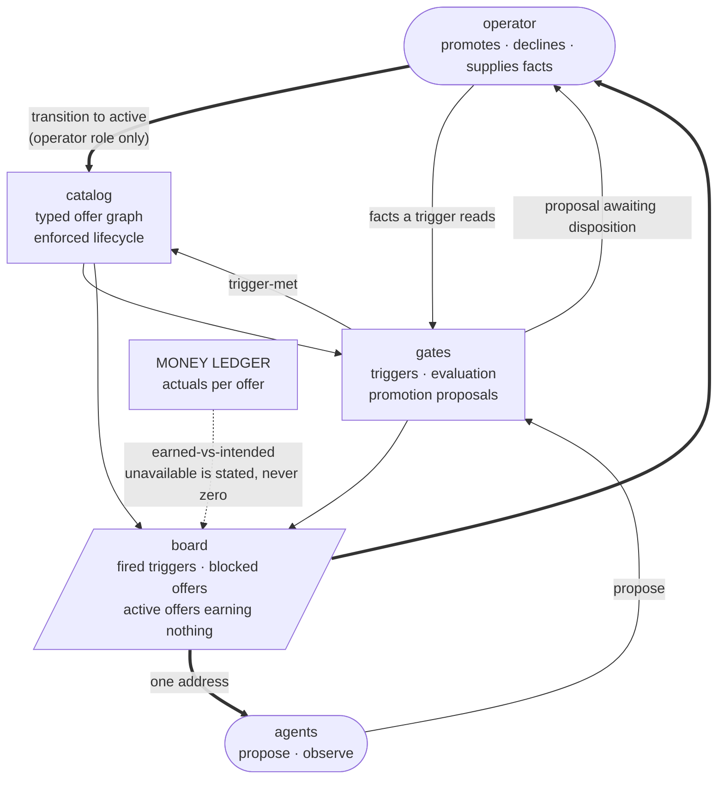
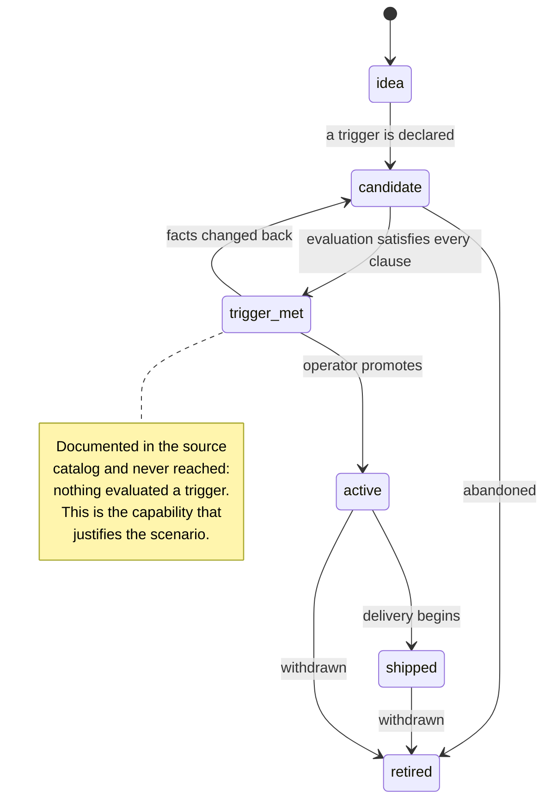

# Flows — Offer Desk

This document is the canonical workflow and state-transition map for
the scenario. Use it when behavior depends on ordered states, retries,
cancellation, stale completion, background jobs, polling, or mutually
exclusive UI modes.

## Purpose Of This Document

Use this document to answer:

- Which user/system workflows matter?
- Which workflows have explicit states and events?
- Which transitions are illegal?
- Which tests prove workflow correctness?
- Which flows are known but not modeled yet?

Plain CRUD with no meaningful ordering constraints does not need a
workflow model.

## Flow Inventory

`health` is a stateless reporting domain and ships no workflows. List
each real stateful flow your domains add below, with its owner, trigger,
outcome, statefulness, and validation level.

| Flow | Domain | Trigger | Outcome | Statefulness | Validation |
|---|---|---|---|---|---|
| Transition an offer | catalog | An API call from an agent or operator. | A new status plus an audit entry, or a typed refusal. | Refusal leaves state unchanged; no partial transitions. | L2 |
| Evaluate triggers | gates | Schedule, or a manual run. | Satisfied candidates move to `trigger-met`; unknown facts are reported. | Idempotent — re-running changes nothing. | L2 |
| Propose and dispose a promotion | gates | An agent proposes; an operator disposes. | A node reaches `active`, or the proposal is declined with a reason. | Proposal survives restarts; only an operator role can complete it. | L2 |
| Import the source catalog | catalog | One-time operator-run migration. | Nodes, edges, triggers, and findings for every unresolvable reference. | Per-file counts verified before any source deletion. | L1 |

## Flow Details

Document each real flow here with its owner domain, trigger, inputs,
ordered steps, outputs, failure modes, retry/cancel behavior, tests, and
generated subpackages. The worked example below shows the expected shape.

### Flow — transition an offer

**Owner:** `catalog`. **Trigger:** an API call.

1. The service loads the node and its current status.
2. The requested transition is checked against the declared adjacency.
3. An illegal transition is refused with an error naming the rule and the transitions that would be legal from here. State is unchanged.
4. A legal transition writes the new status and its audit entry in one transaction.

**Why a refusal rather than a warning:** the replaced documents described this lifecycle accurately and could enforce nothing. A rule that cannot refuse is a requirement waiting for a home.

### Flow — evaluate triggers

**Owner:** `gates`. **Trigger:** schedule or manual run.

1. Collect every node in `candidate` with a declared trigger.
2. Resolve each trigger's named facts against the fact registry.
3. Evaluate: all clauses satisfied → transition to `trigger-met`, recording which fact satisfied which clause. Any clause unsatisfied → no change. Any fact **missing → unknown**, no change, and the run reports the missing fact.
4. The run records what it examined, so a quiet run is distinguishable from one that did not happen.

**The unknown rule is the important one.** Treating a missing fact as false would let every candidate sleep indefinitely while the run reported success — reproducing the failure this scenario was built to end, with a green light on top.

### Flow — propose and dispose a promotion

**Owner:** `gates`. **Trigger:** an agent proposes; an operator disposes.

An agent-role caller may create a proposal carrying its rationale and the evidence it read. Only an operator-role call transitions the node to `active`. The proposal is durable and carries its proposing actor, so a disposition weeks later still shows who asked and why.

### Flow — import the source catalog

**Owner:** `catalog`. **Trigger:** a one-time operator-run migration.

Reads the source markdown tree, extracts only fields with a state or a lifecycle — status, trigger, identifier, membership — and writes them through the ordinary state machine. Judgment prose (hypothesis, positioning, value proposition, portfolio role) is **not** imported; it stays where it belongs.

The importer reports per source file how many records it read and how many it wrote, and fails loudly on a mismatch. Every unresolvable reference becomes a finding attached to the imported node.

**Ordering rule, absolute:** import, verify counts, *then* delete sources. The source files are the importer's only input; removing them first destroys it.

## State Machines

List each modeled flow's states, illegal transitions, and how they are
enforced. Plain CRUD with no ordering constraints does not appear here.

| Domain/Flow | States | Illegal Transitions | Enforcement |
|---|---|---|---|
| catalog / node | `idea → candidate → trigger-met → active → shipped → retired` | Any skip forward except `idea → candidate`; any move out of `retired`; any transition into `active` from a non-operator role. | Service-level adjacency check plus a role check on the `active` edge. |
| gates / trigger | `declared → { satisfied, unsatisfied, unknown }` | `unknown → satisfied` without a resolved fact. | Evaluation resolves facts before comparing; a missing fact short-circuits to unknown. |
| gates / proposal | `proposed → { accepted, declined }` | `accepted → proposed`; acceptance by a non-operator role. | Role check on disposition; terminal states are immutable. |

## Maturity Ladder

Temporal workflows mature in layers. Do not skip the executable layers
to add a standalone formal document.

| Level | Name | What exists |
|---|---|---|
| 0 | Unmodeled risk | Lifecycle behavior exists only inside handlers, components, callbacks, or jobs. |
| 1 | Inventory | The flow is listed here with owner, source links, risk, and next step. |
| 2 | Workflow model | State/status values, event values, `Transition`, and `CheckInvariants` live beside the owning domain or feature. |
| 3 | Matrix + traces | Tests cover every state/event pair and replay representative traces against production transition logic. |
| 4 | Declarative contract | A domain-local `*.flow.json` declares states, events, transitions, invariants, and named traces. |
| 5 | Checked formal model | Quint/TLA+ or an equivalent tool is generated from the contract, checked, and replayed by production tests. |

## Production Shape

Three (Go) or four (UI) files per flow at the top of the feature folder,
plus one `generated/` sibling. Everything in `generated/` is codegen output.

Every flow lives in a `flow/` subdirectory next to its consumer with
conventional file names. API domains that own durable lifecycle state use:

```text
api/internal/<domain>/
  flow/
    flow.json                   # hand: source of truth (schema v6)
    transition.go               # hand: wrapper (package flow)
    flow_test.go                # hand: thin replay delegation (package flow)
    generated/
      model.qnt
      artifact.json
      runtime.go                # package generated
      replay.go
```

UI features that own client-side modes use:

```text
ui/src/features/<domain>/
  flow/
    flow.json                   # hand: source of truth (schema v6)
    transition.ts               # hand: wrapper
    fixtures.ts                 # hand: replay fixtures
    flow.test.ts                # hand: thin replay delegation
    generated/
      model.qnt
      artifact.json
      runtime.ts
      replay.helper.ts
```

Every flow uses the same file names. The `flow/` directory IS the unit;
the contract no longer declares any output paths or module names.

The workflow owns state/status values, events, `Transition`, and
`CheckInvariants`. It should be pure or nearly pure. Effects live
outside the workflow behind seams: repositories, BlobStore, clocks,
timers, HTTP clients, or UI API modules.

The `*.flow.json` contract is the source of truth. Level 5 generated
Quint models, formal artifacts, and Go/TypeScript declarations are
checked-in source artifacts for reviewability, but they are refreshed
and checked by the `flow-verifier` scenario CLI; the
scenario lifecycle runs `make temporal-models` (which calls
`flow-verifier verify check`) before the normal test
suite. A Quint file by itself is not accepted: the model must typecheck,
test, verify named invariants, emit deterministic artifacts, and those
artifacts must replay against the production Go/TypeScript transition
functions.

The generated declarations keep state/event topology and formal
freshness metadata out of hand-maintained test lists. They also provide
pure status-transition helpers generated from the `*.flow.json`
transition matrix. For TypeScript flows, the same declarations can own
the discriminated state/event union shape and replay fixture contract.
Production workflow wrappers call those helpers for abstract validity
and next-status outcomes, while keeping payload validation, side-effect
orchestration, and rich state construction in hand-authored code. API
replay tests get expected paths, hashes, invariants, and generated checks
from `generated/<folder>/runtime.go`; UI replay tests import the same metadata
from `generated/<folder>/runtime.ts`. The generated `replay.{go,helper.ts}`
files own the assertion calls; the hand-authored top-level test simply binds
the wrapper's transition function and the fixtures and invokes
`RunReplay`/`runFormalReplay` once.

Formal artifacts use schema v6 coverage metadata. Matrix completeness,
terminal transition checks, named trace coverage, and generated MBT trace
coverage are separate fields. Do not treat generated trace
`allPairsCovered` as required proof of correctness; replay tests require
the complete transition matrix and named traces, while generated trace
coverage reports how much the model explorer happened to visit.

Schema v6 `flow.json` files carry no path or module information. The
`replay` block declares only `transition.function` (plus
`transition.statusAccessor` for TS or `transition.stateType` /
`transition.statusField` for Go). Everything else is derived from the
flow directory.

Go flows emit `flow/generated/replay.go` and require a hand-authored
`flow/flow_test.go` (package `flow`) that calls `generated.RunReplay`.
TypeScript flows emit `flow/generated/replay.helper.ts` and require a
hand-authored `flow/flow.test.ts` that calls
`runFormalReplay({ transition, fixtures })` at module top level.
`flow-verifier verify check` byte-compares every generated file and runs an
AST-level lint over the hand-authored test, so a silent bypass — missing
import, stubbed transition, or call buried inside a guarded block —
fails the check.

To scaffold a new flow:

```bash
flow-verifier flows new ui/src/features/<feature> --flow-id <flow-id> --lang ts --root .
flow-verifier flows new api/internal/<domain>     --flow-id <flow-id> --lang go --root .
```

The scaffold writes the hand-authored files and immediately runs
`generate`, so `check` is green from the moment it returns.

To add or rename a state/event:

1. Edit the owning `*.flow.json`.
2. Regenerate that flow with `flow-verifier verify run --flow <flow-id>`.
3. Update only payload-specific wrapper branches that need new runtime
   data; the abstract transition table is generated.
4. Update the UI replay fixture module. The generated formal replay fixture
   interface should make missing state/event fixtures a type error.
5. Run `make temporal-models` and the scenario tests.

## How The Pieces Fit Together

This scenario is one of two that replaced a hand-maintained plan of record. It holds **what should be sold**; its sibling, **Money Ledger**, holds **what actually happened**. The division is the useful part: neither can say "this offer is active and has earned nothing" alone.



Two properties this drawing exists to make obvious. **The path to `active` runs only through the operator** — agents reach it through a proposal and never directly. And **the board owns nothing**: every entry is derived, so it cannot go stale, and a source it cannot read becomes a visible availability entry rather than a missing row.

### The lifecycle, and the state nothing could reach



## Cross-References

- [`DOMAINS.md`](DOMAINS.md) — owning domain map
- [`DATA.md`](DATA.md) — persisted state and retention
- [`../internal/SEAMS.md`](../internal/SEAMS.md) — side-effect boundaries
- [`../internal/TESTING.md`](../internal/TESTING.md#temporal-workflow-tests) — matrix and trace testing
