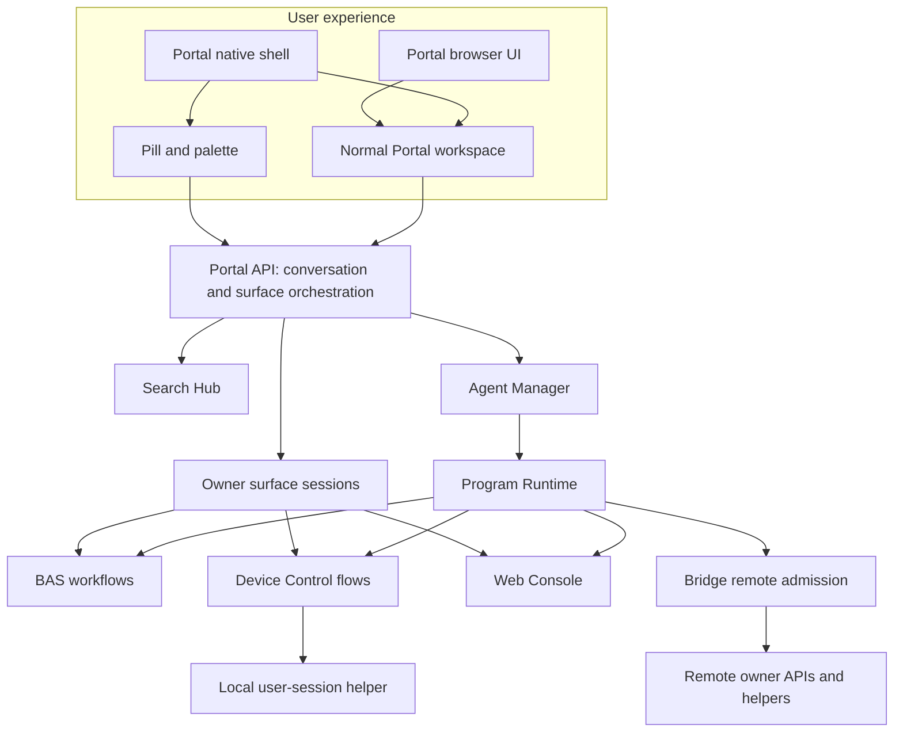
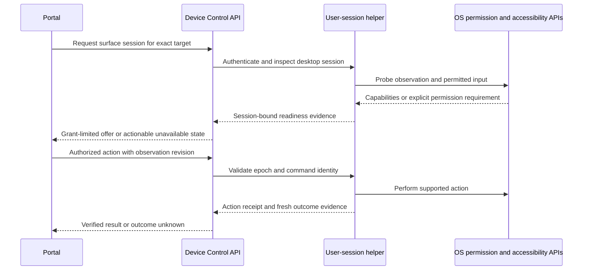
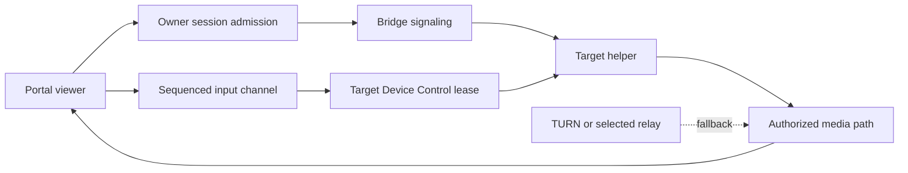
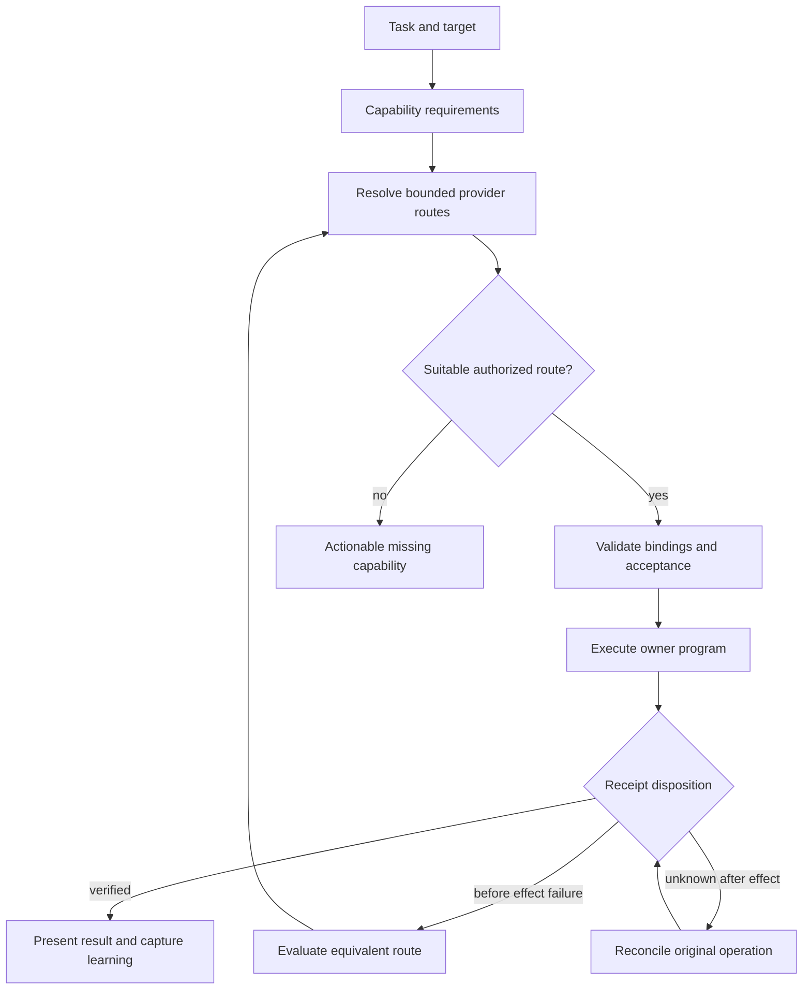
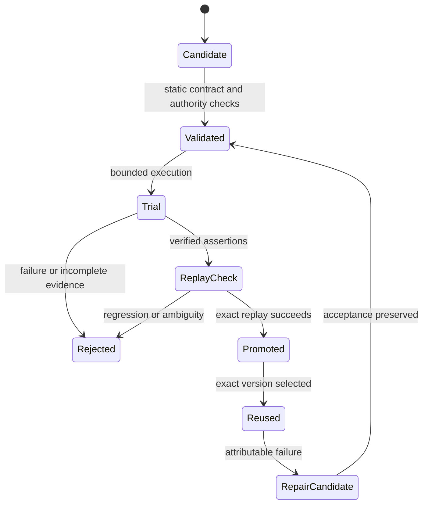
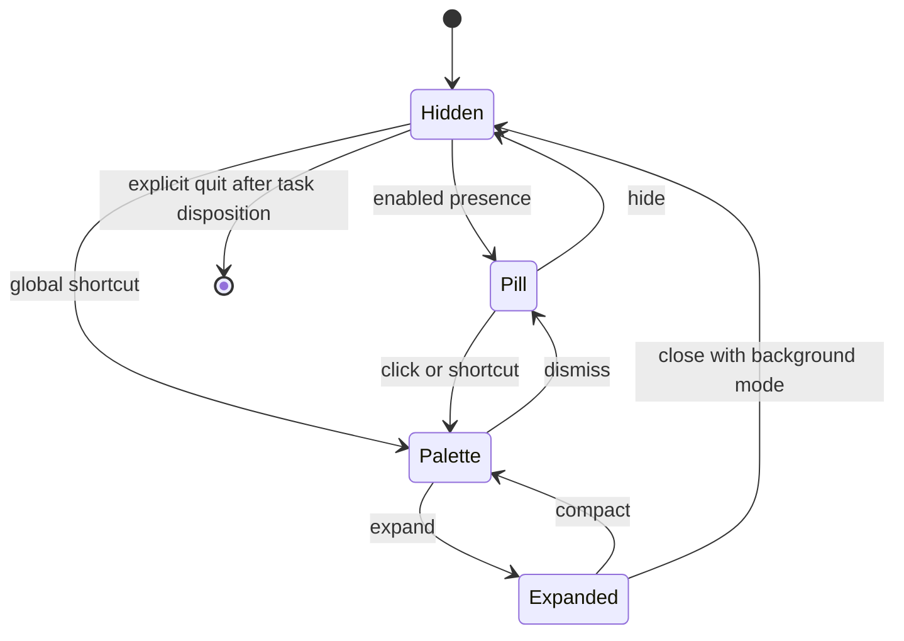
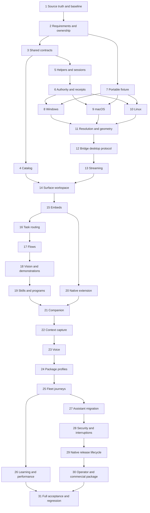

### Architecture decision and rationale

Portal owns the user's conversation and workspace. Device Control owns desktop and device execution. Bridge owns remote identity, topology, admission, and transport. BAS owns browser automation. Web Console owns terminal sessions. Program Runtime owns governed composition. Scenario-to-Desktop owns native packaging and the extension contract.

The native companion lives under scenarios/portal/desktop/ as source and configuration. It is built through Scenario-to-Desktop. Its expanded renderer uses the ordinary Portal application. Compact modes select presentation, not an alternative backend or second conversation database.



### Existing-versus-proposed placement

| Location | State | Responsibility after implementation |
|---|---|---|
| scenarios/portal/api/internal/chat/ | Existing | Conversation and attachment state. |
| scenarios/portal/api/internal/integrations/ | Existing | Optional readiness and provider adapters. |
| scenarios/portal/api/internal/surfaces/ | Proposed | Surface projection and owner-session orchestration. |
| scenarios/portal/api/internal/taskrouting/ | Proposed | Task requirements and authorized provider-route selection. |
| scenarios/portal/ui/src/features/ | Existing | Normal workspace plus reusable compact presentation components. |
| scenarios/portal/desktop/ | Proposed | Native shell configuration, activation, capture affordances. |
| scenarios/device-control/api/strategy/hostdesktop/ | Existing | Desktop adapter entrypoint; delegates native operations to helpers. |
| scenarios/device-control/native/ | Proposed | OS-specific user-session helper implementations. |
| scenarios/device-control/api/internal/control/ | Existing | Flow execution, validation, promotion, and state. |
| scenarios/vrooli-bridge/api/ | Existing | Typed desktop session admission and remote transport extension. |
| packages/api-core/targetmodel/ | Existing | Shared target/readiness semantics, not an inventory store. |
| packages/proto/schemas/common/ | Existing namespace; new messages proposed | Neutral target/surface/session references where cross-owner reuse is proven. |
| packages/iframe-bridge/ | Existing | Authenticated embedding handshake and bounded context/shortcut intents. |
| packages/ui-surfaces/ | Proposed only when two consumers need it | Shared target picker and surface-host presentation components. |
| scenarios/scenario-to-desktop/templates/vanilla/ | Existing | Generic extension hooks and secure native shell. |
| scenarios/scenario-to-desktop/api/livedesktop/ | Existing | Validation-session orchestration, not production desktop ownership. |

Directory names are concrete implementation proposals. Reconcile them with current domain conventions before adding files. Keep domain rules transport-independent and register real seams in owner SEAMS.md files. Extract shared packages only for demonstrated consumers.

### Target, surface, and session contracts

A target is an identity. A surface is an offered capability. A session is time-bounded access. One Bridge machine can expose a desktop, terminal, several scenario views, and attached devices. A device can expose multiple transports without becoming multiple devices.

A safe reference has owner namespace, owner resource ID, host-node relation, and optional desktop-session identity. Concrete transport URLs and credentials stay server-side. Do not overload the existing terminal admission predicate into universal surface admission: its current local-target shortcut is not proof of desktop readiness.

Proposed wire sketch, to implement through canonical proto tooling:

```proto
message TargetRef {
  string owner_scenario = 1;
  string resource_id = 2;
  string host_node_id = 3;
}
message SurfaceRef {
  TargetRef target = 1;
  string owner_scenario = 2;
  string surface_id = 3;
}
message CapabilityFact {
  string capability = 1;
  string state = 2; // implement enum: ready/missing/unsupported/unknown/denied
  string reason_code = 3;
  string evidence_ref = 4;
  int64 observed_at_unix_ms = 5;
}
message SurfaceDescriptor {
  SurfaceRef ref = 1;
  string kind = 2; // scenario, terminal, desktop, browser, device-panel
  repeated CapabilityFact capabilities = 3;
  repeated string protocol_versions = 4;
  string display_label = 5;
}
```

Use existing readiness enum values where semantics match. Separate permission-denied and unsupported facts without silently changing old consumers. Add versioned conversion tests between shared domain types, owner messages, and UI projection.

Owner operation proposals:

| Operation | Owner | Outcome |
|---|---|---|
| ListSurfaces | Provider; Portal aggregates | Safe descriptors with explicit partial-source status. |
| DescribeSurface | Provider | Current capabilities and session prerequisites. |
| OpenSession | Provider through Bridge when remote | Authorized session identity and bounded connection offer. |
| Observe | Device Control | Semantic snapshot and/or image artifact reference. |
| Resolve | Device Control | Element match, ambiguity, or unavailable evidence. |
| Act | Device Control | Receipt for one validated command identity. |
| WatchSession | Provider | Ordered progress/state updates. |
| TransferControl | Device Control | New control epoch; prior inputs rejected. |
| StopSession | Provider | Input release and terminal lifecycle receipt. |

Adapt existing services rather than duplicating methods with equivalent semantics. Manual control sessions and flow execution acquire the same exclusion mechanism.

### Native session boundary

A system service is not a logged-in desktop. The Device Control API coordinates with a helper running in the intended user session. The helper authenticates local IPC and checks the bound user/session before native action. UI windows never directly receive raw helper authority.



Implement Windows UI Automation and native input/capture, macOS Accessibility and ScreenCaptureKit, and Linux AT-SPI plus named X11/Wayland backends. Evaluate Terminator for Windows in a bounded adapter spike. Its adoption is conditional on capability, maintenance, packaging, license, and conformance evidence. No project becomes a dependency merely because its README resembles this plan.

Native probing must distinguish installed helper, running helper, interactive session, permission grant, capture success, input capability, and semantic capability. Permission prompts belong to the local user session. Do not silently unlock machines or elevate privileges.

### Control session invariants

| ID | Invariant | Enforcement owner |
|---|---|---|
| INV-01 | An action names the authorized target and desktop session. | Device Control session admission. |
| INV-02 | Only the current control epoch may actuate. | Target helper and control service. |
| INV-03 | Duplicate command identity cannot blindly duplicate effects. | Durable receipt store and helper reconciliation. |
| INV-04 | Stale geometry cannot authorize an unrelated click. | Observation/action validation. |
| INV-05 | Stop releases held input and invalidates queued control. | Helper and lease service. |
| INV-06 | Lost transport does not imply action failure. | Run/session state machine. |
| INV-07 | Screen content cannot expand authority. | Task router and destination enforcement. |
| INV-08 | Remote content cannot call native shell APIs. | Electron preload/IPC boundary. |
| INV-09 | Provider absence cannot prevent Portal startup. | Composition root and readiness registry. |
| INV-10 | Promoted flows retain independently checked outcomes. | Device Control/BAS promotion services. |
| INV-11 | The companion host is distinct from the Portal API host. | Companion attestation and target projection. |
| INV-12 | Terminal and desktop protocols cannot be confused. | Bridge typed protocol admission. |

At-most-once side effects cannot be promised across every OS crash boundary. Persist command admission and receipt state, reconcile uncertain execution, and return outcome_unknown when certainty is unavailable. A durable ID is necessary but does not make an external GUI action transactional.

### Observation and input examples

Proposed input envelope:

```json
{
  "sessionId": "session-example",
  "controlEpoch": 7,
  "commandId": "task-example-step-4",
  "sequence": 12,
  "observationRef": "observation-example",
  "geometryRevision": "display-layout-3",
  "action": {
    "kind": "invoke",
    "element": {"applicationId": "fixture.editor", "role": "button", "name": "Export"}
  }
}
```

Persist screenshot metadata: display ID, desktop-session ID, capture time, logical and physical dimensions, origin, scale, rotation, crop rectangle, and source revision. Coordinates refer to that metadata. Annotation transforms must survive palette expansion and remote viewing.

Semantic resolution returns zero, one, or multiple matches. Zero means absent; multiple means ambiguous. A unique label alone is insufficient across several windows. Combine application identity, window selector, role, name, stable automation ID, and required state.

Use bounded event-driven waits where adapters provide events. Use bounded polling only when a capability declares that fallback. Never add fixed sleeps as the normal correctness mechanism.

### Interactive streaming

Bridge retains control-plane admission and signaling ownership. Device Control owns desktop capture and input interpretation. Terminal framing remains compatible with its existing contract.

Evaluate WebRTC against the current Bridge stream transport using the same workload. Record LAN/WAN latency, relay bandwidth, CPU, frame freshness, reconnection, deployment cost, and revocation behavior. Select transport through an ADR before the streaming phase closes. Do not leave streaming as an indefinite experiment.

Default proposal: WebRTC video with authenticated signaling and a separate reliable control/session channel. Provide a bounded screenshot fallback for low-bandwidth observation. Clearly label fallback; do not claim interactive-video parity.



Revocation must close already-established media and input channels, not merely block new sessions. Use short-lived session credentials, refresh checks, and a target-side stop path. Disable automatic clipboard, audio, and file transfer by default; expose them as separate capabilities.

### Optional-provider planning

Portal's task orchestration uses a typed capability requirement and provider-route model. Providers are optional to the application but may be mandatory to a particular task. Readiness is time-bounded observation, not a permanent guarantee.

| State | UI response | Execution response |
|---|---|---|
| ready + authorized | Enable action. | Bind exact provider/version/target. |
| absent | Explain install option. | Return missing_capability before side effects. |
| stopped | Offer lifecycle recovery. | Follow owner recovery if already authorized. |
| unhealthy | Show reason and retained task. | Pause or choose a validated equivalent route. |
| unsupported | Show supported targets/capabilities. | Refuse that route. |
| denied | Show required grant. | Request only missing authority. |
| unknown/stale | Show checking state. | Probe within a deadline. |
| lost after side effect | Show reconciling state. | Query original receipt before retry or fallback. |

A fallback must preserve destination, account, data residency, authorization, requested outcome, and acceptance checks. A remote BAS session is not equivalent to the user's logged-in browser by default. A local desktop route does not substitute for a task explicitly targeting Office PC.



Bound reconciliation attempts and return an actionable unresolved state when certainty cannot be established. The diagram describes state transitions, not an unbounded loop.

### Programs and learned procedures

Keep BAS and Device Control workflow schemas. Add desktop-specific primitives to Device Control's schema where existing semantics do not suffice. Program Runtime composes typed bindings across owners. Portal exposes authoring and task progress without executing private control logic.

Proposed Portal programs, names to validate through the owner's registration mechanism:

| Program | Effect | Responsibility |
|---|---|---|
| portal.prepare-task | Read | Resolve request target, required capabilities, and candidate routes. |
| portal.do-task | Governed orchestration | Invoke a selected registered program with exact inputs. |
| portal.author-task | Bounded authoring | Construct and validate a composition candidate. |
| portal.observe-task | Read | Reconcile durable receipts and present bounded status. |
| portal.setpoint-read | Read | Measure readiness, verified task success, friction, and comparable reuse. |

Do not add wrappers for single operations when a typed CLI binding already suffices. Final program inventory should earn each program with a repeated workflow. All contracts declare allowed bindings, effects, materialization limits, execution/inference budgets, failure classes, and fixture evidence.

A desktop authoring path may start from demonstration, semantic exploration, vision exploration, or generated governed code. Promotion requires a complete run, explicit assertions, compatibility constraints, and a successful replay. Repair preserves the acceptance contract. An edited assertion requires a separately reviewed change in task meaning.



Generated code receives only governed bindings in Program Runtime. A separately authorized unrestricted coding task is a distinct mode and cannot inherit desktop session grants implicitly. Static validation is not proof of sandbox containment.

### Native companion and ordinary UI parity

The companion offers hidden, pill, palette, and expanded states. The expanded state mounts the normal Portal workspace. Shared state includes conversation ID, active branch, target/surface references, context attachments, and active run IDs. Never create an independent companion chat store.



Capture active-window and pointer context before focusing Portal. Context capture is a bounded request, not ambient surveillance. Selected text is optional and may be unavailable. Ask the user to select a target when pointer hit-testing is ambiguous.

Suggested compact wireframe:

```text
+------------------------------------------------------+
| Vrooli                         This machine v        |
| What would you like to do?                           |
| [Window: Editor] [Selected region] [Add context]      |
|                                                      |
| Recent: Export report | Continue Office PC task       |
| [Voice] [Capture]                         [Expand]    |
+------------------------------------------------------+
```

Expanded layout:

```text
+------------------+-------------------------+-------------------+
| Targets          | Conversation            | Surface workspace |
| This machine     | Request + context       | Desktop / Scenario|
|   Desktop        | Plan and approvals      | Terminal / Browser|
|   Terminal       | Progress and results    | Device controls   |
| Office PC        |                         |                   |
|   Phone          |                         | Stop / Take over  |
+------------------+-------------------------+-------------------+
```

Use shared component assets and Portal design conventions. Validate keyboard navigation, screen-reader labels, reduced motion, zoom, focus restoration, multi-monitor positioning, shortcut conflicts, and permission-denied journeys. Keep machine labels visible during remote control.

### Native extension contract

Add a versioned extension mechanism to Scenario-to-Desktop. Portal owns configuration and narrow modules. The ramp owns schema validation, build integration, signing, updates, helper packaging, and compatibility checks.

Illustrative configuration, not currently implemented schema:

```json
{
  "schemaVersion": 1,
  "application": "portal",
  "desktop": {
    "extensionContract": "vrooli.desktop.v1",
    "entry": "desktop/companion.ts",
    "presentationModes": ["pill", "palette", "expanded"],
    "features": ["global-shortcut", "tray", "context-capture", "annotation-overlay"],
    "renderer": {"useScenarioUI": true, "nativeAccess": "trusted-shell-only"},
    "helperProviders": [{"owner": "device-control", "capability": "desktop.session"}]
  },
  "profiles": {
    "portal-client": {"optionalProviders": ["browser-automation-studio", "device-control", "audio-tools"]},
    "portal-local-control": {"requiredProviders": ["device-control"], "optionalProviders": ["audio-tools", "browser-automation-studio"]},
    "portal-automation": {"requiredProviders": ["device-control", "program-runtime"], "optionalProviders": ["browser-automation-studio", "audio-tools"]}
  }
}
```

Profiles describe product intent, not a parallel dependency-governance format. Map them into the existing ramp and dependency contracts. A required provider must be bundled or supplied by a verified configured endpoint; it cannot be missing silently. The client profile must still boot with no control provider.

Use trusted packaged shell code, contextIsolation, renderer sandboxing, disabled Node integration, narrow IPC methods, sender validation, and navigation policy. Scenario embeds receive no native privileges. Context capsules and session offers use bounded opaque references. A hostile embedded scenario must not forge a capture, grant, or native action.

### Authentication, privacy, and recovery

Grants bind actor, target, desktop session, capabilities, allowed effects, expiry, and policy revision. Forward identity through existing authentication owners. Never place owner tokens into iframe URLs, surface descriptors, screenshots, logs, or program output envelopes.

Local IPC authenticates the requesting API and validates the peer/session identity. OS-granted accessibility or capture permission does not replace application authorization. Bridge connectivity grants do not authorize every desktop action.

Persist resumable session/run metadata and bounded receipts. Keep raw capture retention configurable with conservative defaults. Use existing secret and artifact owners. Record redacted evidence references; do not make screenshots permanent learning records.

Pause when the user takes control. Resume only after reconciling foreground state, observation revision, and authority. On helper crash, release or expire the lease and reject prior epochs after restart. On app quit, explain whether tasks continue or stop; honor the selected disposition.

### Learning and performance targets

User-visible speed includes orientation, target discovery, workflow selection, inference, first action, and verified completion. Instrument each stage independently. Tag cold/warm, local/remote, semantic/vision, and reused/new execution cohorts.

| Metric | Proposed acceptance target | Measurement |
|---|---|---|
| Warm palette activation | p95 <= 200 ms | Shortcut receipt to visible interactive palette, 50 trials per primary environment. |
| Cached suggestions | p95 <= 150 ms | Query change to local cached suggestions, 50 trials. |
| Known local flow first action | p95 <= 1000 ms | Authorized dispatch to first owner action, fixed fixture, 30 trials. |
| Local stop admission | p95 <= 250 ms | Stop input to target epoch invalidation, 50 trials. |
| Remote stop admission | p95 <= 1000 ms at <=100 ms RTT | Stop to target receipt, 30 trials; network-loss expiry tested separately. |
| Interactive LAN viewing | p95 frame age <= 300 ms | Capture-to-display timestamps with measured clock uncertainty. |
| WAN viewing | p95 frame age <= 800 ms at declared 100 ms RTT/10 Mbps | Same fixed 1080p fixture and explicit encoding settings. |
| Reused task orientation effort | Median tool round trips at least 50% below fresh-authoring cohort | Fixed corpus; equal success gates; >=20 paired task runs. |
| Verified deterministic corpus | 100% required cases pass | Owner assertion receipts. |
| Adaptive holdout corpus | >=90% verified completion over >=30 declared tasks | Fixed budget, platform mix, explicit failures and denominators. |

These are proposed product budgets, not historical measurements. Record hardware, versions, test provenance, sample count, failures, and quantile method. Do not silently relax targets; record a product tradeoff for review if a target proves infeasible. AI provider latency is reported separately from native overhead. Synthetic tests prove benchmarks, not causal improvement in operator usage.

### Commercial package and migration

Position the product around verified repeatable work across owned machines. Treat audience and pricing as hypotheses until validated. Deliver a capability/support matrix, three recorded customer journeys, installation guide, privacy explanation, support diagnostics, model/relay cost model, packaging profile comparison, and draft pricing/positioning.

Do not invent customer interviews or willingness-to-pay evidence. Public outreach and paid infrastructure need authority. Produce reviewable research instruments and internal usability results when external participants are unavailable.

Migrate old Assistant issue capture into Portal context capture plus existing reporting/agent owners. Export useful old records and reconcile counts and identifiers. Preserve the old store until reviewed migration evidence permits retirement. Remove obsolete runtime, commands, and documentation only after the replacement journey passes.

### Unresolved choices with decision gates

| Choice | Decision gate | Required evidence |
|---|---|---|
| Native helper language and third-party adapter reuse | Before platform adapter implementation | Build/sign/package spike and fixture conformance per candidate. |
| WebRTC versus existing relay for media | Before streaming completion | LAN/WAN measurements, revocation, cost, compatibility. |
| Exact shared surface package location | Before second consumer migration | Existing package search and two concrete consumers. |
| Exact supported OS/compositor versions | Phase 1 | Available hosts plus explicit primary support matrix. |
| Optional profile dependency resolution | Before packaged companion acceptance | Fresh-machine installs and absent-provider runs. |
| Production signing and public release | Final release review | Credentials/authority plus deployment-manager evidence. |

These gates authorize ordinary engineering choices within the stated outcome. They do not authorize dropping platforms, redefining success, or silently changing the owner architecture.


### Phase dependency map

The numbered phase list is the default sequential execution order. The following graph explains prerequisites, not authorization to delegate or skip phases.



### Concrete implementation navigation

Use the current named files below as starting points. Proposed domains are described in the placement table; do not create a duplicate when an existing owner already provides the operation.

| Work | Existing starting point |
|---|---|
| Portal catalog integration | scenarios/portal/api/internal/integrations/ and docs/concepts/DOMAINS.md |
| Shared target admission | packages/api-core/targetmodel/model.go and capability_test.go |
| Web Console projection | scenarios/web-console/api/target_catalog.go and remote_targets.go |
| Desktop platform adapter | scenarios/device-control/api/strategy/hostdesktop/hostdesktop.go |
| Optional strategy interfaces | scenarios/device-control/api/strategy/contract.go |
| Saved flow owner | scenarios/device-control/api/internal/control/library.go |
| Browser promotion invariant | scenarios/browser-automation-studio/api/handlers/workflows/promotion.go |
| Bridge frame contract | packages/proto/schemas/vrooli-bridge/v1/session/session.proto |
| Bridge short relay | packages/proto/schemas/vrooli-bridge/v1/relay/relay.proto |
| Attached device topology | packages/proto/schemas/vrooli-bridge/v1/attached_devices/attached_devices.proto |
| Native shell generator | scenarios/scenario-to-desktop/templates/vanilla/main.ts and preload.ts |
| Validation harness boundary | scenarios/scenario-to-desktop/api/livedesktop/platform.go and platform_other.go |
| Existing embedding contract | packages/iframe-bridge/src/iframeBridgeChild.ts |
| Learning payload | packages/proto/schemas/vrooli-memory/v1/learning/learning.proto |
| Governed contract schema | scenarios/program-runtime/schemas/program-contract.schema.json |

Prefix these repository-relative navigation paths with /home/matthalloran8/Vrooli/. The source manifest supplies absolute paths for preserved inspected inputs. Phase references point to absolute existing code and documents.
