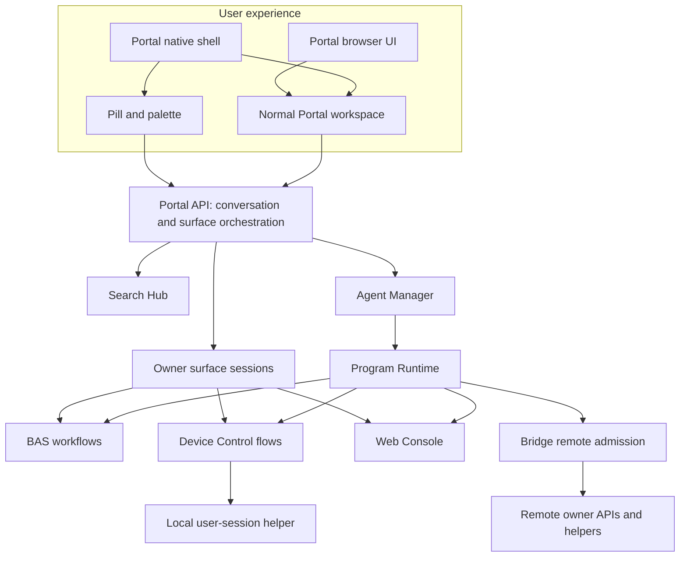
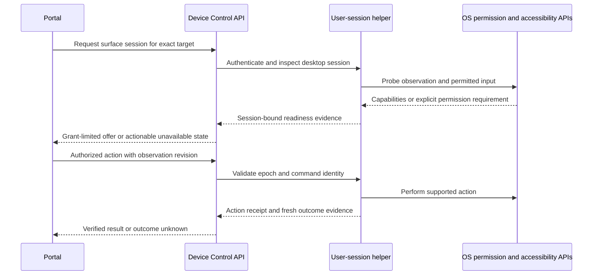
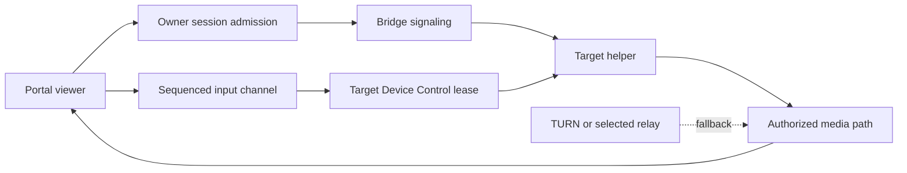
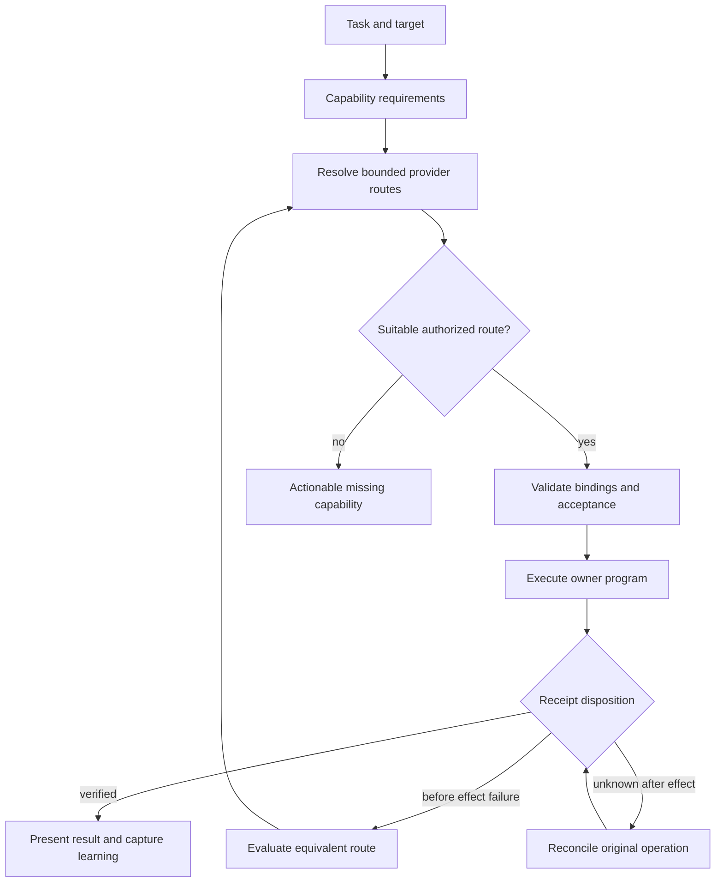
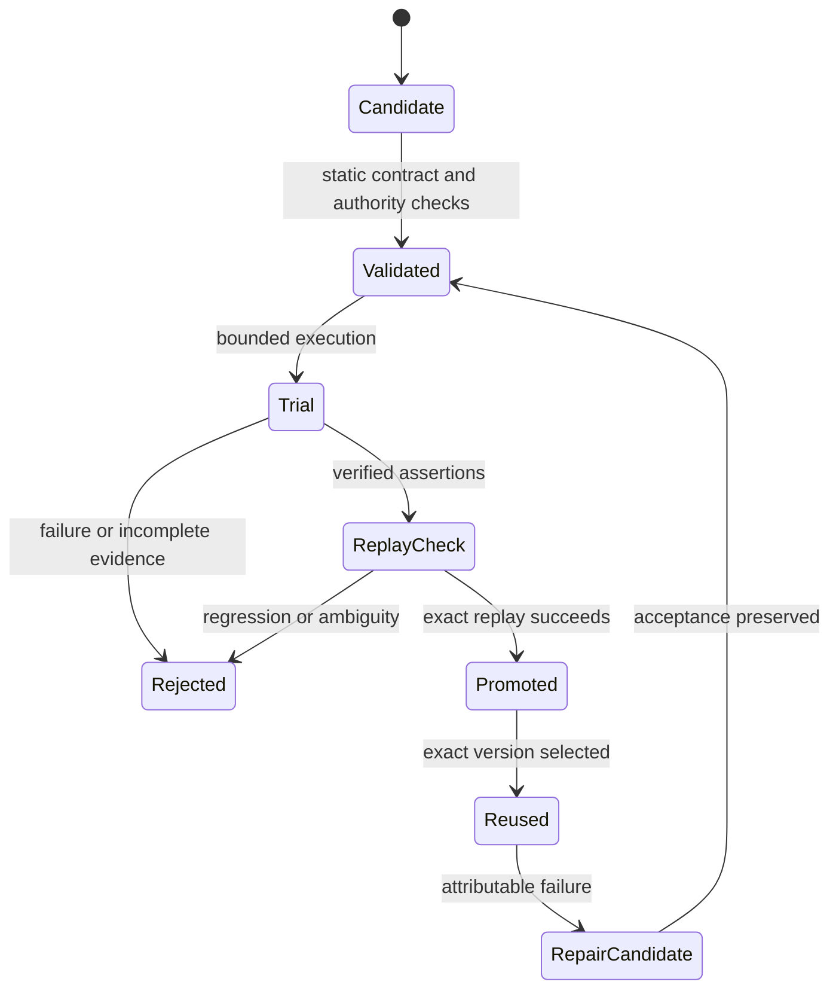
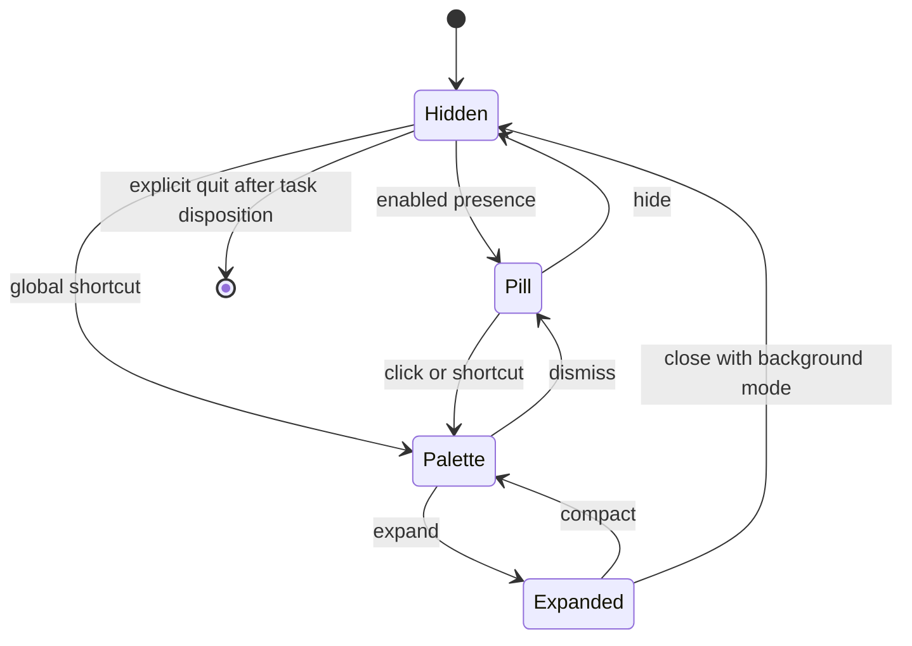
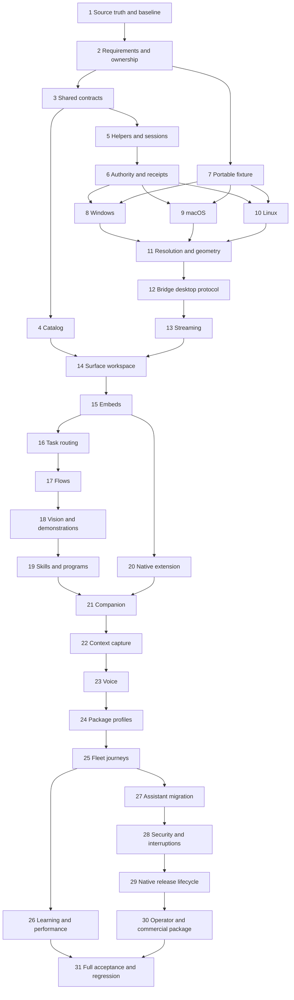

<!-- plan-manager:mirror id=4a78c13b-1b69-4ffc-b767-85cbf06bca47 slug=portal-everywhere-native-companion-portable-desktop-control -->

# Portal Everywhere: native companion, portable desktop control, and governed cross-target automation

> Status: **draft** · content-hash `54f79fa8c1cc`

## Purpose

Make Vrooli a dependable interface for working across applications, desktops, browsers, and connected devices. Convert repeated agent orientation and exploratory interaction into verified, reusable capability. Deliver one Portal experience in the browser and native companion, with honest optional-provider behavior and portable execution. Without this work, users remain split across tools, repeated requests pay repeated discovery costs, and desktop or remote-control claims can outpace actual permissions, recovery behavior, and platform evidence.

## Definitions

| Term | Meaning |
|---|---|
| Companion | Portal's packaged native shell with pill, palette, and expanded presentation states. |
| Target | An owner-resolved execution destination, identified independently from a transport address. |
| Surface | An offered view or interaction capability associated with a target. |
| Session | A temporary observation or control relationship bound to actor, target, desktop user session, and authority. |
| Desktop helper | Device Control's native process running in an intended user desktop session. |
| Control epoch | A monotonically changed generation that invalidates input from prior control holders. |
| Observation revision | An identity for observed state and display geometry used to detect stale action references. |
| Provider route | A resolved capability owner and execution location with verified prerequisites. |
| Candidate flow | An unpromoted proposed procedure awaiting outcome verification and replay evidence. |
| Surface host | Portal's renderer for owner-provided interactive surfaces and controls. |
| Context capsule | Bounded captured references and provenance attached to a request, including annotations and source geometry. |
| Product acceptance corpus | The fixed, versioned set of real user journeys required by this plan. |
| Support row | One named OS, architecture, desktop environment, package profile, and capability combination with evidence status. |

## Problem

The operator began with a concrete friction: an agent takes too long to identify a TV, understand its controls, inspect state, and perform an ordinary action. The desired improvement concerns agent orientation, tool round trips, visual reasoning, and repeated workflow discovery—not only backend execution time.

The deployment-manager skill/program pattern motivated analogous BAS and Device Control improvements. Those earlier changes introduced reusable, versioned workflows, guarded promotion, outcome capture, and measurable learning. This plan extends that pattern to the whole desktop and the ecosystem entry point.

The old vrooli-assistant describes a hotkey overlay for issue capture and agent spawning. It does not constitute a current portable desktop-control product. Initial discussion considered rewriting it as a separate desktop automation engine. Subsequent inspection found existing host-desktop ownership in Device Control. The selected design therefore migrates useful Assistant UX into Portal and extends Device Control instead of duplicating its execution model.

### Current evidence and limits

| Area | Inspected fact | Consequence |
|---|---|---|
| Portal | Chat, agentchat, search, completion, and readiness domains exist. | Extend existing features and retain conversation state. |
| Portal deferred domains | Scenario embeds and voice are deferred in DOMAINS.md. | Deliver them here; do not assume completion. |
| Device Control | host-desktop uses DISPLAY/import/xdotool on Linux and screencapture/osascript on macOS. | Replace weak probes and extend native capabilities. |
| Desktop input | Current host adapter accepts pointer events only. | Keyboard, text, drag, semantic actions, and session targeting require implementation. |
| Windows | Current host-desktop explicitly reports unavailable. | Deliver a real native adapter and live Windows evidence. |
| Readiness | Executable discovery currently contributes to release-grade declarations. | Executable presence cannot prove permissions or successful interaction. |
| Shared targets | api-core/targetmodel already separates transport, trust, readiness, and capabilities. | Extend existing semantics instead of creating a second inventory. |
| Web Console | TargetCatalogService and machine/device projections exist. | Share contracts and proven UI pieces; retain terminal ownership. |
| Bridge | Attached-device records and sequenced interactive frames exist. | Reuse topology and transport; add desktop semantics explicitly. |
| Bridge stream | Open/Resize currently contain terminal-specific fields. | Preserve terminal behavior while adding typed desktop sessions. |
| Desktop ramp | Vanilla Electron includes tray/native plumbing. | Add a governed extension contract instead of copying templates. |
| Live desktop harness | scenario-to-desktop/api/livedesktop provides Linux validation sessions; non-Linux backend is unavailable. | Reuse test facilities without making them the production desktop engine. |
| Skills | Portal has no scenario-owned skills directory in this inspection. | Build its usage and improvement setup with real sensors. |

These are source observations at authoring time. They are not live acceptance results. Earlier conversation reported BAS/Device Control validation; that report is historical context, not a fresh regression oracle. Recheck mutable sources before implementation.

Related Plan Manager records are preserved in related-plans.json. Reuse Portal v0's implemented chat/readiness foundation, existing terminal sizing/session invariants, desktop packaging work, and Bridge enrollment work. Do not infer implementation from draft/active status. Read phase evidence and last activity. This plan extends those capabilities; it does not blindly reexecute their old tasks.

## Outcome

A user can open Portal in a browser or packaged companion, select an actual target and surface, interact manually, or ask an agent to complete a task. The expanded companion is the normal Portal UI. Pill, palette, and expanded states preserve the same conversation, attachments, target, and run identity.

Device Control provides verified desktop observation and interaction on Windows, macOS, and named Linux environments. Bridge carries authorized remote access without duplicating desktop semantics. BAS and Web Console retain browser and terminal ownership. Portal composes those capabilities through typed operations and governed programs.

A missing optional provider leaves Portal functional and explains the affected action. A remote provider can satisfy a task only when the selected route preserves target, account, authority, data policy, and intended outcome. Provider failure after an action never causes blind duplicate execution.

The exact same saved desktop flow can execute through Portal, the native companion, and CLI. A fresh task can use bounded semantic/vision exploration, produce a candidate, verify acceptance, and promote a version. Reuse measurably reduces exploration for a fixed task corpus without weakening outcome checks.

The final product includes native delivery evidence, authorization and stop behavior, accessibility, recovery, support diagnostics, optional packaging profiles, commercial claims tied to tested support, and a migration for old Assistant issue capture. Full implementation includes all numbered phases and mandatory acceptance cases; an attractive mockup or Linux-only demo does not satisfy this outcome.

## Approach & Decisions

### Architecture decision and rationale

Portal owns the user's conversation and workspace. Device Control owns desktop and device execution. Bridge owns remote identity, topology, admission, and transport. BAS owns browser automation. Web Console owns terminal sessions. Program Runtime owns governed composition. Scenario-to-Desktop owns native packaging and the extension contract.

The native companion lives under scenarios/portal/desktop/ as source and configuration. It is built through Scenario-to-Desktop. Its expanded renderer uses the ordinary Portal application. Compact modes select presentation, not an alternative backend or second conversation database.



### Existing-versus-proposed placement

| Location | State | Responsibility after implementation |
|---|---|---|
| scenarios/portal/api/internal/chat/ | Existing | Conversation and attachment state. |
| scenarios/portal/api/internal/integrations/ | Existing | Optional readiness and provider adapters. |
| scenarios/portal/api/internal/surfaces/ | Proposed | Surface projection and owner-session orchestration. |
| scenarios/portal/api/internal/taskrouting/ | Proposed | Task requirements and authorized provider-route selection. |
| scenarios/portal/ui/src/features/ | Existing | Normal workspace plus reusable compact presentation components. |
| scenarios/portal/desktop/ | Proposed | Native shell configuration, activation, capture affordances. |
| scenarios/device-control/api/strategy/hostdesktop/ | Existing | Desktop adapter entrypoint; delegates native operations to helpers. |
| scenarios/device-control/native/ | Proposed | OS-specific user-session helper implementations. |
| scenarios/device-control/api/internal/control/ | Existing | Flow execution, validation, promotion, and state. |
| scenarios/vrooli-bridge/api/ | Existing | Typed desktop session admission and remote transport extension. |
| packages/api-core/targetmodel/ | Existing | Shared target/readiness semantics, not an inventory store. |
| packages/proto/schemas/common/ | Existing namespace; new messages proposed | Neutral target/surface/session references where cross-owner reuse is proven. |
| packages/iframe-bridge/ | Existing | Authenticated embedding handshake and bounded context/shortcut intents. |
| packages/ui-surfaces/ | Proposed only when two consumers need it | Shared target picker and surface-host presentation components. |
| scenarios/scenario-to-desktop/templates/vanilla/ | Existing | Generic extension hooks and secure native shell. |
| scenarios/scenario-to-desktop/api/livedesktop/ | Existing | Validation-session orchestration, not production desktop ownership. |

Directory names are concrete implementation proposals. Reconcile them with current domain conventions before adding files. Keep domain rules transport-independent and register real seams in owner SEAMS.md files. Extract shared packages only for demonstrated consumers.

### Target, surface, and session contracts

A target is an identity. A surface is an offered capability. A session is time-bounded access. One Bridge machine can expose a desktop, terminal, several scenario views, and attached devices. A device can expose multiple transports without becoming multiple devices.

A safe reference has owner namespace, owner resource ID, host-node relation, and optional desktop-session identity. Concrete transport URLs and credentials stay server-side. Do not overload the existing terminal admission predicate into universal surface admission: its current local-target shortcut is not proof of desktop readiness.

Proposed wire sketch, to implement through canonical proto tooling:

```proto
message TargetRef {
  string owner_scenario = 1;
  string resource_id = 2;
  string host_node_id = 3;
}
message SurfaceRef {
  TargetRef target = 1;
  string owner_scenario = 2;
  string surface_id = 3;
}
message CapabilityFact {
  string capability = 1;
  string state = 2; // implement enum: ready/missing/unsupported/unknown/denied
  string reason_code = 3;
  string evidence_ref = 4;
  int64 observed_at_unix_ms = 5;
}
message SurfaceDescriptor {
  SurfaceRef ref = 1;
  string kind = 2; // scenario, terminal, desktop, browser, device-panel
  repeated CapabilityFact capabilities = 3;
  repeated string protocol_versions = 4;
  string display_label = 5;
}
```

Use existing readiness enum values where semantics match. Separate permission-denied and unsupported facts without silently changing old consumers. Add versioned conversion tests between shared domain types, owner messages, and UI projection.

Owner operation proposals:

| Operation | Owner | Outcome |
|---|---|---|
| ListSurfaces | Provider; Portal aggregates | Safe descriptors with explicit partial-source status. |
| DescribeSurface | Provider | Current capabilities and session prerequisites. |
| OpenSession | Provider through Bridge when remote | Authorized session identity and bounded connection offer. |
| Observe | Device Control | Semantic snapshot and/or image artifact reference. |
| Resolve | Device Control | Element match, ambiguity, or unavailable evidence. |
| Act | Device Control | Receipt for one validated command identity. |
| WatchSession | Provider | Ordered progress/state updates. |
| TransferControl | Device Control | New control epoch; prior inputs rejected. |
| StopSession | Provider | Input release and terminal lifecycle receipt. |

Adapt existing services rather than duplicating methods with equivalent semantics. Manual control sessions and flow execution acquire the same exclusion mechanism.

### Native session boundary

A system service is not a logged-in desktop. The Device Control API coordinates with a helper running in the intended user session. The helper authenticates local IPC and checks the bound user/session before native action. UI windows never directly receive raw helper authority.



Implement Windows UI Automation and native input/capture, macOS Accessibility and ScreenCaptureKit, and Linux AT-SPI plus named X11/Wayland backends. Evaluate Terminator for Windows in a bounded adapter spike. Its adoption is conditional on capability, maintenance, packaging, license, and conformance evidence. No project becomes a dependency merely because its README resembles this plan.

Native probing must distinguish installed helper, running helper, interactive session, permission grant, capture success, input capability, and semantic capability. Permission prompts belong to the local user session. Do not silently unlock machines or elevate privileges.

### Control session invariants

| ID | Invariant | Enforcement owner |
|---|---|---|
| INV-01 | An action names the authorized target and desktop session. | Device Control session admission. |
| INV-02 | Only the current control epoch may actuate. | Target helper and control service. |
| INV-03 | Duplicate command identity cannot blindly duplicate effects. | Durable receipt store and helper reconciliation. |
| INV-04 | Stale geometry cannot authorize an unrelated click. | Observation/action validation. |
| INV-05 | Stop releases held input and invalidates queued control. | Helper and lease service. |
| INV-06 | Lost transport does not imply action failure. | Run/session state machine. |
| INV-07 | Screen content cannot expand authority. | Task router and destination enforcement. |
| INV-08 | Remote content cannot call native shell APIs. | Electron preload/IPC boundary. |
| INV-09 | Provider absence cannot prevent Portal startup. | Composition root and readiness registry. |
| INV-10 | Promoted flows retain independently checked outcomes. | Device Control/BAS promotion services. |
| INV-11 | The companion host is distinct from the Portal API host. | Companion attestation and target projection. |
| INV-12 | Terminal and desktop protocols cannot be confused. | Bridge typed protocol admission. |

At-most-once side effects cannot be promised across every OS crash boundary. Persist command admission and receipt state, reconcile uncertain execution, and return outcome_unknown when certainty is unavailable. A durable ID is necessary but does not make an external GUI action transactional.

### Observation and input examples

Proposed input envelope:

```json
{
  "sessionId": "session-example",
  "controlEpoch": 7,
  "commandId": "task-example-step-4",
  "sequence": 12,
  "observationRef": "observation-example",
  "geometryRevision": "display-layout-3",
  "action": {
    "kind": "invoke",
    "element": {"applicationId": "fixture.editor", "role": "button", "name": "Export"}
  }
}
```

Persist screenshot metadata: display ID, desktop-session ID, capture time, logical and physical dimensions, origin, scale, rotation, crop rectangle, and source revision. Coordinates refer to that metadata. Annotation transforms must survive palette expansion and remote viewing.

Semantic resolution returns zero, one, or multiple matches. Zero means absent; multiple means ambiguous. A unique label alone is insufficient across several windows. Combine application identity, window selector, role, name, stable automation ID, and required state.

Use bounded event-driven waits where adapters provide events. Use bounded polling only when a capability declares that fallback. Never add fixed sleeps as the normal correctness mechanism.

### Interactive streaming

Bridge retains control-plane admission and signaling ownership. Device Control owns desktop capture and input interpretation. Terminal framing remains compatible with its existing contract.

Evaluate WebRTC against the current Bridge stream transport using the same workload. Record LAN/WAN latency, relay bandwidth, CPU, frame freshness, reconnection, deployment cost, and revocation behavior. Select transport through an ADR before the streaming phase closes. Do not leave streaming as an indefinite experiment.

Default proposal: WebRTC video with authenticated signaling and a separate reliable control/session channel. Provide a bounded screenshot fallback for low-bandwidth observation. Clearly label fallback; do not claim interactive-video parity.



Revocation must close already-established media and input channels, not merely block new sessions. Use short-lived session credentials, refresh checks, and a target-side stop path. Disable automatic clipboard, audio, and file transfer by default; expose them as separate capabilities.

### Optional-provider planning

Portal's task orchestration uses a typed capability requirement and provider-route model. Providers are optional to the application but may be mandatory to a particular task. Readiness is time-bounded observation, not a permanent guarantee.

| State | UI response | Execution response |
|---|---|---|
| ready + authorized | Enable action. | Bind exact provider/version/target. |
| absent | Explain install option. | Return missing_capability before side effects. |
| stopped | Offer lifecycle recovery. | Follow owner recovery if already authorized. |
| unhealthy | Show reason and retained task. | Pause or choose a validated equivalent route. |
| unsupported | Show supported targets/capabilities. | Refuse that route. |
| denied | Show required grant. | Request only missing authority. |
| unknown/stale | Show checking state. | Probe within a deadline. |
| lost after side effect | Show reconciling state. | Query original receipt before retry or fallback. |

A fallback must preserve destination, account, data residency, authorization, requested outcome, and acceptance checks. A remote BAS session is not equivalent to the user's logged-in browser by default. A local desktop route does not substitute for a task explicitly targeting Office PC.



Bound reconciliation attempts and return an actionable unresolved state when certainty cannot be established. The diagram describes state transitions, not an unbounded loop.

### Programs and learned procedures

Keep BAS and Device Control workflow schemas. Add desktop-specific primitives to Device Control's schema where existing semantics do not suffice. Program Runtime composes typed bindings across owners. Portal exposes authoring and task progress without executing private control logic.

Proposed Portal programs, names to validate through the owner's registration mechanism:

| Program | Effect | Responsibility |
|---|---|---|
| portal.prepare-task | Read | Resolve request target, required capabilities, and candidate routes. |
| portal.do-task | Governed orchestration | Invoke a selected registered program with exact inputs. |
| portal.author-task | Bounded authoring | Construct and validate a composition candidate. |
| portal.observe-task | Read | Reconcile durable receipts and present bounded status. |
| portal.setpoint-read | Read | Measure readiness, verified task success, friction, and comparable reuse. |

Do not add wrappers for single operations when a typed CLI binding already suffices. Final program inventory should earn each program with a repeated workflow. All contracts declare allowed bindings, effects, materialization limits, execution/inference budgets, failure classes, and fixture evidence.

A desktop authoring path may start from demonstration, semantic exploration, vision exploration, or generated governed code. Promotion requires a complete run, explicit assertions, compatibility constraints, and a successful replay. Repair preserves the acceptance contract. An edited assertion requires a separately reviewed change in task meaning.



Generated code receives only governed bindings in Program Runtime. A separately authorized unrestricted coding task is a distinct mode and cannot inherit desktop session grants implicitly. Static validation is not proof of sandbox containment.

### Native companion and ordinary UI parity

The companion offers hidden, pill, palette, and expanded states. The expanded state mounts the normal Portal workspace. Shared state includes conversation ID, active branch, target/surface references, context attachments, and active run IDs. Never create an independent companion chat store.



Capture active-window and pointer context before focusing Portal. Context capture is a bounded request, not ambient surveillance. Selected text is optional and may be unavailable. Ask the user to select a target when pointer hit-testing is ambiguous.

Suggested compact wireframe:

```text
+------------------------------------------------------+
| Vrooli                         This machine v        |
| What would you like to do?                           |
| [Window: Editor] [Selected region] [Add context]      |
|                                                      |
| Recent: Export report | Continue Office PC task       |
| [Voice] [Capture]                         [Expand]    |
+------------------------------------------------------+
```

Expanded layout:

```text
+------------------+-------------------------+-------------------+
| Targets          | Conversation            | Surface workspace |
| This machine     | Request + context       | Desktop / Scenario|
|   Desktop        | Plan and approvals      | Terminal / Browser|
|   Terminal       | Progress and results    | Device controls   |
| Office PC        |                         |                   |
|   Phone          |                         | Stop / Take over  |
+------------------+-------------------------+-------------------+
```

Use shared component assets and Portal design conventions. Validate keyboard navigation, screen-reader labels, reduced motion, zoom, focus restoration, multi-monitor positioning, shortcut conflicts, and permission-denied journeys. Keep machine labels visible during remote control.

### Native extension contract

Add a versioned extension mechanism to Scenario-to-Desktop. Portal owns configuration and narrow modules. The ramp owns schema validation, build integration, signing, updates, helper packaging, and compatibility checks.

Illustrative configuration, not currently implemented schema:

```json
{
  "schemaVersion": 1,
  "application": "portal",
  "desktop": {
    "extensionContract": "vrooli.desktop.v1",
    "entry": "desktop/companion.ts",
    "presentationModes": ["pill", "palette", "expanded"],
    "features": ["global-shortcut", "tray", "context-capture", "annotation-overlay"],
    "renderer": {"useScenarioUI": true, "nativeAccess": "trusted-shell-only"},
    "helperProviders": [{"owner": "device-control", "capability": "desktop.session"}]
  },
  "profiles": {
    "portal-client": {"optionalProviders": ["browser-automation-studio", "device-control", "audio-tools"]},
    "portal-local-control": {"requiredProviders": ["device-control"], "optionalProviders": ["audio-tools", "browser-automation-studio"]},
    "portal-automation": {"requiredProviders": ["device-control", "program-runtime"], "optionalProviders": ["browser-automation-studio", "audio-tools"]}
  }
}
```

Profiles describe product intent, not a parallel dependency-governance format. Map them into the existing ramp and dependency contracts. A required provider must be bundled or supplied by a verified configured endpoint; it cannot be missing silently. The client profile must still boot with no control provider.

Use trusted packaged shell code, contextIsolation, renderer sandboxing, disabled Node integration, narrow IPC methods, sender validation, and navigation policy. Scenario embeds receive no native privileges. Context capsules and session offers use bounded opaque references. A hostile embedded scenario must not forge a capture, grant, or native action.

### Authentication, privacy, and recovery

Grants bind actor, target, desktop session, capabilities, allowed effects, expiry, and policy revision. Forward identity through existing authentication owners. Never place owner tokens into iframe URLs, surface descriptors, screenshots, logs, or program output envelopes.

Local IPC authenticates the requesting API and validates the peer/session identity. OS-granted accessibility or capture permission does not replace application authorization. Bridge connectivity grants do not authorize every desktop action.

Persist resumable session/run metadata and bounded receipts. Keep raw capture retention configurable with conservative defaults. Use existing secret and artifact owners. Record redacted evidence references; do not make screenshots permanent learning records.

Pause when the user takes control. Resume only after reconciling foreground state, observation revision, and authority. On helper crash, release or expire the lease and reject prior epochs after restart. On app quit, explain whether tasks continue or stop; honor the selected disposition.

### Learning and performance targets

User-visible speed includes orientation, target discovery, workflow selection, inference, first action, and verified completion. Instrument each stage independently. Tag cold/warm, local/remote, semantic/vision, and reused/new execution cohorts.

| Metric | Proposed acceptance target | Measurement |
|---|---|---|
| Warm palette activation | p95 <= 200 ms | Shortcut receipt to visible interactive palette, 50 trials per primary environment. |
| Cached suggestions | p95 <= 150 ms | Query change to local cached suggestions, 50 trials. |
| Known local flow first action | p95 <= 1000 ms | Authorized dispatch to first owner action, fixed fixture, 30 trials. |
| Local stop admission | p95 <= 250 ms | Stop input to target epoch invalidation, 50 trials. |
| Remote stop admission | p95 <= 1000 ms at <=100 ms RTT | Stop to target receipt, 30 trials; network-loss expiry tested separately. |
| Interactive LAN viewing | p95 frame age <= 300 ms | Capture-to-display timestamps with measured clock uncertainty. |
| WAN viewing | p95 frame age <= 800 ms at declared 100 ms RTT/10 Mbps | Same fixed 1080p fixture and explicit encoding settings. |
| Reused task orientation effort | Median tool round trips at least 50% below fresh-authoring cohort | Fixed corpus; equal success gates; >=20 paired task runs. |
| Verified deterministic corpus | 100% required cases pass | Owner assertion receipts. |
| Adaptive holdout corpus | >=90% verified completion over >=30 declared tasks | Fixed budget, platform mix, explicit failures and denominators. |

These are proposed product budgets, not historical measurements. Record hardware, versions, test provenance, sample count, failures, and quantile method. Do not silently relax targets; record a product tradeoff for review if a target proves infeasible. AI provider latency is reported separately from native overhead. Synthetic tests prove benchmarks, not causal improvement in operator usage.

### Commercial package and migration

Position the product around verified repeatable work across owned machines. Treat audience and pricing as hypotheses until validated. Deliver a capability/support matrix, three recorded customer journeys, installation guide, privacy explanation, support diagnostics, model/relay cost model, packaging profile comparison, and draft pricing/positioning.

Do not invent customer interviews or willingness-to-pay evidence. Public outreach and paid infrastructure need authority. Produce reviewable research instruments and internal usability results when external participants are unavailable.

Migrate old Assistant issue capture into Portal context capture plus existing reporting/agent owners. Export useful old records and reconcile counts and identifiers. Preserve the old store until reviewed migration evidence permits retirement. Remove obsolete runtime, commands, and documentation only after the replacement journey passes.

### Unresolved choices with decision gates

| Choice | Decision gate | Required evidence |
|---|---|---|
| Native helper language and third-party adapter reuse | Before platform adapter implementation | Build/sign/package spike and fixture conformance per candidate. |
| WebRTC versus existing relay for media | Before streaming completion | LAN/WAN measurements, revocation, cost, compatibility. |
| Exact shared surface package location | Before second consumer migration | Existing package search and two concrete consumers. |
| Exact supported OS/compositor versions | Phase 1 | Available hosts plus explicit primary support matrix. |
| Optional profile dependency resolution | Before packaged companion acceptance | Fresh-machine installs and absent-provider runs. |
| Production signing and public release | Final release review | Credentials/authority plus deployment-manager evidence. |

These gates authorize ordinary engineering choices within the stated outcome. They do not authorize dropping platforms, redefining success, or silently changing the owner architecture.


### Phase dependency map

The numbered phase list is the default sequential execution order. The following graph explains prerequisites, not authorization to delegate or skip phases.



### Concrete implementation navigation

Use the current named files below as starting points. Proposed domains are described in the placement table; do not create a duplicate when an existing owner already provides the operation.

| Work | Existing starting point |
|---|---|
| Portal catalog integration | scenarios/portal/api/internal/integrations/ and docs/concepts/DOMAINS.md |
| Shared target admission | packages/api-core/targetmodel/model.go and capability_test.go |
| Web Console projection | scenarios/web-console/api/target_catalog.go and remote_targets.go |
| Desktop platform adapter | scenarios/device-control/api/strategy/hostdesktop/hostdesktop.go |
| Optional strategy interfaces | scenarios/device-control/api/strategy/contract.go |
| Saved flow owner | scenarios/device-control/api/internal/control/library.go |
| Browser promotion invariant | scenarios/browser-automation-studio/api/handlers/workflows/promotion.go |
| Bridge frame contract | packages/proto/schemas/vrooli-bridge/v1/session/session.proto |
| Bridge short relay | packages/proto/schemas/vrooli-bridge/v1/relay/relay.proto |
| Attached device topology | packages/proto/schemas/vrooli-bridge/v1/attached_devices/attached_devices.proto |
| Native shell generator | scenarios/scenario-to-desktop/templates/vanilla/main.ts and preload.ts |
| Validation harness boundary | scenarios/scenario-to-desktop/api/livedesktop/platform.go and platform_other.go |
| Existing embedding contract | packages/iframe-bridge/src/iframeBridgeChild.ts |
| Learning payload | packages/proto/schemas/vrooli-memory/v1/learning/learning.proto |
| Governed contract schema | scenarios/program-runtime/schemas/program-contract.schema.json |

Prefix these repository-relative navigation paths with /home/matthalloran8/Vrooli/. The source manifest supplies absolute paths for preserved inspected inputs. Phase references point to absolute existing code and documents.

### Decisions

_Pinned at plan time; do not relitigate during execution._

- **D1 — Execution ownership:** Extend Device Control desktop strategies and flows; do not create another desktop-control engine in Portal or Assistant.
- **D2 — Native product:** Put the companion source/configuration in scenarios/portal/desktop/ and build it through Scenario-to-Desktop.
- **D3 — UI parity:** Mount the ordinary Portal workspace in expanded mode; compact modes share conversation and task state.
- **D4 — Remote boundary:** Keep remote identity/admission/transport in Bridge and native action interpretation in Device Control.
- **D5 — Target model:** Extend api-core/targetmodel and owner proto contracts instead of creating another authoritative inventory.
- **D6 — Optional dependencies:** Keep providers optional at startup; enforce task-specific prerequisites before side effects.
- **D7 — Workflow composition:** Reuse BAS and Device Control flows; use Program Runtime for cross-owner composition.
- **D8 — Native extension:** Add a versioned ramp extension contract rather than forking the vanilla Electron template.
- **D9 — Validation ownership:** Keep Scenario-to-Desktop live-desktop facilities as test orchestration; use Device Control for production interaction.
- **D10 — Migration:** Replace old Assistant capture through Portal and current owners; preserve data until reconciliation permits retirement.
- **D11 — Evidence:** Require real primary-platform receipts, full regression comparison, and fixed-corpus outcome checks.
- **D12 — Commercial claims:** Treat pricing and demand as hypotheses; tie support and speed claims to measured evidence.

## Boundaries

### Scope

Deliver target and surface contracts, Portal catalog and workspace, native companion, desktop helpers, semantic and visual automation, Bridge desktop sessions, screen streaming, optional-provider routing, cross-owner programs, voice/context capture, workflow learning, native packaging, old Assistant migration, validation, operational documentation, and commercial readiness artifacts.

Extend Portal, Device Control, Bridge, Web Console, BAS, Scenario-to-Desktop, Program Runtime, and their shared contracts where required. Integrate existing Audio Tools, Search Hub, Agent Manager, Memory, onboarding, authentication, secrets, compute, and deployment owners. Repair blocking seams in those owners when the current phase requires them. Record boundary extensions before validating new scope.

Preserve terminal, browser, device, existing chat, and deployment behaviors through owner tests. Preserve useful user data during Assistant migration. The implementation may remove obsolete code after replacement journeys and data reconciliation pass.

Deliver Windows x64, macOS arm64, Linux x64 X11, and Linux x64 GNOME/KDE Wayland acceptance rows. Add macOS x64 and Windows arm64 build/test rows where toolchains and hosts exist; mark unverified architectures explicitly. The four primary environment families cannot be silently dropped. Freeze exact OS/build/compositor versions during phase 1 and carry them into support claims.

Develop release candidates and a concrete launch package. Public publishing, customer messaging, paid compute purchases, credential enrollment, and irreversible data deletion require applicable operator authority. Lack of that authority does not excuse unfinished local engineering or reviewable artifacts.

### Non-Goals

Universal control of every application, display server, protected OS surface, or unattended locked session is not promised.
Replacing Bridge enrollment, BAS workflows, Web Console PTYs, Memory, Agent Manager, or Scenario Dependency Analyzer is excluded.
Building an unrestricted remote shell disguised as desktop automation is excluded.
Always-on ambient screen/audio recording is excluded from the default product.
A second Portal conversation store inside the companion is excluded.
A second production desktop-control engine inside Scenario-to-Desktop or vrooli-assistant is excluded.
A third-party workflow marketplace and billing-platform rewrite are excluded; deliver interoperable flow references and a reviewable commercial package.
A new general-purpose workflow language is excluded; extend existing owner contracts and Program Runtime.
Public launch execution is excluded unless separately authorized. Release candidate validation and launch readiness are included.

### Constraints

Use Plan Manager for phase state, validation, deviations, and completion.
Read implementation-plan-execution before starting implementation.
Preserve unrelated worktree changes and concurrent work.
Read current AGENTS.md and applicable scenario instructions before edits.
Manage scenario lifecycle through the control plane or scenario Makefiles.
Install dependencies only through Scenario Dependency Analyzer.
Keep host setup and remediation in the control plane.
Keep native execution and leases in Device Control.
Keep remote identity and routing in Bridge.
Keep conversations and surface presentation in Portal.
Keep native packaging and extension validation in Scenario-to-Desktop.
Keep domain rules in APIs; keep UI and CLI as typed clients.
Use source-owned proto schemas and regenerate their clients.
Treat incoming screenshots, app text, and iframe messages as untrusted data.
Enforce authority at the destination before observation or action.
Separate observation grants from input grants and consequential-action grants.
Reuse existing authorization; request only missing authority.
Do not promote a flow without attributable verified acceptance and replay evidence.
Do not weaken assertions during repair.
Do not report missing samples as zero failures or measured speedup.
Do not classify a disconnected action as failed until its outcome is reconciled.
Run server-owned tests and attach through the documented wait once.
Do not hand-edit generated requirement snapshots, evidence receipts, or rendered plan mirrors.
Keep human-readable diagnostics free of credentials and raw private context.
Bound memory, frame queues, execution budgets, and inference loops.
Preserve app identity, target identity, and desktop-session identity separately.

### Prohibited Approaches

Do not fork the vanilla Electron template into a private Portal template.
Do not expose generic exec, filesystem, Electron, or native automation objects to embedded content.
Do not tunnel desktop events through shell command strings or terminal resize fields.
Do not perform actuation in Portal's UI, API orchestration, or program prose.
Do not duplicate a device because it has multiple transports.
Do not equate API-server locality with the companion's local machine.
Do not treat a machine heartbeat as desktop readiness.
Do not select the lowest-ID machine to resolve an ambiguous user target.
Do not use arbitrary coordinates without an observation and geometry binding.
Do not substitute public customer systems for isolated acceptance fixtures.
Do not leave required platform rows skipped and call the overall plan complete.
Do not replace current-vs-baseline comparison with a source diff or coverage percentage.
Do not turn paid setup, privilege escalation, or public release into automatic fallback.

### Work Posture

- Posture: **greenfield**
- Source: default
- Detail: Maturity for affected scenario(s) agent-manager, audio-tools, browser-automation-studio, compute-manager, deployment-manager, device-control, device-sync-hub, portal, program-runtime, scenario-authenticator, scenario-to-desktop, search-hub, secrets-manager, tunnel-manager, vrooli-assistant, vrooli-bridge, vrooli-memory, vrooli-onboarding, web-console could not be read; defaulting to greenfield.

**This is greenfield work.** Do not include compatibility shims, legacy wrappers, dead code, unused re-exports, `// removed` comments, or renamed `_unused` variables.

### Change Boundary

**Acceptance allow:**
- `cmd/vrooli/**`
- `docs/**`
- `internal/**`
- `packages/api-base/**`
- `packages/api-core/scopecatalog/**`
- `packages/api-core/targetmodel/**`
- `packages/capabilityprobe/**`
- `packages/cli-core/**`
- `packages/desktop-contract/**`
- `packages/iframe-bridge/**`
- `packages/proto/gen/go/agent-manager/**`
- `packages/proto/gen/go/audio-tools/**`
- `packages/proto/gen/go/browser-automation-studio/**`
- `packages/proto/gen/go/common/**`
- `packages/proto/gen/go/compute-manager/**`
- `packages/proto/gen/go/deployment-manager/**`
- `packages/proto/gen/go/device-control/**`
- `packages/proto/gen/go/device-sync-hub/**`
- `packages/proto/gen/go/portal/**`
- `packages/proto/gen/go/program-runtime/**`
- `packages/proto/gen/go/scenario-authenticator/**`
- `packages/proto/gen/go/scenario-to-desktop/**`
- `packages/proto/gen/go/search-hub/**`
- `packages/proto/gen/go/secrets-manager/**`
- `packages/proto/gen/go/tunnel-manager/**`
- `packages/proto/gen/go/vrooli-assistant/**`
- `packages/proto/gen/go/vrooli-bridge/**`
- `packages/proto/gen/go/vrooli-memory/**`
- `packages/proto/gen/go/vrooli-onboarding/**`
- `packages/proto/gen/go/web-console/**`
- `packages/proto/gen/manifests/agent-manager.lock.json`
- `packages/proto/gen/manifests/audio-tools.lock.json`
- `packages/proto/gen/manifests/browser-automation-studio.lock.json`
- `packages/proto/gen/manifests/compute-manager.lock.json`
- `packages/proto/gen/manifests/deployment-manager.lock.json`
- `packages/proto/gen/manifests/device-control.lock.json`
- `packages/proto/gen/manifests/device-sync-hub.lock.json`
- `packages/proto/gen/manifests/portal.lock.json`
- `packages/proto/gen/manifests/program-runtime.lock.json`
- `packages/proto/gen/manifests/scenario-authenticator.lock.json`
- `packages/proto/gen/manifests/scenario-to-desktop.lock.json`
- `packages/proto/gen/manifests/search-hub.lock.json`
- `packages/proto/gen/manifests/secrets-manager.lock.json`
- `packages/proto/gen/manifests/tunnel-manager.lock.json`
- `packages/proto/gen/manifests/vrooli-assistant.lock.json`
- `packages/proto/gen/manifests/vrooli-bridge.lock.json`
- `packages/proto/gen/manifests/vrooli-memory.lock.json`
- `packages/proto/gen/manifests/vrooli-onboarding.lock.json`
- `packages/proto/gen/manifests/web-console.lock.json`
- `packages/proto/gen/typescript/agent-manager/**`
- `packages/proto/gen/typescript/audio-tools/**`
- `packages/proto/gen/typescript/browser-automation-studio/**`
- `packages/proto/gen/typescript/common/**`
- `packages/proto/gen/typescript/compute-manager/**`
- `packages/proto/gen/typescript/deployment-manager/**`
- `packages/proto/gen/typescript/device-control/**`
- `packages/proto/gen/typescript/device-sync-hub/**`
- `packages/proto/gen/typescript/portal/**`
- `packages/proto/gen/typescript/program-runtime/**`
- `packages/proto/gen/typescript/scenario-authenticator/**`
- `packages/proto/gen/typescript/scenario-to-desktop/**`
- `packages/proto/gen/typescript/search-hub/**`
- `packages/proto/gen/typescript/secrets-manager/**`
- `packages/proto/gen/typescript/tunnel-manager/**`
- `packages/proto/gen/typescript/vrooli-assistant/**`
- `packages/proto/gen/typescript/vrooli-bridge/**`
- `packages/proto/gen/typescript/vrooli-memory/**`
- `packages/proto/gen/typescript/vrooli-onboarding/**`
- `packages/proto/gen/typescript/web-console/**`
- `packages/proto/schemas/agent-manager/**`
- `packages/proto/schemas/audio-tools/**`
- `packages/proto/schemas/browser-automation-studio/**`
- `packages/proto/schemas/common/**`
- `packages/proto/schemas/compute-manager/**`
- `packages/proto/schemas/deployment-manager/**`
- `packages/proto/schemas/device-control/**`
- `packages/proto/schemas/device-sync-hub/**`
- `packages/proto/schemas/portal/**`
- `packages/proto/schemas/program-runtime/**`
- `packages/proto/schemas/scenario-authenticator/**`
- `packages/proto/schemas/scenario-to-desktop/**`
- `packages/proto/schemas/search-hub/**`
- `packages/proto/schemas/secrets-manager/**`
- `packages/proto/schemas/tunnel-manager/**`
- `packages/proto/schemas/vrooli-assistant/**`
- `packages/proto/schemas/vrooli-bridge/**`
- `packages/proto/schemas/vrooli-memory/**`
- `packages/proto/schemas/vrooli-onboarding/**`
- `packages/proto/schemas/web-console/**`
- `packages/ui-surfaces/**`
- `scenarios/agent-manager/**`
- `scenarios/audio-tools/**`
- `scenarios/browser-automation-studio/**`
- `scenarios/compute-manager/**`
- `scenarios/deployment-manager/**`
- `scenarios/device-control/**`
- `scenarios/device-sync-hub/**`
- `scenarios/portal/**`
- `scenarios/program-runtime/**`
- `scenarios/scenario-authenticator/**`
- `scenarios/scenario-to-desktop/**`
- `scenarios/search-hub/**`
- `scenarios/secrets-manager/**`
- `scenarios/tunnel-manager/**`
- `scenarios/vrooli-assistant/**`
- `scenarios/vrooli-bridge/**`
- `scenarios/vrooli-memory/**`
- `scenarios/vrooli-onboarding/**`
- `scenarios/web-console/**`


## Assumptions & Risks

| Assumption | If wrong → mitigation |
|---|---|
| Existing provider implementations may contain uncommitted changes | Inspect owner state and preserve unrelated edits before modifying contracts. |
| Named primary platform hosts can be made available | Use Bridge/emulator owners; request missing access while continuing independent work. |
| Native permissions require a user-session grant | Build permission UX and typed unavailable states; never bypass OS policy. |
| Production signing identities may be unavailable | Finish unsigned functional evidence and signing integration; retain signed-release gate as unresolved. |
| Provider APIs may drift after this snapshot | Read current proto and CLI help; record evidence-based substitutions in execution logs. |
| TURN may require infrastructure not deployed | Benchmark existing relay options and add a governed deployment decision before WAN claims. |
| The old Assistant may contain useful history | Inventory and export before migration; require reconciliation before retiring its store. |
| Optional bundles may lack AI/control providers | Keep startup independent and validate each package profile with absent providers. |
| Existing legacy requirement claims may fail validation | Repair affected contracts/evidence truthfully; do not suppress findings to obtain a green badge. |
| A cloud compute node may have no GUI | Classify it as terminal-only until a separately authorized desktop environment is provisioned. |

### Risks / Hazards

| Risk | Concrete mitigation | Evidence |
|---|---|---|
| Wrong-machine input | Bind target and desktop session in every control grant. | Mismatched-target adversarial tests. |
| Stale screen geometry | Attach display ID, scale, origin, rotation, and observation revision. | Move/resize/DPI tests. |
| Competing human and agent | Shared target-side lease and control epoch. | Takeover race tests. |
| Duplicate side effect after disconnect | Durable command identity and outcome-unknown reconciliation. | Disconnect-after-actuation tests. |
| Optional dependency cascade | Lazy adapters and bounded readiness probes. | Missing-provider package matrix. |
| Native IPC privilege leak | Typed allowlisted methods and sender verification. | Hostile iframe/renderer tests. |
| Full-screen private content disclosure | Selected context, redaction, bounded retention, explicit policy. | Artifact access and cleanup tests. |
| Workflows overfit one app version | Compatibility constraints and independent outcome assertions. | Version/layout corpus. |
| Single-platform implementation drift | Early cross-platform primitive suite. | Per-platform live receipts. |
| Forked packaging template | Versioned extension contract. | Regeneration and vanilla-consumer tests. |
| Marketing outruns support | Claims-to-evidence mapping. | Release review. |
| Self-improvement optimizes an easy subset | Fixed corpus and denominator reporting. | Comparable-window benchmark receipts. |

Implementation stakes justify repairing understood blocking contract, test-provider, packaging, or transport defects. They do not justify unrelated feature expansion. Record T1/T2 changes through Plan Manager. Obtain a plan revision for changes to the promised outcome.

## Verification

### Regression checks

A baseline records current behavior before this plan changes it, so validation can identify regressions.

- Name: `portal-everywhere-native-companion-portable-desktop-control-baseline`
- Capture policy: `execution_start`
- Behavioral scenario coverage: `agent-manager`, `audio-tools`, `browser-automation-studio`, `compute-manager`, `deployment-manager`, `device-control`, `device-sync-hub`, `portal`, `program-runtime`, `scenario-authenticator`, `scenario-to-desktop`, `search-hub`, `secrets-manager`, `tunnel-manager`, `vrooli-assistant`, `vrooli-bridge`, `vrooli-memory`, `vrooli-onboarding`, `web-console`
- Source changes for review (informational): `cmd/vrooli/**`, `docs/**`, `internal/**`, `packages/api-base/**`, `packages/api-core/scopecatalog/**`, `packages/api-core/targetmodel/**`, `packages/capabilityprobe/**`, `packages/cli-core/**`, `packages/desktop-contract/**`, `packages/iframe-bridge/**`, `packages/proto/gen/go/agent-manager/**`, `packages/proto/gen/go/audio-tools/**`, `packages/proto/gen/go/browser-automation-studio/**`, `packages/proto/gen/go/common/**`, `packages/proto/gen/go/compute-manager/**`, `packages/proto/gen/go/deployment-manager/**`, `packages/proto/gen/go/device-control/**`, `packages/proto/gen/go/device-sync-hub/**`, `packages/proto/gen/go/portal/**`, `packages/proto/gen/go/program-runtime/**`, `packages/proto/gen/go/scenario-authenticator/**`, `packages/proto/gen/go/scenario-to-desktop/**`, `packages/proto/gen/go/search-hub/**`, `packages/proto/gen/go/secrets-manager/**`, `packages/proto/gen/go/tunnel-manager/**`, `packages/proto/gen/go/vrooli-assistant/**`, `packages/proto/gen/go/vrooli-bridge/**`, `packages/proto/gen/go/vrooli-memory/**`, `packages/proto/gen/go/vrooli-onboarding/**`, `packages/proto/gen/go/web-console/**`, `packages/proto/gen/manifests/agent-manager.lock.json`, `packages/proto/gen/manifests/audio-tools.lock.json`, `packages/proto/gen/manifests/browser-automation-studio.lock.json`, `packages/proto/gen/manifests/compute-manager.lock.json`, `packages/proto/gen/manifests/deployment-manager.lock.json`, `packages/proto/gen/manifests/device-control.lock.json`, `packages/proto/gen/manifests/device-sync-hub.lock.json`, `packages/proto/gen/manifests/portal.lock.json`, `packages/proto/gen/manifests/program-runtime.lock.json`, `packages/proto/gen/manifests/scenario-authenticator.lock.json`, `packages/proto/gen/manifests/scenario-to-desktop.lock.json`, `packages/proto/gen/manifests/search-hub.lock.json`, `packages/proto/gen/manifests/secrets-manager.lock.json`, `packages/proto/gen/manifests/tunnel-manager.lock.json`, `packages/proto/gen/manifests/vrooli-assistant.lock.json`, `packages/proto/gen/manifests/vrooli-bridge.lock.json`, `packages/proto/gen/manifests/vrooli-memory.lock.json`, `packages/proto/gen/manifests/vrooli-onboarding.lock.json`, `packages/proto/gen/manifests/web-console.lock.json`, `packages/proto/gen/typescript/agent-manager/**`, `packages/proto/gen/typescript/audio-tools/**`, `packages/proto/gen/typescript/browser-automation-studio/**`, `packages/proto/gen/typescript/common/**`, `packages/proto/gen/typescript/compute-manager/**`, `packages/proto/gen/typescript/deployment-manager/**`, `packages/proto/gen/typescript/device-control/**`, `packages/proto/gen/typescript/device-sync-hub/**`, `packages/proto/gen/typescript/portal/**`, `packages/proto/gen/typescript/program-runtime/**`, `packages/proto/gen/typescript/scenario-authenticator/**`, `packages/proto/gen/typescript/scenario-to-desktop/**`, `packages/proto/gen/typescript/search-hub/**`, `packages/proto/gen/typescript/secrets-manager/**`, `packages/proto/gen/typescript/tunnel-manager/**`, `packages/proto/gen/typescript/vrooli-assistant/**`, `packages/proto/gen/typescript/vrooli-bridge/**`, `packages/proto/gen/typescript/vrooli-memory/**`, `packages/proto/gen/typescript/vrooli-onboarding/**`, `packages/proto/gen/typescript/web-console/**`, `packages/proto/schemas/agent-manager/**`, `packages/proto/schemas/audio-tools/**`, `packages/proto/schemas/browser-automation-studio/**`, `packages/proto/schemas/common/**`, `packages/proto/schemas/compute-manager/**`, `packages/proto/schemas/deployment-manager/**`, `packages/proto/schemas/device-control/**`, `packages/proto/schemas/device-sync-hub/**`, `packages/proto/schemas/portal/**`, `packages/proto/schemas/program-runtime/**`, `packages/proto/schemas/scenario-authenticator/**`, `packages/proto/schemas/scenario-to-desktop/**`, `packages/proto/schemas/search-hub/**`, `packages/proto/schemas/secrets-manager/**`, `packages/proto/schemas/tunnel-manager/**`, `packages/proto/schemas/vrooli-assistant/**`, `packages/proto/schemas/vrooli-bridge/**`, `packages/proto/schemas/vrooli-memory/**`, `packages/proto/schemas/vrooli-onboarding/**`, `packages/proto/schemas/web-console/**`, `packages/ui-surfaces/**`

**Before editing**, start the execution. Plan Manager admits one Test Genie behavioral-before receipt; Test Genie owns its Git Control Tower children, durable wait, and terminal evidence.

**Before finishing a phase**, follow the validation action from `plan-manager exec continue …`. It checks the scenarios affected by that phase; resolve regressions before marking the phase complete.

**Before completing the plan**, follow the runner's final validation action. It checks the full baseline collection; resolve regressions before `plan-manager exec complete`.

### Validation Strategy

### Evidence model

Authoring validation proves plan structure and preservation only. It does not prove product implementation. Capture fresh behavioral baselines at execution start through Plan Manager's producer-owned collection. Keep source snapshots as context, not a behavioral oracle.

Use deterministic domain and protocol tests first. Use recorded provider/vision corpora next. Use bounded live platform and model tests for behavior fakes cannot prove. Run mutating acceptance cases in leased test storage and isolated fixture applications.

For each phase, use its affected-owner scope and targeted tests. At final validation, compare the entire captured collection without phase selectors. Resolve every required coverage gap. A changed source fingerprint can require a fresh after-run; it does not erase the persisted before-run.

### Current commands and future tests

These current suite entrypoints are valid today. New test cases, profile arguments, and acceptance fixtures must be implemented by their owner phases before invocation. Do not invent successful command outputs.

```bash
vrooli scenario test portal
vrooli scenario test device-control
vrooli scenario test vrooli-bridge
vrooli scenario test web-console
vrooli scenario test browser-automation-studio
vrooli scenario test scenario-to-desktop
vrooli scenario test program-runtime
```

Run every additional changed owner's full suite at final review. Use package-level tests for shared code, including targetmodel and iframe-bridge, through their current package commands. Use `make -C packages/proto generate SCENARIO=portal` and the corresponding changed owner selectors for schema generation; verify current help before use.

Run each suite once, retain its run ID, and use the exact Test Genie wait command printed by the owner. Use `test-genie runs wait-all` for multiple named runs when supported. A timeout or detached client is not a terminal verdict. Follow `docs/TESTING.md` and the producer's recovery action.

### Required evidence ledger

Create `/home/matthalloran8/Vrooli/scenarios/portal/docs/internal/plans/artifacts/portal-everywhere-20260905/execution-evidence/acceptance-ledger.json` during execution. The authoring artifact contains a pending template and an offline structural verifier. The verifier checks completeness and referenced local artifact existence; it does not authenticate producer receipts or prove behavior. Plan Manager/Test Genie/Git Control Tower own those verdicts.

Each case needs: stable case ID; owner; requirement IDs; status; support-row IDs; producer run/receipt IDs; assertion artifact paths; source fingerprint; observed timestamp; and notes for failures. A required case passes only after its declared outcome is asserted. Skipped, unknown, unavailable, and not-run are not pass.

Each platform row needs named OS/build, architecture, compositor/session kind, helper version, package profile, artifact digest, capability set, signed/unsigned state, and install/control/recovery receipt references. Validate Windows x64, macOS arm64, Linux x64 X11, GNOME Wayland, and KDE Wayland. Required platform rows cannot be replaced by cross-compilation.

The ledger verifier runs before Plan Manager completion. DEL-16 initially references the full regression and completion-review evidence. Append the final completion receipt afterward. The verifier does not require its own future completion verdict.

### Deliverable registry

| ID | Deliverable | Evidence required |
|---|---|---|
| DEL-01 | Shared target/surface/session contracts | Serialization, admission, and consumer parity receipts. |
| DEL-02 | Optional-provider catalog and task router | Missing-provider and equivalent-fallback matrix. |
| DEL-03 | Native user-session helpers | Live primitive and permission evidence on primary platforms. |
| DEL-04 | Authority, lease, stop, and receipt semantics | Target-side adversarial and interruption receipts. |
| DEL-05 | Remote desktop sessions and viewing | Bridge parity plus LAN/WAN and revocation evidence. |
| DEL-06 | Portal surface workspace and embeddings | Real owner integration and hostile-embed tests. |
| DEL-07 | Desktop flows and adaptive authoring | Promotion, replay, repair, vision-budget, and holdout results. |
| DEL-08 | Registered usage/improvement skills and programs | Skill divergence probes and governed runtime fixtures. |
| DEL-09 | Versioned native extension mechanism | Vanilla-consumer and companion generation receipts. |
| DEL-10 | Pill/palette/full companion and context capture | Mode-state, focus, annotation, accessibility evidence. |
| DEL-11 | Optional speech integration | STT/TTS, missing-provider, and cancellation results. |
| DEL-12 | Deployment profiles and lifecycle | Clean install, update, recovery, uninstall, and byte identity. |
| DEL-13 | Measured effort reduction and budgets | Raw comparable corpus results and metric derivations. |
| DEL-14 | Assistant migration and current issue capture | Export/reconciliation and replacement journey. |
| DEL-15 | Operator/commercial package | Support/claims matrix, cost model, demos, and guides. |
| DEL-16 | Final regression and completion | Whole-collection producer verdict and Plan Manager completion. |

### Mandatory acceptance specification

The following corpus is deliberately included in the authoritative plan. Its standalone copy is `/home/matthalloran8/Vrooli/scenarios/portal/docs/internal/plans/artifacts/portal-everywhere-20260905/acceptance-corpus.md` for fixture authors. Both originate from acceptance-cases.json. If a case changes during implementation, record the requirement and product rationale before regenerating its projections.

# Required acceptance corpus

This is the planning specification, not evidence of passed tests. Implement each case in its owner suite. Map IDs to requirement IDs during phase 2. Each passed case needs a producer receipt, result assertion, source fingerprint, and applicable support row.

| ID | Owner | Behavior |
|---|---|---|
| CAT-01 | portal | Local host identity |
| CAT-02 | portal | Partial inventory |
| CAT-03 | portal | Ambiguous names |
| CAT-04 | portal | Multiple transports |
| CAT-05 | portal | Stale readiness |
| CAT-06 | portal | Headless node |
| CAT-07 | portal | Untrusted descriptor |
| CAT-08 | portal | Attached topology |
| NAT-01 | device-control | Real capture probe |
| NAT-02 | device-control | User-session isolation |
| NAT-03 | device-control | Windows semantic action |
| NAT-04 | device-control | macOS revoke |
| NAT-05 | device-control | X11 geometry |
| NAT-06 | device-control | GNOME Wayland |
| NAT-07 | device-control | KDE Wayland |
| NAT-08 | device-control | Unicode input |
| NAT-09 | device-control | Held input release |
| NAT-10 | device-control | Session lock |
| NAT-11 | device-control | Semantic ambiguity |
| NAT-12 | device-control | Geometry revision |
| NAT-13 | device-control | Helper restart |
| NAT-14 | device-control | Protected control |
| AUTH-01 | device-control | Wrong target |
| AUTH-02 | device-control | Expired grant |
| AUTH-03 | device-control | Concurrent controllers |
| AUTH-04 | device-control | Epoch takeover |
| AUTH-05 | device-control | Duplicate command |
| AUTH-06 | device-control | Conflicting duplicate |
| AUTH-07 | device-control | Crash after effect |
| AUTH-08 | device-control | Observation only |
| AUTH-09 | device-control | Forged helper |
| REM-01 | vrooli-bridge | Terminal parity |
| REM-02 | vrooli-bridge | Protocol confusion |
| REM-03 | vrooli-bridge | Node revocation |
| REM-04 | vrooli-bridge | Loss before effect |
| REM-05 | vrooli-bridge | Loss after effect |
| REM-06 | vrooli-bridge | Slow viewer |
| REM-07 | vrooli-bridge | Relay only |
| REM-08 | vrooli-bridge | Attached revoke |
| OPT-01 | portal | No control providers |
| OPT-02 | portal | No audio |
| OPT-03 | portal | No runtime |
| OPT-04 | portal | Stopped provider |
| OPT-05 | portal | Denied setup |
| OPT-06 | portal | Wrong account fallback |
| OPT-07 | portal | Wrong destination fallback |
| OPT-08 | portal | Optional timeout |
| OPT-09 | portal | Provider recovery |
| OPT-10 | portal | Required profile |
| UI-01 | portal | Presentation parity |
| UI-02 | portal | Full UI reuse |
| UI-03 | portal | Pre-focus capture |
| UI-04 | portal | Shortcut conflict |
| UI-05 | portal | Dismiss focus |
| UI-06 | portal | Annotation scaling |
| UI-07 | portal | Screenless device |
| UI-08 | portal | Keyboard access |
| UI-09 | portal | Display removal |
| UI-10 | portal | Explicit quit |
| UI-11 | portal | Voice finalization |
| UI-12 | portal | Capture denied |
| EMB-01 | portal | Forged origin |
| EMB-02 | portal | Native IPC attempt |
| EMB-03 | portal | Oversized message |
| EMB-04 | portal | Stale surface message |
| EMB-05 | portal | Embed failure |
| EMB-06 | portal | Prompt injection |
| FLOW-01 | device-control | Cross-surface replay |
| FLOW-02 | device-control | Failed candidate |
| FLOW-03 | device-control | Incomplete candidate |
| FLOW-04 | device-control | Weakened repair |
| FLOW-05 | device-control | Stale version |
| FLOW-06 | device-control | Old revision replay |
| FLOW-07 | device-control | Vision budget |
| FLOW-08 | device-control | Demonstration authoring |
| FLOW-09 | device-control | Cross-owner program |
| FLOW-10 | device-control | Undeclared binding |
| PKG-01 | scenario-to-desktop | Vanilla regression |
| PKG-02 | scenario-to-desktop | Unknown extension |
| PKG-03 | scenario-to-desktop | Clean install |
| PKG-04 | scenario-to-desktop | Update continuity |
| PKG-05 | scenario-to-desktop | Interrupted update |
| PKG-06 | scenario-to-desktop | Uninstall policy |
| PKG-07 | scenario-to-desktop | Artifact identity |
| PKG-08 | scenario-to-desktop | Native privilege isolation |
| LEARN-01 | portal | Missing telemetry |
| LEARN-02 | portal | Test provenance |
| LEARN-03 | portal | Comparable reuse |
| LEARN-04 | portal | Unreliable sample |
| LEARN-05 | portal | Assertion integrity |
| MIG-01 | portal | History migration |
| MIG-02 | portal | Capture replacement |
| MIG-03 | portal | Support claims |

## CAT-01 — Local host identity

Owner: `portal`. Required: yes.

```gherkin
Given The companion host differs from the Portal API host
When The user selects This machine
Then The descriptor identifies the companion host
```

Evidence: producer run/receipt reference, assertion result, source fingerprint, and environment/support row.

## CAT-02 — Partial inventory

Owner: `portal`. Required: yes.

```gherkin
Given One provider is offline and another is healthy
When The catalog refreshes
Then Healthy targets remain and the failed source is explicit
```

Evidence: producer run/receipt reference, assertion result, source fingerprint, and environment/support row.

## CAT-03 — Ambiguous names

Owner: `portal`. Required: yes.

```gherkin
Given Two nodes have the same display name
When A task uses that name
Then No actuation occurs until identity is resolved
```

Evidence: producer run/receipt reference, assertion result, source fingerprint, and environment/support row.

## CAT-04 — Multiple transports

Owner: `portal`. Required: yes.

```gherkin
Given A device has ADB and remote-control transports
When Inventory is joined
Then One device exposes distinct transport capabilities
```

Evidence: producer run/receipt reference, assertion result, source fingerprint, and environment/support row.

## CAT-05 — Stale readiness

Owner: `portal`. Required: yes.

```gherkin
Given Cached readiness expires
When A task requires control
Then The route probes or reports unknown before action
```

Evidence: producer run/receipt reference, assertion result, source fingerprint, and environment/support row.

## CAT-06 — Headless node

Owner: `portal`. Required: yes.

```gherkin
Given A compute node has no desktop session
When The user opens its target
Then Terminal support remains and desktop is unavailable
```

Evidence: producer run/receipt reference, assertion result, source fingerprint, and environment/support row.

## CAT-07 — Untrusted descriptor

Owner: `portal`. Required: yes.

```gherkin
Given A provider returns an arbitrary endpoint and token
When The descriptor is projected
Then Secrets and arbitrary connection authority are rejected
```

Evidence: producer run/receipt reference, assertion result, source fingerprint, and environment/support row.

## CAT-08 — Attached topology

Owner: `portal`. Required: yes.

```gherkin
Given A phone is attached to a remote node
When The hierarchy renders
Then The phone and host retain distinct linked identities
```

Evidence: producer run/receipt reference, assertion result, source fingerprint, and environment/support row.

## NAT-01 — Real capture probe

Owner: `device-control`. Required: yes.

```gherkin
Given A screenshot executable exists but capture permission is denied
When Readiness is inspected
Then Capture is denied rather than ready
```

Evidence: producer run/receipt reference, assertion result, source fingerprint, and environment/support row.

## NAT-02 — User-session isolation

Owner: `device-control`. Required: yes.

```gherkin
Given Two OS users have desktop sessions
When One session receives a control request
Then Only the authorized session can be addressed
```

Evidence: producer run/receipt reference, assertion result, source fingerprint, and environment/support row.

## NAT-03 — Windows semantic action

Owner: `device-control`. Required: yes.

```gherkin
Given The Windows fixture exposes an Export button
When A semantic flow invokes it
Then The expected artifact is independently verified
```

Evidence: producer run/receipt reference, assertion result, source fingerprint, and environment/support row.

## NAT-04 — macOS revoke

Owner: `device-control`. Required: yes.

```gherkin
Given A capture grant is revoked
When The helper next observes
Then It returns permission evidence without stale success
```

Evidence: producer run/receipt reference, assertion result, source fingerprint, and environment/support row.

## NAT-05 — X11 geometry

Owner: `device-control`. Required: yes.

```gherkin
Given The fixture moves to a negative-origin display
When A fresh action resolves
Then The intended control receives input
```

Evidence: producer run/receipt reference, assertion result, source fingerprint, and environment/support row.

## NAT-06 — GNOME Wayland

Owner: `device-control`. Required: yes.

```gherkin
Given The portal grants a selected desktop session
When The fixture flow runs
Then Declared capture and input actions verify
```

Evidence: producer run/receipt reference, assertion result, source fingerprint, and environment/support row.

## NAT-07 — KDE Wayland

Owner: `device-control`. Required: yes.

```gherkin
Given The selected backend provides its declared portal interfaces
When The fixture flow runs
Then Declared capture and input actions verify
```

Evidence: producer run/receipt reference, assertion result, source fingerprint, and environment/support row.

## NAT-08 — Unicode input

Owner: `device-control`. Required: yes.

```gherkin
Given The fixture accepts non-ASCII text
When The flow enters the specified text
Then The exact persisted text matches
```

Evidence: producer run/receipt reference, assertion result, source fingerprint, and environment/support row.

## NAT-09 — Held input release

Owner: `device-control`. Required: yes.

```gherkin
Given A drag or modifier is active
When Stop is issued
Then Held input is released and queued input is rejected
```

Evidence: producer run/receipt reference, assertion result, source fingerprint, and environment/support row.

## NAT-10 — Session lock

Owner: `device-control`. Required: yes.

```gherkin
Given The desktop becomes locked
When A control operation arrives
Then It refuses with an actionable session state
```

Evidence: producer run/receipt reference, assertion result, source fingerprint, and environment/support row.

## NAT-11 — Semantic ambiguity

Owner: `device-control`. Required: yes.

```gherkin
Given Two windows expose identical labels
When An underspecified selector resolves
Then It returns ambiguity without clicking
```

Evidence: producer run/receipt reference, assertion result, source fingerprint, and environment/support row.

## NAT-12 — Geometry revision

Owner: `device-control`. Required: yes.

```gherkin
Given Display layout changes after observation
When An old coordinate action arrives
Then It is rejected or re-resolved before actuation
```

Evidence: producer run/receipt reference, assertion result, source fingerprint, and environment/support row.

## NAT-13 — Helper restart

Owner: `device-control`. Required: yes.

```gherkin
Given A helper restarts after lease issuance
When An old epoch sends input
Then The prior epoch is rejected
```

Evidence: producer run/receipt reference, assertion result, source fingerprint, and environment/support row.

## NAT-14 — Protected control

Owner: `device-control`. Required: yes.

```gherkin
Given An elevated or protected OS surface is inaccessible
When The agent requests interaction
Then The adapter reports unsupported or denied without false success
```

Evidence: producer run/receipt reference, assertion result, source fingerprint, and environment/support row.

## AUTH-01 — Wrong target

Owner: `device-control`. Required: yes.

```gherkin
Given A grant names node A
When Input names node B
Then No native action occurs
```

Evidence: producer run/receipt reference, assertion result, source fingerprint, and environment/support row.

## AUTH-02 — Expired grant

Owner: `device-control`. Required: yes.

```gherkin
Given A grant has expired
When Input arrives
Then The destination refuses
```

Evidence: producer run/receipt reference, assertion result, source fingerprint, and environment/support row.

## AUTH-03 — Concurrent controllers

Owner: `device-control`. Required: yes.

```gherkin
Given Two actors request control
When Both attempt actuation
Then Only the current lease holder acts
```

Evidence: producer run/receipt reference, assertion result, source fingerprint, and environment/support row.

## AUTH-04 — Epoch takeover

Owner: `device-control`. Required: yes.

```gherkin
Given A user takes control
When A queued agent input arrives
Then The stale epoch is rejected
```

Evidence: producer run/receipt reference, assertion result, source fingerprint, and environment/support row.

## AUTH-05 — Duplicate command

Owner: `device-control`. Required: yes.

```gherkin
Given A completed command is submitted again unchanged
When The owner reconciles
Then It returns the original receipt without another effect
```

Evidence: producer run/receipt reference, assertion result, source fingerprint, and environment/support row.

## AUTH-06 — Conflicting duplicate

Owner: `device-control`. Required: yes.

```gherkin
Given A command ID is reused with changed payload
When The owner admits it
Then It refuses a conflict
```

Evidence: producer run/receipt reference, assertion result, source fingerprint, and environment/support row.

## AUTH-07 — Crash after effect

Owner: `device-control`. Required: yes.

```gherkin
Given The helper crashes after native effect but before final receipt
When The client reconnects
Then The outcome remains unknown until independently reconciled
```

Evidence: producer run/receipt reference, assertion result, source fingerprint, and environment/support row.

## AUTH-08 — Observation only

Owner: `device-control`. Required: yes.

```gherkin
Given A session has only view permission
When Input is requested
Then The destination refuses
```

Evidence: producer run/receipt reference, assertion result, source fingerprint, and environment/support row.

## AUTH-09 — Forged helper

Owner: `device-control`. Required: yes.

```gherkin
Given An unauthenticated process claims a user session
When Registration is attempted
Then The owner rejects it
```

Evidence: producer run/receipt reference, assertion result, source fingerprint, and environment/support row.

## REM-01 — Terminal parity

Owner: `vrooli-bridge`. Required: yes.

```gherkin
Given An existing PTY session is running
When Desktop support is enabled
Then Terminal byte and resize semantics remain correct
```

Evidence: producer run/receipt reference, assertion result, source fingerprint, and environment/support row.

## REM-02 — Protocol confusion

Owner: `vrooli-bridge`. Required: yes.

```gherkin
Given A terminal frame is sent to a desktop session
When Admission evaluates it
Then It rejects the wrong protocol
```

Evidence: producer run/receipt reference, assertion result, source fingerprint, and environment/support row.

## REM-03 — Node revocation

Owner: `vrooli-bridge`. Required: yes.

```gherkin
Given Media and input channels are active
When The node is revoked
Then Existing channels lose authority
```

Evidence: producer run/receipt reference, assertion result, source fingerprint, and environment/support row.

## REM-04 — Loss before effect

Owner: `vrooli-bridge`. Required: yes.

```gherkin
Given The route disconnects before command admission
When The client reconnects
Then The owner can safely resume the unperformed step
```

Evidence: producer run/receipt reference, assertion result, source fingerprint, and environment/support row.

## REM-05 — Loss after effect

Owner: `vrooli-bridge`. Required: yes.

```gherkin
Given The route disconnects after submission
When An alternate provider is available
Then The original receipt is reconciled before fallback
```

Evidence: producer run/receipt reference, assertion result, source fingerprint, and environment/support row.

## REM-06 — Slow viewer

Owner: `vrooli-bridge`. Required: yes.

```gherkin
Given A viewer cannot consume frames
When The stream continues
Then Queues remain bounded and stop remains responsive
```

Evidence: producer run/receipt reference, assertion result, source fingerprint, and environment/support row.

## REM-07 — Relay only

Owner: `vrooli-bridge`. Required: yes.

```gherkin
Given Direct peer connectivity is unavailable
When A supported relay route is selected
Then Authorized viewing works with recorded cost and latency
```

Evidence: producer run/receipt reference, assertion result, source fingerprint, and environment/support row.

## REM-08 — Attached revoke

Owner: `vrooli-bridge`. Required: yes.

```gherkin
Given A device grant is revoked while the host stays online
When Device input arrives
Then Device control stops without revoking unrelated host sessions
```

Evidence: producer run/receipt reference, assertion result, source fingerprint, and environment/support row.

## OPT-01 — No control providers

Owner: `portal`. Required: yes.

```gherkin
Given Client profile has no BAS or Device Control
When Portal starts
Then Text UI and capability explanations work
```

Evidence: producer run/receipt reference, assertion result, source fingerprint, and environment/support row.

## OPT-02 — No audio

Owner: `portal`. Required: yes.

```gherkin
Given Audio Tools is absent
When The user opens the composer
Then Text entry works and voice has a clear unavailable state
```

Evidence: producer run/receipt reference, assertion result, source fingerprint, and environment/support row.

## OPT-03 — No runtime

Owner: `portal`. Required: yes.

```gherkin
Given Program Runtime is absent
When The user requests a composed task
Then The task reports its prerequisite without a private executor
```

Evidence: producer run/receipt reference, assertion result, source fingerprint, and environment/support row.

## OPT-04 — Stopped provider

Owner: `portal`. Required: yes.

```gherkin
Given A required provider is installed but stopped
When An authorized recovery is selected
Then The owner lifecycle starts it and readiness is rechecked
```

Evidence: producer run/receipt reference, assertion result, source fingerprint, and environment/support row.

## OPT-05 — Denied setup

Owner: `portal`. Required: yes.

```gherkin
Given Provider installation lacks authority
When A task needs that provider
Then Portal requests missing authority without installing
```

Evidence: producer run/receipt reference, assertion result, source fingerprint, and environment/support row.

## OPT-06 — Wrong account fallback

Owner: `portal`. Required: yes.

```gherkin
Given Remote BAS uses a different account
When A local task loses its provider
Then The route is rejected as inequivalent
```

Evidence: producer run/receipt reference, assertion result, source fingerprint, and environment/support row.

## OPT-07 — Wrong destination fallback

Owner: `portal`. Required: yes.

```gherkin
Given A task explicitly targets Office PC
When Local control is available
Then The router does not redirect silently
```

Evidence: producer run/receipt reference, assertion result, source fingerprint, and environment/support row.

## OPT-08 — Optional timeout

Owner: `portal`. Required: yes.

```gherkin
Given A provider readiness call hangs
When The deadline expires
Then Other Portal actions remain usable
```

Evidence: producer run/receipt reference, assertion result, source fingerprint, and environment/support row.

## OPT-09 — Provider recovery

Owner: `portal`. Required: yes.

```gherkin
Given An absent provider becomes available
When The user retries the retained task
Then The same task context resolves a fresh valid route
```

Evidence: producer run/receipt reference, assertion result, source fingerprint, and environment/support row.

## OPT-10 — Required profile

Owner: `portal`. Required: yes.

```gherkin
Given A profile requires Device Control
When Neither bundle nor configured endpoint supplies it
Then Setup fails explicitly before claiming readiness
```

Evidence: producer run/receipt reference, assertion result, source fingerprint, and environment/support row.

## UI-01 — Presentation parity

Owner: `portal`. Required: yes.

```gherkin
Given A conversation has attachments and a running task
When The user changes pill palette and expanded modes
Then Conversation branch target and run identity survive
```

Evidence: producer run/receipt reference, assertion result, source fingerprint, and environment/support row.

## UI-02 — Full UI reuse

Owner: `portal`. Required: yes.

```gherkin
Given The companion expands
When The ordinary workspace mounts
Then The same Portal components and contracts serve it
```

Evidence: producer run/receipt reference, assertion result, source fingerprint, and environment/support row.

## UI-03 — Pre-focus capture

Owner: `portal`. Required: yes.

```gherkin
Given Another app owns focus
When The global shortcut opens Portal
Then Context refers to the prior app
```

Evidence: producer run/receipt reference, assertion result, source fingerprint, and environment/support row.

## UI-04 — Shortcut conflict

Owner: `portal`. Required: yes.

```gherkin
Given The desired hotkey is unavailable
When The companion starts
Then It reports conflict and offers reconfiguration
```

Evidence: producer run/receipt reference, assertion result, source fingerprint, and environment/support row.

## UI-05 — Dismiss focus

Owner: `portal`. Required: yes.

```gherkin
Given The palette is dismissed
When The prior app remains available
Then Focus returns according to the documented platform behavior
```

Evidence: producer run/receipt reference, assertion result, source fingerprint, and environment/support row.

## UI-06 — Annotation scaling

Owner: `portal`. Required: yes.

```gherkin
Given A region is marked on a scaled display
When The context opens in the full UI
Then The annotation maps to the original source geometry
```

Evidence: producer run/receipt reference, assertion result, source fingerprint, and environment/support row.

## UI-07 — Screenless device

Owner: `portal`. Required: yes.

```gherkin
Given A transport supports buttons and properties only
When Its surface opens
Then A useful control panel appears without a fake screen
```

Evidence: producer run/receipt reference, assertion result, source fingerprint, and environment/support row.

## UI-08 — Keyboard access

Owner: `portal`. Required: yes.

```gherkin
Given The user cannot use a pointer
When They navigate surfaces and stop a task
Then All essential actions are keyboard accessible
```

Evidence: producer run/receipt reference, assertion result, source fingerprint, and environment/support row.

## UI-09 — Display removal

Owner: `portal`. Required: yes.

```gherkin
Given The pill is on a removed monitor
When Display topology changes
Then The companion remains reachable on an available display
```

Evidence: producer run/receipt reference, assertion result, source fingerprint, and environment/support row.

## UI-10 — Explicit quit

Owner: `portal`. Required: yes.

```gherkin
Given A task is active
When The user quits
Then The selected continue-or-stop disposition is honored
```

Evidence: producer run/receipt reference, assertion result, source fingerprint, and environment/support row.

## UI-11 — Voice finalization

Owner: `portal`. Required: yes.

```gherkin
Given Duplicate final transcript events arrive
When Submission occurs
Then Only one task is created
```

Evidence: producer run/receipt reference, assertion result, source fingerprint, and environment/support row.

## UI-12 — Capture denied

Owner: `portal`. Required: yes.

```gherkin
Given OS capture permission is denied
When The user invokes Portal
Then Text chat remains usable with a clear context limitation
```

Evidence: producer run/receipt reference, assertion result, source fingerprint, and environment/support row.

## EMB-01 — Forged origin

Owner: `portal`. Required: yes.

```gherkin
Given A hostile iframe sends a context message
When The host validates it
Then The message is rejected
```

Evidence: producer run/receipt reference, assertion result, source fingerprint, and environment/support row.

## EMB-02 — Native IPC attempt

Owner: `portal`. Required: yes.

```gherkin
Given Embedded content invokes a native shell method
When The trusted boundary evaluates it
Then No native operation occurs
```

Evidence: producer run/receipt reference, assertion result, source fingerprint, and environment/support row.

## EMB-03 — Oversized message

Owner: `portal`. Required: yes.

```gherkin
Given A child sends an oversized payload
When The host receives it
Then It rejects boundedly without blocking chat
```

Evidence: producer run/receipt reference, assertion result, source fingerprint, and environment/support row.

## EMB-04 — Stale surface message

Owner: `portal`. Required: yes.

```gherkin
Given A closed surface sends input
When The host checks session identity
Then The message is rejected
```

Evidence: producer run/receipt reference, assertion result, source fingerprint, and environment/support row.

## EMB-05 — Embed failure

Owner: `portal`. Required: yes.

```gherkin
Given One scenario iframe crashes
When The user continues chat
Then The workspace remains usable
```

Evidence: producer run/receipt reference, assertion result, source fingerprint, and environment/support row.

## EMB-06 — Prompt injection

Owner: `portal`. Required: yes.

```gherkin
Given An app displays instructions to exfiltrate context
When The agent observes it
Then Task authority remains unchanged
```

Evidence: producer run/receipt reference, assertion result, source fingerprint, and environment/support row.

## FLOW-01 — Cross-surface replay

Owner: `device-control`. Required: yes.

```gherkin
Given A saved desktop flow version exists
When Browser Portal companion and CLI run it
Then All use the same owner execution and assertions
```

Evidence: producer run/receipt reference, assertion result, source fingerprint, and environment/support row.

## FLOW-02 — Failed candidate

Owner: `device-control`. Required: yes.

```gherkin
Given A candidate execution fails
When Promotion is requested
Then No saved version is created
```

Evidence: producer run/receipt reference, assertion result, source fingerprint, and environment/support row.

## FLOW-03 — Incomplete candidate

Owner: `device-control`. Required: yes.

```gherkin
Given A run has no final outcome evidence
When Promotion is requested
Then The owner refuses
```

Evidence: producer run/receipt reference, assertion result, source fingerprint, and environment/support row.

## FLOW-04 — Weakened repair

Owner: `device-control`. Required: yes.

```gherkin
Given A repair removes an assertion
When Validation runs
Then The candidate is rejected
```

Evidence: producer run/receipt reference, assertion result, source fingerprint, and environment/support row.

## FLOW-05 — Stale version

Owner: `device-control`. Required: yes.

```gherkin
Given A repair names an old expected version
When It attempts persistence
Then The owner returns a conflict
```

Evidence: producer run/receipt reference, assertion result, source fingerprint, and environment/support row.

## FLOW-06 — Old revision replay

Owner: `device-control`. Required: yes.

```gherkin
Given A newer version has been promoted
When An exact old version is selected
Then The original immutable procedure executes
```

Evidence: producer run/receipt reference, assertion result, source fingerprint, and environment/support row.

## FLOW-07 — Vision budget

Owner: `device-control`. Required: yes.

```gherkin
Given An unfamiliar task exhausts its budget
When The agent requests another step
Then Execution terminates with a bounded unresolved result
```

Evidence: producer run/receipt reference, assertion result, source fingerprint, and environment/support row.

## FLOW-08 — Demonstration authoring

Owner: `device-control`. Required: yes.

```gherkin
Given A user demonstrates a successful task
When The system creates a candidate
Then Promotion still requires assertions and replay
```

Evidence: producer run/receipt reference, assertion result, source fingerprint, and environment/support row.

## FLOW-09 — Cross-owner program

Owner: `device-control`. Required: yes.

```gherkin
Given A task combines browser export and desktop verification
When The program runs
Then Each owner supplies its own attributable receipt
```

Evidence: producer run/receipt reference, assertion result, source fingerprint, and environment/support row.

## FLOW-10 — Undeclared binding

Owner: `device-control`. Required: yes.

```gherkin
Given Generated code requests an undeclared operation
When Runtime validates it
Then It rejects execution before the operation
```

Evidence: producer run/receipt reference, assertion result, source fingerprint, and environment/support row.

## PKG-01 — Vanilla regression

Owner: `scenario-to-desktop`. Required: yes.

```gherkin
Given A non-Portal vanilla consumer is generated
When The extension mechanism is present
Then The ordinary package still builds and runs
```

Evidence: producer run/receipt reference, assertion result, source fingerprint, and environment/support row.

## PKG-02 — Unknown extension

Owner: `scenario-to-desktop`. Required: yes.

```gherkin
Given A package declares an unsupported extension version
When Generation starts
Then It fails with a typed compatibility reason
```

Evidence: producer run/receipt reference, assertion result, source fingerprint, and environment/support row.

## PKG-03 — Clean install

Owner: `scenario-to-desktop`. Required: yes.

```gherkin
Given A primary host has no prior Portal installation
When The candidate installs
Then Its declared profile opens with correct readiness
```

Evidence: producer run/receipt reference, assertion result, source fingerprint, and environment/support row.

## PKG-04 — Update continuity

Owner: `scenario-to-desktop`. Required: yes.

```gherkin
Given A supported predecessor contains user state
When The candidate updates it
Then Conversation state and helper identity are preserved
```

Evidence: producer run/receipt reference, assertion result, source fingerprint, and environment/support row.

## PKG-05 — Interrupted update

Owner: `scenario-to-desktop`. Required: yes.

```gherkin
Given An update is interrupted
When The app recovers
Then It runs a coherent version or reports recovery without corrupt state
```

Evidence: producer run/receipt reference, assertion result, source fingerprint, and environment/support row.

## PKG-06 — Uninstall policy

Owner: `scenario-to-desktop`. Required: yes.

```gherkin
Given The user chooses the documented retention option
When Uninstall runs
Then Only owned artifacts are removed accordingly
```

Evidence: producer run/receipt reference, assertion result, source fingerprint, and environment/support row.

## PKG-07 — Artifact identity

Owner: `scenario-to-desktop`. Required: yes.

```gherkin
Given A candidate was tested
When Release readiness is evaluated
Then Its digest matches the tested bytes
```

Evidence: producer run/receipt reference, assertion result, source fingerprint, and environment/support row.

## PKG-08 — Native privilege isolation

Owner: `scenario-to-desktop`. Required: yes.

```gherkin
Given A package loads remote scenario content
When The content attempts host access
Then Sandbox and IPC policy deny it
```

Evidence: producer run/receipt reference, assertion result, source fingerprint, and environment/support row.

## LEARN-01 — Missing telemetry

Owner: `portal`. Required: yes.

```gherkin
Given An effort field was not measured
When A report is generated
Then It remains absent rather than zero
```

Evidence: producer run/receipt reference, assertion result, source fingerprint, and environment/support row.

## LEARN-02 — Test provenance

Owner: `portal`. Required: yes.

```gherkin
Given Synthetic corpus attempts exist
When Operator learning is measured
Then Test attempts are excluded
```

Evidence: producer run/receipt reference, assertion result, source fingerprint, and environment/support row.

## LEARN-03 — Comparable reuse

Owner: `portal`. Required: yes.

```gherkin
Given Fresh and reused tasks share acceptance and context
When Effort is compared
Then Denominators and failures remain visible
```

Evidence: producer run/receipt reference, assertion result, source fingerprint, and environment/support row.

## LEARN-04 — Unreliable sample

Owner: `portal`. Required: yes.

```gherkin
Given The sample is capped or too small
When Setpoints are read
Then The report marks unreliable instead of in band
```

Evidence: producer run/receipt reference, assertion result, source fingerprint, and environment/support row.

## LEARN-05 — Assertion integrity

Owner: `portal`. Required: yes.

```gherkin
Given A speed optimization reduces checks
When The corpus runs
Then The regression is detected instead of counted as improvement
```

Evidence: producer run/receipt reference, assertion result, source fingerprint, and environment/support row.

## MIG-01 — History migration

Owner: `portal`. Required: yes.

```gherkin
Given Old Assistant has representative issue records
When Migration runs on a copy
Then Counts identifiers and links reconcile
```

Evidence: producer run/receipt reference, assertion result, source fingerprint, and environment/support row.

## MIG-02 — Capture replacement

Owner: `portal`. Required: yes.

```gherkin
Given The user invokes old issue-capture intent
When Portal captures context and routes it
Then A current owner task receives the evidence once
```

Evidence: producer run/receipt reference, assertion result, source fingerprint, and environment/support row.

## MIG-03 — Support claims

Owner: `portal`. Required: yes.

```gherkin
Given A platform row is unverified
When Launch material is reviewed
Then It does not claim support for that row
```

Evidence: producer run/receipt reference, assertion result, source fingerprint, and environment/support row.

### Definition of Done

All 31 phases have objective acceptance evidence and no unresolved required outcome gate.
All DEL-01 through DEL-15 deliverables have reproducible artifacts and authenticated producer receipts.
DEL-16 contains the full regression receipt before completion; append the Plan Manager completion receipt after its verdict.
All 93 mandatory acceptance cases pass against the implemented behavior.
All five primary environment rows have live control and package lifecycle receipts.
Browser Portal, native companion, and CLI execute the same saved task version through the same owner implementation.
The full captured baseline collection is complete and has no unexplained behavioral regressions.
Current changed-owner full suites and shared-package tests pass with attributable source fingerprints.
Critical requirements have earned live evidence; generated snapshots have not been hand-edited.
Fixed deterministic corpus cases pass completely and the declared adaptive holdout floor is met.
The specified performance budgets pass with sample counts, failures, and environment metadata retained.
Native packaging includes exact tested-byte identity and the required signing evidence for its declared release class.
Optional-provider profiles pass clean-install and missing-provider tests without hidden mandatory services.
Hostile content, wrong-target input, expired grants, takeover, revocation, and interrupted effects pass target-side assertions.
Assistant migration preserves useful history and validates the replacement issue-capture journey.
Support, privacy, recovery, and commercial claims match the tested support matrix.
The acceptance ledger passes `/home/matthalloran8/Vrooli/scenarios/portal/docs/internal/plans/artifacts/portal-everywhere-20260905/verify-evidence-ledger.py` and producer receipts independently verify its claims.
The preservation audit has no unmapped material user requirement.
Plan Manager accepts final completion from the full evidence set.

Unavailable signing authority or primary-platform access remains a named unresolved gate. Finish independent engineering first. Do not mark the overall goal achieved, silently narrow support, waive the missing gate, or substitute documentation for evidence. Public publishing and customer outreach are outside this plan's completion requirement unless separately authorized.

## Execution Setup

Run this plan through Plan Manager so it owns phase status, validation, feedback, and handoff:

```bash
plan-manager exec continue portal-everywhere-native-companion-portable-desktop-control
```

Use the runner's next-action guidance for the current phase; it names the relevant log, validation, transition, and completion commands just in time.

### Load Skills

- Skill pack — `prompt-manager skill read improve-skill-authoring implementation-plan-authoring skill-authoring-platform documentation-health test domain-clarity requirements-traceability-steer seam-discovery-and-enforcement boundary-of-responsibility-enforcement invariant-discovery-and-enforcement implementation-plan-execution` _(required)_

### References

- [DOC: /home/matthalloran8/Vrooli/AGENTS.md]
- [DOC: /home/matthalloran8/Vrooli/docs/TESTING.md]
- [DOC: /home/matthalloran8/Vrooli/scenarios/portal/README.md]
- [DOC: /home/matthalloran8/Vrooli/scenarios/portal/PRD.md]
- [DOC: /home/matthalloran8/Vrooli/scenarios/portal/docs/concepts/DOMAINS.md]
- [DOC: /home/matthalloran8/Vrooli/scenarios/portal/docs/concepts/INTEGRATIONS.md]
- [DOC: /home/matthalloran8/Vrooli/scenarios/vrooli-assistant/README.md]
- [DOC: /home/matthalloran8/Vrooli/scenarios/vrooli-assistant/PRD.md]
- [CODE: /home/matthalloran8/Vrooli/scenarios/device-control/api/strategy/hostdesktop/hostdesktop.go]
- [CODE: /home/matthalloran8/Vrooli/scenarios/device-control/api/strategy/contract.go]
- [DOC: /home/matthalloran8/Vrooli/scenarios/device-control/docs/concepts/STRATEGY-CONTRACT.md]
- [CODE: /home/matthalloran8/Vrooli/packages/api-core/targetmodel/model.go]
- [CODE: /home/matthalloran8/Vrooli/packages/proto/schemas/web-console/v1/targets/targets.proto]
- [CODE: /home/matthalloran8/Vrooli/packages/proto/schemas/web-console/v1/shared/target.proto]
- [CODE: /home/matthalloran8/Vrooli/packages/proto/schemas/vrooli-bridge/v1/session/session.proto]
- [CODE: /home/matthalloran8/Vrooli/packages/proto/schemas/vrooli-bridge/v1/relay/relay.proto]
- [CODE: /home/matthalloran8/Vrooli/packages/proto/schemas/vrooli-bridge/v1/attached_devices/attached_devices.proto]
- [CODE: /home/matthalloran8/Vrooli/packages/proto/schemas/device-control/v1/flows/flows.proto]
- [CODE: /home/matthalloran8/Vrooli/packages/proto/schemas/device-control/v1/sessions/sessions.proto]
- [CODE: /home/matthalloran8/Vrooli/scenarios/scenario-to-desktop/api/livedesktop/types.go]
- [DOC: /home/matthalloran8/Vrooli/scenarios/scenario-to-desktop/templates/vanilla/README.md]
- [DOC: /home/matthalloran8/Vrooli/scenarios/plan-manager/skills/implementation-plan-authoring/SKILL.md]
- [DOC: /home/matthalloran8/Vrooli/scenarios/plan-manager/skills/plan-manager/SKILL.md]
- [DOC: /home/matthalloran8/Vrooli/scenarios/portal/docs/internal/plans/artifacts/portal-everywhere-20260905/conversation-context.md]
- [DOC: /home/matthalloran8/Vrooli/scenarios/portal/docs/internal/plans/artifacts/portal-everywhere-20260905/research-notes.md]
- [CODE: /home/matthalloran8/Vrooli/scenarios/portal/docs/internal/plans/artifacts/portal-everywhere-20260905/source-manifest.json]
- [DOC: /home/matthalloran8/Vrooli/scenarios/portal/docs/internal/plans/artifacts/portal-everywhere-20260905/acceptance-corpus.md]
- [CODE: /home/matthalloran8/Vrooli/scenarios/portal/docs/internal/plans/artifacts/portal-everywhere-20260905/related-plans.json]

### Execution Feedback

Log typed work products as they happen. Example:

```bash
plan-manager log decision-add <execution-id> --phase <phase-id> --title "..." --detail "..."
```

Other variants: `finding-add`, `bug-add`, `record-add`, `note-add`. When the handle is an execution id, omitting `--phase` uses that execution's current phase; `--phase` also accepts a phase id or 1-based ordinal. If the computed scope is wrong, run `plan-manager log reassign <entry-id> --phase <phase-id-or-ordinal>`.

On completion, write the learning-loop record — copy, fill the `<...>` placeholders, run:

```bash
swarm-manager records create --kind execute --scenario agent-manager \
  --trigger 'Portal Everywhere: native companion, portable desktop control, and governed cross-target automation: <one-line goal>' \
  --approach '<what was built + key decisions>' \
  --evidence '<suites/baselines/live checks that prove it>' \
  --outcome shipped
```

## Phases

### Phase 1 — Freeze source truth, support matrix, and behavioral baseline

- Status: **todo**
- Intent: Convert authoring-time assumptions into an execution-ready inventory without losing prior work.

**Affected Areas:**
- scenarios/portal/**
- scenarios/device-control/**
- scenarios/vrooli-bridge/**
- scenarios/web-console/**
- scenarios/browser-automation-studio/**
- scenarios/scenario-to-desktop/**

**Validation Scope:**
- Mode: narrow
- Allow: `scenarios/browser-automation-studio/**`, `scenarios/device-control/**`, `scenarios/portal/**`, `scenarios/scenario-to-desktop/**`, `scenarios/vrooli-bridge/**`, `scenarios/web-console/**`

**Phase Context Setup:**

### Operator Notes

- Read /home/matthalloran8/Vrooli/scenarios/portal/docs/internal/plans/artifacts/portal-everywhere-20260905/technical-decisions.md and /home/matthalloran8/Vrooli/scenarios/portal/docs/internal/plans/artifacts/portal-everywhere-20260905/acceptance-corpus.md. Apply the global skill pack to this phase. Establish execution truth before relying on old evidence.

**Ordered Steps:**
1. Read the preserved conversation and source manifest.
2. Inspect current AGENTS.md and owner instructions.
3. Inspect related plan phase evidence and last activity.
4. Record current commits and relevant dirty paths.
5. Inventory available Bridge nodes and emulator targets through owner APIs.
6. Identify actual desktop user sessions on candidate hosts.
7. Freeze exact primary OS, architecture, compositor, and package rows.
8. Capture the Plan Manager baseline collection through its producer command.
9. Wait once through the producer and sync the baseline receipt.
10. Record missing authority separately from repairable environment friction.
11. Publish the support matrix with pending evidence cells.

**Expected Outputs:**
- Execution source-drift inventory
- Primary support matrix
- Persisted baseline checkpoint
- Dependency and authority ledger

**Phase Validation:**

Inspect baseline coverage for every captured member.
Check source snapshot hashes against the source manifest.
Use owner status commands for available test hosts.
Run `vrooli scenario test portal` with the narrow relevant phases during implementation.
Run `vrooli scenario test device-control` with the narrow relevant phases during implementation.
Run `vrooli scenario test vrooli-bridge` with the narrow relevant phases during implementation.
Run `vrooli scenario test web-console` with the narrow relevant phases during implementation.
Run `vrooli scenario test browser-automation-studio` with the narrow relevant phases during implementation.
Run `vrooli scenario test scenario-to-desktop` with the narrow relevant phases during implementation.
Write producer receipt references to the phase-01 evidence ledger.

- Acceptance: Every primary support row has an explicit target or an unresolved access request.
Baseline coverage is complete before it is used as the regression oracle.
No historical plan status is treated as current implementation proof.

**Risks / Hazards:**
- Newly unavailable hosts do not justify skipping platform implementation.

**Handoff Notes:**

Dependencies: none. Publish artifact paths, owner run IDs, changed contracts, and unresolved issues. Do not mark this phase complete from authored documentation alone.

**References:**
- [DOC: /home/matthalloran8/Vrooli/scenarios/portal/docs/concepts/DOMAINS.md]
- [CODE: /home/matthalloran8/Vrooli/scenarios/portal/api/internal/chat/schema.sql]
- [CODE: /home/matthalloran8/Vrooli/scenarios/device-control/api/strategy/hostdesktop/hostdesktop.go]
- [CODE: /home/matthalloran8/Vrooli/scenarios/device-control/api/strategy/contract.go]
- [CODE: /home/matthalloran8/Vrooli/scenarios/device-control/api/internal/control/library.go]
- [DOC: /home/matthalloran8/Vrooli/scenarios/vrooli-bridge/docs/concepts/ARCHITECTURE.md]
- [CODE: /home/matthalloran8/Vrooli/scenarios/web-console/api/target_catalog.go]
- [CODE: /home/matthalloran8/Vrooli/scenarios/web-console/api/remote_targets.go]
- [CODE: /home/matthalloran8/Vrooli/scenarios/browser-automation-studio/api/handlers/workflows/promotion.go]
- [CODE: /home/matthalloran8/Vrooli/scenarios/scenario-to-desktop/templates/vanilla/main.ts]
- [CODE: /home/matthalloran8/Vrooli/scenarios/scenario-to-desktop/templates/vanilla/preload.ts]
- [CODE: /home/matthalloran8/Vrooli/scenarios/scenario-to-desktop/api/livedesktop/platform.go]
- [CODE: /home/matthalloran8/Vrooli/packages/proto/schemas/portal/v1/chat/chat.proto]
- [CODE: /home/matthalloran8/Vrooli/packages/proto/schemas/device-control/v1/auth/auth.proto]
- [CODE: /home/matthalloran8/Vrooli/packages/proto/schemas/vrooli-bridge/v1/artifacts/artifacts.proto]
- [CODE: /home/matthalloran8/Vrooli/packages/proto/schemas/web-console/v1/ai/ai.proto]
- [CODE: /home/matthalloran8/Vrooli/packages/proto/schemas/browser-automation-studio/v1/actions/action.proto]
- [CODE: /home/matthalloran8/Vrooli/packages/proto/schemas/scenario-to-desktop/v1/domain/build.proto]
- [DOC: /home/matthalloran8/Vrooli/scenarios/portal/docs/internal/plans/artifacts/portal-everywhere-20260905/acceptance-corpus.md]

### Phase 2 — Declare product targets, requirements, and ownership contracts

- Status: **todo**
- Intent: Create falsifiable obligations before implementation expands across owners.

**Affected Areas:**
- scenarios/portal/**
- scenarios/device-control/**
- scenarios/vrooli-bridge/**
- scenarios/scenario-to-desktop/**

**Validation Scope:**
- Mode: narrow
- Allow: `scenarios/device-control/**`, `scenarios/portal/**`, `scenarios/scenario-to-desktop/**`, `scenarios/vrooli-bridge/**`

**Phase Context Setup:**

### Load Skills

- writing-standards prd-authoring requirements-traceability-steer — `prompt-manager skill read writing-standards prd-authoring requirements-traceability-steer` _(required, migrated)_
  - Reason: Migrated from required-reading authoring input.

### Operator Notes

- Read /home/matthalloran8/Vrooli/scenarios/portal/docs/internal/plans/artifacts/portal-everywhere-20260905/technical-decisions.md and /home/matthalloran8/Vrooli/scenarios/portal/docs/internal/plans/artifacts/portal-everywhere-20260905/acceptance-corpus.md. Apply the global skill pack to this phase. Read completed evidence from phases 1.

**Ordered Steps:**
1. Read owner PRDs and current requirement IDs.
2. Add operational targets for surface parity and native companion behavior.
3. Add desktop session, control, streaming, and recovery requirements.
4. Add optional-provider and package-profile requirements.
5. Assign each invariant to one enforcing owner.
6. Link proposed acceptance cases to requirement IDs.
7. Update DOMAINS.md and architecture zone maps.
8. Declare artifact retention and privacy obligations.
9. Record commercial claims separately from tested capability.
10. Keep unearned requirements in progress.

**Expected Outputs:**
- Owner PRD targets
- Requirement modules and case mapping
- Architecture ownership table
- Initial invariant register

**Phase Validation:**

Run owner requirement validation and PRD lint.
Inspect each requirement for one falsifiable behavior.
Check every mandatory corpus case has an owner.
Run `vrooli scenario test portal` with the narrow relevant phases during implementation.
Run `vrooli scenario test device-control` with the narrow relevant phases during implementation.
Run `vrooli scenario test vrooli-bridge` with the narrow relevant phases during implementation.
Run `vrooli scenario test scenario-to-desktop` with the narrow relevant phases during implementation.
Write producer receipt references to the phase-02 evidence ledger.

- Acceptance: No critical behavior exists only in plan prose.
Every new requirement has a planned producer test and a unique owner.
Required platform claims remain unearned until live evidence exists.

**Risks / Hazards:**
- Preserve target identity, existing consumers, and honest evidence while changing this owner boundary.

**Handoff Notes:**

Dependencies: 1. Publish artifact paths, owner run IDs, changed contracts, and unresolved issues. Do not mark this phase complete from authored documentation alone.

**References:**
- [DOC: /home/matthalloran8/Vrooli/scenarios/portal/docs/concepts/DOMAINS.md]
- [CODE: /home/matthalloran8/Vrooli/scenarios/portal/api/internal/chat/schema.sql]
- [CODE: /home/matthalloran8/Vrooli/scenarios/device-control/api/strategy/hostdesktop/hostdesktop.go]
- [CODE: /home/matthalloran8/Vrooli/scenarios/device-control/api/strategy/contract.go]
- [CODE: /home/matthalloran8/Vrooli/scenarios/device-control/api/internal/control/library.go]
- [DOC: /home/matthalloran8/Vrooli/scenarios/vrooli-bridge/docs/concepts/ARCHITECTURE.md]
- [CODE: /home/matthalloran8/Vrooli/scenarios/scenario-to-desktop/templates/vanilla/main.ts]
- [CODE: /home/matthalloran8/Vrooli/scenarios/scenario-to-desktop/templates/vanilla/preload.ts]
- [CODE: /home/matthalloran8/Vrooli/scenarios/scenario-to-desktop/api/livedesktop/platform.go]
- [CODE: /home/matthalloran8/Vrooli/packages/proto/schemas/portal/v1/chat/chat.proto]
- [CODE: /home/matthalloran8/Vrooli/packages/proto/schemas/device-control/v1/auth/auth.proto]
- [CODE: /home/matthalloran8/Vrooli/packages/proto/schemas/vrooli-bridge/v1/artifacts/artifacts.proto]
- [CODE: /home/matthalloran8/Vrooli/packages/proto/schemas/scenario-to-desktop/v1/domain/build.proto]
- [DOC: /home/matthalloran8/Vrooli/scenarios/portal/docs/internal/plans/artifacts/portal-everywhere-20260905/acceptance-corpus.md]

### Phase 3 — Extend shared target and surface reference contracts

- Status: **todo**
- Intent: Give all consumers one safe identity vocabulary without creating another inventory database.

**Affected Areas:**
- scenarios/portal/**
- scenarios/web-console/**
- scenarios/vrooli-bridge/**
- scenarios/device-control/**

**Validation Scope:**
- Mode: narrow
- Allow: `scenarios/device-control/**`, `scenarios/portal/**`, `scenarios/vrooli-bridge/**`, `scenarios/web-console/**`

**Phase Context Setup:**

### Operator Notes

- Read /home/matthalloran8/Vrooli/scenarios/portal/docs/internal/plans/artifacts/portal-everywhere-20260905/technical-decisions.md and /home/matthalloran8/Vrooli/scenarios/portal/docs/internal/plans/artifacts/portal-everywhere-20260905/acceptance-corpus.md. Apply the global skill pack to this phase. Read completed evidence from phases 2.

**Ordered Steps:**
1. Inspect api-core targetmodel and current proto projections.
2. Separate target, surface, and session identities.
3. Preserve Bridge attached-device host relationships.
4. Define safe owner-scoped surface descriptors.
5. Add readiness reason conversion without collapsing unknown into absent.
6. Represent desktop session and display identities explicitly.
7. Define protocol-version negotiation fields.
8. Regenerate affected Go and TypeScript clients.
9. Update existing projections through shared converters.
10. Add round-trip and malformed-reference tests.

**Expected Outputs:**
- Canonical proto messages
- Shared domain conversions
- Safe descriptor fixtures
- Consumer compatibility tests

**Phase Validation:**

Run targetmodel package tests.
Run affected owner contract suites.
Round-trip descriptors through Go and TypeScript serialization.
Run `vrooli scenario test portal` with the narrow relevant phases during implementation.
Run `vrooli scenario test web-console` with the narrow relevant phases during implementation.
Run `vrooli scenario test vrooli-bridge` with the narrow relevant phases during implementation.
Run `vrooli scenario test device-control` with the narrow relevant phases during implementation.
Write producer receipt references to the phase-03 evidence ledger.

- Acceptance: Identical owner targets retain identity across Portal and Web Console.
Credentials and transport endpoints never appear in safe descriptors.
Terminal dispatchability is not used as desktop readiness.

**Risks / Hazards:**
- Preserve target identity, existing consumers, and honest evidence while changing this owner boundary.

**Handoff Notes:**

Dependencies: 2. Publish artifact paths, owner run IDs, changed contracts, and unresolved issues. Do not mark this phase complete from authored documentation alone.

**References:**
- [DOC: /home/matthalloran8/Vrooli/scenarios/portal/docs/concepts/DOMAINS.md]
- [CODE: /home/matthalloran8/Vrooli/scenarios/portal/api/internal/chat/schema.sql]
- [CODE: /home/matthalloran8/Vrooli/scenarios/web-console/api/target_catalog.go]
- [CODE: /home/matthalloran8/Vrooli/scenarios/web-console/api/remote_targets.go]
- [DOC: /home/matthalloran8/Vrooli/scenarios/vrooli-bridge/docs/concepts/ARCHITECTURE.md]
- [CODE: /home/matthalloran8/Vrooli/scenarios/device-control/api/strategy/hostdesktop/hostdesktop.go]
- [CODE: /home/matthalloran8/Vrooli/scenarios/device-control/api/strategy/contract.go]
- [CODE: /home/matthalloran8/Vrooli/scenarios/device-control/api/internal/control/library.go]
- [CODE: /home/matthalloran8/Vrooli/packages/proto/schemas/portal/v1/chat/chat.proto]
- [CODE: /home/matthalloran8/Vrooli/packages/proto/schemas/web-console/v1/ai/ai.proto]
- [CODE: /home/matthalloran8/Vrooli/packages/proto/schemas/vrooli-bridge/v1/artifacts/artifacts.proto]
- [CODE: /home/matthalloran8/Vrooli/packages/proto/schemas/device-control/v1/auth/auth.proto]
- [DOC: /home/matthalloran8/Vrooli/scenarios/portal/docs/internal/plans/artifacts/portal-everywhere-20260905/acceptance-corpus.md]

### Phase 4 — Implement federated catalog and provider readiness

- Status: **todo**
- Intent: Make target discovery fast, explicit, and resilient to optional source failure.

**Affected Areas:**
- scenarios/portal/**
- scenarios/web-console/**
- scenarios/vrooli-bridge/**
- scenarios/device-control/**

**Validation Scope:**
- Mode: narrow
- Allow: `scenarios/device-control/**`, `scenarios/portal/**`, `scenarios/vrooli-bridge/**`, `scenarios/web-console/**`

**Phase Context Setup:**

### Operator Notes

- Read /home/matthalloran8/Vrooli/scenarios/portal/docs/internal/plans/artifacts/portal-everywhere-20260905/technical-decisions.md and /home/matthalloran8/Vrooli/scenarios/portal/docs/internal/plans/artifacts/portal-everywhere-20260905/acceptance-corpus.md. Apply the global skill pack to this phase. Read completed evidence from phases 3.

**Ordered Steps:**
1. Extend Portal integrations with lazy provider adapters.
2. Aggregate owner surface descriptors within a fixed deadline.
3. Reuse Web Console catalog semantics where applicable.
4. Expose partial-source status without deleting healthy targets.
5. Cache observations with timestamps and explicit stale state.
6. Reject ambiguous user target selection.
7. Join device transports by owner identity.
8. Distinguish companion host from API host.
9. Add typed recovery actions referencing existing owners.
10. Preserve favorites separately from authoritative inventory.

**Expected Outputs:**
- Portal surface catalog API and CLI
- Provider readiness state machine
- Target hierarchy projection
- Bounded cache metrics

**Phase Validation:**

Inject absent, slow, malformed, and unauthorized provider responses.
Run Portal and Web Console catalog suites.
Verify a remote API host does not become This machine.
Run `vrooli scenario test portal` with the narrow relevant phases during implementation.
Run `vrooli scenario test web-console` with the narrow relevant phases during implementation.
Run `vrooli scenario test vrooli-bridge` with the narrow relevant phases during implementation.
Run `vrooli scenario test device-control` with the narrow relevant phases during implementation.
Write producer receipt references to the phase-04 evidence ledger.

- Acceptance: Portal boots and returns healthy sources when another provider is absent.
Ambiguous target names require resolution before side effects.
Readiness facts retain source, time, and reason.

**Risks / Hazards:**
- Preserve target identity, existing consumers, and honest evidence while changing this owner boundary.

**Handoff Notes:**

Dependencies: 3. Publish artifact paths, owner run IDs, changed contracts, and unresolved issues. Do not mark this phase complete from authored documentation alone.

**References:**
- [DOC: /home/matthalloran8/Vrooli/scenarios/portal/docs/concepts/DOMAINS.md]
- [CODE: /home/matthalloran8/Vrooli/scenarios/portal/api/internal/chat/schema.sql]
- [CODE: /home/matthalloran8/Vrooli/scenarios/web-console/api/target_catalog.go]
- [CODE: /home/matthalloran8/Vrooli/scenarios/web-console/api/remote_targets.go]
- [DOC: /home/matthalloran8/Vrooli/scenarios/vrooli-bridge/docs/concepts/ARCHITECTURE.md]
- [CODE: /home/matthalloran8/Vrooli/scenarios/device-control/api/strategy/hostdesktop/hostdesktop.go]
- [CODE: /home/matthalloran8/Vrooli/scenarios/device-control/api/strategy/contract.go]
- [CODE: /home/matthalloran8/Vrooli/scenarios/device-control/api/internal/control/library.go]
- [CODE: /home/matthalloran8/Vrooli/packages/proto/schemas/portal/v1/chat/chat.proto]
- [CODE: /home/matthalloran8/Vrooli/packages/proto/schemas/web-console/v1/ai/ai.proto]
- [CODE: /home/matthalloran8/Vrooli/packages/proto/schemas/vrooli-bridge/v1/artifacts/artifacts.proto]
- [CODE: /home/matthalloran8/Vrooli/packages/proto/schemas/device-control/v1/auth/auth.proto]
- [DOC: /home/matthalloran8/Vrooli/scenarios/portal/docs/internal/plans/artifacts/portal-everywhere-20260905/acceptance-corpus.md]

### Phase 5 — Build desktop user-session registry and helper protocol

- Status: **todo**
- Intent: Establish the authenticated native boundary shared by manual and automated control.

**Affected Areas:**
- scenarios/device-control/**
- scenarios/vrooli-bridge/**

**Validation Scope:**
- Mode: narrow
- Allow: `scenarios/device-control/**`, `scenarios/vrooli-bridge/**`

**Phase Context Setup:**

### Operator Notes

- Read /home/matthalloran8/Vrooli/scenarios/portal/docs/internal/plans/artifacts/portal-everywhere-20260905/technical-decisions.md and /home/matthalloran8/Vrooli/scenarios/portal/docs/internal/plans/artifacts/portal-everywhere-20260905/acceptance-corpus.md. Apply the global skill pack to this phase. Read completed evidence from phases 3.

**Ordered Steps:**
1. Enumerate desktop sessions through OS-specific discovery seams.
2. Define helper registration and protocol negotiation.
3. Bind helper identity to the actual OS user session.
4. Implement authenticated local IPC with bounded messages.
5. Expose permission and capability probes independently.
6. Store session metadata behind a repository interface.
7. Add helper heartbeat and stale-registration handling.
8. Separate observation sessions from control leases.
9. Add native helper lifecycle through existing setup owners.
10. Document session selection and unavailable reasons.

**Expected Outputs:**
- Helper IPC contract
- Desktop session registry
- Capability probe endpoints
- Native lifecycle integration

**Phase Validation:**

Test forged helper identity and wrong-user IPC requests.
Test absent display, locked session, and stale heartbeat.
Run Device Control session and contract suites.
Run `vrooli scenario test device-control` with the narrow relevant phases during implementation.
Run `vrooli scenario test vrooli-bridge` with the narrow relevant phases during implementation.
Write producer receipt references to the phase-05 evidence ledger.

- Acceptance: An available API cannot masquerade as an available desktop.
Only authenticated helpers register for their user session.
Unsupported and denied capabilities remain distinguishable.

**Risks / Hazards:**
- Preserve target identity, existing consumers, and honest evidence while changing this owner boundary.

**Handoff Notes:**

Dependencies: 3. Publish artifact paths, owner run IDs, changed contracts, and unresolved issues. Do not mark this phase complete from authored documentation alone.

**References:**
- [CODE: /home/matthalloran8/Vrooli/scenarios/device-control/api/strategy/hostdesktop/hostdesktop.go]
- [CODE: /home/matthalloran8/Vrooli/scenarios/device-control/api/strategy/contract.go]
- [CODE: /home/matthalloran8/Vrooli/scenarios/device-control/api/internal/control/library.go]
- [DOC: /home/matthalloran8/Vrooli/scenarios/vrooli-bridge/docs/concepts/ARCHITECTURE.md]
- [CODE: /home/matthalloran8/Vrooli/packages/proto/schemas/device-control/v1/auth/auth.proto]
- [CODE: /home/matthalloran8/Vrooli/packages/proto/schemas/vrooli-bridge/v1/artifacts/artifacts.proto]
- [DOC: /home/matthalloran8/Vrooli/scenarios/portal/docs/internal/plans/artifacts/portal-everywhere-20260905/acceptance-corpus.md]

### Phase 6 — Implement destination authority, control epochs, and receipts

- Status: **todo**
- Intent: Prevent wrong-target input, competing controllers, and duplicate effects.

**Affected Areas:**
- scenarios/device-control/**
- scenarios/vrooli-bridge/**

**Validation Scope:**
- Mode: narrow
- Allow: `scenarios/device-control/**`, `scenarios/vrooli-bridge/**`

**Phase Context Setup:**

### Operator Notes

- Read /home/matthalloran8/Vrooli/scenarios/portal/docs/internal/plans/artifacts/portal-everywhere-20260905/technical-decisions.md and /home/matthalloran8/Vrooli/scenarios/portal/docs/internal/plans/artifacts/portal-everywhere-20260905/acceptance-corpus.md. Apply the global skill pack to this phase. Read completed evidence from phases 5.

**Ordered Steps:**
1. Bind grants to actor, target, user session, effects, and expiry.
2. Share the control lease between manual input and flows.
3. Add control epochs and reject prior holders.
4. Persist command admission and outcome receipts.
5. Define duplicate identity and conflicting-payload responses.
6. Release held keys and buttons on stop.
7. Reconcile uncertain native effects after helper interruption.
8. Expire authority after disconnected lease loss.
9. Record audit references without private input bodies.
10. Add an independent local emergency-stop path.

**Expected Outputs:**
- Authority and lease enforcement
- Durable action receipt repository
- Stop and takeover state machine
- Adversarial fixtures

**Phase Validation:**

Exercise simultaneous controllers and stale epochs.
Interrupt after admission, native effect, and receipt persistence.
Assert held-input release and replay refusal.
Run `vrooli scenario test device-control` with the narrow relevant phases during implementation.
Run `vrooli scenario test vrooli-bridge` with the narrow relevant phases during implementation.
Write producer receipt references to the phase-06 evidence ledger.

- Acceptance: Wrong-target or expired input produces no native action.
Duplicate requests never blindly repeat uncertain side effects.
Local stop invalidates queued control despite remote disconnect.

**Risks / Hazards:**
- Preserve target identity, existing consumers, and honest evidence while changing this owner boundary.

**Handoff Notes:**

Dependencies: 5. Publish artifact paths, owner run IDs, changed contracts, and unresolved issues. Do not mark this phase complete from authored documentation alone.

**References:**
- [CODE: /home/matthalloran8/Vrooli/scenarios/device-control/api/strategy/hostdesktop/hostdesktop.go]
- [CODE: /home/matthalloran8/Vrooli/scenarios/device-control/api/strategy/contract.go]
- [CODE: /home/matthalloran8/Vrooli/scenarios/device-control/api/internal/control/library.go]
- [DOC: /home/matthalloran8/Vrooli/scenarios/vrooli-bridge/docs/concepts/ARCHITECTURE.md]
- [CODE: /home/matthalloran8/Vrooli/packages/proto/schemas/device-control/v1/auth/auth.proto]
- [CODE: /home/matthalloran8/Vrooli/packages/proto/schemas/vrooli-bridge/v1/artifacts/artifacts.proto]
- [DOC: /home/matthalloran8/Vrooli/scenarios/portal/docs/internal/plans/artifacts/portal-everywhere-20260905/acceptance-corpus.md]

### Phase 7 — Build the cross-platform desktop acceptance fixture

- Status: **todo**
- Intent: Create a repeatable test application that measures real semantic and visual control.

**Affected Areas:**
- scenarios/device-control/**
- scenarios/scenario-to-desktop/**

**Validation Scope:**
- Mode: narrow
- Allow: `scenarios/device-control/**`, `scenarios/scenario-to-desktop/**`

**Phase Context Setup:**

### Load Skills

- e2e-testing scenario-to-desktop — `prompt-manager skill read e2e-testing scenario-to-desktop` _(required, migrated)_
  - Reason: Migrated from required-reading authoring input.

### Operator Notes

- Read /home/matthalloran8/Vrooli/scenarios/portal/docs/internal/plans/artifacts/portal-everywhere-20260905/technical-decisions.md and /home/matthalloran8/Vrooli/scenarios/portal/docs/internal/plans/artifacts/portal-everywhere-20260905/acceptance-corpus.md. Apply the global skill pack to this phase. Read completed evidence from phases 2,5.

**Ordered Steps:**
1. Create an isolated fixture app with semantic controls and a visual-only canvas.
2. Include text input, menus, dialogs, export, scrolling, drag, and multiple windows.
3. Provide deterministic outcome files and independent assertions.
4. Support localization, DPI, display rearrangement, and layout variants.
5. Add a reset command through the fixture owner.
6. Use test-routed storage and unique run namespaces.
7. Package the fixture for every primary platform.
8. Add permission-denied and cancellation journeys.
9. Publish machine-readable case identifiers.
10. Keep private customer applications outside automated acceptance.

**Expected Outputs:**
- Portable fixture application
- Outcome assertion protocol
- Test data and reset path
- Per-platform fixture packages

**Phase Validation:**

Run fixture self-tests and packaging checks.
Verify independent assertions fail on deliberately wrong outcomes.
Inspect test storage isolation.
Run `vrooli scenario test device-control` with the narrow relevant phases during implementation.
Run `vrooli scenario test scenario-to-desktop` with the narrow relevant phases during implementation.
Write producer receipt references to the phase-07 evidence ledger.

- Acceptance: The fixture distinguishes delivered input from achieved outcomes.
All primary platforms can run the same behavioral specification.
Fixture resets preserve unrelated machine state.

**Risks / Hazards:**
- Preserve target identity, existing consumers, and honest evidence while changing this owner boundary.

**Handoff Notes:**

Dependencies: 2,5. Publish artifact paths, owner run IDs, changed contracts, and unresolved issues. Do not mark this phase complete from authored documentation alone.

**References:**
- [CODE: /home/matthalloran8/Vrooli/scenarios/device-control/api/strategy/hostdesktop/hostdesktop.go]
- [CODE: /home/matthalloran8/Vrooli/scenarios/device-control/api/strategy/contract.go]
- [CODE: /home/matthalloran8/Vrooli/scenarios/device-control/api/internal/control/library.go]
- [CODE: /home/matthalloran8/Vrooli/scenarios/scenario-to-desktop/templates/vanilla/main.ts]
- [CODE: /home/matthalloran8/Vrooli/scenarios/scenario-to-desktop/templates/vanilla/preload.ts]
- [CODE: /home/matthalloran8/Vrooli/scenarios/scenario-to-desktop/api/livedesktop/platform.go]
- [CODE: /home/matthalloran8/Vrooli/packages/proto/schemas/device-control/v1/auth/auth.proto]
- [CODE: /home/matthalloran8/Vrooli/packages/proto/schemas/scenario-to-desktop/v1/domain/build.proto]
- [DOC: /home/matthalloran8/Vrooli/scenarios/portal/docs/internal/plans/artifacts/portal-everywhere-20260905/acceptance-corpus.md]

### Phase 8 — Implement Windows desktop adapter

- Status: **todo**
- Intent: Deliver real Windows semantic observation, capture, and input in the intended user session.

**Affected Areas:**
- scenarios/device-control/**

**Validation Scope:**
- Mode: narrow
- Allow: `scenarios/device-control/**`

**Phase Context Setup:**

### Load Skills

- cross-platform-readiness device-control — `prompt-manager skill read cross-platform-readiness device-control` _(required, migrated)_
  - Reason: Migrated from required-reading authoring input.

### Operator Notes

- Read /home/matthalloran8/Vrooli/scenarios/portal/docs/internal/plans/artifacts/portal-everywhere-20260905/technical-decisions.md and /home/matthalloran8/Vrooli/scenarios/portal/docs/internal/plans/artifacts/portal-everywhere-20260905/acceptance-corpus.md. Apply the global skill pack to this phase. Read completed evidence from phases 6,7.

**Ordered Steps:**
1. Evaluate direct UI Automation and Terminator against the fixture.
2. Record dependency, license, helper language, and packaging decision.
3. Implement window and element enumeration.
4. Implement element invocation and value-setting where supported.
5. Implement screenshot capture and display geometry.
6. Implement keyboard, Unicode text, pointer, wheel, and drag actions.
7. Report inaccessible or elevated surfaces explicitly.
8. Reconnect helper registration after user-session changes.
9. Bind observations and actions to session identity.
10. Validate the signed-helper path when credentials are available.

**Expected Outputs:**
- Windows helper and adapter
- Adapter selection ADR
- Permission diagnostics
- Live Windows receipts

**Phase Validation:**

Run the native fixture on Windows x64.
Test session isolation, elevation boundary, IME, and display scaling.
Run Device Control strategy conformance.
Run `vrooli scenario test device-control` with the narrow relevant phases during implementation.
Write producer receipt references to the phase-08 evidence ledger.

- Acceptance: Windows primary fixture cases pass through real native APIs.
Executable presence alone never yields ready status.
Unsupported protected surfaces return explicit refusal without false success.

**Risks / Hazards:**
- UI Automation visibility varies by application and privilege level.

**Handoff Notes:**

Dependencies: 6,7. Publish artifact paths, owner run IDs, changed contracts, and unresolved issues. Do not mark this phase complete from authored documentation alone.

**References:**
- [CODE: /home/matthalloran8/Vrooli/scenarios/device-control/api/strategy/hostdesktop/hostdesktop.go]
- [CODE: /home/matthalloran8/Vrooli/scenarios/device-control/api/strategy/contract.go]
- [CODE: /home/matthalloran8/Vrooli/scenarios/device-control/api/internal/control/library.go]
- [CODE: /home/matthalloran8/Vrooli/packages/proto/schemas/device-control/v1/auth/auth.proto]
- [DOC: /home/matthalloran8/Vrooli/scenarios/portal/docs/internal/plans/artifacts/portal-everywhere-20260905/acceptance-corpus.md]

### Phase 9 — Implement macOS desktop adapter

- Status: **todo**
- Intent: Deliver permission-aware macOS desktop control with stable signed application identity.

**Affected Areas:**
- scenarios/device-control/**

**Validation Scope:**
- Mode: narrow
- Allow: `scenarios/device-control/**`

**Phase Context Setup:**

### Load Skills

- cross-platform-readiness device-control — `prompt-manager skill read cross-platform-readiness device-control` _(required, migrated)_
  - Reason: Migrated from required-reading authoring input.

### Operator Notes

- Read /home/matthalloran8/Vrooli/scenarios/portal/docs/internal/plans/artifacts/portal-everywhere-20260905/technical-decisions.md and /home/matthalloran8/Vrooli/scenarios/portal/docs/internal/plans/artifacts/portal-everywhere-20260905/acceptance-corpus.md. Apply the global skill pack to this phase. Read completed evidence from phases 6,7.

**Ordered Steps:**
1. Implement Accessibility-based windows and element resolution.
2. Implement ScreenCaptureKit capture behind a helper seam.
3. Implement native input and text actions.
4. Bind helper registration to the logged-in user session.
5. Probe capture permission through an actual operation.
6. Expose Accessibility and Screen Recording recovery instructions.
7. Preserve signing identity across helper updates.
8. Handle display scale, multiple screens, and focus changes.
9. Release input and invalidate epochs on helper restart.
10. Validate refusal on locked or unauthorized sessions.

**Expected Outputs:**
- macOS helper and adapter
- Permission onboarding states
- Signing identity integration
- Live macOS receipts

**Phase Validation:**

Run the fixture on macOS arm64.
Test grant, deny, revoke, restart, and update journeys.
Run capture/input geometry and strategy conformance.
Run `vrooli scenario test device-control` with the narrow relevant phases during implementation.
Write producer receipt references to the phase-09 evidence ledger.

- Acceptance: macOS primary semantic, input, and capture cases pass.
Permission revocation immediately removes usable authority.
Helper updates preserve the documented permission behavior.

**Risks / Hazards:**
- Preserve target identity, existing consumers, and honest evidence while changing this owner boundary.

**Handoff Notes:**

Dependencies: 6,7. Publish artifact paths, owner run IDs, changed contracts, and unresolved issues. Do not mark this phase complete from authored documentation alone.

**References:**
- [CODE: /home/matthalloran8/Vrooli/scenarios/device-control/api/strategy/hostdesktop/hostdesktop.go]
- [CODE: /home/matthalloran8/Vrooli/scenarios/device-control/api/strategy/contract.go]
- [CODE: /home/matthalloran8/Vrooli/scenarios/device-control/api/internal/control/library.go]
- [CODE: /home/matthalloran8/Vrooli/packages/proto/schemas/device-control/v1/auth/auth.proto]
- [DOC: /home/matthalloran8/Vrooli/scenarios/portal/docs/internal/plans/artifacts/portal-everywhere-20260905/acceptance-corpus.md]

### Phase 10 — Implement Linux X11 and Wayland desktop adapters

- Status: **todo**
- Intent: Deliver explicitly supported Linux backends without hiding compositor differences.

**Affected Areas:**
- scenarios/device-control/**

**Validation Scope:**
- Mode: narrow
- Allow: `scenarios/device-control/**`

**Phase Context Setup:**

### Load Skills

- cross-platform-readiness device-control — `prompt-manager skill read cross-platform-readiness device-control` _(required, migrated)_
  - Reason: Migrated from required-reading authoring input.

### Operator Notes

- Read /home/matthalloran8/Vrooli/scenarios/portal/docs/internal/plans/artifacts/portal-everywhere-20260905/technical-decisions.md and /home/matthalloran8/Vrooli/scenarios/portal/docs/internal/plans/artifacts/portal-everywhere-20260905/acceptance-corpus.md. Apply the global skill pack to this phase. Read completed evidence from phases 6,7.

**Ordered Steps:**
1. Retain X11 as a named backend while replacing weak readiness probes.
2. Implement AT-SPI semantic observation and actions.
3. Implement X11 capture and complete input support.
4. Implement portal-based Wayland capture and authorized input.
5. Evaluate libei through governed dependency selection.
6. Declare GNOME and KDE backend capabilities separately.
7. Report missing portal interfaces as unsupported or unavailable.
8. Handle portal session revocation and reconnect.
9. Validate scale, display origin, keyboard layout, and Unicode.
10. Prevent fallback to X11 when the active Wayland session is incompatible.

**Expected Outputs:**
- Linux backend selection
- X11 and Wayland adapters
- Compositor support matrix
- Live Linux receipts

**Phase Validation:**

Run the fixture on X11, GNOME Wayland, and KDE Wayland.
Test portal grant denial and session revocation.
Run strategy conformance for each backend.
Run `vrooli scenario test device-control` with the narrow relevant phases during implementation.
Write producer receipt references to the phase-10 evidence ledger.

- Acceptance: Each required Linux environment passes its declared interaction cases.
No backend advertises capability from PATH checks alone.
Unavailable Wayland access cannot trigger uncontrolled shell fallback.

**Risks / Hazards:**
- Preserve target identity, existing consumers, and honest evidence while changing this owner boundary.

**Handoff Notes:**

Dependencies: 6,7. Publish artifact paths, owner run IDs, changed contracts, and unresolved issues. Do not mark this phase complete from authored documentation alone.

**References:**
- [CODE: /home/matthalloran8/Vrooli/scenarios/device-control/api/strategy/hostdesktop/hostdesktop.go]
- [CODE: /home/matthalloran8/Vrooli/scenarios/device-control/api/strategy/contract.go]
- [CODE: /home/matthalloran8/Vrooli/scenarios/device-control/api/internal/control/library.go]
- [CODE: /home/matthalloran8/Vrooli/packages/proto/schemas/device-control/v1/auth/auth.proto]
- [DOC: /home/matthalloran8/Vrooli/scenarios/portal/docs/internal/plans/artifacts/portal-everywhere-20260905/acceptance-corpus.md]

### Phase 11 — Implement semantic resolution and observation geometry

- Status: **todo**
- Intent: Make desktop references survive movement while refusing ambiguous or stale actions.

**Affected Areas:**
- scenarios/device-control/**

**Validation Scope:**
- Mode: narrow
- Allow: `scenarios/device-control/**`

**Phase Context Setup:**

### Operator Notes

- Read /home/matthalloran8/Vrooli/scenarios/portal/docs/internal/plans/artifacts/portal-everywhere-20260905/technical-decisions.md and /home/matthalloran8/Vrooli/scenarios/portal/docs/internal/plans/artifacts/portal-everywhere-20260905/acceptance-corpus.md. Apply the global skill pack to this phase. Read completed evidence from phases 8,9,10.

**Ordered Steps:**
1. Extend selectors with application and window constraints.
2. Use existing semantic resolver interfaces where possible.
3. Return zero, unique, or ambiguous match dispositions.
4. Attach capture geometry and observation revision to results.
5. Resolve pointer context before companion focus changes.
6. Implement bounded crops and annotated-region references.
7. Revalidate geometry before coordinate actions.
8. Use event-driven waits with bounded fallback polling.
9. Add per-adapter semantic capability details.
10. Retain independent postcondition checks.

**Expected Outputs:**
- Desktop selector contract
- Observation geometry model
- Context capsule schema
- Resolver corpus

**Phase Validation:**

Run multi-window, renamed-control, zero-match, and duplicate-label cases.
Move windows and change DPI between observe and act.
Test annotations through scale and crop transformations.
Run `vrooli scenario test device-control` with the narrow relevant phases during implementation.
Write producer receipt references to the phase-11 evidence ledger.

- Acceptance: An old coordinate cannot silently target a different control.
Multiple matches never become automatic lowest-ID selection.
Context references preserve the original source and geometry.

**Risks / Hazards:**
- Preserve target identity, existing consumers, and honest evidence while changing this owner boundary.

**Handoff Notes:**

Dependencies: 8,9,10. Publish artifact paths, owner run IDs, changed contracts, and unresolved issues. Do not mark this phase complete from authored documentation alone.

**References:**
- [CODE: /home/matthalloran8/Vrooli/scenarios/device-control/api/strategy/hostdesktop/hostdesktop.go]
- [CODE: /home/matthalloran8/Vrooli/scenarios/device-control/api/strategy/contract.go]
- [CODE: /home/matthalloran8/Vrooli/scenarios/device-control/api/internal/control/library.go]
- [CODE: /home/matthalloran8/Vrooli/packages/proto/schemas/device-control/v1/auth/auth.proto]
- [DOC: /home/matthalloran8/Vrooli/scenarios/portal/docs/internal/plans/artifacts/portal-everywhere-20260905/acceptance-corpus.md]

### Phase 12 — Extend Bridge with typed desktop session transport

- Status: **todo**
- Intent: Carry authorized desktop sessions remotely while preserving terminal behavior.

**Affected Areas:**
- scenarios/vrooli-bridge/**
- scenarios/device-control/**
- scenarios/web-console/**

**Validation Scope:**
- Mode: narrow
- Allow: `scenarios/device-control/**`, `scenarios/vrooli-bridge/**`, `scenarios/web-console/**`

**Phase Context Setup:**

### Operator Notes

- Read /home/matthalloran8/Vrooli/scenarios/portal/docs/internal/plans/artifacts/portal-everywhere-20260905/technical-decisions.md and /home/matthalloran8/Vrooli/scenarios/portal/docs/internal/plans/artifacts/portal-everywhere-20260905/acceptance-corpus.md. Apply the global skill pack to this phase. Read completed evidence from phases 6,11.

**Ordered Steps:**
1. Inspect current interactive frame and admission implementations.
2. Add typed session-kind negotiation without overloading terminal fields.
3. Bind remote offers to node, user session, protocol, and authority.
4. Reuse sequencing, flow-control, and lifetime machinery.
5. Carry control receipts and explicit outcome-unknown states.
6. Reconnect using existing durable session identities.
7. Reject protocol confusion and arbitrary command payloads.
8. Close active sessions on node revocation.
9. Keep attached-device topology linked to the host node.
10. Preserve terminal resizing and byte-stream behavior.

**Expected Outputs:**
- Bridge desktop session protocol
- Remote Device Control adapter
- Revocation and reconnect integration
- Terminal regression receipts

**Phase Validation:**

Run Bridge session and Web Console terminal suites.
Inject channel loss before and after native actuation.
Attempt terminal frames against desktop sessions and vice versa.
Run `vrooli scenario test vrooli-bridge` with the narrow relevant phases during implementation.
Run `vrooli scenario test device-control` with the narrow relevant phases during implementation.
Run `vrooli scenario test web-console` with the narrow relevant phases during implementation.
Write producer receipt references to the phase-12 evidence ledger.

- Acceptance: Remote desktop actions use the same target-side rules as local actions.
Node revocation terminates existing control authority.
Terminal workflows retain their prior verified behavior.

**Risks / Hazards:**
- Preserve target identity, existing consumers, and honest evidence while changing this owner boundary.

**Handoff Notes:**

Dependencies: 6,11. Publish artifact paths, owner run IDs, changed contracts, and unresolved issues. Do not mark this phase complete from authored documentation alone.

**References:**
- [DOC: /home/matthalloran8/Vrooli/scenarios/vrooli-bridge/docs/concepts/ARCHITECTURE.md]
- [CODE: /home/matthalloran8/Vrooli/scenarios/device-control/api/strategy/hostdesktop/hostdesktop.go]
- [CODE: /home/matthalloran8/Vrooli/scenarios/device-control/api/strategy/contract.go]
- [CODE: /home/matthalloran8/Vrooli/scenarios/device-control/api/internal/control/library.go]
- [CODE: /home/matthalloran8/Vrooli/scenarios/web-console/api/target_catalog.go]
- [CODE: /home/matthalloran8/Vrooli/scenarios/web-console/api/remote_targets.go]
- [CODE: /home/matthalloran8/Vrooli/packages/proto/schemas/vrooli-bridge/v1/artifacts/artifacts.proto]
- [CODE: /home/matthalloran8/Vrooli/packages/proto/schemas/device-control/v1/auth/auth.proto]
- [CODE: /home/matthalloran8/Vrooli/packages/proto/schemas/web-console/v1/ai/ai.proto]
- [DOC: /home/matthalloran8/Vrooli/scenarios/portal/docs/internal/plans/artifacts/portal-everywhere-20260905/acceptance-corpus.md]

### Phase 13 — Select and implement screen streaming transport

- Status: **todo**
- Intent: Deliver interactive viewing with explicit media lifecycle and bounded resource use.

**Affected Areas:**
- scenarios/device-control/**
- scenarios/vrooli-bridge/**
- scenarios/tunnel-manager/**

**Validation Scope:**
- Mode: narrow
- Allow: `scenarios/device-control/**`, `scenarios/tunnel-manager/**`, `scenarios/vrooli-bridge/**`

**Phase Context Setup:**

### Operator Notes

- Read /home/matthalloran8/Vrooli/scenarios/portal/docs/internal/plans/artifacts/portal-everywhere-20260905/technical-decisions.md and /home/matthalloran8/Vrooli/scenarios/portal/docs/internal/plans/artifacts/portal-everywhere-20260905/acceptance-corpus.md. Apply the global skill pack to this phase. Read completed evidence from phases 12.

**Ordered Steps:**
1. Benchmark WebRTC against the existing transport using the fixed fixture.
2. Measure LAN/WAN frame age, CPU, bandwidth, and reconnect behavior.
3. Record the transport decision and infrastructure cost.
4. Implement authenticated signaling and short-lived media authorization.
5. Configure relay deployment through existing owners if selected.
6. Bound frame queues and discard stale visual frames.
7. Keep input and stop channels responsive under congestion.
8. Implement a labeled screenshot fallback.
9. Close media paths on revocation and expiry.
10. Expose diagnostics without leaking session credentials.

**Expected Outputs:**
- Transport ADR
- Interactive stream implementation
- Relay configuration and deployment artifacts
- LAN/WAN benchmark receipts

**Phase Validation:**

Run 1080p fixture streaming under declared network profiles.
Test packet loss, slow viewers, relay-only connectivity, and revocation.
Verify input ordering and bounded memory under congestion.
Run `vrooli scenario test device-control` with the narrow relevant phases during implementation.
Run `vrooli scenario test vrooli-bridge` with the narrow relevant phases during implementation.
Run `vrooli scenario test tunnel-manager` with the narrow relevant phases during implementation.
Write producer receipt references to the phase-13 evidence ledger.

- Acceptance: Required LAN/WAN budgets pass on the declared measurement rig.
Revoked viewers lose existing media access.
Screenshot fallback is explicit and does not claim video parity.

**Risks / Hazards:**
- TURN or another relay may require infrastructure authority and recurring cost.

**Handoff Notes:**

Dependencies: 12. Publish artifact paths, owner run IDs, changed contracts, and unresolved issues. Do not mark this phase complete from authored documentation alone.

**References:**
- [CODE: /home/matthalloran8/Vrooli/scenarios/device-control/api/strategy/hostdesktop/hostdesktop.go]
- [CODE: /home/matthalloran8/Vrooli/scenarios/device-control/api/strategy/contract.go]
- [CODE: /home/matthalloran8/Vrooli/scenarios/device-control/api/internal/control/library.go]
- [DOC: /home/matthalloran8/Vrooli/scenarios/vrooli-bridge/docs/concepts/ARCHITECTURE.md]
- [DOC: /home/matthalloran8/Vrooli/scenarios/tunnel-manager/README.md]
- [CODE: /home/matthalloran8/Vrooli/packages/proto/schemas/device-control/v1/auth/auth.proto]
- [CODE: /home/matthalloran8/Vrooli/packages/proto/schemas/vrooli-bridge/v1/artifacts/artifacts.proto]
- [CODE: /home/matthalloran8/Vrooli/packages/proto/schemas/tunnel-manager/v1/audit/audit.proto]
- [DOC: /home/matthalloran8/Vrooli/scenarios/portal/docs/internal/plans/artifacts/portal-everywhere-20260905/acceptance-corpus.md]

### Phase 14 — Implement Portal surfaces and shared target UX

- Status: **todo**
- Intent: Provide one workspace for machines, devices, scenarios, browsers, and terminals.

**Affected Areas:**
- scenarios/portal/**
- scenarios/web-console/**

**Validation Scope:**
- Mode: narrow
- Allow: `scenarios/portal/**`, `scenarios/web-console/**`

**Phase Context Setup:**

### Operator Notes

- Read /home/matthalloran8/Vrooli/scenarios/portal/docs/internal/plans/artifacts/portal-everywhere-20260905/technical-decisions.md and /home/matthalloran8/Vrooli/scenarios/portal/docs/internal/plans/artifacts/portal-everywhere-20260905/acceptance-corpus.md. Apply the global skill pack to this phase. Read completed evidence from phases 4,12,13.

**Ordered Steps:**
1. Add target hierarchy and capability-aware surface selection.
2. Reuse catalog components between Portal and Web Console where behavior matches.
3. Render desktop, terminal, browser, scenario, and screenless-device panels.
4. Keep target labels visible during control.
5. Persist layout and favorites as Portal preferences.
6. Attach selected surfaces to conversations by stable reference.
7. Add keyboard navigation and focus restoration.
8. Show source-specific degraded readiness.
9. Connect manual controls through owner session APIs.
10. Expose Stop and Take over without a chat round trip.

**Expected Outputs:**
- Portal surface workspace
- Shared target UI components
- Owner surface adapters
- Accessible navigation tests

**Phase Validation:**

Run Portal UI and Web Console integration suites.
Exercise all five surface kinds with real owner adapters.
Test keyboard-only navigation and unavailable surfaces.
Run `vrooli scenario test portal` with the narrow relevant phases during implementation.
Run `vrooli scenario test web-console` with the narrow relevant phases during implementation.
Write producer receipt references to the phase-14 evidence ledger.

- Acceptance: Opening a surface never changes its execution owner.
Screenless devices remain usable without fake screens.
Portal and Web Console display consistent target identity and readiness.

**Risks / Hazards:**
- Preserve target identity, existing consumers, and honest evidence while changing this owner boundary.

**Handoff Notes:**

Dependencies: 4,12,13. Publish artifact paths, owner run IDs, changed contracts, and unresolved issues. Do not mark this phase complete from authored documentation alone.

**References:**
- [DOC: /home/matthalloran8/Vrooli/scenarios/portal/docs/concepts/DOMAINS.md]
- [CODE: /home/matthalloran8/Vrooli/scenarios/portal/api/internal/chat/schema.sql]
- [CODE: /home/matthalloran8/Vrooli/scenarios/web-console/api/target_catalog.go]
- [CODE: /home/matthalloran8/Vrooli/scenarios/web-console/api/remote_targets.go]
- [CODE: /home/matthalloran8/Vrooli/packages/proto/schemas/portal/v1/chat/chat.proto]
- [CODE: /home/matthalloran8/Vrooli/packages/proto/schemas/web-console/v1/ai/ai.proto]
- [DOC: /home/matthalloran8/Vrooli/scenarios/portal/docs/internal/plans/artifacts/portal-everywhere-20260905/acceptance-corpus.md]

### Phase 15 — Harden scenario embeds and context exchange

- Status: **todo**
- Intent: Embed scenarios without leaking native or cross-target authority.

**Affected Areas:**
- scenarios/portal/**

**Validation Scope:**
- Mode: narrow
- Allow: `scenarios/portal/**`

**Phase Context Setup:**

### Operator Notes

- Read /home/matthalloran8/Vrooli/scenarios/portal/docs/internal/plans/artifacts/portal-everywhere-20260905/technical-decisions.md and /home/matthalloran8/Vrooli/scenarios/portal/docs/internal/plans/artifacts/portal-everywhere-20260905/acceptance-corpus.md. Apply the global skill pack to this phase. Read completed evidence from phases 14.

**Ordered Steps:**
1. Extend iframe-bridge through a versioned handshake.
2. Validate origin, sender window, and message schema.
3. Bind messages to the active surface session.
4. Add bounded context and shortcut intent messages.
5. Prevent embedded content from creating grants or native calls.
6. Constrain navigation and external-link behavior.
7. Support resize, focus, theme, and lifecycle signals.
8. Recover embedded surface failures independently from chat.
9. Redact private fields from context projection.
10. Document the minimal provider embedding contract.

**Expected Outputs:**
- Embedding protocol extension
- Portal surface-host adapter
- Hostile iframe corpus
- Provider integration guide

**Phase Validation:**

Inject forged origin, oversized payload, stale session, and native-call requests.
Run iframe-bridge and Portal embedding tests.
Verify a failed iframe leaves chat usable.
Run `vrooli scenario test portal` with the narrow relevant phases during implementation.
Write producer receipt references to the phase-15 evidence ledger.

- Acceptance: Embedded scenarios cannot inherit trusted-shell privileges.
Valid context messages remain bound to the source surface.
Shortcut escalation does not steal input from active controls.

**Risks / Hazards:**
- Preserve target identity, existing consumers, and honest evidence while changing this owner boundary.

**Handoff Notes:**

Dependencies: 14. Publish artifact paths, owner run IDs, changed contracts, and unresolved issues. Do not mark this phase complete from authored documentation alone.

**References:**
- [DOC: /home/matthalloran8/Vrooli/scenarios/portal/docs/concepts/DOMAINS.md]
- [CODE: /home/matthalloran8/Vrooli/scenarios/portal/api/internal/chat/schema.sql]
- [CODE: /home/matthalloran8/Vrooli/packages/proto/schemas/portal/v1/chat/chat.proto]
- [DOC: /home/matthalloran8/Vrooli/scenarios/portal/docs/internal/plans/artifacts/portal-everywhere-20260905/acceptance-corpus.md]

### Phase 16 — Implement capability-aware task planning and fallback

- Status: **todo**
- Intent: Construct executable tasks that remain honest when optional providers are missing.

**Affected Areas:**
- scenarios/portal/**
- scenarios/program-runtime/**
- scenarios/agent-manager/**

**Validation Scope:**
- Mode: narrow
- Allow: `scenarios/agent-manager/**`, `scenarios/portal/**`, `scenarios/program-runtime/**`

**Phase Context Setup:**

### Operator Notes

- Read /home/matthalloran8/Vrooli/scenarios/portal/docs/internal/plans/artifacts/portal-everywhere-20260905/technical-decisions.md and /home/matthalloran8/Vrooli/scenarios/portal/docs/internal/plans/artifacts/portal-everywhere-20260905/acceptance-corpus.md. Apply the global skill pack to this phase. Read completed evidence from phases 4,12,15.

**Ordered Steps:**
1. Define task capability requirements and route constraints.
2. Resolve exact target, account, authority, and data policy.
3. Bound provider discovery and readiness probes.
4. Validate all required bindings before execution.
5. Separate absent, stopped, unhealthy, denied, unsupported, and unknown states.
6. Offer owner-managed setup or recovery actions.
7. Permit fallback only when constraints and acceptance remain equivalent.
8. Reconcile original receipts after uncertain side effects.
9. Persist route decisions and task identity.
10. Expose typed reasons in UI and CLI.

**Expected Outputs:**
- Task router API and policy
- Provider route contract
- Optional-provider decision corpus
- Durable task routing evidence

**Phase Validation:**

Run absent-provider and mid-task-loss matrices.
Test account, target, and residency mismatches.
Verify no side effects occur when preflight fails.
Run `vrooli scenario test portal` with the narrow relevant phases during implementation.
Run `vrooli scenario test program-runtime` with the narrow relevant phases during implementation.
Run `vrooli scenario test agent-manager` with the narrow relevant phases during implementation.
Write producer receipt references to the phase-16 evidence ledger.

- Acceptance: Application startup does not depend on optional control providers.
Fallback never changes target or authority silently.
Unknown side effects prevent blind retry through another provider.

**Risks / Hazards:**
- Preserve target identity, existing consumers, and honest evidence while changing this owner boundary.

**Handoff Notes:**

Dependencies: 4,12,15. Publish artifact paths, owner run IDs, changed contracts, and unresolved issues. Do not mark this phase complete from authored documentation alone.

**References:**
- [DOC: /home/matthalloran8/Vrooli/scenarios/portal/docs/concepts/DOMAINS.md]
- [CODE: /home/matthalloran8/Vrooli/scenarios/portal/api/internal/chat/schema.sql]
- [CODE: /home/matthalloran8/Vrooli/scenarios/program-runtime/schemas/program-contract.schema.json]
- [DOC: /home/matthalloran8/Vrooli/scenarios/program-runtime/docs/guides/program-contracts.md]
- [DOC: /home/matthalloran8/Vrooli/scenarios/agent-manager/README.md]
- [CODE: /home/matthalloran8/Vrooli/packages/proto/schemas/portal/v1/chat/chat.proto]
- [CODE: /home/matthalloran8/Vrooli/packages/proto/schemas/program-runtime/v1/bindings/bindings.proto]
- [CODE: /home/matthalloran8/Vrooli/packages/proto/schemas/agent-manager/v1/api/service.proto]
- [DOC: /home/matthalloran8/Vrooli/scenarios/portal/docs/internal/plans/artifacts/portal-everywhere-20260905/acceptance-corpus.md]

### Phase 17 — Extend desktop flows and verified replay

- Status: **todo**
- Intent: Use existing flow ownership for desktop tasks and preserve acceptance during repair.

**Affected Areas:**
- scenarios/device-control/**
- scenarios/browser-automation-studio/**

**Validation Scope:**
- Mode: narrow
- Allow: `scenarios/browser-automation-studio/**`, `scenarios/device-control/**`

**Phase Context Setup:**

### Operator Notes

- Read /home/matthalloran8/Vrooli/scenarios/portal/docs/internal/plans/artifacts/portal-everywhere-20260905/technical-decisions.md and /home/matthalloran8/Vrooli/scenarios/portal/docs/internal/plans/artifacts/portal-everywhere-20260905/acceptance-corpus.md. Apply the global skill pack to this phase. Read completed evidence from phases 11,16.

**Ordered Steps:**
1. Extend Device Control steps for native semantic and complete input actions.
2. Add application/session compatibility constraints.
3. Parameterize reusable task inputs.
4. Retain durable version and source-run identity.
5. Require terminal outcome assertions.
6. Run candidates in isolated test contexts.
7. Verify replay before promotion.
8. Preserve assertions and approved effects during repair.
9. Retain exact old versions for replay.
10. Expose flow references through Portal without copying flow state.

**Expected Outputs:**
- Desktop flow schema extensions
- Promotion and repair rules
- Replay evidence
- Cross-owner flow reference tests

**Phase Validation:**

Run existing BAS and Device Control promotion regressions.
Test failed, incomplete, dry-run, stale-version, and weakened-assertion candidates.
Replay an old version after a newer version is promoted.
Run `vrooli scenario test device-control` with the narrow relevant phases during implementation.
Run `vrooli scenario test browser-automation-studio` with the narrow relevant phases during implementation.
Write producer receipt references to the phase-17 evidence ledger.

- Acceptance: Only verified candidates become reusable flows.
Repair cannot weaken the original acceptance contract.
One flow version executes identically through CLI and Portal.

**Risks / Hazards:**
- Preserve target identity, existing consumers, and honest evidence while changing this owner boundary.

**Handoff Notes:**

Dependencies: 11,16. Publish artifact paths, owner run IDs, changed contracts, and unresolved issues. Do not mark this phase complete from authored documentation alone.

**References:**
- [CODE: /home/matthalloran8/Vrooli/scenarios/device-control/api/strategy/hostdesktop/hostdesktop.go]
- [CODE: /home/matthalloran8/Vrooli/scenarios/device-control/api/strategy/contract.go]
- [CODE: /home/matthalloran8/Vrooli/scenarios/device-control/api/internal/control/library.go]
- [CODE: /home/matthalloran8/Vrooli/scenarios/browser-automation-studio/api/handlers/workflows/promotion.go]
- [CODE: /home/matthalloran8/Vrooli/packages/proto/schemas/device-control/v1/auth/auth.proto]
- [CODE: /home/matthalloran8/Vrooli/packages/proto/schemas/browser-automation-studio/v1/actions/action.proto]
- [DOC: /home/matthalloran8/Vrooli/scenarios/portal/docs/internal/plans/artifacts/portal-everywhere-20260905/acceptance-corpus.md]

### Phase 18 — Implement bounded vision control and demonstration authoring

- Status: **todo**
- Intent: Convert unfamiliar desktop interaction into inspectable candidates without unbounded exploration.

**Affected Areas:**
- scenarios/device-control/**
- scenarios/agent-manager/**

**Validation Scope:**
- Mode: narrow
- Allow: `scenarios/agent-manager/**`, `scenarios/device-control/**`

**Phase Context Setup:**

### Operator Notes

- Read /home/matthalloran8/Vrooli/scenarios/portal/docs/internal/plans/artifacts/portal-everywhere-20260905/technical-decisions.md and /home/matthalloran8/Vrooli/scenarios/portal/docs/internal/plans/artifacts/portal-everywhere-20260905/acceptance-corpus.md. Apply the global skill pack to this phase. Read completed evidence from phases 17.

**Ordered Steps:**
1. Add selected model/provider configuration through existing AI owners.
2. Provide bounded screenshots and semantic observations.
3. Enforce action, inference, time, and retry budgets.
4. Record proposed actions and outcome evidence.
5. Add demonstration capture with explicit start and stop.
6. Convert demonstrations into semantic selectors where possible.
7. Mark visual-only steps with compatibility constraints.
8. Route generated code through governed bindings.
9. Reject instruction-like screen content that expands authority.
10. Produce a candidate rather than silently promoting exploration.

**Expected Outputs:**
- Vision execution integration
- Demonstration-to-candidate path
- Bounded agent traces
- Prompt-injection corpus

**Phase Validation:**

Run recorded vision fixtures before live model smoke.
Execute the fixed adaptive holdout corpus with budgets.
Test malicious on-screen instructions and exhausted budgets.
Run `vrooli scenario test device-control` with the narrow relevant phases during implementation.
Run `vrooli scenario test agent-manager` with the narrow relevant phases during implementation.
Write producer receipt references to the phase-18 evidence ledger.

- Acceptance: Every live agent run terminates within declared budgets.
Exploration cannot expand grants or change the requested target.
Promoted results still pass independent outcome assertions.

**Risks / Hazards:**
- Preserve target identity, existing consumers, and honest evidence while changing this owner boundary.

**Handoff Notes:**

Dependencies: 17. Publish artifact paths, owner run IDs, changed contracts, and unresolved issues. Do not mark this phase complete from authored documentation alone.

**References:**
- [CODE: /home/matthalloran8/Vrooli/scenarios/device-control/api/strategy/hostdesktop/hostdesktop.go]
- [CODE: /home/matthalloran8/Vrooli/scenarios/device-control/api/strategy/contract.go]
- [CODE: /home/matthalloran8/Vrooli/scenarios/device-control/api/internal/control/library.go]
- [DOC: /home/matthalloran8/Vrooli/scenarios/agent-manager/README.md]
- [CODE: /home/matthalloran8/Vrooli/packages/proto/schemas/device-control/v1/auth/auth.proto]
- [CODE: /home/matthalloran8/Vrooli/packages/proto/schemas/agent-manager/v1/api/service.proto]
- [DOC: /home/matthalloran8/Vrooli/scenarios/portal/docs/internal/plans/artifacts/portal-everywhere-20260905/acceptance-corpus.md]

### Phase 19 — Author Portal programs and scenario skill sets

- Status: **todo**
- Intent: Make the new capabilities discoverable and reusable by fresh agents.

**Affected Areas:**
- scenarios/portal/**
- scenarios/device-control/**
- scenarios/program-runtime/**

**Validation Scope:**
- Mode: narrow
- Allow: `scenarios/device-control/**`, `scenarios/portal/**`, `scenarios/program-runtime/**`

**Phase Context Setup:**

### Load Skills

- skill-set-authoring program-runtime skill-validation improve-skill-authoring — `prompt-manager skill read skill-set-authoring program-runtime skill-validation improve-skill-authoring` _(required, migrated)_
  - Reason: Migrated from required-reading authoring input.

### Operator Notes

- Read /home/matthalloran8/Vrooli/scenarios/portal/docs/internal/plans/artifacts/portal-everywhere-20260905/technical-decisions.md and /home/matthalloran8/Vrooli/scenarios/portal/docs/internal/plans/artifacts/portal-everywhere-20260905/acceptance-corpus.md. Apply the global skill pack to this phase. Read completed evidence from phases 16,17,18.

**Ordered Steps:**
1. Read skill-set-authoring, program-runtime, and skill-validation.
2. Inventory repeated workflows and existing bindings.
3. Create Portal usage and improvement skills.
4. Extend Device Control usage guidance for desktop sessions.
5. Author only programs that own recurring bounded composition.
6. Declare effects, budgets, fixtures, and failure envelopes.
7. Register skills and programs beside their scenarios.
8. Run divergence probes for routing decisions.
9. Retire procedural prose replaced by typed operations.
10. Capture outcomes through the existing Memory learning contract.

**Expected Outputs:**
- Registered usage/improvement skills
- Governed program inventory
- Behavioral divergence probes
- Program validation receipts

**Phase Validation:**

Run skill-set and programs phases for each changed owner.
Explain every program through Program Runtime.
Run negative binding, budget, and provider-absence fixtures.
Run `vrooli scenario test portal` with the narrow relevant phases during implementation.
Run `vrooli scenario test device-control` with the narrow relevant phases during implementation.
Run `vrooli scenario test program-runtime` with the narrow relevant phases during implementation.
Write producer receipt references to the phase-19 evidence ledger.

- Acceptance: A fresh agent chooses the same route for the same observed state.
Programs cannot invoke undeclared control bindings.
Skills direct real operation and measurement rather than hand-authored success claims.

**Risks / Hazards:**
- Preserve target identity, existing consumers, and honest evidence while changing this owner boundary.

**Handoff Notes:**

Dependencies: 16,17,18. Publish artifact paths, owner run IDs, changed contracts, and unresolved issues. Do not mark this phase complete from authored documentation alone.

**References:**
- [DOC: /home/matthalloran8/Vrooli/scenarios/portal/docs/concepts/DOMAINS.md]
- [CODE: /home/matthalloran8/Vrooli/scenarios/portal/api/internal/chat/schema.sql]
- [CODE: /home/matthalloran8/Vrooli/scenarios/device-control/api/strategy/hostdesktop/hostdesktop.go]
- [CODE: /home/matthalloran8/Vrooli/scenarios/device-control/api/strategy/contract.go]
- [CODE: /home/matthalloran8/Vrooli/scenarios/device-control/api/internal/control/library.go]
- [CODE: /home/matthalloran8/Vrooli/scenarios/program-runtime/schemas/program-contract.schema.json]
- [DOC: /home/matthalloran8/Vrooli/scenarios/program-runtime/docs/guides/program-contracts.md]
- [CODE: /home/matthalloran8/Vrooli/packages/proto/schemas/portal/v1/chat/chat.proto]
- [CODE: /home/matthalloran8/Vrooli/packages/proto/schemas/device-control/v1/auth/auth.proto]
- [CODE: /home/matthalloran8/Vrooli/packages/proto/schemas/program-runtime/v1/bindings/bindings.proto]
- [DOC: /home/matthalloran8/Vrooli/scenarios/portal/docs/internal/plans/artifacts/portal-everywhere-20260905/acceptance-corpus.md]

### Phase 20 — Add governed native extension support to Scenario-to-Desktop

- Status: **todo**
- Intent: Package native Portal features without forking the vanilla Electron template.

**Affected Areas:**
- scenarios/scenario-to-desktop/**

**Validation Scope:**
- Mode: narrow
- Allow: `scenarios/scenario-to-desktop/**`

**Phase Context Setup:**

### Load Skills

- scenario-to-desktop cross-platform-readiness — `prompt-manager skill read scenario-to-desktop cross-platform-readiness` _(required, migrated)_
  - Reason: Migrated from required-reading authoring input.

### Operator Notes

- Read /home/matthalloran8/Vrooli/scenarios/portal/docs/internal/plans/artifacts/portal-everywhere-20260905/technical-decisions.md and /home/matthalloran8/Vrooli/scenarios/portal/docs/internal/plans/artifacts/portal-everywhere-20260905/acceptance-corpus.md. Apply the global skill pack to this phase. Read completed evidence from phases 5,15.

**Ordered Steps:**
1. Define a versioned extension schema and compatibility policy.
2. Add approved native module and entrypoint declarations.
3. Validate feature permissions and target support.
4. Generate hooks from declared configuration.
5. Keep trusted shell and untrusted renderer paths separate.
6. Package native helpers and their metadata.
7. Integrate signing and update artifacts.
8. Reject arbitrary template mutation and undeclared native imports.
9. Add vanilla-consumer regression fixtures.
10. Document extension authoring and regeneration.

**Expected Outputs:**
- Extension schema and generator
- Secure native hooks
- Helper packaging integration
- Vanilla regression fixture

**Phase Validation:**

Generate vanilla and companion fixtures from clean inputs.
Test invalid extension versions and undeclared privileges.
Build each primary target through the ramp.
Run `vrooli scenario test scenario-to-desktop` with the narrow relevant phases during implementation.
Write producer receipt references to the phase-20 evidence ledger.

- Acceptance: Portal native features are expressed through the extension contract.
A vanilla consumer remains functional after regeneration.
Unsupported extension combinations fail before packaging.

**Risks / Hazards:**
- Preserve target identity, existing consumers, and honest evidence while changing this owner boundary.

**Handoff Notes:**

Dependencies: 5,15. Publish artifact paths, owner run IDs, changed contracts, and unresolved issues. Do not mark this phase complete from authored documentation alone.

**References:**
- [CODE: /home/matthalloran8/Vrooli/scenarios/scenario-to-desktop/templates/vanilla/main.ts]
- [CODE: /home/matthalloran8/Vrooli/scenarios/scenario-to-desktop/templates/vanilla/preload.ts]
- [CODE: /home/matthalloran8/Vrooli/scenarios/scenario-to-desktop/api/livedesktop/platform.go]
- [CODE: /home/matthalloran8/Vrooli/packages/proto/schemas/scenario-to-desktop/v1/domain/build.proto]
- [DOC: /home/matthalloran8/Vrooli/scenarios/portal/docs/internal/plans/artifacts/portal-everywhere-20260905/acceptance-corpus.md]

### Phase 21 — Build Portal pill, palette, and full-UI companion

- Status: **todo**
- Intent: Deliver one conversation experience with native activation and compact states.

**Affected Areas:**
- scenarios/portal/**
- scenarios/scenario-to-desktop/**

**Validation Scope:**
- Mode: narrow
- Allow: `scenarios/portal/**`, `scenarios/scenario-to-desktop/**`

**Phase Context Setup:**

### Operator Notes

- Read /home/matthalloran8/Vrooli/scenarios/portal/docs/internal/plans/artifacts/portal-everywhere-20260905/technical-decisions.md and /home/matthalloran8/Vrooli/scenarios/portal/docs/internal/plans/artifacts/portal-everywhere-20260905/acceptance-corpus.md. Apply the global skill pack to this phase. Read completed evidence from phases 14,19,20.

**Ordered Steps:**
1. Create Portal desktop extension configuration.
2. Mount normal Portal UI in expanded mode.
3. Reuse chat and target state in compact modes.
4. Implement global shortcut with conflict diagnostics.
5. Implement tray/menu-bar actions and configurable background behavior.
6. Implement pill and palette positioning.
7. Capture active context before focusing the palette.
8. Restore prior focus on dismissal where supported.
9. Persist conversation, branch, attachments, and run identity across transitions.
10. Implement explicit quit and running-task disposition.

**Expected Outputs:**
- Packaged native companion
- Shared presentation state model
- Shortcut/tray integration
- Mode-transition evidence

**Phase Validation:**

Run hidden/pill/palette/expanded transitions with an active task.
Test API host different from companion host.
Test shortcut conflicts, display removal, restart, and keyboard-only use.
Run `vrooli scenario test portal` with the narrow relevant phases during implementation.
Run `vrooli scenario test scenario-to-desktop` with the narrow relevant phases during implementation.
Write producer receipt references to the phase-21 evidence ledger.

- Acceptance: Expanded companion is the normal Portal UI implementation.
Mode changes preserve conversation and task identity.
This machine resolves to the actual companion host.

**Risks / Hazards:**
- Preserve target identity, existing consumers, and honest evidence while changing this owner boundary.

**Handoff Notes:**

Dependencies: 14,19,20. Publish artifact paths, owner run IDs, changed contracts, and unresolved issues. Do not mark this phase complete from authored documentation alone.

**References:**
- [DOC: /home/matthalloran8/Vrooli/scenarios/portal/docs/concepts/DOMAINS.md]
- [CODE: /home/matthalloran8/Vrooli/scenarios/portal/api/internal/chat/schema.sql]
- [CODE: /home/matthalloran8/Vrooli/scenarios/scenario-to-desktop/templates/vanilla/main.ts]
- [CODE: /home/matthalloran8/Vrooli/scenarios/scenario-to-desktop/templates/vanilla/preload.ts]
- [CODE: /home/matthalloran8/Vrooli/scenarios/scenario-to-desktop/api/livedesktop/platform.go]
- [CODE: /home/matthalloran8/Vrooli/packages/proto/schemas/portal/v1/chat/chat.proto]
- [CODE: /home/matthalloran8/Vrooli/packages/proto/schemas/scenario-to-desktop/v1/domain/build.proto]
- [DOC: /home/matthalloran8/Vrooli/scenarios/portal/docs/internal/plans/artifacts/portal-everywhere-20260905/acceptance-corpus.md]

### Phase 22 — Implement context selection, annotation, and native privacy UX

- Status: **todo**
- Intent: Make pointing and drawing useful without misidentifying or oversharing context.

**Affected Areas:**
- scenarios/portal/**
- scenarios/device-control/**

**Validation Scope:**
- Mode: narrow
- Allow: `scenarios/device-control/**`, `scenarios/portal/**`

**Phase Context Setup:**

### Operator Notes

- Read /home/matthalloran8/Vrooli/scenarios/portal/docs/internal/plans/artifacts/portal-everywhere-20260905/technical-decisions.md and /home/matthalloran8/Vrooli/scenarios/portal/docs/internal/plans/artifacts/portal-everywhere-20260905/acceptance-corpus.md. Apply the global skill pack to this phase. Read completed evidence from phases 11,21.

**Ordered Steps:**
1. Capture window, pointer, and available selected text before activation.
2. Add region selection and annotation overlays.
3. Store original image and transforms as bounded artifact references.
4. Preview attached context before model submission.
5. Support explicit context removal and recapture.
6. Exclude protected fields where platform APIs support it.
7. Define retention and cleanup policy for capture artifacts.
8. Revalidate target references before acting.
9. Preserve context across compact and expanded views.
10. Expose unavailable capture capabilities without blocking text chat.

**Expected Outputs:**
- Context capsule integration
- Region and annotation UI
- Retention policy and cleanup
- Geometry/privacy tests

**Phase Validation:**

Test negative display origins, rotated displays, scaling, and moved windows.
Test revoked capture permission and expired artifact access.
Verify context preview matches submitted source references.
Run `vrooli scenario test portal` with the narrow relevant phases during implementation.
Run `vrooli scenario test device-control` with the narrow relevant phases during implementation.
Write producer receipt references to the phase-22 evidence ledger.

- Acceptance: Annotations remain attached to the intended source geometry.
Old screenshots cannot silently authorize new coordinates.
Text chat remains usable when native context capture is unavailable.

**Risks / Hazards:**
- Preserve target identity, existing consumers, and honest evidence while changing this owner boundary.

**Handoff Notes:**

Dependencies: 11,21. Publish artifact paths, owner run IDs, changed contracts, and unresolved issues. Do not mark this phase complete from authored documentation alone.

**References:**
- [DOC: /home/matthalloran8/Vrooli/scenarios/portal/docs/concepts/DOMAINS.md]
- [CODE: /home/matthalloran8/Vrooli/scenarios/portal/api/internal/chat/schema.sql]
- [CODE: /home/matthalloran8/Vrooli/scenarios/device-control/api/strategy/hostdesktop/hostdesktop.go]
- [CODE: /home/matthalloran8/Vrooli/scenarios/device-control/api/strategy/contract.go]
- [CODE: /home/matthalloran8/Vrooli/scenarios/device-control/api/internal/control/library.go]
- [CODE: /home/matthalloran8/Vrooli/packages/proto/schemas/portal/v1/chat/chat.proto]
- [CODE: /home/matthalloran8/Vrooli/packages/proto/schemas/device-control/v1/auth/auth.proto]
- [DOC: /home/matthalloran8/Vrooli/scenarios/portal/docs/internal/plans/artifacts/portal-everywhere-20260905/acceptance-corpus.md]

### Phase 23 — Integrate optional speech input and output

- Status: **todo**
- Intent: Add voice interaction through Audio Tools without creating another audio engine.

**Affected Areas:**
- scenarios/portal/**
- scenarios/audio-tools/**

**Validation Scope:**
- Mode: narrow
- Allow: `scenarios/audio-tools/**`, `scenarios/portal/**`

**Phase Context Setup:**

### Load Skills

- audio-tools — `prompt-manager skill read audio-tools` _(required, migrated)_
  - Reason: Migrated from required-reading authoring input.

### Operator Notes

- Read /home/matthalloran8/Vrooli/scenarios/portal/docs/internal/plans/artifacts/portal-everywhere-20260905/technical-decisions.md and /home/matthalloran8/Vrooli/scenarios/portal/docs/internal/plans/artifacts/portal-everywhere-20260905/acceptance-corpus.md. Apply the global skill pack to this phase. Read completed evidence from phases 21,22.

**Ordered Steps:**
1. Inspect Audio Tools STT/TTS session contracts.
2. Integrate microphone lifecycle with explicit user activation.
3. Support partial transcript display and cancellation.
4. Route speech output through the owner playback interface.
5. Preserve typed chat when audio is absent or denied.
6. Prevent duplicate submission after reconnect or transcript finalization.
7. Expose device selection and permission recovery.
8. Keep capture privacy and retention consistent with context policy.
9. Separate audio timing from task execution timing.
10. Validate voice in compact and expanded modes.

**Expected Outputs:**
- Portal voice adapters
- Microphone and playback state machine
- Optional-audio fallback
- Voice journey evidence

**Phase Validation:**

Run Audio Tools and Portal integration suites.
Test denied microphone, missing provider, cancellation, and duplicate final events.
Run one live STT and TTS journey per supported native environment.
Run `vrooli scenario test portal` with the narrow relevant phases during implementation.
Run `vrooli scenario test audio-tools` with the narrow relevant phases during implementation.
Write producer receipt references to the phase-23 evidence ledger.

- Acceptance: Voice uses existing Audio Tools ownership.
Missing audio never prevents text interaction.
One utterance produces at most one submitted task.

**Risks / Hazards:**
- Preserve target identity, existing consumers, and honest evidence while changing this owner boundary.

**Handoff Notes:**

Dependencies: 21,22. Publish artifact paths, owner run IDs, changed contracts, and unresolved issues. Do not mark this phase complete from authored documentation alone.

**References:**
- [DOC: /home/matthalloran8/Vrooli/scenarios/portal/docs/concepts/DOMAINS.md]
- [CODE: /home/matthalloran8/Vrooli/scenarios/portal/api/internal/chat/schema.sql]
- [DOC: /home/matthalloran8/Vrooli/scenarios/audio-tools/docs/concepts/DOMAINS.md]
- [CODE: /home/matthalloran8/Vrooli/packages/proto/schemas/portal/v1/chat/chat.proto]
- [CODE: /home/matthalloran8/Vrooli/packages/proto/schemas/audio-tools/v1/audio/audio.proto]
- [DOC: /home/matthalloran8/Vrooli/scenarios/portal/docs/internal/plans/artifacts/portal-everywhere-20260905/acceptance-corpus.md]

### Phase 24 — Implement optional deployment profiles and setup recovery

- Status: **todo**
- Intent: Make packaged Portal usable with local, remote, or absent optional providers.

**Affected Areas:**
- scenarios/portal/**
- scenarios/scenario-to-desktop/**
- scenarios/vrooli-onboarding/**

**Validation Scope:**
- Mode: narrow
- Allow: `scenarios/portal/**`, `scenarios/scenario-to-desktop/**`, `scenarios/vrooli-onboarding/**`

**Phase Context Setup:**

### Load Skills

- vrooli-onboarding scenario-to-desktop — `prompt-manager skill read vrooli-onboarding scenario-to-desktop` _(required, migrated)_
  - Reason: Migrated from required-reading authoring input.

### Operator Notes

- Read /home/matthalloran8/Vrooli/scenarios/portal/docs/internal/plans/artifacts/portal-everywhere-20260905/technical-decisions.md and /home/matthalloran8/Vrooli/scenarios/portal/docs/internal/plans/artifacts/portal-everywhere-20260905/acceptance-corpus.md. Apply the global skill pack to this phase. Read completed evidence from phases 16,20,21,23.

**Ordered Steps:**
1. Map profile intent into existing dependency and bundle contracts.
2. Implement client, local-control, and automation profiles.
3. Resolve required providers from bundle or configured endpoint.
4. Keep optional providers out of fatal startup dependencies.
5. Expose feature availability before task submission.
6. Route installation and lifecycle repair through existing owners.
7. Verify fresh-machine path and credential discovery.
8. Persist endpoint selections without leaking secrets.
9. Test offline startup and later provider attachment.
10. Document package size and capability differences.

**Expected Outputs:**
- Validated deployment profiles
- Provider setup UI
- Fresh-install receipts
- Profile comparison documentation

**Phase Validation:**

Install each profile in a clean environment.
Remove BAS, Device Control, Audio Tools, and Program Runtime independently.
Test configured remote providers and expired credentials.
Run `vrooli scenario test portal` with the narrow relevant phases during implementation.
Run `vrooli scenario test scenario-to-desktop` with the narrow relevant phases during implementation.
Run `vrooli scenario test vrooli-onboarding` with the narrow relevant phases during implementation.
Write producer receipt references to the phase-24 evidence ledger.

- Acceptance: Client profile opens without control providers.
Required profile capabilities are verified or explicitly fail setup.
Optional setup never triggers an unauthorized purchase or install.

**Risks / Hazards:**
- Preserve target identity, existing consumers, and honest evidence while changing this owner boundary.

**Handoff Notes:**

Dependencies: 16,20,21,23. Publish artifact paths, owner run IDs, changed contracts, and unresolved issues. Do not mark this phase complete from authored documentation alone.

**References:**
- [DOC: /home/matthalloran8/Vrooli/scenarios/portal/docs/concepts/DOMAINS.md]
- [CODE: /home/matthalloran8/Vrooli/scenarios/portal/api/internal/chat/schema.sql]
- [CODE: /home/matthalloran8/Vrooli/scenarios/scenario-to-desktop/templates/vanilla/main.ts]
- [CODE: /home/matthalloran8/Vrooli/scenarios/scenario-to-desktop/templates/vanilla/preload.ts]
- [CODE: /home/matthalloran8/Vrooli/scenarios/scenario-to-desktop/api/livedesktop/platform.go]
- [DOC: /home/matthalloran8/Vrooli/scenarios/vrooli-onboarding/README.md]
- [CODE: /home/matthalloran8/Vrooli/packages/proto/schemas/portal/v1/chat/chat.proto]
- [CODE: /home/matthalloran8/Vrooli/packages/proto/schemas/scenario-to-desktop/v1/domain/build.proto]
- [DOC: /home/matthalloran8/Vrooli/scenarios/portal/docs/internal/plans/artifacts/portal-everywhere-20260905/acceptance-corpus.md]

### Phase 25 — Validate remote machines, attached devices, and compute targets

- Status: **todo**
- Intent: Prove the unified target model across real fleet topologies.

**Affected Areas:**
- scenarios/portal/**
- scenarios/vrooli-bridge/**
- scenarios/device-control/**
- scenarios/compute-manager/**
- scenarios/web-console/**

**Validation Scope:**
- Mode: narrow
- Allow: `scenarios/compute-manager/**`, `scenarios/device-control/**`, `scenarios/portal/**`, `scenarios/vrooli-bridge/**`, `scenarios/web-console/**`

**Phase Context Setup:**

### Operator Notes

- Read /home/matthalloran8/Vrooli/scenarios/portal/docs/internal/plans/artifacts/portal-everywhere-20260905/technical-decisions.md and /home/matthalloran8/Vrooli/scenarios/portal/docs/internal/plans/artifacts/portal-everywhere-20260905/acceptance-corpus.md. Apply the global skill pack to this phase. Read completed evidence from phases 12,13,14,24.

**Ordered Steps:**
1. Use existing Bridge enrollment for available authorized hosts.
2. Expose remote desktops and terminals through their owners.
3. Join an attached phone or TV with its Bridge host.
4. Render a screenless device as a capability panel.
5. Inspect compute-managed nodes without assuming a GUI.
6. Offer owner-managed desktop provisioning only with authority.
7. Run a local-to-remote cross-capability task.
8. Retain destination labels in every task and result.
9. Test node revoke and attached-device revoke independently.
10. Verify no cross-node account substitution during fallback.

**Expected Outputs:**
- Fleet topology acceptance receipts
- Remote desktop/device UI evidence
- Compute-node readiness behavior
- Revocation matrix

**Phase Validation:**

Run desktop and terminal tasks on remote primary hosts.
Exercise one attached device and one screenless fixture.
Test remote host offline, revoked, and terminal-only states.
Run `vrooli scenario test portal` with the narrow relevant phases during implementation.
Run `vrooli scenario test vrooli-bridge` with the narrow relevant phases during implementation.
Run `vrooli scenario test device-control` with the narrow relevant phases during implementation.
Run `vrooli scenario test compute-manager` with the narrow relevant phases during implementation.
Run `vrooli scenario test web-console` with the narrow relevant phases during implementation.
Write producer receipt references to the phase-25 evidence ledger.

- Acceptance: Machine and attached-device identities remain distinct and linked.
A terminal-only compute node never advertises a desktop.
Remote control honors the same verification and authority as local control.

**Risks / Hazards:**
- Preserve target identity, existing consumers, and honest evidence while changing this owner boundary.

**Handoff Notes:**

Dependencies: 12,13,14,24. Publish artifact paths, owner run IDs, changed contracts, and unresolved issues. Do not mark this phase complete from authored documentation alone.

**References:**
- [DOC: /home/matthalloran8/Vrooli/scenarios/portal/docs/concepts/DOMAINS.md]
- [CODE: /home/matthalloran8/Vrooli/scenarios/portal/api/internal/chat/schema.sql]
- [DOC: /home/matthalloran8/Vrooli/scenarios/vrooli-bridge/docs/concepts/ARCHITECTURE.md]
- [CODE: /home/matthalloran8/Vrooli/scenarios/device-control/api/strategy/hostdesktop/hostdesktop.go]
- [CODE: /home/matthalloran8/Vrooli/scenarios/device-control/api/strategy/contract.go]
- [CODE: /home/matthalloran8/Vrooli/scenarios/device-control/api/internal/control/library.go]
- [DOC: /home/matthalloran8/Vrooli/scenarios/compute-manager/README.md]
- [CODE: /home/matthalloran8/Vrooli/scenarios/web-console/api/target_catalog.go]
- [CODE: /home/matthalloran8/Vrooli/scenarios/web-console/api/remote_targets.go]
- [CODE: /home/matthalloran8/Vrooli/packages/proto/schemas/portal/v1/chat/chat.proto]
- [CODE: /home/matthalloran8/Vrooli/packages/proto/schemas/vrooli-bridge/v1/artifacts/artifacts.proto]
- [CODE: /home/matthalloran8/Vrooli/packages/proto/schemas/device-control/v1/auth/auth.proto]
- [CODE: /home/matthalloran8/Vrooli/packages/proto/schemas/compute-manager/v1/instance/instance.proto]
- [CODE: /home/matthalloran8/Vrooli/packages/proto/schemas/web-console/v1/ai/ai.proto]
- [DOC: /home/matthalloran8/Vrooli/scenarios/portal/docs/internal/plans/artifacts/portal-everywhere-20260905/acceptance-corpus.md]

### Phase 26 — Implement learning sensors and comparable performance benchmarks

- Status: **todo**
- Intent: Measure the agent-effort improvement that motivated the work.

**Affected Areas:**
- scenarios/portal/**
- scenarios/device-control/**
- scenarios/vrooli-memory/**

**Validation Scope:**
- Mode: narrow
- Allow: `scenarios/device-control/**`, `scenarios/portal/**`, `scenarios/vrooli-memory/**`

**Phase Context Setup:**

### Operator Notes

- Read /home/matthalloran8/Vrooli/scenarios/portal/docs/internal/plans/artifacts/portal-everywhere-20260905/technical-decisions.md and /home/matthalloran8/Vrooli/scenarios/portal/docs/internal/plans/artifacts/portal-everywhere-20260905/acceptance-corpus.md. Apply the global skill pack to this phase. Read completed evidence from phases 19,25.

**Ordered Steps:**
1. Instrument orientation, discovery, route selection, first action, and verified completion.
2. Record tool round trips and visual reasoning calls when observed.
3. Separate cold/warm and local/remote cohorts.
4. Capture reuse and failure fingerprints through Memory.
5. Define golden corpora and independent success checks.
6. Run paired fresh-authoring and saved-replay benchmarks.
7. Compute quantiles with explicit denominators.
8. Expose typed setpoint sensors and unavailable reasons.
9. Test improvement routing without weakening floors.
10. Publish reproducible benchmark commands and raw references.

**Expected Outputs:**
- Typed usage sensors
- Golden corpus and floors
- Paired effort benchmark
- Setpoint evidence

**Phase Validation:**

Run the declared 50/30/20-pair sample budgets.
Verify missing observations remain absent.
Compare equal task outcomes and capture practices.
Run `vrooli scenario test portal` with the narrow relevant phases during implementation.
Run `vrooli scenario test device-control` with the narrow relevant phases during implementation.
Run `vrooli scenario test vrooli-memory` with the narrow relevant phases during implementation.
Write producer receipt references to the phase-26 evidence ledger.

- Acceptance: All stated latency budgets have measured pass/fail evidence.
Reused-task effort meets the declared reduction on the fixed corpus.
Operator-learning claims are separate from synthetic benchmark evidence.

**Risks / Hazards:**
- Preserve target identity, existing consumers, and honest evidence while changing this owner boundary.

**Handoff Notes:**

Dependencies: 19,25. Publish artifact paths, owner run IDs, changed contracts, and unresolved issues. Do not mark this phase complete from authored documentation alone.

**References:**
- [DOC: /home/matthalloran8/Vrooli/scenarios/portal/docs/concepts/DOMAINS.md]
- [CODE: /home/matthalloran8/Vrooli/scenarios/portal/api/internal/chat/schema.sql]
- [CODE: /home/matthalloran8/Vrooli/scenarios/device-control/api/strategy/hostdesktop/hostdesktop.go]
- [CODE: /home/matthalloran8/Vrooli/scenarios/device-control/api/strategy/contract.go]
- [CODE: /home/matthalloran8/Vrooli/scenarios/device-control/api/internal/control/library.go]
- [CODE: /home/matthalloran8/Vrooli/scenarios/vrooli-memory/api/internal/learning/learning.go]
- [CODE: /home/matthalloran8/Vrooli/packages/proto/schemas/portal/v1/chat/chat.proto]
- [CODE: /home/matthalloran8/Vrooli/packages/proto/schemas/device-control/v1/auth/auth.proto]
- [CODE: /home/matthalloran8/Vrooli/packages/proto/schemas/vrooli-memory/v1/facets/facets.proto]
- [DOC: /home/matthalloran8/Vrooli/scenarios/portal/docs/internal/plans/artifacts/portal-everywhere-20260905/acceptance-corpus.md]

### Phase 27 — Migrate old Assistant capture and retire duplicate runtime

- Status: **todo**
- Intent: Preserve useful behavior and history while removing redundant ownership.

**Affected Areas:**
- scenarios/portal/**
- scenarios/vrooli-assistant/**

**Validation Scope:**
- Mode: narrow
- Allow: `scenarios/portal/**`, `scenarios/vrooli-assistant/**`

**Phase Context Setup:**

### Operator Notes

- Read /home/matthalloran8/Vrooli/scenarios/portal/docs/internal/plans/artifacts/portal-everywhere-20260905/technical-decisions.md and /home/matthalloran8/Vrooli/scenarios/portal/docs/internal/plans/artifacts/portal-everywhere-20260905/acceptance-corpus.md. Apply the global skill pack to this phase. Read completed evidence from phases 21,22,25.

**Ordered Steps:**
1. Inventory old Assistant runtime, commands, data, and integrations.
2. Export useful history with stable identifiers and checksums.
3. Implement Portal issue capture through current reporting owners.
4. Link captured context to the resulting task or issue.
5. Reconcile migrated record counts and relationships.
6. Validate keyboard capture and agent handoff replacement.
7. Retain original data until migration review permits removal.
8. Remove redundant runtime wiring after replacement acceptance.
9. Update discoverability and operator documentation.
10. Record any intentionally unsupported old behavior with rationale.

**Expected Outputs:**
- Assistant migration inventory
- Export and reconciliation receipts
- Replacement issue-capture journey
- Retired duplicate runtime

**Phase Validation:**

Run migration against a representative copy of old data.
Exercise hotkey capture through new Portal UX.
Verify unrelated original data remains unchanged.
Run `vrooli scenario test portal` with the narrow relevant phases during implementation.
Run `vrooli scenario test vrooli-assistant` with the narrow relevant phases during implementation.
Write producer receipt references to the phase-27 evidence ledger.

- Acceptance: Useful history survives migration without duplicate task creation.
Issue capture uses current owners and verified context.
No second desktop-control or conversation engine remains active.

**Risks / Hazards:**
- Preserve target identity, existing consumers, and honest evidence while changing this owner boundary.

**Handoff Notes:**

Dependencies: 21,22,25. Publish artifact paths, owner run IDs, changed contracts, and unresolved issues. Do not mark this phase complete from authored documentation alone.

**References:**
- [DOC: /home/matthalloran8/Vrooli/scenarios/portal/docs/concepts/DOMAINS.md]
- [CODE: /home/matthalloran8/Vrooli/scenarios/portal/api/internal/chat/schema.sql]
- [DOC: /home/matthalloran8/Vrooli/scenarios/vrooli-assistant/README.md]
- [CODE: /home/matthalloran8/Vrooli/scenarios/vrooli-assistant/ui/electron/main.js]
- [CODE: /home/matthalloran8/Vrooli/packages/proto/schemas/portal/v1/chat/chat.proto]
- [DOC: /home/matthalloran8/Vrooli/scenarios/portal/docs/internal/plans/artifacts/portal-everywhere-20260905/acceptance-corpus.md]

### Phase 28 — Complete security, isolation, and interruption validation

- Status: **todo**
- Intent: Prove the privilege and temporal boundaries under hostile and interrupted inputs.

**Affected Areas:**
- scenarios/portal/**
- scenarios/device-control/**
- scenarios/vrooli-bridge/**
- scenarios/scenario-to-desktop/**
- scenarios/program-runtime/**

**Validation Scope:**
- Mode: narrow
- Allow: `scenarios/device-control/**`, `scenarios/portal/**`, `scenarios/program-runtime/**`, `scenarios/scenario-to-desktop/**`, `scenarios/vrooli-bridge/**`

**Phase Context Setup:**

### Operator Notes

- Read /home/matthalloran8/Vrooli/scenarios/portal/docs/internal/plans/artifacts/portal-everywhere-20260905/technical-decisions.md and /home/matthalloran8/Vrooli/scenarios/portal/docs/internal/plans/artifacts/portal-everywhere-20260905/acceptance-corpus.md. Apply the global skill pack to this phase. Read completed evidence from phases 6,13,15,19,24,27.

**Ordered Steps:**
1. Run hostile iframe and renderer messages.
2. Run forged target, helper, session, and grant identities.
3. Inject malicious instructions into captured app content.
4. Interrupt helper, API, Bridge, and media processes at defined boundaries.
5. Test expired and revoked artifact access.
6. Test out-of-order, duplicate, and oversized input messages.
7. Test control takeover while keys and buttons are held.
8. Test program budget exhaustion and sandbox escape attempts.
9. Inspect logs and diagnostics for secrets.
10. Repair every critical boundary failure before release validation.

**Expected Outputs:**
- Adversarial acceptance receipts
- Fault-injection matrix
- Redacted diagnostics evidence
- Security invariant coverage

**Phase Validation:**

Execute every mandatory security corpus case.
Run owner security and regression suites.
Inspect actual target-side effects after rejected requests.
Run `vrooli scenario test portal` with the narrow relevant phases during implementation.
Run `vrooli scenario test device-control` with the narrow relevant phases during implementation.
Run `vrooli scenario test vrooli-bridge` with the narrow relevant phases during implementation.
Run `vrooli scenario test scenario-to-desktop` with the narrow relevant phases during implementation.
Run `vrooli scenario test program-runtime` with the narrow relevant phases during implementation.
Write producer receipt references to the phase-28 evidence ledger.

- Acceptance: Unauthorized requests produce no forbidden effects.
Interrupted runs preserve honest outcome state and release control.
Native privileges remain isolated from scenario embeds and generated content.

**Risks / Hazards:**
- Preserve target identity, existing consumers, and honest evidence while changing this owner boundary.

**Handoff Notes:**

Dependencies: 6,13,15,19,24,27. Publish artifact paths, owner run IDs, changed contracts, and unresolved issues. Do not mark this phase complete from authored documentation alone.

**References:**
- [DOC: /home/matthalloran8/Vrooli/scenarios/portal/docs/concepts/DOMAINS.md]
- [CODE: /home/matthalloran8/Vrooli/scenarios/portal/api/internal/chat/schema.sql]
- [CODE: /home/matthalloran8/Vrooli/scenarios/device-control/api/strategy/hostdesktop/hostdesktop.go]
- [CODE: /home/matthalloran8/Vrooli/scenarios/device-control/api/strategy/contract.go]
- [CODE: /home/matthalloran8/Vrooli/scenarios/device-control/api/internal/control/library.go]
- [DOC: /home/matthalloran8/Vrooli/scenarios/vrooli-bridge/docs/concepts/ARCHITECTURE.md]
- [CODE: /home/matthalloran8/Vrooli/scenarios/scenario-to-desktop/templates/vanilla/main.ts]
- [CODE: /home/matthalloran8/Vrooli/scenarios/scenario-to-desktop/templates/vanilla/preload.ts]
- [CODE: /home/matthalloran8/Vrooli/scenarios/scenario-to-desktop/api/livedesktop/platform.go]
- [CODE: /home/matthalloran8/Vrooli/scenarios/program-runtime/schemas/program-contract.schema.json]
- [DOC: /home/matthalloran8/Vrooli/scenarios/program-runtime/docs/guides/program-contracts.md]
- [CODE: /home/matthalloran8/Vrooli/packages/proto/schemas/portal/v1/chat/chat.proto]
- [CODE: /home/matthalloran8/Vrooli/packages/proto/schemas/device-control/v1/auth/auth.proto]
- [CODE: /home/matthalloran8/Vrooli/packages/proto/schemas/vrooli-bridge/v1/artifacts/artifacts.proto]
- [CODE: /home/matthalloran8/Vrooli/packages/proto/schemas/scenario-to-desktop/v1/domain/build.proto]
- [CODE: /home/matthalloran8/Vrooli/packages/proto/schemas/program-runtime/v1/bindings/bindings.proto]
- [DOC: /home/matthalloran8/Vrooli/scenarios/portal/docs/internal/plans/artifacts/portal-everywhere-20260905/acceptance-corpus.md]

### Phase 29 — Validate native installation, updates, and recovery across platforms

- Status: **todo**
- Intent: Prove the delivered bytes and their lifecycle on supported machines.

**Affected Areas:**
- scenarios/portal/**
- scenarios/scenario-to-desktop/**
- scenarios/deployment-manager/**

**Validation Scope:**
- Mode: narrow
- Allow: `scenarios/deployment-manager/**`, `scenarios/portal/**`, `scenarios/scenario-to-desktop/**`

**Phase Context Setup:**

### Load Skills

- deployment-manager scenario-to-desktop — `prompt-manager skill read deployment-manager scenario-to-desktop` _(required, migrated)_
  - Reason: Migrated from required-reading authoring input.

### Operator Notes

- Read /home/matthalloran8/Vrooli/scenarios/portal/docs/internal/plans/artifacts/portal-everywhere-20260905/technical-decisions.md and /home/matthalloran8/Vrooli/scenarios/portal/docs/internal/plans/artifacts/portal-everywhere-20260905/acceptance-corpus.md. Apply the global skill pack to this phase. Read completed evidence from phases 24,28.

**Ordered Steps:**
1. Build release candidates with pinned inputs and dependency evidence.
2. Install on clean primary platform hosts.
3. Verify first-run permissions and provider profiles.
4. Test update from a representative predecessor.
5. Verify helper signing identity and protocol compatibility.
6. Test interrupted update and restart recovery.
7. Test launch at login only when enabled.
8. Test explicit quit and uninstall cleanup.
9. Preserve retained user data according to the selected policy.
10. Link artifact digests to tested-byte receipts.

**Expected Outputs:**
- Native release candidates
- Install/update/uninstall matrix
- Signing and provenance receipts
- Recovery runbook

**Phase Validation:**

Run ramp-owned platform validation through Bridge hosts.
Verify artifact digest equality across build, test, and candidate records.
Run deployment readiness review for the exact candidate.
Run `vrooli scenario test portal` with the narrow relevant phases during implementation.
Run `vrooli scenario test scenario-to-desktop` with the narrow relevant phases during implementation.
Run `vrooli scenario test deployment-manager` with the narrow relevant phases during implementation.
Write producer receipt references to the phase-29 evidence ledger.

- Acceptance: Every primary package row has real lifecycle evidence.
Tested bytes equal release-candidate bytes.
Missing production signing evidence remains an explicit unresolved release gate.

**Risks / Hazards:**
- Preserve target identity, existing consumers, and honest evidence while changing this owner boundary.

**Handoff Notes:**

Dependencies: 24,28. Publish artifact paths, owner run IDs, changed contracts, and unresolved issues. Do not mark this phase complete from authored documentation alone.

**References:**
- [DOC: /home/matthalloran8/Vrooli/scenarios/portal/docs/concepts/DOMAINS.md]
- [CODE: /home/matthalloran8/Vrooli/scenarios/portal/api/internal/chat/schema.sql]
- [CODE: /home/matthalloran8/Vrooli/scenarios/scenario-to-desktop/templates/vanilla/main.ts]
- [CODE: /home/matthalloran8/Vrooli/scenarios/scenario-to-desktop/templates/vanilla/preload.ts]
- [CODE: /home/matthalloran8/Vrooli/scenarios/scenario-to-desktop/api/livedesktop/platform.go]
- [DOC: /home/matthalloran8/Vrooli/scenarios/deployment-manager/README.md]
- [CODE: /home/matthalloran8/Vrooli/packages/proto/schemas/portal/v1/chat/chat.proto]
- [CODE: /home/matthalloran8/Vrooli/packages/proto/schemas/scenario-to-desktop/v1/domain/build.proto]
- [CODE: /home/matthalloran8/Vrooli/packages/proto/schemas/deployment-manager/v1/approvals/approvals.proto]
- [DOC: /home/matthalloran8/Vrooli/scenarios/portal/docs/internal/plans/artifacts/portal-everywhere-20260905/acceptance-corpus.md]

### Phase 30 — Prepare commercial package and operator documentation

- Status: **todo**
- Intent: Make the supported product understandable and its claims evidence-backed.

**Affected Areas:**
- scenarios/portal/**

**Validation Scope:**
- Mode: narrow
- Allow: `scenarios/portal/**`

**Phase Context Setup:**

### Load Skills

- documentation-health — `prompt-manager skill read documentation-health` _(required, migrated)_
  - Reason: Migrated from required-reading authoring input.

### Operator Notes

- Read /home/matthalloran8/Vrooli/scenarios/portal/docs/internal/plans/artifacts/portal-everywhere-20260905/technical-decisions.md and /home/matthalloran8/Vrooli/scenarios/portal/docs/internal/plans/artifacts/portal-everywhere-20260905/acceptance-corpus.md. Apply the global skill pack to this phase. Read completed evidence from phases 26,29.

**Ordered Steps:**
1. Document the three representative customer journeys.
2. Produce screenshots or recordings from actual validated runs.
3. Publish capability and platform support matrices.
4. Write installation, permission, recovery, privacy, and troubleshooting guides.
5. Model inference and relay costs with measured inputs.
6. Draft personal and team packaging hypotheses.
7. Map marketing claims to acceptance receipts.
8. Prepare usability study scripts and capture available internal results.
9. Record missing external customer evidence honestly.
10. Prepare reviewable launch material without publishing externally.

**Expected Outputs:**
- Customer journey demonstrations
- Support and privacy documentation
- Cost model and packaging proposal
- Claims-to-evidence matrix

**Phase Validation:**

Walk the installation and recovery guide on a clean host.
Check every capability claim against a support row.
Review all demos for private data and unsupported claims.
Run `vrooli scenario test portal` with the narrow relevant phases during implementation.
Write producer receipt references to the phase-30 evidence ledger.

- Acceptance: Commercial claims match tested capability and limitations.
No invented customer validation or speedup appears in launch material.
Operators can diagnose missing providers and permissions without source inspection.

**Risks / Hazards:**
- Preserve target identity, existing consumers, and honest evidence while changing this owner boundary.

**Handoff Notes:**

Dependencies: 26,29. Publish artifact paths, owner run IDs, changed contracts, and unresolved issues. Do not mark this phase complete from authored documentation alone.

**References:**
- [DOC: /home/matthalloran8/Vrooli/scenarios/portal/docs/concepts/DOMAINS.md]
- [CODE: /home/matthalloran8/Vrooli/scenarios/portal/api/internal/chat/schema.sql]
- [CODE: /home/matthalloran8/Vrooli/packages/proto/schemas/portal/v1/chat/chat.proto]
- [DOC: /home/matthalloran8/Vrooli/scenarios/portal/docs/internal/plans/artifacts/portal-everywhere-20260905/acceptance-corpus.md]

### Phase 31 — Run end-to-end parity, regression, and completion review

- Status: **todo**
- Intent: Close the plan only when the whole promised experience is independently evidenced.

**Affected Areas:**
- scenarios/portal/**
- scenarios/device-control/**
- scenarios/vrooli-bridge/**
- scenarios/web-console/**
- scenarios/browser-automation-studio/**
- scenarios/scenario-to-desktop/**
- scenarios/program-runtime/**

**Validation Scope:**
- Mode: full_plan
- Rationale: Final integration verifies all captured owners and shared contracts without phase selectors.

**Phase Context Setup:**

### Operator Notes

- Read /home/matthalloran8/Vrooli/scenarios/portal/docs/internal/plans/artifacts/portal-everywhere-20260905/technical-decisions.md and /home/matthalloran8/Vrooli/scenarios/portal/docs/internal/plans/artifacts/portal-everywhere-20260905/acceptance-corpus.md. Apply the global skill pack to this phase. Read completed evidence from phases 26,27,28,29,30.

**Ordered Steps:**
1. Run the same saved task through browser Portal, companion, and CLI.
2. Run native-app, browser-to-desktop, and remote-machine journeys.
3. Execute all mandatory acceptance cases and support rows.
4. Run full changed-owner suites through Test Genie.
5. Wait once through producer-owned commands.
6. Run the full captured baseline collection comparison without selectors.
7. Sync Plan Manager validation receipts.
8. Reconcile requirement evidence and unresolved findings.
9. Verify artifact index, digests, and reproduction commands.
10. Request Plan Manager completion only after all plan-level gates pass.

**Expected Outputs:**
- Full acceptance ledger
- Whole-collection regression receipt
- Final requirement reports
- Execution handoff and completion verdict

**Phase Validation:**

Use each scenario full suite and the producer baseline collection diff.
Run the acceptance ledger verifier from this plan.
Read Plan Manager completion verdict and remaining gates.
Run `vrooli scenario test portal` with the narrow relevant phases during implementation.
Run `vrooli scenario test device-control` with the narrow relevant phases during implementation.
Run `vrooli scenario test vrooli-bridge` with the narrow relevant phases during implementation.
Run `vrooli scenario test web-console` with the narrow relevant phases during implementation.
Run `vrooli scenario test browser-automation-studio` with the narrow relevant phases during implementation.
Run `vrooli scenario test scenario-to-desktop` with the narrow relevant phases during implementation.
Run `vrooli scenario test program-runtime` with the narrow relevant phases during implementation.
Write producer receipt references to the phase-31 evidence ledger.

- Acceptance: All mandatory deliverables and primary support rows have passing attributable receipts.
The captured collection has no unexplained behavioral regressions.
The final completion verdict is evidence-backed, not a narrative declaration.

**Risks / Hazards:**
- Preserve target identity, existing consumers, and honest evidence while changing this owner boundary.

**Handoff Notes:**

Dependencies: 26,27,28,29,30. Publish artifact paths, owner run IDs, changed contracts, and unresolved issues. Do not mark this phase complete from authored documentation alone.

**References:**
- [DOC: /home/matthalloran8/Vrooli/scenarios/portal/docs/concepts/DOMAINS.md]
- [CODE: /home/matthalloran8/Vrooli/scenarios/portal/api/internal/chat/schema.sql]
- [CODE: /home/matthalloran8/Vrooli/scenarios/device-control/api/strategy/hostdesktop/hostdesktop.go]
- [CODE: /home/matthalloran8/Vrooli/scenarios/device-control/api/strategy/contract.go]
- [CODE: /home/matthalloran8/Vrooli/scenarios/device-control/api/internal/control/library.go]
- [DOC: /home/matthalloran8/Vrooli/scenarios/vrooli-bridge/docs/concepts/ARCHITECTURE.md]
- [CODE: /home/matthalloran8/Vrooli/scenarios/web-console/api/target_catalog.go]
- [CODE: /home/matthalloran8/Vrooli/scenarios/web-console/api/remote_targets.go]
- [CODE: /home/matthalloran8/Vrooli/scenarios/browser-automation-studio/api/handlers/workflows/promotion.go]
- [CODE: /home/matthalloran8/Vrooli/scenarios/scenario-to-desktop/templates/vanilla/main.ts]
- [CODE: /home/matthalloran8/Vrooli/scenarios/scenario-to-desktop/templates/vanilla/preload.ts]
- [CODE: /home/matthalloran8/Vrooli/scenarios/scenario-to-desktop/api/livedesktop/platform.go]
- [CODE: /home/matthalloran8/Vrooli/scenarios/program-runtime/schemas/program-contract.schema.json]
- [DOC: /home/matthalloran8/Vrooli/scenarios/program-runtime/docs/guides/program-contracts.md]
- [CODE: /home/matthalloran8/Vrooli/packages/proto/schemas/portal/v1/chat/chat.proto]
- [CODE: /home/matthalloran8/Vrooli/packages/proto/schemas/device-control/v1/auth/auth.proto]
- [CODE: /home/matthalloran8/Vrooli/packages/proto/schemas/vrooli-bridge/v1/artifacts/artifacts.proto]
- [CODE: /home/matthalloran8/Vrooli/packages/proto/schemas/web-console/v1/ai/ai.proto]
- [CODE: /home/matthalloran8/Vrooli/packages/proto/schemas/browser-automation-studio/v1/actions/action.proto]
- [CODE: /home/matthalloran8/Vrooli/packages/proto/schemas/scenario-to-desktop/v1/domain/build.proto]
- [CODE: /home/matthalloran8/Vrooli/packages/proto/schemas/program-runtime/v1/bindings/bindings.proto]
- [DOC: /home/matthalloran8/Vrooli/scenarios/portal/docs/internal/plans/artifacts/portal-everywhere-20260905/acceptance-corpus.md]

