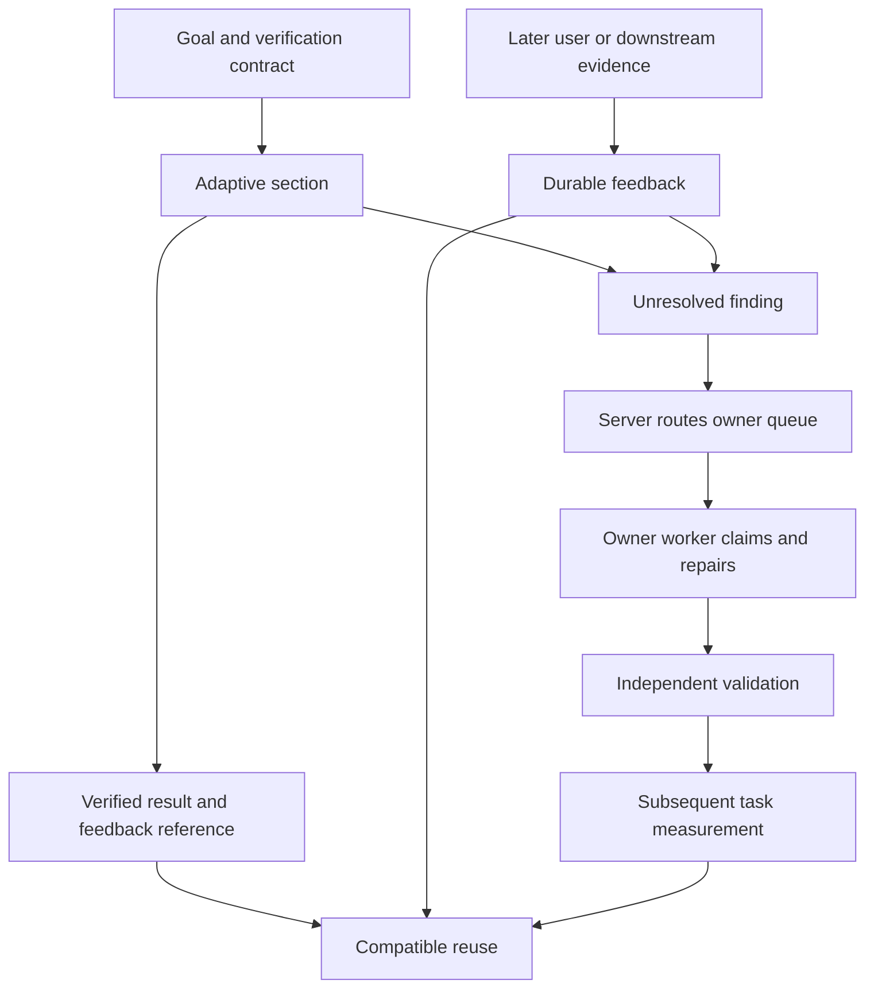

# Constructing a program

Program Runtime is a governed programming surface for agents. You submit a
Python program; it runs in a session-persistent kernel where every
manifest-bound Vrooli operation is a typed callable, and results stay in the
kernel as bounded `Handle` values instead of being copied into your context.

This page teaches how to build and compose programs. Search the library for
scenario-owned workflows before writing repeated operations. The task-shaped
pages at the bottom show construction patterns when a suitable workflow does
not exist.

## When a program is the right move

Write a program when the work has **arity** or **discard**:

- **Arity** — the task touches many units. Inspecting 60 scenarios is one
  program with one result, not 60 tool calls with 60 responses.
- **Discard** — you need a small answer derived from a large intermediate.
  Counting, grouping, joining, and filtering all belong in the kernel; only the
  answer crosses back.

A single read with a small response is not worth a program. Call the scenario
CLI directly.

## The three addressing forms

```python
rows = search_hub.query.query(query="program runtime", rows="ranked")  # a scenario binding
vrooli.scenario.status(name="program-runtime")                          # the project CLI
verdicts = validate("program-runtime")                                  # a runtime verb
```

- **Scenario bindings** are flat top-level names. `<scenario>.<group>.<command>`,
  with hyphens becoming underscores: `search-hub` is `search_hub`.
- **`vrooli.`** is the project control plane and nothing else. It is permanent,
  so a `vrooli.`-prefixed call is always the project CLI, never a scenario.
- **Runtime verbs** are top-level names the runtime owns.

**Do not prefix a scenario binding with `vrooli.`.** `vrooli.search_hub…` does
not resolve. `vrooli.` is the project control plane and nothing else — it is
never a scenario and **never a runtime verb**. `vrooli.discover(...)` and
`vrooli.recall(...)` both fail; call the verbs at the top level.

**There is no `vrooli` module.** `import vrooli` and `from vrooli import recall`
both raise `ModuleNotFoundError`. Every name above is already bound in the
program's globals; a program never imports the runtime.

**A program is module scope, not a function body.** `return` at the top level is
a `SyntaxError`. Use `if`/`else` to skip work, or wrap the body in a `def` and
call it.

### Shadowing and the escape hatch

Runtime-owned names — the verbs plus `vrooli` and `__vrooli__` — cannot be
assigned; the submission is refused and names the protected name. Scenario names
*can* be shadowed, because the set of scenarios grows and reserving a growing
set would break older programs. Submission warns when you shadow one, and
`__vrooli__` always reaches the binding:

```python
search_hub = ["a", "b"]                                    # legal, warns
__vrooli__.search_hub.query.query(query="x", rows="ranked")  # still reachable
```

## The core discipline: fetch wide, shape in-kernel, materialize narrow

```python
rows = search_hub.query.query(query="retention", rows="ranked")   # wide
top = rows.filter(lambda r: r["score"] > 0.5).group_by("provider_id")  # shaped
print(top)                                                         # narrow
```

`Handle` carries `count`, `head`, `filter`, `map`, `select`, `sort`, `unique`,
`agg`, `join`, `group_by`, `meta`, and `raw`. Call `materialize(limit)` only
when you need the rows themselves, and always pass a limit. Printed output is
bounded (4 KB by default, 64 KB when the submission opts into materialized
output), so an unbounded print is truncated rather than expensive.

`group_by(key)` returns a dict-shaped count mapping with a bounded `count()`
helper for the represented source rows:

```python
counts = rows.group_by("status")
print(counts.count())
```

For joins, use `left.join(right, key="id")` or the additive `on="id"` alias;
passing both names is rejected.

A `Handle` is not a dict and not a response object: it has no `.get()` and no
attributes named after response fields. Take the row first, then index it:

```python
row = discover("read test run verdicts").head(1)[0]
print(row["binding_id"])
```

`describe(binding_id="...")` returns a handle of argument rows. Read the
first row and its `name` field; the handle itself is not a row containing an
`arguments` field:

```python
argument = describe(binding_id="test-genie/runs/list").head(1)[0]
print(argument["name"])
```

`meta()` returns the response fields that are not rows — latency, routing,
totals. `raw()` returns the decoded response. Neither escapes the output bound.

## Start with promoted patterns

Before hand-authoring a repeated shape such as fan-out, inspect the frozen
library for a reviewed implementation. The library is explicit and
session-scoped: it does not change underneath a running program session.

~~~python
catalog = lib.list()
print(catalog.head(20))

# After choosing a reviewed entry from the catalog:
result = lib.concurrent_fanout()
print(result.head(3))
~~~

Use lib.list() first, then call the exact promoted name with the arguments
shown by its entry. If no suitable entry exists, author the smallest new
program and keep its output bounded. Start a new session after a library
version is promoted or its current version changes.

## Compose scenario-owned workflows

Scenario-owned contracts are callable as `lib.<scenario>.<program>(...)`, with
hyphens normalized to underscores. Skills carry selection and interpretation;
programs can reuse the selected workflow in usage or self-improvement work.
For closed-set text classification:

```python
child = lib.ai_gateway.classify_batch(
    corpus=["The provider timed out."], labels=["infra", "input"],
    instruction="Identify the primary failure cause.")
result = child.head(1)[0]
print({"status": result["status"], "signals": result["signals"],
       "errors": result["errors"], "artifact": child.meta()})
```

Handle `partial`, `failed`, `refused`, and `unavailable` before using labels.
An unknown result is not a healthy observation. Keep instructions and label
vocabularies with the consumer; shared transport, validation, and accounting
belong with the workflow owner. Use deterministic evidence grouping when
structured error codes already answer the question; inference is for the
remaining semantic judgment.

Agents may create and edit these assets under the construction rules here and
`program-contracts.md`. Declare actual bindings and effects, bound the whole
composition, and exercise failure paths as well as successful calls. Nested
calls share the session's capabilities, attribution, and spend limits. A child
contract does not mint grants or an independent budget. Keep child artifact
metadata with evidence when later replay needs to identify what ran.

### Improve a program through the same composition surface

For a purpose-scoped campaign and explicitly relevant Agent Manager runs, use
the shared evidence workflow:

```python
child = lib.program_runtime.improvement_evidence(
    campaign_id=campaign_id, run_ids=run_ids, limit=3)
evidence = child.head(1)[0]
print({"status": evidence["status"], "evidence": evidence["evidence"],
       "children": evidence["signals"]["children"]})
```

This composes Visited Tracker's revision-aware candidates and Agent Manager's
bounded investigation evidence without inference. The caller supplies the
relationship between the campaign and the runs; the program does not infer
causation from their presence. Inspect child statuses, truncation, and artifact
identities before deciding what to repair. A successful submission does not
establish that all child evidence is available or complete.

Claim the selected work before parallel review. Record review evidence against
the captured revision. If a repair changes that revision, it becomes eligible
again; obtain a fresh claim and validate the new behavior before recording its
review. Never complete an old claim as proof about changed source. For program
changes, follow `program-contracts.md`, test child failures as well as success,
and run the owner's managed `programs` validation. Promote a repeated workflow
only after this evidence shows that the shared contract fits its consumers.

## Ambiguous responses

A binding whose response has more than one repeated field cannot guess which one
is the rows. It fails closed and names the candidates:

```
binding search-hub/query/query has no determinable primary response field;
candidate repeated fields: corporaSearched, groups, ranked, routingExplanation
```

Name the field to proceed. This is opt-in per call and never defaults:

```python
rows = search_hub.query.query(query="retention", rows="ranked")
```

## Session state

Variables persist across submissions in the same session, so a long
investigation accumulates working state:

```python
# submission 1
registry = program_runtime.bindings.list()

# submission 2 — registry is still live
print(registry.group_by("effect"))
```

State is process memory and is deliberately not persisted. A handle is a live
reference; a reclaimed session loses it.

## Fan-out

Independent calls run concurrently through `gather`, which takes **zero-argument
callables** so each starts on its own worker:

```python
queries = ["proto bindings", "telemetry", "scenario health"]
results = gather(*[lambda q=q: search_hub.query.query(query=q, rows="ranked") for q in queries])
print([r.count() for r in results])
```

`gather` does not accept a list, a string, or already-evaluated handles.
`gather(["a", "b"])` and `gather("documents")` both raise `TypeError` — it needs
callables it can start, not values that have already been computed.

Bind the loop variable as a default argument (`lambda q=q:`) or every callable
closes over the last value.

## Long-running programs

A synchronous submission is bounded at **two minutes**. That is a deliberate
limit, not the runtime's capacity: work that legitimately takes longer is
submitted asynchronously and awaited once.

```text
program-runtime programs submit --session-id <id> --source-file work.py \
  --provenance agent --async
program-runtime programs wait <program-id> --timeout 300s
```

`programs submit --async --wait-timeout 300s` does both in one command. Either
way you **block once** and never poll — the wait is served by the runtime and
wakes on the program's terminal transition.

A synchronous submission that outruns its bound fails with `deadline_exceeded`
and names the program id; the program keeps running under its session budget, so
the recovery is to wait on that id rather than to resubmit the work.

## The Python surface

Programs run against an allowlisted builtin set, not the full interpreter. It
covers ordinary programming: containers, `type`, `getattr`, `next`, `iter`,
`round`, `format`, `sorted`, `zip`, comprehensions, `def`, `class`, `lambda`,
`with`, and **every standard exception**, so `except KeyError:` works. `import`
is available for the standard library.

Withheld on purpose: `eval`, `exec`, `compile`, `globals`, `locals`, `vars`,
`input`, `breakpoint`, `help`. Referencing one raises an ordinary `NameError`.
This is a guardrail against accidents, not a security boundary — the posture is
trusted-local-agent.

## What happens before your program runs

Submission statically resolves every name against the live registry before a
kernel executes anything. Three severities; only `error` refuses:

```
error   line 3  name "test_geni" does not resolve to a governed binding namespace
                or a built-in; nearest match: "test_genie"
warning line 7  scenario namespace "search_hub" is shadowed for the rest of this session;
                reach the binding as __vrooli__.search_hub
```

Resolution never guesses. A name that does not resolve is refused with a
suggestion, and no suggestion is offered when nothing is genuinely close — a
wrong suggestion is worse than none. Use `--explain` on `programs submit` to get
diagnostics without executing.

Names the program itself binds — function names, parameters, lambda arguments,
comprehension and loop variables, `with` and `except` targets — are never
flagged. Every refused name is recorded, which is how the fleet learns which
operations agents reach for and cannot invoke.

## Reading a failure

`failure_shape` carries a **cause**, never a Python exception class. The closed
vocabulary is:

| Cause | What to do |
|---|---|
| `unresolved_name` | Fix the name; the message names the nearest match. |
| `unknown_field` | The argument matches no proto field; the message lists the candidates. |
| `ambiguous_response` | Pass `rows="<field>"`. |
| `unreachable_scenario` | The owning scenario is not running. Start it through the lifecycle. |
| `refused_no_grant` | A destructive binding needs an explicit session grant. Request it; do not retry. |
| `refused_not_run_eligible` | The manifest declares the command ineligible. There is no override. |
| `inference_spend_exceeded` / `delegated_run_spend_exceeded` | The session ceiling stopped the work. |
| `deadline_exceeded` | The 120-second supervisor deadline fired and the kernel restarted; live variables were lost. |
| `kernel_syntax` | The program did not parse. |
| `kernel_runtime` | An uncaught Python exception. Read `failure_detail`. |
| `bridge_transport` | The call did not reach the owning scenario. |
| `unclassified` | No cause was derivable — reported honestly rather than guessed. |

`failure_cause` is the typed enum mirror of the same value.

## Finding the operation and its contract

```text
program-runtime bindings list                  # the callable namespace
program-runtime bindings describe test-genie/runs/list
program-runtime bindings unbound               # why something is not callable
```

In-kernel, `describe("test-genie/runs/list")` returns the same descriptor-backed
argument contract, and `discover("intent")` returns one governed capability or
an explicit null verdict.

### A null verdict and an unavailable result are different

Both carry an empty `binding_id`, and confusing them is expensive in opposite
directions, so the row distinguishes them:

| `unavailable` | Meaning | What to do |
|---|---|---|
| `False` | Discovery worked and the answer is that no governed capability serves this intent. | **Stop.** Do not guess a path or shell out. |
| `True` | Discovery itself failed — Search Hub or the judge was unreachable. The absence is not evidence. | Retry, or fall back to `mode="fast"`, or report the dependency. |

```python
row = discover("read test run verdicts").head(1)[0]
if row["unavailable"]:
    print({"blocked": row["reason"]})          # a dependency, not a gap
elif row["null_verdict"]:
    print({"stopped": "no governed capability"})
else:
    print(row["binding_id"])
```

`mode` selects the retrieval strategy:

| Mode | Cost | Use when |
|---|---|---|
| `"fast"` | sub-second, no inference | you want determinism, or the judge is degraded |
| `"judged"` (default) | one governed model round-trip | you want the highest-precision single answer |
| `"deep"` | judged over paraphrases | recall matters more than latency |

## Typed inference and contract aliases

The typed inference helpers accept the model-friendly `text=` and `texts=`
aliases in addition to the canonical `source=` spelling. The plural spelling
is especially useful for `ai.classify(texts=[...])`, which uses the governed
batch route. `describe` likewise accepts
`binding_id=` in addition to `binding=`. Both spellings are additive and
backward-compatible; passing multiple spellings in one call fails with a `TypeError`
that names the collision rather than choosing silently.

```python
summary = ai.classify(text="The build is green.")
contract = describe(binding_id="test-genie/runs/list")
```

For bounded classification, `labels=["bug", "feature"]` builds the existing
local JSON-Schema enum path for you. It returns the same validated result as a
hand-authored schema. Do not pass `labels=` with `schema=`; the two forms are
mutually exclusive, and labels must be a non-empty list of strings.

For a small corpus, `ai.classify(source=["one", "two"], labels=["bug", "feature"])`
uses the same governed batch route as `ai.batch` and returns one bounded row per
input. The single-text form remains unchanged. `recall` accepts an intent and
optional depth only; use `describe` or `discover` for a binding id.

## Runtime verbs

| Verb | What it does |
|---|---|
| `discover(intent, mode=)` | One governed binding for an intent, or an explicit null verdict. |
| `recall(intent, depth="fast", rows="ranked")` | Search-hub's selected repeated response field; `ranked` is the default. `query=` is an additive alias for `intent=`. `depth="deep"` widens the result set. |
| `validate(scenario, depth="fast", rows="runs")` | The latest recorded test-genie run rows; `runs` is the default. It does not start a run. |
| `capture(text, kind="note")` | A one-row Handle containing the append response because the operation has no repeated response field. `kind="work-record"` also accepts `trigger`, `approach`, `evidence`, `outcome`. |
| `guide(intent, rows="results")` | Prompt Manager's ranked skill/action discovery results; `results` is the default. `task=`, `query=`, and `text=` are additive aliases for `intent=`. |
| `ai.classify / extract / judge / write / batch` | Bounded typed inference through ai-gateway, schema-validated locally. `classify`, `extract`, and `judge` are deterministic and refuse a caller-supplied `temperature`; only `ai.write` accepts `temperature=` and `max_output_tokens=`. |
| `agent.start / collect / run` | A delegated agent-manager run and its evidence. |
| `gather(*callables)` | Concurrent fan-out. |
| `describe(binding_id)` | A binding's argument contract. |
| `reachable()` | Per-scenario reachability. |
| `lib.list()` / `lib.<name>()` | Promoted reusable programs frozen at session start. |

Each verb takes its primary argument positionally or by keyword:
`recall("retention")` and `recall(intent="retention")` are the same call.
The measured model-facing form `recall(query="retention")` is also accepted.
`validate` accepts `scenario=`, `capture` accepts `text=`, and `guide` accepts
`task=`. Supplying two
spellings of one value raises a `TypeError`; an unknown keyword names the
offending keyword and lists the accepted keywords so the caller can recover
without guessing.
Runtime verbs project the operation's rows directly. Non-row response fields
and the `verb`, `binding_id`, and `owner` identity are available through
`meta()`; `raw()` returns the decoded owning-operation response. When an
operation has several repeated response fields, `rows="<field>"` overrides the
documented default. An invalid field fails closed and lists the available
repeated fields.

**`validate` reads; it does not start a run.** Starting a run is a write that
test-genie exposes as run-ineligible, so no governed binding exists for it.
Start runs through the lifecycle (`vrooli scenario test <name>`) and block once
on the run id; never poll.

**`guide` is a governed discovery composition.** It maps the caller's intent to
`prompt-manager/discover/discover`, defaults to the response's `results` rows,
and returns the same bounded Handle as every other runtime verb. If Prompt
Manager or that exact binding is unavailable, the verb fails closed naming the
dependency and reason.

Every verb fails closed and names its unavailable dependency. None of them falls
back to a shell call or a direct provider call.

## Verified adaptive sections

Use `learn.act` for a bounded implementation that should adapt from verified
outcomes. Supply an independent postcondition and a stable verifier revision.
An empty binding list declares pure computation.

```python
learn.task(operation="example.echo", key="echo/v1")
result = learn.act(
    "echo", "Return the input value unchanged.", {"value": inputs["value"]},
    {"type": "object", "required": ["value"]}, [],
    verify=lambda output: ("verified_success", ["echo:exact-match"])
        if output == {"value": inputs["value"]} else ("failed", ["echo:mismatch"]),
    verifier_revision="echo-equality/v1",
)
learn.outcome("verified_success", ["echo:exact-match"])
```

The runtime supplies the objective, inputs, output schema, binding contracts,
previous candidate, and bounded failure diagnostics to inference. Each retry
requests a new candidate. At most five attempts are allowed; session spend and
execution ceilings still apply. A failed write with uncertain effects stops
adaptation. An unavailable service does not contradict the implementation.

The verifier runs on every execution, including cache hits and baselines.
Only a verified root outcome retains new fragment evidence; repeated sections in
one root attempt cannot inflate durable verification counts. Root failure does
not automatically condemn unrelated successful child sections. Unsupported
JSON Schema validation keywords are errors; the kernel supports types, object
properties, required/additional properties, arrays, enums/constants, bounds,
patterns, and anyOf/allOf/oneOf/not. All array elements are checked.

Default cache qualification requires three verified attempts across at least
two distinct input digests, no contradictions, and verification within 30 days.
Configure `min_verified`, `min_contexts`, and `max_age_days` for the section's
risk and input domain. These are eligibility criteria, not a statistical
confidence claim. Test and replay executions use separate cache cohorts. Compatibility
covers the objective, schema, binding descriptor/governance snapshots,
`verifier_revision`, and the caller's `compatibility` environment object.
Increment the verifier revision when its meaning changes. Include relevant
site/device/protocol versions in compatibility. The explicit task key survives
the real checkpoint bridge.

### Section keys: what the fragment's evidence pools under

A fragment's cache identity includes the task key, which is correct only when the
section's correct code depends on the task. It usually does not. A section that
maps an owner's response shape, normalizes rows, or reads a vocabulary is
task-independent, and under a task key that varies per run — a session id, a
prompt digest, a URL — it starts a fresh cache entry every execution and can
never reach `min_verified`. The section would call the model forever and never
qualify.

Give such a section its own `key`:

```python
learn.act("row-normalization", intent, inputs, schema, bindings,
          key="bas/flow-row-shapes/v1",          # pools across every task
          fallback_fragment=ROW_MAPPING_V1,
          verify=verify_normalization, verifier_revision="row-fields/v1")
```

The key names what the code is about, not what the run is about, so pick a stable
string and version it when the section's subject changes. The step attempt record
stays keyed by the task either way: only the fragment's evidence pools. Omit `key`
when different tasks genuinely need different code.

Fragments run with a deliberately small builtin set: `len`, `min`, `max`, `sum`,
`str`, `int`, `float`, `bool`, `dict`, `list`, `range`, `sorted`, `enumerate`,
`any`, `all`, `isinstance`, and `set`. `type` is a forbidden call, and imports,
lambdas, `with`, nested functions and private attributes are rejected at
normalization. Keep shape validation in ordinary program code and pass the section
well-formed inputs; a fragment is for the mapping, not the guard rails.

A declared `learning.baselines.<step-name>` asset supplies reviewed code,
compatibility, review evidence, curated fixtures, and a content digest. It runs
before AI on an unqualified cache miss. `allow_ai=False` makes adaptation
unavailable while preserving compatible baseline/cache execution. Old
`fallback_fragment` inputs remain verifier-checked but are not reviewed assets.
`learn.infer(..., verify=...)` retains demonstrations only when the inference
postcondition and root outcome succeed; schema-only answers remain unverified.

### Publish a portable baseline

Run `program-runtime.fragment-promote` with `step_key`, `operation`,
`reviewed_by`, `evidence`, and curated `fixtures`. The default prepares a candidate.
Inspect it, then use `publish=true` with the current `expected_digest` to update
one existing program declaration. Publication requires operator provenance,
sufficient verified observations, at least two input contexts, matching source,
and an unchanged declaration. The original `learn.act` call remains in source.

Fixtures contain `inputs`, independently expected `expected`, and optional
ordered `calls` with `binding_id`, `arguments`, `rows`, and optional `metadata`.
Publication replays these recorded responses without calling live domain tools.
It rejects mismatches and known private or machine-specific material. Review
must also check secrets, permissions, environment assumptions, and verifier
quality; a content digest is integrity, not proof of safety. Runtime attempts,
raw traces, and changing scores are not exported. Commit the reviewed declaration
through the ordinary repository workflow; runtime execution never commits Git.

The plugin ramp transports ordinary `.vrooli/program-runtime/*.json` and `*.py`
assets without interpreting learning state. The target still needs Program
Runtime and the domain capabilities the code calls; AI, Memory, and Agent
Manager are optional only when the program's remaining path permits it.

### Degraded operation and feedback

Memory recall unavailable means no advice, not a zero failure rate. Incomplete
outcome scans carry `evidence_reliable=false`; preference selection does not
use them as positive evidence. Avoid rules and defaults obey the same eligible
option set; an empty set returns `selected_id=None`, `source="unavailable"`.
Check that result before constructing a domain request.

Later-run `learn.feedback` attempts one immediate write. Failed feedback is
included in the immutable finish intent and retried by the server-owned outbox.
Only capture is retried; domain effects are never replayed by delivery recovery.
Missing optional Memory yields a blocked receipt with `memory_not_installed`;
a declared must-start dependency still refuses admission. Fragment delivery
failures are reported separately under `learning.fragments`. Eligible local
cache state can serve during a fragment-store read outage, subject to the same
freshness, compatibility, and verifier checks.

## Task-shaped construction patterns

- [Namespace and contracts](../construction/namespace-and-contracts.md)
- [Handle shaping](../construction/handles.md)
- [Inference and discovery](../construction/inference-and-discovery.md)
- [Delegation](../construction/delegation.md)
- [Failure recovery](../construction/failure-recovery.md)

Runnable versions of these are the scenario-owned programs in
[`../../.vrooli/program-runtime/`](../../.vrooli/program-runtime/), each with a
contract beside it (`program-contracts.md`): `fleet-fanout`, `concurrent-fanout`,
`typed-inference`, `batch-inference`, `delegated-run`, `failure-triage`,
`handle-shaping`, `registry-sweep`.

## Adaptive authoring and delayed feedback

Authors supply the objective, inputs, output schema, independent postcondition,
compatibility context, and permitted effects. The runtime supplies binding
contracts, candidate selection, bounded generation/repair, evidence retention,
and failure routing. Keep settled logic as ordinary program code.

`learn.act(..., capabilities=["<capability intent>"], allowed_effects=["read"],
verify=..., verifier_revision="v1")` resolves intents through governed discovery.
Use either `capabilities` or the existing exact `bindings` list. Resolution must
match an admitted binding contract and the effect allow-set. It does not grant
new permissions. The generated implementation receives current binding schemas;
the author does not copy argument shapes into the implementation prompt.
A program can declare `learning.capabilities` as
`[{"scenario":"browser-automation-studio","effects":["read"]}]` to authorize
intent resolution within one owner without enumerating methods. The per-call
`allowed_effects` intersects this declaration; session grants still apply.
An empty explicit `bindings=[]` remains pure computation. Discovery refusal and
unavailability are distinct from an implementation failing its postcondition.

### Result identity

`learn.act` and `learn.choose` include `feedback_ref` in their existing result
objects. `learn.infer` and `learn.delegate` preserve their raw output schemas;
read `learn.result_ref("<step-name>")` to retrieve their reference. The finish
receipt also retains result references and their delivery state. References are
opaque feedback capabilities: preserve them with the returned task result, keep
them out of public queue projections and portable assets, and do not parse them.

Register an external artifact, such as a BAS workflow revision, with
`learn.result("workflow", {"kind":"workflow", "owner":"browser-automation-studio",
"id":workflow_id, "revision":str(version)})`. This allocates attribution; it
does not certify the artifact. `learn.result_status(artifact)` reads its current
eligibility. Check `available` before using `eligible`; an unreadable result is
unknown. Put relevant environment and verifier revisions in the artifact identity
or task compatibility before pooling evidence.

A later run calls `learn.feedback(feedback_ref, "contradicted", evidence,
correction="<observed correction>", dimension="verification")`. A conversation
or downstream consumer can instead run `program-runtime.learning-feedback` with
those fields. No domain action is repeated. Legacy attempt-ID feedback remains
supported for existing consumers.

| Dimension | Meaning and response |
|---|---|
| execution | The attempted implementation failed; confirmed code failure disqualifies that exact implementation. |
| verification | The declared postcondition was wrong; contradictory evidence disqualifies the exact implementation/artifact. |
| usefulness | The output did not meet the user's need; retain separate semantic evidence and exclude contradicted advice/examples/artifacts. Do not silently rewrite the verifier. |
| efficiency | The result required excessive effort; route improvement evidence without declaring correct code incorrect. |
| context | Requirements or environment changed; route the new context without treating the old implementation as globally defective. |

Silence is not support. Model interpretation of an ambiguous comment is not
confirmed failure. Name the child result when attribution is known; otherwise
retain a parent-level finding. A successful sibling is not contradicted merely
because the enclosing task failed. Operator and agent observations share the
live evidence cohort; test and replay evidence cannot disqualify live artifacts.

### Delivery and owner work

The kernel journals learning writes before sending them. Pending evidence is
retried on later learning operations and before cached execution; a restart or
changed service port does not erase it. Undelivered contradictory evidence
withholds reuse: the unreviewed learned cache is withheld, because an
undelivered contradiction may be exactly the evidence that disqualifies it.

Withholding stops at reuse. A declared `learning.baselines` asset was reviewed by
a person and replayed against its fixtures at publication, so runtime evidence
cannot disqualify it and it still executes; generation is not reuse, so bounded
adaptation still runs, protected by the on-disk candidate quarantine and the
verifier. A delivery outage therefore degrades a section to "no learned cache"
instead of disabling it, and `learning.cache_withheld` on the result says so.
Only a section with no reviewed baseline and `allow_ai=False` has nothing left to
run; it raises `learning_evidence_pending`, which names the delivery outage
rather than a baseline the author never declared. A failed journal write is an
explicit unavailable receipt, never successful capture. Program Runtime atomically records accepted feedback,
updates eligibility, and retains its Memory projection for the server-owned
outbox. Memory projection uses the original target scope and attempt identity.
The outbox retries evidence delivery only. If Memory was absent at original
capture, the drainer can pin its validated finish contract once when it becomes
available; subsequent retries retain that version rather than adopting new code.

Terminal adaptation failures and later contradictions produce durable findings.
The server routes them to the owning scenario queue. Read the bounded public
projection with `program-runtime programs learning-findings --owner <scenario>`;
Meta Optimization consumes the same typed projection independently of runtime
failure/refusal metrics. Truncation remains visible; narrow the owner rather than
interpreting omitted findings as resolved.

Use `program-runtime.learning-maintain` to list or advance a finding. The ordered
states are `observed`, `routed`, `claimed`, `repaired`, `validated`, `measured`.
An advance requires the expected state, exact owner, and evidence. Preserve the
returned `claim_ref` privately across worker runs; retain the same reference after
an unavailable response. Only the claim holder advances repair states. A claim expires after 30 minutes;
a holder can renew it with fresh evidence, or another worker can reclaim an
expired `claimed` finding. Repaired and validated states are not reset by expiry. A repair
receipt needs a changed artifact reference; validation needs independent test
or oracle evidence; measured needs subsequent comparable task evidence. The store
checks transition/claim integrity. The owning worker is responsible for the
meaning of its evidence; a nonempty evidence string is not a correctness oracle.



| Owner | Produces | Consumes and acts |
|---|---|---|
| Program Runtime | Attempt tree, result references, candidate evidence, owner findings | Selects compatible implementations; adapts within budget; delivers evidence; exposes queue state. |
| Memory | Recall and comparable outcome projections | Retains original-scope feedback and returns advisory knowledge. |
| BAS | Task postconditions, navigation evidence, exact workflow revisions | Applies browser-specific checks, extracts task results, qualifies and repairs browser flows. |
| Scenario improve worker | Claimed repair and validation evidence | Reads its owner queue; fixes domain behavior under its existing authority. |
| Meta Optimization | Prioritized cross-owner gaps | Reads unresolved learning findings and runtime health; does not claim that ranking a gap repairs it. |

A worker must be scheduled by the existing goal-loop/agent system to perform
engineering changes. The server automatically captures and routes findings; it
does not grant a queue reader unrestricted code-editing authority. Reviewed
portable baselines retain the publication workflow above. Runtime learning does
not automatically commit or publish private task data.

Permanently refused feedback remains in the private journal for inspection and
returns `refused`; it leaves the retry queue so it cannot block unrelated reuse.
Transient delivery failures remain pending and return `partial`.
