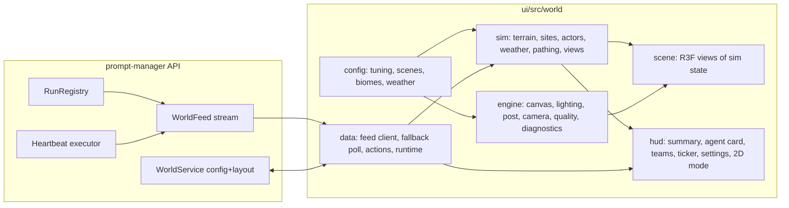

# World Architecture

The `/world` route renders the agent swarm as a generated landscape: a simulation of terrain, places,
actors, and weather driven by real swarm signals, a React Three Fiber render layer, and a
HUD that makes the swarm's state readable and actionable. This document is the
map; the code lives under `ui/src/world`.

## Layers

Six layers with one-way dependencies. The rule is enforced by ESLint
(`import/no-restricted-paths` in `ui/eslint.config.js`) and proven by fixtures
under `ui/src/world/sim/__lint__` through `ui/src/world/__lint__/layerRule.test.ts`.

| Layer | May import | Owns |
|---|---|---|
| `config` | zod only | tuning, scenes, biome sets, weather presets, period bands |
| `sim` | `config` | deterministic world model, tested in Node with no WebGL |
| `engine` | `config` | `WorldCanvas`, lighting rig, post chain, camera rig, quality governor, diagnostics |
| `scene` | `engine`, `sim`, `config` | terrain tiles, water, places, biome props, actors, weather, labels |
| `hud` | `sim`, `config`, `data` | DOM chrome, settings, help, 2D mode |
| `data` | `sim`, `config`, proto clients | WorldService client, feed, fallback poll, actions |

`ui/src/world/index.tsx` is the route component and the only module that
composes `scene` and `hud`. Nothing outside `ui/src/world` imports either.

## Control surface

Every timing, speed, weight, threshold, lighting period, quality profile and
performance budget is a lever in `ui/src/world/config/world.tuning.json`,
bounded and described by `tuning.schema.ts`. The rendered lever table lives in
[configuration.md](../reference/configuration.md#world-tuning-levers) and is
regenerated with `pnpm world:tuning-docs`; `tuning.test.ts` fails when the two
drift. The sim and scene code carry no behaviour literals.

URL levers on `/world` (used by the smoke tool and deep links):
`?view=3d|2d` (intent that outranks the stored 2D preference, never a missing WebGL),
`?scene=park|office`, `?profile=low|medium|high|ultra` (manual, disables auto),
`?period=dawn|day|dusk|night`, `?intro=0`, `?diag=1`, `?seed=<int>`,
`?weather=clear|cloudy|rain|snow`, and `?pressure=<0..1>`.

## Rendering

WebGL2 through React Three Fiber 9 on three 0.185. The renderer tone-maps
with AgX in every profile; the post chain adds N8AO at half resolution and
selective bloom (luminance threshold 1.0, so only `toneMapped={false}`
emissives glow: status marks, lamps, the campfire). The composer's own
ToneMapping pass was tried and dropped because it rendered the HDRI sky flat
grey while the renderer path kept it blue.

Lighting is one directional key light with a shadow frustum fitted to the terrain
(PCFSoft shadow map sized per profile), a hemisphere fill, a bundled 1K HDRI
that is both the environment map and, outdoors, the visible sky (through
`Environment` with Lightformer panels), and linear fog framed relative to the
terrain fit distance. Actors add contact shadows. drei's AccumulativeShadows was
tried and dropped: its scene-wide material swap left meshes that mounted
during accumulation invisible. Lighting
periods (dawn, day, dusk, night) are tuning presets; indoor scenes override the
presets they need in their scene file.

The camera is drei `CameraControls`: polar, azimuth and
distance clamps from tuning around the scene's hero pose, a boundary box over
the terrain, an eased establishing-to-hero dolly on load (skipped for
`prefers-reduced-motion` and `?intro=0`), and imperative `home`, `focus` and
`setPose` for the HUD and the editor.

Quality is one `QualityProfile` (DPR, shadows, AO, bloom, labels, frame cap,
terrain resolution, vegetation density, water, weather particles, and tile budget). drei
`PerformanceMonitor` moves between profiles only while auto is on, with bounds
derived from the active profile's own frame cap. A manual pick disables auto and
mounts no monitor, so nothing can override it.

## Diagnostics and the smoke tool

`engine/diagnostics` publishes renderer counters, CPU and GPU frame percentiles,
direct per-group attribution, renderer provenance, active weather, the nearest geometry and a
`ready` flag to `window.__worldDiagnostics` and to an optional overlay
(`?diag=1` or the settings toggle).

`pnpm world:smoke` (`ui/scripts/world-smoke/run.mjs`) loads every scene at
every profile in headless Chrome, waits for `ready`, asserts the budgets in
`tuning.budgets` (draw calls, triangles, p95 on the host GPU, footprint fill
between `framing.minFill` and `framing.maxFill`, camera clearance, tone
mapping) and the sim invariants (`window.__worldSim.violations()` must be
empty), records evidence under `ui/evidence/world-smoke/` and diffs the frame
against the golden in `ui/src/world/__goldens__/`. It ends with one table:
draws, triangles, p50, p95, fill, violations and a verdict per case.

Numbers first. Every verdict is a counter or an invariant; the golden diff is
a regression tripwire, never a quality judgement. When a look is needed,
`pnpm world:sheet` composes the last run's frames and their counters into one
`contact-sheet.png`, so a review costs one image per batch of work, not one
per scene, profile and period. `pnpm world:goldens` rewrites the goldens;
`--gpu` records host-GPU frame times and gates p95.

Budgets are ceilings chosen from the design, not readings copied from a run.
Terrain contributes one draw per visible tile. Water contributes one draw.
Vegetation contributes one instanced draw per visible tile and prop material,
actors use shared instanced groups, and the post chain has fixed passes. A change that needs a
higher budget has to say which layer grew and why.

## Validation posture

| Layer | Test kind |
|---|---|
| `config`, `sim`, `data`, `hud` | Vitest (Node or jsdom) |
| `engine`, `scene` | the headless WebGL smoke tool (budgets, framing, invariants; goldens as tripwire) |
| user journeys | BAS cases under `bas/cases` |

No unit test mocks the `three` module.

## Related

- [World simulation](WORLD-SIM.md) — places, actors, signals and the state machine
- [World terrain](WORLD-TERRAIN.md) — fields, water, biomes, sites and scatter
- [World weather](WORLD-WEATHER.md) — state machine, health pressure and presentation
- [World HUD](WORLD-HUD.md) — what each signal means and every action
- [World assets](../guides/WORLD-ASSETS.md) — the CC0 prop pipeline
- [Configuration](../reference/configuration.md#world-tuning-levers) — the lever table
