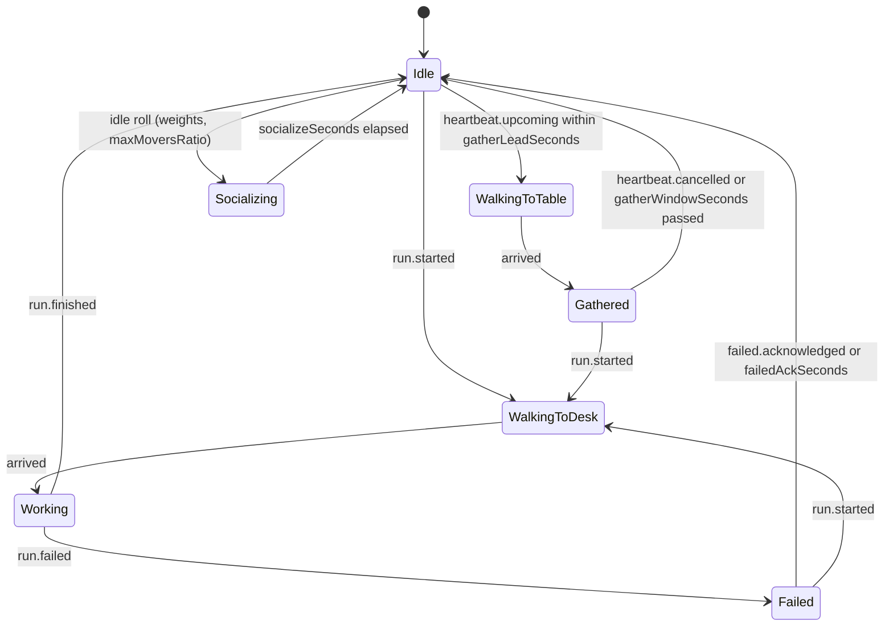

# World Simulation

`ui/src/world/sim` is the renderer-free model of the swarm. It runs at a fixed
tick from a seed, takes typed signals, and produces positions, states and
events. It imports only `config`; ESLint rejects `three`, `react` and every
other world layer inside it. Vitest runs the whole thing in Node.

API: `createWorld(input, tuning)` → `WorldState`; `step(state, dt, signals,
tuning)` → new `WorldState` (pure); `buildView(state, actorTuning)` →
`WorldView` for the HUD; `createWorldStore(input, tuning)` wraps the three for
a live world (dispatch, advance, subscribe on discrete change, live tuning).

## Terrain and place are state

The layout is generated from the team graph and keyed by ids, never names:

| Place | Rule |
|---|---|
| room | one per team on a seeded, dry, level site; width grows with the desk row and rotation snaps to the configured step |
| desk | one per member along the room's back wall at `deskPitch`; its seat is `deskSeatOffset` in front, facing the desk |
| table | one per team inside the room with `tableSeats` sitting seats on a ring |
| commons | a disc on the best central buildable site; idle outings and unassigned agents live here |
| campfire | centre of the commons with `commonsSeats` sitting seats |
| board | the runs board, `boardOffset` beside the commons |

Terrain generation builds height and moisture, derives water and shores,
classifies biomes, selects sites, terraces them, and connects them with paths.
Biome vegetation and decor use a seeded stand mask that consumes no RNG state.
Final jittered placements stay outside water, shore and place clearances, and
inside the terrain disc. Operator overrides move, rotate, or
remove places by id after generation; a transformed room carries its desks,
tables, seats, and rotations. Agent positions are sim
output and are never persisted.

A walkable grid (`cellSize`) blocks water, steep slopes, desks, tables, the
campfire, the board, tree trunks, and the three walls of every room. The front
of a room is open. Actors path with A* on that grid (8-neighbour, no corner
cutting, string-pulled), cached per start/goal cell (`pathCacheSize`) with at
most `maxReplansPerTick` replans per tick.

## Actor state machine

Every arrow is one test in `sim/__tests__/machine.test.ts`.

Signals: `run.started`, `run.finished`, `run.failed`, `heartbeat.upcoming`,
`heartbeat.cancelled`, `agent.message`, `failed.acknowledged`. Unknown agents
are ignored. Every applied signal and every state change becomes a
`WorldEvent` in a ring of `eventsRing` entries and bumps `revision`, which is
what the HUD subscribes to. Continuous motion never bumps it.

Motion never snaps: speed ramps over `accelSeconds` toward `walkSpeed`
(`hurrySpeed` when a run starts), heading turns at `turnRateRadPerSec`, and an
actor arrives when within `arriveRadius` of its final waypoint. Seated seats
squash the actor into a sitting pose; standing seats do not.

## Idle layer

Home is the desk. A member spawns at its desk seat and rests there; an
unassigned agent has no desk and rests in the commons. Only actors in Idle
roll, every `rollIntervalSeconds`, weighted by `idle.weights`: rest (be at
home; walk there if away), wander (an outing to a random commons spot at
least `spacing` from everyone else), socialize (pair with a resting actor,
meet on the commons `socializeGap` apart, face each other for
`socializeSeconds`), sit (a free campfire seat for `sitSeconds`). At most
`maxMoversRatio` of idle actors walk at once; an idle actor that is neither
home nor on the commons (fresh from a table, a removed room) walks home first.
A run that starts while the member is at its desk goes straight to Working.

## Animation and weather

`anim` is sim data so it is testable: breathing (`breathHz`), hop phase while
walking (`hopHz`) with a landing squash (`squashOnLand`, relaxing at
`squashRecoverPerSec`), blink timers, seated flag and a short emote after each
signal (`emoteSeconds`). The scene reads it; it never computes it.

Weather is also simulation data. Seeded transitions advance from clear through
cloud, rain, or seasonally allowed snow. Pressure combines failed runs, failed
actors, and expired gatherings, then smooths over time. Rendering reads the
preset; the HUD explains the state and pressure.

## Determinism and invariants

`sim/invariants.ts` states what every settled world must satisfy and returns
named violations instead of booleans: occupancy is a bijection that matches
`actor.seatId`, every actor stands on walkable terrain, sites stay dry, level,
separate, and reachable, desks and tables sit inside their room, standing actors
keep a body width apart, and a resting idle actor is at its desk, on the
commons or on a seat it holds. `invariants.test.ts` runs them on fresh worlds
of every size, after minutes of idle life, through a run, a failure and a
gathering, and after a room is removed. The live page exposes the same check
as `window.__worldSim.violations()` and the smoke tool fails on any.

`hashState` digests terrain, actor states, positions, seats, idle activity and
the RNG state. The determinism test proves two runs from seed 7 with the same signal
script hash identically after 10,000 ticks; the boundary test proves 50 actors
remain on walkable terrain over 5,000 ticks; the literal scan proves the sim carries
no behaviour numbers outside `world.tuning.json`.

## Layout strategies and interiors

The park uses the `clearings` strategy: score buildable sites, terrace them,
place rooms and gathering furniture, connect paths, then scatter biome decor.
The office uses `floorplan`: size one plate from the roster, cut primary and
secondary corridors, recursively BSP-split the remaining corridor-facing blocks,
assign teams largest-demand-first with stable id tie-breaking, put one door on
each corridor-facing wall, and locate the lobby at the corridor junction.

`interiorFor(seed, teamId, ...)` derives desk orientation, table choice, lamp
corners and filler placements from team identity. Adding an unrelated team does
not consume that team's random stream. Desk seat ids remain keyed by agent id.

The office centre guarantees level, dry floorplate terrain. The surrounding park
landscape keeps its natural terrain and water rules; the centre blends into it
with a bounded boundary grade. `checkVegetationDry` checks the exterior scatter.
Floorplan tests require deterministic places, one door per team room, corridor
records and an invariant-safe navigation graph.
