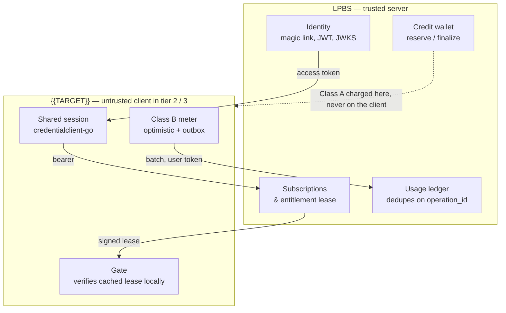
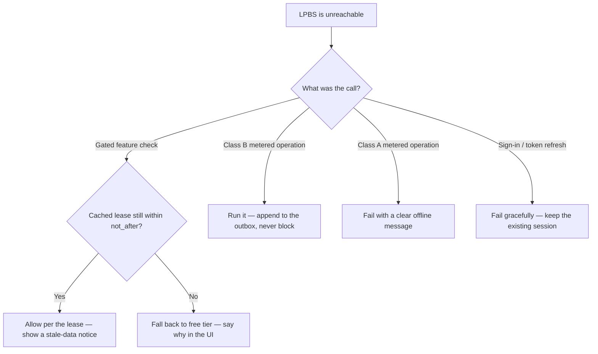

## Steer focus: Bundle Integration

Integrate `scenarios/{{TARGET}}/` into the **Vrooli Business Suite bundle** so that it participates in subscription gating, credit-based metering, and authenticated downloads managed by the Landing Page Business Suite (LPBS) scenario.

Your goal is to ensure `{{TARGET}}` enforces entitlements and consumes credits consistently with every other bundled app, so that a single subscription unlocks and meters all apps in the bundle.

Required reading:
- `docs/concepts/PAID_FEATURES.md` — the engineering contract this skill implements. It owns the free/metered/gated decision, the Class A / Class B meter split, the trust boundary, and the current implementation status of each piece. Read it first; this skill is the wiring, not the contract.

Optional reading:
- `prompt-manager skill read api-steer`
- `prompt-manager skill read interoperability-steer`

---

### 0. Why This Skill Exists

The Business Suite bundle is a collection of apps sold under a single subscription. Each bundled app must:

1. **Use one identity** — LPBS-issued sessions through the shared device credential, not per-app accounts.
2. **Enforce entitlements** — only active subscribers reach gated features or downloads.
3. **Meter correctly for its class** — cost-bearing operations charge server-side; local-capacity operations run optimistically and sync.
4. **Declare its paid surface** — `.vrooli/monetization.json`, so `monetization-conformance` can validate it.
5. **Register in LPBS** — so the landing page, download system, and entitlements API know the app exists.

Without a shared integration pattern, each app invents its own auth, its own gating, its own credit logic. The result: inconsistent enforcement, double-charging bugs, bypassed gates, and a fractured user experience. This skill exists to prevent that divergence.

> **Revision note.** Earlier revisions of this skill instructed scenarios to validate LPBS tokens locally with a shared HS256 `JWT_SECRET`, and documented a `POST /api/v1/credits/consume` endpoint. Both were wrong. LPBS signs asymmetrically and publishes a JWKS; that endpoint never existed. A symmetric key that can verify a token can also mint one, so shipping it inside a desktop bundle is an account-takeover primitive. If you find either pattern in a scenario, treat it as a defect and see §3.

**This skill is NOT about:**
- Building the LPBS scenario itself (that's LPBS's own concern)
- Pricing strategy or plan tier decisions (business decisions, not integration)
- The landing page UI, A/B testing, or admin portal
- App-specific business logic beyond the LPBS integration seam

---

### 1. Scope Boundaries

**In scope**
- Wiring `{{TARGET}}` to the shared LPBS consumer session
- Resolving and verifying the entitlement lease, and gating features on it
- Classifying every metered operation, and wiring the Class A or Class B path for each
- Authoring `.vrooli/monetization.json` and passing `monetization-conformance`
- Registering `{{TARGET}}` as a downloadable app in LPBS (database records)
- Error handling for auth failures, insufficient credits, and lapsed subscriptions
- Audit of existing `{{TARGET}}` code for missing, inconsistent, or unsafe integration

**Out of scope**
- LPBS internals (webhook handling, Stripe integration, subscription lifecycle)
- Pricing decisions (which tier unlocks what, credit costs per operation)
- UI design for upgrade prompts or paywall screens (each app handles that per its own UX)
- App-specific business logic that doesn't touch the LPBS integration boundary
- Landing page content, A/B testing, or admin portal features

---

### 2. Architecture Overview: How Bundle Integration Works



**Key principle:** `{{TARGET}}` is a *consumer* of LPBS services, never a *replica*. Accounts, subscription state, and credit balances live in LPBS.

**Second key principle:** in tier 2 and tier 3 that consumer runs on hardware the user controls. The lease lets it decide *fast* and *offline*; LPBS still decides *authoritatively* for anything that costs money. §3 makes this concrete.

---

### 3. The Trust Boundary — read this before writing any code

Everything in this skill follows from one fact: **a scenario running on a user's machine is untrusted.**

In tier-2 desktop and tier-3 mobile, `{{TARGET}}`'s own API binary ships inside the app bundle. Its code is readable, its local database is writable, and its configuration is on the user's disk. Anything it enforces locally is advisory, and anything it holds is a secret the user has.

Three rules follow. The `monetization-conformance` phase fails the build on all three.

| Rule | Why | Finding code |
|---|---|---|
| **Never ship a shared service secret to a client.** | A static token that authorizes writes is a forgery primitive the moment it leaves Vrooli's servers. | `money.service_token_in_client_bundle` |
| **Take identity from the verified token, never the request body.** | A server that reads `user_identity` from a payload lets any caller write against a stranger's account. | `money.identity_from_request_body` |
| **Never verify an LPBS token with a shared symmetric secret.** | A key that can verify HS256 can also mint it. In a client bundle that is account takeover. | `money.symmetric_token_verification` |

Local entitlement checks are still worth writing. They drive correct button states, upgrade prompts, and fast decisions. They are a **user-experience affordance, not a security boundary** — LPBS re-checks authoritatively on every cost-bearing call.

---

### 4. Identity and the Entitlement Lease

#### 4.1 `{{TARGET}}` never owns an account system

Users authenticate through LPBS by magic link. `{{TARGET}}` never stores passwords, sends auth email, or keeps a user table.

The shared device session already exists and is the only sign-in path you should wire:

```go
import credentialclient "github.com/vrooli/vrooli/packages/credentialclient-go"

resolver := &credentialclient.ConsumerSessionResolver{
    Credentials: credentialsClient,
    LPBSBaseURL: cfg.LPBSBaseURL,
}
access, err := resolver.Resolve(ctx) // short-lived access token, memory only
```

The durable refresh token lives in the credential authority under identity `vrooli/lpbs-account`, field `refresh-token`. That single credential is why signing in to one Vrooli app signs you in to all of them on that machine. Do not invent a second one.

#### 4.2 Getting the lease

`{{TARGET}}` does not verify LPBS tokens itself. It presents the user's access token to LPBS and receives a **signed entitlement lease**: the entitlement payload signed with the key LPBS publishes at `/.well-known/jwks.json`, carrying a `not_after`.

```
GET <LPBS_BASE_URL>/api/v1/entitlements
Authorization: Bearer <user access token>
```

```json
{
  "status": "active",
  "plan_tier": "pro",
  "plan_rank": 3,
  "price_id": "price_...",
  "features": ["watermark_free", "ai"],
  "limits": [
    { "limit_key": "workflow_exports", "limit_value": 100, "reset_period": "monthly" }
  ],
  "billing_cycle_start": 15,
  "credits": { "balance_credits": 5000000 },
  "subscription": { "user_identity": "user@example.com" },
  "not_after": "2026-09-13T00:00:00Z"
}
```

Cache the lease and verify its signature locally on each gate. That makes a gate a local signature check instead of a network round-trip, and it is what lets a paid desktop app keep working on a plane.

The lease carries `plan_rank`, `limits[]`, and `not_after`. Read these values from the verified lease and never duplicate them in scenario configuration.

#### 4.3 Gate rules

- **Verify against JWKS.** Never against a shared symmetric secret. See §3.
- **Read limits from the lease, not from local config.** LPBS's `subscription_tier_limits` is authoritative. A scenario that also keeps a `TIER_LIMITS_JSON` env var has two sources of truth that drift the first time pricing changes. Finding: `money.limits_from_local_config`.
- **Degrade to the cached lease while it is valid.** Do not hard-fail a gate on a transient network error. Finding: `money.gate_blocks_offline`.
- **Expire honestly.** Once `not_after` passes with no refresh, fall back to the free tier and tell the user why.
- **Every gate has exactly one chokepoint,** and its source paths are declared in `.vrooli/monetization.json` as the feature's `enforcement_paths`. A declared feature with no gate call in those paths fails conformance.

#### 4.4 Status handling

| `status` | Behavior |
|---|---|
| `active`, `trialing` | Allow |
| `past_due` | Allow with a warning — this is a grace period, not a cancellation |
| `canceled` | Deny, show "subscription ended" |
| `inactive`, anything else | Deny, show the upgrade prompt |

---

### 5. Metering

Read `docs/concepts/PAID_FEATURES.md` §"Decision 2 — which meter class?" first. The class decides where enforcement runs and is the single most consequential choice in this skill.

| | **Class A — cost-bearing** | **Class B — local-capacity** |
|---|---|---|
| Vrooli pays per use | Yes | No |
| Executed by | LPBS | The client |
| Works offline | No — the feature *is* a network call | Yes, always |
| Enforcement | Reserve → execute → finalize, server-side | Local optimistic check + durable outbox |
| Bypassable | No | Yes, and that is accepted |

The dividing line is **who pays**, not where the code runs. An export that uploads to Vrooli-owned storage is Class A even though the export runs locally.

#### 5.1 Class A — you probably do not implement this

If the cost-bearing operation is LLM inference, call **ai-gateway** normally. It already routes metered inference to LPBS, holds the circuit breaker, and resolves the access token. `{{TARGET}}` writes no metering code at all.

Implement Class A directly only when the cost is not inference and not audio. Then the operation must run **on LPBS**, following the reserve → execute → finalize contract in `PAID_FEATURES.md`. A cost-bearing meter that the client executes fails conformance as `money.cost_bearing_meter_client_executed`: if the client can decide not to charge, it is not a meter.

BYOK must stay valid. A user supplying their own provider key pays their own way and is charged zero credits.

#### 5.2 Class B — local, optimistic, and synced

```
User triggers the operation
  → check the lease limit locally (no network)
  → run the operation
  → append {operation_id, limit_key, amount, occurred_at} to a durable outbox
  → drain the outbox on a ticker, on reconnect, and at startup
```

Rules:

- **Never block the operation on the network.** Draining happens outside the request path.
- **The outbox is durable.** A goroutine with three retries that gives up loses paid-plan usage silently. Persist the row, mark it synced, retry until it lands. Declare the outbox path in `.vrooli/monetization.json`. Finding: `money.no_outbox_for_local_meter`.
- **Reuse one `operation_id`** across the local ledger row and every retry. LPBS dedupes on it, so a batch can be sent twice with no double count.
- **Report, do not retro-bill.** A backlog that syncs over the limit is recorded as overage. Never claw back credits or disable a feature after the fact.
- **Show pending state.** "12 operations pending sync" is honest and cheap.

#### 5.3 Sending usage

Usage is reported with the **user's access token**. LPBS derives identity from the verified claims and ignores any identity in the body.

```
POST <LPBS_BASE_URL>/api/v1/usage/report
Authorization: Bearer <user access token>
```

The user-authenticated batch endpoint accepts the user's access token and derives identity from its verified claims. Do not send a service token or trust `user_identity` from the request body.

There is no `/api/v1/credits/consume` endpoint. Earlier revisions of this skill documented one; it never existed.

#### 5.4 Displaying credits

Credits are internal units. Convert with `display_credits_multiplier` / `display_credits_label` from the entitlement payload. Never hardcode a display number and never show raw internal units.

---

### 6. LPBS-Side Registration

For `{{TARGET}}` to appear in the bundle's download system and entitlements, it must be registered in LPBS's database.

#### 6.1 What Gets Registered

Two tables need entries:

**`download_apps`** — one row per app:

| Column | Value | Notes |
|--------|-------|-------|
| `bundle_key` | `"business_suite"` | Must match the bundle in `plans.json` |
| `app_key` | `"{{TARGET}}"` | Unique identifier for this app in the bundle |
| `name` | Human-readable name | e.g., "Browser Automation Studio" |
| `tagline` | Short description | Shown on download page |
| `description` | Full description | Markdown supported |
| `icon_url` | URL to app icon | Used in download listings |
| `install_overview` | Installation summary | Brief install instructions |
| `install_steps` | JSON array of steps | Step-by-step install guide |
| `storefronts` | JSON array | Which storefronts list this app |
| `display_order` | Integer | Sort order in download listings |

**`download_assets`** — one row per platform per app:

| Column | Value | Notes |
|--------|-------|-------|
| `bundle_key` | `"business_suite"` | |
| `app_key` | `"{{TARGET}}"` | Must match `download_apps.app_key` |
| `platform` | `"windows"`, `"mac"`, or `"linux"` | One row per platform |
| `variant_key` | `"default"` | Use `"default"` unless multiple variants exist |
| `artifact_url` | Download URL or path | Direct URL or managed artifact reference |
| `artifact_source` | `"direct"` or `"managed"` | `"direct"` = URL is the download; `"managed"` = S3 artifact |
| `release_version` | Semver string | e.g., `"1.0.0"` |
| `release_notes` | Changelog text | What's new in this version |
| `checksum` | SHA-256 hash | For download verification |
| `requires_entitlement` | `true` or `false` | **Set to `true` for paid apps** |

#### 6.2 Registration Decision Tree

```
Is {{TARGET}} a paid/premium app?
│
├─ YES → requires_entitlement = true for all assets
│        (user must have active subscription to download)
│
└─ NO (free tier / demo / open source)
   │
   ▼
   Does it have premium features that consume credits?
   │
   ├─ YES → requires_entitlement = false (anyone can download)
   │        but credit-gate the premium features at runtime
   │
   └─ NO → requires_entitlement = false, no credit gates needed
          (consider whether it belongs in the bundle at all)
```

#### 6.3 Programmatic registration

Register from the artifact produced by `scenario-to-desktop`. The delivery
path reads the artifact's platform, semantic version, and SHA-256 checksum,
then reads `bundle_key`, `app_key`, and `requires_entitlement` from the
scenario declaration. Call the LPBS catalog service in
`scenarios/landing-page-business-suite/api/internal/delivery/catalog.go`;
do not write registration SQL or hand-type release metadata. Registration is
idempotent on `bundle_key`, `app_key`, `platform`, and `variant_key`.

#### 6.4 Verifying Registration

After registering, verify the full loop works:

1. **Download listing**: `GET /api/v1/downloads?app={{TARGET}}&platform=linux` with a valid subscriber token → should return the artifact URL.
2. **Entitlement gating**: Same request with an expired/missing token → should return 401 or 403.
3. **Entitlements response**: `GET /api/v1/entitlements` should include `{{TARGET}}` in available features (if feature-flagged) or the download should simply work for any active subscriber.

---

### 7. LPBS Client Configuration

`{{TARGET}}` needs to know how to reach LPBS. Use environment variables for all connection details.

#### 7.1 Required Environment Variables

| Variable | Purpose | Example |
|----------|---------|---------|
| `LPBS_BASE_URL` | LPBS API base URL | `http://localhost:5080` |
| `LPBS_JWKS_URL` | Where to fetch LPBS's public key set | `<LPBS_BASE_URL>/.well-known/jwks.json` |
| `JWT_ISSUER` | Expected token issuer | `landing-page-business-suite` |

There is deliberately **no shared signing secret** in this table. LPBS signs asymmetrically and publishes its public key set; `{{TARGET}}` needs the public half only. If you find a `JWT_SECRET` in a scenario, it is a defect — see §3.

The durable refresh credential is **not** an environment variable either. It lives in the credential authority under `vrooli/lpbs-account` and is reached through `packages/credentialclient-go`.

#### 7.2 Client Initialization Pattern

```go
type LPBSClient struct {
    baseURL    string
    httpClient *http.Client
}

func NewLPBSClient(baseURL string) *LPBSClient {
    return &LPBSClient{
        baseURL: strings.TrimRight(baseURL, "/"),
        httpClient: &http.Client{
            Timeout: 10 * time.Second,
        },
    }
}
```

#### 7.3 Resilience When LPBS Is Unreachable

Offline is a normal state for a tier-2 desktop app, not an error. The correct behavior differs per surface, and "deny everywhere" is wrong — it breaks a paying customer's app on a plane.



Rules:

- **Gated features follow the lease.** A valid lease is a positive grant that already survives the outage. An expired lease drops to free tier — that is the honest expiry, not a failure.
- **Class B never blocks.** The operation runs and queues. The user's own machine did the work; there is nothing to protect by refusing.
- **Class A fails.** It is a network call by definition, so there is no offline path to preserve. Say "this needs a connection", not "access denied".
- **Do not deny a gate because of a transient error when a signed lease remains valid.** Finding: `money.gate_blocks_offline`.

The revenue integrity you are protecting lives in Class A, which is unbypassable because the wallet check happens on LPBS before any work is returned. Refusing gated features during an outage protects nothing and costs goodwill.

---

### 8. Error Response Consistency

`{{TARGET}}` must return LPBS-compatible error shapes so the user experience is uniform across all bundled apps.

#### 8.1 Standard Error Shape

```json
{
  "error": "Human-readable message safe for UI display",
  "error_type": "unauthorized|forbidden|validation|rate_limited|server_error",
  "retryable": false
}
```

#### 8.2 LPBS Integration Error Mapping

| Scenario | HTTP Status | error_type | User-facing message |
|----------|------------|------------|---------------------|
| Missing/invalid JWT | 401 | `unauthorized` | "Please sign in to continue" |
| Valid JWT, no subscription | 403 | `forbidden` | "An active subscription is required" |
| Valid JWT, insufficient credits | 402 | `forbidden` | "Insufficient credits — top up to continue" |
| LPBS unreachable, no cache | 503 | `server_error` | "Service temporarily unavailable" |
| Rate limited by LPBS | 429 | `rate_limited` | "Too many requests — please wait" |

---

### 9. Integration Checklist (Per Bundled App)

Use this checklist to verify `{{TARGET}}` is fully integrated. Every item should be true before considering integration complete.

#### 9.0 Trust boundary
- [ ] No shared service token or symmetric signing secret ships in any tier-2 or tier-3 bundle
- [ ] No `deployment.tiers.*.secrets` entry with `classification: service` in `.vrooli/service.json`
- [ ] Every write to LPBS carries the user's access token; none carries a static secret
- [ ] No cost-bearing meter is executed by the client

#### 9.1 Identity
- [ ] Sign-in goes through `packages/credentialclient-go` and `vrooli/lpbs-account`
- [ ] Token verification uses LPBS's published JWKS, never a shared symmetric secret
- [ ] 401 returned for missing/invalid/expired tokens with the standard error shape
- [ ] App does NOT have its own user registration or login system

#### 9.2 Entitlements
- [ ] Gated features resolve through the entitlement lease
- [ ] Active and trialing subscriptions are allowed; `past_due` is a grace period
- [ ] Canceled/inactive subscriptions are denied with clear messaging
- [ ] A valid cached lease keeps gates working while LPBS is unreachable
- [ ] Tier limits come from the lease, not from scenario config
- [ ] Every gated feature has one chokepoint represented by its declared `enforcement_paths`

#### 9.3 Metering
- [ ] Every meter declares a `class` in `.vrooli/monetization.json`
- [ ] Class A operations execute on LPBS with reserve → execute → finalize
- [ ] Class B operations never block on the network
- [ ] Class B operations write to a durable outbox with a stable `operation_id`
- [ ] BYOK bypasses credit charges entirely
- [ ] 402 (insufficient credits) handled with balance display and top-up guidance
- [ ] Internal credit amounts never exposed to users (use display multiplier)

#### 9.4 Declaration
- [ ] `.vrooli/monetization.json` exists and validates against the schema
- [ ] `bundle_key` names a bundle LPBS actually has
- [ ] `app_key` matches the scenario's `download_apps.app_key` row in that bundle
- [ ] Every declared meter has `subscription_tier_limits` rows for every tier in the bundle
- [ ] `test-genie execute {{TARGET}} --phases monetization-conformance` passes

#### 9.5 LPBS Registration
- [ ] `download_apps` row exists with `bundle_key = 'business_suite'`
- [ ] `download_assets` rows exist for each supported platform
- [ ] `requires_entitlement` is set correctly per the decision tree in §6.2
- [ ] Download verified: subscriber can download, non-subscriber gets 403
- [ ] Release version and checksum are current

#### 9.6 Error Handling
- [ ] All LPBS-related errors use the standard error shape (§8.1)
- [ ] No raw LPBS error messages leak through to users
- [ ] Network timeouts to LPBS are handled (10-second timeout)

---

### 10. Bundle Integration Audit (Brownfield Assessment)

When integrating an existing `{{TARGET}}` that may already have partial or ad-hoc integration, audit the current state first.

#### 10.1 Discovery Commands

```bash
# Find existing auth middleware or JWT handling
rg -n "jwt\|JWT\|Bearer\|access_token\|Authorization" scenarios/{{TARGET}}/api/ --type go

# Trust-boundary sweep — any hit here is a financial-security defect
rg -n "JWT_SECRET\|jwt_secret\|SERVICE_SECRET\|service_secret\|HS256\|SigningMethodHMAC" scenarios/{{TARGET}}/

# Identity taken from a payload instead of a verified token
rg -n "user_identity\|UserIdentity" scenarios/{{TARGET}}/ --type go

# Secrets the desktop/mobile bundle would carry
jq '.deployment.tiers | to_entries[] | select(.key | test("tier-[23]")) | .value.secrets' \
  scenarios/{{TARGET}}/.vrooli/service.json

# Find existing HTTP client calls (may be calling LPBS already)
rg -n "lpbs\|landing-page\|entitlement\|credits\|subscription" scenarios/{{TARGET}}/ --type go -i

# Find user/account models (should NOT exist if fully LPBS-integrated)
rg -n "type User struct\|type Account struct\|user_password\|bcrypt" scenarios/{{TARGET}}/api/ --type go

# Find any existing credit/billing logic (should delegate to LPBS)
rg -n "credit\|balance\|wallet\|billing\|stripe" scenarios/{{TARGET}}/ --type go -i

# Check environment variable usage
rg -n "LPBS_BASE_URL\|JWT_SECRET\|JWT_ISSUER" scenarios/{{TARGET}}/
```

#### 10.2 Red Flags

Ordered worst first. The top four are financial-security defects, not style issues — stop and fix them before continuing the integration.

- [ ] **A shared service token or symmetric signing secret is present anywhere the client can reach** — the holder can forge writes
- [ ] **A write to LPBS carries `user_identity` in the body rather than deriving it from the token** — cross-account write primitive
- [ ] **A cost-bearing meter is charged by client code** — the client can decline to charge
- [ ] **Token verification uses a symmetric HMAC or any client-reachable signing secret** — a verifying key that can also mint
- [ ] App has its own user registration/login (should use the shared LPBS session)
- [ ] App has its own Stripe integration (all billing goes through LPBS)
- [ ] Gated features have no entitlement check, or the check is not represented by a declared `enforcement_paths` entry
- [ ] Tier limits are read from scenario config instead of the entitlement lease
- [ ] A local-capacity meter reports usage with in-memory retries and no durable outbox
- [ ] A gate hard-fails when LPBS is unreachable despite a still-valid lease
- [ ] No `.vrooli/monetization.json`, or it does not match what the code actually gates
- [ ] Errors from LPBS are passed through raw without mapping to standard shape
- [ ] No `download_apps`/`download_assets` registration in LPBS
- [ ] `requires_entitlement` is `false` on assets that should be gated

#### 10.3 Document Findings

**At session start**, read existing findings:
- `scenarios/{{TARGET}}/docs/internal/BUNDLE_INTEGRATION.md`

**At session end**, update findings:
* The code and LPBS database are the source of truth. Verify existing claims before extending.
* If the file exists, correct inaccuracies and add new findings.
* Create the `path:docs/internal/` directory if needed.

**Template:**

```markdown
# Bundle Integration Status — {{TARGET}}

## Last Updated
[Date]

## Integration Status
| Area | Status | Notes |
|------|--------|-------|
| JWT Auth | ✅/⚠️/❌ | [details] |
| Entitlements | ✅/⚠️/❌ | [details] |
| Credit Consumption | ✅/⚠️/❌ | [details] |
| LPBS Registration | ✅/⚠️/❌ | [details] |
| Error Handling | ✅/⚠️/❌ | [details] |

## Gated Features Inventory
| Feature | Gate Type | Credit Cost | Idempotent? | Notes |
|---------|-----------|-------------|-------------|-------|
| [feature] | credit/subscription/free | [amount] | yes/no | [notes] |

## Issues Found
- [Issue with file:line references]

## Priority Actions
1. [Most important next step]
```

---

### 11. Memory Management with Visited Tracker

Use `visited-tracker` to track which files in `{{TARGET}}` have been audited for bundle integration compliance.

```bash
# Find files not yet audited
visited-tracker least-visited --location scenarios/{{TARGET}} --tag bundle-integration --limit 5

# After auditing a file
visited-tracker visit "<file-path>" --location scenarios/{{TARGET}} --tag bundle-integration --note "<summary>"
```

---

### **12. Output Expectations**

You may:
- Add LPBS auth middleware to `{{TARGET}}`'s API
- Add entitlement checking to gated endpoints
- Add credit consumption calls before expensive operations
- Add LPBS client initialization and configuration
- Register `{{TARGET}}` in LPBS's `download_apps` and `download_assets` tables
- Add environment variable configuration for LPBS connection
- Create or update `docs/internal/BUNDLE_INTEGRATION.md` with findings

You must:
- Use LPBS as the single source of truth for auth, subscriptions, and credits
- Verify entitlement leases with LPBS's published asymmetric JWKS; never ship a shared signing secret
- Consume credits BEFORE performing expensive operations
- Serve a still-valid cached lease during a transient outage; expire to the free tier when `not_after` passes
- Use the standard error shape for all LPBS-related errors
- Include `scenario` in all credit consumption metadata
- Set `requires_entitlement` correctly on download assets

You must NOT:
- Implement user registration, login, or account management in `{{TARGET}}`
- Store subscription state or credit balances in `{{TARGET}}`'s own database
- Integrate Stripe directly into `{{TARGET}}` (all billing goes through LPBS)
- Do not block Class B operations on a transient LPBS outage; append to the durable outbox and drain later
- Expose internal credit amounts to users
- Bypass entitlement checks for any gated feature
- Make superficial changes (adding unused imports, renaming without improvement)
