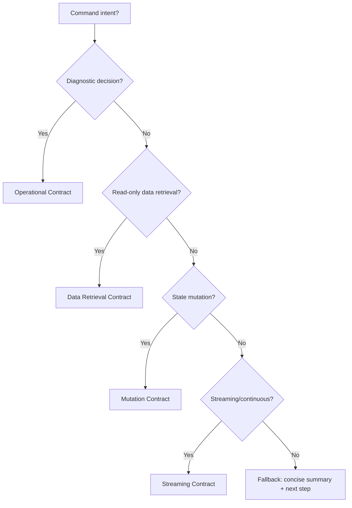

## Steer focus: CLI Steer

Design and maintain scenario CLIs as **thin, proto-first wrappers over the scenario API** in `scenarios/{{TARGET}}/cli/`. The CLI is the developer's primary interface — every Connect-RPC method on the API should be reachable as a CLI command via a generated Connect client, with the four REST exceptions reserved for the same reasons enforced at the API.

Do **not** break functionality, regress tests, or introduce features that don't exist in the API. All CLI changes must maintain feature parity with the API.

Required reading:
- `prompt-manager skill read api-steer` — the API contract this CLI mirrors; the four `RESTReason*` constants and `validateTransport` gate.
- `prompt-manager skill read visited-tracker-tools` — memory bookkeeping.
- `prompt-manager skill read knowledge-observatory-tools` — read and update stable docs.

Optional reading:
- `prompt-manager skill read interoperability-steer` — proto generation, casing, and Connect client patterns.

---

> **Template example domain — delete on generation.** The react-vite template ships a `notes` domain as a starter implementation; see `path:templates/scenarios/react-vite/cli/domains/notes/` for the concrete worked example. When you generate a new scenario from the template, **delete the `notes` domain and replace it with your own** — never carry it forward. Throughout this skill, `<domain>` (lowercase package / CLI noun), `<Domain>Service`, `<Resource>` (singular), and `<Resources>` (plural) are placeholders you substitute with your scenario's actual identifiers. Encountering one is the decision point: am I keeping `notes`, or did I forget to replace it?

---

### 1. Scope Boundaries

**In scope:**
- CLI architecture: command structure, argument parsing, output formatting
- cli-core integration: `ScenarioApp`, generated Connect clients, `UploadFile`, env derivation, stale detection
- Connect-RPC consumption: every proto-owned API method is reachable via a generated client
- REST-exception commands: multipart uploads, webhook test-fires, ops probes, third-party callbacks
- cross-platform concerns: Go binaries, portable installers
- developer experience: help text, error messages, discoverability, dry-run parity

**Out of scope:**
- API design (use `api-steer`)
- proto contracts and codegen workflow (use `interoperability-steer`)
- UI concerns
- domain/business logic (lives in the API, never in the CLI)

---

### 2. CLI Health Provider

Run CLI Health before manual judgment. The provider's default human output is the single source of truth for current local maturity, next level, blockers, global impact grouping, and recommended skill IDs:

```bash
cli-health validate scenario {{TARGET}}
```

Use this skill to interpret and fix the provider findings: scaffold, parity, generated Connect clients, report renderers, or drift gates. Do not duplicate or summarize CLI Health's `.vrooli/maturity.json` ladder in skill prose; if the ladder is wrong, fix `cli-health` or its maturity spec.

---

### 3. The CLI-API Relationship

**Core Principle:** The CLI is a thin wrapper. Business logic lives in the API.

```
   USER
    │
    ├── CLI ──┐
    ├── UI  ──┼──> API  ← all business logic lives here
    └── Agent ┘
```

**What the CLI does:**
- Parse arguments and flags
- Validate input format (not business rules)
- Call the API via a generated Connect client (or, for the four REST exceptions, via `APIClient`/`UploadFile`)
- Format and display output via cli-core report renderers
- Handle errors gracefully through `cliapp.WrapAPIError`

**What the CLI does NOT do:**
- Implement business logic
- Make decisions the API should make
- Store state beyond configuration
- Bypass the API for "efficiency"

---

### 4. cli-core: The Shared Foundation

All scenario CLIs use `cli-core` from `path:packages/cli-core/`.

| Component | Purpose | Import |
|---|---|---|
| `NewStandardScenarioApp` | Standard CLI scaffolding with env derivation, default `status`/`configure`, stale check, auto-start preflight | `cliapp.NewStandardScenarioApp` |
| `ScenarioApp` | Lower-level CLI scaffolding when standard isn't enough | `cliapp.ScenarioApp` |
| `NewConnectHTTPClient` | Build the `*http.Client` + base URL pair every generated Connect client needs | `cliapp.NewConnectHTTPClient` |
| `WrapAPIError` | Translate `*connect.Error` (and REST errors) into a uniform CLI error | `cliapp.WrapAPIError` |
| `UploadFile` | Multipart helper for the `multipart_upload` REST exception | `cliapp.UploadFile` |
| `APIClient` | Raw HTTP client — only used inside REST-exception commands | `cliutil.APIClient` |
| `StandardScenarioEnv` | Derive conventional env var names | `cliapp.StandardScenarioEnv` |
| `RenderListReport` / `RenderMutationReport` / `RenderOperationalReport` | Human report renderers | `cliapp.Render*Report` |
| `PrintReportJSON` / `RenderProtoList` / `RenderProtoMutation` | `--json` symmetry with proto-typed wire shapes | `cliapp.PrintReportJSON`, `cliapp.RenderProto*` |
| `ConfigFile` | JSON config persistence | `cliutil.ConfigFile` |
| `DetectPortFromVrooli` | Auto-discover API port | `cliutil.DetectPortFromVrooli` |
| `ParseInterspersed` | Argument parser that handles flags interspersed with positionals | `cliutil.ParseInterspersed` |
| Stale checking | Auto-rebuild when source changes | Built into `ScenarioApp` |

#### 4.2 Manifest-to-proto binding contract

The CLI manifest is also the declaration consumed by generic Connect
dispatchers. When a CLI argument name differs from the request field, declare
the projection in the manifest instead of duplicating request construction in a
handler:

```json
{
  "name": "schema",
  "required": true,
  "bind": {"field": "schema_json", "kind": "json_file"}
}
```

`bind` is valid on flags and positionals. Its `kind` is `raw_string`,
`json_inline`, or `json_file`; `json_file` reads the argument as a path and
decodes its JSON into the target field. The shared resolution ladder is:

1. explicit `bind.field` override;
2. exact argument/alias name match;
3. one-level auto-descent into the request's single non-repeated message
   envelope (for example, `role` → `request.role`);
4. otherwise report `binding.arg_unmapped` at validation time.

Top-level fields always win, and auto-descent never guesses among multiple
envelopes. `program-runtime bindings describe <id>` shows the selected path;
`bindings doctor` is the fleet-wide callability gate. Response construction is
generic, but a scenario may retain a curated human renderer through
`cliapp.ProtoBindingOptions.Render`.

The identity rule is strict: the proto declares what the server accepts, the
manifest declares how a human types it, and an argument's identity is the
proto field it populates. A name that is convenient for a CLI is not permission
to send its value to an unrelated field. Use the ladder above to resolve the
field, then validate the meaning of the resulting mapping.

The semantic gate reports four classes:

- `binding.field_collision` — two or more arguments target one field, so one
  value would overwrite another.
- `binding.control_flag_bound` — a CLI control such as `json`, `format`,
  `limit`, or `wait` is incorrectly sent as request data.
- `binding.required_field_unpopulated` — a request payload field marked
  required by its proto validation constraint has no supplying argument.
- `binding.bind_where_rename_suffices` — an explicit bind is redundant because
  the argument name already identifies the top-level field.

The first three are errors; the last is a warning. Fix them by correcting the
argument name/alias, removing the competing bind, or marking a genuinely
request-data control flag or explicit decoder bind with a waiver.
`bind_waiver` is a non-empty, per-argument explanation used only for a real
exception, for example a `format` argument that selects a server-side output
encoding or an argument that must retain an explicit file-aware decoder. It is
not a way to suppress an arbitrary collision or required-field error. Run
`program-runtime bindings doctor --json` for the fleet-wide counts and
`program-runtime bindings describe <id>` for one resolved path.

The general gate principle is: a metric that can be satisfied by declaring
something arbitrary is incomplete. Every headline number needs a rule that
makes the cheap path also the correct path.

**Why cli-core matters:**
- **Consistency** — all CLIs behave the same (flags, help, errors, output contracts)
- **DRY** — Connect client construction, HTTP, config, env vars are solved once
- **Anti-drift** — generated Connect clients prevent the CLI from drifting out of sync with API method names and shapes
- **Auto-maintenance** — stale binaries rebuild themselves

#### 4.1 CLI Implementation Decision Tree

```
Is there an existing CLI for {{TARGET}}?
├─ NO  → Copy template at templates/scenarios/react-vite/cli/
│        Register commands; each domain wires a generated Connect client.
└─ YES → Built on cli-core?
         ├─ YES → Incremental improvement
         │        ├─ Switch hand-written APIClient calls to generated Connect clients
         │        ├─ Adopt report renderers
         │        └─ Close API-parity gaps
         └─ NO  → Bash script or non-portable?
                  ├─ YES → Greenfield rewrite using the template
                  └─ NO  → Migrate Go-but-not-cli-core to cli-core
```

---

### 5. CLI Project Structure

Template location: `path:templates/scenarios/react-vite/cli/`

```text
scenarios/{{TARGET}}/cli/
├── main.go              # Entry point (minimal)
├── app.go               # App struct, metadata, cli-core wiring
├── go.mod               # Module with cli-core dependency
├── install.sh           # Cross-platform installer (bash)
├── install.ps1          # Windows installer (PowerShell)
└── domains/
    ├── domains.go       # Aggregate domain registration
    └── <domain>/
        ├── register.go  # Command tree + ArgSchema
        └── handlers.go  # Generated Connect client wiring + RunCtx funcs
```

Domain-package layout is the greenfield default. `cmd_<domain>.go` may exist temporarily in legacy CLIs but is not the planned architecture for a growing scenario.

#### 5.1 Endpoint-to-Command Mapping

The default is one CLI command per Connect-RPC method. REST exceptions map to specialized commands.

| API source | CLI command | Notes |
|---|---|---|
| `HealthService.Check` (RPC, but typically exposed as the `ops_probe` REST exception) | `status` (or `health`) | Default command for `NewStandardScenarioApp`. |
| `<Domain>Service.List<Resources>` | `<domain> list` | Connect client `<domain>connect.New<Domain>ServiceClient`. |
| `<Domain>Service.Get<Resource>` | `<domain> get <id>` | Positional id via `ArgSchema`. |
| `<Domain>Service.Create<Resource>` | `<domain> create --<field> <value> [--<field> <value>]` | Required flags enforced by `ArgSchema`. |
| `<Domain>Service.Update<Resource>` | `<domain> update <id> [--<field> …]` | |
| `<Domain>Service.Archive<Resource>` | `<domain> archive <id>` | Lifecycle command, not "delete". |
| `RunsService.StreamRunEvents` | `runs watch <id>` | Server-streaming Connect method. |
| `ImportsService.StartImport` + `ImportsService.GetImport` | `imports start` + `imports status <id>` | Long-running pair. |
| REST `multipart_upload` exception | `<domain> upload <file>` | Uses `cliapp.UploadFile`, not the Connect client. |
| REST `webhook_receiver` exception | `webhooks fire <name>` or operator-only command | Lives only if a developer-facing trigger is useful. |
| REST `third_party_shape` exception | Domain-named command | Calls `APIClient.Post` with the third-party shape. |
| REST `ops_probe` exception | `status`, `ready` | Plain GETs via `APIClient.Get` are appropriate here. |

**Steer:** Every Connect-RPC method should have a corresponding CLI command. REST endpoints appear in the CLI only when their `RESTException.Reason` justifies it (see `api-steer` §7).

---

### 6. Environment Variables and Configuration

Use `NewStandardScenarioApp()` by default. It already derives standard env wiring, default `status`, default `configure`, stale checking, and auto-start preflight.

```go
core, err := cliapp.NewStandardScenarioApp(cliapp.StandardScenarioOptions{
    Name:             appName,
    Version:          appVersion,
    Description:      "Example CLI",
    ExtraAPIEnvVars:  []string{"API_BASE_URL", "VITE_API_BASE_URL"},
    BuildFingerprint: buildFingerprint,
    BuildTimestamp:   buildTimestamp,
    BuildSourceRoot:  buildSourceRoot,
    AllowAnonymous:   true,
    CommandGroups:    domains.CommandGroups,
    SubcommandGroups: domains.SubcommandGroups,
})
```

Drop to `StandardScenarioEnv()` + `NewScenarioApp()` only when lower-level control is necessary.

> **Warning:** Do NOT add generic `API_PORT` to `ExtraAPIPortEnvVars`. The generic variable causes cross-scenario port leakage when CLIs run inside web-console terminal sessions. Rely on the scenario-specific `<SCENARIO>_API_PORT` (generated automatically) and the `DetectPortFromVrooli` fallback instead.

For scenario `test-genie`, the standard derivation yields:

| Purpose | Env Vars (in precedence order) |
|---|---|
| API Base URL | `TEST_GENIE_API_BASE`, `TEST_GENIE_API_URL`, `VROOLI_API_BASE` |
| API Port | `TEST_GENIE_API_PORT` |
| API Token | `TEST_GENIE_API_TOKEN`, `VROOLI_API_TOKEN` |
| Config Dir | `TEST_GENIE_CONFIG_DIR`, `VROOLI_CLI_CONFIG_DIR` |
| HTTP Timeout | `TEST_GENIE_HTTP_TIMEOUT`, `VROOLI_HTTP_TIMEOUT` |

#### 6.1 Resolution Precedence

```
API base URL resolution:
1. --api-base flag
2. Environment variables (from StandardScenarioEnv)
3. Config file (api_base field)
4. Port detection from Vrooli lifecycle
5. ScenarioOptions.DefaultAPIBase
```

Config file structure:

```json
{ "api_base": "http://localhost:15001", "token": "optional-auth-token" }
```

XDG-compliant config location precedence (first found wins): `$<SCENARIO>_CONFIG_DIR/config.json`, `$XDG_CONFIG_HOME/vrooli/<scenario>/config.json`, `~/.vrooli/config/<scenario>/config.json`, `~/.config/vrooli/<scenario>/config.json`.

---

### 7. Global Flags (Built-In)

| Flag | Purpose |
|---|---|
| `--api-base <url>` | Override API endpoint |
| `--auto-start` | Start scenario via `vrooli scenario start` if API unavailable |
| `--no-color` / `--color` | ANSI color control (also respects `NO_COLOR`) |
| `--json` | Machine-readable output (with `cliutil.JSONFlag`) |
| `--dry-run` | Sets `X-Dry-Run: true` on every outbound request automatically |
| `--help`, `-h` / `--version`, `-v` | Help / version |

**Do not reimplement these.**

---

### 8. Generated Connect Client Pattern (Default)

For every proto-owned API method, the CLI consumes the generated Connect client. The canonical worked example lives at `path:templates/scenarios/react-vite/cli/domains/notes/handlers.go` — see the template-example callout near the top of this skill; the `notes` domain is a starter you delete when generating a new scenario.

In the snippet below, `<domain>`, `<Domain>`, `<Resource>`, and `<Resources>` are placeholders. Substitute them with your scenario's actual domain identifiers (lowercase package / PascalCase service / singular & plural resource names).

```go
package <domain>

import (
    "context"
    "fmt"

    "connectrpc.com/connect"
    <domain>v1 "github.com/vrooli/vrooli/packages/proto/gen/go/{{SCENARIO_ID}}/v1/<domain>"
    <domain>connect "github.com/vrooli/vrooli/packages/proto/gen/go/{{SCENARIO_ID}}/v1/<domain>/<domain>_v1connect"

    "github.com/vrooli/cli-core/cliapp"
)

type handlers struct {
    core   *cliapp.ScenarioApp
    client <domain>connect.<Domain>ServiceClient
}

func newHandlers(core *cliapp.ScenarioApp) *handlers {
    httpClient, baseURL := cliapp.NewConnectHTTPClient(core)
    return &handlers{
        core:   core,
        client: <domain>connect.New<Domain>ServiceClient(httpClient, baseURL),
    }
}

func (h *handlers) create(ctx cliapp.RunContext) error {
    resp, err := h.client.Create<Resource>(context.Background(), connect.NewRequest(&<domain>v1.Create<Resource>Request{
        // Set request fields from ctx.Flag(...) values.
    }))
    if err != nil {
        return cliapp.WrapAPIError("create <resource>", err, nil)
    }
    if resp == nil || resp.Msg == nil || resp.Msg.<Resource> == nil {
        return fmt.Errorf("server returned no <resource>")
    }
    return cliapp.RenderProtoMutation(ctx, resp.Msg, cliapp.MutationReport{
        Result:  []string{fmt.Sprintf("Created <resource> %s.", resp.Msg.<Resource>.Id)},
        Changes: []string{format<Resource>(resp.Msg.<Resource>)},
        NextCommand: []string{
            fmt.Sprintf("`<domain> get %s` — show this <resource>", resp.Msg.<Resource>.Id),
            "`<domain> list` — show all <resources>",
        },
    })
}
```

Key points:
- `cliapp.NewConnectHTTPClient(core)` resolves the base URL through the same precedence as the rest of cli-core, so `--api-base`, env vars, and config file all work transparently.
- The generated client carries the proto-typed request/response messages — no `json.Unmarshal`, no field-name casing concerns, no manual proto-JSON options.
- `cliapp.WrapAPIError` understands `*connect.Error`; pass extra context as the second positional argument.
- `cliapp.RenderProtoList` and `cliapp.RenderProtoMutation` emit the proto-typed wire shape for `--json` consumers, and a human-friendly report otherwise.

#### 8.1 REST-Exception Command Pattern

For the four REST exceptions only — and only for the matching `RESTReason*` — fall back to `APIClient` / `UploadFile`:

```go
// multipart_upload exception
func (h *handlers) attach(ctx cliapp.RunContext) error {
    id := ctx.Positional("id")
    file := ctx.Flag("file")
    resp, err := cliapp.UploadFile(h.core, fmt.Sprintf("/<domain>/%s/attachments", id), "file", file, nil)
    if err != nil {
        return cliapp.WrapAPIError("attach file", err, nil)
    }
    // metadata is still proto-typed; parse via fromJson/protojson
    ...
}
```

If you find yourself reaching for `APIClient.Post` for an operation that has — or could have — a proto message, the right fix is to add the proto to the API, not to keep the REST shim. See `api-steer` §7.

---

### 9. Argument Parsing

Always use `cliutil.ParseInterspersed` instead of `fs.Parse`. Go's standard `flag.FlagSet.Parse()` stops at the first non-flag argument, which means `<domain> get my-id --json` silently drops `--json`. `ParseInterspersed` reorders args so flags come before positionals, then calls `fs.Parse`.

Prefer declaring command shapes via `ArgSchema` on `cliapp.Command` so cli-core handles required-positional and required-flag enforcement before the handler runs. Manual flag parsing is for legacy commands only.

| Pattern | Example | When |
|---|---|---|
| Positional | `get <id>` | Required, unambiguous |
| Flag | `--type unit` | Optional |
| Boolean flag | `--json`, `--verbose` | Output format / behavior |
| CSV list | `--types unit,integration` | Multiple values |
| File input | `--config @file.json` | Large payloads |

Helpers:
- `cliutil.ParseInterspersed(fs, args)` — required for any manual parsing
- `cliutil.ParseCSV(value)` — comma-separated values
- `cliutil.ReadFileString(value)` — read file if prefixed with `@`
- `cliutil.JSONFlag(fs)` — standard `--json`

---

### 10. Output Formatting

#### 10.1 Two Output Modes

Default human; `--json` for scripting. Prefer cli-core report renderers and their proto-aware variants.

```go
if ctx.JSON() {
    return cliapp.PrintReportJSON(os.Stdout, report)
}
return cliapp.RenderMutationReport(os.Stdout, report)
```

For Connect-typed responses, prefer `RenderProtoList` / `RenderProtoMutation` so `--json` emits the proto wire shape exactly as the server returned it.

#### 10.2 Human Output Contracts

| Contract | Command types | Structure |
|---|---|---|
| Operational | `status`, `health`, `audit`, `validate`, `doctor` | Status → Triage → Next Steps |
| Data Retrieval | `list`, `get`, `view`, `search` | Summary → Results → Retrieval hints |
| Mutation Result | `create`, `update`, `archive`, `start`, `stop` | Result → What changed → Next command |
| Streaming | `logs`, `watch`, `tail` | Header → Continuous events |

Convergence decision tree:



**Triage grouping rule:** group by remediation path (`auto-fix`, `agent repair`, `manual review`); show first few, then `+k more`.

**Next Steps rule:** copy-paste-ready commands; highest-impact first; one command per remediation group.

Implementation steer:
- `cliapp.RenderOperationalReport(...)` for diagnostic/decision commands
- `cliapp.RenderListReport(...)` for read/list commands
- `cliapp.RenderMutationReport(...)` for create/update/archive/start/stop
- `cliapp.PrintReportJSON(...)` for `--json` symmetry
- `cliapp.RenderProtoList` / `cliapp.RenderProtoMutation` when the response is a proto message and `--json` should be the wire shape

Promotion trigger: if the same troubleshooting clarification appears across multiple skills, treat it as a CLI product gap. Fix the default human output or add a general-purpose command rather than expanding prose.

#### 10.3 Error Output

```go
// Good — informative, wraps the typed Connect error
return cliapp.WrapAPIError("create <resource>", err, nil)

// Good — actionable
return fmt.Errorf("API not available at %s. Try --auto-start or check scenario status", apiBase)

// Bad — vague
return fmt.Errorf("error occurred")
```

#### 10.4 Progressive Disclosure

| Mode | Purpose | Guidance |
|---|---|---|
| Default (human) | Fast operator decisions | Concise status + triage + commands |
| `--verbose` | Expanded human diagnostics | More examples, same section structure |
| `--json` | Machine-readable automation | Proto-typed wire shape, full fidelity |

---

### 11. Stale Detection and Auto-Rebuild

cli-core embeds a source-tree fingerprint at build time and recomputes it at runtime before any `NeedsAPI: true` command. Mismatch → rebuild and re-exec with the same arguments.

```go
var (
    buildFingerprint = "unknown"  // injected at build
    buildTimestamp   = "unknown"  // injected at build
    buildSourceRoot  = ""         // injected at build
)
```

Edit source → next command rebuilds automatically. Users always run up-to-date code.

---

### 12. Installation

**install.sh** (Linux/macOS): calls `go run packages/cli-core/cmd/cli-installer`, installs to `~/.vrooli/bin/<scenario-name>`.

**install.ps1** (Windows): equivalent, installs to `%USERPROFILE%\bin\<scenario-name>`.

In `.vrooli/service.json`:

```json
{
  "cli": {
    "enabled": true,
    "command": "{{SCENARIO_ID}}",
    "adapter": { "kind": "go_module", "module_dir": "cli" },
    "install": [
      { "os": ["linux", "darwin"], "kind": "command", "run": "bash ./cli/install.sh" },
      { "os": ["windows"], "kind": "command", "run": "powershell -ExecutionPolicy Bypass -File .\\cli\\install.ps1" }
    ],
    "invoke": { "kind": "installed_command", "command": "{{SCENARIO_ID}}" },
    "freshness": { "inputs": ["cli/**", ".vrooli/service.json"] }
  }
}
```

The top-level `cli` section is the platform contract. `lifecycle.setup` should prepare runtime assets (API binaries, UI bundles), not install the CLI.

---

### 13. CLI Coherence Audit

#### 13.1 Audit Commands

```bash
# CLI exists and is Go-based
ls scenarios/{{TARGET}}/cli/
file scenarios/{{TARGET}}/cli/*.go 2>/dev/null

# Uses cli-core
grep "cli-core" scenarios/{{TARGET}}/cli/go.mod

# Positive signal: generated Connect clients in use
rg "connectrpc\.com/connect|_v1connect|NewConnectHTTPClient" scenarios/{{TARGET}}/cli --type go

# Red flag: raw APIClient calls outside REST-exception commands
rg "APIClient\.(Get|Post|Put|Delete|Patch)" scenarios/{{TARGET}}/cli --type go

# Red flag at the API side: hand-wired REST routes for proto-able operations
rg "r\.HandleFunc|router\.(GET|POST|PUT|DELETE|PATCH)" scenarios/{{TARGET}}/api --type go

# Command coverage vs API methods
rg "Name:\s*\"" scenarios/{{TARGET}}/cli --type go
rg "func \(s \*\w+Server\) [A-Z]\w+\(.*context.Context.*connect\.Request" scenarios/{{TARGET}}/api --type go

# Bash scripts masquerading as CLI
file scenarios/{{TARGET}}/cli/* | grep -i "shell\|bash\|script"

# fs.Parse usage (should be cliutil.ParseInterspersed)
rg "fs\.Parse\(" scenarios/{{TARGET}}/cli --type go
```

#### 13.2 Red Flags

- CLI is a bash script, not a Go binary
- No `go.mod` or doesn't import cli-core
- Hardcoded API URLs (should use env vars / config)
- Default output is hard to interpret or lacks clear next actions
- CLI calls the API via raw `APIClient.Post` / `fetch` for an operation that has — or could have — a generated Connect client
- Connect-RPC methods on the API without corresponding CLI commands
- REST-exception commands without a matching `RESTException` on the API side
- Commands that implement business logic instead of calling the API
- No `install.sh` / `install.ps1`
- Commands that don't use `NeedsAPI: true` when calling the API
- Duplicate HTTP client code (should use `cliapp.NewConnectHTTPClient` or `APIClient`)
- `fs.Parse()` instead of `cliutil.ParseInterspersed()` for mixed positional+flag args
- Mutating commands that don't honor `--dry-run`

#### 13.3 Recording Findings

Do not create a standalone `CLI_AUDIT.md`. Use `knowledge-observatory-tools` to record findings in stable docs:

- `scenarios/{{TARGET}}/docs/concepts/ARCHITECTURE.md` — CLI surface map (domains, commands, Connect-client wiring), maturity by domain.
- `scenarios/{{TARGET}}/docs/internal/SEAMS.md` — CLI seams (Connect client factory, `UploadFile` adapter, output renderers).
- `scenarios/{{TARGET}}/docs/internal/PROBLEMS.md` — API-parity gaps, lingering `APIClient` calls that should move to Connect, missing dry-run support.

One-off audit reports are acceptable only for a migration handoff; they should have a clear retirement path into the three stable docs above.

Recommended architecture addition:

```markdown
## CLI Surface

| Domain | Command Group | Backing RPC / REST Exception | Maturity | Notes |
|---|---|---|---|---|
```

---

### 14. Memory Management with Visited Tracker

Use the `visited-tracker-tools` skill with:
- LOCATION: `scenarios/{{TARGET}}/cli`
- TAG: `cli-steer`

---

### 15. Dry-Run Support

The `--dry-run` global flag is built into cli-core. When a user passes `--dry-run`, the CLI sets an `X-Dry-Run: true` header on every outbound request automatically — Connect-RPC included, REST exceptions included. **No CLI-side changes are needed per scenario.**

The API side must honor it. For Connect-RPC handlers:

1. Run full validation through `protovalidate` (invalid requests still fail normally).
2. Before the first side effect, check the header (`cliutil.IsDryRun(ctx)` if importing cli-core, or read the header directly):
   ```go
   if isDryRun(ctx) {
       return connect.NewResponse(&<domain>v1.Create<Resource>Response{
           <Resource>: planned<Resource>,   // realistic, with id/timestamps
           DryRun:     true,
       }), nil
   }
   ```
3. Return a realistic typed response so callers can verify the shape end to end.

Conventions:
- Include a `dry_run` field (or equivalent) in the proto response message so consumers can branch deterministically.
- Use `connect.NewResponse` with the same response message type as a real call.
- Run the same validation path as a real request.

For REST handlers, apply the same `isDryRun` check before mutation and return a realistic typed response.

For REST-exception endpoints, the same contract applies: short-circuit with a realistic JSON body that includes `"dry_run": true` and `http.StatusOK`.

---

### **16. Output Expectations**

You may update in `scenarios/{{TARGET}}/cli/`:
- migrate hand-written `APIClient.Get/Post` calls to generated Connect clients for any proto-owned RPC
- add new commands for Connect-RPC methods that lack CLI coverage
- adopt `cliapp.Render*Report` renderers and `RenderProto*` variants
- improve argument parsing, help text, and error wrapping
- add cross-platform installers if missing
- refactor commands into domain packages

You may update in `scenarios/{{TARGET}}/.vrooli/service.json`:
- add or correct the top-level `cli` manifest section

You must:
- keep `{{TARGET}}` fully functional and non-regressed
- maintain feature parity between CLI and API
- use `cliapp.NewConnectHTTPClient` + generated Connect clients for proto-owned operations
- reserve raw `APIClient` / `UploadFile` for the four REST exceptions
- keep default output human-friendly and actionable; keep `--json` proto-shape-accurate
- include cross-platform installation scripts
- update `ARCHITECTURE.md` / `SEAMS.md` / `PROBLEMS.md` via `knowledge-observatory-tools` to reflect changes

You must NOT:
- implement business logic in the CLI (belongs in the API)
- create bash scripts for CLI functionality (use Go)
- bypass cli-core utilities with custom HTTP / config code
- use raw `APIClient` calls for operations that have a generated Connect client
- add commands for features that don't exist in the API
- remove existing functionality without replacement
- create standalone `CLI_AUDIT.md` files as the default memory surface

**Avoid superficial changes that only rename things or restructure code without improving CLI quality, Connect-client coverage, or API parity.**

Last updated: 2026-05-12
