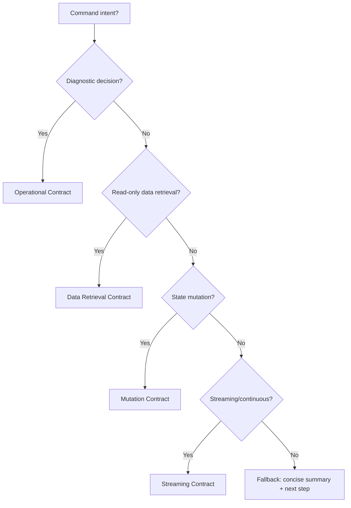

## Steer focus: CLI Steer

Design and maintain scenario CLIs as **thin, professional wrappers over the API**. The CLI is the developer's primary interface to the scenario—treat it as a product with the same care given to the API itself.

Your goal is to ensure the target scenario's CLI is **cross-platform, feature-complete with the API, and built on cli-core** for consistency across the Vrooli ecosystem.

Do **not** break functionality, regress tests, or introduce features that don't exist in the API. All CLI changes must maintain feature parity with the API.

Required reading:
- `prompt-manager skills read api-steer visited-tracker-tools`

Optional reading:
- `prompt-manager skills read interoperability-steer`

---

### 0. Why This Skill Exists

In Vrooli, the CLI is not "just a convenience wrapper"—it is:
- The **developer's primary interface** to the scenario (faster than UI for power users)
- A **thin translation layer** that maps human-friendly commands to API operations
- The foundation for **scripting and automation** (CI/CD, agent orchestration)
- A **consistency surface**: all scenario CLIs should feel familiar

Without shared patterns, CLIs diverge:
- Different argument styles, output formats, error handling
- Bash scripts that only work on Linux
- Duplicate HTTP client code, config management, etc.
- CLIs that drift out of sync with API capabilities

This skill steers toward CLIs that are:
- **Built on cli-core** (shared scaffolding, utilities, patterns)
- **Cross-platform** (Go binaries, not bash scripts)
- **API-mirroring** (every API endpoint has a CLI command)
- **Self-maintaining** (stale detection, auto-rebuild)
- **Professional** (consistent help, errors, output formatting)

---

### 1. Scope Boundaries

**In scope**
- CLI architecture: command structure, argument parsing, output formatting
- cli-core integration: proper use of ScenarioApp, APIClient, utilities
- Cross-platform concerns: Go-based CLI, portable installers
- API parity: ensuring CLI exposes all API capabilities
- Configuration: environment variables, config files, precedence
- Developer experience: help text, error messages, discoverability

**Out of scope**
- API design (see `api-steer`)
- Proto contracts (see `interoperability-steer`)
- UI concerns
- Deep business logic (belongs in API, not CLI)

---

### 2. The CLI-API Relationship

**Core Principle:** The CLI is a thin wrapper. Business logic lives in the API.

```
┌─────────────────────────────────────────────────────────────────┐
│                         USER                                     │
│                           │                                      │
│            ┌──────────────┼──────────────┐                      │
│            ▼              ▼              ▼                      │
│         ┌─────┐       ┌─────┐       ┌─────┐                     │
│         │ CLI │       │ UI  │       │Agent│                     │
│         └──┬──┘       └──┬──┘       └──┬──┘                     │
│            │             │             │                         │
│            └─────────────┼─────────────┘                         │
│                          ▼                                       │
│                   ┌──────────────┐                               │
│                   │     API      │  ← All business logic here    │
│                   └──────────────┘                               │
└─────────────────────────────────────────────────────────────────┘
```

**What the CLI does:**
- Parse arguments and flags
- Validate input format (not business rules)
- Call the API
- Format and display output
- Handle errors gracefully

**What the CLI does NOT do:**
- Implement business logic
- Make decisions the API should make
- Store state beyond configuration
- Bypass the API for "efficiency"

---

### 3. cli-core: The Shared Foundation

All scenario CLIs must use `cli-core` from `packages/cli-core/`. This provides:

| Component | Purpose | Import |
|-----------|---------|--------|
| `ScenarioApp` | CLI scaffolding, command routing, global flags | `cliapp.ScenarioApp` |
| `APIClient` | HTTP client with base URL, token, timeout handling | `cliutil.APIClient` |
| `StandardScenarioEnv` | Derive conventional env var names | `cliapp.StandardScenarioEnv()` |
| `ConfigFile` | JSON config persistence | `cliutil.ConfigFile` |
| `DetectPortFromVrooli` | Auto-discover API port | `cliutil.DetectPortFromVrooli()` |
| Stale checking | Auto-rebuild when source changes | Built into ScenarioApp |

**Why cli-core matters:**
- **Consistency**: All CLIs behave the same way (flags, help, errors)
- **DRY**: HTTP handling, config, env vars are solved once
- **Auto-maintenance**: Stale binaries rebuild themselves
- **Professional**: Users learn one CLI, know them all

#### 3.1 Convergence Pattern: CLI Implementation Decision Tree

```
Is there an existing CLI for {{TARGET}}?
│
├─ NO → Use template at scripts/scenarios/templates/react-vite/cli/
│       └─ Copy template, update constants, register commands
│
└─ YES → Is it built on cli-core?
         │
         ├─ YES → Incremental improvement
         │        └─ Add commands, fix issues, improve help text
         │
         └─ NO → Is it a pure bash script or non-portable?
                 │
                 ├─ YES → Greenfield rewrite using template
                 │        └─ Treat as if no CLI exists
                 │
                 └─ NO (Go but not cli-core) → Migrate to cli-core
                          └─ Refactor to use ScenarioApp, APIClient
```

---

### 4. CLI Project Structure

**Template location:** `scripts/scenarios/templates/react-vite/cli/`

**Standard structure:**
```
scenarios/{{TARGET}}/cli/
├── main.go              # Entry point (minimal)
├── app.go               # App struct, command registration
├── go.mod               # Module with cli-core dependency
├── install.sh           # Cross-platform installer (bash)
└── install.ps1          # Windows installer (PowerShell)
```

**For larger CLIs with many commands:**
```
scenarios/{{TARGET}}/cli/
├── main.go
├── app.go
├── go.mod
├── install.sh
├── install.ps1
├── health/              # Domain-specific command package
│   ├── command.go       # Run() function
│   ├── client.go        # API client wrapper
│   └── types.go         # Request/Response types
├── resources/           # Another domain
│   ├── command.go
│   └── ...
└── ...
```

#### 4.1 go.mod Pattern

```go
module {{TARGET}}/cli

go 1.22

require github.com/vrooli/cli-core v0.0.0

replace github.com/vrooli/cli-core => ../../../packages/cli-core
```

**Key points:**
- Single dependency on cli-core
- Replace directive points to local packages
- Relative path: `../../../packages/cli-core`

---

### 5. Command Registration Pattern

Commands are organized into **CommandGroups** by functional domain.

```go
func (a *App) registerCommands() []cliapp.CommandGroup {
    health := cliapp.CommandGroup{
        Title: "Health",
        Commands: []cliapp.Command{
            {
                Name:        "status",
                Aliases:     []string{"health"},
                NeedsAPI:    true,
                Description: "Check API health and readiness",
                Run:         a.cmdStatus,
            },
        },
    }

    resources := cliapp.CommandGroup{
        Title: "Resources",
        Commands: []cliapp.Command{
            {Name: "list", NeedsAPI: true, Description: "List all resources", Run: a.cmdList},
            {Name: "get", NeedsAPI: true, Description: "Get resource by ID", Run: a.cmdGet},
            {Name: "create", NeedsAPI: true, Description: "Create new resource", Run: a.cmdCreate},
        },
    }

    config := cliapp.CommandGroup{
        Title: "Configuration",
        Commands: []cliapp.Command{
            a.core.ConfigureCommand([]string{"api_base"}, []string{"token", "api_token"}),
        },
    }

    return []cliapp.CommandGroup{health, resources, config}
}
```

#### 5.1 Command Field Reference

| Field | Required | Purpose |
|-------|----------|---------|
| `Name` | Yes | Primary command name |
| `Aliases` | No | Alternative names (e.g., `health` for `status`) |
| `Description` | Yes | Help text (shown in `--help`) |
| `NeedsAPI` | Yes | If true: validates API connectivity, triggers stale check |
| `Run` | Yes | Function signature: `func(args []string) error` |

#### 5.2 Convergence Pattern: API Endpoint to CLI Command Mapping

| API Pattern | CLI Command | Example |
|-------------|-------------|---------|
| `GET /health` | `status` or `health` | `test-genie status` |
| `GET /api/v1/{resources}` | `{resource} list` | `test-genie suite list` |
| `GET /api/v1/{resources}/{id}` | `{resource} get <id>` | `test-genie suite get abc123` |
| `POST /api/v1/{resources}` | `{resource} create` | `test-genie suite create --name foo` |
| `PUT /api/v1/{resources}/{id}` | `{resource} update <id>` | `test-genie suite update abc123` |
| `DELETE /api/v1/{resources}/{id}` | `{resource} delete <id>` | `test-genie suite delete abc123` |
| `POST /api/v1/{resources}:action` | `{resource} {action}` | `test-genie suite execute` |

**Steer:** Every API endpoint should have a corresponding CLI command. If the CLI is missing commands, it's incomplete.

---

### 6. Environment Variables and Configuration

#### 6.1 Standard Environment Variable Derivation

Use `StandardScenarioEnv()` to derive conventional env var names:

```go
env := cliapp.StandardScenarioEnv(appName, cliapp.ScenarioEnvOptions{
    ExtraAPIEnvVars: []string{"API_BASE_URL", "VITE_API_BASE_URL"},
})
```

> **Warning:** Do NOT add generic `API_PORT` to `ExtraAPIPortEnvVars`. The generic
> variable causes cross-scenario port leakage when CLIs run inside web-console
> terminal sessions. Rely on the scenario-specific `<SCENARIO>_API_PORT` (generated
> automatically) and the `DetectPortFromVrooli` fallback instead.

For scenario `test-genie`, this generates:

| Purpose | Env Vars (in precedence order) |
|---------|--------------------------------|
| API Base URL | `TEST_GENIE_API_BASE`, `TEST_GENIE_API_URL`, `VROOLI_API_BASE` |
| API Port | `TEST_GENIE_API_PORT` |
| API Token | `TEST_GENIE_API_TOKEN`, `VROOLI_API_TOKEN` |
| Config Dir | `TEST_GENIE_CONFIG_DIR`, `VROOLI_CLI_CONFIG_DIR` |
| HTTP Timeout | `TEST_GENIE_HTTP_TIMEOUT`, `VROOLI_HTTP_TIMEOUT` |

#### 6.2 Configuration File Location

Config is stored in platform-appropriate directories (XDG compliant):

```
Precedence (first found wins):
1. $<SCENARIO>_CONFIG_DIR/config.json
2. $XDG_CONFIG_HOME/vrooli/<scenario>/config.json
3. ~/.vrooli/config/<scenario>/config.json
4. ~/.config/vrooli/<scenario>/config.json
```

**Config file structure:**
```json
{
  "api_base": "http://localhost:15001",
  "token": "optional-auth-token"
}
```

#### 6.3 Resolution Precedence

```
How is API base URL resolved?
│
├─ 1. --api-base flag (highest priority)
├─ 2. Environment variables (in order from StandardScenarioEnv)
├─ 3. Config file (api_base field)
├─ 4. Port detection from Vrooli lifecycle
└─ 5. Default (if specified in ScenarioOptions.DefaultAPIBase)
```

---

### 7. Global Flags (Built-In)

All cli-core CLIs automatically support these flags:

| Flag | Purpose |
|------|---------|
| `--api-base <url>` | Override API endpoint |
| `--auto-start` | Start scenario via `vrooli scenario start` if API unavailable |
| `--no-color` | Disable ANSI colors (also respects `NO_COLOR` env var) |
| `--color` | Force-enable colors |
| `--help`, `-h` | Show help |
| `--version`, `-v` | Show version |

**Do not reimplement these.** They come free from cli-core.

---

### 8. Argument Parsing Pattern

**Important:** Always use `cliutil.ParseInterspersed` instead of `fs.Parse`. Go's standard `flag.FlagSet.Parse()` stops at the first non-flag argument, which means `task status my-id --status pending` silently drops `--status pending`. `ParseInterspersed` reorders args so flags come before positionals, then calls `fs.Parse` — a zero-risk drop-in fix.

```go
func (a *App) cmdCreate(args []string) error {
    // 1. Define flags
    fs := flag.NewFlagSet("create", flag.ContinueOnError)
    typeFlag := fs.String("type", "default", "Resource type")
    jsonOutput := cliutil.JSONFlag(fs)  // Standard --json flag

    // 2. Parse with interspersed support (handles "create myname --type foo")
    if err := cliutil.ParseInterspersed(fs, args); err != nil {
        return err
    }

    // 3. Check required positional arguments
    if fs.NArg() < 1 {
        return fmt.Errorf("usage: create <name> [--type TYPE] [--json]")
    }
    name := fs.Arg(0)

    // 3. Build request
    req := CreateRequest{
        Name: name,
        Type: *typeFlag,
    }

    // 4. Call API
    body, err := a.core.APIClient.Post("/api/v1/resources", nil, req)
    if err != nil {
        return err
    }

    // 5. Output (respect --json flag)
    if *jsonOutput {
        cliutil.PrintJSON(body)
        return nil
    }

    // Human-friendly output
    var resp CreateResponse
    if err := json.Unmarshal(body, &resp); err != nil {
        return fmt.Errorf("parse response: %w", err)
    }
    fmt.Printf("Created resource: %s (ID: %s)\n", resp.Name, resp.ID)
    return nil
}
```

#### 8.1 Argument Conventions

| Pattern | Example | When to Use |
|---------|---------|-------------|
| Positional | `get <id>` | Required, unambiguous arguments |
| Flag | `--type unit` | Optional parameters |
| Boolean flag | `--json`, `--verbose` | Output format, behavior modifiers |
| CSV list | `--types unit,integration` | Multiple values |
| File input | `--config @file.json` | Large payloads |

**Utilities for parsing:**
- `cliutil.ParseInterspersed(fs, args)` — Parse flags interspersed with positional args (use instead of `fs.Parse`)
- `cliutil.ParseCSV(value)` — Parse comma-separated values
- `cliutil.ReadFileString(value)` — Read file if prefixed with `@`
- `cliutil.JSONFlag(fs)` — Add standard `--json` flag

---

### 9. Output Formatting

#### 9.1 Two Output Modes

Most commands should support both human-readable and machine-readable output.
Default behavior must be human-friendly and actionable.

```go
if *jsonOutput {
    cliutil.PrintJSON(body)  // Raw JSON for scripting
} else {
    // Human-friendly formatted output
    fmt.Printf("Status: %s\n", resp.Status)
    fmt.Printf("Created: %s\n", resp.CreatedAt)
}
```

**Mode policy:**
- Default mode is canonical for operators and agents
- `--json` is supported for integration/debug/export paths
- Skills should default to human mode unless machine-readable output is explicitly required

#### 9.2 Error Output

```go
// Good - informative error
return fmt.Errorf("failed to create resource: %w", err)

// Good - actionable error
return fmt.Errorf("API not available at %s. Try --auto-start or check scenario status", apiBase)

// Bad - vague error
return fmt.Errorf("error occurred")
```

#### 9.3 Human Output Contracts

Use the contract that matches command intent:

| Contract | Command types | Structure |
|------|------|------|
| Operational | `status`, `health`, `audit`, `validate`, `doctor` | `Status -> Triage -> Next Steps` |
| Data Retrieval | `list`, `get`, `view`, `search` | `Summary -> Results -> Retrieval hints` |
| Mutation Result | `create`, `update`, `delete`, `start`, `stop` | `Result -> What changed -> Next command` |
| Streaming | `logs`, `watch`, `tail` | `Header -> Continuous events` |

Convergence decision tree:



#### 9.4 Operational Output Contract (Status -> Triage -> Next Steps)

For **diagnostic/decision commands** (for example: `status`, `health`, `audit`, `validate`, `doctor`), use this default human-readable structure:

1. **Status** (short summary)
2. **Triage** (group findings by remediation path)
3. **Next Steps** (exact commands to run now)

This keeps output concise for operators while still giving agents a stable structure to understand and act on directly.

**Use this format when the user needs to answer:**
- What is wrong?
- How severe is it?
- What should I do next?

**Do not force this format for all commands.** It is usually not appropriate for:
- Pure data retrieval (`list`, `get`, `view`, `search`)
- Single direct mutations (`create`, `update`, `delete`, `start`, `stop`)
- Streaming outputs (`logs`, `watch`, `tail`)

**Triage grouping rule:**
- Group by remediation path (for example: `auto-fix now`, `agent repair`, `manual review`)
- Show the first few items (for example: 3), then summarize as `+k more`
- Keep category names action-oriented

**Next Steps rule:**
- Include copy-paste-ready commands
- Put highest-impact command first
- Prefer one command per remediation group

Promotion trigger:
- If the same troubleshooting clarification appears across multiple Tools skills (or repeatedly in one skill's `Troubleshooting & Edge Cases`), treat that as a CLI product gap.
- Prefer fixing CLI default human output (`Status -> Triage -> Next Steps`) or adding a general-purpose command over expanding prose guidance.
- Cross-skill contract: when `skill-validation` or `skill-improvement-suggestions` surfaces repeated troubleshooting clarifications, convert them into CLI backlog candidates with explicit output-contract intent.

#### 9.5 Progressive Disclosure for Output

Use three levels of detail:

| Mode | Purpose | Guidance |
|------|---------|----------|
| Default (human) | Fast operator decisions | Concise status + triage + commands |
| `--verbose` | Expanded human diagnostics | More examples/details, same section structure |
| `--json` | Machine-readable automation | Full response fidelity, stable fields |

**Steer:** Keep default human output as the primary product surface. Keep `--json` complete and deterministic for integration use cases.

---

### 10. Stale Detection and Auto-Rebuild

cli-core includes automatic stale detection:

1. **At build time**: Source tree fingerprint is embedded in binary
2. **At runtime**: Before commands with `NeedsAPI: true`, fingerprint is recomputed
3. **On mismatch**: Binary is rebuilt and re-executed with same arguments

**What this means for developers:**
- Edit source → Next command triggers rebuild automatically
- No manual rebuild step needed during development
- Users always run up-to-date code

**Configuration in app.go:**
```go
var (
    buildFingerprint = "unknown"  // Injected at build
    buildTimestamp   = "unknown"  // Injected at build
    buildSourceRoot  = ""         // Injected at build
)

core, err := cliapp.NewScenarioApp(cliapp.ScenarioOptions{
    // ...
    BuildFingerprint:  buildFingerprint,
    BuildTimestamp:    buildTimestamp,
    BuildSourceRoot:   buildSourceRoot,
})
```

---

### 11. Installation Pattern

#### 11.1 Cross-Platform Installers

**install.sh** (Bash - Linux/macOS):
```bash
#!/usr/bin/env bash
set -euo pipefail
# Calls go run packages/cli-core/cmd/cli-installer
# Installs to ~/.vrooli/bin/<scenario-name>
```

**install.ps1** (PowerShell - Windows):
```powershell
# Equivalent Windows implementation
# Installs to %USERPROFILE%\bin\<scenario-name>
```

#### 11.2 Lifecycle Integration

In `.vrooli/service.json`:
```json
{
  "lifecycle": {
    "setup": {
      "steps": [
        {"name": "install-cli", "run": "cd cli && ./install.sh"}
      ]
    }
  }
}
```

**Steer:** CLI installation should be part of scenario setup, not a manual step.

---

### 12. CLI Coherence Audit

When inheriting or improving an existing scenario CLI, first assess current state.

#### 12.1 Audit Commands

```bash
# Check if CLI exists and is Go-based
ls scenarios/{{TARGET}}/cli/
file scenarios/{{TARGET}}/cli/*.go 2>/dev/null

# Check if using cli-core
grep "cli-core" scenarios/{{TARGET}}/cli/go.mod

# Find all commands registered
rg "Name:\s*\"" scenarios/{{TARGET}}/cli/ --type go

# Find API endpoints to compare coverage
rg "func.*Handler|router\.(GET|POST|PUT|DELETE)" scenarios/{{TARGET}}/api/ --type go

# Check for bash scripts masquerading as CLI
file scenarios/{{TARGET}}/cli/* | grep -i "shell\|bash\|script"
```

#### 12.2 Red Flags Checklist

- [ ] CLI is a bash script, not Go binary
- [ ] No go.mod or doesn't import cli-core
- [ ] Hardcoded API URLs (should use env vars / config)
- [ ] Default output is hard to interpret or lacks clear next actions
- [ ] Commands require parsing pipelines for normal operator/agent workflows
- [ ] API endpoints without corresponding CLI commands
- [ ] Commands that implement business logic instead of calling API
- [ ] No install.sh / install.ps1 for cross-platform installation
- [ ] Commands that don't use `NeedsAPI: true` when calling API
- [ ] Duplicate HTTP client code (should use cli-core's APIClient)
- [ ] Commands using `fs.Parse()` instead of `cliutil.ParseInterspersed()` for mixed positional+flag args

#### 12.3 Document Findings

Record audit results in `scenarios/{{TARGET}}/docs/internal/CLI_AUDIT.md`:

```markdown
# {{TARGET}} CLI Audit

## Last Updated
[Date]

## Current State
- [ ] Go-based CLI exists
- [ ] Uses cli-core package
- [ ] Cross-platform installers present
- [ ] All API endpoints have CLI commands

## API Coverage
| API Endpoint | CLI Command | Status |
|--------------|-------------|--------|
| GET /health | status | ✅ |
| POST /api/v1/resources | resource create | ❌ Missing |
| ... | ... | ... |

## Issues Found
1. [Issue with file reference]
2. ...

## Priority Fixes
1. [Highest impact]
2. ...
```

---

### 13. Memory Management with Visited Tracker

Use the `visited-tracker-tools` skill for tracking visited files, with LOCATION set to `scenarios/{{TARGET}}/cli` and TAG set to `cli-steer`.

---

### 14. Output Expectations

You may update in `scenarios/{{TARGET}}/cli/`:
- Migrate existing CLI to use cli-core patterns
- Add new commands for API endpoints that lack CLI coverage
- Improve argument parsing, help text, error messages
- Add cross-platform installers if missing
- Refactor command organization into domain packages

You may update in `scenarios/{{TARGET}}/.vrooli/service.json`:
- Add CLI installation step to lifecycle setup

You must:
- Keep `{{TARGET}}` fully functional and non-regressed
- Maintain feature parity between CLI and API
- Use cli-core for all shared functionality (HTTP, config, env vars)
- Keep default output human-friendly and actionable
- Most commands should support JSON output (`--json`) for machine-readable workflows
- Include cross-platform installation scripts
- For promoted troubleshooting fixes, define how default human output improves and how to verify that behavior change

You must NOT:
- Implement business logic in CLI (belongs in API)
- Create bash scripts for CLI functionality (use Go)
- Bypass cli-core utilities with custom HTTP/config code
- Add commands for features that don't exist in API
- Remove existing functionality without replacement

**Avoid superficial changes that only rename things or restructure code without improving CLI quality or API coverage.**

---

### 15. Dry-Run Support

The `--dry-run` global flag is built into cli-core. When a user passes `--dry-run`, the CLI sets an `X-Dry-Run: true` header on every request automatically. **No CLI-side changes are needed per scenario.**

**API handlers must implement dry-run support** for all mutating endpoints:

1. Run full validation (invalid requests still fail normally)
2. Before the first mutation (database write, side effect, etc.), check for dry-run:
   ```go
   if isDryRun(r) {
       writeJSON(w, map[string]any{
           "success": true,
           "dry_run": true,
           "task":    validatedTask, // realistic response data
       }, http.StatusOK)
       return
   }
   ```
3. Return realistic response data (populated IDs, timestamps, etc.) so callers can verify the shape

**Conventions:**
- Include `"dry_run": true` in all dry-run responses
- Use `http.StatusOK` (not 201/204) since nothing was actually created/deleted
- Run the same validation path as the real request
- Return data that mirrors what the real response would look like

**Reference implementation:** `scenarios/ecosystem-manager/api/pkg/handlers/tasks.go` (`CreateTaskHandler`, `UpdateTaskHandler`, `DeleteTaskHandler`)

**Helper:** Add `isDryRun(r *http.Request) bool` to your handlers package (checks `X-Dry-Run` header). The canonical helper is `cliutil.IsDryRun(r)` in cli-core for Go APIs that import it directly.

#### Red Flags Checklist Addition

- [ ] Mutating API endpoints without dry-run support
