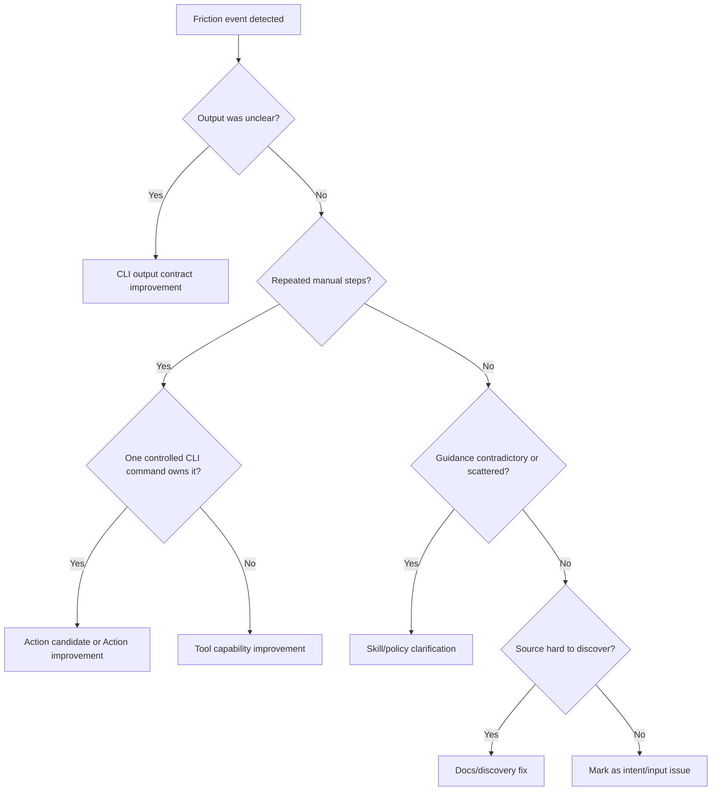

## Meta focus: Conversation Friction Analysis

Analyze a goal-oriented conversation to identify friction points, attribute root causes, and propose high-leverage fixes across skills, CLI/tooling, docs, and process policy.

Required reading:
- `docs/agent-system/SKILL_AUTHORING.md`
- `docs/agent-system/PROMOTION_LADDER.md`

Optional reading:
- `prompt-manager skill read skill-validation`
- `prompt-manager skill read skill-improvement-suggestions`
- `prompt-manager skill read cli-steer`

---

### 1. Why This Matters

Conversation friction is where agent capability leaks:
- retries caused by ambiguity
- repeated clarifications
- command/flag mismatches
- dead-end troubleshooting loops
- context bloat from patching prose instead of improving tools

One friction point can waste many future sessions if not fixed at the right layer.
This skill turns one conversation into system-level improvements.

---

### 2. Scope Boundaries

**In scope:**
- Reconstructing conversation timeline and pivots
- Finding friction events and evidence
- Root-cause attribution (skill/tool/docs/process/intent)
- Recommending fixes with priority and ownership
- Suggesting promotion from prose workarounds to CLI/tool improvements and Action contracts when one command can own execution

**Out of scope:**
- Implementing all recommendations automatically
- Product roadmap debates not grounded in conversation evidence
- Blaming users/agents instead of improving system interfaces

---

### 3. Inputs

Use one or more:
- Current conversation context (default)
- Transcript/log file path
- External chat/session ID (for systems that expose transcript retrieval)

Optional:
- Target objective for analysis (for example: "reduce retries" or "shrink skill bloat")
- Scope filter (skills only, tooling only, docs only)

Input reliability rule:
- If transcript source is partial or missing sections, mark findings that depend on it as `unverified`.

---

### 4. Analysis Workflow

Run in order.

#### Step A: Build the Timeline

Extract:
- initial goal
- major pivots/redirections
- notable retries, stalls, and reversals
- final outcomes

Output artifact:
- compact ordered timeline (event ID + timestamp/order + action + result)

#### Step B: Extract Friction Events

Define a friction event as any point where progress slowed, reversed, or required avoidable extra work.

Common friction signals:
- repeated clarification on the same point
- conflicting instructions across skills/docs
- command examples that fail or force guessing
- output that is non-actionable for next step decisions
- repeated "manual interpretation" loops

For each event capture:
- evidence snippet
- immediate impact (time/tokens/retries/risk)
- recurrence risk (one-off vs likely systemic)

#### Step C: Attribute Root Cause

Classify each friction event into one primary layer:
- `Skill design`: ambiguity, missing guardrails, scattered long-tail details
- `CLI/tool output`: weak next actions, poor defaults, selector/ID confusion
- `Action discovery`: deterministic operation has a CLI surface but no discoverable Action, or agents miss an existing Action
- `Tool capability`: missing command for repeated manual pattern
- `Docs/discovery`: source of truth hard to find, stale references
- `Process/policy`: no clear escalation path, conflicting governance rules
- `Intent/inputs`: missing prerequisites or unstable objectives

If multiple layers apply, set:
- `primary_cause`
- `contributing_causes[]`

#### Step D: Find the Highest-Leverage Fix

For each event, propose one or more fixes and score:
- `impact` (1-5): expected reduction in future friction
- `recurrence` (1-5): how often this likely repeats
- `cost` (1-5): effort/risk to implement

Priority score:
- `priority = (impact * recurrence) - cost`

Prefer fixes that:
- remove repeated manual interpretation
- improve default CLI human output contracts
- expose stable one-command operations through Actions
- reduce policy ambiguity across skills

#### Step E: Map Fixes to Owners and Artifacts

Every recommendation must specify:
- owner layer (`skill`, `cli/tool`, `docs`, `policy`)
- target artifact (file/command/module)
- expected behavior change
- verification method

#### Step F: Convergence Check

Ensure recommendations are:
- evidence-backed
- non-duplicative
- appropriately layered (do not solve tooling gaps with only prose if avoidable)
- compatible with existing principles (human-first CLI consumption, selector-first flows)

#### Step G: Retirement Mapping (Required for CLI-Operational Friction)

Apply the canonical lifecycle from `docs/agent-system/PROMOTION_LADDER.md`.

For each systemic friction pattern tied to skill prose workarounds, classify:
- `Keep` (durable policy/safety/ownership rule)
- `Collapse` (replace detailed prose with CLI output contract guidance)
- `Collapse to Action` (replace detailed command prose with an Action reference)
- `Delete` (fully superseded by durable CLI/tooling behavior)

When using `Collapse` or `Delete`, specify:
- trigger contract (existing or proposed CLI/tool output behavior),
- target skill section/gate for compression/removal,
- residual risk if retirement happens before tooling updates land.

---

### 5. Convergence Patterns

Use this decision flow for each friction event:



Escalation rule:
- If the same pattern appears 2+ times in a conversation, treat it as systemic and recommend a durable fix (tooling or policy), not just local wording edits.
- If repeated friction is currently handled via prose workarounds, recommend a CLI/tooling conversion path first; when one command owns execution, recommend an Action and keep prose updates minimal/interim.

---

### 6. Severity Model

| Severity | Definition | Typical action |
|---|---|---|
| Critical | Blocks delivery, risks unsafe action, or causes repeated hard failure | Immediate policy/tooling fix |
| Major | Causes frequent retries/guessing and unstable execution | Patch skill/tool output soon |
| Gap | Capability implied but not operationally enabled | Add capability or explicit handoff |
| Minor | Clarity/friction improvements with low immediate risk | Queue for batch improvement |

Rule:
- "Forces the agent to guess next action" is at least `Major`.

---

### 7. Guardrails

- Do not overfit to one conversation if evidence suggests one-off conditions.
- Do not prescribe rigid templates where only one standardization seam is needed.
- Prefer promoting repeat friction into tooling/output contracts before adding prose.
- Keep recommendations implementation-ready (no vague "be clearer" advice).
- Distinguish facts from inferences explicitly.
- If a recommendation adds wording only, explicitly state why a CLI/tool fix is not currently the better layer.

---

### 8. Output Expectations

Produce this report:

```markdown
# Conversation Friction Analysis

## Summary
- Goal: ...
- Outcome: ...
- Main friction pattern: ...
- Highest-leverage intervention: ...

## Timeline
| Event ID | Phase | What Happened | Result |
|---|---|---|---|
| T1 | ... | ... | ... |

## Friction Register
| ID | Evidence | Impact | Recurrence | Primary Cause | Contributing Causes | Severity |
|---|---|---|---|---|---|---|
| F1 | ... | ... | ... | ... | ... | ... |

## Recommendations
| ID | Recommendation | Layer | Target Artifact | Priority Score | Verification |
|---|---|---|---|---|---|
| R1 | ... | cli/tool | ... | ... | ... |

## Promotion Candidates
| Source Workaround | Promote To | Expected Benefit |
|---|---|---|
| ... | Action / CLI output contract / new command / policy update | ... |

## Retirement Candidates
| Skill Section / Workaround | Decision (Keep/Collapse/Delete) | Trigger Contract | Risk |
|---|---|---|---|
| ... | ... | ... | ... |

## Conversion Signal
- Prose workaround count: ...
- Durable CLI/tool conversion count: ...
- Notes: [Interpretation of whether layering is healthy or prose-heavy]

## Execution Plan
1. ...
2. ...
3. ...

## Risks and Assumptions
- ...
```

---

### 9. Optional Follow-Through Skills

Use based on recommendation type:
- Skill correctness/coherence updates: `skill-validation`
- Tooling/wording optimization: `skill-improvement-suggestions`
- CLI output and UX upgrades: `cli-steer`

---

### 10. Applicability Note

No known operational edge cases for standard usage when full transcript context is available.
If context is partial or externally provided, treat uncertain findings as `unverified`.
