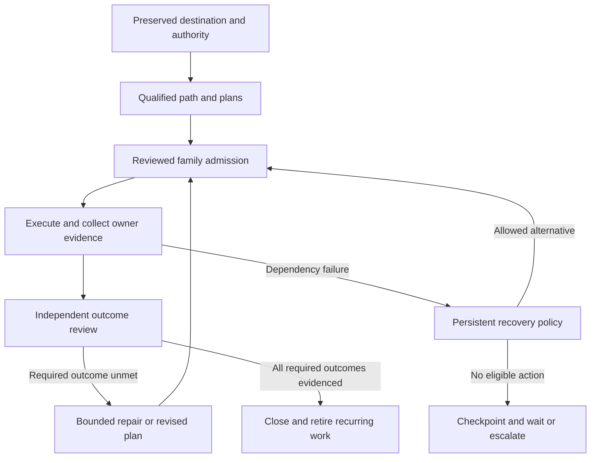

## Practice focus: Large effort orchestration

Turn a large request into a finite, recoverable effort without losing its intent or spending the whole investment repairing infrastructure. Preserve the destination, delegate coherent work, and close only against evidence for that destination.

This skill owns cross-round judgment, source preservation, and recovery policy. Plan Manager owns implementation plans and family admission. Agent Manager owns runs and supervision. Swarm Manager owns its work and grants when selected. The effort workspace joins those owners; it does not replace them.

Use two agent responsibilities: planners own outcomes and decomposition; workers deliver bounded assignments. A planner may delegate a narrower planning branch. Keep process monitoring, dispatch admission, timers and retry accounting in deterministic owner code. A planning tree does not replace that runtime supervision tree.

Read `prompt-manager skill read implementation-plan-authoring plan-family-orchestration` when creating plans or a family. Read `prompt-manager skill read agent-manager-plan-family-supervision program-runtime` before managed dispatch. For an approved scenario improvement mandate, use `scenario-improvement-campaign` and the scenario's improve skill inside that mandate.

Supporting files below use repository paths because native skill projection does not install supporting assets:
- For workspace creation or resumption, read `path:scenarios/prompt-manager/store/skills/packs/core/large-effort-orchestration/references/workspace.md`.
- For failed capabilities, ambiguous launches or repair diversion, read `path:scenarios/prompt-manager/store/skills/packs/core/large-effort-orchestration/references/recovery.md`.

### 1. Preserve the request and authority

Entry: the user supplies a large outcome or an existing effort reference.

1. Discover related work and reusable programs through Search Hub before inventing another work owner.
2. Resume the existing effort when its identity and destination match.
3. Preserve source statements, constraints, uncertainty, decisions and examples with stable requirement IDs.
4. Separate user requirements, agent recommendations, observed facts and unverified assumptions.
5. Map every requirement to a deliverable, accountable owner and observable acceptance condition.
6. Record the execution boundary, exclusions, budget, completion policy and permitted fallback routes.

An approved destination permits in-scope implementation choices and repair; it does not approve new destinations. Record the actual session authorization or owner grant. Never invent a human approval receipt. For a planning/review request, create the skill, dossier and plans, but leave execution and recurring schedules inactive.

Exit: another agent can recover the full destination and authority without this conversation. The user has one review entrypoint.

### 2. Qualify the path and prepare plans

Entry: the destination is preserved.

Perform one representative, low-impact check for each capability actually needed by the next work. A health response, help page or wrapper completion proves only that surface. Inspect relevant existing failure evidence. Avoid probing every service in the ecosystem.

Before relying on subagents, qualify the selected dispatch and monitoring route. Verify requested versus effective runner/model, reasoning effort and supported goal/completion behavior, plus durable run identity, result/wait, cancellation and uncertain-start reconciliation. A health check or declared profile is insufficient. Extract missing core delegation into an upfront prerequisite when necessary; do not postpone it with the full recurring-supervision platform. Bootstrap that prerequisite through a directly supervised qualified session without circular dependence on unproven delegation. Independent work may continue only where its actual prerequisites are satisfied.

Classify each dependency as observed usable, insufficient, unavailable, or unverified, with scope and evidence. Check a real output when the distinction matters. Apply the recovery policy before repairing a dependency.

Delegate bounded investigation and plan authoring in parallel where their source claims do not conflict. Reuse existing plans after reading their current execution state; a draft label or old blocked phase alone does not establish missing work. Author plans through Plan Manager, with the full change boundary and source requirement references. Candidate files are permitted only in the authoring skill's explicit candidate mode; label them unfinalized.

Add a subplanner only when it owns a distinct outcome that would otherwise overload its parent. Workers do not coordinate with siblings or edit a shared scheduling file. They return one durable result to their assigning parent; the owner transport deduplicates retries of that handoff. Research, authoring, implementation and independent review are assignments, not permanent departments. Keep the tree shallow, with one effort-wide active-agent ceiling and usage allowance across every level. A child cannot create fresh budget by spawning descendants.

Register independently executable plans in one family. Record shared package, generated-output, database and lifecycle claims. Let the current reviewed frontier determine admission. Family topology review can use an authorized reviewer; it need not create another human approval for every in-scope plan.

Exit: each requirement is covered, deferred by an explicit user decision, or visibly unresolved. Plans expose dependencies and evidence; none claim runtime qualification that has not occurred.

### 3. Admit and supervise bounded work

Entry: execution is authorized and the selected route is qualified.

Use Swarm's declared workflow when it represents the effort's authority and autonomous continuation correctly. Otherwise select the authorized Agent Manager family/workflow route. Do not change a global autonomy setting to automate one effort. Preserve any owner-required human disposition separately from automatic evidence assessment.

Persist work identity, admission, dispatch key, selected member context and expected result before spawning. Give each worker one coherent plan or investigation, its allowed paths, required evidence, recovery allowance and return contract. Use existing plan-execution guidance. Request native goal mode only when that exact runner supports it; otherwise use the durable workflow's continuation and completion contract. A prompt saying "keep going" is not a persisted goal.

Choose the least expensive qualified profile for the assignment. Respect the user's worker-model and effort preferences; do not silently inherit a premium planner model. Reserve stronger profiles for ambiguous decomposition, consequential design decisions or an evidenced failed lower-cost attempt. Record the escalation reason and remaining allowance. Check the installed runner's exact model identifier, supported settings, account availability and current tariff before relying on a route; a public model listing does not prove local access or sufficient credits. Compare cost per accepted outcome, including the root planner, review, retries and rework, rather than token price alone. Unknown root usage is reserved, not omitted from the aggregate allowance.

Persist selected runner/profile/model, credential-pool reference, policy revision, reserved usage and required capabilities with admission. Limit strong-model concurrency separately. Keep context bounded through source pointers and stable shared prompt sections. Use isolated worker checkouts when the owner supports them; still declare schema, generated-output, integration and live-service conflicts. Independent review remains a bounded worker assignment for material outcomes. Do not create a permanent judge or integration agent for every task.

Reuse Program Runtime compositions for repeated joins and bounded fan-out. Read a discovered program and its owner skill together. Runtime code must retain owner IDs, cancellation, budgets, partial results and idempotency. Promote repeated deterministic composition only after its inputs and stop rule are known. Put state-machine, repair and scheduling invariants in their owning scenario, not a private shell loop or a growing program.

The leader advances every useful admitted branch before waiting. On pending work, park on a supported producer or checkpoint and end its turn. A configured recurring wake is a recovery opportunity, not a queue: skip while the leader is running, queued, parked or uncertain. Qualify restart/outage behavior before enabling unattended wakeups. Never interpret an unavailable run lookup as a dead process.

For runner exhaustion, use the recovery reference to distinguish context capacity, session/weekly subscription limits, transient rate limits, exhausted API credits and denied access. Persist a checkpoint and owner wake condition. A timer or reset event should make work eligible once; repeated leader ticks must not create new attempts against the same exhausted allowance. Runtime restarts and provider fallback consume the original effort budget.

Exit: work is complete, durably pending, or bounded by a recorded recovery decision. No child exists solely in the leader's recollection.

### 4. Review evidence and choose the next round

Entry: a coherent delivery batch has returned.

Read producer evidence and current owner state when useful results arrive; do not wait for unrelated branches to finish a global round. Assign an independent review task for material architecture or user journeys. Apply the original acceptance conditions and relevant scenario quality standards, including reliability, performance and maintainability where the outcome requires them. Review source-to-deliverable coverage again. Preserve release gates even when isolated development branches contain unfinished work.

| Review result | Next action |
|---|---|
| Credible required behavior still fails | Repair or author a bounded follow-up plan under the same destination. |
| New architectural issue jeopardizes the accepted outcome | Retain evidence, allocate repair budget and update the owning plan/family. |
| Cosmetic improvement or unrelated defect | Retain a finding; do not expand the completion gate. |
| Same diagnosis returns without changed evidence | Open the circuit; choose an allowed alternative or retain the blocker. |
| Evidence is missing or stale for a required outcome | Obtain proportionate evidence; keep that outcome unverified. |
| Required outcomes have applicable evidence | Prepare completion and retire recurring work. |

A new round needs a concrete unmet outcome and a falsifiable intervention. Repeating audits, renaming findings or increasing plan counts is not progress. Keep effort/component repair totals across rounds and leader restarts.

Exit: a supported completion decision or a specific next round with unchanged acceptance and explicit remaining investment.

### 5. Close or hand off

Entry: no further immediately eligible work remains.

If required outcomes remain, write the next action, pending owner IDs, blockers, exhausted circuits and reopening conditions. Preserve uncertain dispatches and actual owner waits. Follow the owner's wait contract; client cancellation does not end server work.

If the effort is complete, retain deliverable and validation references, residual accepted limitations and reproducible use instructions. Disable its recurring heartbeat through Prompt Manager and verify the terminal state prevents another launch. Archive the finite team's context without deleting its evidence. Production teams that continue serving their own objectives remain active.

The coordinator may edit this effort's evolving strategy, findings and handoffs within the granted workspace. Preserve approved source and acceptance revisions. That permission does not authorize changes to another team's plan of record or new product goals.

### Anti-patterns and output

| Anti-pattern | Consequence | Correction |
|---|---|---|
| Folder copies plan/run status as authority | Resumed agents launch duplicate or obsolete work | Store owner IDs and timestamped projections. |
| Every dependency gets a full audit | Infrastructure consumes the deliverable budget | Qualify the needed operation, then repair by consequence. |
| Each new plan resets repair attempts | A broken component absorbs unlimited work | Count by effort, component and stable failure identity. |
| Transport uncertainty triggers another launcher | Two agents may mutate the same work | Reconcile the first dispatch before changing routes. |
| Workaround silently lowers acceptance | The user receives an incomplete outcome labelled done | Preserve the unmet gate or request an actual scope decision. |
| Global auto-approval substitutes for an effort grant | Unrelated work changes authority | Use a scoped route and existing authorization. |
| Every tree level multiplies workers or retries | A small tree exhausts quota and repair allowance | Reserve capacity and usage against one effort-wide owner. |
| Quota exhaustion is treated as a coding defect | Workers restart without a chance of succeeding | Persist the reset condition and pause that allowance pool. |
| Every worker inherits the planner's expensive model | Routine work consumes scarce quota | Bind an explicit economical worker profile and justified escalation. |
| Infinite scrutiny after the destination is met | Completion becomes unreachable | Close on the recorded acceptance policy. |

### Troubleshooting & Edge Cases

Read the recovery reference for restart decisions, quota waits, uncertain dispatch and route changes. A missing credential, exhausted budget or policy denial is an owner state to report; a different launcher cannot make the denied effect admissible. Keep protected effort sources out of cleanup candidates, including parent-directory cleanup and disk-pressure automation. Use Storage Manager and the control-plane protection contract to verify preservation without deleting real artifacts.

Produce a validated effort workspace, source coverage, owner plan/run references, capability observations, cumulative recovery decisions, review evidence and a concise next action. Use `docs/TESTING.md` for validation scope and durable waits. Record completed non-trivial work through the shared Memory contract with references, not copied operational ledgers.
