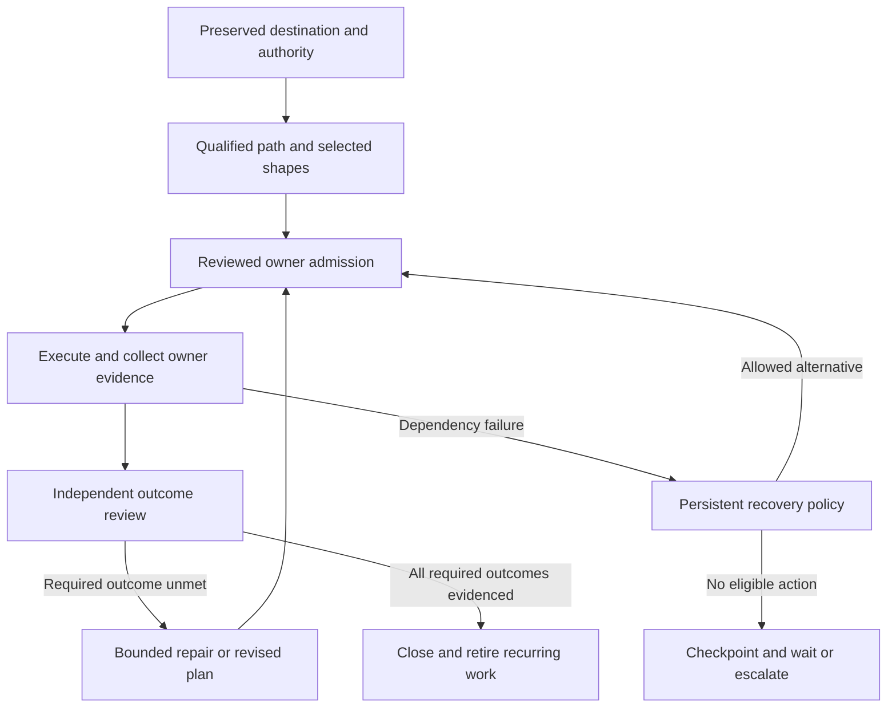

## Practice focus: Large effort orchestration

Turn a large request into a finite, recoverable effort without losing its intent or spending the whole investment repairing infrastructure. Large efforts use one governed start model: a finite, effort-based Prompt Manager delivery team coordinates bounded work; Agent Manager owns runs and outcomes; Swarm Manager owns grants and dispositions; Plan Manager owns plans only when the selected work shape requires one. Preserve the destination, delegate coherent work, and close only against evidence for that destination.

This skill owns cross-round judgment, source preservation, and recovery policy. Plan Manager owns implementation plans and family admission. Agent Manager owns runs and supervision. Swarm Manager owns its work and grants when selected. The effort workspace joins those owners; it does not replace them.

Use two agent responsibilities: planners own outcomes and decomposition; workers deliver bounded assignments. A planner may delegate a narrower planning branch. A finite team roster does not limit the coordinator's child-run capacity: an empty org beyond the coordinator still requires direct Agent Manager child delegation for bounded delivery. Keep process monitoring, dispatch admission, timers and retry accounting in deterministic owner code. A planning tree does not replace that runtime supervision tree.

Choose each assignment's shape with `docs/agent-system/SWARM_MANAGER_WORK.md` §"Work shapes" and write the assignment with `prompt-manager skill read harness-goal-authoring`. Read `prompt-manager skill read implementation-plan-authoring plan-family-orchestration` when creating plans or a family. Read `prompt-manager skill read agent-manager-plan-family-supervision program-runtime` before managed dispatch. For an approved scenario improvement mandate, use `scenario-improvement-campaign` and the scenario's improve skill inside that mandate.

Supporting files below use repository paths because native skill projection does not install supporting assets:
- For workspace creation or resumption, read `path:scenarios/prompt-manager/store/skills/packs/core/large-effort-orchestration/references/workspace.md`.
- For failed capabilities, ambiguous launches or repair diversion, read `path:scenarios/prompt-manager/store/skills/packs/core/large-effort-orchestration/references/recovery.md`.

### 1. Preserve the request and authority

For efforts enrolled with an operational supervisor, read
`path:docs/agent-system/EFFORT_SUPERVISION.md`. Retain the supervisor's identity
and owner directive channel. Acknowledge delivered guidance, name justified waits,
and challenge stale or incorrect instructions with evidence. Keep worker assignment
with one parent and preserve accepted outcomes. Supervision does not grant another
writer access to active effort control files. Read `large-effort-supervision` when
assigned to assess orchestrators rather than deliver this effort.

Entry: the user supplies a large outcome or an existing effort reference.

#### Canonical team-native start

1. Create or resume one finite delivery team and one protected effort workspace. Record purpose, finite lifetime, mission, exact effort reference, leader, operating contract, serialized execution policy and acceptance revision. Team metadata describes coordination; it does not grant authority.
2. Register or verify the team's Source Ledger scope. Persist the coordinator goal and source references in the effort workspace; keep the workspace a recoverable index, never a second owner ledger.
3. Qualify the exact team, runner, profile, model, owner route and recovery behavior with a disposable finite fixture. The fixture must exercise registration, contract validation, a disabled finite-leader binding, one controlled owner admission, identity/receipt reconciliation, lifecycle transitions and explicit recurrence/recovery limits.
4. Provision the finite-leader binding disabled with exact effort, accepted revision, coordinator prompt and source references. Obtain one explicit operator activation for that exact effort revision, then enable the finite team. An enabled binding is an ongoing execution mandate inside the accepted destination; it is not permission to expand scope. Do not insert a second approval gate for ordinary in-boundary implementation, UX, documentation, validation or handoff work.
5. When approved, enable only the finite team and its qualified member, admit the first run through the governed team execution route, and reconcile the PM admission identity with the Agent Manager task/run and handoff. Keep the UX effort inactive until this sequence and its approval gate are complete.

The finite team's operating contract is the coordinator's recovery handoff. Team registration, heartbeat provisioning, owner-run admission, continuation authority and accepted completion are separate states. A completed run is not accepted work; an explicit revision-checked completion receipt is required. Recurring continuation and fresh-run recovery are separate gates: a heartbeat tick may observe a retained owner wait or recovery condition, but it cannot invent a continuation edge, replacement run, grant or approval. Uncertain dispatch retains its exact identity until the owner reconciles it; it never authorizes a speculative retry.

1. Discover related work and reusable programs through Search Hub before inventing another work owner.
2. Resume the existing effort when its identity and destination match.
3. Preserve source statements, constraints, uncertainty, decisions and examples with stable requirement IDs.
4. Separate user requirements, agent recommendations, observed facts and unverified assumptions.
5. Map every requirement to a deliverable, accountable owner and observable acceptance condition.
6. Record the execution boundary, exclusions, budget, completion policy and permitted fallback routes.

An approved destination permits in-scope implementation choices and repair; it does not approve new destinations. Record the actual session authorization or owner grant. Never invent a human approval receipt. For a planning/review request, create the skill, dossier and plans, but leave execution and recurring schedules inactive.

For an autonomous delivery effort, fix a delivery-blocking capability before
filing a passive report when the active authority covers the repair. This includes
the agent-system core substrate: `agent-manager`, `prompt-manager`,
`program-runtime`, `test-genie`, `plan-manager`, `swarm-manager`,
`workspace-sandbox`, and `development-toolchain-validator`, including their
scenario-owned skills and governed programs. Use the owning scenario's write and
validation route, preserve its contract, and continue the original effort.
The Promotion Ladder is not an approval gate for an authorized skill or program
edit; it governs later stabilization, compression, and retirement.

Route or report only when the repair exceeds the mandate, affects protected
control files or another effort, or requires a new decision, credential,
dependency, host mutation, global policy change, or production effect. Retain the
repair's before/after evidence and account for its cost in the effort.

Exit: another agent can recover the full destination and authority without this conversation. The user has one review entrypoint.

### 2. Qualify the path and select work shapes

Entry: the destination is preserved.

Perform one representative, low-impact check for each capability actually needed by the next work. A health response, help page or wrapper completion proves only that surface. Inspect relevant existing failure evidence. Avoid probing every service in the ecosystem.

Before relying on subagents, qualify the selected dispatch and monitoring route. Verify requested versus effective runner/model, reasoning effort and supported goal/completion behavior, plus durable run identity, result/wait, cancellation and uncertain-start reconciliation. A health check or declared profile is insufficient. Extract missing core delegation into an upfront prerequisite when necessary; do not postpone it with the full recurring-supervision platform. Bootstrap that prerequisite through a directly supervised qualified session without circular dependence on unproven delegation. Independent work may continue only where its actual prerequisites are satisfied.

Classify each dependency as observed usable, insufficient, unavailable, or unverified, with scope and evidence. Check a real output when the distinction matters. Apply the recovery policy before repairing a dependency.

Before dispatching implementation, confirm the target documentation describes the intended design. When it does not, the first assignment is a bounded docs-first authoring task, so later goals point at the docs instead of restating them.

Delegate bounded investigation, docs-first authoring and shape-specific authoring in parallel where their source claims do not conflict. Reuse existing plans after reading their current execution state; a draft label or old blocked phase alone does not establish missing work. A plan is one work shape; author one only where the Work shapes rule selects it. Author plans through Plan Manager, with the full change boundary and source requirement references. Candidate files are permitted only in the authoring skill's explicit candidate mode; label them unfinalized.

Add a subplanner only when it owns a distinct outcome that would otherwise overload its parent. Workers do not coordinate with siblings or edit a shared scheduling file. They return one durable result to their assigning parent; the owner transport deduplicates retries of that handoff. Research, authoring, implementation and independent review are assignments, not permanent departments. Keep the tree shallow, with one effort-wide active-agent ceiling and usage allowance across every level. A child cannot create fresh budget by spawning descendants.

Create a plan family only when `plan-family-orchestration` selects it: two or
more plan-shaped units have independent identities or lifecycles and explicit
dependencies or resource overlap. Register those members and their shared
package, generated-output, database and lifecycle claims. Do not make phases of
one plan, bounded tasks, investigations or every worker into family members.
Let the current reviewed frontier determine admission. Family topology review
can use an authorized reviewer; it need not create another human approval for
every in-scope plan.

Exit: each requirement is covered, deferred by an explicit user decision, or visibly unresolved. The team, effort workspace and owner views expose exact identities and evidence; none claim runtime qualification that has not occurred.

### 3. Admit and supervise bounded work

Entry: execution is authorized and the selected route is qualified.

For autonomous delivery, use the qualified Agent Manager family/workflow route
or direct child-run delegation as the default. The coordinator must spawn and
manage bounded child agents, retain their parent/child identities, and advance
the accepted effort without a human response. Swarm Manager is not the delivery
runtime and must not be used to create backlog items, open a Plan Workshop,
await human plan acceptance, or queue implementation for an already-authorized
effort. Use Swarm only when the selected effect genuinely requires a
Swarm-owned grant or disposition—such as new scope, production access, paid
spend, private data or an unapproved decision. If a plan-shaped assignment
needs Plan Manager, invoke its autonomous owner route directly; a missing plan
is an agent responsibility to author through that route, not a reason to stop
for a human. If the selected owner route is unavailable, use the qualified
direct Agent Manager fallback and record the reduced guarantee; do not convert
delivery into a human-in-the-loop backlog workflow.

Persist work identity, admission, dispatch key, selected member context and expected result before spawning. Give each worker one assignment in one work shape: plan-backed, adaptive mandate, bounded task, or investigation. Write it as a harness goal per `harness-goal-authoring`: destination, proof, sources, boundary, dials, blocked, budget, handoff. Use existing plan-execution guidance for plan-backed work. When dispatching through Agent Manager, pass the destination clause as `until`; the engine delivers it natively where the runner declares support and as prompt text otherwise. A prompt saying "keep going" is not a persisted goal.

Choose the least expensive qualified profile for the assignment. Respect the user's worker-model and effort preferences; do not silently inherit a premium planner model. Reserve stronger profiles for ambiguous decomposition, consequential design decisions or an evidenced failed lower-cost attempt. Record the escalation reason and remaining allowance. Check the installed runner's exact model identifier, supported settings, account availability and current tariff before relying on a route; a public model listing does not prove local access or sufficient credits. Compare cost per accepted outcome, including the root planner, review, retries and rework, rather than token price alone. Unknown root usage is reserved, not omitted from the aggregate allowance.

Persist selected runner/profile/model, credential-pool reference, policy revision, reserved usage and required capabilities with admission. Limit strong-model concurrency separately. Keep context bounded through source pointers and stable shared prompt sections. Use isolated worker checkouts when the owner supports them; still declare schema, generated-output, integration and live-service conflicts. Independent review remains a bounded worker assignment for material outcomes. Do not create a permanent judge or integration agent for every task.

The standing effort supervisor observes the team-native effort through the owner board and exact work references. It is not the finite coordinator, does not become a private scheduler, and cannot derive authority from its standing membership or a heartbeat. Legacy drivers and bespoke shell/tmux loops are migration evidence only; they are not a supported second start model.

Reuse Program Runtime compositions for repeated joins and bounded fan-out. Read a discovered program and its owner skill together. Runtime code must retain owner IDs, cancellation, budgets, partial results and idempotency. Promote repeated deterministic composition only after its inputs and stop rule are known. Put state-machine, repair and scheduling invariants in their owning scenario, not a private shell loop or a growing program.

The leader advances every useful admitted branch before waiting. When delegated child
runs are pending, represent them with exact parent/child identities and one durable
Agent Manager cohort watch. Park the parent on the supervision watch with an explicit
deadline; a terminal child wakes the same parent run with bounded evidence, while the
deadline is only a watchdog for missed events or stuck children. A configured recurring
wake is a recovery opportunity, not a queue: skip while the leader is running, queued,
parked or uncertain. Qualify restart/outage behavior before enabling unattended
wakeups. Never interpret an unavailable run lookup as a dead process.

The supported coordinator sequence is:

1. Read the verified parent identity with `agent-manager run identity --json`.
2. Create each child with `agent-manager run create --parent-run-id <parent-run-id>`
   and retain every returned task/run identity.
3. Create one `agent-manager watch` cohort whose `parent_run_id` is the coordinator
   and whose subjects are exactly those child run IDs.
4. Park the coordinator with
   `agent-manager run park <parent-run-id> --producer supervision --key <watch-id>`
   and a bounded watchdog deadline.
5. On wake, reconcile the exact children and watch result, cancel the settled watch,
   and choose the next bounded action in the same parent run.

Do not claim to be parked from prompt text alone. Do not poll children in a loop or
create a replacement coordinator because a watch is uncertain. A terminal parent
run is not accepted completion; write the revision-checked completion receipt and
retire the finite binding when the destination is actually met.

A maintenance admission fence belongs to the operation recorded in its owner,
reason and revision. Do not reopen a different operation's hold to admit your
workers or assume it was left over from a restart. Coordinate the owner release
condition and preserve admitted work. A changed revision invalidates your drain
proof; do not compete with another maintainer in a close/resume loop.

For runner exhaustion, use the recovery reference to distinguish context capacity, session/weekly subscription limits, transient rate limits, exhausted API credits and denied access. Persist a checkpoint and owner wake condition. A timer or reset event should make work eligible once; repeated leader ticks must not create new attempts against the same exhausted allowance. Runtime restarts and provider fallback consume the original effort budget.

Exit: work is complete, durably pending, or bounded by a recorded recovery decision. No child exists solely in the leader's recollection.

Before enabling recurring finite wakes, prove separately that the owner can select an explicit continuation, the accepted grant and revision propagate to that continuation, a lost response reconciles to the original task/run identity, restart/outage recovery preserves the reservation, and retirement prevents replacement dispatch. If any gate is unqualified, keep the finite heartbeat disabled and use a single explicitly admitted run or a recorded owner wait.

When a dispatched finite leader run is terminal but the effort has not earned a
completion receipt, use the owner’s explicit terminal-run restart operation.
The owner must reread and verify that exact task/run identity is terminal,
retain its evidence reference, record the restart history, and clear only the
reusable reservation. Never delete the old reservation or reset it solely from
the prompt text. A restarted run is still subject to the same accepted effort
revision and must earn its own handoff or completion evidence.

### 4. Review evidence and choose the next round

Entry: a coherent delivery batch has returned.

Read producer evidence and current owner state when useful results arrive; do not wait for unrelated branches to finish a global round. Assign an independent review task for material architecture or user journeys. Apply the original acceptance conditions and relevant scenario quality standards, including reliability, performance and maintainability where the outcome requires them. Review source-to-deliverable coverage again. Preserve release gates even when isolated development branches contain unfinished work.

| Review result | Next action |
|---|---|
| Credible required behavior still fails | Repair or author a bounded follow-up plan under the same destination. |
| New architectural issue jeopardizes the accepted outcome | Retain evidence, allocate repair budget and update the owning plan/family. |
| Cosmetic improvement or unrelated defect | Retain a finding; do not expand the completion gate. |
| Same diagnosis returns without changed evidence | Open the circuit; choose an allowed alternative or retain the blocker. |
| Evidence is missing or stale for a required outcome | Obtain proportionate evidence; keep that outcome unverified. |
| Required outcomes have applicable evidence | Prepare completion and retire recurring work. |

A new round needs a concrete unmet outcome and a falsifiable intervention. Repeating audits, renaming findings or increasing plan counts is not progress. Keep effort/component repair totals across rounds and leader restarts.

Exit: a supported completion decision or a specific next round with unchanged acceptance and explicit remaining investment.

### 5. Close or hand off

Entry: no further immediately eligible work remains.

If required outcomes remain, write the next action, pending owner IDs, blockers, exhausted circuits and reopening conditions. Preserve uncertain dispatches and actual owner waits. Follow the owner's wait contract; client cancellation does not end server work.

If the effort is complete, retain deliverable and validation references, residual accepted limitations and reproducible use instructions. Disable its recurring heartbeat through Prompt Manager and verify the terminal state prevents another launch. Archive the finite team's context without deleting its evidence. Production teams that continue serving their own objectives remain active.

The coordinator may edit this effort's evolving strategy, findings and handoffs within the granted workspace. Preserve approved source and acceptance revisions. That permission does not authorize changes to another team's plan of record or new product goals.

### Anti-patterns and output

| Anti-pattern | Consequence | Correction |
|---|---|---|
| Folder copies plan/run status as authority | Resumed agents launch duplicate or obsolete work | Store owner IDs and timestamped projections. |
| Every dependency gets a full audit | Infrastructure consumes the deliverable budget | Qualify the needed operation, then repair by consequence. |
| Each new plan resets repair attempts | A broken component absorbs unlimited work | Count by effort, component and stable failure identity. |
| Transport uncertainty triggers another launcher | Two agents may mutate the same work | Reconcile the first dispatch before changing routes. |
| Workaround silently lowers acceptance | The user receives an incomplete outcome labelled done | Preserve the unmet gate or request an actual scope decision. |
| Global auto-approval substitutes for an effort grant | Unrelated work changes authority | Use a scoped route and existing authorization. |
| Every tree level multiplies workers or retries | A small tree exhausts quota and repair allowance | Reserve capacity and usage against one effort-wide owner. |
| Quota exhaustion is treated as a coding defect | Workers restart without a chance of succeeding | Persist the reset condition and pause that allowance pool. |
| Every worker inherits the planner's expensive model | Routine work consumes scarce quota | Bind an explicit economical worker profile and justified escalation. |
| Infinite scrutiny after the destination is met | Completion becomes unreachable | Close on the recorded acceptance policy. |
| Every assignment becomes a plan | Plan authoring consumes the deliverable budget | Choose the shape with the Work shapes rule; author a plan only where it is selected. |
| Every large effort becomes a plan family | Unrelated tasks inherit graph/review overhead and false dependencies | Apply `plan-family-orchestration`; mix plan-backed, bounded and investigative owners when appropriate. |
| Swarm outage is bypassed by an untracked launcher | Grant, budget, attribution or uncertain-start guarantees disappear | Use the qualified recovery route or pause mutations when the Swarm-owned grant cannot be represented. |

### Troubleshooting & Edge Cases

Read the recovery reference for restart decisions, quota waits, uncertain dispatch and route changes. A missing credential, exhausted budget or policy denial is an owner state to report; a different launcher cannot make the denied effect admissible. Keep protected effort sources out of cleanup candidates, including parent-directory cleanup and disk-pressure automation. Use Storage Manager and the control-plane protection contract to verify preservation without deleting real artifacts.

Produce a validated effort workspace, source coverage, owner plan/run references, capability observations, cumulative recovery decisions, review evidence and a concise next action. Use `docs/TESTING.md` for validation scope and durable waits. Record completed non-trivial work through the shared Memory contract with references, not copied operational ledgers.
