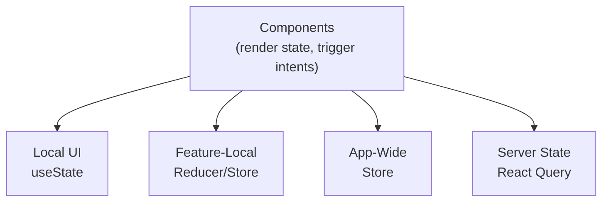
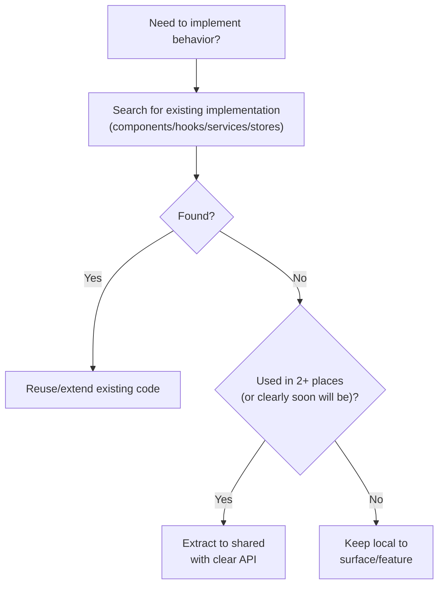
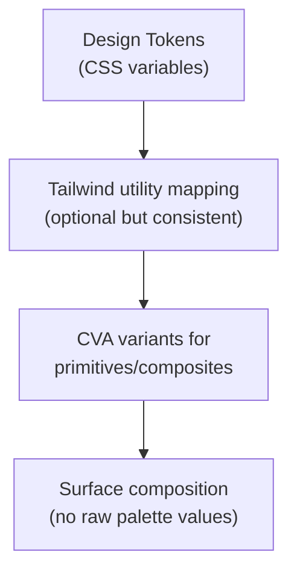

## Steer focus: React Coherence

Prioritize maintaining **architectural coherence** across this React codebase so it stays easy to change, safe to extend, and straightforward to restyle.

Your goal is to keep the app:
- well-organized
- consistent in patterns
- free from avoidable duplication
- resilient to long-term entropy

Do **not** break functionality, regress tests, or introduce unrelated product features. All changes must maintain or improve structural quality.

Required reading:
- `prompt-manager skills read visited-tracker-tools`

See also:
- `prompt-manager skill read ui-i18n-adoption` — when adding multi-language support to a scenario.

---

### **0. Why This Skill Exists**

React codebases drift over time when each feature is built in isolation.

Common drift patterns:
- State management choices become inconsistent across surfaces.
- Similar behavior is implemented multiple times with slight differences.
- Shared components are recreated locally instead of reused.
- Styling grows without a stable token/primitive system.
- Theme refreshes become expensive because visual logic is spread everywhere.

The root cause is usually the same: no shared mental model for **where code belongs** and **how style contracts are owned**.

This skill defines that shared model.

---

### **0.5 Keyboard Shortcut Coherence**

One keyboard shortcut manager per app shell. Do not scatter `document/window keydown` listeners across unrelated components — route all app-level shortcut handling through a single central hook.

For the full implementation shape — including iframe relay via `@vrooli/iframe-bridge`, focus-aware suppression, the local-first/relay-on-noop pattern, and the canonical file slot — see **`vrooli-ui-interop`** section 4 (slot [G]).

---

### **1. State Architecture (Scope-Driven, Not Dogmatic)**

Use the smallest state mechanism that correctly matches the state scope.



#### **State Location Decision Table**

| Question | If YES | If NO |
|----------|--------|-------|
| Is it only for one component subtree and ephemeral? | Local `useState` / `useReducer` | Continue |
| Is it shared within one surface/feature only? | Feature-local hook/store | Continue |
| Is it shared across multiple surfaces/routes? | App-wide store | Continue |
| Does it come from network/server and need cache/invalidation? | Server state (`React Query` preferred) | Continue |
| Does it trigger expensive side effects repeatedly? | Add guardrails (rate limiting/dedup/debounce) | Continue |

#### **State Principles**

1. Prefer **local state first** for local concerns.
2. Promote to feature-local, then app-wide, only when sharing needs are real.
3. Keep server state in query/mutation primitives, not ad-hoc local mirrors.
4. Avoid store sprawl and god stores.
5. State model should reflect user flows, not implementation convenience.

#### **Store Pattern (When Store Is Needed)**

```typescript
interface SettingsStore {
  density: "comfortable" | "compact";
  setDensity: (v: "comfortable" | "compact") => void;
}

const useSettingsStore = create<SettingsStore>((set) => ({
  density: "comfortable",
  setDensity: (v) => set({ density: v }),
}));

const density = useSettingsStore((s) => s.density);
const setDensity = useSettingsStore((s) => s.setDensity);
```

```typescript
// Anti-pattern: unrelated concerns in one store
interface AppStore {
  auth: unknown;
  theme: unknown;
  formDrafts: unknown;
  jobRuns: unknown;
  modalState: unknown;
}
```

#### **Side-Effect Guardrails (Store/Hook/Service)**

Any path that creates remote side effects should include guardrails:
- deduplication
- submission locks
- rate limiting or cooldown
- idempotency where possible

Use the same principle whether the logic lives in a store, hook, or service.

---

### **2. Sharing Decision Tree**

Before implementing new behavior:



#### **Before Writing New Code, Always Search**

```bash
# Components
rg "function .*Button|function .*Card|function .*Modal" --type tsx

# Hooks
rg "function use[A-Z]" --type tsx --type ts

# Services
rg "export .*fetch|export .*request|export .*query" src --type ts

# Stores
rg "create<.*>" src --type ts
```

If similar code exists, extend it instead of duplicating.

---

### **3. Code Organization (Design-System Ready)**

Use a structure that keeps visual-system ownership explicit:

```
src/
├── api/                       # UI ↔ API boundary; proto parse/serialize, fetch wrappers
│   ├── client.ts              # shared transport/errors/proto JSON options
│   └── <domain>.ts            # endpoint methods returning generated proto types
│
├── shared/
│   ├── theme/                 # Design tokens, themes, typography, motion scales
│   │   ├── tokens.css
│   │   ├── themes/
│   │   │   ├── clean.ts
│   │   │   └── legacy.ts
│   │   ├── typography.ts
│   │   └── motion.ts
│   │
│   ├── ui/
│   │   ├── primitives/        # Button, Card, Input, Badge, Tabs, etc.
│   │   └── composites/        # Panel, Header, EmptyState, FormRow, etc.
│   │
│   ├── components/            # Non-design-system shared widgets
│   ├── hooks/                 # Domain-agnostic hooks
│   ├── stores/                # App-wide stores (only when truly cross-surface)
│   ├── services/              # non-API services for larger shared apps
│   ├── controllers/           # Orchestration layer
│   ├── schemas/               # Validation schemas
│   └── lib/                   # Pure utilities
│
├── surfaces/                  # Feature/page assembly
│   ├── dashboard/
│   ├── search/
│   ├── explorer/
│   └── ...
```

#### **Ownership Rules**

1. `shared/theme/*` owns tokens and theme values.
2. `shared/ui/primitives/*` owns base interactive styling contracts.
3. `shared/ui/composites/*` owns repeated composed patterns.
4. `surfaces/*` assemble flows and content; they do not define new base primitives.

#### **What Goes Where**

| Location | Criteria | Examples |
|----------|----------|----------|
| `shared/theme/` | Global visual contract | tokens, theme maps, type ramps |
| `shared/ui/primitives/` | Lowest-level reusable UI atoms | Button, Card, Input, Badge |
| `shared/ui/composites/` | Repeated multi-part UI blocks | PanelHeader, EmptyState, ToolbarRow |
| `shared/components/` | Shared non-design-system widgets | ErrorBoundary, route shell wrappers |
| `shared/hooks/` | Domain-agnostic hooks | useDebounce, useMediaQuery |
| `shared/stores/` | Truly app-wide shared state | settingsStore, modalStore |
| `api/` | UI API clients and wire contracts | protoFetch, fetchHealth, listNotes |
| `shared/services/` | Shared non-wire services in larger apps | localStorage adapters, analytics wrappers |
| `shared/lib/` or `lib/` | Pure utilities only | cn, formatters, math/string helpers |
| `surfaces/X/components/` | Feature-specific render components | SearchResultsList |
| `surfaces/X/hooks/` | Feature-specific behavior | useSearchFilters |

#### **Migration Pattern: Extracting to Shared**

1. Move file to correct shared location.
2. Update imports.
3. Remove feature-only assumptions.
4. Add exports for discoverability.
5. Confirm no circular dependencies.

---

### **4. Styling Coherence**

Use this style stack:



#### **Token Categories (Required)**

Define and use semantic tokens for:
- `color` (text, accent, danger, success, warning)
- `surface` (base, raised, overlay)
- `border`
- `radius`
- `space`
- `shadow`
- `motion` (durations/easing)

Example:

```css
:root {
  --color-text-primary: 15 23 42;
  --color-text-muted: 71 85 105;
  --color-surface-base: 248 250 252;
  --color-surface-elevated: 255 255 255;
  --color-border-default: 226 232 240;
  --radius-md: 0.5rem;
  --space-4: 1rem;
  --motion-fast: 150ms;
}
```

#### **Variant Rules (CVA)**

1. Primitives expose semantic variants (`primary`, `secondary`, `danger`).
2. Avoid one-off style props (`padding`, raw color strings).
3. Keep variant count controlled (typically <= 4 per axis).

#### **Hard Rules**

1. No raw hex/rgb/hsl in TSX surface markup.
2. No ad-hoc palette classes in surfaces when a primitive/composite exists.
3. If two surfaces share a repeated class cluster, extract it.
4. Focus styles must be explicit and consistent.

---

### **5. Theme Refresh & Design System Migration**

Use this section when the task includes a substantial visual refresh.

#### **5.1 Pre-Work: Visual Direction Brief (Required)**

Before changing code, capture:
1. **Intent**: what should feel different.
2. **References**: target style direction.
3. **Constraints**: what must not change (flows, selectors, accessibility, test IDs).
4. **Scope**: token-only refresh vs layout + component refresh.

#### **5.2 Migration Strategy (Recommended Sequence)**

1. **Stabilize tokens**
  - Introduce/normalize semantic tokens in `shared/theme`.
  - Ensure current UI can still render through tokens.
2. **Normalize primitives**
  - Align `Button/Card/Input/Badge/Tabs` around variants.
  - Remove duplicated primitive logic from surfaces.
3. **Migrate high-traffic surfaces first**
  - Dashboard/navigation/primary workflows.
4. **Migrate remaining surfaces**
  - Secondary/edge views, modals, detailed panels.
5. **Retire legacy classes**
  - Remove deprecated style paths only after usage drops to zero.

#### **5.3 Coexistence Rule During Migration**

Temporary dual styling is allowed only if:
- old and new contracts are clearly named,
- deprecation intent is documented,
- removal is tracked in the same stream of work.

Do not leave permanent mixed styling contracts.

#### **5.4 Quality Gates for Theme Refresh**

Must verify:
1. WCAG AA contrast for core text/actions.
2. Keyboard navigation and focus visibility.
3. Desktop and mobile layout stability.
4. Loading/error/empty states still readable and coherent.
5. Automation selectors remain stable unless intentionally coordinated.

#### **5.5 Definition of Done (Theme Refresh)**

A theme refresh is complete when:
- primitives own the visual contract,
- surfaces do not depend on raw palette hacks,
- token coverage is complete for major UI states,
- deprecated style contracts are removed,
- tests and scenario suite pass.

---

### **6. Common Mechanism Patterns**

Use one canonical pattern for each repeated concern:

| Mechanism | Pattern | Location | Notes |
|-----------|---------|----------|-------|
| Error handling | ErrorBoundary + local recovery UX | `shared/components/` | Recovery actions, not dead ends |
| Loading states | Skeleton/Suspense/inline loading contracts | shared + surface | Consistent user feedback |
| API calls | Proto boundary layer | `src/api/` | Generated types, proto JSON parse/serialize, centralized error shaping |
| Forms | Local reducer or feature/app store based on scope | surface/shared | Match scope, avoid dogma |
| Modals | Shared modal primitives + optional shared state | shared | Avoid duplicated modal frameworks |
| Toasts/alerts | Single notification mechanism | shared | Do not mix multiple systems |
| Validation | Schema-based at boundaries | `src/api/` for proto, `shared/schemas/` for UI-only schemas | Keep UI code lean |

---

### **7. Coherence Audit**

Run this audit at session start, before large feature work, or before a theme refresh.

#### **Step 1: State Inventory**

```bash
rg "useState\(" --type tsx -c | sort -t: -k2 -nr | head -20
rg "create<.*>" --type ts -l
rg "createContext|useContext" --type tsx -l
```

Red flags:
- [ ] Large components with many unrelated local states
- [ ] Cross-surface state duplicated in multiple places
- [ ] App-wide stores holding unrelated concerns

#### **Step 2: Duplication Check**

```bash
rg "function (Button|Card|Modal|Input|Form)" --type tsx -l
rg "function use(Form|Fetch|Auth|Modal)" --type tsx -l
rg "function (format|parse|validate)" --type ts -l
```

Red flags:
- [ ] Similar components implemented in multiple surfaces
- [ ] Slightly different duplicate hooks/services
- [ ] Repeated utility logic

#### **Step 3: Styling + Theme Readiness**

```bash
# Raw colors in TSX/CSS
rg "#[0-9a-fA-F]{3,8}|rgb\\(|hsl\\(" --type tsx --type css

# Arbitrary spacing
rg "p-\\[|m-\\[|gap-\\[" --type tsx

# Primitive/variant usage
rg "cva\\(" --type tsx -c

# Token usage
rg "var\\(--" src --type css
```

Red flags:
- [ ] Hardcoded colors in surfaces
- [ ] Arbitrary spacing without system reason
- [ ] No primitive variant contracts
- [ ] Token system is partial or absent

#### **Step 4: Architecture Alignment**

```bash
ls -la src/shared/
ls -la src/shared/theme src/shared/ui 2>/dev/null
rg "export (function|const) (Button|Card|Input|Badge)" --type tsx -l | grep -v "shared/ui/primitives"
```

Questions:
- [ ] Are visual contracts owned in `shared/theme` + `shared/ui`?
- [ ] Are surfaces assembling rather than inventing primitives?
- [ ] Do controllers/services follow stable boundaries?

#### **Step 5: Document Findings**

Update or create `docs/internal/COHERENCE-NOTES.md`:

```markdown
# Coherence Audit - [Date]

## State
- Current pattern: [local-first / mixed / store-heavy]
- App-wide stores: [list]
- State hotspots: [list]

## Duplication
- Duplicate components: [list]
- Duplicate hooks/services: [list]
- Consolidation candidates: [list]

## Styling System
- Token coverage: [good/partial/none]
- Primitive variant coverage: [good/partial/none]
- Surface-level style debt: [list]

## Theme Refresh Readiness
- Ready now / needs foundation work
- Required prerequisites: [list]

## Priority Actions
1. [...]
2. [...]
3. [...]
```

---

### **8. Memory Management with Visited Tracker**

Use `visited-tracker-tools` with:
- LOCATION: `scenarios/{{TARGET}}/ui`
- TAG: `react-coherence`

---

### **9. Relationship to Other Skills**

| Skill | Focus | How it combines with react-coherence |
|-------|-------|--------------------------------------|
| react-stability | Crash prevention | Apply stability guardrails before large refactors |
| experience-architecture-audit | User flow clarity | Coherence handles structure; experience audit handles flow outcomes |
| refactor | Targeted cleanup | Use after coherence audit identifies concrete debt |
| code-cleanup | Dead code removal | Use once architecture direction is stable |

Recommended sequence:
1. `react-coherence` audit
2. `react-stability` hardening
3. `experience-architecture-audit` flow improvements
4. `refactor` / `code-cleanup`

---

### **10. Scenario Constraints**

Do not:
- change core scenario workflows without explicit requirement
- alter API/business semantics during pure coherence work
- perform broad rewrites without staged migration
- break automation selectors without coordination

Prefer:
- incremental, high-impact structural improvements
- explicit ownership boundaries
- reversible migrations with checkpoints

---

### **11. Output Expectations**

You may update:
- code organization to match ownership boundaries
- token + primitive systems
- state shape and location based on scope
- shared abstractions where duplication is proven

You must:
- keep functionality intact
- keep or improve test coverage
- preserve/coordinate selectors and QA hooks
- document major architectural decisions

For theme refresh tasks, include in your final summary:
1. Visual direction brief (short)
2. What was migrated (tokens/primitives/surfaces)
3. What remains
4. Risks and follow-ups

Avoid superficial churn (renames/moves only) without real coherence gains.
