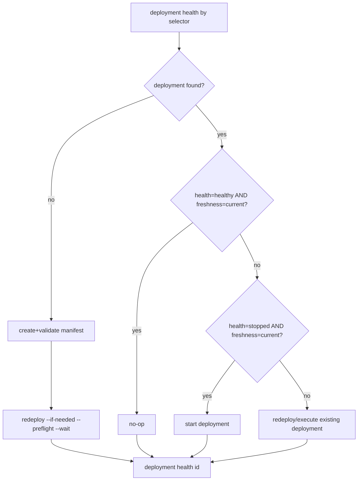

## Tools focus: Scenario to Cloud

Use `scenario-to-cloud` to deploy a scenario to an existing VPS and operate that deployment.

---

### **1. When to Use This Tool**

| Goal | Command |
|------|---------|
| Resolve existing deployment by selector | `scenario-to-cloud deployment resolve --domain <domain> --scenario <id>` |
| Deploy/redeploy only when required (manifest path) | `scenario-to-cloud redeploy cloud-manifest.json --if-needed --preflight --wait` |
| Deploy/redeploy only when required (existing deployment by selector) | `scenario-to-cloud redeploy --domain <domain> --scenario <id> --if-needed --preflight --wait` |
| Validate deployment health by selector or id | `scenario-to-cloud deployment health --domain <domain> --scenario <id>` |
| Read deployment logs | `scenario-to-cloud inspect logs <deployment-id>` |
| Verify SSH access safely (agent mode) | `scenario-to-cloud ssh bootstrap <host> --user root --non-interactive` |

**Scope boundaries:**
- **In scope:** Manifest validation, deployment lifecycle, preflight validation, SSH/DNS/TLS checks, logs and runtime inspection, process control, deployment secrets.
- **Out of scope:** VPS provisioning, cloud provider account setup, domain registration, desktop packaging.

---

### **2. Core Workflow**

### Prerequisites

Minimum required inputs:
- `{{DOMAIN}}`
- `{{SCENARIO_NAME}}`

Derived at runtime:
- `{{DEPLOYMENT_ID}}` from `deployment resolve`
- `{{VPS_HOST}}` from `deployment resolve` when deployment exists

Additional required input when no deployment exists:
- `{{VPS_HOST}}` (must be provided manually for manifest init/bootstrap)

### Input contract (fast decision)

- Existing deployment path:
  - Required inputs: `{{DOMAIN}}`, `{{SCENARIO_NAME}}`
  - Optional: none
- New deployment path (no existing deployment found):
  - Required inputs: `{{DOMAIN}}`, `{{SCENARIO_NAME}}`, `{{VPS_HOST}}`
  - Human-required step may be needed: interactive `ssh bootstrap` if key auth is not already configured

### Quick Path: Existing Deployment (Domain + Scenario Only)

Use this when a deployment likely already exists and you only have:
- `{{DOMAIN}}`
- `{{SCENARIO_NAME}}`

```bash
scenario-to-cloud deployment resolve --domain {{DOMAIN}} --scenario {{SCENARIO_NAME}} --json
scenario-to-cloud deployment health --domain {{DOMAIN}} --scenario {{SCENARIO_NAME}} --json
scenario-to-cloud redeploy --domain {{DOMAIN}} --scenario {{SCENARIO_NAME}} --if-needed --preflight --wait
```

#### Step 1: Resolve deployment state first (selector-first)

Preferred selector-first path when domain is known:

```bash
scenario-to-cloud deployment resolve \
  --domain {{DOMAIN}} \
  --scenario {{SCENARIO_NAME}} \
  --json
```

Extract `deployment.host` and `deployment.id` from this output for later commands.

#### Step 2: Check SSH bootstrap readiness (agent-safe)

```bash
scenario-to-cloud ssh bootstrap {{VPS_HOST_FROM_RESOLVE}} --user root --non-interactive
```

If this fails:
- If deployment is missing: interactive password entry is required to authorize key-based access. Stop and include the exact interactive handoff command from the command output in your final response.
- If deployment exists: continue to selector-based health first and use `ssh_key_auth` status to decide whether bootstrap is required before convergence.

Then run health by selector:

```bash
scenario-to-cloud deployment health \
  --domain {{DOMAIN}} \
  --scenario {{SCENARIO_NAME}} \
  --json
```

This command resolves deployment ID first, then returns health/freshness.
If no deployment exists for the selector, it fails with a "no deployment found" error.
Use `--host {{VPS_HOST}}` selectors only when a domain selector is unavailable.

Agent gating rule:
- If `ssh bootstrap ... --non-interactive` fails **and deployment is missing**, stop and hand off the interactive bootstrap command.
- If `ssh bootstrap ... --non-interactive` fails **but deployment exists**, continue to `deployment health` and use `ssh_key_auth` status to decide if bootstrap is required before convergence.

#### Step 3: Decision tree (always converge to desired state)



**Identifier rule (canonical):**
- Use selector form first to find state: `deployment resolve` / `deployment health --domain ... --scenario ...`
- Use ID form after resolve for direct operations: `deployment health <deployment-id>`, `deployment execute <deployment-id>`, `deployment start <deployment-id>`

**Environment naming rule (canonical):**
- Use `manifest.prod.json` unless the user explicitly asks for another environment filename.

If deployment exists and needs convergence, use selector-only quick path (no local manifest required):

```bash
scenario-to-cloud redeploy \
  --domain {{DOMAIN}} \
  --scenario {{SCENARIO_NAME}} \
  --if-needed --preflight --wait
```

Equivalent explicit ID path:

```bash
DEPLOYMENT_ID=$(scenario-to-cloud deployment resolve \
  --domain {{DOMAIN}} \
  --scenario {{SCENARIO_NAME}} \
  --json | jq -r '.deployment.id')

scenario-to-cloud deployment execute "$DEPLOYMENT_ID" --preflight --wait
scenario-to-cloud deployment health "$DEPLOYMENT_ID" --json
```

If deployment is missing, create one in a persistent scenario path:

```bash
scenario-to-cloud manifest init \
  --scenario {{SCENARIO_NAME}} \
  --domain {{DOMAIN}} \
  --host {{VPS_HOST}} \
  --out scenarios/{{SCENARIO_NAME}}/.vrooli/cloud/manifest.prod.json

scenario-to-cloud manifest validate \
  scenarios/{{SCENARIO_NAME}}/.vrooli/cloud/manifest.prod.json
```

`manifest init` may emit a placeholder host when `--host` is omitted, so always set `--host {{VPS_HOST}}` before deploy/redeploy.

Default convergence command:

```bash
scenario-to-cloud redeploy \
  scenarios/{{SCENARIO_NAME}}/.vrooli/cloud/manifest.prod.json \
  --if-needed --preflight --wait
```

If `health=stopped` and `freshness=current`, start the existing deployment:

```bash
scenario-to-cloud deployment start <deployment-id>
scenario-to-cloud deployment health <deployment-id>
```

#### Step 4: Verify and triage

```bash
scenario-to-cloud deployment health <deployment-id>
scenario-to-cloud inspect logs <deployment-id> --tail 200
```

---

### **3. Troubleshooting Workflow**

1. Run health first:
```bash
scenario-to-cloud deployment health --domain {{DOMAIN}} --scenario {{SCENARIO_NAME}}
```
2. Run the exact recommendation commands from the output.
3. Check logs for errors:
```bash
scenario-to-cloud inspect logs <deployment-id> --level error --since 1h
```
4. If `history` or `logs` are empty and failure happened during preflight, inspect structured preflight diagnostics:
```bash
scenario-to-cloud deployment get <deployment-id> --json
```
Review `preflight_result.checks` and follow each failing check's `hint` first.
5. If preflight failed, run this remediation order before retry:
```bash
# A) Inspect failing preflight checks first (including owning processes)
scenario-to-cloud deployment get <deployment-id> --json

# B) Port conflicts (80/443) only when owner is unexpected
scenario-to-cloud preflight fix-ports --port 80 --port 443

# C) Re-check deployment diagnostics and identify unresolved failing checks
scenario-to-cloud deployment get <deployment-id> --json
```
Do not run `fix-ports` when expected edge services (for example `caddy`) are the owners of 80/443; follow the preflight `hint` for that check instead.
If a failing check is a hard infrastructure requirement (for example RAM below minimum policy), stop and hand off the infrastructure fix before retrying deployment.
6. Retry convergence:
```bash
scenario-to-cloud deployment execute <deployment-id> --preflight --wait
scenario-to-cloud deployment health <deployment-id> --json
```

### Hard Blocker Handoff (When Preflight Cannot Converge)

If preflight fails on hard infrastructure requirements (for example RAM below policy), stop and report:
- Failing checks from `scenario-to-cloud deployment get <deployment-id> --json` (`preflight_result.checks`)
- Required minimums from `scenario-to-cloud preflight requirements --json`
- Exact next human action (for example: resize VPS to at least 1 GB RAM, then rerun convergence)

---

### **4. Requirements Source of Truth**

Do not duplicate VPS requirements in this skill.
Use the scenario command that returns canonical policy used by runtime preflight:

```bash
scenario-to-cloud preflight requirements
scenario-to-cloud preflight requirements --json
```

---

### **5. If You Need More Commands**

Use built-in group help:

```bash
scenario-to-cloud manifest help
scenario-to-cloud deployment help
scenario-to-cloud preflight help
scenario-to-cloud ssh help
scenario-to-cloud inspect help
scenario-to-cloud edge help
```

Use these only when the core workflow is insufficient.

---

### **6. Guardrails**

**Do:**
- Use `redeploy --preflight --wait` for first deploys and high-confidence redeploys.
- Use `deployment health --domain ... --scenario ...` as the default state-check entrypoint.
- Use `deployment resolve` when you need a deployment ID without running health checks.
- Use `redeploy --if-needed --preflight --wait` as the default automation path.
- Use `deployment health` as the default triage entrypoint.
- Use `ssh bootstrap ... --non-interactive` before deployment in agent-driven workflows.
- Prefer exact commands emitted by tool output over ad-hoc fixes.

**Do NOT:**
- Assume VPS provisioning is handled by this tool.
- Duplicate VPS requirement policy in skill text.
- Use deprecated command aliases.
- Hardcode passwords into scripts.

---

### **7. Output Expectations**

**After a successful deployment:**
- `deployment health <id>` reports `HEALTHY` or actionable next steps.
- Scenario is reachable at `https://{{DOMAIN}}`.
- `curl -I https://{{DOMAIN}}/health` returns a non-5xx status.

**May create/update:**
- Deployment records and bundle artifacts.
- VPS runtime/configuration state (services, Caddy, TLS certificates).
- Local SSH keys and remote key authorization (via bootstrap/copy-key).

**Must not:**
- Modify scenario source code.
- Provision/destroy VPS instances.
- Install local dependencies without explicit permission.
