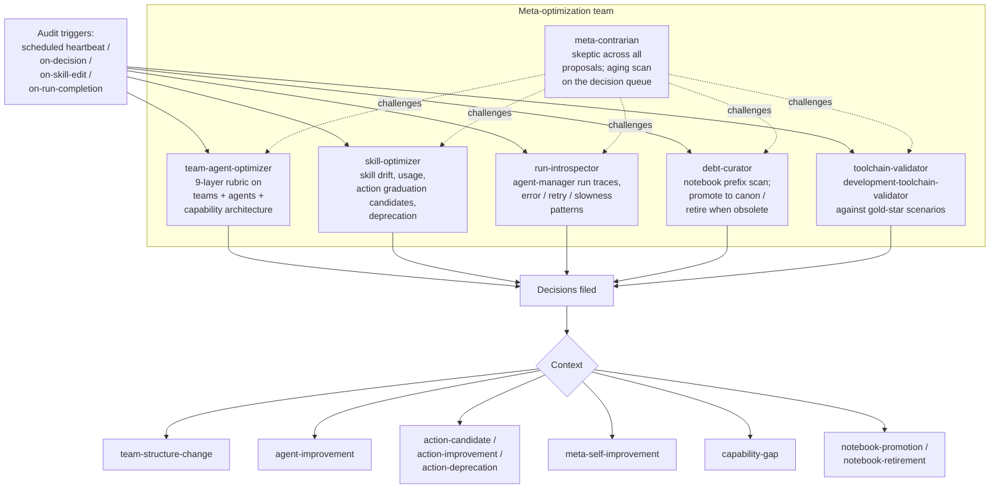

# Meta Optimization Team

## Mission
Apply evolutionary pressure to Vrooli's meta-layer so skills, agents, teams, and tool contracts become cheaper, sharper, more programmatic, and easier to retire when stale.

## Scope
Owns meta-layer optimization: skills, prompt-manager agents, team contracts, prompt surfaces, and run-derived lessons.

Does not own scenario code quality, monetization strategy, or new scenario design.

## Team-Specific Principles
- Prefer usage-grounded changes over aesthetic cleanup.
- Prefer programmatic conversion when repeated prose can become deterministic tooling.
- Proposals need a measurable baseline.
- Pruning is a first-class improvement path.
- Cross-lane changes are proposals to the owning surface, not direct implementation.

## Members and audit coverage

The team is six members. Five run audits across different lenses; one is a mandatory skeptic. Each member produces decisions; none of them implement directly (the team's role is evolutionary pressure, not execution).

### Member responsibilities (compact)

| Member | Audit lens | Primary decision contexts |
|---|---|---|
| `team-agent-optimizer` | 9-layer team-member capability audit (`docs/agent-system/TEAM_MEMBER_ARCHITECTURE.md`); team + agent file structure | `team-structure-change`, `agent-improvement`, `capability-gap` |
| `skill-optimizer` | Skill drift, usage telemetry, promotion-ladder progress (`docs/agent-system/PROMOTION_LADDER.md`); detects action-candidate + action-deprecation | `action-candidate`, `action-improvement`, `action-deprecation`, `meta-self-improvement` |
| `run-introspector` | Recent agent-manager run telemetry; ground-truth on what actually happens vs. what's documented | `agent-improvement`, `meta-self-improvement`, `capability-gap` |
| `debt-curator` | The team's own working-notebook prefix (`meta-optimization/notebook/<slug>`); promotion + retirement candidates | `notebook-promotion`, `notebook-retirement`, `meta-self-improvement` |
| `toolchain-validator` | Dev toolchain (development-toolchain-validator and fallbacks) against gold-star reference scenarios | `meta-self-improvement`, `capability-gap` |
| `meta-contrarian` | Skepticism across all of the above; aging scan on the team's decision queue (the team's stale-decision-handler) | (none owned; proposes counterargument and supersession) |

### Why six members and not one big auditor

Each lens looks at a different surface, with different cadence and different evidence. Folding them into one member would either flatten the audits to whichever lens shouts loudest, or require one member to context-switch between five orthogonal jobs each heartbeat. Splitting them keeps each audit small, focused, and independently improvable.

The contrarian role exists because every other member is biased toward action — they audit, find smells, and propose changes. Without a designated skeptic, the team would over-propose. The contrarian's job is to challenge polishing, premature conversion, scope creep, and conversion-without-measurement before those proposals reach the operator queue.
