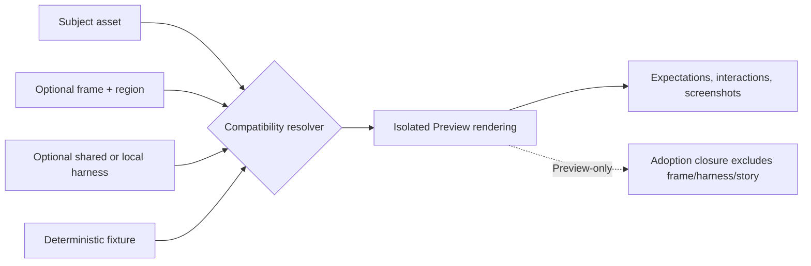

# Architecture — React Component Library

This document is the scenario's system map. It explains the invariant
shape inherited from the `react-vite` template, then points to the
specialized documents that own product domains, workflows, data,
integrations, deployment, operations, and business strategy.

Keep this file high-signal. Do not turn it into a warehouse for every
domain, endpoint, workflow, or decision. If a concern has a dedicated
document below, update that document and link it here.

## Purpose Of This Document

This document owns:

- the scenario's system shape,
- the role of each surface,
- how contracts and data flow between surfaces,
- the shared infrastructure boundary,
- extension rules for future code,
- architecture maturity and intentional deviations.

This document does not own:

- product capability inventory: [`DOMAINS.md`](DOMAINS.md),
- temporal and user/system workflows: [`FLOWS.md`](FLOWS.md),
- storage details and retention: [`DATA.md`](DATA.md),
- resource and scenario dependencies: [`INTEGRATIONS.md`](INTEGRATIONS.md),
- test seams and fakes: [`../internal/SEAMS.md`](../internal/SEAMS.md),
- test strategy: [`../internal/TESTING.md`](../internal/TESTING.md),
- deployment and operations: [`../operations/DEPLOYMENT.md`](../operations/DEPLOYMENT.md),
- commercial strategy: [`../business/MONETIZATION.md`](../business/MONETIZATION.md).

## Asset hierarchy and Preview composition

The catalog is a dependency hierarchy, not a list of interchangeable UI
parts. A lower rung may be required by a higher rung, but a higher rung is not
automatically a valid display context for every lower rung. Catalog validation
owns the dependency direction and the rung assignment; the Preview contract
owns whether a particular frame region can display a particular subject.

The current hierarchy is:

| Rung | Asset kinds | Responsibility | Typical Preview treatment |
|---:|---|---|---|
| 5 | `page-template` | Complete page composition | Template frame or workflow story |
| 4 | `pattern`, `navigation` | Reusable page-level regions | Page, app-shell, or specialized frame |
| 3 | `component` | Reusable interactive UI | Direct, controlled, async, or contextual story |
| 2 | `primitive` | Small visual/interaction building block | Standalone specimen or small shared harness |
| 1 | `runtime-hook`, `adapter`, `generator`, `runtime-service` | Runtime and integration seams | Fixture-backed hook or contract story |
| 0 | `foundation` | Tokens, icons, typography, and base styling | Standalone specimen; no forced frame |
| — | `fixture` | Deterministic data/provider input | Environment dependency, never a visual subject |

The six rungs are an architectural vocabulary. They do not determine a
frame by numeric rank alone. A frame is a catalog-registered context asset
with named regions, an implementation version, a renderer target, accepted
subject capabilities, and fixture ports. A story has four separate roles:



The subject is what is being judged. The frame supplies context. The harness
demonstrates behavior. The fixture supplies deterministic external state. Do
not merge these roles to reduce file count: doing so makes compatibility,
versioning, adoption, and evidence ambiguous.

Canonical composition rules and the author decision tree live in
[`STORY-CONTRACT.md`](STORY-CONTRACT.md). The concrete frame and harness
inventory, examples, migration rules, and screenshot evidence requirements
live in [`../guides/asset-preview-composition.md`](../guides/asset-preview-composition.md).

## Per-asset gate scoring and health cockpit

Catalog identity is the join key: every implementation declares one
`catalogId`, and a gate finding must resolve to a catalog asset or be returned
as a runner error. The API computes each built asset's score from attributable
blocking gates, applies the pinned vector in `catalog/weights.json` plus the
transitive `requires` blast radius, and keeps corpus gates visible as separate
status rather than assigning corpus drift to an arbitrary asset.

Gate runs persist one row per inspected asset in `catalog_gate_evidence` with
the target, version, source revision, result, and timestamp. A revision mismatch
is stale evidence. Score history is reconstructed day by day from the durable
rows and carries the last observation forward so quiet days remain queryable.

The workbench consumes the same server projection for the score gauge, metric
breakdown, finding list, progress ladder, health indicator, capture grid, and
canvas network graph. The graph's node list is the keyboard-accessible
equivalent of the canvas. `catalog next` defaults to the promote lane; the
build lane is explicit, and `catalog evidence capture <asset-id>` records the
declared light/dark viewport capture matrix.

## Draft lane and canonical asset enumeration

Released version directories are immutable. An update begins in a governed
draft directory, where source, story, and generated obligations can change;
promotion creates the next released version and records the superseded version

Intra-library imports in newly published source use a major-line selector such
as `@vrooli/react-component-library/Icon/1`. The generated
`dependencies.json` remains the derived exact-resolution record and may be
regenerated without changing authored-source immutability. Retention uses the
same transitive reachability closure for candidate reporting, eviction, and
reconciliation.
in `deprecatedVersions`. The catalog command surface owns open, promote, and
discard, while the indexer remains the admission boundary for hashes,
dependencies, and story contracts.

`catalog/config.json` is the canonical enumeration of asset kinds and targets.
The component indexer, Test Genie applicability, and ui-health staleness scan
derive their supported kinds from that declaration. A new kind therefore has
one catalog change plus contract tests at each consumer, rather than three
independent lists that can silently diverge.

## Readiness and evidence ownership

`react-component-library catalog readiness` joins the latest completed gate
evidence, component-test run identity, declared maturity floor, and blast-radius
triage. It reports `Status`, `Triage`, and `Next Steps` through the diagnostic
CLI output contract. `--floor` evaluates a stricter preview without changing
configuration. Incomplete or mismatched evidence is reported as not ready; it
is never presented as a completed score.

Retirement follows the same evidence boundary. Each run computes a cleanup
plan, reports safe candidates informationally, and only applies a reviewed
plan through the explicit plan-hash and confirmation path.

## Scenario Shape

A scenario is one product expressed through three coordinated surfaces
and one canonical contract layer.

```
                       ┌─────────────────────────────┐
                       │  Generated proto types      │
                       │  packages/proto/schemas/    │
                       │   react-component-library/v1/...    │
                       └──────────────┬──────────────┘
                                      │ canonical wire shape
              ┌───────────────────────┼───────────────────────┐
              │                       │                       │
              ▼                       ▼                       ▼
        ┌──────────┐            ┌──────────┐            ┌──────────┐
        │   ui/    │ Connect-JSON│  api/   │ Connect-JSON│  cli/   │
        │ React    │ ◀────────▶ │   Go     │ ◀────────▶ │   Go     │
        │ + Vite   │            │ HTTP     │            │ cli-core │
        └──────────┘            └────┬─────┘            └──────────┘
                                     │
                                     ▼
                                ┌─────────┐
                                │ SQLite  │
                                │ (local) │
                                └─────────┘
```

| Surface | Role | Owns | Does Not Own |
|---|---|---|---|
| API (`api/`) | Scenario core | Business rules, persistence, integrations, transport edge | Browser state, CLI formatting |
| UI (`ui/`) | Browser presentation | Components, i18n, accessibility, browser interaction | Business rules, persistence policy |
| CLI (`cli/`) | Operator/agent wrapper | Argument parsing, output formatting, API invocation | Business rules, duplicated validation |
| Contracts (`packages/proto/schemas/react-component-library/`) | Wire shape | Proto messages/services and generated clients | Hand-written route/type mirrors |

The load-bearing principle: the API is the only surface that contains
business logic. UI and CLI translate user/operator intent into API
calls. Proto types flow from one source of truth so wire-shape drift
between surfaces is impossible.

## Registry Projection Flow

Library assets remain Git-tracked under `library/components/<slug>/` and
`library/hooks/<slug>/`. Components retain their stable IDs; the shared
projection adds `asset_kind`, pinned manifest dependency edges, and batch
metrics (direct adoptions and versions). Hooks are first-class source assets,
but intentionally non-renderable.
`component.json` owns stable manifest fields, including `slot` and
`designStyles`; version folders own immutable/draft `.tsx` source plus
JSDoc headers such as `@version`, `@status`, `@deps`, and `@category`.
`@category` is a latest-version header hint that is promoted into the
typed `components.category` facet; it is not retained in
`component_headers`. The components indexer validates both layers and
writes SQLite projection tables:

- `components` for the registry row, adoption `slot`, and category
  facet,
- `component_versions` for source snapshots and version status,
- `component_headers` for non-structural latest-version metadata,
- `component_design_affinities` for style fit signals and rationale,
- `component_dep_declarations` through the deps observer for
  version-scoped dependency validation and preview import maps.

Design-style IDs are not free text. The canonical vocabulary is loaded
from `templates/design/*/metadata.json`; component manifests that
reference an unknown style fail indexing. The API exposes that registry
through `ComponentsService.ListDesignStyles`, and component search can
filter by style ID and affinity.

## System Boundaries

The scenario owns:

- source code under `api/`, `ui/`, and `cli/`,
- generated-scenario docs under `docs/`,
- scenario lifecycle metadata under `.vrooli/`,
- scenario-specific requirements under `requirements/`,
- scenario proto schemas relocated to
  `packages/proto/schemas/react-component-library/`.

The scenario does not own:

- shared package implementation under `packages/`,
- Vrooli resource implementation,
- scenario dependencies it calls,
- generated proto outputs under `packages/proto/gen/`.

Document dependency and resource decisions in
[`INTEGRATIONS.md`](INTEGRATIONS.md), not here.

## Harvest And Adoption Flow

`ComponentsService.IngestComponent` is the scenario-to-catalog intake edge:
it reads a declared scenario source file through the guarded scenario reader,
creates a released baseline plus a draft, records origin headers, and returns
de-scenario-ification findings. The CLI and Components page expose that same
RPC; catalog lint/type checks and preview rendering remain the acceptance gate
before a draft is promoted.

Ingest is a **blocking origin-parity gate**: when de-scenario-ification would
drop behavior the origin file carried, the ingest is refused rather than
silently accepted. Callers that have reviewed the loss opt in with
`accept_behavior_loss`, which records each dropped-behavior finding on the
draft's parity report as an explicit, audited override (the same
review-with-a-record shape used elsewhere in this scenario — see the reviewed
divergence allowlist in [`DATA.md`](DATA.md)). The origin-parity closure also
resolves app-alias origins so a component ingested under one scenario alias is
not mistaken for an untagged copy.

`AdoptionsService.LinkAdoption` is the reverse edge. It validates dependency
and design-style fit server-side, records a version-pinned `file:` dependency,
and writes the managed locale and selector obligations into the target. A link
does not materialize the library closure in the scenario. When the published
contract cannot express a deliberate local behavior, `EjectAdoption` is the
explicit, reason-bearing path that writes a source copy and records
`mode=ejected` plus `fork_reason`; it is never the default. `SuggestAdoptions`
composes the existing InventoryService scan, style-fit verdict, dependency
verdict, and adoption ledger to return only non-adopted, explainable
candidates.

`WorkflowsService` is an RCL-owned, durable observation ledger for assisted
extract/adopt requests. Its server-side adapter discovers Agent Manager,
creates a narrowly scoped task/run using the catalog-maintainer profile, and
records run identity, status, and event sequence. A completed agent run is
never a mutation acknowledgement: only direct ingest/apply/reapply APIs own
catalog and adoption provenance, and unavailable Agent Manager state is stored
explicitly rather than retried from the browser.

Two reconciliation edges keep the catalog and its adopters converged after the
fact:

- `DiscoverAdoptions` / `ConfirmDiscovery` find untagged vendored *copies* of
  catalog components that carry no provenance header. Discovery scores each
  candidate file against the catalog with a Sørensen–Dice content-similarity
  metric and **never writes on its own** — it returns ranked candidates and a
  human confirms before any provenance header is stamped (confirm-before-write).
  A fleet run proved this does not over-claim: generic shadcn primitives that
  merely resemble a catalog component are not treated as copies.
- `ReconvergeAdoptions` reports linked version drift and migration work; it does
  not overwrite linked consumers. Ejected adopters remain explicit local
  ownership boundaries. Adopters under `templates/**` are out of the write
  boundary and are reported (not rewritten); reviewed, still-behind template
  copies are tracked in the reviewed divergence allowlist rather than silently
  tolerated.

`ResolveAdoptionPath` returns per-file placement (dual provenance: library slot
plus adopting-template manifest) so a multi-file component version lands each
file where the adopting template's UI manifest says it belongs; the code panel's
file tree renders that placement.

## Component Workspace

The component detail editor is a client-side workspace with three independently
visible panes: **Files**, **Preview**, and **Details**. Its ordered visibility
and desktop split sizes are persisted in browser storage, keeping individual
inspection workflows intact without making layout a server-side concern. A pane
header supplies keyboard-accessible move-left, move-right, and close actions;
the global Add pane menu restores any closed pane.

Files owns source inspection and editing. Its tabs switch between the complete
placement tree, available version files, and an ephemeral comparison tab.
Details owns version selection and comparison intent; once the versions service
returns a diff, the detail page hands that response to Files, which opens (or
restores) and selects the comparison tab. This keeps comparison rendering in
the code-oriented surface while preserving the Details pane as the metadata and
history control surface.

### Preview Workspace

Preview is a bounded client-side experiment surface inside the workspace. The
header deliberately has two primary entry points: **Appearance & visual
checks** owns color mode, token-pack selection, DESIGN.md import, and visual
simulations; **Viewport** owns device presets, responsive dimensions, zoom,
and rotation. Both use an anchored dialog-style menu so compact controls retain
their explanation and keyboard entry/exit behavior instead of consuming the
toolbar continuously.

The preview gallery keys every iframe by `version:example`. The host accepts a
ready/error message only when its component, identity, and `contentWindow`
match the registered frame, which makes an individual render failure retryable
without suppressing the rest of the gallery. A bounded comparison set (two
specimens) changes the gallery to an intentional side-by-side grid; it is not
a freeform canvas and does not persist layout state.

The selected named state is the only target of inspector and control traffic.
The workbench renders declared controls beside the selected canvas; raw JSON is
an Advanced fallback. Both send a shallow, data-only JSON-object override over
the harness message bridge and can reset to indexed props. It is deliberately not stored,
does not modify source/index data, and never evaluates example `setup`; the
data contract and sequence are owned by [`DATA.md`](DATA.md#preview-session-boundary)
and [`FLOWS.md`](FLOWS.md#preview-workspace-experiment).

## Contracts And Data Flow

### Internationalization

Library-facing copy uses the typed strings seam exported from
`useLocale/1.0.1`. A version that renders user-visible copy keeps a
co-located `<Component>.strings.ts` module and declares named keys with
`defineStrings(namespace, defaults)`. Components read those keys through
`useStrings(key, englishDefault)`, so an unmounted provider remains safe and
renders the declared English default.

`LibraryStringsProvider` is the optional host boundary for translating those
declared keys. Adoption linking reads the co-located declarations and merges
them into the adopter's `ui/src/i18n/locales/en.json`; the i18next global
bridge is intentionally not part of the library contract. Positional keys
such as `text.1` are prohibited because they describe markup position rather
than meaning.

Wire shapes do not live in TypeScript interfaces, Go structs, or
hand-written JSON schemas. They live in `.proto` files. For
proto-typed API calls, the `.proto` file also declares the service
block that generates Connect handlers and clients.

```
packages/proto/schemas/react-component-library/v1/<domain>/<file>.proto
       │
       ▼
       make generate
       │
       ├──▶ packages/proto/gen/go/react-component-library/v1/...              (api, cli)
       ├──▶ packages/proto/gen/go/react-component-library/v1/...connect       (Connect-Go)
       ├──▶ packages/proto/gen/typescript/react-component-library/v1/...   (ui)
       └──▶ packages/proto/gen/python/react_component_library/v1/...    (future tools)
```

Use Connect-RPC by default:

- UI to API for proto-typed payloads,
- CLI to API for proto-typed payloads,
- API to API / inter-scenario calls with Vrooli-owned protos.

Use REST only when the payload shape is not Vrooli-owned proto data:

- file uploads and other opaque binary edges,
- webhook receivers and third-party APIs in the external system's
  shape,
- operational endpoints that lifecycle systems, load balancers, and
  `curl` probes must reach without a generated client.

If an internal endpoint would be REST only because it is simple, add a
proto service method instead.

## Shared Infrastructure

Shared infrastructure is allowed only when the code is
business-vocabulary-free and used by unrelated domains or surfaces.

| Package/Folder | Purpose | Why Not Domain-Owned | Consumers |
|---|---|---|---|
| `api/internal/server/` | Compose modules and middleware into one HTTP server. | Server lifecycle is not a product capability. | API entrypoint and handler modules. |
| `api/internal/module/` | Shared module and endpoint descriptor types. | Domain modules return this common shape. | Handler packages, server, endpoint codegen. |
| `api/internal/modules/` | Thin registry for schemas and endpoints. | Boot/codegen need central lists; logic stays domain-owned. | `main.go`, `gen-endpoints`. |
| `api/internal/database/` | System schema and DB reachability seam. | Cross-cutting DB infrastructure, not one domain's data. | API boot, health. |
| `api/internal/clock/` | Deterministic time seam. | Time is cross-cutting and test-substitutable. | Middleware, repositories. |
| `api/internal/testutil/` | Cross-domain test harnesses and fakes. | Used by unrelated domains; domain fakes stay domain-local. | API tests. |
| `ui/src/test-utils/` | Cross-feature render helpers, a11y helpers, and model tests. | Used by unrelated UI features. | UI tests. |

If shared infrastructure starts using product vocabulary, move that
piece back into the owning domain or split a new domain first.

## Extension Rules

Add product behavior by adding or updating the owning domain, not by
growing generic buckets.

For a normal proto-backed domain:

1. Add proto messages and service methods under
   `packages/proto/schemas/react-component-library/v1/<domain>/`.
2. Add API domain code under `api/internal/<domain>/`.
3. Add transport code under `api/handlers/<domain>/`.
4. Register schemas/endpoints in `api/internal/modules/registry.go`
   and mount the module in `api/main.go`.
5. Add CLI commands under `cli/domains/<domain>/`.
6. Add UI API wrappers under `ui/src/api/<domain>.ts` and UI feature
   code under `ui/src/features/<domain>/`.
7. Update selectors, strings, endpoints, tests, and the docs contract
   in `docs/manifest.json`.

For detailed product ownership, update [`DOMAINS.md`](DOMAINS.md).
For persistence and retention, update [`DATA.md`](DATA.md). For
temporal behavior, update [`FLOWS.md`](FLOWS.md).

## Architecture Maturity

Generated scenarios start with a mature template shape and starter
reference domains. Replace this table as the scenario becomes real.

| Area | Maturity | Evidence | Remaining Drift |
|---|---|---|---|
| API | Reference-ready | Domain-owned notes stack, module registry, per-domain schema, documented seams. | Starter domains must be replaced with scenario-specific capabilities. |
| UI | Reference-ready | Feature folders, typed API clients, selector/i18n registries, modeltest helpers. | Real scenarios may need routing/state patterns once multiple screens exist. |
| CLI | Reference-ready | Domain command groups wrap API calls and render reports. | New domains must add commands intentionally; CLI should remain thin. |
| Docs | Contract-ready | Manifest v2 registers docs, maturity, stages, and validation hints. | Scenario-specific stubs must be filled or marked not-applicable. |

Use `docs/manifest.json` as the documentation contract. The declared
`maturity` values are expected to be maintained by agents and later
grounded by Knowledge Observatory validation.

## Intentional Deviations

Record deviations from the template or from Vrooli scenario standards
when they are deliberate and durable.

| Date | Deviation | Reason | Revisit Trigger |
|---|---|---|---|
| 2026-05-12 | None yet. | Generated from `react-vite`. | Update when the scenario intentionally diverges. |

## Documentation Architecture

Scenario docs follow the same ownership rule as code: one durable
question, one canonical home.

| Concern | Canonical Document |
|---|---|
| System map and extension rules | `docs/concepts/ARCHITECTURE.md` |
| Product capabilities and bounded contexts | `docs/concepts/DOMAINS.md` |
| Workflows and state transitions | `docs/concepts/FLOWS.md` |
| Data ownership, retention, and migrations | `docs/concepts/DATA.md` |
| Resources, scenarios, and external services | `docs/concepts/INTEGRATIONS.md` |
| Monetization and packaging | `docs/business/MONETIZATION.md` |
| Go-to-market strategy | `docs/business/GO-TO-MARKET.md` |
| Deployment tiers and readiness | `docs/operations/DEPLOYMENT.md` |
| Operator procedures | `docs/operations/RUNBOOK.md` |
| Telemetry, metrics, and alerts | `docs/operations/OBSERVABILITY.md` |
| Seams and test doubles | `docs/internal/SEAMS.md` |
| Testing strategy | `docs/internal/TESTING.md` |
| Known drift and deferred work | `docs/internal/PROBLEMS.md` |
| Change history | `docs/internal/PROGRESS.md` |

Every durable scenario document should be registered in
`docs/manifest.json`. Put deep domain-specific documentation under
`docs/domains/<domain>/` when `DOMAINS.md` would become noisy.

## Catalog graph projection

The catalog domain keeps desired-state dependency data in memory as a typed
forward and reverse index. `assetrung` owns the six existing rung values and
fails closed on unknown kinds; `assetgraph` owns closure, dependents, cycle
errors, and deterministic rung bands. The API exposes this read model through
the generated catalog proto, while the CLI and UI remain thin consumers.

The graph is intentionally a projection, not a new persistence model. Catalog
`requires` edges define closure; `suggests` edges remain advisory. The
relationships tab presents rung bands rather than a node-link visualization,
and the dashboard structure panel presents rung population and blast radius.
The reconciler separately compares catalog edges, manifest pins, and imports
from `typescript-code-graph`; it reports drift and never edits `library/`.

Port obligations are derived from the same closure: port-facet capabilities
demanded by closure assets are subtracted by port capabilities satisfied in the
closure. The remainder is the host contract and is available through both the
CLI and relationships read model.

## Cross-References

- [`START-HERE.md`](../START-HERE.md) — first implementation workflow
- [`QUICKSTART.md`](../QUICKSTART.md) — clone-to-running flow
- [`DOMAINS.md`](DOMAINS.md) — bounded contexts and ownership
- [`FLOWS.md`](FLOWS.md) — workflow and state-transition map
- [`DATA.md`](DATA.md) — data ownership and storage
- [`INTEGRATIONS.md`](INTEGRATIONS.md) — dependency contracts
- [`../business/MONETIZATION.md`](../business/MONETIZATION.md) — commercial story
- [`../operations/DEPLOYMENT.md`](../operations/DEPLOYMENT.md) — deployment readiness
- [`../internal/SEAMS.md`](../internal/SEAMS.md) — seam registry
- [`../internal/TESTING.md`](../internal/TESTING.md) — test patterns
- [`../internal/ERROR-HANDLING.md`](../internal/ERROR-HANDLING.md) — error semantics
- [`../internal/PROBLEMS.md`](../internal/PROBLEMS.md) — known issues / tech debt
- [`../internal/PROGRESS.md`](../internal/PROGRESS.md) — lifecycle log
# Asset-first gate loop

Catalog validation resolves universal, kind, and asset declarations before
invoking a registered runner with a `gates.Scope`. The source revision and
resolved rule-set digest form the evidence cache key. Findings identify both
the rule layer and the declaring file.
