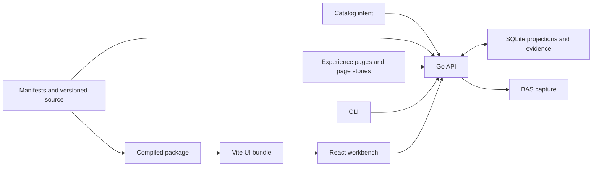

# Architecture — React Component Library

Behavioral claims are current only within the specific checks in the register. Other guidance and unverified descriptions below are **design intent**, not claims of current implementation. See the [behavior claim register](../internal/TESTING.md#behavior-claim-register).

## Purpose Of This Document

This is the checked boundary map. Detailed storage, composition and operational guidance lives in the linked documents. Unverified recommendations are design intent; dated results do not certify the current corpus.

## Scenario Shape

The Go API owns registry, authoring, reconciliation and persisted evidence. The Go CLI calls its typed operations. The React UI renders those projections. SQLite stores indexed release mirrors, adoption records and evidence; authored files retain their distinct identity and lifecycle roles.

## Contracts And Data Flow

### Proto as the canonical contract

Scenario wire contracts live under `packages/proto/schemas/react-component-library/`; generated clients serve the API, CLI and UI. Handwritten domain types stay behind adapters. The generation command is owned by `packages/proto/cmd/protogen`. Compile checks verify transport compatibility; domain tests verify behavior.

### Domain-owned schema

Domain schema providers and repository interfaces live under `api/internal/`. SQLite tests in those domains exercise persistence. See [DATA.md](DATA.md) for its storage map and explicit unverified guidance; schema evolution must follow the project storage owner.

### Inside the CLI: thin wrapper, domain organized

Commands live under `cli/domains/`. Argument and API routing tests in those directories validate the operation boundary. `cli/app_test.go` checks the assembled command surface; the primitive-evidence check detects undeclared command evidence gaps.

## Runtime observability

| Boundary | Current checked behavior | Check |
| --- | --- | --- |
| Page capture | One BAS session returns screenshot and bounded DOM, then resolves stamped assets through the consumer resolver | `api/internal/pageinspect/service_test.go` |
| Stamp identity | `data-rcl-asset` carries a library ID; legacy source-slot annotation is separate | `ui/scripts/vite-plugin-asset-stamp.test.mjs`, package resolver tests |
| Page binding | Literal testid/attribute selectors and supported prop forwarding establish source evidence; ambiguity stays unresolved | `api/internal/reconcile/resolver_test.go`, package `dom-bindings.test.mjs` |
| Verification | Custom source can resolve locally; zero proven bindings cannot pass | `api/internal/reconcile/verdict_test.go` |
| Page stories | Concrete route plus explicit API fixtures, shared story evaluator, no undeclared POST mutations | `api/internal/components/page_stories_test.go`, `ui/src/page-stories.test.tsx` |
| Route inventory | Each declared UI URL has one registered experience page and an executable page story | `ui/scripts/experience-routes-check.mjs` |
| Catalog tabs | Semantic kind is filtered before limiting, independently of the legacy component/hook bucket | `api/handlers/components/catalog_projection_test.go` |
| UI failures | Coverage and editor source failures expose retry controls; ranked-work failure is separate from an empty queue | `ui/src/pages/CoveragePage.test.tsx`, PreviewPopout page story |
| Tokens | BaseStyles values generate consumer projections, with a separate collision-checked app geometry file | `ui/scripts/design-token-generate.mjs --check` |

## Asset hierarchy and Preview composition

`api/internal/assetrung` and `assetgraph` project the catalog's semantic kinds and dependency direction; their package tests enforce that graph. Storage-root `assetKind` is retained for compatibility. `catalogKind` is the semantic classification used by the workbench.

Subject, frame, harness and fixture are separate story roles. The parser and composition tests enforce supported references and expectations. See [STORY-CONTRACT.md](STORY-CONTRACT.md); broader recipes in [asset-preview-composition.md](../guides/asset-preview-composition.md) are explicitly marked intent unless an enforcing check is cited.

## Package and authoring boundary

The [derivation map](ASSET-DERIVATION.md) distinguishes authored inputs, lifecycle metadata, generated projections and immutable history. Package compilation does not hot-update an already built application bundle. Follow the [written rebuild loop](../guides/asset-update-flow.md#edit-rebuild-and-look).

## System Boundaries

BAS owns browser execution. ui-health owns route/capture resolution for its callers. RCL consumes those capabilities and owns library/source attribution. Scenario lifecycle and host remediation belong to the control plane. Credentials and business authorization for consuming applications belong to their APIs, not shared presentation components; the latter is design intent, not a blanket security certification.

## Architecture maturity

Focused checks establish the listed boundaries. They do not certify all historical releases, complete catalog maturity, every page's visual quality, or global experience-spec health. Current limitations and dated closure notes live in [PROBLEMS.md](../internal/PROBLEMS.md). The successor design plan must remeasure rather than assume zero source coverage.

## Cross-References

[Domains](DOMAINS.md), [data](DATA.md), [flows](FLOWS.md), [integrations](INTEGRATIONS.md), [testing](../internal/TESTING.md), [decisions](../internal/DECISIONS.md).
