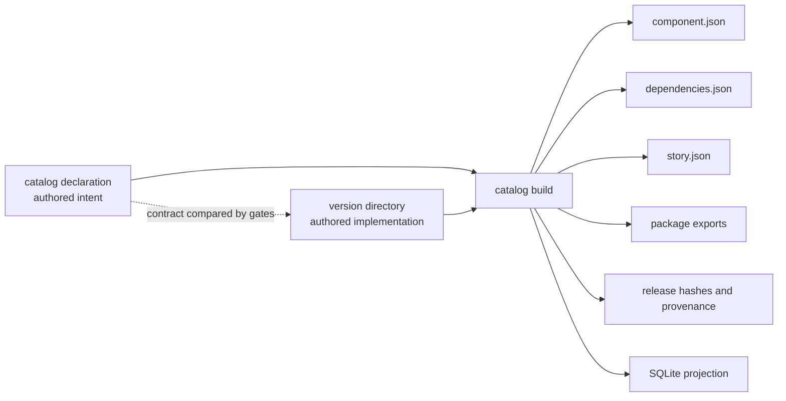
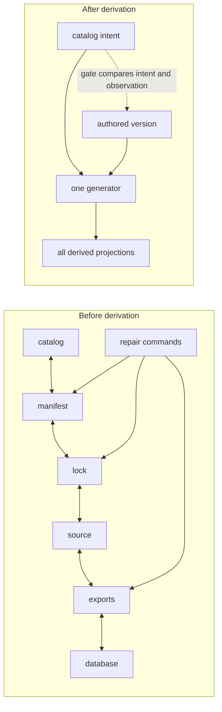

# Asset derivation

The library has exactly two authored surfaces:

1. `catalog/assets/<domain>/<asset>.json` — desired intent, capabilities, and quality contract.
2. `library/<kind>/<Asset>/versions/<version>/` — immutable implementation, authored story, and optional stylesheet.

Everything else is a projection of those surfaces. The single generator is `react-component-library catalog build`; it is total, idempotent, and safe to run after deleting derived outputs.



The canonical version directory is:

```text
<Asset>.tsx          authored entry implementation
<Asset>.css          optional authored stylesheet
<Asset>.strings.ts   optional authored strings
story.tsx            authored story module
story.json           generated story contract
dependencies.json    generated dependency lock
```

The rule for an apparent duplicate is simple: a second copy is legitimate only when it means something different—one is a requirement and the other is an observation—and a gate compares them. Otherwise the generator owns the copy or it is deleted. Catalog metadata is intent; source facts are observation; `component.json` is a lifecycle pointer projection.

## Current and target ownership



## Decisions

### D1 — Two authored surfaces, one generator
The catalog declaration and version directory are the only hand-authored inputs. Six output families are generated. Revisit only if an output cannot be computed from those inputs.

### D2 — Duplication versus contract
Keep a second statement only when it is an independently meaningful contract or observation and a gate compares the pair. Same-meaning metadata is derived or removed.

### D3 — CSS authoring and runtime injection
CSS remains a source file for editor and lint support, then the package build inlines it into the stylesheet injector. No CSS ships in `dist`; runtime inline styles are reserved for computed values.

### D4 — Authored stories and generated contracts
`story.tsx` carries the authored specimen and expectations. `story.json` is a generated contract for Go and preview consumers.

### D5 — Gate the shape before migration
The canonical shape is enforced before corpus migration so new drift cannot replenish the backlog. Every live version now reports the same semantic shape.

### D6 — Counts are never reduced by exemptions
Allowlist annotations may explain a counted item but may not remove it from an invariant. Population gaps remain visible.

### D7 — One grammar and one walker
Specifier parsing and library traversal are shared across Go and JavaScript. Extend the shared implementation when a new traversal need appears; do not fork it.

### D8 — Gates do not build
Blocking gates read the facts index and persisted evidence. Package or UI builds are explicit lifecycle operations, not hidden work inside a gate.

### D9 — Adoption is the success measure
Adoption depth is measured as library-importing ecosystem UI files divided by ecosystem UI files. It is a product outcome rather than a proxy such as asset count.

### D10 — Version history is retained
Immutable releases remain part of the product promise. Cold releases move to the governed retired tier and are reaped only after retention and reachability checks allow it.

The investigation that established this ownership model is retained at `docs/reports/2026-08-31-the-reconciliation-tax.html`.
