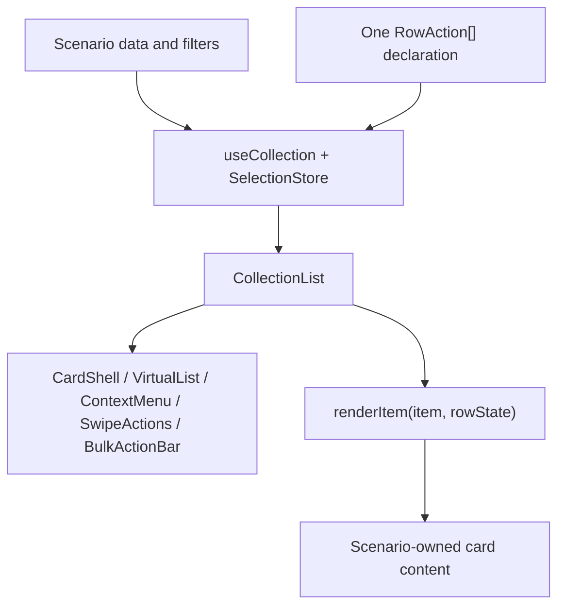

# Collections

The React Component Library collection contract has four layers:

1. Collection state is library-owned: stable keys, query, filter, sort, page, and loading/error/empty state (`useCollection`).
2. Interaction is library-owned: cursor, keyboard movement, range selection, selection mode, and action resolution (`useCollection` and `SelectionStore`).
3. Row chrome is library-owned: selection rail, selected/cursor/disabled states, focus feedback, press feedback, and menu affordances (`CardShell`).
4. Item content is scenario-owned. The library receives it through `renderItem(item, rowState)` and never inspects domain fields.

## One action declaration

Each row type supplies exactly one `RowAction<T>[]`. The same resolved declaration drives context menu, long-press menu, overflow, swipe actions, bulk actions, keyboard shortcuts, and command registration. A surface-specific action must become a row action or a container action; callers must not provide parallel menu, swipe, and bulk arrays.

The action fields are:

| Field | Meaning |
|---|---|
| `id` | Stable action identity. |
| `label` | Visible and accessible action name. |
| `icon` | Optional visual affordance. |
| `tone` | `neutral`, `primary`, or `destructive`. |
| `shortcut` | Optional keyboard shortcut displayed by action surfaces. |
| `swipe` | Optional `leading` or `trailing` mobile accelerator. |
| `bulk` | Whether the action is available for the current selection. |
| `hidden(row)` | Omits the action for a row. |
| `disabled(row)` | Returns the reason the action is unavailable, or `false`. |
| `onSelect(rows)` | Executes for one row or an array of selected rows. |

## Row state

`RowSelection` carries `selectionMode`, `selected`, optional `disabled`, optional `disabledReason`, and `onToggleSelect`. Selection policy remains with the scenario; row chrome only renders the computed state. Disabled rows remain keyboard reachable so their reason is discoverable.

## Keyboard table

| Input | Result |
|---|---|
| Arrow Up/Down | Move the focus cursor |
| Shift + Arrow | Extend selection from the anchor |
| Space | Toggle the cursor row |
| Shift + click | Select the inclusive cursor-to-row range |
| Mod + click | Toggle one row |
| Mod + A | Select all visible rows |
| Escape | Leave selection mode and clear selection |
| Enter | Run the primary action for the cursor row |
| Printable character | Typeahead to the first matching row |

## Accessibility floor

Collections expose an accessible label, honest list/listbox roles, roving keyboard focus, visible focus indication, `aria-selected` and `aria-disabled` where applicable, an alternative to every pointer gesture, status announcements for selection and bulk outcomes, content reflow without horizontal overflow, and a reason for every disabled action.

## Choosing a collection family

Use `CollectionList` for scenario-owned cards, row actions, selection, swipe
accelerators, and responsive list/card presentations. Use `DataTable` or
`ResourceCollection` when columns, headers, cell alignment, sorting, and table
semantics are the product. Both families may coexist; a card list should not
pretend to be a table merely to reuse a renderer.

## Worked conversion

A hand-rolled swarm-manager tab previously owned a filtered array, a `Set` of
selected ids, a pointer menu, a virtualizer, and a bulk toolbar. The converted
shape keeps only domain preparation, one action declaration, and card content:

```tsx
const actions: RowAction<BacklogItem>[] = [
  { id: "open", label: "Open", onSelect: ([item]) => item && open(item) },
  { id: "archive", label: "Archive", bulk: true, tone: "destructive", onSelect: (rows) => archive(rows) },
];

<CollectionList
  items={sorted}
  getKey={(item) => `${item.kind}/${item.name}`}
  selection={{ mode: "multi" }}
  virtualize
  actions={actions}
  renderItem={(item, rowState) => <BacklogCard item={item} rowState={rowState} />}
/>
```

The card still owns backlog-specific status chips and inline questions. The
library owns the cursor, selection, menu origin, virtualization, and bulk
surface.


