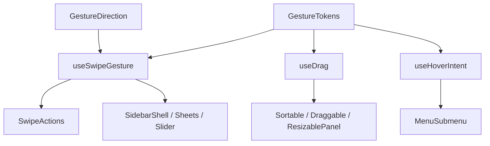

# Gesture contract

This document is the durable contract for pointer interaction in the React
Component Library. A gesture is an accelerator: every action reachable by a
gesture must also be available through a visible control, menu, or equivalent
keyboard path.

## Axis ownership

A gesture claims one logical axis. It waits for `GestureTokens.axisSlop`, then
chooses the dominant axis once and never re-decides it during that pointer
life. Re-deciding mid-gesture makes a surface fight the finger. A gesture whose
orthogonal movement dominates aborts without an action.

The logical axes are `inline` and `block`. `GestureDirection` maps physical
edges to the axis and its pointer coordinate; do not hard-code `clientX` or
`clientY` in a consumer.

## Nested gesture claims

`data-rcl-pan-x` is the touch-action opt-out a child publishes when it genuinely
owns the inline axis. `data-rcl-gesture-claim` is the runtime claim an ancestor
reads to decline a drag that began inside a claiming descendant, for that drag's
whole life.

The claim is an attribute, not `stopPropagation`. React dispatches from its
root container; stopping a synthetic event can stop the native event before it
reaches the window listeners used by the gesture, silencing both ancestor and
descendant.

## Touch-action policy

| Gesture kind | Policy | Reason |
|---|---|---|
| Inline travel gesture | `pan-y` plus `data-rcl-pan-x` on the owner | Preserve vertical scrolling while the owner claims inline travel. |
| Block travel gesture | `pan-x` plus the corresponding block claim | Preserve horizontal scrolling while the owner claims block travel. |
| Free drag | `auto` until slop, then guarded capture | Taps and scrolling remain native; capture begins only after ownership. |
| Hover intent | no touch-action claim | Hover is fine-pointer only and never a touch route. |

## Feel constants

All interaction feel values live in `GestureTokens`:

| Token | Value | Controls |
|---|---:|---|
| `axisSlop` | 8 | Movement before axis ownership is decided. |
| `flickVelocity` | 0.5 | Tail velocity that qualifies a release as a flick. |
| `resistance` | 0.32 | Overtravel rendered beyond the final stage. |
| `dismissThreshold` | 96 | Default travel required to dismiss. |
| `hoverOpenDelay` | 280 | Fine-pointer delay before opening a hover surface. |
| `hoverCloseDelay` | 100 | Ordinary delay before abandoning hover. |
| `safePolygonFuse` | 300 | Maximum hold for a parked pointer inside the safe polygon. |

These values are tunable through `resolveGestureFeel`, but consumers must not
restate literals or retune them incidentally during a migration.

## Kernel contract

Use `useSwipeGesture` for staged travel along one logical axis. Use `useDrag`
for free two-dimensional drags. Use `useHoverIntent` for fine-pointer hover
transitions toward an open child surface. Movement is reported in pixels
through callbacks, never through React state: fractions cannot drive a surface
that tracks a finger, and per-frame state rerenders every subscriber.

`pointercancel` is an abort. It restores the position from which the gesture
started and never performs an armed action. A short gesture that simply fails a
threshold is a return, not an abort.

## Safe polygon

When a submenu trigger loses the pointer toward an open child, the safe region
is the triangle formed by the last pointer position and the two child corners
nearest the trigger. A point-in-triangle test holds the child while the pointer
travels through the background toward the child. A pointer travelling away
closes it; a parked pointer closes after `safePolygonFuse`. Bounding boxes are
not equivalent and must not be substituted.

## Kernel decision table

| Surface | Use | Do not use |
|---|---|---|
| Swipe actions, sheets, drawers, sliders | `useSwipeGesture` | A private pointer loop or the retired `useSwipe`. |
| Sortable, draggable, resizable panels | `useDrag` | A pointer-down-is-dragging implementation. |
| Hover submenu intent | `useHoverIntent` | A close delay without geometry. |

## Authoring recipe

Begin a draft with `components draft-begin`. Send every changed source and
companion through `components content-set`; never edit a release or draft
directory on disk. Run `catalog build`, then named gates one at a time, run the
asset's behavior test and `components test`, and publish with
`components draft-publish`. Finally update the experience contract `storyRef`
to the published version. Never run the all-gates asset command: named gates
avoid wedging the catalog API.
