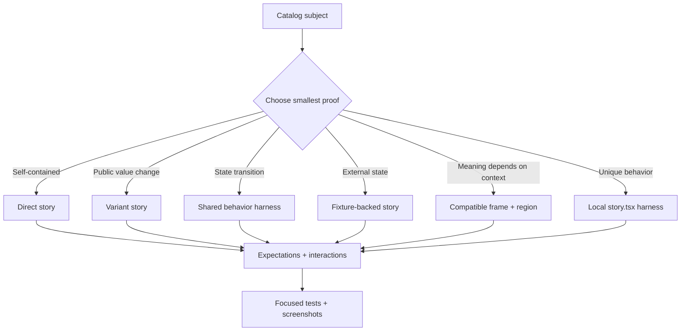

# Asset authoring and Preview composition

Behavioral claims are current only within the specific checks in the register. Other guidance and unverified descriptions below are **design intent**, not claims of current implementation. See the [behavior claim register](../internal/TESTING.md#behavior-claim-register).

This guide defines the production standard for catalog assets and their
stories. It is the operational companion to
[`../concepts/STORY-CONTRACT.md`](../concepts/STORY-CONTRACT.md).

## The composition model



The subject, frame, harness, fixture, and story contract have separate
ownership. `story.json` owns story identity, args, expectations, interactions,
composition references, and fixtures. Executable harness code owns rendering
and event wiring only. Frames own context layout and typed regions. Fixtures
own deterministic data or provider behavior.

## Source-of-truth map

| Rule                                             | Canonical owner                                                 | Runtime/enforcement owner                                  |
| ------------------------------------------------ | --------------------------------------------------------------- | ---------------------------------------------------------- |
| Asset kind, rung, dependency direction           | `catalog/assets/**` and `concepts/ARCHITECTURE.md`              | Catalog indexer and dependency-closure validator           |
| Story identity, args, expectations, interactions | Version-local `story.json` and `concepts/STORY-CONTRACT.md`     | Story parser, indexer, and browser evaluator               |
| Frame regions and accepted capabilities          | Frame catalog descriptor                                        | Frame registry and compatibility resolver                  |
| Frame implementation version                     | `story.json` frame `version`                                    | Preview version resolver                                   |
| Versioned harness implementation/export/config   | `story.json` `composition.harness` and `harnesses/**` | Harness registry and path-safety checks              |
| Unique behavior                                  | Version-local `story.tsx`                                       | Named-export validator and Preview runtime                 |
| Deterministic external state                     | Fixture catalog asset and story environment                     | Fixture registry and frame resolver                        |
| Production adoption                              | Component source and adoption manifest                          | Adoption closure validator; Preview artifacts are excluded |
| Visual proof                                     | Screenshot manifest attached to the validation run              | Capture/evidence gates and human image inspection          |

## Canonical frame inventory

These are the approved frame families. A family is not selectable until its
descriptor, implementation version, region contract, fixture ports, and
representative screenshots exist.

| Frame family           | Use for                                     | Required regions                                    | Subject requirement                              | Initial status      |
| ---------------------- | ------------------------------------------- | --------------------------------------------------- | ------------------------------------------------ | ------------------- |
| `host.standalone`      | Foundation and primitive specimens          | Host-owned subject surface                          | Any renderable React subject                     | Host-owned baseline |
| `navigation.page`      | Page-level navigation and content           | `navigation`, `content`                             | Subject accepts the declared page/content region | Existing            |
| `navigation.app-shell` | App-shell and persistent navigation         | `navigation`, `header`, `content`, optional `aside` | Subject is meaningful in an app-shell region     | Existing            |
| `overlays.dialog`      | Dialog, popover, modal, confirmation flows  | `trigger`, `overlay`, optional `page`               | Subject declares overlay/trigger capability      | Planned             |
| `workspace.split-pane` | Editors, inspectors, master/detail surfaces | `primary`, `secondary`, optional `toolbar`          | Subject declares workspace-panel capability      | Planned             |
| `templates.*`          | Page-template and end-to-end compositions   | Template-defined regions                            | Subject declares the named template port         | Planned             |

Compatibility must validate the exact frame implementation version, target,
region, subject capability, required fixture ports, dependency closure, and
evidence status. Catalog rank can suggest candidates but cannot prove
compatibility. The Preview selector may show compatible alternatives as a
temporary experiment; an author must explicitly save a new canonical story
reference.

Conceptual story shape (the parser's exact field names remain authoritative):

See the current v5 examples in [STORY-CONTRACT.md](../concepts/STORY-CONTRACT.md). The former v3 illustration is retired.

## Shared harness inventory

Shared harnesses are Preview-only, versioned, typed renderers with an injected
subject. They must not import a specific production component. They must not
own story IDs, expectations, or interaction sequences.

The registry at `harnesses/manifest.json` is the source of
truth for family applicability. Every family declares its supported subject
kinds, required capability signals, and allowed configuration keys. A family
is not valid because its TypeScript file compiles: it must pass
the governed catalog composition gate, which verifies the immutable registration,
implementation path, injected-foundation usage, forbidden production imports,
and forbidden network or persistent-storage side effects.

| Harness family        | Demonstrates                                       | Use when                                         | Do not use when                                |
| --------------------- | -------------------------------------------------- | ------------------------------------------------ | ---------------------------------------------- |
| `showcase`            | Clean default specimen and labelled variants       | Subject needs a polished visual introduction     | Behavior or context is the point               |
| `controlled-state`    | Controlled value plus callback/readout             | Public value and change contract matters         | Component is uncontrolled-only                 |
| `state-transition`    | User action changes visible state                  | Toggle, select, expand, copy, or submit behavior | No meaningful transition exists                |
| `async-state`         | Loading, success, empty, and error states          | Subject consumes deterministic async data        | A static variant is sufficient                 |
| `recovery`            | Retry, validation, permission, or failure recovery | Failure handling is part of the contract         | Failure is not user-observable                 |
| `data-state`          | Stable rows, filters, pagination, or selection     | Subject consumes a fixture-backed collection     | No external data is required                   |
| `overlay-interaction` | Open, focus, dismiss, and escape behavior          | Subject creates a dialog/popover/menu            | Subject has no overlay semantics               |
| `responsive-mode`     | Layout at supported breakpoints                    | Responsive behavior changes meaning or usability | A normal screenshot already proves layout      |
| `hook-contract`       | Hook actions and observable output                 | Asset kind is a runtime hook or adapter          | A production component story is more truthful  |
| `local`               | Asset-specific composition                         | No shared family can express the behavior        | A shared harness fits with equivalent evidence |

Shared harness inputs have one stable shape:

```tsx
type SharedHarnessProps<TArgs, TConfig> = {
  subject: React.ComponentType<TArgs>;
  args?: TArgs;
  config?: TConfig;
  environment?: Record<string, unknown>;
  fixtures?: Record<string, unknown>;
  log?: (event: { kind: string; [key: string]: unknown }) => void;
  children?: React.ReactNode;
};
```

The host injects `subject`, `args`, the declared environment and fixtures, and
the bounded event logger. The harness may provide presentation and state
adapters, but it may not import a subject, perform network or storage I/O, or
move expectations and interactions out of `story.json`.

## Deterministic fixture policy

Fixture families are versioned catalog assets. They own data shape, not a
component's story identity. Preview resolves them from a bounded in-process
registry with a fixed seed (`rcl-fixture-v1`), fixed clock, stable IDs, and
stable ordering. It never calls a production API or reads browser storage.

Every reusable family must expose, where its domain supports them, `typical`,
`empty`, `overflow`, `failure`, and `recovery` states. Collection fixtures
contain enough records to show hierarchy and density; they also include at
least one long label, missing optional value, or conflicting status when that
is a credible production case. A reviewer must reject a fixture that contains
only short happy-path values or claims a failure state without a consumer
story that renders the failure.

Keep a fixture local to `story.tsx` when its shape is unique to one subject.
Promote it to `catalog/assets/fixtures` only after two subjects or consumers
need the same domain and the family has a typed state contract. Capture
metadata records the exact fixture asset, version, state, seed, and clock.

For example, `controlled-state` requires explicit prop names when it owns the
controlled loop. It injects `valueProp`, `changeProp`, and `initialValue`, then
logs each controlled change. If those names are not declared, the family stays
a presentation shell and does not guess at the subject API.

### PreviewShowcase foundation API

`PreviewShowcase` is the shared visual grammar used by the registry families.
It owns the presentation shell and never owns story intent. Its required input
is the injected `subject`; `args` are passed to that subject unchanged except
for the explicit state adapter supplied by a family.

| Input | Meaning | Ownership rule |
|---|---|---|
| `subject` | The component supplied by the Preview host | Never import a production subject inside the shared foundation. |
| `args` | Resolved story arguments | The story contract and workbench own these values. |
| `config.title` / `config.detail` | Context text for the specimen | Harness configuration owns presentation copy; it must use registered keys. |
| `config.status` | Optional live status output | Use for observable state only; expectations remain in `story.json`. |
| `family` | Registry family marker and `data-preview-harness` value | The registry owns the family name. |
| `children` | Optional action/status region supplied by a harness | Do not use it to hide assertions or story interactions. |

The foundation exposes stable semantic regions: a labelled `section`, a
header containing family/title/description markers, a subject region, an
optional `role="status"` output, and an optional actions footer. It uses
semantic library tokens for surface, border, radius, spacing, typography,
foreground, muted foreground, and elevation. The host owns the outer
`[data-preview-sheet]` capture boundary; `PreviewShowcase` must not create a
second capture boundary.

Every foundation capture must be checked at light and dark themes and at a
standard desktop and narrow viewport. Browser capture disables animation for
stable evidence; the source still honors the library's reduced-motion tokens
and the subject remains responsible for its own focus and interaction
semantics. Overflow, missing subject, and harness errors fail the isolated
capture rather than being hidden by workspace chrome.

## Local harness rules

`story.tsx` is version-local and Preview-only. It may import the subject and
library foundations. It must use the shared Preview foundation components and
tokens, remain deterministic, and expose only named exports referenced by
`story.json`. It must not move expectations or interaction definitions out of
the JSON contract. Format it with the repository formatter and validate its
imports and export names during indexing. A local harness is an exception only
when the family registry cannot express the behavior; its inventory record
must state the reason, owner, and revisit condition.

## Migration and evidence

For each story, record one disposition: direct, variant, shared harness, local
harness, frame, fixture-backed, or intentional exception. Exceptions require a
reason, owner, missing evidence, and revisit condition. Preserve existing
expectations and meaningful interactions during contract authoring.

Minimum evidence for a reusable frame or harness is:

- focused contract and resolver tests;
- one representative story for each applicable hierarchy rung;
- light and dark screenshots at supported desktop and narrow viewports;
- inspected screenshots proving subject visibility, hierarchy, token use,
  focus treatment, motion behavior, overflow, and responsive layout;
- accessibility and interaction checks;
- proof that story, frame, harness, and fixture artifacts are excluded from
  production adoption and dependency closure.

Do not claim screenshot validation from filenames or generated metadata alone;
an operator must inspect the image output and record the inspected states.

### Component-sheet capture boundary

Preview evidence is captured from the isolated `/preview/{id}/harness.html`
document, not from the Components editor. Every rendered path—direct story,
local harness, shared harness, and frame composition—must expose exactly one
`data-preview-sheet` element. The capture runner screenshots that element and
records `captureTarget: "component-sheet"` plus the exact story, version,
frame, harness, fixture, theme, kit, viewport, and state. Workspace screenshots
may be retained as debugging evidence, but their disposition must be
`not-acceptance-evidence`.

For efficient review, the generic isolated route supports a bounded story
sheet. Provide `stories=<id>,<id>,...` on the same version-pinned
`/preview/{library-id}/harness.html` URL; the route accepts at most four unique
story IDs, renders each in a labeled iframe, and exposes exactly one outer
`data-preview-sheet` boundary. The outer harness reaches `ready` only after all
child stories report a passed result. BAS captures this URL through the same
CaptureService workflow used for individual stories. Each tile is still
rendered and validated in its own isolated harness before it is placed on the
labeled sheet. The capture manifest records the complete story group and
sheet artifact, so a contact sheet does not hide which stories were reviewed.
Individual captures remain the authoritative evidence and the sheet is only a
review accelerator.

In the live Components Preview canvas, use the per-story comparison controls or
the bounded Story sheet control to select a group of stories. The canvas switches from a
single focused specimen to one labeled multi-story sheet. `Show all stories`
clears the sheet selection and returns to the normal canvas. The cap is
intentional: larger sets reduce legibility and should be split into additional
sheets.

## Temporary frame experiments

The Components API exposes `ListPreviewFrames`. It reads catalog frame
descriptors and returns region-bearing candidates with stable compatibility
results and diagnostics. Preview may select a compatible candidate for the
current session; it sends the exact asset, version, region, capability, and
fixture to the isolated iframe. This selection is deliberately not written to
`story.json`.

To persist an author decision, update the story contract with the same exact
reference and re-index it:

```json
{
  "frame": {
    "asset": "navigation.page",
    "version": "1.0.0",
    "region": "navigation",
    "capability": "navigation",
    "fixture": "fixtures.resource-collection"
  }
}
```

Unknown implementations, unsupported targets, undeclared regions, capability
mismatches, and unsatisfied data-source fixture ports are rejected by the
server rather than being presented as valid choices.

## Source of truth

The contract parser and compatibility model live in
`api/internal/components/story_contract.go` and
`api/internal/components/catalog_frames.go`. The Preview resolver and exact
version checks live in `api/internal/preview/frame.go` and
`api/internal/preview/service.go`. The frame candidate API is implemented by
`api/handlers/components/connect_handler.go`, and the authoring picker is
implemented by `ui/src/features/components/ComponentEditorController.tsx` and
`ComponentEditorStage.tsx`. Keep this guide aligned with those seams when the
wire contract or catalog format changes.


## Exact composition render targets

`SketchService.RenderCandidate`, `SketchService.RenderSketch`, and
`PreviewService.RenderComposition` return a `target` descriptor alongside HTML.
The descriptor records the authored revision, render hash, SHA-256 of the exact
returned HTML bytes, input hash, and resolved kit, theme, and direction. Its kind
is `preview`; it does not certify production behavior or browser execution.

The render hash includes the generated harness with a fixed identity placeholder,
as well as the composition inputs. Changes to embedded renderer code or generated
markup therefore invalidate the render identity. The final HTML embeds that
identity for the existing readiness bridge. Hash the unmodified response HTML to
check `html_sha256`; adding a host-specific base element changes those bytes.
Empty theme and direction resolve to `light` and `ltr` before hashing.

A browser capture must additionally identify its viewport and interaction/state
request, verify the exact target, and retain BAS-owned artifact references. The
render response alone supplies no capture receipt or acceptance evidence.


## Capture operation persistence

The `internal/designcapture` domain owns durable capture intent in RCL's database.
Its schema is registered with startup schema initialization. A request contains
an exact preview target, its verified HTML bytes, and explicit viewport dimensions.
The repository accepts an idempotency key: repeating the same key and request
returns the existing operation; changing the request under that key conflicts.

State changes use a version compare-and-swap. Dispatch intent precedes browser
work. An unacknowledged dispatch can enter `dispatch_unknown`; this state cannot
return to dispatching automatically. A producer ID recovered from authoritative
BAS evidence can move it to running. A cancellation request remains distinct from
producer-confirmed cancellation, and completion may win that race. Completed
capture records require the same producer ID and a screenshot artifact reference.
Capture completion is not design acceptance.

The capture service claims dispatch with a version check before calling BAS.
Its bounded dispatch acknowledgement continues if the requesting client detaches;
a separate persistence budget retains the producer ID or dispatch uncertainty.
The BAS adapter sends a producer-schema-validated asynchronous workflow with an
explicit viewport, semantic readiness wait, exact render identity check, font
readiness, and region geometry extraction.

`handlers/designcapture.MountTarget` exposes the immutable HTML at
`/design-captures/<operation-id>/target.html` when supplied a routed repository
factory. It serves hash-verified bytes under a script-enabled opaque sandbox.
A missing repository route or corrupted target returns an error.

`SketchService.CaptureCandidate` now creates and dispatches a capture. Supply the
same `render` request used by `RenderCandidate`, its `expected_render_hash`, a
stable `idempotency_key`, and explicit `width`/`height`. The response contains the
operation ID and BAS producer ID. `GetCapture` retrieves the persisted operation.
Repeated identical requests reuse the same operation; changed input under a reused
key conflicts. A stale render target is rejected before dispatch.

The API mounts the immutable target route and binds repositories through
`RoutedDB.PoolForContext`. Missing or expired test database leases never select
primary storage. Browser dispatch in test mode currently fails explicitly because
BAS target navigation does not propagate the storage lease. Domain and handler
integration tests use isolated repositories.

`AttachCapture` observes the existing BAS execution once and persists its verified
terminal result. It does not restart or poll the producer. Observation errors keep
the existing state. Completion requires all three capture steps to succeed,
a screenshot owned by the target step, and one structured target result matching
the render hash and viewport. The receipt stores opaque BAS artifact references
and bounded semantic region geometry. No local artifact paths or screenshot bytes
are copied into RCL. Reattaching a terminal operation returns its existing receipt.

`GetCapture` reads persisted state without contacting BAS. Call `AttachCapture`
after producer completion to update it. Capture completion does not establish
design acceptance: wireframes can still appear in a valid capture. Test-mode
browser lease propagation remains unfinished.


## Capture from the Design workspace

Open a saved candidate and render its preview. The Browser capture section shows
its explicit capture viewport (desktop 1440 × 900 or phone 390 × 844). Capture
preview submits the exact render target. Refresh capture evidence attaches one
producer observation; it does not poll automatically. The receipt shows the
operation, browser run, artifact references, and recorded region count.

The browser session retains the capture idempotency key before submission and
stores the acknowledged operation ID. Retrying a timed-out request reuses its key.
Reopening the same render and viewport in that session retrieves the saved receipt
without another dispatch. Changing the render or viewport starts a different
capture intent. Clearing session storage removes this UI recovery pointer; the
operation remains in RCL and can be retrieved by ID through the API.

A stale render conflict requires rendering again before capture. Render targets
include `input_hashes` for composition, bindings, fixtures, bundle, bundle identity,
JavaScript, dependencies, CSS, import map, appearance, and harness. A stale-target
error includes the newly rendered target as structured Connect error detail so
callers can identify which contributor changed. These diagnostics are returned by
the renderer; persisted capture receipts currently retain the aggregate hashes.

The intermittent mismatch reported in Scenario QA `knw-1788598755553767498`
was caused by unordered iteration over dependency header objects. Object-form
headers now use sorted keys; array-form headers preserve authored order. The exact
target check remains enforced. A regression failed before the parser change and
passed afterward. A live 20-step workspace workflow completed desktop and phone
captures against the same render hash.


## Capture cancellation

`CancelCapture` takes the existing operation ID. It persists `cancel_requested`
before sending BAS's idempotent `StopExecution` request to that operation's
producer. A stop acknowledgement leaves the operation in `cancel_requested`;
`AttachCapture` must confirm cancellation, completion, or failure from BAS.
A capture that completes while cancellation is in flight retains its verified
completion evidence. Terminal operations are returned without another stop request.

The workspace exposes Cancel capture and Retry cancellation request. A lost stop
acknowledgement retains durable intent, and retry addresses the same producer.
Refresh capture evidence observes the producer once. Client disconnection does
not cancel server work: cancellation is an explicit operation. A prepared capture
can be cancelled before dispatch. A dispatch with unknown producer identity must
recover that identity before it can be stopped; recovery tooling remains unfinished.


BAS records explicit runner cancellation as its typed `cancelled` terminal status,
including terminal database transitions, execution snapshots, events, retention,
and test-fixture cleanup. Deadlines and other failures remain `failed`; error
text containing “cancel” does not by itself establish cancellation.

## Inspect a captured screenshot

For a completed operation, choose its `screenshot` artifact reference and call
`SketchService.GetCaptureScreenshot` with `{ "id": "<operation-id>", "reference":
"bas:<producer-id>:<artifact-id>" }`. The response provides the browser owner's
image URL, dimensions, content type, and original reference. Fetch that URL to
inspect the image. The Design workspace exposes the same operation as View
captured screenshot in the expanded capture receipt.

Resolution requires membership in the completed receipt, matching execution and
artifact identities, the target workflow step, dimensions consistent with the
verified viewport, and a PNG or JPEG location under the producing execution's BAS
screenshot route. Other runs,
duplicate identities, alternate origins, path traversal, and mismatched metadata
are rejected. Producer filesystem paths are not returned. RCL stores no additional
image copy, and opening the image neither dispatches nor attaches browser work.

The image URL is resolved on demand rather than persisted as durable evidence.
If BAS removes the image, the reference remains in the receipt while image loading
reports unavailability. Retry resolution to refresh the owner's location. Image
availability and successful capture remain separate from design acceptance.


Screenshot pixel dimensions and capture viewport dimensions are distinct. BAS's
execution writer derives image dimensions from the encoded PNG/JPEG; a capture
at 1440 × 900 CSS pixels can produce a 2880 × 1800 image on a high-density device.
The workspace displays the image using the receipt's CSS viewport dimensions.
The resolver accepts uniform device scaling up to 4×, with one-pixel rounding
tolerance, while the structured target evidence verifies CSS viewport and region
geometry separately. Historical BAS records can retain older viewport-based image
metadata; rendering does not rewrite those immutable receipts.

## Start another capture attempt

`RetryCapture` accepts a terminal operation ID and a new `idempotency_key`. It
captures that operation's immutable saved HTML and target again. The new operation
has its own identity and `previous_id`; the original operation and its artifacts
remain unchanged. This is an explicit recapture of the saved render, not a render
of updated source. Render the candidate again to capture changed rendering inputs.

Active, dispatching, or uncertain operations cannot be replaced through this
operation. Reusing the new idempotency key returns the same new attempt, including
after an attachment timeout. Reusing the previous attempt's key conflicts.

The workspace exposes Capture again on completed, failed, and cancelled receipts.
It stores the new key and previous operation ID before submission. A lost response
can be retried with Capture preview; it addresses the same new intent. The new
receipt includes a Previous capture section that reads the original receipt and
can display its screenshot without changing either operation.

## Visual critique domain contract

The `designcritique` domain defines rubric `visual-design/1` and policy
`visual-floor/1`. Typed critique RPCs and workspace review inspection are
available. Workspace review authoring is not wired yet.
The rubric is not calibrated for release. Its eight required dimensions are task
clarity, hierarchy, navigation continuity, responsive layout, state/recovery,
accessibility, terminology/i18n, and visual consistency.

| Score | Anchor |
|---|---|
| 0 | Unusable or absent |
| 1 | Severe issue |
| 2 | Material issue |
| 3 | Acceptable with minor issues |
| 4 | Strong |

Each rating requires a rationale and image evidence. Each finding requires a
rubric dimension, severity, rationale, correction, region, observed state label,
viewport, capture ID, and screenshot reference. Severity is critical, major,
minor, or informational. `$page` identifies a page-wide observation. Critic
identity and version are recorded; model critics also name a model and profile.
These are declared attribution fields, not authentication of a human review.

`CaptureEvidenceVerifier` checks the completed capture's scenario, design,
revision, render hash, viewport, region geometry, and screenshot membership.
It retrieves the image from the owner, rejects redirects, and checks actual image
format and dimensions against the descriptor. It decodes the image to reject
corruption. Retrieval is bounded to 30 seconds, 32 MiB of encoded bytes, and
16,777,216 decoded pixels. A record attempt has a 60-second
verification budget. Evidence outside these limits is unavailable for that review.

Every dimension must score at least three, and no critical or major finding may
remain, for `visualFloorMet` to be true. Aggregation reports the lowest score and
all blocking dimensions and findings. It does not use an average to hide failures.
`acceptanceEstablished` remains false: deterministic Experience Manager claims,
required-region completeness, calibration, and independent review are separate
gates. An observed state label does not prove a state transition or recovery path.

The domain stores immutable review facts and assessments in its embedded schema.
The same idempotency key and payload return the original record, even if its image
later expires. A changed payload conflicts. Read operations verify payload hashes
and recompute aggregation. A historical review does not prove current image
availability; an acceptance operation must revalidate its evidence.

## Record and retrieve a visual critique

1. Call `SketchService.GetCritiqueRubric` to obtain the rubric, policy, dimensions,
   anchors, and calibration status. `calibrated` is currently false.
2. Inspect the actual captured image. Record the critic's identity and explicit
   limitations. Do not label a model review as independent human calibration.
3. Call `RecordCritique` with a stable `idempotency_key` and typed `review`.
   The review contains `target`, `rubric_version`, `policy_version`, `critic`,
   `ratings`, and `findings`. Evidence identifies `capture_id`, `artifact`,
   `region`, observed `state`, and CSS viewport `width`/`height`.
4. Keep the returned record ID and hash. `GetCritique` returns that immutable
   review and assessment. Repeating the same submission returns the same record.
   A changed payload under the same key returns an aborted conflict.

The API binds review and capture repositories to the request's routed SQL pool.
An unavailable route returns unavailable. Test-mode fixtures can record reviews
against isolated repositories and an isolated image owner without dispatching
browser work. Test-mode browser capture creation still requires lease propagation.

`visual_floor_met` reports only the rubric floor. `acceptance_established` remains
false. Missing interaction, phone, language, or accessibility evidence must be
stated in the review. A screenshot does not establish those behavioral claims.


## Browse reviews for a rendered candidate

`ListCritiques` takes an exact critique `target` and an optional `before_id`.
It returns at most 20 verified summaries and `next_before_id` when another page
exists. Use that cursor with the same target. A cursor from another revision or
render is rejected. Every listed record passes its stored hash and aggregation
checks; a corrupt record causes an explicit error.

The workspace lists reviews below the rendered candidate. Open a review to read
its declared critic, rubric and policy versions, lowest score, eight dimension
ratings, findings, corrections, and evidence context. Image evidence can be loaded
from BAS on demand. Older reviews can be paged in without copying image payloads.
The UI checks the selected record hash and target before displaying detail.
Review inspection does not dispatch captures, alter review facts, or accept a
design. Calibration and acceptance limitations remain visible.

## Message fixtures for transcript composition

Published `ai.message@1.1.1` provides named `user`, `assistant`, `streaming`,
`loading`, `request-error`, and `retry` specimens. The declarative arguments
contain actor, content, state, and optional timestamps. Error specimens include
an explicit retry marker and label. The story module demonstrates a local
transition to loading when retry is pressed.

The Message component retains existing content while a response is loading or
retrying. Its loading announcement does not duplicate the content description ID.
Scenario callbacks still own real retry behavior. A message specimen does not
replace a transcript collection, its scroll anchoring, or its history controls.

## Materialized release checks

Composition rendering compares the entry and companion files on disk with the
selected versions' indexed digests before compilation. A changed template stops
rendering. A changed region remains an `asset_unresolved` gap. The renderer checks
the selected closure again after compilation and rejects changes that remain at
that boundary. An internally consistent index alone does not prove that the
materialized files still match it.

These checks do not repair releases or update attestations. They also do not
establish a source-to-artifact receipt for the compiled package distribution or
provide a filesystem snapshot across compilation. Those provenance guarantees
require separate build evidence.

Preview compilation now resolves library imports from authored catalog sources,
not the installed package distribution. A major import inside a version or its
companions uses that version's `dependencies.json` recorded version. A missing
ledger entry or unavailable recorded version fails compilation; a newer release
does not silently replace it. Generated compositions use exact imports directly.
The browser dependency-header scan follows the same recorded imports and omits
TypeScript-only references and stylesheet files from its runtime module scan.

This removes stale package builds from preview selection. It does not prove that
a production package build matches the preview; production artifact provenance
and the existing before/after source checks remain separate obligations.

## Virtualized history and scrolling

`data-display.virtual-list@1.2.2` measures row border boxes and tracks heights by
stable item key. Supply `getItemKey` when inserting, deleting, or reordering
items. The list preserves the visible item's viewport offset when earlier rows
are inserted or resized. It retains a focused row while that row is outside
the visible window.

Set `followEnd` to follow appended or growing content while the reader is at the
end. A reader who scrolls away keeps their position. `endThreshold` controls the
distance treated as the end (24 CSS pixels by default). With `followEnd`, the
initial view starts at the end unless `initialScrollTop` is supplied.

Pass a React ref through `controllerRef` to call `scrollToOffset`, `scrollToEnd`,
or `getScrollPosition`. `onViewportChange` reports scroll position, scroll height,
viewport height, and start/end flags. These ports allow a transcript to provide a
new-message indicator and a return-to-latest control without querying the list's
DOM. Real message data, retry actions, branching, and history requests remain the
consumer's responsibility.

The `scroll-anchoring` story exercises history, growth, focus, and empty recovery.
`bas/cases/preview/virtual-list-scroll-anchoring.json` checks these behaviors through
the scenario's preview route. Unversioned story URLs select the manifest's
published `latest` version. Draft previews require an explicit version; a removed
draft does not shadow the published story or fall back to another version.

## Mobile collection and detail navigation

A visual critique may compare multiple captured states, themes or viewports of the
same candidate revision. Each evidence item may set `render_hash` to the exact
render shown by its capture; omitting it retains the review target's render hash.
The verifier checks every image against that explicit render, candidate revision,
design, viewport and producer-owned artifact. Alternate render hashes do not permit
images from another revision or design. Each image's render identity is displayed
with its evidence. This enables comparative ratings without claiming calibration,
behavioral success, current source parity, or acceptance. Review consumers must
still check required state/viewport coverage and relevant input freshness.

Saved candidates can be added to a two-pane comparison without selecting or
publishing either candidate. Each pane verifies its fetched scenario, page, design
and revision identity and owns its render, theme, preview state and capture controls.
Removing one comparison leaves the other render and the open candidate intact.
A third candidate requires removing an existing comparison first.

Canvas viewports are fixed to the same dimensions as captures: desktop 1440×900
and phone 390×844 CSS pixels. The iframe scales visually to fit its container using
ResizeObserver; scaling does not change its layout viewport. Comparison columns
therefore do not accidentally turn a desktop composition into a narrow layout.
Each pane retains its own render identity; comparison is visual evidence exploration,
not ranking, selection, or acceptance.

`RefineCandidate` derives an immutable candidate from an exact parent reference.
Supply the revised sketch, requested semantic regions and rationale. The operation
records actual changed regions and requires `broader_change_reason` for changes
outside the request; `$page` denotes shared inputs such as template, intent or
interaction configuration. A broader rationale cannot override a region lock.
Unknown/duplicate requested regions are rejected. No-op changes return `unchanged`.

A refinement chain starts with three rounds. Each changed candidate records its
round, budget and parent; retries with identical inputs produce the same identity.
Ordinary candidate branches carry the last refinement metadata forward, preserving
the budget. At exhaustion, the API returns `budget_exhausted` with the current
candidate and writes nothing. It does not assert that this candidate is the best or
accepted. Explicit continuation supplies one to ten additional rounds and a changed
sketch; the extended budget is committed with that refinement. Review findings and
independent acceptance remain separate requirements. The candidate view displays the
last refinement's rationale, actual scope and round budget.

The page workspace can lock an authored region. `SketchRegion.locked` is stored
in the revision and preserved through candidate branches. The shared write boundary
rejects changes to its asset, region content, slot, bindings, fixtures or scoped notes;
it also protects shared template, intent and interaction inputs that could alter the
region indirectly. An unrelated unlocked region can still change. Shared-input changes
may therefore require explicitly unlocking affected regions first.

Unlocking must be its own revision with protected content unchanged; combining unlock
and content edits is rejected. The next write uses the unlocked revision's hash.
Locks are edit constraints, not evidence of acceptance. They protect descendants of
the locked page/candidate, not independently authored alternatives from another base.

`CollectionList` 1.2.0 accepts `searchFields`, an explicit list of literal record
fields searched by its `query` prop. Matching trims the query and ignores letter
case; a custom `search` callback takes precedence. This uses the same collection
filtering path as an application's callback, including empty results.

Composition renders include a versioned `local-submit-v1` policy marker. The canvas
and marked capture targets allow form events so local React submission handlers can
run; `form-action 'none'` still forbids form navigation. Capture targets without that
marker retain their original sandbox. The marker participates in the immutable HTML
and render identity, so form-policy changes require a fresh render and capture.

Preview action rules may include `set` assignments, for example:
`{"state":"list","set":[{"target":"thread-list-region","prop":"query","argument":["query"]}]}`.
An assignment copies a scalar from the callback's first argument through an own-field
path (at most four fields), or supplies a literal `value`. Up to 32 assignments are
allowed per action; strings are bounded to 4096, and objects, executable props,
navigation props and unsafe paths are rejected. Assignments merge after state props
and persist across local transitions; reloading resets them. Invalid callback values
reject the action before any assignment or transition. Reset can assign an empty
query. These bindings demonstrate fixture interactions, not production API calls;
transient query evidence belongs to its journey producer, not the initial capture.

`FilterBar` 1.2.0 accepts `density="compact"` for smaller outer spacing and
side-by-side actions on phones, preserving touch targets, submission, reset and
filter summaries. `queryPlaceholder` accepts localized domain terminology independently
of the accessible `queryLabel`. The comfortable layout remains the default.
FilterBar 1.2.1 reports only selected filter-option counts and omits that summary
when no options are present. Result counts and empty-result messages belong to the
collection or its data adapter, so a submitted query cannot leave a false all-results
claim in the filter controls.

`CollectionPage` 1.3.0 accepts `detailTitle`, a visible level-two heading above
the inspector. Supply the selected item's display title so the detail retains its
list context on phone and desktop. It also names the inspector when `detailLabel`
is omitted; `detailLabel` remains available for an explicit accessible label.
The title is optional, wraps long text, and follows the controlled selection without
changing the collection's Back, focus restoration or mounted filter state.

The design canvas offers a preview-state selector for candidates with a declared
state graph. `RenderCandidateRequest.preview_state` selects a declared state as the
render's initial state; an empty value keeps the authored initial state. Unknown
states fail before rendering. Selection leaves the saved candidate unchanged, while
the effective bindings participate in the render hash. `CaptureCandidate` repeats
that same render request, so a hash from another state is rejected. Changing the
selector makes the prior canvas and capture controls stale until rendered again.
This captures the selected fixture state; interaction-journey evidence remains a
separate proof of how a user reaches it.

Candidate render bindings may include a `$preview` finite-state fixture:

```json
{
  "initial": "list",
  "states": {
    "list": { "$template": { "mobilePane": "collection" } },
    "detail": { "$template": { "mobilePane": "inspector" } }
  },
  "actions": {
    "openThread": [{ "argument": ["id"], "equals": "support", "state": "detail" }],
    "back": [{ "state": "list" }]
  }
}
```

Attach named callbacks with existing markers such as
`onOpen: {"$handler":"openThread"}`. The preview reads the declared path from
the callback's first argument and takes the first matching transition. An
unconditional transition has no argument path and must be last. Unmatched
callbacks retain the current state and still produce the usual preview event.
State overrides shallow-merge props for each declared asset target; arrays and
nested prop objects replace their base value. Supply a complete nested value
when changing it. The graph allows at most 32 states, 64 actions and 32 rules
per action, with argument paths limited to four fields.

The harness exposes the active state as `data-rcl-preview-state` and logs
`preview-transition` events. Reloading starts at `initial`. The graph is part of
the immutable binding/render identity, while transient state belongs to that
browser session. Capture operations initially render `initial`; a later journey
screenshot must retain its execution and transition evidence. It is not the
initial capture's screenshot.

These are deterministic preview fixtures. They do not evaluate code, invoke
scenario APIs, change routes, or supply production business adapters. The
generated production composition receives ordinary typed bindings and does
not receive the `$preview` graph.

`templates.collection-page@1.2.0` accepts `mobilePane: "collection" | "inspector"`
and `onMobilePaneChange`. Derive the pane from the scenario's route or selected
record. On screens narrower than 56rem, inspector mode hides the collection and
filters and focuses the named detail region. Its Back button requests the
collection pane through the callback. On desktop, both regions remain visible.

The hidden collection and filters stay mounted. Returning from detail restores
focus to the originating row when it still exists; otherwise the collection
container receives focus. List scrolling and uncontrolled filter input survive
the transition. If the inspector is absent, the template shows the collection.
Omitting `mobilePane` preserves the stacked mobile layout.

Supply localized `backLabel` and `detailLabel` when the defaults do not name the
product's task. The template does not change routes, choose a record, fetch
history, or invent a Back action when the callback is missing. Those operations
belong to the adopting scenario's typed bindings. Static candidate fixture data
does not establish an interactive navigation journey.

The `mobile-navigation` specimen demonstrates selection and Back. The registered
`collection-page-mobile-navigation` case checks detail identity, hidden-pane
visibility, focus, list scroll position and retained filter input. The
`collection-page-controlled-desktop` case checks that the same controlled pane
state leaves the desktop workspace visible.

## Recover a drifted release before authoring

Use the existing `VersionLifecycleService/MaterializeVersion` operation when
`draft-begin` refuses changed release files. First materialize the one exact
component and version into a fresh temporary directory using `into`. Verify the
mirror hashes against the recorded release attestations. Preserve all current
files outside the managed library before restoring anything.

Call the same operation for that component and version with `into` omitted to
restore the verified mirror. Then begin a draft and carry the preserved changes
into that draft for review, repair, and publication. Do not change attestations
to accept the drift, and do not restore unrelated versions. The live materializer
replaces divergent files, so preserving the current bytes first is essential.

## Proposal constraints

DesignIntent.constraints records an optional scenario-relative designSource and
optional preserveRoutes and preserveBusinessBehavior flags. Proposal generation
defaults omitted flags to true; explicit false remains an explicit opt-out and
produces a review obligation. A path: prefix is normalized. Absolute paths,
traversal, URLs and backslashes are rejected.

When a source is supplied, ProposeSketch reads it through the routed scenario
repository and returns designSource with path, contentHash (SHA-256) and exact
UTF-8 content. Reads are limited to 128 KiB of nonempty regular-file text;
scenario-confined aliases are allowed and escaping links are rejected.
Candidate intent retains designSourceHash. Supplying a previous hash as an
input precondition rejects a changed source with failed_precondition.
Omitting the source preserves the source-free workflow.

The proposal form exposes the source snapshot as escaped text. A read receipt
is not source conformance: the lexical ranking does not interpret the document.
The response carries source text; candidate intent pins its hash, not a durable
copy of the text. Source reconciliation,
route reachability and business journeys remain acceptance obligations.
The proposal form invalidates prior results when constraints change. Retrieval
remains explicitly lexical; no inference dispatch or acceptance is implied.

## Governed typed alternatives

InferSketch takes a ProposeSketchRequest and an explicit idempotencyKey.
It builds up to three compatible lexical catalog alternatives, reads any
requested design source, and records the full proposal context before calling
ai-gateway's extract.structured role with a 4096-token output cap.

The gateway receives its supported schema subset. RCL separately rejects
unknown fields, duplicate or out-of-range candidate indices, excessive counts
or text lengths, and source-section IDs absent from the exact source snapshot.
The prompt carries named document sections and their exact line spans. RCL
adds the selected section reference to each proposed requirement. The durable
operation retains the full source text. Whether that section supports the
requirement still needs review.
Inference can rank existing candidates and append proposed requirements. It
cannot change their asset identities, versions or executable bindings. Its
requirements do not establish source conformance or acceptance.

The domain's embedded SQLite schema stores exact request context and the full
gateway response, including reported usage and applied settings. The RPC
returns provider, model and reported token/cost accounting. GetSketchInference
reads the existing operation and reconstructs its validated alternatives
without calling the gateway.

A dispatch claim atomically changes prepared to dispatch_unknown before the
external call. That state means completion is not known; another caller or a
restarted server cannot resend it automatically. A received validated result
becomes completed; a received refusal or locally invalid result becomes failed.
Transport errors leave dispatch_unknown. A crash between reservation and
sending can also leave that state even when no provider call occurred.
There is no gateway operation lookup, so unknown outcomes cannot currently be
automatically reconciled. Read the existing operation after observation loss. GetSketchInference accepts
either its id or the original idempotencyKey, so a lost first response does
not require knowledge of the generated operation ID.

An idempotency key is bound to the scenario, page and complete assembled inputs. Reusing it with
different target, source, catalog alternatives or authored revision returns
already_exists. GetSketchInference remains available when those inputs change.
Inference dispatch in test mode is refused until gateway test routing exists.
ProposeSketch remains the explicit source-aware lexical path.
The CLI exposes the same operations without handwritten RPC payloads:

```bash
react-component-library sketch propose switchboard/conversations --intent 'Review and respond to conversations' --user Operator --task 'Read and reply to a conversation' --design-source DESIGN.md --json
react-component-library sketch infer switchboard/conversations --intent 'Review and respond to conversations' --user Operator --task 'Read and reply to a conversation' --design-source DESIGN.md --key conversations-design-01 --json
react-component-library sketch inference --key conversations-design-01 --json
```

Repeat `--user`, `--task`, or `--viewport` for multiple values. Proposal and
inference default to phone and desktop viewports and preserve routes and
business behavior. `--allow-route-changes` and `--allow-behavior-changes`
explicitly relax those constraints. The proposal command does not dispatch
inference. After a lost inference response, use the read-only `inference`
command before considering another dispatch. Historical operations without
target scope remain readable; their keys cannot dispatch newly scoped input.
The design form currently uses ProposeSketch and does not yet offer inference
dispatch or recovery.

Preview action rules may return an optional boolean `result` for controls whose
callback requires explicit acceptance, such as PromptComposer. This is a fixture
result; it never sends a scenario request. Assignment entries may use
`"scope": "state"` to retain a value only within the current declared preview
state. For example, each conversation can retain its own reply draft while the
shared search query uses the default session-wide assignments. Unknown scopes
and non-boolean results are rejected before rendering.

CollectionPage 1.5 supports `filterPlacement: "collection"` for a split
workspace and an `inspectorActions` region for persistent selected-item actions.
Message 1.2 and MessageList 1.1 support `presentation: "transcript"` to remove
standalone card framing while retaining their existing semantics and recovery
controls. The default card presentation remains available for isolated messages.

Render regions can name a `parent` region. Their `slot` then addresses that
asset's props, rather than the page template's props. For example, a Button
region with `parent: "page-heading"` and `slot: ["actions"]` fills a PageHeader's
action area. A ResponsiveDialog can similarly receive Select and Button regions
through `children` and `footer`. Preview and generated production layout use the
same nested lowering. Parent cycles, missing parents, and overlapping sibling
slots are rejected; a required child hidden by an unresolved parent remains a
reported gap. Locks include containing layouts and descendants. Template-port
mapping preserves nested controls instead of treating them as template ports.

For browser-only interaction checks, mount the exact RenderCandidate HTML in a
BAS-owned page on the RCL API origin using an evaluate step with `document.open`,
`document.write`, and `document.close`. Wait for the generated preview readiness
marker before interacting. This avoids creating a capture merely to host the
HTML; it is interaction evidence, not an attached visual-acceptance receipt.
Rules with `argument: []` and an explicit `equals` compare the callback's first
scalar argument. Select 1.3 exposes `onValueChange` for that purpose, avoiding
DOM-event traversal in fixture bindings.

For interaction-only BAS checks, supply an ExecutionParameters file through
`workflows execute-adhoc --parameters-file` with `artifactConfig.profile` set to
`custom` and `artifactConfig.collectScreenshots` set to `false`. This preserves
interaction validation without taking a screenshot after every step. Use a
separate visual checkpoint when the composed appearance has materially changed.
For a checkpoint containing an explicit screenshot step, use the existing BAS
`validation` artifact profile instead. It retains explicit screenshots and
failure evidence, and also captures navigation/assertion steps. A custom
`collectScreenshots: false` disables persistence even for an explicit screenshot
action; use that setting only for checks that require no image artifact.

### Durable acceptance decisions

`sketch render-candidate` renders a saved candidate with explicit appearance and
preview-state inputs. Its JSON response includes the generated HTML, render hash,
and individual input hashes. Use those exact inputs for `sketch acceptance-check`.
The studio exposes the same check beside the selected visual review.

`sketch accept` records a decision request; the command name does not guarantee
an accepted result. Supply `--scenario`, `--design`, `--candidate`, `--render-hash`,
`--actor`, and a stable `--key`, together with the rendering options and repeated
`--critique` IDs. The actor is caller-declared provenance, not independent human
review evidence. A request cannot supply passing proof flags or waive a gate.

The owner first persists `prepared` intent in the scenario's
`experience/designs/<design-id>/acceptance/` directory. It then resolves current
proof and writes one terminal result: `accepted`, `needs_evidence`, or `failed`.
The result binds the immutable candidate (including its assets, constraints and
fixtures), authored base hash, render inputs, policy, actor and evidence IDs.
Only a complete conjunction of passing requirements with evidence can accept.
The authored page is checked again under its write lock before acceptance.

Repeat identical inputs and the same key after a lost response. A terminal retry
returns the original decision without contacting evidence producers again; a
prepared request resumes evaluation. Read a known result with
`sketch acceptance --scenario <scenario> --design <design-id> --id <operation-id>`.
After evidence changes, explicitly create a new attempt with a new key; the studio
labels this action “Recheck and record a new decision.” Previous decisions remain
immutable. Recording a decision does not select a revision or apply product code.

The current live proof adapters still report behavior/journey evidence, reviewed
rubric calibration, and independent demonstration review as unavailable. Therefore
current live requests produce `needs_evidence`, not acceptance. Implementing those
proof integrations and acceptance-gated application remains required work; the
receipt mechanism and its positive unit fixtures do not establish those proofs.

Generated binding types exclude slots filled by the composition. A nested child
such as `dialog.children` therefore does not require a duplicate React node from
the adopting app. Required business props and siblings remain required. When a
generated child instantiates an otherwise optional object, the app must supply
that object's required business siblings; an object containing only generated
slots may be omitted. Preview and production source use this same lowering rule.
The focused compiler tests invoke TypeScript against generated source and a
consumer, including rejected missing-data and duplicate-child examples.

Generated source exports `compositionProvenance` with a schema version, generator
version, candidate revision, composition hash and declaration, and the verified
published dependency closure. Each asset records its stable library ID, exact
version, entry and companion-file digests, and dependency edges. Unresolved
regions retain their codes and required status. The record excludes host paths,
timestamps, preview fixture data, and error prose. It identifies layout source;
it is not a behavior verdict, an appearance receipt, or permission to apply a
candidate. Regeneration must still revalidate the accepted revision and current
producer evidence before writing product artifacts.
