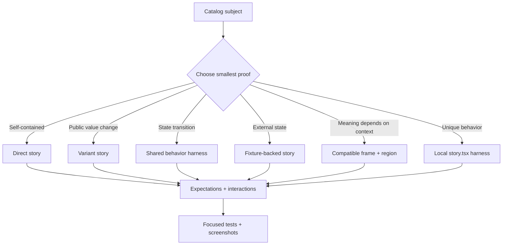

# Asset authoring and Preview composition

This guide defines the production standard for catalog assets and their
stories. It is the operational companion to
[`../concepts/STORY-CONTRACT.md`](../concepts/STORY-CONTRACT.md).

## The composition model



The subject, frame, harness, fixture, and story contract have separate
ownership. `story.json` owns story identity, args, expectations, interactions,
composition references, and fixtures. Executable harness code owns rendering
and event wiring only. Frames own context layout and typed regions. Fixtures
own deterministic data or provider behavior.

## Source-of-truth map

| Rule                                             | Canonical owner                                                 | Runtime/enforcement owner                                  |
| ------------------------------------------------ | --------------------------------------------------------------- | ---------------------------------------------------------- |
| Asset kind, rung, dependency direction           | `catalog/assets/**` and `concepts/ARCHITECTURE.md`              | Catalog indexer and dependency-closure validator           |
| Story identity, args, expectations, interactions | Version-local `story.json` and `concepts/STORY-CONTRACT.md`     | Story parser, indexer, and browser evaluator               |
| Frame regions and accepted capabilities          | Frame catalog descriptor                                        | Frame registry and compatibility resolver                  |
| Frame implementation version                     | `story.json` frame `version`                                    | Preview version resolver                                   |
| Shared harness implementation/export/config      | `story.json` `sharedHarness` and `library/preview-harnesses/**` | Shared harness bundler and path-safety checks              |
| Unique behavior                                  | Version-local `story.tsx`                                       | Named-export validator and Preview runtime                 |
| Deterministic external state                     | Fixture catalog asset and story environment                     | Fixture registry and frame resolver                        |
| Production adoption                              | Component source and adoption manifest                          | Adoption closure validator; Preview artifacts are excluded |
| Visual proof                                     | Screenshot manifest attached to the validation run              | Capture/evidence gates and human image inspection          |

## Canonical frame inventory

These are the approved frame families. A family is not selectable until its
descriptor, implementation version, region contract, fixture ports, and
representative screenshots exist.

| Frame family           | Use for                                     | Required regions                                    | Subject requirement                              | Initial status      |
| ---------------------- | ------------------------------------------- | --------------------------------------------------- | ------------------------------------------------ | ------------------- |
| `host.standalone`      | Foundation and primitive specimens          | Host-owned subject surface                          | Any renderable React subject                     | Host-owned baseline |
| `navigation.page`      | Page-level navigation and content           | `navigation`, `content`                             | Subject accepts the declared page/content region | Existing            |
| `navigation.app-shell` | App-shell and persistent navigation         | `navigation`, `header`, `content`, optional `aside` | Subject is meaningful in an app-shell region     | Existing            |
| `overlays.dialog`      | Dialog, popover, modal, confirmation flows  | `trigger`, `overlay`, optional `page`               | Subject declares overlay/trigger capability      | Planned             |
| `workspace.split-pane` | Editors, inspectors, master/detail surfaces | `primary`, `secondary`, optional `toolbar`          | Subject declares workspace-panel capability      | Planned             |
| `templates.*`          | Page-template and end-to-end compositions   | Template-defined regions                            | Subject declares the named template port         | Planned             |

Compatibility must validate the exact frame implementation version, target,
region, subject capability, required fixture ports, dependency closure, and
evidence status. Catalog rank can suggest candidates but cannot prove
compatibility. The Preview selector may show compatible alternatives as a
temporary experiment; an author must explicitly save a new canonical story
reference.

Conceptual story shape (the parser's exact field names remain authoritative):

```json
{
  "schemaVersion": 3,
  "kind": "component",
  "title": "Filter bar in a page",
  "args": { "fields": [] },
  "environment": { "fixtures": ["fixtures.filter-options"] },
  "frame": {
    "asset": "navigation.page",
    "version": "1.0.0",
    "region": "content",
    "fixture": "fixtures.filter-options"
  },
  "stories": [
    {
      "id": "default",
      "name": "Default page context",
      "args": {},
      "expect": [{ "kind": "role", "role": "region", "name": "Filters" }]
    }
  ]
}
```

## Shared harness inventory

Shared harnesses are Preview-only, versioned, typed renderers with an injected
subject. They must not import a specific production component. They must not
own story IDs, expectations, or interaction sequences.

The registry at `library/preview-harnesses/manifest.json` is the source of
truth for family applicability. Every family declares its supported subject
kinds, required capability signals, and allowed configuration keys. A family
is not valid because its TypeScript file compiles: it must pass
`pnpm preview:harness:check`, which verifies the immutable registration,
implementation path, injected-foundation usage, forbidden production imports,
and forbidden network or persistent-storage side effects.

| Harness family        | Demonstrates                                       | Use when                                         | Do not use when                                |
| --------------------- | -------------------------------------------------- | ------------------------------------------------ | ---------------------------------------------- |
| `showcase`            | Clean default specimen and labelled variants       | Subject needs a polished visual introduction     | Behavior or context is the point               |
| `controlled-state`    | Controlled value plus callback/readout             | Public value and change contract matters         | Component is uncontrolled-only                 |
| `state-transition`    | User action changes visible state                  | Toggle, select, expand, copy, or submit behavior | No meaningful transition exists                |
| `async-state`         | Loading, success, empty, and error states          | Subject consumes deterministic async data        | A static variant is sufficient                 |
| `recovery`            | Retry, validation, permission, or failure recovery | Failure handling is part of the contract         | Failure is not user-observable                 |
| `data-state`          | Stable rows, filters, pagination, or selection     | Subject consumes a fixture-backed collection     | No external data is required                   |
| `overlay-interaction` | Open, focus, dismiss, and escape behavior          | Subject creates a dialog/popover/menu            | Subject has no overlay semantics               |
| `responsive-mode`     | Layout at supported breakpoints                    | Responsive behavior changes meaning or usability | A normal screenshot already proves layout      |
| `hook-contract`       | Hook actions and observable output                 | Asset kind is a runtime hook or adapter          | A production component story is more truthful  |
| `local`               | Asset-specific composition                         | No shared family can express the behavior        | A shared harness fits with equivalent evidence |

Shared harness inputs have one stable shape:

```tsx
type SharedHarnessProps<TArgs, TConfig> = {
  subject: React.ComponentType<TArgs>;
  args?: TArgs;
  config?: TConfig;
  environment?: Record<string, unknown>;
  fixtures?: Record<string, unknown>;
  log?: (event: { kind: string; [key: string]: unknown }) => void;
  children?: React.ReactNode;
};
```

The host injects `subject`, `args`, the declared environment and fixtures, and
the bounded event logger. The harness may provide presentation and state
adapters, but it may not import a subject, perform network or storage I/O, or
move expectations and interactions out of `story.json`.

## Deterministic fixture policy

Fixture families are versioned catalog assets. They own data shape, not a
component's story identity. Preview resolves them from a bounded in-process
registry with a fixed seed (`rcl-fixture-v1`), fixed clock, stable IDs, and
stable ordering. It never calls a production API or reads browser storage.

Every reusable family must expose, where its domain supports them, `typical`,
`empty`, `overflow`, `failure`, and `recovery` states. Collection fixtures
contain enough records to show hierarchy and density; they also include at
least one long label, missing optional value, or conflicting status when that
is a credible production case. A reviewer must reject a fixture that contains
only short happy-path values or claims a failure state without a consumer
story that renders the failure.

Keep a fixture local to `story.tsx` when its shape is unique to one subject.
Promote it to `catalog/assets/fixtures` only after two subjects or consumers
need the same domain and the family has a typed state contract. Capture
metadata records the exact fixture asset, version, state, seed, and clock.

For example, `controlled-state` requires explicit prop names when it owns the
controlled loop. It injects `valueProp`, `changeProp`, and `initialValue`, then
logs each controlled change. If those names are not declared, the family stays
a presentation shell and does not guess at the subject API.

### PreviewShowcase foundation API

`PreviewShowcase` is the shared visual grammar used by the registry families.
It owns the presentation shell and never owns story intent. Its required input
is the injected `subject`; `args` are passed to that subject unchanged except
for the explicit state adapter supplied by a family.

| Input | Meaning | Ownership rule |
|---|---|---|
| `subject` | The component supplied by the Preview host | Never import a production subject inside the shared foundation. |
| `args` | Resolved story arguments | The story contract and workbench own these values. |
| `config.title` / `config.detail` | Context text for the specimen | Harness configuration owns presentation copy; it must use registered keys. |
| `config.status` | Optional live status output | Use for observable state only; expectations remain in `story.json`. |
| `family` | Registry family marker and `data-preview-harness` value | The registry owns the family name. |
| `children` | Optional action/status region supplied by a harness | Do not use it to hide assertions or story interactions. |

The foundation exposes stable semantic regions: a labelled `section`, a
header containing family/title/description markers, a subject region, an
optional `role="status"` output, and an optional actions footer. It uses
semantic library tokens for surface, border, radius, spacing, typography,
foreground, muted foreground, and elevation. The host owns the outer
`[data-preview-sheet]` capture boundary; `PreviewShowcase` must not create a
second capture boundary.

Every foundation capture must be checked at light and dark themes and at a
standard desktop and narrow viewport. Browser capture disables animation for
stable evidence; the source still honors the library's reduced-motion tokens
and the subject remains responsible for its own focus and interaction
semantics. Overflow, missing subject, and harness errors fail the isolated
capture rather than being hidden by workspace chrome.

## Local harness rules

`story.tsx` is version-local and Preview-only. It may import the subject and
library foundations. It must use the shared Preview foundation components and
tokens, remain deterministic, and expose only named exports referenced by
`story.json`. It must not move expectations or interaction definitions out of
the JSON contract. Format it with the repository formatter and validate its
imports and export names during indexing. A local harness is an exception only
when the family registry cannot express the behavior; its inventory record
must state the reason, owner, and revisit condition.

## Migration and evidence

For each story, record one disposition: direct, variant, shared harness, local
harness, frame, fixture-backed, or intentional exception. Exceptions require a
reason, owner, missing evidence, and revisit condition. Preserve existing
expectations and meaningful interactions during migration.

Minimum evidence for a reusable frame or harness is:

- focused contract and resolver tests;
- one representative story for each applicable hierarchy rung;
- light and dark screenshots at supported desktop and narrow viewports;
- inspected screenshots proving subject visibility, hierarchy, token use,
  focus treatment, motion behavior, overflow, and responsive layout;
- accessibility and interaction checks;
- proof that story, frame, harness, and fixture artifacts are excluded from
  production adoption and dependency closure.

Do not claim screenshot validation from filenames or generated metadata alone;
an operator must inspect the image output and record the inspected states.

### Component-sheet capture boundary

Preview evidence is captured from the isolated `/preview/{id}/harness.html`
document, not from the Components editor. Every rendered path—direct story,
local harness, shared harness, and frame composition—must expose exactly one
`data-preview-sheet` element. The capture runner screenshots that element and
records `captureTarget: "component-sheet"` plus the exact story, version,
frame, harness, fixture, theme, kit, viewport, and state. Workspace screenshots
may be retained as debugging evidence, but their disposition must be
`not-acceptance-evidence`.

For efficient review, the generic isolated route supports a bounded story
sheet. Provide `stories=<id>,<id>,...` on the same version-pinned
`/preview/{library-id}/harness.html` URL; the route accepts at most four unique
story IDs, renders each in a labeled iframe, and exposes exactly one outer
`data-preview-sheet` boundary. The outer harness reaches `ready` only after all
child stories report a passed result. BAS captures this URL through the same
CaptureService workflow used for individual stories. Each tile is still
rendered and validated in its own isolated harness before it is placed on the
labeled sheet. The capture manifest records the complete story group and
sheet artifact, so a contact sheet does not hide which stories were reviewed.
Individual captures remain the authoritative evidence and the sheet is only a
review accelerator.

In the live Components Preview canvas, use the per-story comparison controls or
the bounded Story sheet control to select a group of stories. The canvas switches from a
single focused specimen to one labeled multi-story sheet. `Show all stories`
clears the sheet selection and returns to the normal canvas. The cap is
intentional: larger sets reduce legibility and should be split into additional
sheets.

## Temporary frame experiments

The Components API exposes `ListPreviewFrames`. It reads catalog frame
descriptors and returns region-bearing candidates with stable compatibility
results and diagnostics. Preview may select a compatible candidate for the
current session; it sends the exact asset, version, region, capability, and
fixture to the isolated iframe. This selection is deliberately not written to
`story.json`.

To persist an author decision, update the story contract with the same exact
reference and re-index it:

```json
{
  "frame": {
    "asset": "navigation.page",
    "version": "1.0.0",
    "region": "navigation",
    "capability": "navigation",
    "fixture": "fixtures.resource-collection"
  }
}
```

Unknown implementations, unsupported targets, undeclared regions, capability
mismatches, and unsatisfied data-source fixture ports are rejected by the
server rather than being presented as valid choices.

## Source of truth

The contract parser and compatibility model live in
`api/internal/components/story_contract.go` and
`api/internal/components/catalog_frames.go`. The Preview resolver and exact
version checks live in `api/internal/preview/frame.go` and
`api/internal/preview/service.go`. The frame candidate API is implemented by
`api/handlers/components/connect_handler.go`, and the authoring picker is
implemented by `ui/src/features/components/ComponentEditorController.tsx` and
`ComponentEditorStage.tsx`. Keep this guide aligned with those seams when the
wire contract or catalog format changes.
