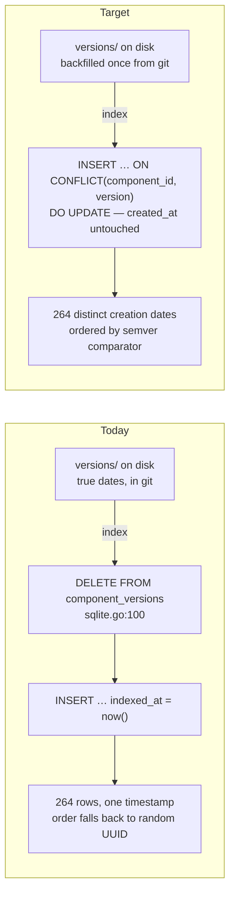
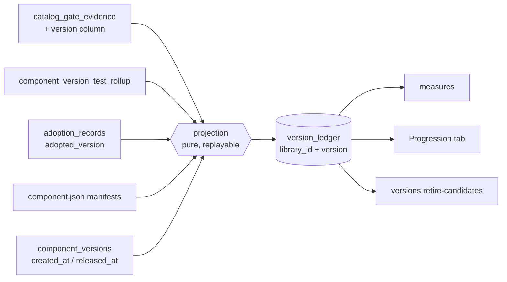
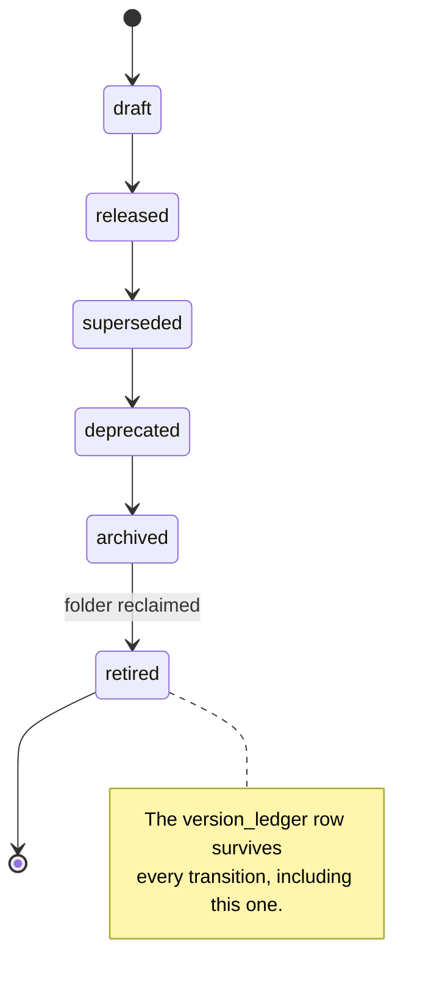
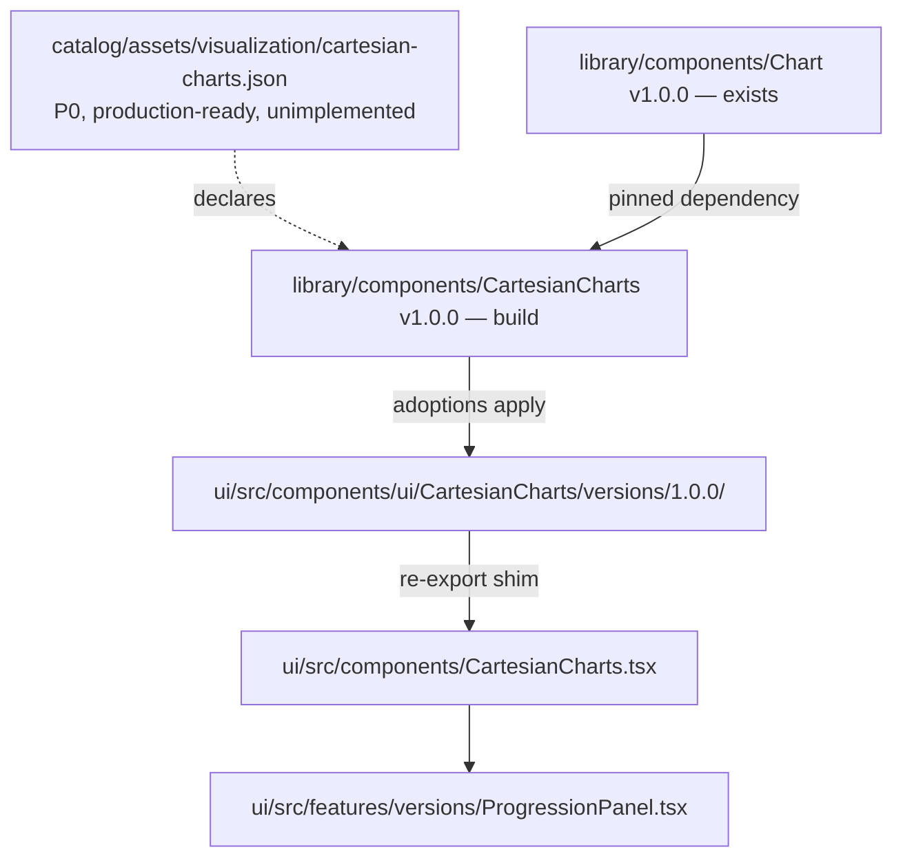

# Version ledger proposal — measured brief

> Companion to `2026-08-12-version-ledger-proposal.html` in this folder. The HTML
> is the visual version (open it in a browser); this file carries the same facts
> as terminal-readable text. Both were produced by the investigation that
> authored plan `react-component-library-version-ledger-truthful-version`.
>
> Every figure was measured on 2026-08-12 against
> `scenarios/react-component-library/data/react-component-library.db` and the
> working tree on branch `agi`.

## Measured baseline

| Fact | Value |
|---|---|
| Versions indexed | 264 |
| Versions with a real creation date | 0 |
| Distinct `indexed_at` dates across all 264 rows | 1 |
| `indexed_at` spread | `15:54:48.189Z` → `15:54:51.279Z` (3.09 s) |
| Versions with `released_at` populated | 0 |
| Version folders on disk | 275, across 192 manifests, 8.1 MB |
| Component test reports | 32,059 rows / 57 MB of an 84 MB database |
| Test reports readable per asset | newest 30, against ~177 stored (~83 % unreachable) |
| Catalog gate evidence rows | 955, across 12 gate kinds, current-verdict only |
| Adoption records | 87, across 11 scenarios |
| Adoptions targeting RCL's own UI | 41 (the largest single adopter) |
| Versions retirable today | 65 of 264 |
| CLI verbs that retire/archive/delete a version | 0 |
| `measure` blocks in `cli/manifest.json` | 0 |
| Manifests with a non-empty `deprecatedVersions[]` | 0 of 192 |
| Manifests with a non-empty `draft` | 0 of 192 |

Daily test-report inserts, 1–12 August 2026:

```
08-01    83
08-02   271
08-03  2478
08-04  1045
08-05  1192
08-06  6052
08-07   983
08-08   480
08-09   498
08-10  1047
08-11   372
08-12  6443
```

Version retirement pressure, 264 total:

```
181  pinned as `latest`
 18  older, still referenced by an adoption or a dependency pin
 65  retirable — no adopter, no dep pin, no adoption_files provenance
```

## Mechanism 1 — the reindex destroys the timeline

`upsertComponent` deletes every version row for a component and reinserts it, so
each rebuild restamps the clock. No column survives it.



Because `sqlite.go` orders by `indexed_at DESC, id ASC` and every timestamp
ties, the UUID decides. markdown-renderer's 17 versions return as:

```
0.2.2-draft.1, 0.2.0-draft.1, 0.2.2, 0.3.2, 0.2.1-draft.1, 0.1.0, 0.3.1-draft.1, …
```

The UI labels that list "newest first".

## Mechanism 2 — five per-version signals, four dead ends

| Signal | Version-scoped | Keeps history | Readable | Where it lives |
|---|---|---|---|---|
| Source & companions | yes | yes (git) | yes | `versions/<v>/` |
| Story contract | yes | current only | yes | `component_stories` |
| Parity report | yes | current only | via readiness | `component_version_parity_reports` (42 of 275) |
| Dep declarations | yes | current only | validation only | `component_dep_declarations` |
| Component test reports | yes | hoarded, unpruned | newest 30 | `component_test_reports` (32,059) |
| **Catalog gate evidence** | **no** | **no** | current verdict | `catalog_gate_evidence` (955) |
| **Adoption counts** | data yes, rollup no | no | row by row | `adoption_records.adopted_version` |
| Promotion readiness | yes | not stored | on demand | computed per request |

`catalog_gate_evidence` is keyed `(asset_id, target, gate)` and upserted, so the
previous verdict is destroyed on every run. That is exactly the data needed to
answer "are issues increasing or decreasing between versions".

Neither `component_test_reports` nor `catalog_gate_evidence` appears in
`docs/concepts/DATA.md`, in the Data Ownership table or the Schema Map.

## Target state — the ledger outlives the folder



Keying on `library_id` rather than `component_id` is what makes the row survive
a reindex — `component_id` is a UUID the indexer reassigns.



The source folder exists only through `archived`. The ledger row persists past
`retired`, so a retired version keeps its point on the progression chart after
its code is gone. Two of these rungs already have names in the code:
`VersionStatusArchived` is declared at `types.go:111` and mapped in the proto
adapter but never assigned by the indexer; `deprecated` is reachable but unused
across all 192 manifests.

## The one new table

```sql
CREATE TABLE version_ledger (
  library_id        TEXT    NOT NULL,   -- survives component_id reassignment
  version           TEXT    NOT NULL,
  created_at        TEXT    NOT NULL,   -- backfilled from git, never restamped
  released_at       TEXT    NOT NULL DEFAULT '',
  retired_at        TEXT    NOT NULL DEFAULT '',   -- set when the folder is reclaimed
  lifecycle         TEXT    NOT NULL,   -- draft|released|superseded|deprecated|archived|retired
  gate_pass         INTEGER NOT NULL DEFAULT 0,
  gate_fail         INTEGER NOT NULL DEFAULT 0,
  test_runs         INTEGER NOT NULL DEFAULT 0,
  test_pass_rate    REAL    NOT NULL DEFAULT 0,
  adoption_peak     INTEGER NOT NULL DEFAULT 0,
  adoption_current  INTEGER NOT NULL DEFAULT 0,
  file_count        INTEGER NOT NULL DEFAULT 0,
  loc               INTEGER NOT NULL DEFAULT 0,
  dep_count         INTEGER NOT NULL DEFAULT 0,
  PRIMARY KEY (library_id, version)
);
```

## Dogfood path for the Progression surface

`catalog/assets/visualization/cartesian-charts.json` declares the chart the
Progression tab needs at priority P0 with a `production-ready` maturity target,
and it is not implemented. `visualization.chart` **is** implemented at
`library/components/Chart/versions/1.0.0/Chart.tsx` — 268 lines of hand-authored
SVG with no charting dependency — and the catalog declares CartesianCharts as
requiring it.



Already implemented and adoptable with no new work: `StatCard` 1.0.0, `Stat`
1.0.0, `Timeline` 1.0.0, `AuditTrail` 1.0.0, `DiffViewer` 1.0.0,
`DescriptionList` 1.0.0, `DataTable` 1.3.0, `EmptyState` 1.2.0, `Chart` 1.0.0.

Declared but not implemented: `visualization.cartesian-charts` (this plan
implements it), plus `visualization.sparkline`, `visualization.timeline-chart`,
`visualization.gauge`, `data-display.expandable-row`, `feedback.inline-status`
(all stay declared).

The ten `requiredCapabilities` the catalog declares for CartesianCharts:
accessible-naming, contrast-floor, non-color-status, dark-parity,
forced-colors-legibility, keyboard-operable, status-announced, content-reflow,
reduced-motion, text-scale-resilience.

## Secondary defect found during the investigation

`versions.Record` is wired as a live post-save listener
(`api/handlers/versions/module.go:60`) and issues a plain `INSERT`
(`api/internal/versions/sqlite.go:37`) against a table with
`UNIQUE(component_id, version)`. A content edit without a `@version` bump raises
a constraint violation that `OnContentSaved` logs and swallows. The save
succeeds; the version silently does not record. Phase 1 resolves it.
