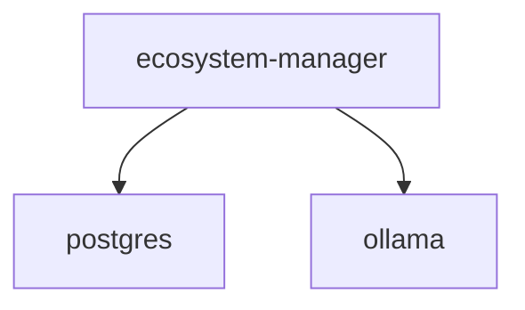

# Scenario Dependency Analyzer - CLI Reference

Complete command-line interface reference for analyzing and visualizing scenario dependencies within Vrooli.

## Table of Contents
- [Installation](#installation)
- [Quick Start](#quick-start)
- [Commands](#commands)
  - [analyze](#analyze)
  - [scan](#scan)
  - [dag](#dag)
  - [graph](#graph)
  - [cycles](#cycles)
  - [impact](#impact)
  - [propose](#propose)
  - [optimize](#optimize)
  - [list](#list)
  - [deployment](#deployment)
  - [health](#health)
  - [status](#status)
- [Examples](#examples)
- [Output Formats](#output-formats)
- [Integration](#integration)

---

## Installation

The CLI is automatically installed when you set up the scenario:

```bash
cd scenarios/scenario-dependency-analyzer
vrooli scenario setup scenario-dependency-analyzer
```

The `scenario-dependency-analyzer` command will be available at:
`~/.vrooli/bin/scenario-dependency-analyzer`

Verify installation:
```bash
scenario-dependency-analyzer --version
```

---

## Quick Start

```bash
# Check service status
scenario-dependency-analyzer status

# Analyze a scenario's dependencies
scenario-dependency-analyzer analyze ecosystem-manager

# Scan and detect dependencies from code
scenario-dependency-analyzer scan ecosystem-manager

# Export recursive dependency DAG
scenario-dependency-analyzer dag export ecosystem-manager --recursive

# Generate dependency graph
scenario-dependency-analyzer graph combined --format json

# Check deployment readiness
scenario-dependency-analyzer deployment ecosystem-manager
```

---

## Commands

### analyze

Analyze dependencies for a specific scenario or all scenarios.

**Usage:**
```bash
scenario-dependency-analyzer analyze <scenario> [OPTIONS]
```

**Arguments:**
- `scenario` - Scenario name (or "all" for system-wide analysis)

**Options:**
- `--transitive` - Include transitive dependencies
- `--json` - Output in JSON format
- `--output <format>` - Alias for format selection (supports: json)
- `--verbose` - Show detailed analysis

**Examples:**
```bash
# Analyze a single scenario
scenario-dependency-analyzer analyze ecosystem-manager

# Analyze with transitive dependencies
scenario-dependency-analyzer analyze api-manager --transitive

# Analyze all scenarios with JSON output
scenario-dependency-analyzer analyze all --json

# Verbose analysis
scenario-dependency-analyzer analyze chart-generator --verbose
```

**Output:**
```
🔍 Analyzing dependencies for: ecosystem-manager
✅ Analysis complete

📊 Dependency Summary:
   Resources: 5
   Scenarios: 3
   Shared Workflows: 0
```

---

### scan

Run dependency scan and optionally apply detected dependencies to service.json.

**Usage:**
```bash
scenario-dependency-analyzer scan <scenario> [OPTIONS]
```

**Arguments:**
- `scenario` - Scenario name to scan

**Options:**
- `--apply` - Apply inferred resources and scenarios
- `--apply-resources` - Apply only inferred resources
- `--apply-scenarios` - Apply only inferred scenarios
- `--json` - Raw JSON output

**Examples:**
```bash
# Scan without applying changes
scenario-dependency-analyzer scan ecosystem-manager

# Scan and apply all detected dependencies
scenario-dependency-analyzer scan api-tools --apply

# Scan and apply only resources
scenario-dependency-analyzer scan chart-gen --apply-resources

# Get JSON output
scenario-dependency-analyzer scan my-scenario --json
```

**Output:**
```
🛰️  Scanning scenario: ecosystem-manager
✅ Scan complete
  Applied changes: true
  Resources added: 2
  Scenarios added: 1
  Tip: run 'git diff scenarios/ecosystem-manager/.vrooli/service.json' to review
```

---

### dag

Export recursive dependency DAG (Directed Acyclic Graph) for deployment orchestration.

**Usage:**
```bash
scenario-dependency-analyzer dag export <scenario> [OPTIONS]
```

**Subcommands:**
- `export` - Export recursive dependency DAG

**Arguments:**
- `scenario` - Scenario name

**Options:**
- `--recursive` - Include full recursive tree (default: true)
- `--no-recursive` - Only top-level dependencies
- `--json` - Output raw JSON
- `--output <file>` - Save to file

**Examples:**
```bash
# Export full recursive DAG
scenario-dependency-analyzer dag export ecosystem-manager

# Export only top-level dependencies
scenario-dependency-analyzer dag export api-manager --no-recursive

# Save to file
scenario-dependency-analyzer dag export my-app --output deps.json

# Verbose JSON output
scenario-dependency-analyzer dag export chart-gen --json
```

**Output:**
```
📊 Exporting DAG for: ecosystem-manager (recursive=true)
✅ DAG exported

Dependency Tree:
  - resource: postgres (2 children)
  - resource: ollama
  - scenario: data-tools (3 children)
  - scenario: browser-automation-studio

⚠️  Metadata Gaps Detected:
  • Add deployment.tiers metadata to data-tools
  • Add deployment.dependencies metadata to postgres
```

---

### graph

Generate dependency graph visualization in various formats.

**Usage:**
```bash
scenario-dependency-analyzer graph [type] [OPTIONS]
```

**Arguments:**
- `type` - Graph type: resource, scenario, or combined (default: combined)

**Options:**
- `--type <type>` - Alternative way to specify graph type
- `--format <format>` - Output format: json, dot, mermaid (default: json)
- `--output <file>` - Save output to file
- `--json` - Force JSON output

**Examples:**
```bash
# Generate combined graph (default)
scenario-dependency-analyzer graph

# Generate resource-only graph
scenario-dependency-analyzer graph resource

# Export to DOT format for Graphviz
scenario-dependency-analyzer graph combined --format dot --output deps.dot

# Generate Mermaid diagram
scenario-dependency-analyzer graph scenario --format mermaid

# Save JSON to file
scenario-dependency-analyzer graph --type combined --output graph.json
```

**Output (DOT format):**
```dot
digraph Dependencies {
  rankdir=LR;
  node [shape=box];
  postgres [label="postgres"];
  ecosystem-manager [label="ecosystem-manager"];
  ecosystem-manager -> postgres [label="requires"];
}
```

**Visualize DOT:**
```bash
# Generate PNG from DOT file
dot -Tpng deps.dot -o graph.png

# View in browser (macOS)
dot -Tsvg deps.dot | open -f -a Safari
```

---

### cycles

Detect circular dependencies in the dependency graph.

**Usage:**
```bash
scenario-dependency-analyzer cycles [OPTIONS]
```

**Options:**
- `--type <type>` - Graph type: resource, scenario, combined (default: combined)
- `--json` - Output in JSON format

**Examples:**
```bash
# Check for cycles in combined graph
scenario-dependency-analyzer cycles

# Check scenario dependencies only
scenario-dependency-analyzer cycles --type scenario

# Get JSON report
scenario-dependency-analyzer cycles --json
```

**Output (no cycles):**
```
🔍 Detecting circular dependencies in combined graph...
✅ No circular dependencies detected in graph
```

**Output (cycles found):**
```
🔍 Detecting circular dependencies in combined graph...
🔴 2 circular dependencies detected in dependency graph

Detected Cycles:
  • Circular dependency: scenario-a → scenario-b → scenario-a
    Type: scenario_cycle | Length: 2 hops
  • Circular dependency: resource-x → resource-y → resource-x
    Type: resource_cycle | Length: 2 hops | ⚠️  ALL REQUIRED

Affected Dependencies:
  - scenario-a
  - scenario-b
  - resource-x
  - resource-y
```

---

### impact

Analyze the impact of removing a dependency from the system.

**Usage:**
```bash
scenario-dependency-analyzer impact <dependency> [OPTIONS]
```

**Arguments:**
- `dependency` - Dependency name (resource or scenario)

**Options:**
- `--json` - Raw JSON output

**Examples:**
```bash
# Analyze impact of removing postgres
scenario-dependency-analyzer impact postgres

# Analyze scenario dependency impact
scenario-dependency-analyzer impact ecosystem-manager --json
```

**Output:**
```
🔍 Analyzing impact of removing: postgres
🔴 CRITICAL IMPACT

Removing postgres would break 12 scenarios and affect 25 indirect dependents.

Direct Dependents:
  - ecosystem-manager (REQUIRED)
    Purpose: Store dependency metadata and analysis results
  - api-manager (REQUIRED)
    Purpose: Main data storage for API configurations

Indirect Dependents (15):
  - chart-generator
  - data-tools
  - browser-automation-studio
  ...

Recommendations:
  • Consider migration plan to alternative database
  • Update 12 scenarios to use alternative storage
  • Test all affected scenarios before removal
```

---

### propose

Analyze dependencies for a proposed scenario before building it.

**Usage:**
```bash
scenario-dependency-analyzer propose [OPTIONS]
```

**Options:**
- `--name <name>` - Proposed scenario name (required)
- `--description <desc>` - Scenario description
- `--requirements <list>` - Comma-separated requirements (required)
- `--similar <scenarios>` - Similar existing scenarios
- `--json` - Output in JSON format

**Examples:**
```bash
# Propose a new AI chatbot scenario
scenario-dependency-analyzer propose \
  --name "ai-chatbot" \
  --requirements "nlp,database,api" \
  --description "AI-powered chat assistant"

# Propose with similar scenarios
scenario-dependency-analyzer propose \
  --name "task-scheduler" \
  --requirements "cron,database" \
  --similar "ecosystem-manager,system-monitor"

# Get JSON output
scenario-dependency-analyzer propose \
  --name "test-scenario" \
  --requirements "postgres" \
  --json
```

**Output:**
```
🔮 Analyzing proposed scenario: ai-chatbot
✅ Analysis complete

📋 Recommended Dependencies:
Resources:
  - ollama
  - postgres
  - redis

Related Scenarios:
  - ecosystem-manager
  - api-manager
```

---

### optimize

Get optimization recommendations for reducing dependencies or improving deployment.

**Usage:**
```bash
scenario-dependency-analyzer optimize [scenario] [OPTIONS]
```

**Arguments:**
- `scenario` - Scenario to optimize (or "all" for system-wide)

**Options:**
- `--type <type>` - Optimization type: resource, deployment, cost, all
- `--apply` - Apply safe optimizations automatically
- `--json` - Output in JSON format

**Examples:**
```bash
# Get optimization recommendations
scenario-dependency-analyzer optimize ecosystem-manager

# Optimize all scenarios
scenario-dependency-analyzer optimize all --type resource

# Apply safe optimizations
scenario-dependency-analyzer optimize --apply

# Get JSON report
scenario-dependency-analyzer optimize chart-gen --json
```

**Output:**
```
🔧 Getting optimization recommendations for: ecosystem-manager

Scenario: ecosystem-manager
  Recommendations: 3
  High priority: 1
    - [resource_swap] Consider lightweight AI alternative
      Description: Replace ollama with openrouter for lower resource usage
      Confidence: 0.85
      Suggested action: review
    - [dependency_reduction] Remove unused resource
      Description: redis is declared but never used in code
      Confidence: 0.92
      Suggested action: remove
```

---

### list

List dependencies for a specific scenario.

**Usage:**
```bash
scenario-dependency-analyzer list <scenario> [OPTIONS]
```

**Arguments:**
- `scenario` - Scenario name

**Options:**
- `--type <type>` - Filter by type: resources, scenarios, workflows
- `--json` - Output in JSON format

**Examples:**
```bash
# List all dependencies
scenario-dependency-analyzer list ecosystem-manager

# List only resources
scenario-dependency-analyzer list api-manager --type resources

# Get JSON output
scenario-dependency-analyzer list chart-gen --json
```

**Output:**
```
📋 Fetching dependencies for: ecosystem-manager
✅ Dependencies for ecosystem-manager:

resource:
  - postgres (required)
  - ollama (required)
  - qdrant
  - redis

scenario:
  - data-tools (required)
  - browser-automation-studio
```

---

### deployment

Show deployment readiness, tier fitness, and bundle metadata for a scenario.

**Usage:**
```bash
scenario-dependency-analyzer deployment <scenario> [OPTIONS]
```

**Arguments:**
- `scenario` - Scenario name

**Options:**
- `--json` - Raw JSON output

**Examples:**
```bash
# Check deployment readiness
scenario-dependency-analyzer deployment ecosystem-manager

# Get JSON report
scenario-dependency-analyzer deployment api-tools --json
```

**Output:**
```
🛰️  Loading deployment report for: ecosystem-manager
Scenario: ecosystem-manager
Generated: 2025-11-22T17:30:00Z

Tier readiness:
  - desktop: fitness 85%, dependencies: 5, blockers: none
  - server: fitness 95%, dependencies: 5, blockers: none
  - mobile: fitness 45%, dependencies: 5, blockers: ollama, postgres
  - saas: fitness 60%, dependencies: 5, blockers: local-file-access

Bundle dependencies:
  - resource :: postgres (tiers: desktop, server, saas)
  - resource :: ollama (tiers: desktop, server)
  - resource :: qdrant (tiers: desktop, server, saas)
  - scenario :: data-tools (tiers: desktop, server, saas, mobile)

Bundle files:
  - binary: api/ecosystem-manager-api (present)
  - config: .vrooli/service.json (present)
  - schema: initialization/postgres/schema.sql (present)
```

---

### health

Check service health and analysis capabilities.

**Usage:**
```bash
scenario-dependency-analyzer health [OPTIONS]
```

**Options:**
- `--json` - Output in JSON format
- `--detailed` - Include detailed analysis health check

**Examples:**
```bash
# Basic health check
scenario-dependency-analyzer health

# Detailed health check
scenario-dependency-analyzer health --detailed

# Get JSON output
scenario-dependency-analyzer health --json
```

**Output:**
```
🏥 Checking health...
✅ Scenario Dependency Analyzer is healthy
   API: http://localhost:20400
```

---

### status

Show operational status and system overview.

**Usage:**
```bash
scenario-dependency-analyzer status
```

**Examples:**
```bash
scenario-dependency-analyzer status
```

**Output:**
```
📊 Scenario Dependency Analyzer Status

✅ Service: Running
   API: http://localhost:20400

Analysis System:
  Scenarios: 45
  Resources: 12
  Database: connected
  Last Analysis: 2025-11-22T17:15:00Z
```

---

## Examples

### Complete Dependency Analysis Workflow

```bash
# 1. Check service status
scenario-dependency-analyzer status

# 2. Scan a scenario to detect dependencies
scenario-dependency-analyzer scan my-scenario

# 3. Review detected dependencies
scenario-dependency-analyzer list my-scenario --type resources

# 4. Apply detected dependencies
scenario-dependency-analyzer scan my-scenario --apply

# 5. Check for circular dependencies
scenario-dependency-analyzer cycles

# 6. Check deployment readiness
scenario-dependency-analyzer deployment my-scenario

# 7. Export dependency DAG
scenario-dependency-analyzer dag export my-scenario --output my-dag.json

# 8. Generate visualization
scenario-dependency-analyzer graph combined --format dot --output graph.dot
dot -Tpng graph.dot -o graph.png
```

### Preparing for Deployment

```bash
# 1. Scan scenario and apply dependencies
scenario-dependency-analyzer scan production-app --apply

# 2. Check tier fitness
scenario-dependency-analyzer deployment production-app

# 3. Identify blockers
scenario-dependency-analyzer deployment production-app --json | jq '.aggregates.saas.blocking_dependencies'

# 4. Export recursive DAG for deployment-manager
scenario-dependency-analyzer dag export production-app --recursive --output prod-dag.json

# 5. Verify no circular dependencies
scenario-dependency-analyzer cycles --type scenario
```

### System-Wide Analysis

```bash
# Analyze all scenarios
scenario-dependency-analyzer analyze all --verbose

# Generate combined dependency graph
scenario-dependency-analyzer graph combined --format mermaid > system-graph.mmd

# Check for optimization opportunities
scenario-dependency-analyzer optimize all --type resource

# Detect all circular dependencies
scenario-dependency-analyzer cycles
```

---

## Output Formats

### JSON
Standard JSON output for programmatic consumption:
```bash
scenario-dependency-analyzer analyze my-scenario --json | jq .
```

### DOT (Graphviz)
Graph visualization in DOT format:
```bash
scenario-dependency-analyzer graph combined --format dot
```

Render with Graphviz:
```bash
scenario-dependency-analyzer graph combined --format dot | dot -Tpng > graph.png
```

### Mermaid
Markdown-compatible diagrams:
```bash
scenario-dependency-analyzer graph combined --format mermaid
```

Use in Markdown:
````markdown

````

---

## Integration

### CI/CD Pipeline

```yaml
# .github/workflows/dependency-check.yml
name: Dependency Analysis

on: [push, pull_request]

jobs:
  analyze:
    runs-on: ubuntu-latest
    steps:
      - uses: actions/checkout@v3
      - name: Setup Vrooli
        run: ./scripts/manage.sh setup --yes yes
      - name: Start analyzer
        run: vrooli scenario run scenario-dependency-analyzer
      - name: Scan dependencies
        run: scenario-dependency-analyzer scan my-scenario --json > deps.json
      - name: Check for cycles
        run: scenario-dependency-analyzer cycles || exit 1
      - name: Upload results
        uses: actions/upload-artifact@v3
        with:
          name: dependency-analysis
          path: deps.json
```

### Deployment Manager Integration

```bash
# Export DAG for deployment
scenario-dependency-analyzer dag export my-app --recursive > /tmp/my-app-dag.json

# Use in deployment-manager
deployment-manager deploy my-app \
  --dag /tmp/my-app-dag.json \
  --tier saas
```

### Shell Script Integration

```bash
#!/bin/bash
# check-dependencies.sh

SCENARIO=$1

# Scan and get JSON
RESULT=$(scenario-dependency-analyzer scan "$SCENARIO" --json)

# Parse results
RESOURCES_ADDED=$(echo "$RESULT" | jq -r '.apply_summary.resources_added | length')
SCENARIOS_ADDED=$(echo "$RESULT" | jq -r '.apply_summary.scenarios_added | length')

echo "Scan complete:"
echo "  Resources added: $RESOURCES_ADDED"
echo "  Scenarios added: $SCENARIOS_ADDED"

# Check for critical issues
if scenario-dependency-analyzer cycles --json | jq -e '.severity == "critical"'; then
  echo "ERROR: Critical circular dependencies detected!"
  exit 1
fi
```

---

## Troubleshooting

### Service Not Running

```bash
$ scenario-dependency-analyzer status
❌ Error: scenario-dependency-analyzer is not running
   Start it with: vrooli scenario run scenario-dependency-analyzer
```

**Solution:**
```bash
vrooli scenario run scenario-dependency-analyzer
```

### Port Conflicts

If the scenario fails to start due to port conflicts, check allocated ports:

```bash
vrooli scenario port scenario-dependency-analyzer API_PORT
```

### Permission Issues

Ensure the CLI is executable:

```bash
chmod +x ~/.vrooli/bin/scenario-dependency-analyzer
```

---

## See Also

- [API Reference](./api.md) - HTTP API documentation
- [Integration Guide](./integration.md) - Integration patterns and examples
- [README](../README.md) - Scenario overview
- [PRD](../PRD.md) - Product requirements
