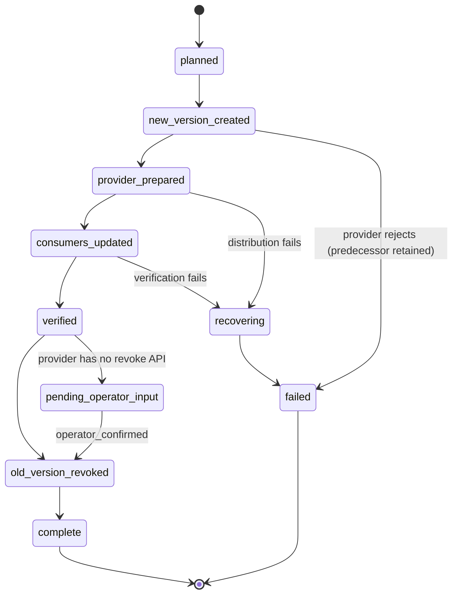

# Credential lifecycle

> [CODE: api/credentials/lifecycle.go] · [CODE: api/credentials/bindings.go] · [CODE: api/credentials/provider.go] · [CODE: api/credentials/distribution.go] · [CODE: ../../internal/cloudtarget/credential.go] · Requirement STC-P0-032

scenario-to-cloud does not own a credential authority. It binds descriptors
from the deployment closure to versions held by the **target host's credential
authority**, drives rotation, revocation and recovery as durable operations,
and never retains, logs, echoes or places a value in a command argument.

## Invariants

| Invariant | Where it is enforced |
|---|---|
| A value travels only in memory and on standard input (SSH) or inside the Bridge sealed grant channel (bridge) | `credentials.SSHDistributor.Deliver` writes the ingest payload to stdin; `BridgeDistributor.Deliver` uses `AnswerSecret` and dispatches argv that names an environment variable, never a value |
| Nothing retained carries a value: ledger rows, receipts, logs, plan JSON, HTTP responses | `api/credentials/canary_test.go` plants `canary-<random>` values through provision, rotate, revoke and a failing distribution and scans every retained surface (`credentials.Scanner`) |
| Version references are opaque | `CredentialVersion.ContentRef` is a random token minted with the version; it is never derived from the value, so no retained surface can confirm or brute-force one |
| Descriptors are exact | `logical_id:field` is preserved byte-for-byte from the closure; the binding id (`cb_<24 hex>`) is a digest of `(deployment id, logical_id, field)`, stable across replanning and URL-safe, and the record carries the descriptor for reading |
| Two descriptors that would fold to one target are refused | `credential_descriptor_collision` from `PlanBindings` (target name lower-cased with `_` and `.` folded to `-`, identity lower-cased, as the target authority does) |
| Metadata-only reads | every list/get surface returns bindings, versions and acknowledgements; `?reveal=true` is a `forbidden_scope` refusal |
| Existing generated values survive ordinary redeploy | `Service.Materialize` probes the target and preserves a binding whose value is still configured (P13-A01) |
| Expiry is authoritative | an expired active version is never preserved during materialisation; it is replaced with a strictly higher version, while list views expose `active`, `renewal_due`, `expired`, `revoked` or `planned` standing and a next action |

## Bindings

A `CredentialBinding` references a descriptor, a lifecycle class, the manifest
source class (`per_install_generated`, `user_prompt`, `remote_fetch`,
`infrastructure`), the declared injection target, the current and retained
previous version, the closure consumers (`scenario:<id>`, `resource:<id>`), the
Bridge grant id when the bridge transport is used, and a state
(`planned`, `materialized`, `revoked`).

Persistence: `cloud_credential_bindings` (unique per deployment and
descriptor), `cloud_credential_acks` (binding, consumer, version, verified_at)
and `cloud_credential_rotations` (one row per lifecycle operation with its
receipts). PostgreSQL is the authority; the SQLite form exists for routed test
pools.

An active version may carry `expires_at`, supplied by materialisation, a
provider preparation result, or a target receipt. The value is metadata only;
it is persisted with the binding and returned by metadata surfaces. List
standing enters `renewal_due` during the default 30-day renewal window and
becomes `expired` after the timestamp. Expired versions are not preserved on
redeploy, and the next version is always monotonic. A missing expiry means the
provider has not declared one; it is not treated as already expired.

Resolution without a deployment id must find exactly one binding for the
descriptor; a descriptor bound on several deployments is
`credential_binding_ambiguous`, never a best-effort pick.

### Lifecycle classes

The class selects the rotation behaviour. It is derived from the field name,
the manifest class and the consumer set (`credentials.Classify`) and can be
pinned per descriptor.

| Class | Provider behaviour |
|---|---|
| `generated_database_password` | `Prepare` runs the postgres owner argv (`psql -X -q -v ON_ERROR_STOP=1 -d postgres -f -`) with `ALTER ROLE … PASSWORD '<SCRAM-SHA-256 verifier>'` on stdin. The plaintext never reaches the database host or its statement log. PostgreSQL has no dual-accept window, so the ordering is **maintenance**: role updated, then consumers receive the new version and are restarted through `vrooli scenario|resource restart`, then acknowledgements are verified. |
| `external_api_credential` | The replacement value is operator-supplied and validated by a declared scope probe before distribution. The predecessor is revoked through the provider's API when one is declared; otherwise the rotation stops in `pending_operator_input` with a durable handoff (`reference`, `instruction`, `resume_with`) and resumes with `operator_confirmed: true`. |
| `signing_key` | Dual-accept. The predecessor stays verifiable for the overlap window (24h default); revocation is deferred with `resume_after` until it elapses. |
| `machine_enrollment_credential` | Owned by vrooli-bridge. Rotate, revoke and break-glass are refused locally (`credential_rotation_refused`) with the Bridge next action. |
| `encryption_recovery_key` | Verification calls the declared rewrap-and-restore hook with the version reference (`{binding_id, version}`) only; the predecessor is retired only after that proof. Recovery points carry the same reference. |
| `shared_dependency_credential` | No provider step. Completion requires every closure consumer to acknowledge the exact version. |

## Rotation state machine

Every transition is persisted with a receipt (`step`, `state`, `outcome`,
`target_receipt_ref`, metadata `details`, `limitations`) before the next side
effect runs. Per-consumer standing is recorded on the operation
(`pending`, `updated`, `acknowledged`, `unreachable`, `failed`).

Truthful non-terminal states:

- `consumers_updated` with `unreached[]`: one or more consumers have not
  acknowledged the new version. The rotation is **incomplete** until each does
  (P13-A05); the binding's active version is not advanced.
- `pending_operator_input`: the provider cannot revoke the predecessor
  automatically; the handoff reference is durable and the operation resumes
  through `POST …/rotations/{id}/resume`.
- `verified` with `resume_after`: overlap window not yet elapsed.
- `revocation_incomplete` (revoke operations): the target was unreachable;
  the unreached node list is retained until a purge receipt confirms it.

`recovering → failed` retires whatever the failed attempt distributed and keeps
the predecessor as the active version (SECRET-03). A provider rejection before
distribution fails without touching the target.

Concurrency: one open operation per binding. A second rotate, break-glass or
deploy-time materialisation on the same binding is `credential_rotation_conflict`
until the first reaches a terminal state, so a rotation and a deployment can
never interleave versions (SECRET-06).

## Distribution

The transport follows the deployment's target binding:

- **ssh**: `credentials.SSHDistributor` reaches the target authority through
  `packages/credentialclient-go` for metadata (store status, configured) and
  runs `vrooli cloud-target credential ingest|acknowledge|revoke` with the
  ingest payload on standard input. The payload is JSON
  `{schema_version:1, deployment_id, binding_id, logical_id, field, version, content_ref, value}`.
- **bridge**: `credentials.BridgeDistributor` rechecks the node's grants
  through `CredentialGrantService.ListGrants` (a revoked grant is
  `forbidden_revoked`, P13-A04), delivers the value with `AnswerSecret` (the
  Bridge sealed channel), and dispatches
  `vrooli cloud-target credential ingest … --grant <id> --from-env VROOLI_CREDENTIAL_INGEST_VALUE`
  with a metadata-only `CredentialInjection{logical_id, field, env_name}`.

Grants are rechecked before distribution and, on the target, ingestion
validates the payload identity against the argv metadata before consulting the
store.

### Target verbs

`vrooli cloud-target credential <verb>` runs inside the target's native binary
(`internal/cloudtarget/credential.go`). Every verb is fenced and receipted per
(operation, step); the receipt input digest covers metadata only.

| Verb | Effect | Refusals (exit 2) |
|---|---|---|
| `ingest --deployment --binding --version --operation --step --fence [--grant --from-env --logical-id --field --content-ref]` | reads the payload from stdin (or the injected env var), refuses a locked store before any write, `Put`s the value into the node authority, records the held version | `credential_store_locked`, `credential_payload_invalid`, `credential_version_stale` (below the held version), `credential_version_revoked` (re-ingest of a revoked version), `fence_stale` |
| `acknowledge --deployment --binding --version --consumer --operation --step --fence` | proves the held version matches and the authority still holds the value; records the consumer's ack | `credential_not_ingested`, `credential_version_mismatch` |
| `revoke --deployment --binding --version --operation --step --fence` | deletes the active version from the authority, marks the version so it can never be re-ingested; receipt lists `proven`, `unproven` and `limitations` | `credential_store_locked` |

Versions are monotonic on both sides: the cloud ledger never reuses a number
(a failed attempt burns its version) and the target refuses anything below the
held version. A deploy during an open rotation preserves rather than mints
(SECRET-06).

## Error codes

| Code | HTTP | Meaning |
|---|---|---|
| `credential_descriptor_collision` | 409 | two descriptors fold to one target, or a duplicate declaration |
| `credential_binding_ambiguous` | 409 | descriptor bound on several deployments; name the deployment |
| `credential_binding_not_found` / `credential_rotation_not_found` | 404 | |
| `credential_rotation_conflict` | 409 | an operation is already open on the binding |
| `credential_rotation_refused` | 422 | machine enrollment class, revoked binding, or no provider declared |
| `credential_store_locked` | 503 | target or replacement store locked/unreachable; nothing written; next action `vrooli credentials doctor` |
| `credential_distribution_failed` | 502 | target verb or provider failed; predecessor retained |
| `revocation_incomplete` | 202 | target unreached; node retained in `unreached` |
| `pending_operator_input` | 428 | resumable operator step outstanding |
| `credential_verification_failed` | 422 | |
| `break_glass_confirmation_required` | 428 | |
| `credential_recovery_failed` | 502 | bundle does not verify or cover every materialised binding |
| `forbidden_revoked` | 403 | Bridge grant revoked; new distribution denied, no fallback |

The node ledger lives at
`~/.vrooli/cloud/deployments/<deployment-id>/credentials/<binding-slug>.json`
and never holds a value.

## Revocation semantics

| Situation | Outcome |
|---|---|
| Target online | purge receipt; binding state `revoked`; operation `complete` |
| Target unreachable | operation `revocation_incomplete`, `unreached: [node]` retained; resume when reachable (P13-A05) |
| Grant revoked at Bridge | new distribution denied with `forbidden_revoked`; no fallback transport (P13-A04) |

Every revocation receipt carries the limitation: revocation purges the target
store and denies new distribution; **it cannot prove that a previously revealed
value was forgotten on a compromised host**.

## Recovery

- **Lost host**: `POST /deployments/{id}/credentials/recover` with
  `{bundle_ref, passphrase}` verifies the encrypted recovery bundle on the
  replacement host (`vrooli credentials recovery verify`, passphrase on stdin),
  refuses when it does not cover every materialised binding, restores it
  (`vrooli credentials recovery restore`), and confirms each binding is
  configured on the new host before the operation completes (P13-A06).
- **Locked store**: any write or restore against a locked store fails closed
  with `credential_store_locked` and the next action
  `vrooli credentials doctor`; nothing is written.
- **Break-glass** (SECRET-08): `POST …/credentials/{binding}/break-glass`
  requires `confirmation` equal to `BREAK-GLASS <binding-id>`, a `scope`, an
  `operator` and a `window_seconds` of at most 4 hours. It issues an emergency
  version through the normal stages, records the audited window on the
  operation, and `SweepBreakGlass` rotates the emergency version away and
  revokes it once the window expires.

## REST and Connect surface

Routes are gated as `secret` effects (reads need `scenario-to-cloud:read`,
everything else `scenario-to-cloud:destructive`) and answer with
`Cache-Control: no-store`. `200` is a terminal success, `202` an operation that
stopped short of its terminal state truthfully (`consumers_updated` with
`unreached`, `revocation_incomplete`), and typed refusals carry
`details.operation`.

| Route | Purpose |
|---|---|
| `GET /api/v1/deployments/{id}/credentials` | bindings, versions and acknowledgements (no values) |
| `POST …/credentials/{binding}/rotate` | `{value?, request_key?}` starts or replays a rotation |
| `POST …/credentials/{binding}/revoke` | `{request_key?}` revokes the active version |
| `POST …/credentials/{binding}/break-glass` | `{scope, window_seconds, confirmation, operator}` |
| `POST …/credentials/recover` | `{bundle_ref, passphrase}` |
| `GET …/credentials/rotations/{id}` | one operation |
| `POST …/credentials/rotations/{id}/resume` | `{operator_confirmed}` continues a non-terminal operation |

The Connect service `vrooli.scenario_to_cloud.v1.credentials.CredentialsService`
(`api/credentialsvc`) exposes the same operations. Responses carry
`schema_version: "1"`; a non-terminal standing travels with its typed error as
`details.operation`.

The legacy `/deployments/{id}/secrets` CRUD routes run on the binding model:
create and update materialise a new version through the lifecycle, delete
revokes, and reads are metadata only.

## Limitations

- The real-provider lane (a live external API with a revocation API, a live
  Bridge node) is pending EXT-01; the package lane proves the lifecycle against
  fakes that honour the same contracts.
- Consumer acknowledgement on the target is ledger-based: the target proves it
  holds the version and the authority answers for it; it does not observe the
  consumer process memory.
- The Bridge dispatch path assumes the node agent honours `CredentialInjection`
  by exporting the named variable to the dispatched process.
