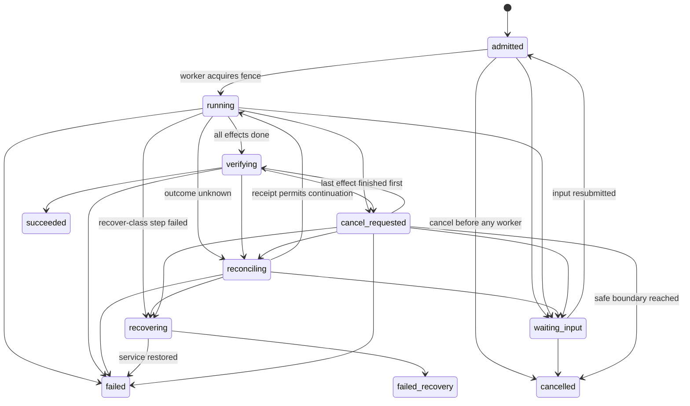

# Operation Lifecycle

> [CODE: api/operations] · [CODE: api/persistence/operations.go] · [CODE: api/deployment/operation_runner.go] · [PROTO: packages/proto/schemas/scenario-to-cloud/v1/operations/operations.proto]

A **cloud operation** is one admitted executable plan against one deployment.
The durable record (`cloud_operations`) owns execution. A worker only ever
holds a lease on that record; the API process, the HTTP request that admitted
the operation and the client that waits on it are all disposable.

## Vocabulary

One canonical, versioned state vocabulary (`schema_version: "1"`):

| State | Meaning | Terminal |
|---|---|---|
| `admitted` | Intent persisted; no worker has acquired it yet | no |
| `waiting_input` | Execution needs input that is not durable (operator-supplied secrets). Distinct from a dead worker: the lease is released and reconciliation does not reacquire it | no |
| `running` | A worker holds the fence and executes actions | no |
| `verifying` | Every effect finished; verification decides | no |
| `reconciling` | A remote effect has an **unknown** outcome the owner could not observe (no native CLI on the target, transport lost). Carries one typed `next_action` | no |
| `recovering` | A consistency-critical step failed hard; a recovery owner must act | no |
| `cancel_requested` | Cancellation recorded; honoured at the next declared cancel point | no |
| `succeeded` | All actions verified | yes |
| `failed` | The change failed. `result.recovery_outcome` says whether service was restored (`service_restored`), recovery was `not_attempted`, or `recovery_failed` | yes |
| `failed_recovery` | The change failed **and** recovery did not restore service | yes |
| `cancelled` | Cancellation reached a safe boundary | yes |

Operation success is distinct from recovery success: a `failed` operation may
carry `recovery_outcome: service_restored`; nothing ever reports a failed
recovery as a deployed service.

### Transitions (`operations.Transition`)

Any move not in this table is refused with `operation_conflict`; terminal
states have no outgoing edge. `cancel_requested → verifying` is the one
addition to the design draft: it is the case where every effect finished
before a cancel point was reached, so the safe boundary is the end of the plan.

## Ownership: fence, lease, heartbeat

- **Fence** — `deployments.fence` is a monotonic ownership generation per
  deployment. `AcquireWorker` bumps it and stamps the operation. Every durable
  write (`Heartbeat`, `SetActiveStep`, `CommitStep`, `RecordUnknownEffect`,
  `SetState`) carries the fence in its `WHERE` clause and fails with
  `fence_stale` once a successor has acquired a higher fence. Every target-side
  verb receives `--operation --step --fence`; the target owner
  (`vrooli cloud-target`, P08) refuses a lower fence than it has accepted.
- **Lease** — `lease_expires_at` bounds ownership. The worker heartbeats every
  `HeartbeatInterval`; a lease is trusted until it expires (a slow owner is not
  a dead owner). Only after expiry may another worker acquire.
- **Serialisation** — while any operation of a deployment holds a live lease,
  no other operation of that deployment can be acquired (`operation_conflict`
  naming `blocking_operation_id`). Competing operations run one after another
  with strictly increasing fences.

## Per-step receipts and unknown effects

Before an action runs the worker records an `active_step` marker (fenced);
after it runs it commits a `step_receipt` `{step, outcome, fence, source,
replayed, detail, error}`. Outcomes: `succeeded | failed | skipped |
unchanged | unknown`.

When a successor resumes an operation, `Begin` decides per action:

1. a committed receipt with `succeeded/unchanged/skipped` → **skip**;
2. `cancel_requested` and the action is a `cancel_point` → **stop (cancelled)**;
3. the action was in flight under an older fence (marker present, no receipt)
   or has a recorded unknown effect → apply the action's **retry contract**:
   - `safe_replay` → replay;
   - `observe_then_replay`, `recover` → read the target receipt
     (`vrooli cloud-target receipt get --deployment --operation --step`).
     A receipt proving `succeeded` is committed with `source: target_receipt,
     replayed: true` and the action is skipped; `failed` replays
     (observe) or enters `recovering` (recover); no receipt re-invokes the
     idempotent target verb (P08 verbs are idempotent per operation/step
     and reconcile their own interrupted intent);
   - the target cannot answer (native CLI absent, transport timeout) →
     an `unknown_effect` `{step, reason, retry, next_action}` is recorded and
     the operation moves to `reconciling`. **Timeouts never infer failure.**
4. otherwise mark the step active and run it.

A lost reply during execution (dropped reply, transport timeout, host
unreachable after dispatch) is committed as `unknown`, which triggers the
same receipt read before anything is replayed.

## Timeouts (`operations.Config`)

| Bound | Default | Meaning |
|---|---|---|
| `QueueTimeout` | 2m | Longest an in-process submission may wait for a pool worker; afterwards the record stays `admitted` for the reconciler |
| `ExecutionTimeout` | 45m | One worker attempt. Reaching it lapses the lease; the record stays `running` with its receipts and is resumed |
| `TransportTimeout` | 60s | One target call (receipt read). A timeout is an unknown effect |
| `ObserverTimeout` | 5m | Maximum server-side block of `GET …/wait`; observers never mutate |
| `LeaseTTL` / `HeartbeatInterval` / `ReconcileInterval` | 90s / 30s / 90s | Ownership lease, its renewal, and the scan of unowned or expired records |

## Startup reconciliation

`NewServer` starts the owner and runs one `Reconcile` pass: every non-terminal
operation whose lease is absent or expired is reacquired with a new fence and
resumed from its receipts; `waiting_input` and `recovering` records are left
for their owners; live leases held by another worker are respected. The pass
repeats every `ReconcileInterval` and can be forced with
`POST /api/v1/operations/reconcile` (destructive scope). The startup log line
`startup operation reconciliation complete` names the worker id and the
acquired operation ids.

## Cancellation

`POST /api/v1/operations/{id}/cancel` records the intent. An operation with no
worker (`admitted`, `waiting_input`) is cancelled at once; a running one becomes
`cancel_requested` and the worker stops before the next action whose
`cancel_point` is true (an action with `cancel_point: false`, such as
`release.activate`, always completes). Cancelling a terminal operation is
refused.

## Wait, status and attach

| Surface | Contract |
|---|---|
| `GET /api/v1/operations/{id}` | Typed standing: `state`, `terminal`, `fence`, `active_step`, `completed_steps`, `step_receipts`, `unknown_effects`, `result`, `error`, `next_action`, `reattach_command`, timestamps |
| `GET /api/v1/operations/{id}/wait?timeout=` | Server-side block until terminal or the observer bound; a timed-out wait returns `still_pending: true` with `recommended_next_check_seconds` and changes nothing |
| `GET /api/v1/deployments/{id}/operations` | Operations of a deployment, newest first |
| `GET /api/v1/deployments/{id}/progress?operation_id=` | SSE keyed by operation; a terminal operation replays its outcome and closes |
| Connect `vrooli.scenario_to_cloud.v1.operations.OperationsService` | Same shapes |
| CLI `scenario-to-cloud operation get\|wait\|cancel\|list` | Human view via `cli-core/operationstanding`; `--json` is the server body unchanged. Exit codes: 0 succeeded, 1 failed/failed_recovery/cancelled, 2 refused, 3 pending, 124 observer timeout |

## Deployment status projection

The deployment record's `status` is a **projection** written from the
operation state machine; it is never an ownership claim, so an owner restart
can no longer wedge a deployment. The former `run_id` / `completed_steps`
columns and the `?run_id=` SSE gate were removed (DL-05); a cancelled
operation projects `failed` with the cancel message.

| Status (`domain.DeploymentStatus`) | Projected when |
|---|---|
| `pending` | record created, no operation admitted yet |
| `setup_running` | an install-scope operation is executing host preparation and release staging |
| `setup_complete` | staging finished; activation not yet run (visible only between steps) |
| `deploying` | activation, edge and readiness actions are executing |
| `deployed` | the operation ended `succeeded` |
| `failed` | the operation ended `failed`, `failed_recovery` or `cancelled`; `error_step` and `error_message` name the step and the typed error |
| `stopped` | a stop-scope operation succeeded; the record's `desired_state` is `stopped` and observers never restart it |

The record keeps the manifest snapshot, bundle digest, release and
configuration digests, `setup_result` / `deploy_result` (the last operation's
result envelope) and timestamps for audit. To recover from `failed`, read
the operation (`operation get <id>`), fix the named cause and admit a new
plan; the failed operation is never re-run in place.

## Fault-injection points exercised

`worker_before_commit` (crash after every mutating step), `transport_reply`
(dropped reply), plus the target receipt seam (native CLI absent). See
`api/operations/service_test.go`, `api/persistence/operations_test.go` and
`certification/evidence/RUN-*.json`.
