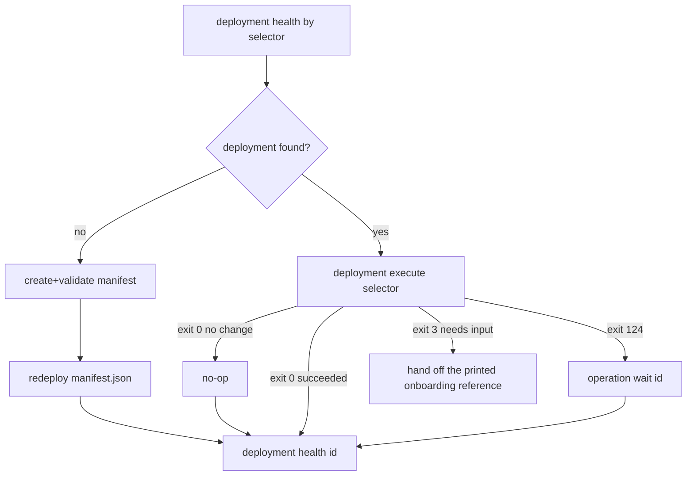

## Tools focus: Scenario to Cloud

Use `scenario-to-cloud` to deploy a scenario to an existing VPS and operate that deployment.

---

### **1. When to Use This Tool**

| Goal | Command |
|------|---------|
| Resolve existing deployment by selector | `scenario-to-cloud deployment resolve --domain <domain> --scenario <id>` |
| Preview the executable plan (digest, changes, data effects, downtime, recovery) | `scenario-to-cloud deployment plan --domain <domain> --scenario <id>` |
| Converge an existing deployment (plan, review, apply the shown digest, wait once) | `scenario-to-cloud deployment execute --domain <domain> --scenario <id>` |
| Deploy from a manifest (create/update the record, then the same plan-apply-wait path) | `scenario-to-cloud redeploy cloud-manifest.json` |
| Reattach to an operation after a disconnect or observer timeout | `scenario-to-cloud operation wait <operation-id>` |
| Validate deployment health by selector or id | `scenario-to-cloud deployment health --domain <domain> --scenario <id>` |
| Read deployment logs | `scenario-to-cloud inspect logs <deployment-id>` |
| Verify target reachability (agent mode) | `scenario-to-cloud preflight run <manifest.json>` (reachability check; access is a Bridge enrollment or the credential binding, never a key on the wire) |

**Scope boundaries:**
- **In scope:** Manifest validation, deployment lifecycle, preflight validation, SSH/DNS/TLS checks, logs and runtime inspection, process control, deployment secrets.
- **Out of scope:** VPS provisioning, cloud provider account setup, domain registration, desktop packaging.

---

### **2. Core Workflow**

### Prerequisites

Minimum required inputs:
- `{{DOMAIN}}`
- `{{SCENARIO_NAME}}`

Derived at runtime:
- `{{DEPLOYMENT_ID}}` from `deployment resolve`
- `{{VPS_HOST}}` from `deployment resolve` when deployment exists

Additional required input when no deployment exists:
- `{{VPS_HOST}}` (must be provided manually for manifest init/bootstrap)

### Input contract (fast decision)

- Existing deployment path:
  - Required inputs: `{{DOMAIN}}`, `{{SCENARIO_NAME}}`
  - Optional: none
- New deployment path (no existing deployment found):
  - Required inputs: `{{DOMAIN}}`, `{{SCENARIO_NAME}}`, `{{VPS_HOST}}`
  - Human-required step may be needed: `vrooli-bridge onboard` on the host, or authorising the operator key (`ssh-copy-id`) when the transport is ssh

### Quick Path: Existing Deployment (Domain + Scenario Only)

Use this when a deployment likely already exists and you only have:
- `{{DOMAIN}}`
- `{{SCENARIO_NAME}}`

```bash
scenario-to-cloud deployment resolve --domain {{DOMAIN}} --scenario {{SCENARIO_NAME}} --json
VPS_HOST_FROM_RESOLVE=$(scenario-to-cloud deployment resolve --domain {{DOMAIN}} --scenario {{SCENARIO_NAME}} --json | jq -r '.ref.target.locator.host')
scenario-to-cloud deployment health --domain {{DOMAIN}} --scenario {{SCENARIO_NAME}} --json
scenario-to-cloud deployment execute --domain {{DOMAIN}} --scenario {{SCENARIO_NAME}}
```

`deployment execute` compiles the executable plan, prints the review (digest, changes, data effects, downtime, recovery strategy), applies exactly that digest and waits once server-side. A satisfied desired state prints `no change` and exits 0; missing input prints the onboarding handoff and exits 3; an observer timeout exits 124 and prints the `operation wait <id>` reattach command (the operation is unchanged). There is no force flag: whether anything changes is the plan's outcome, never a client-side guess.

#### Step 1: Resolve deployment state first (selector-first)

Preferred selector-first path when domain is known:

```bash
scenario-to-cloud deployment resolve \
  --domain {{DOMAIN}} \
  --scenario {{SCENARIO_NAME}} \
  --json
```

Extract `ref.target.locator.host` and `ref.id` from this output for later commands. An ambiguous selector exits 2 and lists the candidate ids; select by `--deployment <id>` or add `--environment`.

#### Step 2: Check target reachability (agent-safe)

```bash
scenario-to-cloud preflight run {{MANIFEST_PATH}} --json
```

The `target_reachability` check runs a read-only observation through the bound transport. There is no key-copy command: access is a Bridge enrollment (`vrooli-bridge onboard` on the host) or, for the ssh transport, the operator key the credential binding `vrooli/scenario-to-cloud:ssh-key` names (ambient agent/default key when unbound).

If this fails:
- If deployment is missing: interactive password entry is required to authorize key-based access. Stop and include the exact interactive handoff command from the command output in your final response.
- If deployment exists: continue to selector-based health first and use `ssh_key_auth` status to decide whether bootstrap is required before convergence.

Then run health by selector:

```bash
scenario-to-cloud deployment health \
  --domain {{DOMAIN}} \
  --scenario {{SCENARIO_NAME}} \
  --json
```

This command resolves the deployment identity first, then prints the typed health observation (status, freshness, checks, next actions). `unknown` is never healthy; anything but `healthy`/`current` exits 1.
If no deployment exists for the selector, it fails with `deployment_not_found`.
Use `--host {{VPS_HOST}}` selectors only when a domain selector is unavailable.

Agent gating rule:
- If the reachability check fails **and deployment is missing**, stop and hand off host access (Bridge onboarding or `ssh-copy-id` of the operator key) to a human.
- If the reachability check fails **but deployment exists**, continue to `deployment health` and use `ssh_key_auth` status to decide whether access must be repaired before convergence.

`ssh_key_auth` work table:

| `ssh_key_auth` status | Deployment exists? | Action |
|---|---|---|
| `pass` | Yes/No | Continue to health/execute path |
| `warn` with `unknown` | Yes | Continue to `deployment health`; allow one execute attempt |
| `warn` with `unknown` | No | Stop and hand off interactive bootstrap command |
| `fail` | Yes/No | Stop and hand off interactive bootstrap command |

#### Step 3: Decision tree (always converge to desired state)



**Identifier rule (canonical):**
- Use selector form first to find state: `deployment resolve` / `deployment health --domain ... --scenario ...`
- Use ID form after resolve for direct operations: `deployment health <deployment-id>`, `deployment execute <deployment-id>`, `deployment start <deployment-id>` (every selector form works on every command)

**Environment naming rule (canonical):**
- Use `manifest.prod.json` unless the user explicitly asks for another environment filename.

If deployment exists and needs convergence, use the selector-only path (no local manifest required):

```bash
scenario-to-cloud deployment execute \
  --domain {{DOMAIN}} \
  --scenario {{SCENARIO_NAME}}
```

Equivalent explicit ID path, with the two-step review when a human must approve the digest first:

```bash
DEPLOYMENT_ID=$(scenario-to-cloud deployment resolve \
  --domain {{DOMAIN}} \
  --scenario {{SCENARIO_NAME}} \
  --json | jq -r '.ref.id')

scenario-to-cloud deployment plan "$DEPLOYMENT_ID"            # prints plan digest: sha256:...
scenario-to-cloud deployment apply "$DEPLOYMENT_ID" --plan-digest sha256:...
scenario-to-cloud deployment health "$DEPLOYMENT_ID" --json
```

If deployment is missing, create one in a persistent scenario path:

```bash
scenario-to-cloud manifest init \
  --scenario {{SCENARIO_NAME}} \
  --domain {{DOMAIN}} \
  --host {{VPS_HOST}} \
  --out scenarios/{{SCENARIO_NAME}}/.vrooli/cloud/manifest.prod.json

scenario-to-cloud manifest validate \
  scenarios/{{SCENARIO_NAME}}/.vrooli/cloud/manifest.prod.json
```

`manifest init` may emit a placeholder host when `--host` is omitted, so always set `--host {{VPS_HOST}}` before deploy/redeploy.

Default convergence command:

```bash
scenario-to-cloud redeploy \
  scenarios/{{SCENARIO_NAME}}/.vrooli/cloud/manifest.prod.json
```

If the workload is stopped, start the existing deployment (plans and applies the `start` scope):

```bash
scenario-to-cloud deployment start "<deployment-id>"
scenario-to-cloud deployment health "<deployment-id>"
```

#### Step 4: Verify and triage

```bash
scenario-to-cloud deployment health "<deployment-id>"
scenario-to-cloud inspect logs "<deployment-id>" --tail 200
```

Convergence safety rule (exit codes are the contract; never parse human output):
- `0`: succeeded or `no change`; run selector health and endpoint checks once:
```bash
scenario-to-cloud deployment health --domain {{DOMAIN}} --scenario {{SCENARIO_NAME}} --json
curl -I https://{{DOMAIN}}/health
```
- `2`: refused before any effect (ambiguous selector, stale plan digest, authority); fix the selector or re-plan, never retry blindly.
- `3`: pending; the printed onboarding handoff reference or `operation wait <id>` is the next step; stop and hand it off.
- `124`: observer timeout; the operation is unchanged; reattach once with the printed `operation wait <id>` command. Do not poll `operation get` in a loop.
- Do not loop repeated execute attempts in the same session; one operation per intent, replayed under the same `--request-key` when a retry is needed.

---

### **3. Troubleshooting & Edge Cases**

Use this section for long-tail deployment failures and manual recovery/handoff paths.

1. Run health first:
```bash
scenario-to-cloud deployment health --domain {{DOMAIN}} --scenario {{SCENARIO_NAME}}
```
2. Run the exact recommendation commands from the output.
3. Check logs for errors:
```bash
scenario-to-cloud inspect logs "<deployment-id>" --level error --since 1h
```
4. If `history` or `logs` are empty and failure happened during preflight, inspect structured preflight diagnostics:
```bash
scenario-to-cloud deployment get "<deployment-id>" --json
```
Review `preflight_result.checks` and follow each failing check's `hint` first.
5. If preflight failed, run this remediation order before retry:
```bash
# A) Inspect failing preflight checks first (including owning processes)
scenario-to-cloud deployment get "<deployment-id>" --json

# B) Port conflicts (80/443): preflight reports them as typed checks with the owning
#    process; remediation is the scoped process stop the check names
#    (process.stop.scoped through fix-processes), never an ad-hoc port kill
scenario-to-cloud preflight fix-processes \
  --domain {{DOMAIN}} \
  --scenario {{SCENARIO_NAME}}

# C) Disk pressure triage (selector-first; no manual SSH assembly)
scenario-to-cloud preflight disk-usage \
  --domain {{DOMAIN}} \
  --scenario {{SCENARIO_NAME}}

# D) Disk cleanup with actionable per-action diagnostics
scenario-to-cloud preflight disk-cleanup \
  --domain {{DOMAIN}} \
  --scenario {{SCENARIO_NAME}} \
  --action apt_clean \
  --action journal_vacuum

# E) Re-check deployment diagnostics and identify unresolved failing checks
scenario-to-cloud deployment get "<deployment-id>" --json
```
Do not stop expected edge services (for example `caddy`) when they own 80/443; follow the preflight `hint` for that check instead.
If a failing check is a hard infrastructure requirement (for example RAM below minimum policy), stop and hand off the infrastructure fix before retrying deployment.
6. Retry convergence:
```bash
scenario-to-cloud deployment execute "<deployment-id>"
scenario-to-cloud deployment health "<deployment-id>" --json
```

#### Hard Blocker Handoff (When Preflight Cannot Converge)

If preflight fails on hard infrastructure requirements (for example RAM below policy), stop and report:
- Failing checks from `scenario-to-cloud deployment get <deployment-id> --json` (`preflight_result.checks`)
- Required minimums from `scenario-to-cloud preflight requirements --json`
- Exact next human action (for example: resize VPS to at least 1 GB RAM, then rerun convergence)

For disk-space hard blockers specifically:
- Run `scenario-to-cloud preflight disk-cleanup --domain {{DOMAIN}} --scenario {{SCENARIO_NAME}} --json`
- Include `action_results` failure details (`action`, `exit_code`, `summary`, `hint`) in the handoff.

---

### **4. Requirements Source of Truth**

Do not duplicate VPS requirements in this skill.
Use the scenario command that returns canonical policy used by runtime preflight:

```bash
scenario-to-cloud preflight requirements
scenario-to-cloud preflight requirements --json
```

---

### **5. If You Need More Commands**

Use built-in group help:

```bash
scenario-to-cloud manifest help
scenario-to-cloud deployment help
scenario-to-cloud preflight help
scenario-to-cloud ssh help
scenario-to-cloud inspect help
scenario-to-cloud edge help
```

Use these only when the core workflow is insufficient.

---

### **6. Guardrails**

**Do:**
- Use `redeploy <manifest.json>` for first deploys; `deployment execute <selector>` to converge an existing deployment.
- Use `deployment plan <selector>` to review the digest before `deployment apply --plan-digest` when a human must approve.
- Use `deployment health --domain ... --scenario ...` as the default state-check entrypoint.
- Use `deployment resolve` when you need a deployment ID without running health checks.
- Use `--json` for machine output (proto JSON) and the exit code for control flow.
- Use `deployment health` as the default triage entrypoint.
- Run `preflight run` before deployment in agent-driven workflows; never hand a key path to the API.
- Prefer exact commands emitted by tool output over ad-hoc fixes.

**Do NOT:**
- Assume VPS provisioning is handled by this tool.
- Duplicate VPS requirement policy in skill text.
- Use removed aliases (`redeploy --if-needed/--force-run/--target/--wait`, `deployment execute --stream/--wait`); they no longer exist because they bypassed the plan review or polled. `--force-bundle` (rebuild the release before compiling) and `--preflight` (run target checks inside the operation) are plan inputs and remain on `deployment plan|execute|start`, `deployment apply --preflight` and `redeploy`.
- Poll `deployment get` or `operation get` in a loop; wait once with `operation wait` and reattach on 124.
- Hardcode passwords into scripts.
- Put a credential value in a command argument, a URL, a log line or a plan. Values travel only in a request body, on standard input, or through a Bridge-injected environment variable; the CLI and API surfaces return references (`binding_id`, `version`, `content_ref`), never values.
- Rotate a provider-side credential by writing only the local store. Use `POST /deployments/{id}/credentials/{binding}/rotate` (or the `deployment secrets` commands), which runs provider preparation, consumer acknowledgement and predecessor revocation; treat `202` responses as truthfully incomplete and resume them, never as success.

---

### **7. Output Expectations**

**After a successful deployment:**
- `deployment health <id>` reports `HEALTHY` or actionable next steps.
- Scenario is reachable at `https://{{DOMAIN}}`.
- `curl -I https://{{DOMAIN}}/health` returns a non-5xx status.

**May create/update:**
- Deployment records and bundle artifacts.
- VPS runtime/configuration state (services, Caddy, TLS certificates).
- Local SSH keys and remote key authorization (via bootstrap/copy-key).

**Must not:**
- Modify scenario source code.
- Provision/destroy VPS instances.
- Install local dependencies without explicit permission.
