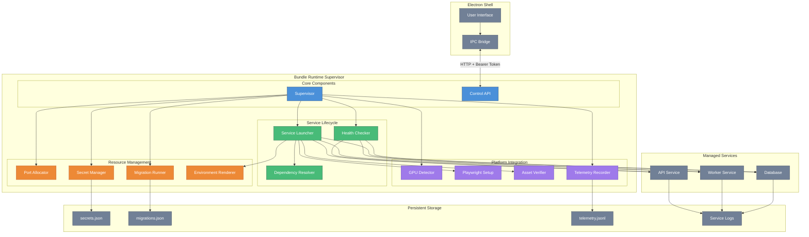
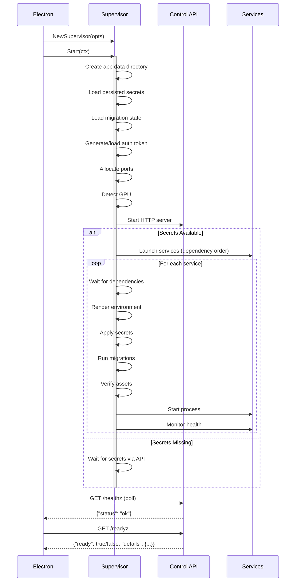

# Desktop Bundle Runtime

The `bundleruntime` package provides the supervisor component for Vrooli desktop bundles. It orchestrates service lifecycles, manages secrets, handles health monitoring, and exposes a control API for Electron shell integration.

## Architecture Overview



## Startup Sequence



## File Structure

### Top-Level (Orchestration Layer)

| File | Purpose |
|------|---------|
| `supervisor.go` | Core `Supervisor` struct with `Start()`, `Shutdown()`, and factory functions |
| `control_api.go` | HTTP handlers for `/healthz`, `/readyz`, `/ports`, `/logs`, `/secrets`, `/shutdown` |
| `service_launcher.go` | Process lifecycle: start, stop, health monitoring |
| `migrations.go` | Migration orchestration and execution |
| `types.go` | Type aliases re-exported from domain packages |
| `utils.go` | Shared utility functions |

### Domain Packages

| Package | Purpose |
|---------|---------|
| `infra/` | Infrastructure abstractions (clock, filesystem, network, process) |
| `manifest/` | Bundle manifest schema and loading |
| `ports/` | Dynamic port allocation within configurable ranges |
| `secrets/` | Secret storage, loading, and injection |
| `health/` | Readiness and health checking (HTTP, TCP, command, log_match) |
| `gpu/` | Cross-platform GPU detection and requirements |
| `assets/` | Asset verification and Playwright environment setup |
| `env/` | Environment variable templating with `${data}`, `${bundle}`, `${svc.port}` |
| `migrations/` | Migration state tracking |
| `telemetry/` | JSONL event recording for debugging and analytics |
| `errors/` | Structured error types for better error handling |
| `deps/` | Dependency resolution (topological sort) |
| `testutil/` | Mock implementations for testing |
| `cmd/` | CLI entry points (`runtime` daemon, `runtimectl` CLI) |

## Usage

### Basic Usage

```go
package main

import (
    "context"
    "log"
    "os/signal"
    "syscall"

    bundleruntime "scenario-to-desktop-runtime"
    "scenario-to-desktop-runtime/manifest"
)

func main() {
    // Load manifest
    m, err := manifest.LoadManifest("bundle.json")
    if err != nil {
        log.Fatal(err)
    }

    // Create supervisor
    supervisor, err := bundleruntime.NewSupervisor(bundleruntime.Options{
        Manifest:   m,
        BundlePath: "/path/to/bundle",
    })
    if err != nil {
        log.Fatal(err)
    }

    // Start with cancellation context
    ctx, cancel := signal.NotifyContext(context.Background(), syscall.SIGINT, syscall.SIGTERM)
    defer cancel()

    if err := supervisor.Start(ctx); err != nil {
        log.Fatal(err)
    }

    // Wait for shutdown signal
    <-ctx.Done()
    supervisor.Shutdown(context.Background())
}
```

### Command-Line Tools

**Runtime Daemon:**
```bash
# Start the runtime with a manifest
runtime --manifest bundle.json

# Override app data directory
runtime --manifest bundle.json --app-data /custom/data/dir

# Dry-run mode (no actual service launches)
runtime --manifest bundle.json --dry-run
```

**Runtime Control CLI:**
```bash
# Check runtime health
runtimectl health

# Check service readiness
runtimectl ready

# Get allocated ports
runtimectl ports

# Get specific service port
runtimectl port --service api --port-name http

# View service logs
runtimectl logs --service api --lines 100

# Trigger shutdown
runtimectl shutdown
```

## Control API Endpoints

| Endpoint | Method | Auth | Description |
|----------|--------|------|-------------|
| `/healthz` | GET | No | Basic runtime health (for Electron startup gate) |
| `/readyz` | GET | Yes | Detailed service readiness status |
| `/ports` | GET | Yes | Current port allocation map |
| `/logs/tail` | GET | Yes | Tail service log file (`?serviceId=X&lines=N`) |
| `/secrets` | GET | Yes | List secrets with has_value status |
| `/secrets` | POST | Yes | Submit secret values |
| `/telemetry` | GET | Yes | Get telemetry file path and upload URL |
| `/shutdown` | GET | Yes | Initiate graceful shutdown |

**Authentication:** Bearer token from `{app_data}/runtime/auth-token`

```bash
curl -H "Authorization: Bearer $(cat ~/.config/myapp/runtime/auth-token)" \
     http://127.0.0.1:47710/readyz
```

## Manifest Schema

The runtime is driven by a `bundle.json` manifest:

```json
{
  "schema_version": "0.1",
  "target": "desktop",
  "app": {
    "name": "My App",
    "version": "1.0.0"
  },
  "ipc": {
    "mode": "http",
    "host": "127.0.0.1",
    "port": 47710,
    "auth_token_path": "runtime/auth-token"
  },
  "telemetry": {
    "file": "runtime/telemetry.jsonl",
    "upload_url": "https://api.example.com/telemetry"
  },
  "ports": {
    "default_range": {"min": 47000, "max": 48000},
    "reserved": [47710]
  },
  "secrets": [
    {
      "id": "API_KEY",
      "class": "user_prompt",
      "required": true,
      "prompt": {"label": "API Key", "hint": "Your API key from dashboard"},
      "target": {"type": "env", "name": "API_KEY"}
    }
  ],
  "services": [
    {
      "id": "api",
      "type": "backend",
      "binaries": {
        "linux-x64": {"path": "bin/api-linux", "args": ["--port", "${api.http}"]},
        "darwin-x64": {"path": "bin/api-darwin"},
        "win-x64": {"path": "bin/api.exe"}
      },
      "env": {
        "LOG_LEVEL": "info",
        "DATA_DIR": "${data}/api"
      },
      "ports": {
        "requested": [{"name": "http", "range": {"min": 47000, "max": 47100}}]
      },
      "health": {
        "type": "http",
        "path": "/health",
        "port_name": "http",
        "interval_ms": 1000,
        "timeout_ms": 5000,
        "retries": 3
      },
      "readiness": {
        "type": "health_success",
        "timeout_ms": 30000
      },
      "data_dirs": ["api/data", "api/cache"],
      "log_dir": "logs/api.log",
      "secrets": ["API_KEY"],
      "dependencies": ["database"],
      "migrations": [
        {
          "version": "v1",
          "command": ["bin/migrate", "up"],
          "run_on": "always"
        }
      ]
    }
  ]
}
```

## Health Check Types

| Type | Description | Configuration |
|------|-------------|---------------|
| `http` | HTTP GET to endpoint, expects 2xx | `path`, `port_name` |
| `tcp` | TCP connection attempt | `port_name` |
| `command` | Execute command, expect exit 0 | `command` |
| `log_match` | Regex match in log file | `path` (regex pattern) |

## Readiness Check Types

| Type | Description | Configuration |
|------|-------------|---------------|
| `health_success` | Poll health check until success | `timeout_ms` |
| `port_open` | Wait for TCP port to accept connections | `port_name`, `timeout_ms` |
| `log_match` | Wait for pattern in logs | `pattern`, `timeout_ms` |
| `dependencies_ready` | Wait for dependent services | (none) |

## GPU Requirements

Services can declare GPU requirements:

| Requirement | Behavior |
|-------------|----------|
| `required` | Error if no GPU detected |
| `optional_with_cpu_fallback` | Use GPU if available, otherwise CPU (silent) |
| `optional_but_warn` | Use GPU if available, otherwise CPU (telemetry warning) |

Environment variables set:
- `BUNDLE_GPU_AVAILABLE`: "true" or "false"
- `BUNDLE_GPU_MODE`: "gpu" or "cpu"

## Telemetry Events

Events recorded to JSONL file:

| Event | Description |
|-------|-------------|
| `runtime_start` | Supervisor started |
| `runtime_shutdown` | Supervisor shutting down |
| `runtime_error` | Fatal runtime error |
| `service_start` | Service process launched |
| `service_ready` | Service passed readiness check |
| `service_not_ready` | Service failed readiness check |
| `service_exit` | Service process exited |
| `gpu_status` | GPU detection result |
| `secrets_missing` | Required secrets not provided |
| `secrets_updated` | Secrets submitted via API |
| `migration_start` | Migration execution started |
| `migration_applied` | Migration completed successfully |
| `migration_failed` | Migration failed |
| `asset_missing` | Required asset not found |
| `asset_checksum_mismatch` | Asset SHA256 mismatch |
| `asset_size_exceeded` | Asset larger than budget |

## Error Types

The package provides structured error types for better error handling:

```go
// Check if error is service-related
if bundleruntime.IsServiceError(err, "api") {
    // Handle API service error
}

// Check error category
if bundleruntime.IsSecretError(err) {
    // Prompt user for missing secrets
}

// Unwrap to get underlying cause
var svcErr *bundleruntime.ServiceError
if errors.As(err, &svcErr) {
    log.Printf("Service %s failed during %s: %v", svcErr.ServiceID, svcErr.Op, svcErr.Err)
}
```

## Testing

Run tests:
```bash
go test -v ./...
```

Run tests with coverage:
```bash
go test -cover -coverprofile=coverage.out ./...
go tool cover -html=coverage.out
```

## License

Part of the Vrooli project. See repository root for license information.
