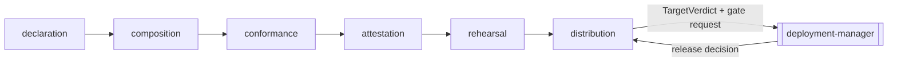

# Domains — Scenario to Plugin

This document is the canonical map of product capabilities, bounded
contexts, and ownership for this scenario. Keep it current whenever a
domain is added, renamed, split, merged, or removed.

Scenario to Plugin is a **delivery ramp**. Its domains form a single
pipeline — a package is declared, composed, checked, attested, rehearsed,
and only then distributed — so the domain map is also the build order.
`health` is the one real domain the scaffold ships. The scaffold also
ships one clearly fenced worked example domain (never product scope) as a
copyable reference; `template-manager detemplate scenario-to-plugin`
removes every fenced example once the real domains are green.

## Purpose Of This Document

Use this document to answer:

- What product capabilities does this scenario expose?
- Which domain owns each concept, table, proto, endpoint, UI feature,
  CLI command, and test surface?
- Which concepts are shared, deferred, or deliberately not domains?

System-level architecture belongs in [`ARCHITECTURE.md`](ARCHITECTURE.md).
Workflow details belong in [`FLOWS.md`](FLOWS.md). Storage details
belong in [`DATA.md`](DATA.md).

## The Pipeline Invariant

Every domain reads the one before it and none reads the one after it. The
chain is acyclic by design, and each stage is a gate rather than a step:
a package that fails a stage does not reach the next one.

Two rules follow from the chain, and both are enforced in the domains
rather than left to caller discipline:

- **No stage may be skipped.** `attestation` refuses to sign a package
  whose `conformance` record is absent or failing; `distribution` refuses
  to publish a package whose `rehearsal` did not pass.
- **Only `distribution` talks to the governance plane.** Upstream domains
  produce records; the release conversation happens in exactly one place.

## Domain Inventory

| Domain | Responsibility | Purpose | Owns Data | Primary Archetype | Secondary Traits | Glossary | Source Paths |
|---|---|---|---|---|---|---|---|
| health | Report runtime readiness and dependency reachability. | Expose API/database readiness and show the UI can read live backend state. | No product data. | reporting | query | HealthHandler | `api/handlers/health/`, `ui/src/features/health/`, `packages/proto/schemas/scenario-to-plugin/v1/shared/health.proto` |
| declaration | Resolve and validate what a scenario publishes, and derive publish readiness. | Make publishable content an explicit, reviewed claim rather than a filesystem guess. | Declaration snapshots, readiness evaluations. | reporting | query, validation | PluginDeclaration, Prerequisite, Readiness | `api/internal/declaration/`, `api/handlers/declaration/`, `cli/domains/declaration/`, `ui/src/features/readiness/` |
| composition | Build the Agent Plugins artifact tree from a validated declaration. | Turn declared intent into a specification-conformant package on disk. | Package records, component inventories. | service | builder | Package, Component, PluginManifest | `api/internal/composition/`, `api/handlers/composition/`, `cli/domains/composition/`, `ui/src/features/packages/` |
| conformance | Gate a composed package on skill specification, CLI drift, and install-script safety. | Refuse to advance anything that would mislead or endanger a consuming agent. | Conformance runs, findings. | validation | reporting | Finding, DriftCheck, ManifestPin | `api/internal/conformance/`, `api/handlers/conformance/`, `cli/domains/conformance/`, `ui/src/features/conformance/` |
| attestation | Scan, sign, and attach provenance and an SBOM to a conformant package. | Produce the trust artifacts a registry and a consuming agent verify. | Attestation records, scanner verdicts, artifact digests. | service | integration | Signature, Provenance, SBOM, ScanVerdict | `api/internal/attestation/`, `api/handlers/attestation/`, `cli/domains/attestation/`, `ui/src/features/attestation/` |
| rehearsal | Install the attested package in a clean room and exercise its documented commands. | Convert a build claim into a runtime claim, and emit protocol-profile evidence. | Rehearsal runs, journey manifests, evidence references. | workflow | integration, reporting | Rehearsal, Journey, GateResult | `api/internal/rehearsal/`, `api/handlers/rehearsal/`, `cli/domains/rehearsal/`, `ui/src/features/rehearsal/` |
| distribution | Ask for the release decision, publish through channel adapters, confirm, and revoke. | Own the governance handshake and every outward-facing channel call. | Publications, channel outcomes, revocations, install attribution. | workflow | integration | Channel, Publication, Revocation, Adapter | `api/internal/distribution/`, `api/handlers/distribution/`, `cli/domains/distribution/`, `ui/src/features/distribution/` |

<!-- EXAMPLE-DOMAIN:notes START -->
### Example domain — `notes` (removed by `template-manager detemplate`)

The template ships `notes` as a worked CRUD vertical slice with a binary
upload exception. Copy its shape for your own domains, then remove it.

| Domain | Responsibility | Purpose | Owns Data | Primary Archetype | Secondary Traits | Glossary | Source Paths |
|---|---|---|---|---|---|---|---|
| notes | Provide the worked CRUD reference with attachment upload exception. | Demonstrate the expected vertical slice for a real domain. | Notes and attachment metadata. | crud | service | Note, Attachment | `api/internal/notes/`, `api/handlers/notes/`, `cli/domains/notes/`, `ui/src/features/notes/`, `packages/proto/schemas/scenario-to-plugin/v1/notes/` |

- Purpose: demonstrate the expected vertical slice for a real domain.
- Primary archetype: CRUD / entity.
- Secondary traits: binary/blob attachment upload, upload workflow.
- Owns: note records, attachment metadata, note validation, note
  service/repository seams, UI note interactions, CLI notes commands.
- Does not own: product scope for a generated scenario.
- API: `api/internal/notes/`, `api/handlers/notes/`.
- CLI: `cli/domains/notes/`.
- UI: `ui/src/features/notes/`, `ui/src/api/notes.ts`.
- Storage: domain-owned SQLite schema in `api/internal/notes/schema.sql`.
- Requirements: template starter only; replace with PRD-specific
  requirements.
- Tests: repository, service, handler, CLI, UI, accessibility, and
  workflow tests.
- Related docs: [`FLOWS.md`](FLOWS.md), [`DATA.md`](DATA.md),
  [`../internal/SEAMS.md`](../internal/SEAMS.md).

The `notes` attachments path is the reference for this scenario's only
binary edge: artifact upload and download in `composition` follows the
same REST multipart exception while keeping metadata proto-typed.
<!-- EXAMPLE-DOMAIN:notes END -->

## Domain Details

### health

- Purpose: expose API/database readiness and show the UI can read live
  backend state.
- Primary archetype: reporting / query.
- Secondary traits: operational health.
- Owns: health response construction and dependency status mapping.
- Does not own: product data, business rules, or scenario-specific
  domain behavior.
- API: `api/handlers/health/`.
- CLI: built-in `status` command is provided through cli-core.
- UI: `ui/src/features/health/HealthCard.tsx`.
- Storage: none; probes configured database reachability.
- Requirements: scaffold health only.
- Tests: handler, module, UI feature, and accessibility tests.
- Related docs: [`../reference/api-endpoints.md`](../reference/api-endpoints.md).

### declaration

- Purpose: answer "what does this scenario publish, and may it publish
  yet?" from an explicit, schema-validated declaration.
- Primary archetype: reporting / query.
- Secondary traits: validation, fleet aggregation.
- Owns: declaration resolution and snapshotting, prerequisite evaluation,
  readiness scoring, and the fleet readiness board's data.
- Does not own: the declaration schema itself (a repo-level contract), the
  content of any skill, or the decision to publish.
- Inputs: the target scenario's governed manifest; `cli-health` for the
  wrapped command surface; the standalone-install prerequisite signal.
- API: `api/internal/declaration/`, `api/handlers/declaration/`.
- CLI: `cli/domains/declaration/` — `readiness`, `declaration show`.
- UI: `ui/src/features/readiness/` — the fleet board and per-scenario
  prerequisite detail.
- Storage: `declarations`, `readiness_evaluations`.
- Requirements: `PLG-DECL-SOURCE`, `PLG-DECL-READINESS`,
  `PLG-DECL-STANDALONE`.
- Why it is first: every later domain needs a validated declaration, and
  nothing needs anything from a later domain to produce one.

### composition

- Purpose: materialize an Agent Plugins 1.0.0 tree — `plugin.json`, an
  optional `skills/` directory, an optional `mcp.json` — at the fixed
  locations the specification requires.
- Primary archetype: service / builder.
- Secondary traits: artifact production.
- Owns: the package model, manifest emission, component inventory, and the
  on-disk artifact layout.
- Does not own: whether the content is *correct* — that is `conformance`.
  Composition rejects only what it cannot represent.
- API: `api/internal/composition/`, `api/handlers/composition/`.
- CLI: `cli/domains/composition/` — `package build`, `package show`.
- UI: `ui/src/features/packages/` — package detail, manifest preview,
  component inventory.
- Storage: `packages`, `package_components`; artifact bytes live in the
  capture store, referenced by digest.
- Requirements: `PLG-COMPOSE-TREE`, `PLG-COMPOSE-MANIFEST`,
  `PLG-COMPOSE-INDEPENDENT`, `PLG-COMPOSE-MCP`, `PLG-COMPOSE-COMPOSITE`.
- Binary edge: artifact upload/download uses the REST multipart exception;
  all metadata stays proto-typed.

### conformance

- Purpose: be the fail-closed gate that stands between a composed package
  and any cryptographic assertion about it.
- Primary archetype: validation.
- Secondary traits: reporting, diagnostics.
- Owns: skill specification checks (frontmatter keys, name/folder match,
  description limit, angle brackets), injection checks (hidden Unicode,
  bidirectional marks, NFC normalization), permission checks
  (`allowed-tools` breadth), install-script safety (pinning, checksums,
  no elevation, user-scoped prefix), and the **skill-to-CLI drift check**.
- Does not own: signing, publication, or the judgment of whether a
  capability is worth publishing.
- The drift check is this scenario's differentiating capability. It
  resolves every command shown in a `SKILL.md` body against the wrapped
  scenario's pinned `cli-manifest` and records the manifest revision it
  checked against, so a later failure distinguishes a skill regression
  from a CLI change.
- API: `api/internal/conformance/`, `api/handlers/conformance/`.
- CLI: `cli/domains/conformance/` — `check run`, `check show`.
- UI: `ui/src/features/conformance/` — finding list, drift detail with the
  unresolved command and the manifest revision.
- Storage: `conformance_runs`, `findings`, `manifest_pins`.
- Requirements: `PLG-CONF-DRIFT`, `PLG-CONF-DRIFT-PIN`,
  `PLG-CONF-FRONTMATTER`, `PLG-CONF-UNICODE`, `PLG-CONF-ANGLE`,
  `PLG-CONF-TOOLS`, `PLG-CONF-INSTALL-PIN`, `PLG-CONF-INSTALL-SUM`,
  `PLG-CONF-INSTALL-PRIV`, `PLG-CONF-REPAIR`.

### attestation

- Purpose: produce the trust artifacts a registry, a scanner, and a
  consuming agent independently verify.
- Primary archetype: service.
- Secondary traits: external integration.
- Owns: scanner invocation and verdict interpretation, Cosign signing
  through the managed release authority, SLSA provenance attachment,
  CycloneDX SBOM generation, credential-literal redaction checks, and the
  ordering rule that refuses to sign an unconformant package.
- Does not own: key custody, rotation, or revocation — those belong to the
  platform release-signing authority. This domain holds references.
- API: `api/internal/attestation/`, `api/handlers/attestation/`.
- CLI: `cli/domains/attestation/` — `attest run`, `attest show`,
  `attest verify`.
- UI: `ui/src/features/attestation/` — scan verdict, provenance card,
  SBOM summary, digest display.
- Storage: `attestations`, `scan_verdicts`, `artifact_digests`.
- Requirements: `PLG-ATTEST-ORDER`, `PLG-ATTEST-SCAN`, `PLG-ATTEST-SIGN`,
  `PLG-ATTEST-PROV`, `PLG-ATTEST-SBOM`, `PLG-ATTEST-NO-SECRETS`.

### rehearsal

- Purpose: this ramp's target-native validation. Install the attested
  package on a machine that has no Vrooli runtime and prove the skill's
  documented commands actually work.
- Primary archetype: workflow.
- Secondary traits: external integration, evidence production.
- Owns: sandbox lifecycle, install execution, idempotency re-run,
  undisclosed-acquisition detection, per-command exercise with redacted
  output capture, entitlement sign-in proof, and emission of the
  protocol-profile journey manifest.
- Does not own: the evidence schema, disposition rules, or verdict
  semantics — those belong to `packages/delivery-ramp-go`. This domain
  implements the spine's `Driver` seam.
- Why it exists separately from `conformance`: conformance proves a
  command is *declared*; rehearsal proves it *runs after a clean install*.
  A capability can pass one and fail the other, and only the second
  detects stealth bundling.
- API: `api/internal/rehearsal/`, `api/handlers/rehearsal/`.
- CLI: `cli/domains/rehearsal/` — `rehearse run`, `rehearse show`.
- UI: `ui/src/features/rehearsal/` — journey manifest, per-command
  results, gate ladder position.
- Storage: `rehearsals`, `journeys`, `gate_results`, `evidence_refs`;
  logs and captures live in the capture store.
- Requirements: `PLG-REHEARSE-ISOLATE`, `PLG-REHEARSE-COMMANDS`,
  `PLG-REHEARSE-NO-STEALTH`, `PLG-REHEARSE-IDEMPOTENT`,
  `PLG-REHEARSE-EVIDENCE`, `PLG-REHEARSE-ENTITLEMENT`.

### distribution

- Purpose: own the governance handshake and every outward-facing call.
- Primary archetype: workflow.
- Secondary traits: external integration, adapter registry.
- Owns: `TargetVerdict` emission to `deployment-manager`, the release-gate
  request and its commit binding, channel adapters (signed OCI first,
  Claude Code marketplace descriptor second), publication confirmation by
  retrieval, publication history, revocation fan-out with per-channel
  outcomes, and per-plugin install attribution.
- Does not own: the release decision itself. `deployment-manager` decides;
  this domain asks and obeys. It also never stores artifact bytes in the
  governance plane — verdicts carry references only.
- Adapter seam: a channel is an adapter over one already-composed package.
  Adding a format must never require re-authoring skill content, which is
  what keeps the two incompatible plugin manifests from doubling the
  authoring cost.
- API: `api/internal/distribution/`, `api/handlers/distribution/`.
- CLI: `cli/domains/distribution/` — `publish`, `publish status`,
  `revoke`, `channels list`.
- UI: `ui/src/features/distribution/` — publish summary, channel state,
  adapter matrix, revocation state, attribution table.
- Storage: `publications`, `channel_outcomes`, `revocations`,
  `install_attributions`.
- Requirements: `PLG-DIST-VERDICT`, `PLG-DIST-GATE`,
  `PLG-DIST-AGENTPLUGINS`, `PLG-DIST-CONFIRM`, `PLG-DIST-REVOKE`,
  `PLG-DIST-REVOKE-PARTIAL`, `PLG-DIST-CLAUDECODE`,
  `PLG-DIST-ATTRIBUTION`, `PLG-DIST-SUBMIT`, `PLG-DIST-ADAPTERS`.

## Shared Concepts

| Concept | Meaning | Owner |
|---|---|---|
| Domain | Product capability boundary that should be easy to find, test, and delete. | `DOMAINS.md` defines the map; code owns implementation. |
| Surface | API, UI, CLI, or contract layer exposing the same product capability. | `ARCHITECTURE.md`. |
| Seam | Test-substitutable boundary wired once in production. | `../internal/SEAMS.md`. |
| Requirement | Implementation-facing measurement tied back to the PRD. | `requirements/`. |
| Package | One composed Agent Plugins tree for one scenario at one source commit. | `composition`. |
| Gate | A stage that must pass before the next stage may run. | Each pipeline domain owns its own gate. |
| Evidence reference | A pointer to an artifact held by its producer, never the bytes. | `packages/delivery-ramp-go`. |
| Channel | One outward destination reached through one adapter. | `distribution`. |

## Deferred Domains

| Candidate Domain | Why Deferred | Revisit Trigger |
|---|---|---|
| `submission` | Curated-registry submission is a relationship-bearing manual process today. Automating a review workflow before one package has been accepted by hand would encode a process we have not run. | One Vrooli package accepted by a curated registry (`OT-P2-001`). |
| `authoring` | Skill content is owned by the scenario it wraps, not by this ramp. A skill editor here would move ownership to the wrong place and make drift more likely, not less. | Evidence that scenario owners cannot maintain skill content in place. |
| `marketplace` | Hosting a Vrooli-run plugin registry is a different product with its own trust and availability obligations. | A distribution need that no existing channel can serve. |

## Non-Domains

These are important but should not become product domains:

- `api/internal/server/` — HTTP composition substrate.
- `api/internal/module/` — shared module descriptor type.
- `api/internal/modules/` — thin registry for boot/codegen.
- `api/internal/database/` — cross-cutting database infrastructure.
- `api/internal/testutil/` — cross-domain test harnesses.
- `ui/src/components/` — shared presentation primitives.
- `ui/src/test-utils/` — cross-feature testing support.
- `packages/delivery-ramp-go` — the shared cross-ramp spine. It is a
  governed package, not a domain of this scenario. If this scenario needs
  a change to journey, evidence, or verdict semantics, the change belongs
  in the package where every ramp inherits it.

If one of these starts using product vocabulary, split the product
piece into an owning domain instead of growing infrastructure.

## Cross-References

- [`ARCHITECTURE.md`](ARCHITECTURE.md) — system shape and extension rules
- [`FLOWS.md`](FLOWS.md) — workflows and state transitions
- [`DATA.md`](DATA.md) — data ownership and storage
- [`INTEGRATIONS.md`](INTEGRATIONS.md) — dependency contracts
- [`../internal/SEAMS.md`](../internal/SEAMS.md) — boundary registry
- [`../internal/TESTING.md`](../internal/TESTING.md) — test strategy
- [`../internal/DECISIONS.md`](../internal/DECISIONS.md) — durable choices
