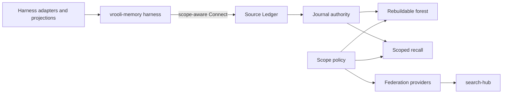

# Architecture — Source Ledger

## Boundary

Source Ledger owns the general ledger engine: journal, forest, facets, recall,
policy, vector, inference, and federation. `vrooli-memory` owns harness
adapters, native capture, prompt blocks, projections, and imports. The
consumer calls this service through generated contracts after cutover.

## Invariants

- The journal is append-only. SQL triggers and high-water marks fail closed.
- Scope is explicit at every journal, recall, forest, and facet boundary.
- The forest is a cache. Rebuild and compaction never delete journal rows.
- Facet names and retention labels are data. Engine packages remain pure and
  do not hard-code a vocabulary.
- Provider failures are visible and bounded. They do not convert durable
  journal writes into transient successes or silent data loss.
- A search-hub provider identifies its scope and never returns another scope's
  corpus as an unlabeled duplicate.

## Dependency Direction

The composition root wires policy, journal, facets, forest, recall, and
federation. Domains depend on interfaces, not on handlers or UI. Connect
handlers translate transport errors at the boundary. The CLI and UI use the
generated contract rather than literal REST paths.

## Extraction Boundary

Phase 12 defined this contract-first scenario. Phase 13 fixed the wire
boundary and migration rules: the journal, recall, forest, facets, rules, and
scopes services are authored under `packages/proto/schemas/source-ledger/v1/`,
and every request is scope-aware. Phase 14 completed the behavior-preserving
engine move and wired the source-ledger composition root. Phase 15 migrates
the corpus. Phase 16 cuts `vrooli-memory` over to this service.

The migration boundary is deliberately two-sided. `source-ledger` owns the
engine and one authoritative ledger database; `vrooli-memory` keeps harness
adapters, native capture, prompt blocks, projections, and imports. The
consumer resolves this scenario once at startup and uses generated Connect
clients. There is no consumer-side read replica.

## Architecture Maturity

The contract is at the moved-engine stage: source-ledger owns the copied
engine packages and generated Connect handlers, while `vrooli-memory` retains
its copies until corpus cutover proves the new authority path.

## Contracts And Data Flow

The contract flows from scoped requests through policy into journal, forest,
recall, and facets boundaries; transport adapters remain at the edge. Scope
registry requests carry the registry scope explicitly, while the `Scope`
resource carries the vocabulary and budget for the target ledger.

## Purpose Of This Document

This document defines the Source Ledger boundary and the invariants that
later extraction phases must preserve.

## Scenario Shape

Source Ledger is a lifecycle-managed Go service with a reusable CLI, a React
operator surface, and generated transport contracts.

## System Boundaries

The journal and derived engine domains belong here; harness adapters remain in
`vrooli-memory`.

## Shared Infrastructure

SQLite, generated proto types, lifecycle health, and governed dependency seams
are shared infrastructure rather than ledger domains.

## Extension Rules

Add domain behavior behind generated contracts and explicit scope parameters;
do not introduce facet names into engine code.

## Intentional Deviations

Capabilities remains a REST operational probe without a scenario-local proto;
the moved ledger RPCs are generated Connect surfaces. Federation registration
is still a later provider-adoption surface rather than a source-ledger runtime
module in this phase.

## Documentation Architecture

PRD and requirements define intent; concept docs define ownership and flows;
internal docs record decisions and test seams; reference docs describe APIs.

## Cross-References

- [`DOMAINS.md`](DOMAINS.md)
- [`FLOWS.md`](FLOWS.md)
- [`DATA.md`](DATA.md)
- [`INTEGRATIONS.md`](INTEGRATIONS.md)
- [`../internal/SEAMS.md`](../internal/SEAMS.md)
- [`../internal/TESTING.md`](../internal/TESTING.md)
