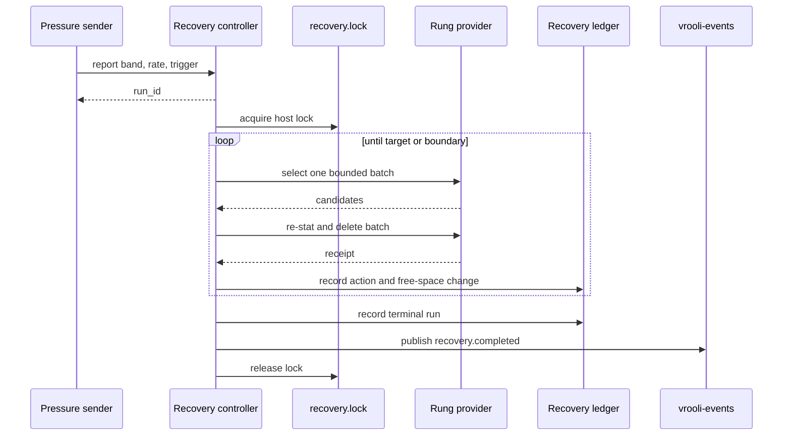

# Recovery controller

Storage Manager has two separate cleanup paths:

- Retention runs on its schedule and keeps declared owner budgets true.
- Recovery responds to pressure and restores a free-space target.

Recovery is server-owned. `storage-manager cleanup run` returns a run id as
soon as the controller accepts the request. Use `storage-manager cleanup wait`
once to wait for the terminal result; do not start a second run while the
first run holds the host lock.

## Control loop



The controller reads free space before every batch and stops when the target
is met, the current rung has no budget, the operator line is reached, or an
error prevents safe continuation. It does not run a complete census before
the first deletion. Census snapshots remain an attribution and reporting
surface.

The default target is 15% free space. A floor breach bypasses normal pressure
debounce and cooldown. Batch limits, provider safety tiers, containment,
protected patterns, and re-stat checks remain active for every trigger,
including `manual`.

## Rungs and authority

R0 admits providers with the `safe` tier. R1 admits providers with the
`regenerable` tier and a valid regenerability proof. R2 admits an owner entry
only when its declaration is regenerable and has a byte or age budget. The
operator line separates these autonomous rungs from conditional providers.
R3 requires a host-local standing approval and the privilege broker.

An approval names a provider and subject constraints. It never grants access
to arbitrary paths, Docker volumes, or commands. See
[`RECOVERY-LADDER.md`](RECOVERY-LADDER.md) and
[`../reference/standing-approvals.md`](../reference/standing-approvals.md).

## Inspecting a run

```bash
storage-manager cleanup run --trigger manual --json
storage-manager cleanup wait --run-id <run-id> --json
storage-manager cleanup history --limit 20 --json
storage-manager storage writers --top 10 --json
storage-manager storage infra-health --json
```

Recovery rows store integer byte counts, files removed, duration, free space
before and after, authority, and the terminal stop reason. Consumers must use
these typed fields instead of parsing audit messages.
