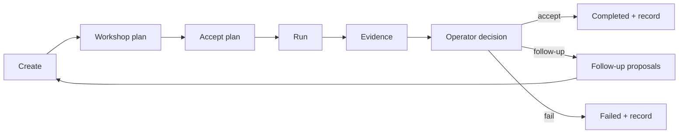
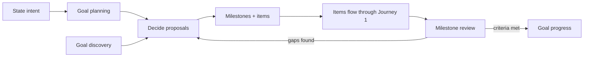

# Operator Journeys

> **Status: normative narrative.** This document tells the end-to-end story of
> operating Swarm Manager — what the operator does, what the system does, and
> what the next step is at every point. It complements
> [TARGET-OPERATING-MODEL.md](./TARGET-OPERATING-MODEL.md) (the authority and
> transition grammar) and [transition-catalog.md](../reference/transition-catalog.md)
> (the mechanical registry). Where this narrative and the grammar disagree, the
> grammar wins. Implementation status per promise is tracked in
> `requirements/` against the PRD operational targets — this document describes
> the target experience, not a feature inventory.

## The promise

Swarm Manager mirrors how a person collaborates with a coding agent, at two
levels:

- **The backlog item** automates completing one piece of work — a feature, a
  bug fix, a chore, research, or an idea being shaped. Create it, workshop one
  evolving plan until you accept it, execute it with the strategy you choose,
  review the evidence, decide the outcome, and file the follow-ups. The whole
  arc should be at least as effective as prompting a coding agent yourself.
- **The goal** automates what a project manager does above that: hold intent,
  partition it into milestones with real acceptance criteria, watch whether
  completed work actually moves the goal forward, and propose the next work
  when it does not.

At both levels the system keeps one invariant: **the next recommended action
is always explicit, and it is never something the server would refuse to do.**

## Journey 1: a backlog item, end to end

### 1. Create

Work enters three ways, all landing as a backlog item with a kind
(`idea`, `research`, `fix`, `execute`, `chore`):

- **Directly** — the operator creates the item in the UI, CLI, or API.
- **From a capture** — a quick observation/bug/screenshot goes through the
  capture-classification workflow, which suggests backlog work the operator
  accepts or discards.
- **From a proposal** — an agent session, a review round, or a goal workflow
  proposes a new item as a typed mutation; it becomes real only when the
  operator accepts the proposal.

### 2. Workshop the plan

Every item carries **exactly one evolving plan** (a Plan Manager plan bound by
`plan_ref`). There are no parallel plan variants; revision happens in place.

- If no plan exists, the next action is **author a plan** (`plan.author`
  workflow, or the operator writes one through Plan Manager directly).
- Workshopping is a round loop the operator drives: a **review round**
  (`plan.workshop.review`) produces a packet of typed proposals and open
  decision questions; the operator answers in **one response**; a
  **reconciliation round** (`plan.workshop.reconcile`) folds the accepted
  responses into a candidate revision; the operator applies or discards the
  candidate. Rounds repeat until the operator is satisfied.
- Agents never edit the plan silently. Every change flows through a proposal
  the operator saw, or an explicit candidate apply.

### 3. Accept the plan

Acceptance is the authorization boundary between planning and execution:

- The operator explicitly accepts the plan. Swarm records the actor,
  timestamp, subject version, and the **exact plan content hash**.
- **Any plan change clears acceptance.** A changed plan must be accepted
  again; execution can never run against a plan the operator has not seen.
- Acceptance can be withdrawn (unaccept) any time the item is not queued or
  running.
- Historical readiness scores, agent confidence, or plan mere-existence never
  substitute for acceptance.

### 4. Run

With a fresh acceptance, the next action becomes **run**:

- The operator picks an **execution strategy** from the declared registry. The
  highest-effort default is the **phased plan drain**: implement and validate
  one plan slice at a time. A one-shot full-plan strategy is a declared
  alternative for smaller, well-bounded plans.
- Run-level knobs (slice budget, execution policy `manual`/`scheduled`/`yolo`,
  delay) are set at queue time. Queueing enforces the same preflight the
  next-action projection uses: fresh acceptance, dependency order, queue and
  cost caps, circuit breakers.

### 5. Execute

Execution is an Agent Manager workflow; Swarm authorizes it, correlates it,
and applies its typed terminal result exactly once:

- The **phased drain** works slice by slice: a fresh deep-work run implements
  one slice with access to prior-slice handoffs, a slice review checks the
  claimed work, and a bounded correction turn fixes what review flags before
  the next slice starts. Budgets (slices, corrections) end the run honestly as
  `budget_exhausted` rather than pretending completion.
- The operator can watch live progress (current slice, workflow state), answer
  a pause-for-approval when the strategy runs in manual mode, or cancel.
- Steering beyond approval signals happens by cancelling, revising the plan
  (which clears acceptance), and re-running — never by mutating a running
  workflow's plan underneath it.

### 6. Evidence

When the workflow reaches a terminal outcome, Swarm collects evidence before
asking the operator anything:

- A Git Control Tower **baseline diff** (what regressed, what cleared) and
  **Test Genie** results for each affected scenario.
- An **independent review** workflow reads the deliverable, the diff, and the
  test evidence and returns a typed verdict (accepted / changes requested /
  inconclusive / failed) with findings.
- The verdict is **advisory**. It classifies the round and organizes the
  evidence; it never completes the item.

### 7. Decide

The item lands in `review_pending`, and the operator makes the only decision
that reaches a terminal status:

- **Accept** → `completed`. **Fail** → `failed`. **Needs follow-up** →
  `needs_followup` with one required, typed dispatch instruction. That
  instruction is `{steering, disposition}` where disposition is
  `follow_up_run`, `replan`, or `new_items`; `new_items` additionally carries
  item specifications. Review agents and operators author the same shape.
- `needs_followup` is a live attention state, not an archive dead end. Its
  next action is `dispatch_followup` when the instruction is present and
  `author_followup` only when legacy or incomplete state must be repaired.
  Dispatch either starts the steered follow-up run, clears plan acceptance and
  writes the steering into workshop input, or applies the proposed items.
- Review findings arrive as **typed proposals** in one inbox. Each proposal
  states its policy (operator-required vs. automation-allowed) and is applied
  exactly once on acceptance.
- No terminal status is ever written by an agent, a scheduler, or a review
  verdict.

### 8. Learn

On completion Swarm writes the learning record and events that power
throughput, quality, and regression statistics — and that feed milestone and
goal truth in Journey 2.

## The next-action funnel (normative)

One server-owned projection computes the single recommended next action per
item. Precedence, highest first:

1. Archived / terminal → no action (or archive housekeeping).
2. Active execution → view execution (excluded from the operator inbox).
3. Awaiting review decision → review.
4. Open decisions or pending proposals → decide.
5. A pending follow-up → dispatch follow-up.
6. No valid plan → author or repair plan.
7. Plan not accepted (or acceptance stale) → accept plan.
8. Dependency or policy blockers → their mapped recovery action.
9. Everything ready → run.

Rules that keep the funnel honest:

- The projection **reuses the same preflight code that gates queueing** —
  recommendation and enforcement can never disagree.
- A disabled action always shows its reason. A categorically inapplicable
  action is hidden, not disabled.
- `plan_ref` existence is never treated as readiness.

### Canonical next-action vocabulary

This is the sole normative vocabulary for projection producers and consumers.
The ranked inbox sorts by tier, then goal priority, backlog rank, and age.
Wait states (`queued`, `in_progress`, and `in_review`) never enter that feed.

| Action ID | Tier | Scope | Meaning |
| --- | ---: | --- | --- |
| `decide` | 1 | backlog, goal | Resolve workshop questions or ready proposals. |
| `review` | 1 | backlog, goal | Decide review evidence or a milestone review. |
| `accept_plan`, `author_plan`, `repair_plan`, `plan_goal` | 2 | backlog / goal | Establish or authorize executable structure. |
| `run`, `dispatch_followup`, `author_followup`, `resolve_dependencies` | 3 | backlog | Start or unblock actionable work. |
| `accept_suggestion`, `retry`, `archive`, `close_out` | 4 | backlog / goal | Intake, recovery, or housekeeping decisions. |
| `chain` | inherited | goal | Delegates to the top-priority member item's action; it is not a second action. |
| `none`, `view_execution` | excluded | backlog, goal | Respectively terminal/inapplicable and wait-state visibility. |

| Blocker code | Primary action |
| --- | --- |
| `plan_changed`, `plan_not_accepted` | `accept_plan` |
| `plan_invalid` | `repair_plan` |
| `unmet_dependencies` | `resolve_dependencies` |
| `queue_cap`, `cost_cap`, `circuit_open` | `run` with the typed blocker and recovery guidance |

## Journey 2: a goal, end to end

A goal starts as a few sentences of operator intent — "get scenario X fully
ready for deployment" — and the system does the project-manager work around
it.

### 1. State intent

The operator creates a goal with a short description and, optionally, initial
target items. A goal's scope is **derived truth**: its targets plus the
transitive prerequisite closure of those items. Nothing hand-authored can go
stale.

### 2. Goal planning

Running **goal planning** (`goal.plan`) turns intent into structure. The agent
reads the goal, clarifies what the intent implies, and emits **typed
proposals**: create or split milestones, set each milestone's acceptance
criteria (its definition of done), define terms the goal depends on, assign
scope items to milestones, and propose new backlog items where the intent has
no covering work. Ambiguity comes back as an explicit attention outcome — a
question for the operator — never as a silent guess.

### 3. Decide

Goal proposals land in the same decision inbox as everything else. The
operator accepts, rejects, or annotates; accepted mutations apply exactly once
against the goal's version. The goal has no separate plan document — **the
goal's plan is its graph** of milestones and items, and planning means
proposing graph changes.

### 4. Work the items

Member items flow through Journey 1 individually. Goal priority drives the
execution queue's ordering, so accepting plans and running items is the same
experience whether or not the item belongs to a goal.

### 5. Milestone review

When the last member item of a milestone reaches a terminal status, a
**milestone review** fires automatically (it can also be run on demand). It
does not count statuses — it verifies each acceptance criterion against
repository evidence: code, tests, live behavior. Completed items with an
unmet criterion produce follow-up item proposals; a genuinely delivered
milestone is marked so with cited evidence. This is the guard against
"everything is done but it doesn't actually work."

### 6. Discovery

**Goal discovery** (`goal.discover`) sweeps the goal's scope for missing or
at-risk work — gaps the milestones don't cover, dependencies nobody filed —
and proposes items to close them.

### 7. Progress truth and next action

The goal surfaces derived progress (rollup, ETA bands from simulation,
scope-creep history) and, as the layer matures, velocity against trajectory.
The goal-level next action is a complete funnel: pending goal proposals →
`decide`; a milestone awaiting review → `review`; no milestones and no targets
→ `plan_goal`; all milestones verified-delivered → `close_out`; otherwise it
**chains into the top-priority member item's next action**, so "work the goal"
always resolves to one concrete step. `close_out` is an operator decision that
changes the goal to `achieved`; archived and achieved goals have no action.

## Authority guarantees (both journeys)

These hold everywhere and are enforced in code, not convention:

- Agents propose; **Swarm applies**. No agent session or workflow mutates the
  work ledger, a plan binding, or a goal graph directly.
- **Terminal statuses are operator decisions.** Finalization, polling, and
  review verdicts can park work in review states only.
- Every workflow result is a typed contract validated against a declared
  schema, applied exactly once, with provenance.
- Evidence comes from evidence authorities (Test Genie, Git Control Tower) —
  agent narrative is never proof.

## Where to go deeper

- Authority model and transition grammar: [TARGET-OPERATING-MODEL.md](./TARGET-OPERATING-MODEL.md)
- Transition registry mechanics: [transition-catalog.md](../reference/transition-catalog.md)
- Workshop mechanics: [workshop-workflow.md](../guides/workshop-workflow.md)
- Vocabulary: [GLOSSARY.md](./GLOSSARY.md)
- Contract promises and status: `PRD.md` + `requirements/`
