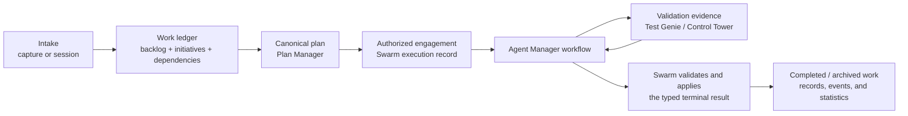

# Target Operating Model

> **Status: implemented architecture.** This document is normative for Swarm
> Manager. The retired operating-mode and agent-operation runtime survives only
> as read-only historical data; [ARCHITECTURE.md](./ARCHITECTURE.md) describes
> the active implementation.

## Purpose

Swarm Manager is Vrooli's project-management and operator-control surface. It
turns observations and goals into accountable, validated, completed work while
preserving human authority over scope, priority, approvals, and domain changes.

It is **not** the runtime that implements an agentic methodology. Agent
Manager workflows own that middle layer. Swarm owns the project domain around
it: intake, work records, planning references, authorization, evidence,
application of results, and learning.



## The boundary: conversation versus programmatic work

The governing rule is intentionally simple:

| Who composes the prompt and consumes the outcome? | Correct primitive |
| --- | --- |
| A human composes messages and reads replies. | An Agent Manager **Run**, owned by a Swarm **Agent Session**. |
| Code assembles input and code needs a typed result to continue. | A declared Agent Manager **Workflow**, even for one agent turn. |

The raw Run API remains the execution substrate underneath workflow nodes. It
is not the normal scenario-integration surface for programmatic work.

For a workflow adoption, Swarm retains only two domain adapters:

1. Build a typed, bounded, immutable input snapshot from Swarm state.
2. Validate authority and apply the workflow's typed terminal outcome exactly
   once to Swarm state.

Prompt construction, prompt-manager resolution, run creation, output
extraction, classification, retrying, looping, branching, review choreography,
and waiting belong to the workflow declaration. A Swarm implementation of any
of those concerns is migration debt unless it is a domain-specific apply or
authorization check.

## Concepts and their roles

| Concept | Why it exists | It owns | It does not own |
| --- | --- | --- | --- |
| **Capture** | Fast, low-commitment intake for an observation, request, bug, or idea. | Raw input, attachments, classification state. | A commitment to do work. |
| **Agent Session** | A durable human-led conversation for exploring, planning, or operating the project. | Conversation, message context, proposed mutations, attribution. | Autonomous programmatic orchestration. |
| **Backlog item** | The smallest independently reviewable and schedulable work commitment. | Goal, scope, dependencies, status, supporting context, canonical `plan_ref` when executable. | Its agent execution algorithm. |
| **Initiative** | A portfolio/goal container for related work that cannot honestly be represented as one backlog item or one plan. | Desired outcome, membership, cross-item constraints, progress and operator attention. | A separate agent runtime or mandatory mega-workflow. |
| **Plan reference** | The canonical execution specification for a work commitment. | Identity/provenance of a Plan Manager plan. | Plan-authoring heuristics or a shadow copy of plan content. |
| **Execution record** | Swarm's durable authorization and correlation record for an approved engagement. | Start intent, policy, entity/version/frontier correlation, approval, exactly-once result application. | Agent attempts, transcript, branches, or retry state. |
| **Agent Manager workflow execution** | The durable programmatic agentic method. | Nodes, Runs/continuations, budgets, waits, branches, journal, typed output, provenance. | Swarm-domain mutation or business approval policy. |
| **Evidence** | Trustworthy observations used to decide whether work is ready, valid, or regressed. | Provenance, freshness, validation results, review/test findings. | Agent narrative as proof. |
| **Record and event** | The project learning loop and measurement history. | Completed-work narrative, immutable state history, aggregate statistics. | Current mutable work state. |

### Intake

Swarm must make it easy to enter work before the operator knows its final
shape. There are two complementary entry paths:

```text
Quick Capture: observation → classification → suggested backlog work or discard
Agent Session: human conversation → typed proposal → explicit Swarm apply
```

Captures are the fastest path for a discrete note, bug report, screenshot, or
idea. Sessions are for exploratory, high-context, or conversational work. A
session agent may propose changes, but it never mutates the work ledger
directly; Swarm validates and applies a typed proposal.

The session kinds remain explicit rather than becoming an untyped chat bucket:

| Session kind | Human goal |
| --- | --- |
| `meta_orchestration` | Explore a broad objective and propose initiatives and/or backlog items. |
| `swarm_operations` | Understand project status, pending decisions, and available operator actions. |
| `operating_mode_authoring` | Transitional: discuss and propose methodology changes while operating modes still exist. The target replacement is workflow authoring, not a new mode engine. |

### Work shaping and completion

An item becomes executable when its canonical Plan Manager `plan_ref` is valid
for its intended role. Plan Manager—not a Swarm prompt or local readiness
heuristic—is the authority on whether the plan is structurally ready. Swarm may
gate execution on that answer and preserve decisions/evidence that explain why
work is not ready.

Initiatives coordinate multiple items and plans. They can choose different
workflows as the initiative learns; they do not imply one fixed sequence or
one persistent agent conversation. Their value is goal-level visibility,
dependency-aware organization, and a place for the operator to decide what
matters next.

Completion is not simply "an agent exited." A work outcome is complete only
when the authorized workflow result, required validation evidence, and any
operator approval satisfy the item's or initiative's completion policy. Swarm
then applies the terminal domain change, writes the learning record, and emits
events that power throughput, quality, and regression statistics.

## Integration model

Each integration has a narrow responsibility and should appear in one
integration-status surface with availability, freshness, configuration state,
degraded behavior, and a concise explanation of why Swarm uses it. A green
health check alone is insufficient; operators need to know which capability is
unavailable and what path is affected.

| Integration | Role in the target model | Required capability / degraded behavior |
| --- | --- | --- |
| **Agent Manager** | Declared workflow catalog and execution runtime; Runs for sessions. | Programmatic work cannot start when unavailable; sessions also cannot spawn/continue. Existing work remains inspectable. |
| **Plan Manager** | Canonical plan authoring, validation, rendering, and `plan_ref` resolution. | Work may remain intake/refinement-only; plan-gated execution must not start without a valid plan. |
| **Prompt Manager** | Prompt/skill content referenced and pinned by workflow revisions; session guidance. | New workflow reconciliation or prompt-dependent starts fail closed; existing pinned revisions remain explainable. |
| **Test Genie** | Scenario test execution and structured test evidence. | Validation-dependent completion cannot be asserted; work routes to an explicit blocked/attention state rather than pretending success. |
| **Git Control Tower** | Baselines, regression comparison, and readiness evidence. | Regression-gated completion cannot be asserted; preserve the missing-evidence reason. |
| **Ecosystem Manager** | Scenario lifecycle and ecosystem operations. | Scenario-management actions are unavailable; unrelated backlog planning remains usable. |
| **Knowledge Observatory / Search Hub** | Retrieval, documentation, and historical learning context. | Discovery is degraded; it must not silently become a requirement for normal work mutation. |
| **Audio Tools** | Optional speech input/output for interactive sessions and capture. | Hide or disable audio affordances; text intake and sessions remain usable. |

The integration-status surface is an operator product requirement, not merely a
developer diagnostic. Its source of truth should be a single provider that
checks these dependencies and feeds Settings, API, CLI, and workflow-start
preflight consistently.

## Transition model

Transitions are explicit changes between domain states. Every transition must
declare its authority, inputs, outcome, and failure/attention behavior. The
implementation mechanism is one of three kinds:

| Kind | Use it for | Examples |
| --- | --- | --- |
| **Human session / Run** | Conversation where a person drives prompt and interpretation. | Explore an ambiguous goal; inspect operations; ask for a proposal. |
| **Declared workflow** | Programmatic agent work with typed input and typed result. | Classify a capture; refine a backlog item; author/repair a plan; investigate; execute plan slices; review; produce follow-up work. |
| **Deterministic domain action** | Validation, storage, authorization, or application that does not require agent judgment. | Validate a `plan_ref`; save a proposal; enforce dependency order; apply a workflow result once; record a Test Genie verdict. |

```mermaid
stateDiagram-v2
  [*] --> Captured: capture or session proposal
  Captured --> Suggested: classify / shape workflow
  Suggested --> Backlog: operator or policy accepts
  Backlog --> Refining: refinement workflow
  Refining --> Ready: valid plan_ref + required decisions
  Refining --> NeedsAttention: blocked, abstained, or operator question
  Ready --> Engaged: Swarm authorizes workflow execution
  Engaged --> Validating: workflow completes; collect required evidence
  Validating --> Completed: typed result + evidence + approvals apply
  Validating --> NeedsAttention: failed, regressed, blocked, or abstained
  NeedsAttention --> Refining: new decision or follow-up workflow
  Completed --> Archived: retention policy / operator archive
```



The diagram is a conceptual map, not a claim that every kind shares identical
persisted status names. Research, maintenance, and initiative work may have
different deliverables, but must fit the same authority model.

### Required transition contracts

| Transition family | Authoritative action | Agent interaction |
| --- | --- | --- |
| Capture → suggestion / discard | Swarm validates classification and stores the result. | Classification workflow, unless a human handles it in a session. |
| Session proposal → ledger change | Swarm validates and applies an explicit proposal. | Session Run; never autonomous mutation. |
| Backlog → plan-ready | Swarm binds a valid Plan Manager `plan_ref`. | Plan-authoring or plan-repair workflow. |
| Ready → engaged | Swarm checks dependencies, policy, approvals, snapshot/version, and idempotency. | Starts the selected workflow. |
| Active work → review/continue/blocked | Agent Manager journals typed outcomes and routes the declared graph. | Workflow owns retries, loops, branches, child reviews, and waits. |
| Workflow terminal → domain result | Swarm checks workflow identity, revision, input/entity/frontier correlation, and required evidence, then applies once. | No new orchestration in Swarm. |
| Completed work → learning/statistics | Swarm writes records/events and updates projections. | Deterministic domain action; an optional workflow may draft a narrative, never fabricate evidence. |

### Exception, repair, and control transitions

The lifecycle diagram intentionally compresses these paths. They are still
first-class requirements: a system that models only the happy path just moves
its failure logic back into imperative Swarm code.

| Situation | Required transition | Authority and mechanism |
| --- | --- | --- |
| A plan is missing or Plan Manager says it is invalid | **Plan author / repair** → validate again → ready or attention. The repair input includes Plan Manager's concrete validation findings. | Declared workflow performs agent judgment; Plan Manager remains the validator; Swarm binds only a valid `plan_ref`. The loop is budgeted. |
| A previously valid plan or work snapshot is stale when execution is about to apply | Reject the stale result → re-snapshot / re-evaluate → restart only with a new authorized intent. | Deterministic Swarm concurrency and provenance check. It must never apply an old workflow result to changed domain state. |
| The agent produces malformed, ambiguous, or schema-invalid output | Workflow repair continuation, bounded fresh retry, or an honest `abstained` terminal. | Agent Manager validates the declared result contract. Swarm does not parse prose or invent a classifier. |
| A workflow reaches `blocked`, `abstained`, `budget_exhausted`, `failed`, or `cancelled` | Preserve the terminal reason → route to operator attention, bounded retry, repair/fixup, follow-up work, or closure. | Workflow provides the typed terminal/provenance; Swarm owns the allowed next domain action. No terminal is silently rewritten as success. |
| The agent needs a human decision or explicit approval | Workflow pauses at a correlated wait → operator accepts, rejects, abstains, or supplies a decision → workflow resumes or ends. | Agent Manager durable signal/wait; Swarm presents the decision and records domain authorization. |
| Review rejects otherwise completed work | Review result → correction/fixup workflow → independent re-review, or attention when the retry budget is exhausted. | Workflow owns the loop and review routing; Test Genie / Control Tower findings are typed evidence, not prompt text to rediscover. |
| Tests, baselines, or regression evidence fail | Evidence result → bounded fix-and-revalidate workflow, explicit follow-up, or attention. | Test Genie / Control Tower are evidence authorities. Swarm applies the final result only after the declared completion policy is met. |
| A required integration is unavailable or stale | Do not start the affected action, or park an in-flight action with the unavailable capability named. Resume/retry only under declared policy. | Deterministic integration preflight plus workflow terminal semantics; never degrade into an unrecorded manual workaround. |
| An operator starts, schedules, pauses, resumes, cancels, or retries work | Create/update an authorized engagement; cancellation and retry use new, idempotent intent where required. | Deterministic Swarm execution-control action; it starts or controls a workflow rather than recreating its graph. |
| Scope changes during learning | Propose an item/initiative/dependency/plan change → operator/policy validates and applies it → affected items re-evaluate readiness and snapshots. | Session proposal or declared proposal workflow, then deterministic Swarm apply. This covers split, merge, reprioritize, dependency, and initiative-membership changes. |
| Research or review discovers additional work | Produce a typed follow-up proposal → create or link a backlog item/initiative → return to normal shaping. | Workflow or session produces the proposal; Swarm applies it explicitly and preserves provenance. |
| A suggestion is no longer valid or wanted | Dismiss, archive, or reconcile it without deleting operator history. | Deterministic policy/operator action. A future observation may create a new suggestion rather than reviving stale state implicitly. |
| Completed work needs correction or renewed scope | Reopen or create a follow-up with an explicit relationship to the completed record; do not mutate historical completion into a new execution. | Deterministic ledger action plus an appropriate new workflow if agent work is needed. |

These paths yield a reusable transition grammar:

```text
agent judgment needed       → declared workflow
human interpretation needed → session / Run or workflow wait + signal
system truth needed         → authoritative integration evidence
domain mutation needed      → Swarm validation and exactly-once apply
```

That grammar is more useful than a long list of endpoint-specific state
changes: it determines where every newly discovered transition belongs.

## Workflow family, not a Swarm methodology engine

The desired catalog is a small reusable family of workflows selected by work
need, rather than a separate operating-mode state machine for every target.
Names below are capabilities, not a frozen registry:

```text
capture classification          backlog refinement          plan author / repair
investigation / research        plan execution / drain      independent review
fixup / follow-up               initiative discovery        initiative reconciliation
```

Each declaration has a name, version, schemas, bindings, budgets, and typed
terminal outcomes. A single-run workflow remains a workflow. A complex workflow
may compose child workflows and wait for an external signal, but no consumer
scenario owns a duplicate loop/branch engine.

## Migration guardrails

- Preserve backlog items, initiatives, plans, records, events, and operator
  history. Any persisted-model change requires a one-shot, observable migration
  and no long-lived compatibility behavior in request paths.
- Do not translate every existing operating mode mechanically. First identify
  the desired domain transition and its typed contract; then select or author a
  workflow that supplies it.
- Do not move Swarm-domain mutation into Agent Manager. Workflows return
  results; Swarm applies them with authority and idempotency.
- Do not keep imperative agent glue because a flow has one step. The declared
  workflow is the programmatic integration contract.
- Keep sessions as Runs. Converting human conversation into a workflow merely
  recreates artificial structure.

## Sources and implementation anchors

- [DOC: ../../../agent-manager/docs/reference/scenario-declarations.md#the-declared-run-doctrine]
- [DOC: ARCHITECTURE.md#typed-workflow-pilots]
- [DOC: ../internal/AGENT-SESSIONS.md#supported-kinds]
- [CODE: api/internal/agentsessions/types.go]
- [CODE: api/internal/execution/phased_plan_workflow.go]
- [CODE: .vrooli/agent-manager/phased-plan-drain.json]
