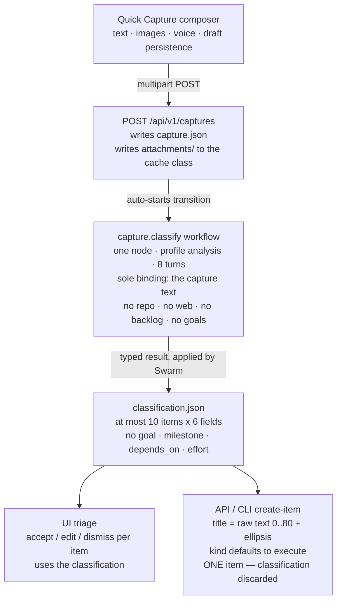
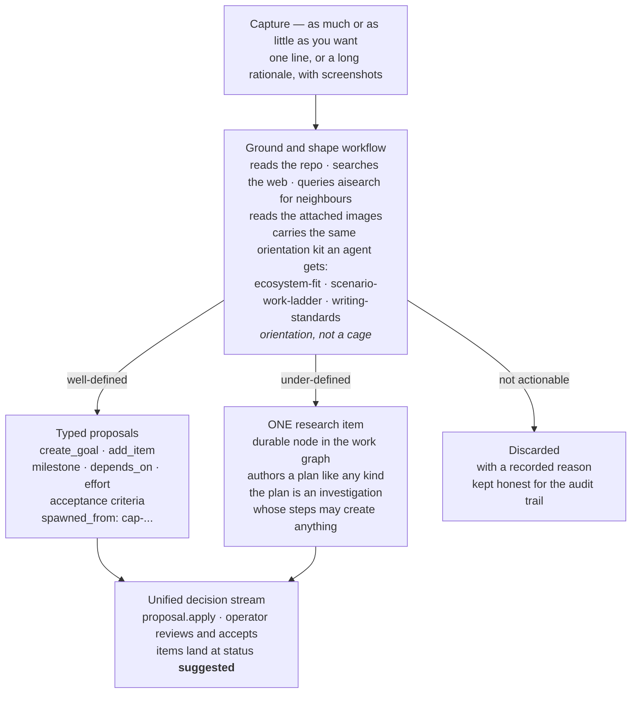
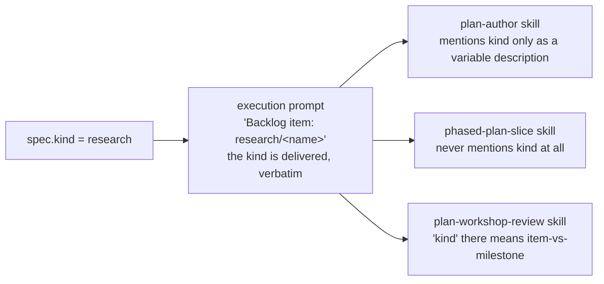

# Capture & Research Hardening — Design Record

> **This is the durable record of the design conversation that produced the capture/research
> hardening plan.** It is required reading for anyone executing that plan. A visually formatted
> version of the same content is at
> [`CAPTURE-INTAKE-DESIGN-RECORD.html`](./CAPTURE-INTAKE-DESIGN-RECORD.html) — open it in a browser
> for the diagrams as drawn; this markdown carries the same claims with Mermaid equivalents.

- **Scope**: capture · the `research` backlog kind · intake cleanup
- **Dated**: 2026-08-09
- **Basis**: code reading, the legacy-migration report, and the skill-authoring canon. Nothing here
  was verified by running the system. Line numbers reflect the working tree at time of writing and
  will drift — treat them as pointers, not as assertions.
- **Open questions**: none. All settled (§8).

---

## 1. The thesis

**Capture is a labeler, not a shaper. Its job should not be to be right — it should be to get a
thought onto a rail where being wrong is cheap to fix.**

Quick Capture has produced exactly one record in its lifetime: `cap-8ac5504b5d4509d2`,
`"hi. this is a test. no-op please"`, 2026-05-02, classified to zero items. That is the entire
corpus. The operator does not use the feature because it cannot do the work they would otherwise
do by hand.

Every piece of context an operator supplies manually today — why an idea matters, what it replaces,
how it fits the project — the classifier is *structurally prevented* from supplying. It receives one
binding (the capture text), gets eight turns, and is instructed not to look further. It cannot read
the repo, cannot search the web, cannot see attached screenshots, and cannot express a goal, a
milestone, or a dependency even if it inferred one.

---

## 2. Current state

**The transport spine is correct; everything feeding it is starved.** Immutable snapshot, entity
version guard, read-only workflow, consumer-owned mutation and idempotent apply are all sound and
must be preserved. Every failure is an input or an output: what the agent may see, what it may say,
and where its result is permitted to land.

Break points marked on the diagram, in order:

| Where | Defect |
| --- | --- |
| `attachments/` | Stored correctly, then handed to the agent as a **relative** path, in a workspace set to the project root, while the file lives in the cache storage class. Bindings are text-only, so there is no fallback. Every screenshot ever attached was stored and never seen. |
| classify workflow | `capture.Note` is excluded from the classification input **and** from the version hash, so annotating a capture and re-classifying changes nothing and does not even bump the version. |
| `classification.json` | Priority is capped at 1–5 while backlog priority is 1–10 with default 5, and the skill says use 3 when there is no urgency signal — so capture-born items systematically outrank hand-made ones. |
| the fork | Two triage paths of different fidelity. The headless path is strictly worse than typing the item by hand. |

---

## 3. Target state

**Capture stays an event; the entity types do the shaping.** Capture and research are kept separate
on purpose:

- A **capture** is a thought at 3pm — ephemeral, unnamed, deleted on triage, not a graph node.
- A **research item** is a durable graph node with a name, dependencies, goal-closure membership and
  an ETA.

Merging them would either turn every stray thought into a permanent node, or strip research of
everything that makes it useful.

---

## 4. Where this work sits in the operating model

`docs/concepts/TARGET-OPERATING-MODEL.md` is the normative mental model for this scenario, and it is
accurate. It names exactly two intake paths — capture and session — and its state machine already
contains the transition being built: `Captured --> Suggested: classify / shape workflow`. The word
*shape* is already in the document.

**Nothing in this effort invents a new flow.** Read from that lens, the whole effort is one row of
the document's transition table — *"Capture → suggestion / discard"* — brought up to the standard
every other row already meets.

The document itself needs three edits:

| Doc location | What it says today | Change needed |
| --- | --- | --- |
| § Intake, line 75 | "Quick Capture: observation → classification → suggested backlog work or discard" — two landings. | **Add the third landing.** An under-defined capture resolves to one research item, not to a guess or a discard. |
| § Intake, lines 79–82 | Sessions may propose milestones and items; captures produce "suggested backlog work" only. | **Grant capture the same reach.** A well-grounded capture may propose a goal or milestone, through the same proposal rail sessions use. |
| § Transition model, lines 185–187 | "Research, maintenance, and milestone work may have different deliverables, but must fit the same authority model." | **Narrow it.** Research uses the same plan deliverable as every other kind; only the thinking differs. The permissive wording invites the divergence being removed. |
| § Concepts, line 59 | Capture owns "raw input, attachments, classification state". | **No change.** Still exactly right. |

---

## 5. The research collapse

The `research` kind was once open-ended and produced its own artifact. It has since converged onto
`execute` in three independent places.

**The kind is delivered to every agent and interpreted by none.** That is the seam where research's
distinct thinking belongs, and it is skill-only — no code change.

The three collapses:

1. `backlog/kind_config.go:15-21` gives every kind only a directory name. The `Deliverable` field is
   empty for all five, with a comment routing every kind through `plan_ref`.
2. The two kind-specific skills that once branched are **orphaned**.
   `swarm-manager-initialize-research` ends with *"Do not create workshop rounds as an alternate
   lifecycle."* Its sibling `swarm-manager-initialize-backlog` — explicitly titled "non-research" —
   *does* create workshop rounds with decisions. **The exploratory kind is the one forbidden to
   explore.** Neither has run in a long time.
3. `execution/prompt_builder.go:155-161` — `deliverablePromptTag(kind string)` ignores `kind` and
   returns a constant; `missingDeliverableReason(kind, deliverablePath string)` ignores both
   arguments. Flattened branching that kept its parameters.

**The settled position: same lifecycle, same code, different thinking.** Research authors a plan and
executes it exactly like every other kind, acting through the swarm-manager CLI. What differs is only
how the plan is conceived: an investigation whose steps may produce backlog items, a goal, an answer,
something outside project management entirely, or nothing. No kind-specific code paths. Consequently
the two flattened helpers should have their dead parameters **deleted**, not re-branched.

---

## 6. Findings — 27 issues

### 6.1 Correctness (5) — bugs worth fixing whatever direction is taken

| ID | Issue | Where |
| --- | --- | --- |
| A1 | **Attachments are unreachable.** Stored correctly, then handed over as a relative path, in a project-root workspace, while the file lives in the cache class. Bindings are text-only. | `captures/create.go:102`; `captures/classify.go:81-90`; `agent-manager .../domain/workflow.go:147-150` |
| A2 | **The note never reaches the classifier.** Excluded from the input and from the version hash. | `captures/classify.go:86,185-193`; `captures/handler.go:246` |
| A3 | **The headless path discards the classification.** Title becomes raw text truncated to 80 chars; kind defaults to `execute`; one item regardless of suggestion count. | `captures/handler.go:278-350` |
| A4 | **No provenance back to the capture.** The adapter hardcodes priority 5 and never sets `spawned_from`. | `captures/adapters.go` |
| A5 | **Priority scale mismatch.** Schema 1–5 vs backlog 1–10 default 5; skill says use 3 with no signal. | `capture-classify.json`; `backlog/item_build.go:55` |

### 6.2 Capability (8) — what the target needs that does not exist

| ID | Issue | Where |
| --- | --- | --- |
| B1 | **Context-blind by construction.** One binding, eight turns, and a skill that says do not look further. The profile *does* grant read/glob/grep/shell — the cage is instruction and budget, not permission. | `capture-classify.json`; `analysis.json` |
| B2 | **Web access is actively denied.** `web_search`/`web_fetch` are canonical tool names and agent-manager's own investigation profile uses them, but no swarm-manager profile requests either — and the Claude and Grok runner codecs report `SupportsToolRestriction: true`, so the allowlist is enforced. | `profile.proto:81`; `agent-manager/.vrooli/agent-manager/investigation.json:10`; `codecs/claude.go:124`, `codecs/grok.go:128` |
| B3 | **Six output fields against a domain of ~25.** No dependencies, milestone, effort, acceptance criteria, or suggested skills — though the batch seam already accepts all of them atomically. | `captures/io.go:54-61`; `backlog/batch_handler.go:94` |
| B4 | **No agent path can propose a goal.** Not in the classification schema, and the proposal mutation vocabulary has no `create_goal` verb. The landing plumbing exists (`autofiler/filer.go:21-24` wires `goals.Create` + `AddTargets`); the verb does not. | `swarm-manager-proposals` skill |
| B5 | **No dedup or linking.** Semantic search over backlog/goals/records exists with a similarity service on top; classification queries neither. | `aisearch/models.go:17-19`; `related/aisearch.go` |
| B6 | **Captures are not indexed for similarity** — entity set is backlog, goal, record only. | `aisearch/models.go:17-19` |
| B7 | **No round two.** Always round one. No clarifying question, no re-classify with correction, no escalation. | `captures/io.go:76` |
| B8 | **Off the proposal rail.** Goal and plan workflows record proposals into the decision stream; capture writes a bespoke file and gets a bespoke triage widget. | `goals/transition_adapter.go`; `captures/classify.go:146-177` |

### 6.3 Research collapse and drift (7)

| ID | Issue | Where |
| --- | --- | --- |
| C1 | Research has no distinct behaviour; every kind gets only a directory name. | `backlog/kind_config.go:15-21` |
| C2 | The kind-branching skill inverts the intent — research is forbidden workshop rounds while other kinds create them. | `initialize-research` / `initialize-backlog` skills |
| C3 | Both initialize skills are orphaned — referenced nowhere but a foreign test fixture. | repo-wide |
| C4 | Flattened functions kept their parameters. | `execution/prompt_builder.go:155-161` |
| C5 | Dead research artifact path — the handoff builder reads a research summary file nothing writes. | `handoff/idea_package.go:161` |
| C6 | **The old `workshop` package is decommissioned** — superseded by Plan Workshop, with a migration that archives unaccepted legacy workshops. *This is what misled the design conversation.* | `planworkshop/migration.go:15-65` |
| C7 | **Kind is delivered to every agent and interpreted by none** — the seam where research's thinking belongs, and it is skill-only. | `execution/prompt_builder.go:32` |

### 6.4 Drift and dead code (7)

| ID | Issue |
| --- | --- |
| D1 | Prompt catalog advertises the dead `swarm-manager-classify-capture` skill with `{{CAPTURE_ID}}`/`{{CAPTURE_TEXT}}` variables and a `classification.json`-writing contract that was deliberately removed (`promptcatalog/catalog.go:61-71`). |
| D2 | `capture.asAttempt()` has a test-only caller; its comment claims parity with "every other agentic feature" that nothing consumes (`captures/io.go:66-77`). |
| D3 | Two triage paths of different fidelity; the API one is strictly degraded. |
| D4 | `planworkshop.Subject` hardcodes `backlog_item` despite "generic subject" framing (`planworkshop/types.go:17-31`). |
| D5 | Stale `app-issue-tracker` references remain after scenario removal (docs, `approved-dependencies.json:3483`). The scenario directory itself is already gone; `docs/director-swarm/strategy/ROADMAP.md:54` tracks `goal:swarm-manager-feature-parity` as the closing condition. |
| D6 | **Five orphaned skills still catalogued as live** — `initialize-backlog`, `initialize-research`, `classify-capture` have no caller; `backlog-tools` and `processing-guidance` are referenced only by those two, so they are transitively dead. |
| D7 | Vestigial `kind` parameters should be deleted, not re-branched (`execution/prompt_builder.go:155-161`). |

### 6.5 The clarification surface — a complete dead vertical

Nothing writes, routes, emits or renders it, yet it reads as a rich working feature from every angle.
**This is the single most misleading thing in the scenario.**

| Layer | Evidence |
| --- | --- |
| Go file I/O | `workshop/clarification.go` — `SaveClarification` has no non-test caller |
| Go events | `eventlog/emitter.go:349,357,366` — `EmitClarification{Started,Resolved,Action}` implemented, never called; interface duplicated at `backlog/handler.go:204-206` |
| HTTP | no route anywhere |
| UI types | `ui/src/types/workshop.ts` — `ClarificationMessage`/`ClarificationImpact` with no importer |
| UI store | `backlog-detail-ui-store.ts:8` comments "Follows the same pattern as clarification-store.ts" — that file does not exist |

---

## 7. Cleanup — full legacy retirement

### 7.1 The cutover already happened

The migration marker on this install is at
`~/.vrooli/data/vrooli/swarm-manager/plan-workshops/legacy-workshop-history-migration-v1.json`:

- version `v2`, completed **2026-07-22T06:23:07Z**
- **99** legacy workshops archived, all `archived_unaccepted`, backups written
- **1 error**: `fix/dtv-cli-validate-and-report/workshop/round-003.json` — "invalid JSON historical round"
- **110** source `workshop/` directories still on disk (the migration preserves sources as read-only
  evidence), so there is an 11-directory delta with no backup entry that must be checked

There is no reason to keep the legacy code alive. The retirement has **one ordering constraint**, not
a blocker: the idea handoff brief summarises workshop decisions into `brief.md`, which is fed to every
idea execution through `execution/prompt_builder.go:72-88`. Plan Workshop already stores the successor
data (`planworkshop.Response.Answers`, `Response.Accepted`), so the brief is re-sourced, not preserved.

### 7.2 Retirement order

| Step | Action | Why it sits here |
| --- | --- | --- |
| 1 | Resolve the single recorded migration error — one corrupt historical round under `fix/dtv-cli-validate-and-report`. | The only known unclean state. Everything after assumes the report is trustworthy. |
| 2 | Re-source the idea handoff brief from Plan Workshop responses instead of legacy rounds. | **The one true ordering constraint.** Until this lands, deleting the package breaks every idea execution prompt. |
| 3 | Delete the clarification vertical (§6.5): file I/O, the three uncalled emitters, the duplicated interface, the orphan UI types, the stale store comment. | Independent of everything else — nothing at any layer is live. |
| 4 | Delete the `workshop` package and its re-export shim in `backlog`. | Free once step 2 lands. |
| 5 | Remove the `workshop` and `clarifications` reset-artifact scopes — including the proposal-vocabulary entry and the UI union type. | A contract change across Go, the mutation vocabulary and TypeScript. Deliberate, not a drive-by. |
| 6 | Delete `MigrateLegacyHistory` and its boot-time call at `routes_plan_workshop.go:33`; decide the fate of the 110 source directories. | Last, because it is the thing that proves steps 1–5 were safe. |

---

## 8. Settled decisions

### 8.1 Entity model — capture and research stay separate; no third type

A new entity type would need graph nodes, board columns, decision cards, ETA modelling, goal closure,
dependency semantics, search indexing and a CLI surface — all of which backlog items already have.

### 8.2 Research — identical lifecycle, identical code

Research authors a plan and executes it like any other kind, acting through the swarm-manager CLI. The
difference lives entirely in how the plan is conceived. No kind-specific code paths.

### 8.3 Architecture — behaviour in skills and workflows, not hardcoded

Prior hardcoding made behaviour hard to evolve as better processes were found. The judgment layer must
stay editable without a code change.

**The line inside that rule:** *verbs* belong in code — typed contracts, result schemas, the mutation
vocabulary — so an agent *can* express an operation at all. *Judgment* belongs in skills: when to use
which verb. Adding `create_goal` widens the verb set; it does not hardcode behaviour.

### 8.4 Scope and tooling — grant web access; defer clutter control

The capture and research profiles get `web_search` and `web_fetch`, with the same orientation kit a
working agent receives. Auto-archive and clutter controls are **deliberately deferred** — revisit only
if clutter actually materialises.

### 8.5 How eager should capture be? → Always land at `suggested`

| Option | What it means | Verdict |
| --- | --- | --- |
| A | **Always propose.** Nothing exists until the operator accepts a proposal. | Rejected — adds a gate *before* the gate. Two review steps for one thought is the friction being removed. |
| B | **Always land at `suggested`.** Everything appears in the pre-commitment tier; archive is the undo. | **Chosen.** This *is* the documented design. |
| C | **Confidence-routed.** Land when confident, propose when not. | Rejected — the routing rule is a judgment call that will drift, and it produces two review surfaces for one object. |

**Why B.** `suggested` already exists as the not-yet-committed tier: the auto-filer files into it
(`autofiler/filer.go:122`), the next-action projection handles it (`backlog/next_action.go:139`), and
the operating model's state machine reads `Suggested --> Backlog: operator or policy accepts`. Landing
there is not skipping review — it moves review into the decision stream. Option A would invent a
second, earlier gate the model does not have.

*Consequence to watch:* `suggested` volume becomes the pressure gauge. No auto-archive, but the tier
must be visibly distinct and filterable so growth is observable rather than silent.

### 8.6 Does research participate in goal-closure maths? → No new status needed

Goal closure already distinguishes two terminal states (`goals/closure.go:8-21`): `completed` counts
as progress, and `dropped` *"resolves an item without achieving it"* — it satisfies dependents so
nothing stays blocked, but is counted separately and excluded from progress.

**So research needs no special maths and no new status.** A research item whose investigation
concludes work is warranted proposes that work and completes. One that concludes nothing is warranted
resolves as `dropped`, with the rationale recorded. Dependents unblock, progress stays honest, and the
whole distinction lives in one row of the plan-author outcome table — skill text, not code.

The orphaned `initialize-research` skill reached the same conclusion before it was abandoned: conclude
with an explicit resolution proposal when the evidence supports no action. **Carry that one line
forward out of the file being deleted.**

---

## 9. Skills — which prompts change, and against which rules

Every skill here is a **contract skill** — the prompt contract of a declared workflow node, rendered
verbatim into a headless run. `docs/agent-system/SKILL_AUTHORING.md` §"Contract skills" fixes their
structure precisely, so these are not stylistic edits. Two canon rules do most of the work, and the
current capture skill violates both.

**Shape from schema, choice from skill.** The node's `resultSpec.schema` is the single source of truth
for output shape, and the engine already renders it into the run prompt. A skill must not restate field
lists, enum values or required-ness — restated shape drifts. What the skill *must* own is the outcome
decision rules, as a work table keyed to observable end states. *The current capture skill's "Item
field rules" section restates the kind enum, priority, title, tags and confidence — every one already
in the schema.*

**Method by citation, never inlined.** When a run needs doctrine, the skill cites it
(`prompt-manager skill read <id>`) rather than inlining doctrine another skill owns. The canon
exemplar `swarm-manager-workflow-plan-author` is four short sections and delegates its entire method to
`implementation-plan-authoring`. *The current capture skill hand-rolls its own classification doctrine
instead of citing `ecosystem-fit` and `writing-standards`.*

| Skill | Action | What changes |
| --- | --- | --- |
| `swarm-manager-workflow-capture-classify` | **rewrite** | Becomes the ground-and-shape contract. Delete the schema-restating field rules. Add method-by-citation to `ecosystem-fit`, `scenario-work-ladder`, `writing-standards`. Rebuild the outcome work table around the three landings. Add variable-legend entries for the new bindings (grounding context, attachments, note). |
| `swarm-manager-workflow-plan-author` | **extend** | Add the kind-aware section — the seam where kind finally gets interpreted. A decision table stating what a plan means for each kind, with research as an investigation whose steps may create items, a goal, or nothing, and whose no-action terminal is `dropped`. |
| `swarm-manager-workflow-phased-plan-slice` | **extend** | Currently never mentions kind. Needs to know that executing a research plan legitimately means producing proposals rather than code. |
| `swarm-manager-proposals` | **extend** | Add the `create_goal` verb — the one thing blocking a capture from ever producing a goal. |
| `swarm-manager-initialize-research` | **delete** | Orphaned, and its central rule contradicts the design. Carry its step-4 resolution rule forward first (§8.6). |
| `swarm-manager-initialize-backlog` | **delete** | Orphaned. Its workshop-round bootstrap targets the legacy format being retired. |
| `swarm-manager-classify-capture` | **delete** | Superseded. Remove the prompt-catalog entry with it. |
| `swarm-manager-backlog-tools`, `swarm-manager-processing-guidance` | **fold & delete** | Transitively dead. Move still-true folder-structure and CLI content into the live skills that need it, then delete. |

### 9.1 Acceptance gate for every rewritten skill

Canon makes one check the primary gate for contract skills: **the divergence probe**. Two compliant
readings of the same end state must select the same outcome value. Probe specifically for end states
where an affirmative row is *arguably but not provably* satisfied — those must resolve to the
conservative outcome per SKILL_AUTHORING §"The conservative-branch default", and an unresolved
optimistic-versus-conservative split is a confirmed C4 defect.

For capture this is concrete and load-bearing: **when grounding is incomplete, the run must not guess a
goal.** It takes the conservative branch — one research item — and names the unproven predicate. That
single rule is what stops a hardened capture from confidently inventing structure it has not earned.

Validation also cross-checks the workflow declaration: every `{{.var}}` in the skill has a matching
node binding, every node binding is referenced or deliberately omitted, and the skill restates no part
of the node's `resultSpec` schema.

---

## 10. Corrections made during the investigation

Recorded rather than quietly edited, because each is a trap the codebase sets. A future reader will hit
the same ones.

| Claim | Correction |
| --- | --- |
| "Reuse the clarification threads" | **Retracted.** They look like a rich multi-turn conversation feature with attachments and impact grading. They are a decommissioned surface with no writer, no route and no renderer. The live seam is Plan Workshop and Agent Sessions. |
| "Make capture an auto-filer source" | **Retracted.** The auto-filer is a periodic scenario-health remediation filer. Everything is scenario-scoped, it sweeps on a timer, it takes a single source, and its reconciliation loop (`sweeper.go:264-300`) **archives any suggestion whose finding stops appearing**. A capture has no re-emitting source, so every capture-derived suggestion would be auto-archived on the next tick. |
| "Nothing bootstraps items any more" | **Corrected — overstated.** Only the *initialize* step is gone. Item and goal creation are well covered: capture triage, session batch apply, goal-discovery proposals, plan import, direct create, and the auto-filer. `TARGET-OPERATING-MODEL.md` is the normative map and it is accurate. |
| "Goals are unproducible" | **Narrowed.** The landing plumbing exists and is already wired into an intake path. What is missing is only the proposal *verb*. |
| "The legacy workshop path cannot be fully retired yet" | **Retracted.** Wrong conclusion from a missing file. The marker sits in the resolved data root and shows a completed `v2` cutover from 2026-07-22. The retirement is unblocked; it has one ordering constraint, not a blocker. |
