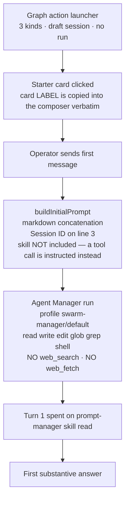
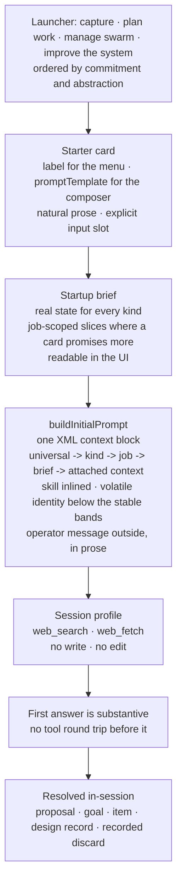

# Agent Session Architecture — Design Record

> **This is the durable record of the design conversation that produced the session prompting and
> skill rework.** It is required reading for anyone executing that work. It is the session-side
> sibling of [`CAPTURE-INTAKE-DESIGN-RECORD.md`](./CAPTURE-INTAKE-DESIGN-RECORD.md), and it applies
> that record's thesis to the conversational half of intake.

- **Scope**: agent sessions · session kinds · prompt construction · startup briefs · starter prompts
- **Dated**: 2026-08-11
- **Basis**: code reading during an operator design conversation. Nothing here was verified by
  running the system. Line numbers reflect the working tree at time of writing and will drift —
  treat them as pointers, not as assertions.
- **Open questions**: none material. Deferred items are listed in §9.

---

## 1. The thesis

**A session must automate something the operator actually does. Where it is thinner than the
conversation it replaces, it will not be used.**

This is the capture thesis, restated for the conversational path. The capture record put it as:
*"The operator does not use the feature because it cannot do the work they would otherwise do by
hand."* Sessions fail the same test for the same structural reason — **context-blind by
construction**, where the cage is instruction and budget rather than permission.

The operator's own account of the bottleneck, which is the reason this matters now:

1. Executing a plan across many turns was the bottleneck. The **goal** feature removed it.
2. Producing a good plan was then the bottleneck. Plan quality removed it.
3. **The bottleneck is now the investigation and brainstorming that precedes a plan** — deciding
   what should exist, why it matters, and where it fits. That work is still done entirely by the
   operator, in conversations like the one that produced this document.

Sessions are the surface that must absorb step 3. Today they do not.

---

## 2. What a session is, and the line it must not cross

An Agent Session is a durable operator-led conversation backed by an Agent Manager run. The
governing boundary in `docs/concepts/TARGET-OPERATING-MODEL.md` §"The boundary" is unchanged and
correct: a human composing prompts and reading replies is a Session; code assembling input and
consuming a typed result is a declared workflow.

This conversation added one invariant that was not previously written down.

### Invariant: in-session resolution

**A session's outcome must be reachable inside the session. A session must not resolve by handing
its result to an autonomous agent's inbox for a later heartbeat.**

This is the line between prompt-manager's teams and swarm-manager's sessions. The teams are
autonomous and deferred by design — a heartbeat picks up queued work later. Sessions are
collaborative and immediate: the operator is present, and the point of their presence is that the
thing gets resolved now, whether that resolution is a backlog item, a goal, a system improvement, or
a recorded discard.

**Consequence.** A session may *read* any corpus that helps it answer. It must not *route* its
conclusion into a queue that only an autonomous loop drains. This settled the question of whether
the improve-the-system kind should reach into the `meta-optimization` team's friction inbox:
reading is permissible in principle, routing is not, and reading alone did not justify the
cross-scenario dependency in this pass.

---

## 3. The three kinds, and the axis that separates them

The three launcher kinds are conceptually correct and stay. What was missing was the axis that
makes them a type distinction rather than a menu.

| Launcher | Operates on | Subject |
|---|---|---|
| Plan Work With Agent | The work ledger — **grows** it | The product |
| Manage Swarm | The work ledger — **moves** it | The product |
| **Improve the System** (was *Author Workflow*) | The machine that operates the ledger | **The system itself** |

Two kinds are object-level; the third is meta-level. That is why `kind` remains the correct backend
fan-out point: it is exactly the field that selects skill, startup brief, allowed context types, and
agent profile, and all four genuinely differ across this split.

### 3.1 The boundary test between Plan Work and Improve the System

> If the change is about **how the operator and agents work together**, it is meta.
> If the change is about **what the tool does for its users**, it is plan-work.

Write this test into both skills. It is checkable, and it resolves the cases that sit on the line —
"improve the swarm-manager dashboard" is plan-work; "improve how sessions are prompted" is meta.

### 3.2 Why `workflow_authoring` was the wrong name

The name is a proper subset of the concept, and the skill enforces the subset: it scopes itself to
classifying a working method and producing a transition or workflow declaration.

The conversation that produced this record is the counterexample. Its findings covered a Go prompt
builder, a React chip-tray render path, an agent profile allowlist, and startup-brief content. None
of that is a workflow. Under the current framing the skill would have fought the conversation.

The existing launcher subtext already contains the real scope, buried in its back half: *"…or a
Swarm improvement proposal."* That is the headline.

### 3.3 The meta kind already has a landing place and an autonomous sibling

Two facts that were confirmed during the conversation and that shape the design:

- **Landing place exists.** `swarm-manager-meta-optimizer`, `swarm-manager-quality-gates`,
  `swarm-manager-feature-parity`, `swarm-manager-dashboard`, and `swarm-manager-graph-workspace`
  are live goals. Meta work already lands on the normal proposal rail as backlog items under Swarm
  Manager's own goals. **The meta kind needs different input, not a different output type.**
- **An autonomous sibling exists.** prompt-manager runs a `meta-optimization` team — seven members
  (run-introspector, skill-optimizer, team-agent-optimizer, toolchain-validator, debt-curator,
  contrarian, friction-curator), `decisionMode: approval`, *"proposes only — never implements."*
  The improve-the-system session is that team's **conversational counterpart**: same job, operator-
  initiated instead of heartbeat-initiated, resolved in-session per §2.

This is the same resolution the capture record reached for the `research` kind: **same lifecycle,
same code, different thinking.** All three session kinds propose onto one rail. What differs is what
the agent reads before it thinks.

---

## 4. Current state



Four independent defects compound into the experience the operator reports as *"I have never used
the session feature and liked either what it finds or how it talks to me."*

### 4.1 The starter card label is the prompt

`SessionConversation.tsx:480` calls `onChooseText(suggestion.text)`. The same string rendered as the
menu label at line 494 is the text dropped into the composer.

**One string is doing two incompatible jobs.** A menu label must be terse and scannable. A prompt
must state the situation, state the intent, name the output shape wanted, and leave a marked slot
for the operator's material. No single sentence does both, so the prompt is always the loser.

Concretely: *"Turn this idea into goals and backlog items."* is a good label and an unusable prompt.
Sent as-is there is no idea attached, and nothing in the composer indicates that the operator is
expected to supply one.

### 4.2 The prompt is unstructured and destroys its own cache prefix

`api/internal/agentsessions/service_prompts.go` is markdown concatenation: a numbered context list
with raw JSON inlined as `Metadata: {…}`, no XML, no volatility banding.

Two specific faults:

| Fault | Effect |
|---|---|
| `Session ID: <sess_…>` is emitted third, above every stable instruction | The cacheable prefix collapses at roughly byte 40 of every session ever started. |
| The skill is **not in the prompt**; the agent is told to run `prompt-manager skill read <skill>` | The largest and most stable block can never be part of a cached prefix, turn one is spent on a tool round trip instead of an answer, and the methodology's arrival is contingent on the agent complying. |

**The solved reference is in-repo.** `prompt-manager/api/heartbeat/prompt_builder.go:63-86` already
does this correctly: one `<context>` wrapper around reference material, the task deliberately
outside it in prose, and sections emitted on a strict volatility gradient. The rule is stated at
`prompt_templates.go:5-11`:

> *"If a run-volatile section moves above a stable section, the first differing byte moves up with
> it and the cacheable prefix collapses. Volatility outranks scope when the two conflict."*

Its scope ladder is `universal → team → member → volatile → task`, with a section registry
(`prompt_templates.go:61-82`) that prevents an untracked section from being introduced.

### 4.3 The startup brief is unreadable, and one kind's brief is empty

**Unreadable.** `SessionDetailsPage.tsx:100-104` fetches the full brief — summary and metadata —
into the browser. `session-context-refs.ts:101-108` then builds the chip from the title and
timestamp only, discarding both. `ContextChipTray.tsx:92-104` renders type, title, subtitle, and
ref. The "Open details" action resolves through `nodeId`, which for a startup brief is hardcoded to
`/operations`, `/sessions`, or `/goals` — routes with no relation to the brief.

The button works. It navigates somewhere useless. **The data is in memory, unrendered.** This is a
render gap, not a data gap, and it means the single largest determinant of first-answer quality is
unauditable from the UI.

**Empty.** The three briefs are of very uneven quality:

| Kind | Brief | Quality |
|---|---|---|
| `swarm_operations` | Live operations briefing + ranked-goal snapshot + drill-downs, 120s freshness | Good |
| `meta_orchestration` | Portfolio rollup: goal/backlog status counts, top goals, high-priority candidates, 600s | Adequate |
| `workflow_authoring` | A hardcoded prose string and two shell commands (`sed` the operating model, `cat` the registry), 1800s | **Contains no state at all** |

`startup_brief.go:266-285` is the whole of the third brief. The kind the operator happened to open
is the one that starts from nothing and tells the agent to go read files — the capture classifier's
disease in a different costume.

### 4.4 The session profile is the generic execute profile

`.vrooli/agent-manager/default.json`, key `swarm-manager/default`, described as *"research and
execution"*:

```json
"allowedTools": ["read", "write", "edit", "glob", "grep", "shell"]
```

- **No `web_search`, no `web_fetch`.** This is the capture record's B2 defect, unfixed for sessions.
  A conversation whose job is helping decide what to build cannot look at the outside world.
- **`write` and `edit` are granted.** Propose-never-apply — the invariant the whole session contract
  rests on — is enforced only by instruction, not by capability.

### 4.5 The job has no channel of its own

`kind` fans out to four mechanisms. The **job** (the starter card) fans out to exactly one: composer
text. Everything that distinguishes *"turn this idea into goals"* from *"find the stalest work and
walk me through it"* must fit in a single sentence, because there is no other channel for it.

**This is the structural cause of §4.1, not a separate problem.** The prompts are thin because
architecturally there is nowhere else for job-specific context to go.

---

## 5. Target state



The transport spine — draft session, explicit start, typed context resolution, proposal rail,
operator apply, artifact links, verified attribution — is **correct and must be preserved**. As with
capture, every defect is an input or an output: what the agent may see, what it may say, and how it
is asked.

---

## 6. What the improve-the-system kind must carry

The conversation that produced this record is the acceptance test for the third kind. The
load-bearing reads were:

| Read | Why it mattered |
|---|---|
| `service_prompts.go` | The actual prompt construction |
| `startup_brief.go` | What each brief carries |
| `ContextChipTray.tsx` + `SessionDetailsPage.tsx` | Why the details action does nothing |
| `.vrooli/agent-manager/default.json` | The missing web tools and the surplus write grant |
| **`prompt-manager/api/heartbeat/prompt_builder.go` + `prompt_templates.go`** | **A solved instance of the same problem, in a different scenario** |
| **`CAPTURE-INTAKE-DESIGN-RECORD.md`** | **The prior conversation of exactly this type** |

The last two are the ones the current design could never have surfaced, and they imply two
capabilities:

1. **Cross-scenario recall.** The most valuable find was a solved instance of the same problem
   elsewhere in the repo. A brief consisting of two shell commands against swarm-manager's own files
   cannot produce that. This kind needs semantic recall across records, skills, and design records —
   `search-hub` / aisearch — and its brief should be the **widest** of the three, not the emptiest.
2. **Design records as its output artifact.** The capture record proves the loop already works
   informally: it came out of a conversation of this type and is now required reading for the plan
   that executes it. This document is the second instance. The kind should both consume prior design
   records and emit new ones, alongside the normal proposal rail.

---

## 7. Settled decisions

### 7.1 Three kinds stay; the axis is object-level versus meta-level

Rejected: collapsing improve-the-system into plan-work. The output rail is shared but the subject,
the required context, and the thinking differ. `kind` is the field that selects skill, brief,
context types, and profile — the fan-out is the reason the distinction is load-bearing.

### 7.2 In-session resolution is an invariant

See §2. A session must not resolve by queueing to an autonomous inbox. This is the durable
difference between prompt-manager teams and swarm-manager sessions.

### 7.3 Rename presentation and doctrine now; defer the wire-value migration

`workflow_authoring` remains the persisted enum value. The display label, the skill, and the
doctrine change to improve-the-system in this pass. Renaming a stored kind is a migration across
proto contracts, stats aggregation, stored `session.json` files, and TypeScript unions, and it buys
nothing this pass. Precedent: `operating_mode_authoring` was retired by making it non-creatable
while remaining readable for attribution.

### 7.4 Behaviour in skills; verbs in code

Carried unchanged from the capture record §8.3. *Verbs* — typed contracts, result schemas, the
mutation vocabulary, the prompt **section registry** — belong in code so an agent can express an
operation at all. *Judgment* — which verb, when, and why — belongs in skills, editable without a
code change.

Applied here: the section kinds and their volatility scopes are code; what each session kind should
read and recommend is skill text.

### 7.5 Prompt structure follows the heartbeat model

Do not invent a second prompt architecture. Adopt `prompt-manager/api/heartbeat`'s proven shape:
one XML context block, a section registry with declared volatility scope, stable bands contiguous
and first, the task outside the context block in natural prose.

### 7.6 Skills carry the methodology; the brief carries only state

The division of labour is unchanged: skill = procedure, brief = current state.

**Inlining the skill is deferred, as a decision rather than an oversight.** The intent was to inline
the skill text so the largest stable block joins the cached prefix and turn one is not spent on a
tool round trip. Execution found no seam for it: `promptcatalog` carries skill *metadata* only, and
`SessionSpawnRequest` passes a raw prompt string with no `promptRef` — sessions are raw runs by
design, so they bypass the workflow declaration system that would otherwise resolve a prompt
reference. Inlining therefore requires a new Prompt Manager content client, which makes Prompt
Manager a hard dependency of session start. That tradeoff — a wasted first turn against a new
failure mode that blocks every conversation — is the operator's call, not a drive-by.

The structural fix landed without it. Two sessions of one kind now share ~94% of the initial prompt,
up from roughly forty bytes.

### 7.7 The propose-only profile is a narrowing, not a boundary

Sessions moved onto their own `swarm-manager/session` profile: web research granted, `write` and
`edit` withheld. This makes propose-never-apply cost more than ignoring an instruction.

It is not a hard boundary. `shell` is required — sessions run the `swarm-manager`, `prompt-manager`,
and `search-hub` CLIs — and a shell can write files. A true capability boundary needs shell command
restriction, which is a separate design question with its own blast radius. Claiming the invariant is
capability-enforced would be false; claiming instruction is the only guard is now also false.

---

## 8. Work order

| # | Step | Touches |
|---|---|---|
| 0 | **This design record** | `docs/internal/SESSION-ARCHITECTURE-DESIGN-RECORD.md` |
| 1 | **Skills** — rescope workflow-authoring to improve-the-system; rewrite all three against `skill-authoring-meta` and `writing-standards`; check `swarm-manager-proposals` for consistency | `prompt-manager/store/skills/packs/core/swarm-manager-*` |
| 2 | **Prompt builder** — XML context block, section registry, volatility gradient, volatile identity demoted, skill inlined | `api/internal/agentsessions/service_prompts.go` |
| 3 | **Startup briefs** — build a real improve-the-system brief; job-scoped slices where a card promises more than the kind brief carries | `api/internal/sessioncontext/startup_brief.go` |
| 4 | **Starter prompt templates** — split `text` into `label` + `promptTemplate`; natural prose with an explicit input slot; all three kinds plus the proposal lenses | `ui/src/components/session/session-starter-suggestions.ts` |
| 5 | **Profile** — grant `web_search`/`web_fetch`; a session profile without `write`/`edit` | `.vrooli/agent-manager/` |
| 6 | **Docs** — kinds, naming, prompt architecture, in-session resolution; the object/meta axis in the session-kind table | `docs/internal/AGENT-SESSIONS.md`, `docs/concepts/TARGET-OPERATING-MODEL.md` |
| 7 | **Launcher copy and icons** — "Improve the System"; subject-first descriptions; a distinct icon (two of three entries rendered the same glyph); the sheet no longer names itself after its first child | `ui/src/components/session/session-view-model.ts`, `GraphActionLauncher.tsx` |
| 8 | **Brief legibility** — the resolved `summary` now rides on the chip and renders in its popover; the improve-the-system brief no longer offers a drill-down that navigates away from the session | `session-context-refs.ts`, `ContextChipTray.tsx`, `SessionDetailsPage.tsx` |
| 9 | **Prompt preview** — server-owned assembly exposed over API, CLI, and a composer panel, with a test asserting the preview is byte-identical to what is spawned | `agent_session.proto`, `service_prompts.go`, `handler.go`, `cli/cmd_agent_sessions.go`, `SessionPromptPreview.tsx` |

---

## 9. Deferred

Deliberately out of scope for this pass, in rough priority order:

| Item | Why deferred |
|---|---|
| **Job-scoped brief slices** | Cards promise things the kind brief does not carry (a staleness snapshot, a run's terminal reason). The agent still fetches those itself. |
| **Inlining the skill into the prompt** | §7.6 — needs a Prompt Manager content client and an explicit decision about making it a hard dependency of session start. The operator's preferred shape is **auto-resolving skill variables**: prompt-manager already substitutes `{{VAR}}` (`api/skills/variables.go`), but values are caller-supplied only. A variable that resolves to another skill's content would make a skill *part of* a prompt rather than something an agent is asked to read, and would put the capability where the content already lives. Note `variableRegex` currently admits only `[A-Z][A-Z0-9_]*`, so a `{{SKILL:<id>}}` form needs a pattern change as well as a resolver. |
| **Shell command restriction** | §7.7 — the remaining gap between a narrowed profile and a real propose-only capability boundary. |
| **`workflow_authoring` wire-value migration** | §7.3. |
| **Job-level skill selection** | The job currently shares its kind's skill. Revisit only if job-scoped briefs and prompt templates prove insufficient. |

### 9.1 Pre-existing failures found in passing, not caused by this work

| Test | Defect |
|---|---|
| `pending-session-context.test.ts` — compatible kinds | Asserted a context-type policy the shared config no longer implements: `scenario` and `session` are both attachable to `workflow_authoring`. Assertion corrected to match the config, which is the policy. |
| `session-starter-suggestions.test.ts` — "drops cards that require a different context type" | Expected two ids for a goal while the code has always also returned the six proposal lenses. |
| `EntityAttachToSessionSheet.test.tsx` — "five mutation lenses" | Expected five cards; the goal branch has always also pushed the lifecycle staleness card, making six. |

Ten further UI test failures exist in the working tree across `run-sheet`, `PromptsPage`,
`member-item-strategy`, `ScenarioNavigatorPopover`, `CreateWorkFromPlanDialog`,
`PcmVoiceStreamProvider`, `GraphNode`, `NodeInspectorPanel`, and `SidebarTabs`. None import the
modules changed here. They are out of scope for this pass and are recorded so they are not
misattributed to it.
