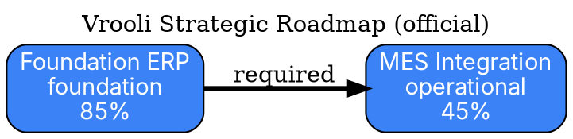

# Graph Export Feature Documentation

## Overview

The Tech Tree Designer now includes comprehensive export functionality, allowing users to download or copy the tech tree graph in multiple formats for sharing, documentation, or analysis with external tools and LLMs.

## User Interface

### Export Button Location

The export feature is accessible via the **Export** button in the graph controls toolbar, located in the upper-right section of the graph view alongside the fullscreen and edit mode buttons.

### Export Menu Options

Click the **Export** button to reveal a dropdown menu with the following options:

1. **Download DOT (Graphviz)** - Graph visualization format
2. **Download JSON** - Structured data format
3. **Download Text** - Human-readable markdown format
4. **Copy as Text** - Copy to clipboard for pasting

## Export Formats

### 1. DOT (Graphviz) Format

**Purpose**: Visualize the tech tree using Graphviz tools

**File Extension**: `.dot`

**Use Cases**:
- Generate visual diagrams with Graphviz
- Import into graph visualization tools
- Create high-quality PDF/PNG renders
- Document system architecture

**Example Output**:


**How to Use**:
```bash
# Install Graphviz
sudo apt-get install graphviz  # Linux
brew install graphviz          # macOS

# Generate PNG
dot -Tpng tech-tree.dot -o tech-tree.png

# Generate SVG
dot -Tsvg tech-tree.dot -o tech-tree.svg

# Generate PDF
dot -Tpdf tech-tree.dot -o tech-tree.pdf
```

---

### 2. JSON Format

**Purpose**: Programmatic analysis and data processing

**File Extension**: `.json`

**Use Cases**:
- Import into custom analysis tools
- Feed into machine learning models
- Process with scripts (Python, Node.js, etc.)
- Archive snapshots for version control

**Example Output**:
```json
{
  "tree_id": "tree-uuid",
  "sectors": [
    {
      "id": "sector-uuid",
      "name": "Manufacturing",
      "category": "manufacturing",
      "progress_percentage": 35.2,
      "stages": [
        {
          "id": "stage-uuid",
          "name": "Foundation ERP",
          "stage_type": "foundation",
          "progress_percentage": 85.0,
          "scenario_mappings": [
            {
              "scenario_name": "production-planner",
              "completion_status": "completed"
            }
          ]
        }
      ]
    }
  ],
  "dependencies": [
    {
      "dependency": {
        "dependent_stage_id": "def-456",
        "prerequisite_stage_id": "abc-123",
        "dependency_type": "required",
        "dependency_strength": 1.0
      },
      "dependent_name": "MES Integration",
      "prerequisite_name": "Foundation ERP"
    }
  ],
  "exported_at": "2025-11-16T10:30:00.000Z"
}
```

---

### 3. Text (Markdown) Format

**Purpose**: Human-readable documentation and sharing

**File Extension**: `.txt`

**Use Cases**:
- Share via email or chat
- Paste into documentation
- Present in meetings
- Archive as plain text

**Example Output**:
```markdown
# Tech Tree Export
Generated: 2025-11-16T10:30:00.000Z

## Sector: Manufacturing
Category: manufacturing
Progress: 35.2%

### Stages:
- Foundation ERP (foundation, 85.0%)
  Core manufacturing data management system
  Linked scenarios:
    - production-planner (completed)
    - inventory-optimizer (in_progress)

- MES Integration (operational, 45.0%)
  Real-time shop floor monitoring and control
  Linked scenarios:
    - shop-floor-monitor (in_progress)

## Dependencies
- Prerequisite: Foundation ERP
  Dependent: MES Integration
  Type: required, Strength: 1.00
  MES requires stable ERP foundation for data consistency
```

---

### 4. Copy to Clipboard

**Purpose**: Quick sharing without file downloads

**Use Cases**:
- Paste directly into ChatGPT/Claude conversations
- Share in Slack/Discord/Teams messages
- Quick documentation in emails
- Rapid context sharing with teammates

**How It Works**:
1. Click **Export** button
2. Select **Copy as Text**
3. Button shows "Copied!" confirmation
4. Paste anywhere with Ctrl+V / Cmd+V

The clipboard format is identical to the Text/Markdown export format.

---

## Technical Implementation

### Frontend Components

**New Hook**: `useGraphExport.ts`
- Manages export state (loading, errors)
- Handles file downloads
- Manages clipboard operations
- Generates text format from graph data

**Updated Component**: `GraphControls.tsx`
- Added export button with dropdown menu
- Integrated export hook
- Visual feedback (loading, success states)

**New Service Functions**: `techTree.ts`
- `exportGraphDOT(treeId)` - Fetches DOT format from backend
- `exportGraphJSON(treeId)` - Assembles JSON from existing data

### Backend Endpoints

**Existing**: `GET /api/v1/tech-tree/graph/dot`
- Generates Graphviz DOT format
- Includes node styling and colors
- Called by frontend export function

**New**: `GET /api/v1/graph/export/view`
- Flexible export endpoint for agents
- Supports text and JSON formats
- Can export full tree or neighborhood
- See [GRAPH_QUERIES.md](./GRAPH_QUERIES.md) for details

---

## User Workflows

### Workflow 1: Share with External Team

**Goal**: Send tech tree to stakeholders who don't have system access

**Steps**:
1. Open Tech Tree Designer
2. Navigate to desired tree (switch trees if needed)
3. Click **Export** → **Download Text**
4. Attach `.txt` file to email
5. Recipients can view in any text editor

**Alternative**: Use **Copy as Text** and paste directly into email body

---

### Workflow 2: Generate Visual Diagram

**Goal**: Create high-quality visualization for presentation

**Steps**:
1. Click **Export** → **Download DOT (Graphviz)**
2. Save `.dot` file
3. Process with Graphviz:
   ```bash
   dot -Tpng tech-tree-2025-11-16.dot -o tech-tree.png
   ```
4. Import PNG into presentation slides

**Pro Tip**: Use SVG format for scalable graphics:
```bash
dot -Tsvg tech-tree.dot -o tech-tree.svg
```

---

### Workflow 3: Analyze with Python

**Goal**: Perform custom analysis on tech tree data

**Steps**:
1. Click **Export** → **Download JSON**
2. Save `.json` file
3. Load in Python script:

```python
import json

with open('tech-tree-2025-11-16.json', 'r') as f:
    data = json.load(f)

sectors = data['sectors']
dependencies = data['dependencies']

# Analysis example: Find stages with low progress
for sector in sectors:
    for stage in sector['stages']:
        if stage['progress_percentage'] < 20:
            print(f"⚠️  {stage['name']}: {stage['progress_percentage']}%")
```

---

### Workflow 4: Discuss with AI Assistant

**Goal**: Get strategic advice from ChatGPT/Claude about tech tree

**Steps**:
1. Navigate to area of interest in graph
2. Click **Export** → **Copy as Text**
3. Open ChatGPT/Claude
4. Paste and add prompt:
   ```
   Here's my tech tree for manufacturing automation:

   [paste exported text]

   What are the critical bottlenecks I should focus on?
   Which scenarios should we prioritize next?
   ```

**Pro Tip**: Use the neighborhood export API for focused context:
```bash
curl "http://localhost:8020/api/v1/graph/export/view?format=text&stage_id=<id>&depth=2" | pbcopy
```

---

### Workflow 5: Version Control Snapshots

**Goal**: Track tech tree evolution over time

**Steps**:
1. Export as JSON monthly/quarterly
2. Commit to git repository:
   ```bash
   mkdir -p snapshots
   cp tech-tree-2025-11-16.json snapshots/
   git add snapshots/tech-tree-2025-11-16.json
   git commit -m "Tech tree snapshot: Nov 2025"
   ```
3. Compare versions:
   ```bash
   diff snapshots/tech-tree-2025-08-01.json snapshots/tech-tree-2025-11-16.json
   ```

---

## File Naming Convention

All exported files follow this pattern:
```
tech-tree-YYYY-MM-DDTHH-MM-SS.<ext>
```

**Examples**:
- `tech-tree-2025-11-16T10-30-15.dot`
- `tech-tree-2025-11-16T10-30-15.json`
- `tech-tree-2025-11-16T10-30-15.txt`

**Rationale**:
- ISO 8601 timestamps for unambiguous ordering
- Colons replaced with hyphens for filesystem compatibility
- Milliseconds omitted for readability
- Automatic naming prevents accidental overwrites

---

## Troubleshooting

### Issue: Export button disabled

**Cause**: Graph data not loaded yet

**Solution**: Wait for graph to finish loading

---

### Issue: Downloaded file is empty

**Possible Causes**:
1. No stages in current tree
2. Network error during download
3. Browser blocking download

**Solutions**:
1. Verify tree has data in UI
2. Check browser console for errors
3. Try different export format
4. Check browser download settings

---

### Issue: Text export is truncated

**Cause**: Extremely large trees (>1000 stages)

**Solutions**:
1. Export as JSON and process programmatically
2. Use API to export specific neighborhood
3. Split into multiple smaller trees

---

### Issue: Graphviz DOT file won't render

**Common Errors**:

**Error**: `syntax error in line N near '-'`
**Cause**: Special characters in stage names
**Solution**: This should be auto-escaped by backend. Report as bug if encountered.

**Error**: `node 'abc-123' not found`
**Cause**: Circular reference or malformed dependency
**Solution**: Report as bug - backend should validate graph structure.

---

## Advanced Usage

### Custom Graphviz Styling

Edit the downloaded `.dot` file to customize appearance:

```dot
digraph TechTree {
  # Change layout direction
  rankdir=TB;  /* Top to bottom instead of left-to-right */

  # Custom node styling
  node [shape=ellipse, style="filled", fillcolor="#FF6B6B"];

  # Custom edge styling
  edge [color="#4ECDC4", penwidth=2.0];

  # ... rest of graph ...
}
```

### Programmatic Export via API

```bash
# Export full tree as DOT
curl "http://localhost:8020/api/v1/tech-tree/graph/dot" > tree.dot

# Export neighborhood as JSON
curl "http://localhost:8020/api/v1/graph/export/view?format=json&stage_id=abc-123&depth=2" > neighborhood.json

# Export for LLM
curl "http://localhost:8020/api/v1/graph/export/view?format=text" > tree.txt
```

---

## Future Enhancements

Planned improvements:
- **Mermaid format**: For GitHub-native rendering
- **CSV export**: For spreadsheet analysis
- **SVG direct export**: Skip Graphviz step
- **Viewport export**: Export only visible portion
- **Filtered export**: Export specific sectors only
- **Comparison export**: Diff two tree versions
