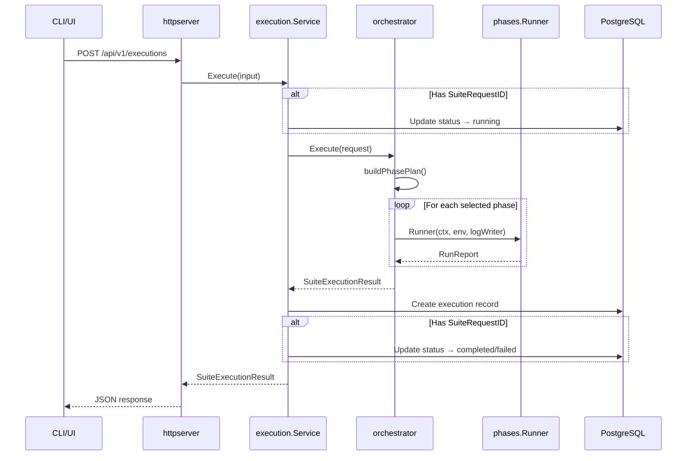

# Test Genie API

Go-based REST API that orchestrates test suite execution across Vrooli scenarios. The API receives execution requests, plans which phases to run, executes them in sequence, and persists results for historical analysis.

## Architecture

```mermaid
flowchart TB
    subgraph Entry["cmd/test-genie-api"]
        main["main.go"]
    end

    subgraph App["internal/app"]
        app["app.go"]
        subgraph Runtime["runtime/"]
            config["config.go"]
            bootstrap["bootstrap.go"]
            database["database.go"]
        end
        subgraph HTTP["httpserver/"]
            server["server.go"]
            exec_h["execution_handlers"]
            suite_h["suite_handlers"]
            scenario_h["scenario_handlers"]
            phase_h["phase_handlers"]
            health_h["health_handlers"]
        end
    end

    subgraph Orchestrator["internal/orchestrator"]
        suite_exec["suite_execution.go"]
        phase_plan["phase_plan.go"]
        subgraph Phases["phases/"]
            catalog["catalog.go"]
            types["types.go"]
            p_structure["phase_structure"]
            p_deps["phase_dependencies"]
            p_unit["phase_unit"]
            p_int["phase_integration"]
            p_playbooks["phase_playbooks"]
            p_business["phase_business"]
            p_perf["phase_performance"]
        end
        subgraph Workspace["workspace/"]
            ws["workspace.go"]
            testing_cfg["testing_config.go"]
            manifest["manifest_loader.go"]
        end
        subgraph Requirements["requirements/"]
            syncer["requirements_syncer.go"]
        end
    end

    subgraph Execution["internal/execution"]
        exec_svc["service.go"]
        exec_repo["repository.go"]
        history["history.go"]
        record["record.go"]
    end

    subgraph Queue["internal/queue"]
        request["request.go"]
        q_repo["repository.go"]
    end

    subgraph Scenarios["internal/scenarios"]
        scenario_svc["scenario_directory_service"]
        scenario_repo["scenario_directory_repository"]
        lister["scenario_lister"]
    end

    main --> app
    app --> config
    app --> bootstrap
    bootstrap --> database
    bootstrap --> suite_exec
    bootstrap --> exec_svc
    bootstrap --> request

    server --> exec_h
    server --> suite_h
    server --> scenario_h
    server --> phase_h
    server --> health_h

    exec_h --> exec_svc
    exec_svc --> suite_exec
    exec_svc --> exec_repo
    exec_svc --> request

    suite_exec --> phase_plan
    suite_exec --> catalog
    phase_plan --> ws
    phase_plan --> testing_cfg

    catalog --> p_structure
    catalog --> p_deps
    catalog --> p_unit
    catalog --> p_int
    catalog --> p_playbooks
    catalog --> p_business
    catalog --> p_perf

    suite_h --> request
    scenario_h --> scenario_svc
    scenario_svc --> scenario_repo
    scenario_svc --> lister

    exec_h --> history
    history --> exec_repo
```



## Directory Structure

```
api/
├── cmd/test-genie-api/
│   └── main.go                 # Entry point (lifecycle-managed)
│
├── internal/
│   ├── app/
│   │   ├── app.go              # Wires config → deps → HTTP server
│   │   ├── httpserver/         # HTTP transport layer
│   │   │   └── README.md       # Handler patterns & endpoints
│   │   └── runtime/            # Configuration & bootstrap
│   │       ├── config.go       # Environment variable parsing
│   │       ├── bootstrap.go    # Dependency injection
│   │       └── database.go     # Schema migrations
│   │
│   ├── orchestrator/           # Core business logic
│   │   ├── README.md           # Suite execution & phase planning
│   │   ├── suite_execution.go  # Main orchestration engine
│   │   ├── phase_plan.go       # Phase selection & ordering
│   │   ├── phases/             # Phase implementations
│   │   │   └── README.md       # Phase catalog & contracts
│   │   ├── workspace/          # Scenario filesystem discovery
│   │   └── requirements/       # Test→requirement syncing
│   │
│   ├── execution/              # Execution state & history
│   │   ├── README.md           # State machine & persistence
│   │   ├── service.go          # Execution coordinator
│   │   ├── repository.go       # Database persistence
│   │   ├── history.go          # Read-only history access
│   │   └── record.go           # Execution record type
│   │
│   ├── queue/                  # Suite request queue
│   │   ├── request.go          # Queue service & validation
│   │   └── repository.go       # PostgreSQL persistence
│   │
│   ├── scenarios/              # Scenario discovery
│   │   ├── scenario_directory_service.go
│   │   ├── scenario_directory_repository.go
│   │   └── scenario_lister.go
│   │
│   └── shared/                 # Cross-cutting utilities
│       └── validation.go       # Input validation helpers
│
├── go.mod
└── go.sum
```

## Request Flow



## Building & Running

The API **must** run through the Vrooli lifecycle system:

```bash
# From repository root
cd scenarios/test-genie
make start          # Starts API + UI via lifecycle
make logs           # Stream logs
make stop           # Graceful shutdown

# Or via CLI
vrooli scenario start test-genie
vrooli scenario stop test-genie
```

Direct execution (`go run ./cmd/test-genie-api`) is blocked—the binary validates `VROOLI_LIFECYCLE_MANAGED=true`.

### Required Environment Variables

| Variable | Description | Source |
|----------|-------------|--------|
| `API_PORT` | HTTP listen port | Lifecycle |
| `DATABASE_URL` | PostgreSQL connection string | Lifecycle |
| `POSTGRES_*` | Fallback DB config (HOST, PORT, USER, PASSWORD, DB) | Lifecycle |
| `SCENARIOS_ROOT` | Path to scenarios directory | Lifecycle |

## Key Concepts

### Phases

The orchestrator runs test validation in ordered **phases**. Each phase is a Go function implementing:

```go
type Runner func(ctx context.Context, env workspace.Environment, logWriter io.Writer) RunReport
```

Built-in phases (in execution order):

| Phase | Purpose |
|-------|---------|
| `structure` | Validates scenario layout, manifests, JSON health |
| `dependencies` | Confirms required commands/runtimes are available |
| `unit` | Runs Go tests, Node/Vitest tests, Python tests, shell linting |
| `integration` | Exercises CLI/Bats suites and orchestrator listings |
| `playbooks` | Executes Vrooli Ascension workflows |
| `business` | Audits requirements modules for operational targets |
| `performance` | Builds API binary, enforces duration budgets |

### Presets

Presets are named collections of phases:

- **quick**: `structure`, `unit`
- **smoke**: `structure`, `integration`
- **comprehensive**: all phases

### Suite Requests

Suite requests queue generation intents. When executed with a `suiteRequestId`, the execution service:
1. Marks the request as `running`
2. Runs the orchestrator
3. Marks the request as `completed` or `failed`

## API Endpoints

| Method | Path | Description |
|--------|------|-------------|
| `GET` | `/health` | Infrastructure health check |
| `POST` | `/api/v1/suite-requests` | Queue a generation request |
| `GET` | `/api/v1/suite-requests` | List queued requests |
| `GET` | `/api/v1/suite-requests/{id}` | Get request by ID |
| `GET` | `/api/v1/phases` | List registered phases |
| `POST` | `/api/v1/executions` | Execute a test suite |
| `GET` | `/api/v1/executions` | List execution history |
| `GET` | `/api/v1/executions/{id}` | Get execution by ID |
| `GET` | `/api/v1/scenarios` | List available scenarios |
| `GET` | `/api/v1/scenarios/{name}` | Get scenario metadata |
| `POST` | `/api/v1/scenarios/{name}/run-tests` | Trigger local test runner |

## Where to Look

| I want to... | Look in... |
|--------------|------------|
| Add a new HTTP endpoint | `internal/app/httpserver/` |
| Add a new test phase | `internal/orchestrator/phases/` |
| Modify phase selection logic | `internal/orchestrator/phase_plan.go` |
| Change execution persistence | `internal/execution/repository.go` |
| Add suite request validation | `internal/queue/request.go` |
| Modify scenario discovery | `internal/scenarios/` |
| Change environment config | `internal/app/runtime/config.go` |
| Understand the bootstrap flow | `internal/app/runtime/bootstrap.go` |

## Testing

```bash
cd api
go test ./...                    # Run all tests
go test ./internal/orchestrator/... -v  # Verbose orchestrator tests
go test -cover ./...             # With coverage
```

## Related Documentation

- [Orchestrator README](internal/orchestrator/README.md) — Phase execution details
- [Phases README](internal/orchestrator/phases/README.md) — Phase contracts & implementations
- [HTTP Server README](internal/app/httpserver/README.md) — Handler patterns
- [Execution README](internal/execution/README.md) — State management
